# Chapter 2. Architectural Design

> 架构设计

We now dive into the process of architecture design: what it is, why it is important, how it works (at an abstract level).

> 现在我们深入到建筑设计的过程中：它是什么，为什么它很重要，它是如何工作的(在抽象层面上)。

and which major concepts and activities it involves.

> 以及它涉及哪些主要概念和活动。

We first discuss architectural drivers: the various factors that “drive” design decisions, some of which are documented as requirements, but many of which are not.

> 我们首先讨论架构驱动因素：“驱动”设计决策的各种因素，其中一些被记录为需求，但其中许多没有。

In addition, we provide an overview of design concepts—the major building blocks that you will select, combine, instantiate-实例,实例化, analyze, and document as part of your design process.

> 此外，我们还提供了设计概念的概述——作为设计过程的一部分，您将选择、组合、实例化、分析和记录的主要构建块。

## 2.1 Design in General-总体的,普遍的

> 总体设计

*Design* is both a verb and a noun.

> 设计既是动词又是名词。

Design is a process, an activity, and hence-因此 a verb-动词.

> 设计是一个过程，一个活动，因此是一个动词。

The process results in the creation of a design—a description of a desired end state.

> 这个过程的结果是创建一个设计——一个对期望的最终状态的描述。

Thus the output of the design process is the thing, the noun, the artifact-人工制品 that you will eventually implement.

> 因此，设计过程的输出就是你最终要实现的东西、名词、工件。

Designing means making decisions to achieve goals and satisfy requirements and constraints.

> 设计意味着做出决策来实现目标，满足需求和约束。

The outputs of the design process are a direct reflection of those goals, requirements, and constraints.

> 设计过程的输出是这些目标、需求和约束的直接反映。

Think about houses, for example.

> 以房子为例。

Why do traditional houses in China look different from those in Switzerland or Algeria?

> 为什么中国的传统房屋看起来与瑞士或阿尔及利亚的不同?

Why does a yurt-蒙古包 look like a yurt, which is different from an igloo-冰屋 or a chalet-小木屋 or a longhouse?

> 为什么蒙古包看起来像蒙古包，而不同于冰屋、小木屋或长屋?

---

The architectures of these styles of houses have evolved over the centuries-世纪,一百年 to reflect their unique sets of goals, requirements, and constraints.

> 这些风格的房屋的建筑已经演变了几个世纪，以反映其独特的目标，要求和约束。

Houses in China feature symmetric-对称的 enclosures-围场,围墙, sky wells to increase ventilation-通风,通风系统, south-facing-朝南的 courtyards-庭院,院子 to collect sunlight-阳光,日光 and provide protection from cold north winds, and so forth.

> 中国的房屋以对称的围墙为特色，天井增加通风，朝南的庭院收集阳光，并提供保护，免受寒冷的北风，等等。

A-frame houses have steep pitched-向下倾斜 roofs-屋顶 that extend to the ground-地面, meaning minimal painting and protection from heavy snow loads (which just slide-滑到 off to the ground).

> A型框架房屋的倾斜屋顶延伸到地面，这意味着最少的油漆和保护免受大雪荷载(只是滑到地面)。

Igloos-冰屋 are built of ice, reflecting the availability of ice, the relative poverty-贫穷,贫困 of other building materials, and the constraints of time (a small one can be built in an hour).

> 冰屋是用冰建造的，反映了冰的可用性，其他建筑材料的相对匮乏，以及时间的限制(一个小的可以在一个小时内建成)。

---

In each case, the process of design involved the selection-选择,挑选 and adaptation of a number of solution approaches.

> 在每种情况下，设计过程都涉及到选择和适应一些解决方案方法。

Even igloo designs can vary.

> 甚至冰屋的设计也各不相同。

Some are small and meant for a temporary travel shelter-庇护所,避难所.

> 有些很小，是用来作为临时旅行避难所的。

Others are large, often connecting several structures, meant for entire communities-社区,社会 to meet.

> 另一些则很大，通常连接几个结构，意味着整个社区都可以见面。

Some are simple unadorned-朴素的,未装饰的 snow huts-小屋.

> 有些是简单朴素的雪屋。

Others are lined with furs-毛皮, with ice “windows”, and doors made of animal skin-皮.

> 另一些则用毛皮做衬里，用冰做“窗”，用兽皮做门。

---

The process of design, in each case, balances the various “forces” facing the designer.

> 在每种情况下，设计过程都要平衡设计师面临的各种“力量”。

Some designs require considerable skill to execute (such as carving-雕,刻 and stacking-堆叠 snow blocks in such a way that they produce a self-supporting dome-圆顶).

> 有些设计需要相当的技巧来完成(比如雕刻和堆叠雪块，这样才能形成一个自给自足的圆顶)。

Others require relatively little skill—a lean-to can be constructed from branches-树枝 and bark-树皮 by almost anyone.

> 另一些则需要相对较少的技能——几乎任何人都可以用树枝和树皮建造斜屋。

But the qualities that these structures exhibit-展览,展出 may also vary considerably-非常,相当多地.

> 但这些结构所表现出的品质也可能有很大的不同。

Lean-tos provide little protection from the elements and are easily destroyed-摧毁,毁坏, whereas an igloo can withstand Arctic-北极的 storms-暴风雪 and support the weight of a person standing on the roof.

> 斜屋几乎不能抵御恶劣天气，而且很容易被破坏，而冰屋可以抵御北极的风暴，还能支撑站在屋顶上的人的重量。

---

Is design “hard”?

> 设计“难”吗?

Well, yes and no.

> 好吧，是也不是。

*Novel-新颖的* design is hard.

> 新颖的设计是困难的。

It is pretty clear how to design a conventional-常规的,管理的 bicycle-自行车, but the design for the Segway broke new ground.

> 如何设计一辆传统的自行车是很清楚的，但赛格威的设计开辟了新的领域。

Fortunately-幸运地, most design is not novel-新颖的, because most of the time our requirements are not novel.

> 幸运的是，大多数设计并不新颖，因为大多数时候我们的需求并不新颖。

Most people want a bicycle that will reliably convey them from place to place.

> 大多数人想要一辆能可靠地把他们从一个地方运送到另一个地方的自行车。

The same holds true in every domain.

> 在任何领域都是如此。

Consider houses, for example.

> 以房屋为例。

Most people living in Phoenix want a house that can be easily and economically-节俭地 kept cool, whereas most people in Edmonton are primarily concerned with a house that can be kept warm.

> 大多数住在凤凰城的人都想要一所能方便而经济地保持凉爽的房子，而大多数住在埃德蒙顿的人主要关心的是一所能保暖的房子。

In contrast-差异,对比, people living in Japan and Los Angeles are concerned with buildings that can withstand-抵住,承受住 earthquakes.

> 相比之下，住在日本和洛杉矶的人们关心的是能承受地震的建筑。

---

The good news for you, the architect, is that there are ample-充足的,充裕的 proven-证实,证明 designs and design fragments, or building blocks that we call *design concepts*, that can be reused-再用,重复利用 and combined-组合,结合 to reliably achieve these goals.

> 对于架构师来说，好消息是有大量经过验证的设计和设计片段，或者我们称之为“设计概念”的构建块，它们可以被重用和组合以可靠地实现这些目标。

If your design is truly novel—if you are designing the next Sydney Opera House—then the design process will likely be “hard”. 

> 如果你的设计真的很新颖——如果你正在设计下一个悉尼歌剧院——那么设计过程可能会很“艰难”。

The Sydney Opera House, for example, cost 14 times its original budget estimate and was delivered ten years late.

> 例如，悉尼歌剧院的造价是原预算的14倍，而且交付时间晚了10年。

So, too, with the design of software architectures.

> 软件架构的设计也是如此。

## 2.2 Design in Software Architecture

> 软件体系结构中的设计

Architectural design for software systems is no different than design in general: It involves making decisions, working with available skills and materials, to satisfy requirements and constraints.

> 软件系统的架构设计与一般的设计没有什么不同：它包括制定决策，使用可用的技能和材料，以满足需求和约束。

In architectural design, we make decisions to transform-转换,变换 our design purpose, requirements, constraints, and architectural concerns— what we call the architectural *drivers*—into structures, as shown in Figure 2.1.

> 在架构设计中，我们决定将我们的设计目的、需求、约束和架构关注点(我们称之为架构驱动因素)转换为结构，如图2.1所示。

These structures are then used to guide the project.

> 然后使用这些结构来指导项目。

They guide analysis and construction-建造,构建, and serve as the foundation for educating a new project member.

> 它们指导分析和构建，并作为教育新项目成员的基础。

They also guide cost and schedule estimation, team formation-形成,构成, risk analysis and mitigation, and, of course, implementation.

> 他们还指导成本和进度估算、团队组建、风险分析和缓解，当然还有实现。

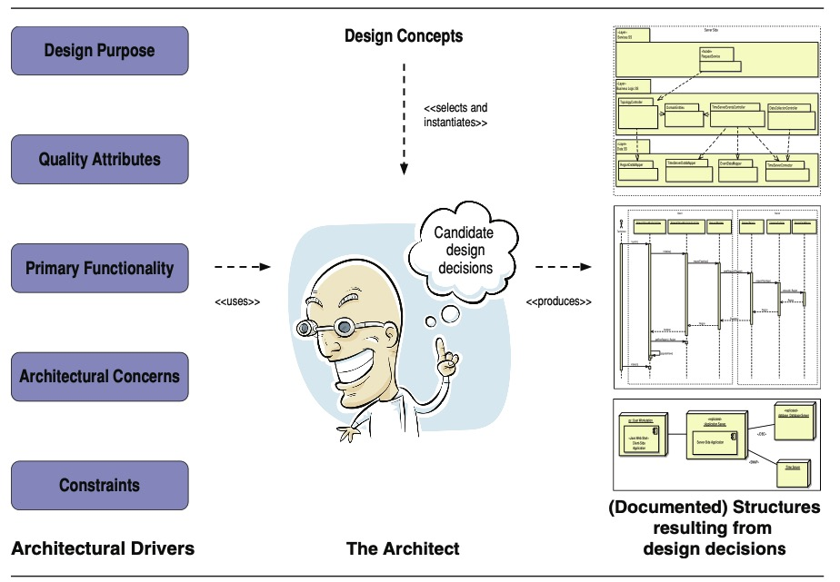

**FIGURE 2.1** Overview of the architecture design activity (Architect image © Brett Lamb | Dreamstime.com)

> **图2.1** 建筑设计活动概述(建筑师图片©Brett Lamb | Dreamstime.com)

---

Architectural design is, therefore, a key step to achieving your product and project goals.

> 因此，架构设计是实现产品和项目目标的关键步骤。

Some of these goals are technical (e.g., achieving low and predictable latency-延迟 in a video game or an e-commerce website), and some are nontechnical (e.g., keeping the workforce-劳动力,劳动人口 employed, entering a new market, meeting a deadline).

> 这些目标中有些是技术性的(例如，在视频游戏或电子商务网站中实现低且可预测的延迟)，有些是非技术性的(例如，保持劳动力就业，进入新市场，满足最后期限)。

The decisions that you, as an architect, make will have implications for the achievement of these goals and may, in some cases, be in conflict.

> 作为架构师，您所做的决定将对这些目标的实现产生影响，并且在某些情况下可能存在冲突。

The choice of a particular reference architecture (e.g., the Rich Client Application) may provide a good foundation for achieving your latency goals and will keep your workforce employed because they are already familiar with that reference architecture and its supporting technology stack.

> 选择一个特定的参考体系结构(例如，富客户端应用程序)可以为实现您的延迟目标提供一个良好的基础，并将保持您的员工被雇用，因为他们已经熟悉该参考体系结构及其支持的技术堆栈。

But this choice may not help you enter a new market—mobile games, for example.

> 但这种选择可能无法帮助你进入一个新的市场——比如手机游戏。

---

In general, when designing, a change in some structure to achieve one quality attribute will have negative-负面的 effects on other quality attributes.

> 一般来说，在设计时，为了实现一个质量属性而改变某些结构会对其他质量属性产生负面影响。

These tradeoffs-权衡,折衷 are a fact of life for every practicing architect in every domain.

> 这些权衡对于每个领域的每个执业架构师来说都是生活中的事实。

We will see this over and over again in the examples and case studies provided in this book.

> 我们将在本书提供的示例和案例研究中一次又一次地看到这一点。

Thus the architect’s job is not one of finding an *optimal* solution, but rather one of *satisficing*—searching through a potentially large space of design alternatives and decisions until an acceptable solution is found.

> 因此，建筑师的工作不是寻找一个“最优”的解决方案，而是一个“令人满意”的工作——在潜在的大空间的设计方案和决策中进行搜索，直到找到一个可接受的解决方案。

### 2.2.1 Architectural Design

> 架构设计

Grady Booch has said, “All architecture is design, but not all design is architecture”.

> Grady Booch曾说过:“所有的建筑都是设计，但并非所有的设计都是建筑。”

What makes a decision “architectural”?

> 是什么使决策成为“体系结构的”?

A decision is architectural if it has non-local-非局部 consequences *and* those consequences matter to the achievement of an architectural driver.

> 如果一个决策具有非局部结果，并且这些结果与架构驱动程序的实现有关，那么这个决策就是架构性的。

No decision is, therefore, inherently-内在地,固有地 architectural or non-architectural.

> 因此，没有决策本质上是体系结构的或非体系结构的。

The choice of a buffering strategy within a single element may have little effect on the rest of the system, in which case it is an implementation detail that is of no concern-有关,关于 to anyone except the implementer or maintainer of that element.

> 在单个元素中选择缓冲策略可能对系统的其余部分几乎没有影响，在这种情况下，除了该元素的实现者或维护者外，它是一个与任何人都无关的实现细节。

**In contrast**-相反地, the buffering strategy may have enormous-巨大的,极大的 implications for performance (if the buffering affects the achievement of latency-延迟 or through-put-吞吐量 or jitter-抖动 goals) or availability (if the buffers might not be large enough and information gets lost) or modifiability (if we wish to flexibly change the buffering strategy in different deployments or contexts).

> 相反，缓冲策略可能会对**性能**(如果缓冲影响延迟、吞吐量或抖动目标的实现)、**可用性**(如果缓冲区可能不够大而导致信息丢失)或**可修改性**(如果我们希望在不同的部署或上下文中灵活地更改缓冲策略)产生巨大影响。

The choice of a buffering strategy, like most design choices, is neither inherently architectural nor inherently non-architectural. 

> 与大多数设计选择一样，缓冲策略的选择既不是固有的体系结构，也不是固有的非体系结构。

Instead, this distinction is completely dependent on the current and anticipated-预期,预料 architectural drivers.

> 相反，这种区别完全依赖于当前和预期的架构驱动。

### 2.2.2 Element Interaction Design

> 元素交互设计

Architectural design generally results in the identification of only a subset of the elements that are part of the system’s structure. 

> 体系结构设计通常只导致识别系统结构的一部分元素的子集。

This is to be expected-期待,预计 because, during initial architectural design, the architect will focus on the primary functionality of the system.

> 这是意料之中的，因为在最初的体系结构设计期间，架构师将关注系统的主要功能。

What makes a use case primary?

> 什么使**用例**成为主要用例?

A combination of business importance, risk, and complexity considerations-考虑,斟酌 feed into this designation-名称.

> 业务重要性、风险和复杂性的综合考虑构成了这个名称。

Of course, to your users, everything is urgent and top priority.

> 当然，对你的用户来说，一切都是紧急的、最重要的。

More realistically, a small number of use cases provide the most fundamental-基本的,必不可少的 business value or represent the greatest risk (if they are done wrong), so these are deemed-认为,以为 primary.

> 更现实的情况是，少数用例提供了最基本的业务价值，或者代表了最大的风险(如果做错了)，因此这些用例被认为是主要的。

---

Every system has many more use cases, beyond-除…之外 the primary ones, that need to be satisfied.

> 除了主要的用例之外，每个系统都有更多需要满足的用例。

The elements that support these nonprimary use cases and their interfaces are identified as part of what we call *element interaction design*.

> 支持这些非主要用例及其接口的元素被确定为我们所说的**“元素交互设计”**的一部分。

This level of design usually follows architectural design.

> 这一层次的设计通常遵循建筑设计。

The location and relationships of these elements, however, are constrained by the decisions that were made during architectural design.

> 然而，这些元素的位置和关系受到架构设计决策的限制。

These elements can be units of work (i.e., modules) assigned to an individual or to a team, so this level of design is important for defining-定义 not only how nonprimary functionality is allocated, but also for planning purposes (e.g., team formation and communication, budgeting, outsourcing, release planning, unit and integration test planning).

> 这些元素可以是分配给个人或团队的工作单元(例如，模块)，因此这一层次的设计不仅对于定义如何分配非主要功能，而且对于计划目的(例如，团队组成和沟通、预算、外包、发布计划、单元和集成测试计划)都是重要的。

---

Depending on the scale-规模 and complexity of the system, the architect should be involved in element interaction design, either directly or in an auditing role.

> 根据系统的规模和复杂性，架构师应该直接或以审核角色参与元素交互设计。

This involvement ensures that the system’s important quality attributes are not compromised-损害,折中,妥协—for example, if the elements are not defined, located, and connected correctly-正确地.

> 这种参与确保了系统的重要质量属性不会受到损害——例如，如果元素没有被正确地定义、定位和连接。

It will also help the architect spot opportunities for generalization-泛化,广义化.

> 它还将帮助架构师发现泛化的机会。

### 2.2.3 Element Internals Design

> 元素内部设计

A third level-层次 of design follows element interaction design, which we call *element internals design*.

> 第三个层次的设计遵循元素交互设计，我们称之为“元素内部设计”。

In this level of design, which is usually conducted as part of the element development activities, the internals of the elements identified in the previous design level are established, so as to satisfy the element’s interface.

> 在这一层次的设计中，通常作为元素开发活动的一部分进行，建立在前一设计层次中确定的元素的内部，以满足元素的接口。

---

Architectural decisions can and do occur at the three levels of design.

> 架构决策可以并且确实发生在三个设计层次上。

Moreover, during architectural design, the architect may need to delve-钻研,探究 as deeply as element internals design to achieve a particular architectural driver.

> 此外，在架构设计期间，架构师可能需要像元素内部设计一样深入研究，以实现特定的架构驱动程序。

An example of this is the selection of a buffering-缓冲 strategy that was previously discussed.

> 这方面的一个例子是前面讨论过的缓冲策略的选择。

In this sense, architectural design can involve considerable-相当大的,相当重要的 detail, which explains why we do not like to think about it **in terms of**-从…角度来看 “high-level design” or “detailed design” (see the sidebar “Detailed Design?”).

> 从这个意义上说，架构设计可以包含相当多的细节，这就解释了为什么我们不喜欢从“高级设计”或“详细设计”的角度来考虑它(参见侧栏“详细设计?”)。

---

Architectural design precedes-先于,领先 element interaction design, which precedes element internals design.

> 架构设计先于元素交互设计，元素交互设计先于元素内部设计。

This is logically necessary: One cannot design an element’s internals until the elements themselves have been defined, and one cannot reason about interaction until several elements and some patterns of interactions among them have been defined.

> 这在逻辑上是必要的：在元素本身被定义之前，不能设计元素的内部结构；在几个元素和它们之间的一些交互模式被定义之前，不能对交互进行推理。

But as projects grow and evolve, there is, in practice, considerable iteration between these activities.

> 但是随着项目的成长和发展，在实践中，这些活动之间存在相当大的迭代。

---

> Detailed Design?
>
> 详细设计
>
> The term “detailed design” is often used to refer to the design of the internals of modules.
>
> 术语“详细设计”通常用于指模块内部的设计。
>
> Although it is widely used, we really don’t like this term, which is presented as somehow in opposition-对立,对立 to “high-level design”. 
>
> 虽然它被广泛使用，但我们真的不喜欢这个术语，因为它在某种程度上与“高级设计”相对。
>
> We prefer the more precise-精确的,准确的 terms “architectural design”, “element interaction design”, and “element internals design”.
>
> 我们更喜欢更精确的术语“架构设计”、“元素交互设计”和“元素内部设计”。
>
> ---
>
> After all, architectural design may be quite detailed, if your system is complex.
>
> 毕竟，如果您的系统很复杂，那么体系结构设计可能会非常详细。
>
> And some design “details” will turn out to be architectural.
>
> 一些设计“细节”最终会变成架构。
>
> For the same reason, we also don’t like the terms “high-level design” and “low-level design”.
>
> 出于同样的原因，我们也不喜欢“高级设计”和“低级设计”这两个术语。
>
> Who can really know what these terms actually mean?
>
> 谁能真正知道这些术语的真正含义呢?
>
> Clearly, “high-level design” should be somehow-以某种方式,用某种方法 “higher” or more abstract, and cover more of the architectural landscape than “low-level design”, but beyond that we are at a loss to imbue-灌输,侵染 these terms with any precise meaning.
>
> 显然，“高级设计”应该在某种程度上“更高”或更抽象，并且比“低级设计”涵盖更多的建筑景观，但除此之外，我们无法为这些术语注入任何精确的含义。
>
> ---
>
> So here is what we recommend: Just avoid using terms such as “high”, “low”, or “detailed” altogether-完全的,总之.
>
> 所以我们的建议是：完全避免使用诸如“高”、“低”或“详细”之类的术语。
>
> There is always a better, more precise choice, such as “architectural”, “element interaction”, or “element internals” design!
>
> 总是有更好、更精确的选择，比如“架构”、“元素交互”或“元素内部”设计!
>
> ---
>
> Think carefully about the impact of the decisions you are making, the information that you are trying to convey in your design documentation, and the likely audience-受众 for that information, and then give that process an appropriate, meaningful name.
>
> 仔细考虑你所做的决定的影响，你试图在设计文档中传达的信息，以及这些信息的可能受众，然后给这个过程起一个合适的、有意义的名字。

## 2.3 Why Is Architectural Design So Important?

> 为什么架构设计如此重要？

There is a very high cost to a project of *not* making certain-特定的 design decisions, or of not making them early enough.

> 没有做出特定的设计决策，或者没有尽早做出这些决策，对项目来说成本是非常高的。

This manifests-显示,表明 itself in many different ways.

> 这表现在许多不同的方面。

Early on, an initial architecture is critical for project proposals (or, as it is sometimes called in the consulting world, the *pre-sales process*).

> 在早期，初始架构对于项目提案(或者，在咨询界有时被称为“售前流程”)是至关重要的。

Without doing some architectural thinking and some early design work, you cannot confidently predict project cost, schedule, and quality.

> 如果不进行一些架构思考和一些早期设计工作，您就无法自信地预测项目成本、进度和质量。

Even at this early stage, an architecture will determine the key approaches for achieving architectural drivers, the gross-总的 work-breakdown structure, and the choices of tools, skills, and technologies needed to realize the system.

> 即使在这个早期阶段，体系结构也将决定实现体系结构驱动的关键方法、总体工作分解结构，以及实现系统所需的工具、技能和技术的选择。

---

In addition, architecture is a key enabler-促成者,赋能者 of agility-敏捷, as we will discuss in Chapter 9.

> 此外，架构是敏捷性的关键推动者，我们将在第9章中讨论。

Whether your organization has embraced Agile processes or not, it is difficult to imagine anyone who would willingly-愿意地,乐意地 choose an architecture that is brittle-脆弱的 and hard to change or extend or tune-调整—and yet it happens all the time.

> 无论您的组织是否采用了敏捷过程，很难想象会有人愿意选择一个脆弱且难以更改、扩展或调优的体系结构——然而这种情况一直在发生。

This so-called *technical debt-债务* occurs for a variety of reasons, but paramount-至为重要的 among these is the combination of a focus on features—typically driven by stakeholder demands—and the inability of architects and project managers to measure the return on investment of good architectural practices.

> 这种所谓的“技术债务”的出现有多种原因，但其中最重要的是对特性的关注——通常是由涉众需求驱动的——以及架构师和项目经理无法衡量良好架构实践的投资回报。

Features provide immediate benefit.

> 功能提供直接的好处。

Architectural improvement provides immediate costs and long-term benefits.

> 架构改进提供了即时成本和长期收益。

Put this way, why would anyone ever “invest” in architecture?

> 换句话说，为什么会有人“投资”架构?

The answer is simple: Without architecture, the benefits that the system is supposed to bring will be far harder to realize.

> 答案很简单:没有架构，系统应该带来的好处将很难实现。

---

Simply put, if you do not make some key architectural decisions early and if you allow your architecture to degrade, you will be unable to maintain sprint-冲刺 velocity-速度, because you cannot easily respond to change requests.

> 简单地说，如果您不尽早做出一些关键的体系结构决策，并且允许您的体系结构降级，那么您将无法保持冲刺速度，因为您无法轻松地响应更改请求。

However, we vehemently-竭尽全力地,强烈地 disagree with what the original creators of the Agile Manifesto claimed: “The best architectures, requirements, and designs emerge from self-organizing teams”.

> 然而，我们强烈反对敏捷宣言的最初创建者所宣称的:“最好的架构、需求和设计来自自组织团队”。

Indeed-实际上, our demurral-异议 with this point is precisely why we have written this book.

> 事实上，我们对这一点的异议正是我们写这本书的原因。

Good architectural design is difficult (and still rare), and it does not just “emerge”.

> 好的架构设计是困难的(而且仍然很少见)，它不会凭空出现。

This opinion mirrors-反映,反射 a growing consensus-一致看法,共识 within the Agile community.

> 这个观点反映了敏捷社区中越来越多的共识。

More and more, we see techniques such as “disciplined agility at scale”, the “walking skeleton”, and the “scaled Agile framework” embraced by Agile thought leaders and practitioners alike.

> 我们越来越多地看到“大规模的有纪律的敏捷”、“行走的骨架”和“规模化的敏捷框架”等技术被敏捷思想领袖和实践者所接受。

Each of these techniques advocates-提倡,拥护 some architectural thinking and design prior to much, if any, development.

> 这些技术中的每一种都主张在开发之前进行一些架构思考和设计。

To reiterate-重申,反复说, architecture enables agility, and not the other way around.

> 重申一下，架构支持敏捷性，而不是相反。

---

Furthermore-此外,而且, the architecture will influence, but not determine, other decisions that are not in and of themselves design decisions.

> 此外，体系结构将影响(但不决定)其他本身不属于设计决策的决策。

These decisions do not influence the achievement of quality attributes directly, but they may still need to be made by the architect.

> 这些决定并不直接影响质量属性的实现，但是它们可能仍然需要由架构师做出。

For example, such decisions may include selection of tools; structuring the development environment; supporting releases, deployment, and operations; and making work assignments.

> 例如，这些决策可能包括工具的选择；构建开发环境；支持发布、部署和操作；以及分配工作任务。

---

Finally, a well-designed, properly communicated architecture is key to achieving *agreements* that will guide the team.

> 最后，设计良好、沟通良好的体系结构是达成指导团队的“协议”的关键。

The most important kinds to make are agreements on interfaces and on shared resources.

> 最重要的协议是关于接口和共享资源的协议。

Agreeing on interfaces early is important for component-based development, and critically important for distributed development.

> 尽早就接口达成一致对于基于组件的开发非常重要，对于分布式开发更是至关重要。

These decisions *will* be made sooner-更快地,更早地 or later.

> 这些决定迟早会做出。

If you don’t make the decisions early, the system will be much more difficult to integrate.

> 如果你不尽早做出决定，系统将很难整合。

In Section 3.6, we will discuss how to define interfaces as part of architectural design—both the external interfaces to other systems and the internal interfaces that mediate-调解 your element interactions.

> 在第3.6节中，我们将讨论如何将接口定义为架构设计的一部分——包括到其他系统的外部接口和调解元素交互的内部接口。

## 2.4 Architectural Drivers

> 架构驱动

Before commencing-开始,着手 design with ADD (or with any other design method, for that matter), you need to think about what you are doing and why.

> 在开始用ADD进行设计之前(或者其他设计方法)，你需要考虑你在做什么以及为什么。

While this statement may seem blindingly-极其地,非常 obvious-明显的,显然的, the devil is, as usual, in the details.

> 虽然这句话似乎是显而易见的，但一如既往，细节才是关键。

We categorize these “what” and “why” questions as architectural drivers.

> 我们将这些“是什么”和“为什么”的问题归类为架构驱动。

As shown in Figure 2.1, these drivers include a design purpose, quality attributes, primary functionality, architectural concerns, and constraints.

> 如图2.1 所示，这些驱动包括设计目的、质量属性、主要功能、体系结构关注和约束。

These considerations-考虑,斟酌 are critical to the success of the system and, as such, they *drive* and shape the architecture.

> 这些考虑对于系统的成功至关重要，因此，它们“驱动”并塑造了体系结构。

---

As with any other important requirements, architectural drivers need to be baselined-基线,基准 and managed throughout the development life cycle.

> 与任何其他重要需求一样，架构驱动程序需要在整个开发生命周期中进行基线化和管理。

### 2.4.1 Design Purpose

First, you need to be clear about the purpose of the design that you want to achieve.

> 首先，您需要明确想要实现的设计目的。

When and why are you doing this architecture design?

> 什么时候以及为什么要做这个架构设计?

Which business goals is the organization most concerned about at this time?

> 此时组织最关心的业务目标是什么?

1. You may be doing architecture design as part of a project proposal (for the pre-sales process in a consulting organization, or for internal project selection and prioritization in a company, as discussed in Section 9.1.1).

   > 您可能将架构设计作为项目提案的一部分(用于咨询机构的售前流程，或用于公司的内部项目选择和优先级排序，如第9.1.1节所述)。

   It is not uncommon that, as part of determining project feasibility-可行性,可能性, schedule, and budget, an initial architecture is created. 

   > 作为确定项目可行性、进度和预算的一部分，创建初始架构是很常见的。

   Such an architecture would not be very detailed; its purpose is to understand and break down the architecture in sufficient-足够的,充足的 detail that the units of work are understood and hence-因此,之后 may be estimated.

   > 这样的架构不会非常详细；它的目的是充分详细地理解和分解体系结构，以便理解工作单元，从而可以对其进行估计。

2. You may be doing architecture design as part of the process of creating an exploratory-探索性,勘探的,考察的 prototype-原型.

   > 您可能将架构设计作为创建探索性原型过程的一部分。

   In this case, the purpose of the architecture design process is not so much to create a releasable or reusable system, but rather to explore the domain, to explore new technology, to place something executable in front of a customer to elicit-引出,得到 rapid-快速的 feedback, or to explore some quality attribute (such as performance scalability or failover-故障转移 for availability).

   > 在这种情况下，架构设计过程的目的不是创建一个可发布或可重用的系统，而是探索领域，探索新技术，在客户面前放置一些可执行的东西以获得快速反馈，或者探索一些质量属性(例如性能可伸缩性或可用性故障转移)。

3. You may be designing your architecture during development.

   > 您可能在开发期间设计您的体系结构。

   This could be for an entire new system, for a substantial-大量的 portion-一部分 of a new system, or for a portion of an existing system that is being refactored or replaced.

   > 这可能是针对整个新系统，针对新系统的大部分，或者针对正在重构或替换的现有系统的一部分。

   In this case, the purpose is to do enough design work to satisfy requirements, guide system construction and work assignments, and prepare for an eventual-最终的,最后的 release.

   > 在这种情况下，目的是做足够的设计工作来满足需求，指导系统构建和工作分配，并为最终的发布做准备。

---

These purposes may be interpreted-解释,说明 and realized differently for greenfield-市郊绿区 systems in mature-成熟的,理智的 domains, for greenfield systems in novel-新颖的,珍奇的 domains, and for existing systems.

> 对于成熟领域的绿地系统、新领域的绿地系统和现有系统，这些目的可能有不同的解释和实现方式。

In a mature-成熟的,理智的 domain, the pre-sales process, for example, might be relatively straightforward-简单的,易懂的; the architect can reuse existing systems as examples and confidently make estimates based on analogy-类比,比拟.

> 例如，在成熟的领域，售前流程可能相对简单;架构师可以重用现有的系统作为示例，并基于类比自信地做出估计。

In novel domains, the pre-sales estimation process will be far more complex and risky, and may have highly variable-易变的,可变的 results.

> 在新的领域，售前评估过程将更加复杂和有风险，并且可能有高度可变的结果。

In these circumstances-条件,情况, a prototype of the system, or a key part of the system, may need to be created to mitigate risk and reduce uncertainty.

> 在这些情况下，可能需要创建系统的原型，或者系统的关键部分，以减轻风险和减少不确定性。

In many cases, this architecture may also need to be quickly adapted as new requirements are learned and embraced.

> 在许多情况下，随着新的需求被了解和接受，这个体系结构可能还需要快速调整。

In brownfield-棕色地带 systems, while the requirements are better understood, the existing system is itself a complex object that must be well understood for planning to be accurate-准确的,精确的.

> 在棕地系统中，虽然需求得到了更好的理解，但现有系统本身是一个复杂的对象，必须很好地理解才能进行准确的规划。

---

Finally, the development organization’s goals during development or maintenance may affect the architecture design process. 

> 最后，开发组织在开发或维护期间的目标可能会影响体系结构设计过程。

For example, the organization might be interested in designing for reuse, designing for future extension or subsetting, designing for scalability, designing for continuous delivery, designing to best utilize existing project capabilities and team member skills, and so forth.

> 例如，组织可能对为重用而设计、为将来的扩展或子集而设计、为可伸缩性而设计、为持续交付而设计、为最好地利用现有项目能力和团队成员技能而设计等感兴趣。

Or the organization might have a strategic-战略的,策略的 relationship with a vendor.

> 或者组织可能与供应商有战略关系。

Or the CIO might have a specific like or dislike and wants to impose-强制推行,强制实行 it on your project.

> 或者CIO可能有特定的喜欢或不喜欢，并希望将其强加于您的项目。

---

Why do we bother to list these considerations?

> 为什么我们要费心列出这些考虑因素呢?

Because they *will* affect both the process of design and the outputs of design.

> 因为它们将影响设计的过程和设计的输出。

Architectures exist to help achieve business goals.

> 架构的存在是为了帮助实现业务目标。

The architect should be clear about these goals and should communicate them (and negotiate-协商 them!) and establish a clear design purpose *before* beginning the design process.

> 架构师应该清楚这些目标，并在开始设计过程之前与他们沟通(和协商!)并建立一个明确的设计目的。

### 2.4.2 Quality Attributes

> 质量属性

In the book *Software Architecture in Practice*, *quality attributes* are defined as being measurable or testable properties of a system that are used to indicate how well the system satisfies the needs of its stakeholders.

> 在《实践中的软件架构》一书中，质量属性被定义为系统的可测量或可测试的属性，用于指示系统满足涉众需求的程度。

Because quality tends to be a subjective-个人的,主观的 concept in itself, these properties allow quality to be expressed succinctly-简洁地,简便地 and objectively-客观地.

> 因为质量本身往往是一个主观概念，这些属性允许质量被简洁客观地表达。

---

Among the drivers, quality attributes are the ones that shape the architecture the most significantly.

> 在驱动因素中，质量属性是最显著地塑造体系结构的因素。

The critical choices that you make when you are doing architectural design determine, in large part, the ways that your system will or will not meet these driving quality attribute goals.

> 在进行架构设计时，您所做的关键选择在很大程度上决定了您的系统是否能够满足这些驱动质量属性目标。

---

Given their importance, you must worry about eliciting-引出,得到, specifying-明确指出,具体说明, prioritizing, and validating quality attributes.

> 考虑到它们的重要性，您必须考虑如何引出、指定、确定优先级和验证质量属性。

Given that so much depends on getting these drivers right, this sounds like a daunting-使人畏惧的,使人气馁的 task.

> 考虑到这很大程度上取决于这些驱动程序的正确性，这听起来像是一项艰巨的任务。

Fortunately, a number of well-understood, widely disseminated-散布,传播 techniques can help you here (see sidebar “The Quality Attribute Workshop and the Utility Tree”):

> 幸运的是，许多广为理解、广泛传播的技术可以在这里帮助您(参见侧栏“质量属性研讨会和实用工具树”):

- Quality Attribute Workshop (QAW) is a facilitated-便利,促进 brainstorming session involving a group of system stakeholders that covers the bulk-主体,大部分 of the activities of eliciting, specifying, prioritizing, and achieving consensus on quality attributes.

  > 质量属性研讨会(QAW)是一个便利的头脑风暴会议，涉及一组系统涉众，涵盖了关于质量属性的引出、指定、优先排序和达成共识的大量活动。

- Mission Thread Workshop serves the same purpose as QAW, but for a system of systems.

  > Mission Thread Workshop 的目的与QAW相同，但它是一个系统的系统。

- The Utility Tree can be used by the architect to prioritize quality attribute requirements according to their technical difficulty and risk.

  > 架构师可以使用效用树根据技术难度和风险对质量属性需求进行优先排序。

---

We believe that the best way to discuss, document, and prioritize quality attribute requirements is as a set of scenarios.

> 我们相信讨论、记录和确定质量属性需求的优先级的最好方法是作为一组场景。

A *scenario*, in its most basic form, describes the system’s response to some stimulus-刺激,激励.

> 一个“场景”，在其最基本的形式中，描述了系统对某些刺激的反应。

Why are scenarios the best approach?

> 为什么场景是最好的方法?

Because all other approaches are worse-更糟的,更坏的!

> 因为其他方法都更糟!

Endless time may be wasted in defining terms such as “performance” or “modifiability” or “configurability”, as these discussions tend to shed little light on the real system.

> 在定义诸如“性能”或“可修改性”或“可配置性”之类的术语上可能会浪费大量的时间，因为这些讨论往往对实际系统没有什么帮助。

It is meaningless to say that a system will be “modifiable”, because every system is modifiable with respect to some changes and not modifiable with respect to others.

> 说一个系统将是“可修改的”是没有意义的，因为每个系统都是可修改的，相对于一些变化，而不是相对于其他变化。

One can, however, specify the modifiability response measure you would like to achieve (say, elapsed-消逝 time or effort) in response to a specific change request.

> 但是，可以指定响应特定更改请求时想要实现的可修改性响应度量(例如，经过的时间或工作量)。

For example, you might want to specify that “a change to update shipping rates on the e-commerce website is completed and tested in less than 1 person-day of effort”—an unambiguous-清晰的,清楚的 criterion-标准,准则.

> 例如，您可能希望指定“在电子商务网站上更新运费的更改在不到1个人/天的时间内完成和测试”——这是一个明确的标准。

---

The heart of a quality attribute scenario, therefore, is the pairing of a stimulus-刺激,激励 with a response.

> 因此，质量属性场景的核心是刺激与反应的配对。

Suppose-推断,假设 that you are building a video game and you have a functional requirement like this: “The game shall-将要,将会 change view modes when the user presses the <**C**> button”.

> 假设你正在制作一款电子游戏，你有这样的功能需求:“当用户按下<**C**>按钮时，游戏将改变视图模式”。

This functional requirement, if it is important, needs to be associated with quality attribute requirements.

> 这个功能需求，如果它很重要的话，需要与质量属性需求联系起来。

For example:

- How fast should the function be?

  > 函数应该有多快?

- How secure should the function be?

  > 功能应该有多安全?

- How modifiable should the function be?

  > 函数的可修改性应该如何?

---

To address this problem, we use a scenario to describe a quality attribute requirement.

> 为了解决这个问题，我们使用一个场景来描述质量属性需求。

A quality attribute scenario is a short description of how a system is required to respond to some stimulus-刺激,激励.

> 质量属性场景是对系统如何响应某些刺激的简短描述。

For example, we might annotate the functional requirement given earlier as follows: “The game shall change view modes in < 500 ms when the user presses the <**C**> button”.

> 例如，我们可以将前面给出的功能需求注释为：“当用户按下<**C**>按钮时，游戏将在 <500 ms 内改变视图模式”。

A scenario associates a stimulus (in this case, the pressing of the <**C**> button) with a response (changing the view mode) that is measured using a response measure (< 500 ms).

> 场景将刺激(在本例中，按<**C**>按钮)与使用响应测量(< 500 ms)测量的响应(改变视图模式)相关联。

A complete-完整的 quality attribute scenario adds three other parts: the source of the stimulus (in this case, the user), the artifact affected (in this case, because we are dealing with end-to-end latency, the artifact is the entire system) and the environment (are we in normal operation, startup, degraded-降级 mode, or some other mode?).

> 一个完整的质量属性场景添加了另外三个部分：刺激源(在本例中是用户)、受影响的工件(在本例中，因为我们处理的是端到端延迟，工件是整个系统)和环境(我们是处于正常操作、启动、降级模式还是其他模式?)

In total, then, there are six parts of a completely-完全地,彻底地 well-specified scenario, as shown in Figure 2.2.

> 那么，一个完全明确指定的场景总共有六个部分，如图2.2所示。

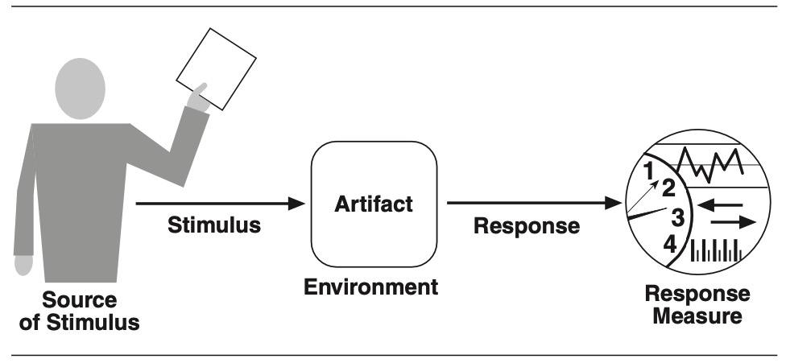

**FIGURE 2.2** The six parts of a quality attribute scenario

> 图 2.2 质量属性场景的六个部分

---

Scenarios are testable*, falsifiable-可以被检验的 hypotheses-假设,假定* about the quality attribute behavior of the system under consideration.

> 场景是关于所考虑的系统的质量属性行为的可测试的、可证伪的假设。

Because they have explicit-明确的,直截了当的 stimuli and responses, we can evaluate a design **in terms of**-从...角度来看 how likely it is to support the scenario, and we can take measurements and test a prototype or fully fleshed-out-充实的 system for whether it satisfies the scenario in practice.

> 因为他们有明确的刺激和反应，我们可以根据它支持场景的可能性来评估设计，我们可以测量和测试原型或完全充实的系统，以确定它是否在实践中满足场景。

If the analysis (or prototyping results) indicates that the scenario’s response goal cannot be met, then the hypothesis is deemed-认为,相信 falsified-伪造,篡改.

> 如果分析(或原型结果)表明场景的响应目标不能满足，那么假设就被认为是伪造的。

---

As with other requirements, scenarios should be prioritized.

> 与其他需求一样，应该对场景进行优先排序。

This can be achieved by considering two dimensions-方面,部分 that are associated with each scenario and that are assigned a rank of importance:

> 这可以通过考虑与每个场景相关并按重要性排序的两个维度来实现:

- The first dimension corresponds-类似于,相当于 to the importance of the scenario with respect to the success of the system.

  > 第一个维度对应于场景相对于系统成功的重要性。

  This is ranked by the customer.

  > 这是由客户排序的。

- The second dimension corresponds to the degree of technical risk associated with the scenario.

  > 第二个维度对应于与场景相关的技术风险程度。

  This is ranked by the architect.

  > 这是由建筑师排名的。

---

A low/medium/high (L/M/H) scale is used to rank both dimensions-维度.

> 使用低/中/高(L/M/H)量表对这两个维度进行排序。

Once the dimensions have been ranked, scenarios are prioritized by selecting those that have a combination of (H, H), (H, M), or (M, H) rankings.

> 维度排序完成后，通过选择具有(H, H)、(H, M)或(M, H)排序组合的场景，对场景进行优先级排序。

---

In addition, some traditional requirements elicitation-引出,诱出 techniques can be modified slightly to focus on quality attribute requirements, such as Joint Requirements Planning (JRP), Joint Application Design (JAD), discovery prototyping, and accelerated-加快,促进 systems analysis.

> 此外，一些传统的需求激发技术可以稍加修改，以关注质量属性需求，例如联合需求计划(JRP)、联合应用程序设计(JAD)、发现原型和加速系统分析。

---

But whatever technique you use, *do not* start design without a prioritized list of measurable quality attributes!

> 但无论你使用何种技术，在没有可衡量的质量属性的优先级列表的情况下，*不要*开始设计!

While stakeholders might plead-以…为理由 ignorance-无知,愚昧 (“I don’t know how fast it needs to be; just make it fast!”), you can almost always elicit at least a range of possible responses.

> 虽然利益相关者可能会以无知为借口(“我不知道它需要多快;只要快一点!”)，你几乎总能引出至少一系列可能的回答。

Instead of saying the system should be “fast”, ask the stakeholder if a 10-second response time is acceptable.

> 与其说系统应该“快”，不如问涉众10秒的响应时间是否可以接受。

If that is unacceptable, ask if 5 seconds is OK, or 1 second.

> 如果不能接受，询问5秒还是1秒可以。

You will find that, in most cases, users know more than they realize about their requirements, and you can at least “**box them in**-限制” to a range.

> 您将发现，在大多数情况下，用户知道的比他们意识到的要多，您至少可以将他们“限制”在一个范围内。

---

> The Quality Attribute Workshop and the Utility Tree
>
> 质量属性车间和效用树
>
> **The Quality Attribute Workshop (QAW)**
>
> 质量属性车间 - QAW
>
> The QAW is a facilitated-使容易,使便利, stakeholder-focused method to generate, prioritize, and refine-细化,精炼 quality attribute scenarios.
>
> QAW是一种方便的、以涉众为中心的方法，用于生成、确定优先级并细化质量属性场景。
>
> A QAW meeting is ideally-理想地,观念上地 enacted before the software architecture has been defined although, in practice, we have seen the QAW being used at all points in the software development life cycle.
>
> 虽然在实践中，我们已经看到QAW在软件开发生命周期的所有阶段都被使用，但理想情况下，在定义软件体系结构之前应该召开一次QAW会议。
>
> The QAW is focused on system-level concerns and specifically the role that software will play in the system.
>
> QAW关注的是系统级问题，特别是软件在系统中所扮演的角色。
>
> The steps of the QAW are as follows:
>
> QAW的步骤如下:
>
> 1. QAW Presentation-演示 and Introductions
>
>    > QAW演示和介绍
>
>    The QAW facilitators describe the motivation for the QAW and explain each step of the method.
>
>    > QAW促进者描述了QAW的动机，并解释了方法的每个步骤。
>
> 2. Business Goals Presentation
>
>    > 业务目标展示
>
>    A stakeholder representing the project’s business concerns presents the system’s business context, broad functional requirements, constraints, and known quality attribute requirements.
>
>    > 涉众表示项目的业务关注点，表示系统的业务上下文、广泛的功能需求、约束和已知的质量属性需求。
>
>    The quality attributes that will be refined in later QAW steps will be derived-衍生 from, and should be traceable to, the business goals presented in this step.
>
>    > 将在后面的QAW步骤中细化的质量属性将派生于此步骤中呈现的业务目标，并且应该可追溯到此目标。
>
>    For this reason, these business goals must be prioritized.
>
>    > 出于这个原因，必须对这些业务目标进行优先排序。
>
> 3. Architectural Plan Presentation
>
>    > 架构计划展示
>
>    The architect presents the system architectural plans as they currently exist.
>
>    > 架构师呈现当前存在的系统架构计划。
>
>    Although the architecture has frequently-经常地,频繁地 not been defined yet (particularly for greenfield systems), the architect often knows quite a lot about it even at this early stage.
>
>    > 尽管架构通常还没有被定义(特别是对于未开发的系统)，架构师通常甚至在这个早期阶段就对它有相当多的了解。
>
>    For example, the architect might already know about technologies that are mandated-授权,委托, other systems that this system must interact with, standards that must be followed, subsystems or components that could be reused, and so forth.
>
>    > 例如，架构师可能已经知道强制的技术、该系统必须与之交互的其他系统、必须遵循的标准、可以重用的子系统或组件，等等。
>
> 4. Identification of Architectural Drivers
>
>    > 架构驱动因素的识别
>
>    The facilitators share their list of key architectural drivers that they assembled-组装 during steps 2 and 3 and ask the stakeholders for clarifications-澄清,阐明, additions, deletions, and corrections-改正,修正.
>
>    > 促进者分享他们在步骤2和步骤3中组装的关键架构驱动程序列表，并要求涉众进行澄清、添加、删除和更正。
>
>    The idea here is to reach a consensus on a distilled-提炼,升华 list of architectural drivers that covers major functional requirements, business drivers, constraints, and quality attributes.
>
>    > 这里的想法是在涵盖主要功能需求、业务驱动、约束和质量属性的架构驱动的精炼列表上达成共识。
>
> 5. Scenario Brainstorming
>
>    > 场景的头脑风暴
>
>    Given this context, each stakeholder now has the opportunity to express a scenario representing that stakeholder’s needs and desires with respect to the system.
>
>    > 在此背景下，每个涉众现在都有机会表达一个场景，表示涉众对系统的需求和愿望。
>
>    The facilitators ensure that each scenario has an explicit-清楚明白的,明确的 stimulus-刺激,激励 and response.
>
>    > 促进者确保每个场景都有明确的刺激和反应。
>
>    The facilitators also ensure traceability and completeness-完整,完全: At least one representative scenario should exist for each architectural driver listed in step 4 and should cover all the business goals listed in step 2.
>
>    > 促进者还确保可跟踪性和完整性:对于步骤4中列出的每个体系结构驱动程序，至少应该存在一个代表性场景，并且应该涵盖步骤2中列出的所有业务目标。
>
> 6. Scenario Consolidation-巩固,合并
>
>    > 场景整合
>
>    Similar scenarios are consolidated where reasonable-合理.
>
>    > 在合理的地方合并类似的场景。
>
>    In step 7, the stakeholders vote-投票 for their favorite scenarios, and consolidation helps to prevent-阻止,阻碍 votes from being spread-分散 across several scenarios that are expressing essentially the same concern.
>
>    > 在步骤7中，涉众对他们最喜欢的场景进行投票，合并有助于防止投票分散到表达本质上相同关注的几个场景中。
>
> 7. Scenario Prioritization
>
>    > 场景中优先级
>
>    Prioritization of the scenarios is accomplished by allocating to each stakeholder a number of votes equal to 30 percent of the total number of scenarios.
>
>    > 场景的优先级排序是通过向每个涉众分配相当于场景总数30%的选票来完成的。
>
>    The stakeholders can distribute these votes to any scenario or scenarios.
>
>    > 涉众可以将这些投票分配给任何一个或多个场景。
>
>    Once all the stakeholders have voted, the results are tallied-统计 and the scenarios are sorted in order of popularity-受欢迎.
>
>    > 一旦所有利益相关者都投票了，结果就会被统计出来，并按照受欢迎程度对场景进行排序。
>
> 8. Scenario Refinement
>
>    > 场景细化
>
>    The highest-priority scenarios are refined and elaborated-详细说明,详尽阐述.
>
>    > 对最高优先级的场景进行了细化和阐述。
>
>    The facilitators help the stakeholders express these in the form of six-part scenarios: source, stimulus-刺激,激励, artifact, environment, response, and response measure.
>
>    > 促进者帮助涉众以六部分场景的形式表达这些内容:源、刺激、工件、环境、响应和响应度量。
>
> The output of the QAW is therefore-因此,所以 a prioritized list of scenarios, aligned with business goals, where the highest-priority scenarios have been explored and refined.
>
> > 因此，QAW的输出是与业务目标一致的场景的优先级列表，其中已经探索和改进了最高优先级的场景。
>
> A QAW can be conducted in as little as 2–3 hours for a simple system or as part of an iteration, and as much as 2 days for a complex system where requirements completeness is a goal.
>
> > 对于一个简单的系统或作为迭代的一部分，QAW 可以在2 - 3小时内完成，对于一个以需求完整性为目标的复杂系统，QAW 可以在2天内完成。
>
> ---
>
> **Utility Tree**
>
> > 效用树
>
> If no stakeholders are readily available to consult, you still need to decide what to do and how to prioritize the many challenges facing the system.
>
> > 如果没有现成的涉众可以咨询，您仍然需要决定要做什么，以及如何确定系统面临的许多挑战的优先级。
>
> One way to organize your thoughts-想法,看法 is to create a Utility Tree.
>
> > 组织思想的一种方法是创建一个工具树。
>
> The Utility Tree, such as the one shown in the following figure, helps to articulate-明确表达,清楚说明 your quality attribute goals in detail, and then to prioritize them.
>
> > 效用树(Utility Tree)，如下图所示，有助于详细阐明您的质量属性目标，然后对它们进行优先排序。
>
> 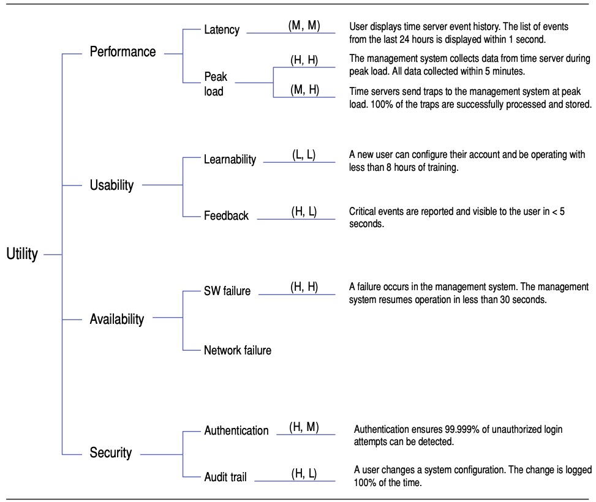
>
> It works as follows.
>
> > 它的工作原理如下。
>
> First write the word “**Utility**” on a sheet of paper.
>
> > 首先在一张纸上写下“效用”这个词。
>
> Then write the various quality attributes that constitute-组成,构成 utility for your system.
>
> > 然后写出构成系统效用的各种质量属性。
>
> For example, you might know, based on the business goals for the system, that the most important qualities for the system are that the system be fast, secure, and easy to modify.
>
> > 例如，您可能知道，基于系统的业务目标，系统最重要的品质是系统快速、安全且易于修改。
>
> In turn, you would write these words underneath “Utility”.
>
> > 然后，在“效用”下面写上这些字。
>
> ---
>
> Next, because we don’t really know what any of those terms actually means, we describe the aspect of the quality attribute that we are most concerned with.
>
> > 接下来，因为我们并不真正知道这些术语的真正含义，所以我们描述了我们最关心的质量属性的方面。
>
> For example, while “performance” is vague-不明确的,不清楚的, “latency of database transactions” is a bit less vague.
>
> > 例如，虽然“性能”是模糊的，但“数据库事务的延迟”就不那么模糊了。
>
> Likewise-同样地,类似地, while “modifiability” is vague, “ease of adding new codecs-编码器” is a bit less vague.
>
> > 同样，虽然“可修改性”是模糊的，但“添加新编解码器的便利性”就不那么模糊了。
>
> ---
>
> The leaves-树叶,叶片 of the tree are expressed as scenarios, which provide concrete-具体的 examples of the quality attribute considerations that you just enumerated-列举,枚举.
>
> > 树的叶子表示为场景，这些场景提供了您刚刚列举的质量属性考虑的具体示例。
>
> For example, for “latency of database transactions”, you might create a scenario such as “1000 users simultaneously update their own customer records under normal conditions with an average-平均 latency of 1 second”.
>
> > 例如，对于“数据库事务的延迟”，您可以创建这样一个场景：“在正常情况下，1000个用户同时更新他们自己的客户记录，平均延迟为1秒”。
>
> For “ease of adding new codecs”, you might create a scenario such as “Customer requests that a new custom codec be added to the system.
>
> > 为了“易于添加新的编解码器”，您可以创建一个场景，例如“客户请求向系统添加一个新的自定义编解码器”。
>
> Codec is added with no **side effects**-副作用 in 2 person-weeks of effort”.
>
> > 添加编解码器，在2人周的努力中没有副作用”。
>
> ---
>
> Finally, the scenarios that you have created must be prioritized.
>
> > 最后，必须对您创建的场景进行优先级排序。
>
> We do this prioritization by using the technique of ranking across two dimensions-维度, resulting in a priority matrix such as the following (where the numbers in the cells are from a set of system scenarios).
>
> > 我们通过使用跨两个维度的排序技术来实现这种优先级排序，从而产生如下所示的优先级矩阵(其中单元格中的数字来自一组系统场景)。
>
> 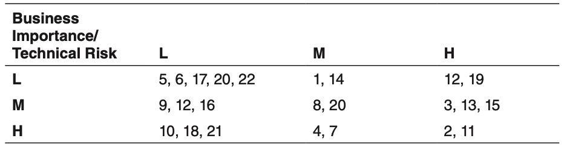
>
> Our job, as architects, is to focus on the **lower-right-hand**-右下方 portion of this table (H, H): those scenarios that are of high business importance and high risk.
>
> > 作为架构师，我们的工作是关注该表的右下角部分(H, H)：那些具有高业务重要性和高风险的场景。
>
> Once we have satisfactorily addressed those scenarios, we can move to the (M, H) or (H, M) ones, and then move up and to the left until all of the system’s scenarios are addressed (or perhaps until we run out of time or budget, as is often the case).
>
> > 一旦我们满意地处理了这些场景，我们就可以移动到(M, H)或(H, M)场景，然后向上移动并向左移动，直到解决了系统的所有场景(或者可能直到我们耗尽了时间或预算，这是经常发生的情况)。
>
> ---
>
> It should be noted that the QAW and the Utility Tree are two different techniques that are aimed at the same goal—eliciting-引出,得到 and prioritizing the most important quality attribute requirements, which will be some of your most critical architectural drivers.
>
> > 应该注意的是，QAW 和 Utility Tree 是两种不同的技术，它们的目标是相同的——引出最重要的质量属性需求并对其进行优先级排序，这将是您最关键的体系结构驱动因素。
>
> There is no reason, however, to choose between these techniques.
>
> > 然而，没有理由在这些技术之间做出选择。
>
> Both are useful and valuable and, in our experience, they have complementary-相互补充的 strengths-优势: The QAW tends to focus more on the requirements of external stakeholders, whereas the Utility Tree tends to excel at eliciting the requirements of internal stakeholders.
>
> > 两者都是有用和有价值的，并且，根据我们的经验，它们具有互补的优势：QAW倾向于更多地关注外部涉众的需求，而效用树倾向于引出内部涉众的需求。
>
> Making all of these stakeholders happy will go a long way toward ensuring the success of your architecture.
>
> > 让所有涉众满意将大大有助于确保您的体系结构的成功。

### 2.4.3 Primary Functionality

> 主要功能

Functionality is the ability of the system to do the work for which it was intended-预期的,想要的.

> 功能是系统完成预期工作的能力。

As opposed-相反的 to quality attributes, the way the system is structured does not normally-通常,平常 influence functionality.

> 与质量属性相反，系统的结构方式通常不会影响功能。

You can have all of the functionality of a given system coded in a single enormous-巨大的,极大的 module, or you can have it neatly-整齐地 distributed across many smaller, highly cohesive modules.

> 您可以将给定系统的所有功能编码在单个巨大的模块中，也可以将其整齐地分布在许多较小的、高度内聚的模块中。

Externally the system will look and work the same way if you consider only functionality.

> 从外部看，如果只考虑功能，系统的外观和工作方式是一样的。

What matters, though, is what happens when you want to make changes to such system.

> 但是，重要的是当您想要对这样的系统进行更改时会发生什么。

In the former-旧时的,以前的 case, changes will be difficult and costly; in the latter case, they should be much easier and cheaper to perform.

> 在前一种情况下，改变将是困难和昂贵的;在后一种情况下，它们应该更容易、更便宜地执行。

In terms of architectural design, allocation of functionality to elements, rather than the functionality per se, **is what matters**-重要的是.

> 就架构设计而言，重要的是将功能分配给元素，而不是功能本身。

A good architecture is one in which the most common changes are localized-定位 in a single or a few elements, and hence-因此,所以 easy to make.

> 在一个好的体系结构中，最常见的更改被定位在单个或几个元素中，因此很容易实现。

---

When designing an architecture, you need to consider at least the primary functionality.

> 在设计体系结构时，您至少需要考虑主要功能。

Primary functionality is usually defined as functionality that is critical to achieve the business goals that motivate-激励,激发 the development of the system.

> 主要功能通常被定义为对实现激励系统开发的业务目标至关重要的功能。

Other criteria for primary functionality might be that it implies a high level of technical difficulty or that it requires the interaction of many architectural elements.

> 主要功能的其他标准可能是，它意味着较高的技术难度，或者它需要许多体系结构元素的交互。

As a rule of thumb, approximately-大约,大概 10 percent of your use cases or user stories are likely to be primary.

> 根据经验，大约10%的用例或用户描述可能是主要的。

---

There are two important reasons why you need to consider primary functionality when designing an architecture:

> 在设计架构时需要考虑主要功能有两个重要原因：

1. You need to think how functionality will be allocated to elements (usually modules) to promote-促进,提升 modifiability or reusability, and also to plan work assignments.

   > 您需要考虑如何将功能分配给元素(通常是模块)，以提高可修改性或可重用性，并计划工作分配。

2. Some quality attribute scenarios are directly connected to the primary functionality in the system.

   > 一些质量属性场景直接连接到系统中的主要功能。

   For example, in a movie streaming application, one of the primary use cases is, of course, to watch a movie.

   > 例如，在电影流应用程序中，主要用例之一当然是观看电影。

   This use case is associated with a performance quality attribute scenario such as “Once the user presses play, the movie should begin streaming in no more than *5* seconds”.

   > 这个用例与一个性能质量属性场景相关联，比如“一旦用户按下播放键，电影应该在不超过5秒的时间内开始播放”。

   In this case, the quality attribute scenario is directly associated with the primary use case, so making decisions to support this scenario also requires making decisions about how its associated functionality will be supported.

   > 在这种情况下，质量属性场景直接与主要用例相关联，因此制定支持该场景的决策还需要制定有关如何支持其相关功能的决策。

   This is not the case for all quality attributes.

   > 并非所有的质量属性都是如此。

   For example, an availability scenario can involve recovery-恢复 from a system failure, and this failure may occur when any of the system’s use cases are being executed.

   > 例如，可用性场景可能涉及从系统故障中恢复，并且该故障可能在执行任何系统用例时发生。

---

Decisions regarding-关于,至于 the allocation of functionality that are made during architectural design establish a precedent-先例 for how the rest of the functionality should be allocated to modules as development progresses.

> 在架构设计期间做出的关于功能分配的决策，为随着开发的进行如何将其余的功能分配给模块建立了先例。

This is usually not the work of the architect; instead, this activity is typically performed as part of the element interaction design process described in Section 2.2.2.

> 这通常不是建筑师的工作；相反，该活动通常作为 2.2.2 节中描述的元素交互设计过程的一部分执行。

---

Finally, bad decisions that are made regarding the allocation of functionality result in the accumulation-积累,堆积 of technical debt.

> 最后，关于功能分配的错误决策会导致技术债务的积累。

(Of course, these decisions may reveal-揭示,透露 themselves to be bad only in hindsight.)

> (当然，这些决定可能只有在事后才会发现自己是错的。)

This debt can be paid through the use of refactoring, although this impacts the project’s rate of progress, or velocity (see the sidebar “Refactoring”).

> 这种债务可以通过使用重构来偿还，尽管这会影响项目的进度或速度(请参阅侧栏“重构”)。

---

> Refactoring
>
> 重构
>
> If you refactor a software architecture (or part of one), what you are doing is maintaining the same functionality but changing some quality attribute that you care about.
>
> 如果你重构一个软件架构(或其中的一部分)，你所做的就是保持相同的功能，但改变一些你关心的质量属性。
>
> Architects often choose to refactor because a portion of the system is difficult to understand, debug-调试, and maintain. 
>
> 架构师经常选择重构，因为系统的某一部分难以理解、调试和维护。
>
> Alternatively, they may refactor because part of the system is slow, or prone-易于 to failure, or insecure.
>
> 另一种情况是，他们可能会因为系统的某些部分很慢、容易出错或不安全而进行重构。
>
> ---
>
> The goal of the refactoring in each case is not to change the functionality, but rather to change the quality attribute response.
>
> 每种情况下重构的目标都不是改变功能，而是改变质量属性响应。
>
> (Of course, additions to functionality are sometimes lumped together with a refactoring exercise, but that is not the core intent-目的,意图 of the refactoring.)
>
> (当然，对功能的添加有时会与重构活动混为一谈，但这并不是重构的核心目的。)
>
> Clearly, if we can maintain the same functionality but change the architecture to achieve different quality attribute responses, these requirement types are orthogonal-正交的 to each other—that is, they can vary independently.
>
> 显然，如果我们能够保持相同的功能，但是改变体系结构以获得不同的质量属性响应，那么这些需求类型是相互正交的——也就是说，它们可以独立地变化。

### 2.4.4 Architectural Concerns

> 架构关注点

Architectural concerns encompass-包含,包括 additional aspects that need to be considered as part of architectural design but that are not expressed as traditional requirements.

> 体系结构关注包括需要作为体系结构设计的一部分加以考虑，但不以传统需求的形式表达的其他方面。

There are several different types of concerns:

> 有几种不同类型的关注点:

- *General concerns.*

  > 普遍的关注点

  These are “broad” issues that one deals with in creating the architecture, such as establishing an overall system structure, the allocation of functionality to modules, the allocation of modules to teams, organization of the code base, startup and shutdown, and supporting delivery, deployment, and updates.

  > 这些都是在创建体系结构时要处理的“广泛”问题，例如建立一个整体的系统结构、将功能分配给模块、将模块分配给团队、组织代码库、启动和关闭，以及支持交付、部署和更新。

- *Specific concerns.*

  > 特定的关注点

  These are more detailed system-internal issues such as exception management, dependency management, configuration, logging, authentication, authorization, caching, and so forth that are common across large numbers of applications.

  > 这些是更详细的系统内部问题，例如异常管理、依赖项管理、配置、日志记录、身份验证、授权、缓存等等，这些问题在大量应用程序中都很常见。

  Some specific concerns are addressed in reference architectures (see Section 2.5.1), but others will be unique to your system.

  > 一些特定的关注点在参考体系结构中得到了解决(参见第2.5.1节)，但其他的则是您的系统所特有的。

  Specific concerns also result from previous design decisions. 

  > 特定的关注点也来自于之前的设计决策。

  For example, you may need to address session management if you previously decided to use a reference architecture for the development of web applications.

  > 例如，如果您以前决定使用参考体系结构开发web应用程序，则可能需要解决会话管理问题。

- *Internal requirements.*

  > 内部需求

  These requirements are usually not specified explicitly in traditional requirement documents, as customers usually seldom-很少,难得 express them.

  > 这些需求通常没有在传统的需求文档中明确地指定，因为客户通常很少表达它们。

  Internal requirements may address aspects that facilitate development, deployment, operation, or maintenance of the system.

  > 内部需求可以处理促进系统开发、部署、操作或维护的方面。

  They are sometimes called “derived-派生,衍生 requirements”.

  > 它们有时被称为“派生需求”。

- *Issues.*

  > 问题

  These result from analysis activities, such as a design review-评审 (see Section 8.6), so they may not be present initially-开始,最初.

  > 这些结果来自于分析活动，例如设计评审(参见第8.6节)，因此它们最初可能不会出现。

  For instance, an architectural evaluation may uncover-揭露,发现 a risk that requires some changes to be performed in the current design.

  > 例如，体系结构评估可能会发现需要在当前设计中执行一些更改的风险。 

---

Some of the decisions surrounding architectural concerns might be trivial-微不足道的 or obvious.

> 围绕体系结构问题的一些决策可能是微不足道或显而易见的。

For example, your deployment structure might be a single processor for an embedded system, or a single cell phone for an app. 

> 例如，您的部署结构可能是用于嵌入式系统的单个处理器，或者用于应用程序的单个手机。

Your reference architecture might be constrained by company policy.

> 您的参考体系结构可能受到公司政策的限制。

Your authentication and authorization policies might be dictated-命令,规定 by your enterprise architecture and realized in a shared framework.

> 您的身份验证和授权策略可能由您的企业体系结构决定，并在共享框架中实现。

In other cases, however, the decisions required to satisfy particular concerns may be less obvious—for example, in exception management or input validation or structuring the code base.

> 然而，在其他情况下，满足特定关注点所需的决策可能不那么明显——例如，在异常管理或输入验证或构建代码库中。

---

From their past experience, wise-明智的,高明的 architects are usually aware of the concerns that are associated with a particular type of system and the need to make design decisions to address them.

> 从他们过去的经验来看，明智的架构师通常会意识到与特定类型的系统相关的问题，以及做出设计决策来解决这些问题的必要性。

Inexperienced architects are usually less aware of such concerns; because these concerns tend to be tacit-心照不宣的,不言而喻的 rather than explicit, they may not consider them as part of the design process, which often results in problems later on.

> 没有经验的架构师通常很少意识到这些问题；由于这些关注点往往是隐性的，而不是明确的，因此他们可能不会将其视为设计过程的一部分，这通常会在以后导致问题。

---

Architectural concerns frequently result in the introduction of new quality attribute scenarios.

> 体系结构关注点经常导致引入新的质量属性场景。

The concern of “supporting logging”, for example, is too vague and needs to be made more specific.

> 例如，对“支持日志记录”的关注过于模糊，需要更加具体。

Like the quality attribute scenarios that are provided by the customer, these scenarios need to be prioritized.

> 就像客户提供的质量属性场景一样，这些场景需要被优先化。

For these scenarios, however, the customer is the development team, operations, or other members of the organization.

> 然而，对于这些场景，客户是开发团队、运营或组织的其他成员。

During design, the architect must consider both the quality attribute scenarios that are provided by the customer and those scenarios that are derived-源于 from architectural concerns.

> 在设计期间，架构师必须同时考虑客户提供的质量属性场景和源自架构关注的那些场景。

---

One of the goals of our revision of the ADD method was to elevate-提高,提升 the importance of architectural concerns as explicit inputs to the architecture design process, as will be highlighted in our examples and case studies in Chapters 4, 5, and 6.

> 我们修改 ADD 方法的目标之一是将架构关注的重要性提升为架构设计过程的明确输入，这将在第4章、第5章和第6章的示例和案例研究中得到强调。

---

### 2.4.5 Constraints

> 约束

You need to catalog the constraints on development as part of the architectural design process.

> 您需要将开发中的约束作为架构设计过程的一部分进行编目。

These constraints may take the form of mandated technologies, other systems with which your system needs to interoperate-交互操作 or integrate, laws and standards that must be complied with, the abilities and availability of your developers, deadlines that are non-negotiable, backward compatibility-兼容性 with older versions of systems, and so on.

> 这些约束可能采取强制技术的形式，您的系统需要与之互操作或集成的其他系统，必须遵守的法律和标准，开发人员的能力和可用性，不可协商的截止日期，与旧版本系统的向后兼容性，等等。

An example of a technical constraint is the use of open source technologies, whereas a nontechnical constraint is that the system must obey-遵守,服从 the Sarbanes-Oxley Act or that it must be delivered by December 15.

> 技术约束的一个例子是使用开源技术，而非技术约束是系统必须遵守 Sarbanes-Oxley 法案，或者它必须在12月15日之前交付。

---

A constraint is a decision over which you have little or no control as an architect.

> 约束是作为架构师很少或根本无法控制的决策。

Your job is, as we mentioned in Chapter 1, to *satisfice*: to design the best system that you can, despite-尽管,即使 the constraints you face. 

> 正如我们在第一章中提到的，你的工作是“**满足**”：不管你面临的约束条件如何，尽你所能设计出最好的系统。

Sometimes you might be able to argue-主张,认为 for loosening-放宽 a constraint, but in most cases you have no choice but to design around the constraints.

> 有时您可能会主张放松约束，但在大多数情况下，您别无选择，只能围绕约束进行设计。

## 2.5 Design Concepts: The Building Blocks for Creating Structures

> 设计概念：创建结构的构建模块

Design is not random, but rather is planned, intentional-有意图的, rational-理性的,理智的, and directed-指导.

> 设计不是随机的，而是有计划的、有意识的、理性的和有指导的。

The process of design may seem daunting-使人畏惧的,使人气馁的 at first.

> 设计的过程一开始可能会让人望而生畏。

When facing the “blank page” at the beginning of any design activity, the space of possibilities might seem impossibly-难以置信地,无法可想地 huge and complex.

> 当面对任何设计活动开始时的“空白页”时，可能性的空间可能看起来不可思议地巨大和复杂。

However, there is some help here.

> 然而，这里有一些帮助。

The software architecture community has created and evolved, over the course of decades-数十年, a body of generally accepted design principles that can guide us to create high-quality designs with predictable outcomes.

> 软件架构社区在几十年的过程中已经创建并发展了一套被普遍接受的设计原则，这些原则可以指导我们创建具有可预测结果的高质量设计。

---

For example, some well-documented design principles are oriented toward the achievement of specific quality attributes:

> 例如，一些记录良好的设计原则是面向实现特定的质量属性的：

- To help achieve high modifiability, aim for good modularity-模块化, which means high cohesion and low coupling-耦合.

  > 为了帮助实现高可修改性，要以良好的模块化为目标，这意味着高内聚和低耦合。

- To help achieve high availability, avoid having any single point of failure.

  > 为了帮助实现高可用性，请避免出现任何单点故障。

- To help achieve scalability-可伸缩性, avoid having any hard-coded limits for critical resources.

  > 为了帮助实现可伸缩性，请避免对关键资源进行任何硬编码限制。

- To help achieve security, limit the points of access to critical resources.

  > 为了帮助实现安全性，请限制对关键资源的访问点。

- To help achieve testability, externalize-使具体化,使客观化 state.

  > 为了帮助实现可测试性，将状态具体化。

- . . . and so forth.

  > ……等等。

---

In each case, these principles have been evolved over decades of dealing with those quality attributes in practice.

> 在每一种情况下，这些原则都是在实践中处理那些质量属性的几十年里发展起来的。

In addition, we have evolved reusable realizations-实现 of these abstract approaches in design and, eventually, in code.

> 此外，我们已经在设计和最终在代码中发展了这些抽象方法的可重用实现。

We call these reusable realizations *design concepts*, and they are the building blocks from which the structures that make up the architecture are created.

> 我们称这些可重用的实现为“设计概念”，它们是构建模块，构成体系结构的结构就是从这些模块创建的。

Different types of design concepts exist, and here we discuss some of the most commonly used, including reference architectures, deployment patterns, architectural patterns, tactics-战术,策略, and externally developed components (such as frameworks). 

> 存在不同类型的设计概念，这里我们讨论一些最常用的设计概念，包括参考体系结构、部署模式、体系结构模式、策略和外部开发的组件(如框架)。

While the first four are conceptual in nature-性质,本质, the last one is concrete-确实的,具体的.

> 前四个本质上是概念性的，最后一个是具体的。

### 2.5.1 Reference Architectures

> 参考架构

*Reference architectures* are blueprints-蓝图,设计图 that provide an overall logical structure for particular types of applications.

> 参考架构是为特定类型的应用程序提供整体逻辑结构的蓝图。

A reference architecture is a reference model mapped onto one or more architectural patterns.

> 参考体系结构是映射到一个或多个体系结构模式的参考模型。

It has been proven in business and technical contexts, and typically **comes with**-附带,随附 a set of supporting artifacts that eases its use.

> 它已经在业务和技术上下文中得到了验证，并且通常附带一组简化其使用的支持工件。

---

An example of a reference architecture for the development of web applications is shown in Figure 2.3 on the next page.

> 下一页的 图2.3 显示了一个web应用程序开发的参考体系结构示例。

This reference architecture establishes the main layers for this type of application—presentation, business, and data—as well as the types of elements that occur within the layers and the responsibilities of these elements, such as UI components, business components, data access components, service agents, and so on.

> 此参考体系结构为这种类型的应用程序(表示、业务和数据)建立了主要层，以及层中出现的元素类型和这些元素的职责，例如UI组件、业务组件、数据访问组件、服务代理等。

Also, this reference architecture introduces-介绍,引见 cross-cutting concerns, such as security and communication, that need to be addressed.

> 此外，此参考体系结构还引入了需要解决的横切关注点，例如安全性和通信。

As this example shows, when you select a reference architecture for your application, you also adopt a set of issues that you need to address during design.

> 如本例所示，当您为应用程序选择参考体系结构时，您还采用了一组在设计期间需要解决的问题。

You may not have an explicit requirement related to communications or security, but the fact that these elements are part of the reference architecture require you to make design decisions about them.

> 您可能没有与通信或安全性相关的明确需求，但是这些元素是参考体系结构的一部分，这一事实要求您做出有关它们的设计决策。

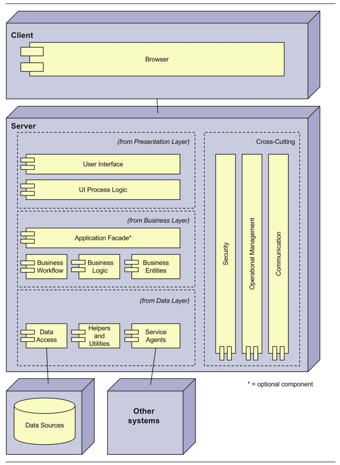

**FIGURE 2.3** Example reference architecture for the development of web applications from the Microsoft Application Architecture Guide (Key: UML)

> 图2.3 web应用程序开发参考体系结构示例，来自Microsoft应用程序体系结构指南(关键:UML)

---

Reference architectures may be confused with architectural styles, but these two concepts are different.

> 参考体系结构可能与体系结构风格混淆，但这两个概念是不同的。

Architectural styles (such as “Pipe and Filter” and “Client Server”) define types of components and connectors in a specified topology-拓扑结构 that are useful for structuring an application either logically or physically.

> 体系结构风格(如“管道和过滤器”和“客户端服务器”)定义了特定拓扑中的组件和连接器类型，这些类型对于在逻辑上或物理上构建应用程序很有用。

Such styles are technology and domain agnostic-无关.

> 这种风格与技术和领域无关。

Reference architectures, in contrast-差异,对比, provide a structure for applications in specific domains, and they may embody-具体表现,体现 different styles.

> 相比之下，参考体系结构为特定领域中的应用程序提供了一个结构，它们可能包含不同的风格。

Also, while architectural styles tend to be popular-受大众喜爱的,受欢迎的 in academia-学术界, reference architectures seem to be preferred by practitioners—which is also why we favor them in our list of design concepts.

> 此外，虽然建筑风格在学术界很流行，但参考架构似乎更受实践者的青睐——这也是我们在设计概念列表中青睐它们的原因。

---

While there are many reference architectures, we are not aware of any catalog that contains an extensive-广阔的,广泛的 list of them.

> 虽然有许多参考体系结构，但我们不知道有任何目录包含它们的广泛列表。

### 2.5.2 Architectural Design Patterns

> 架构设计模型

*Design patterns* are conceptual solutions to recurring-反复出现 design problems that exist in a defined context.

> 设计模式是对存在于已定义的上下文中反复出现的设计问题的概念性解决方案。

While design patterns originally focused on decisions at the object scale, including instantiation, structuring, and behavior, today there are catalogs with patterns that address decisions at varying levels of granularity-粒度.

> 虽然设计模式最初关注的是对象尺度上的决策，包括实例化、结构和行为，但现在有一些模式目录可以处理不同粒度级别上的决策。

In addition, there are specific patterns to address quality attributes such as security or integration.

> 此外，还有一些特定的模式来处理质量属性，例如安全性或集成。

---

While some people argue for the differentiation between what they consider to be architectural patterns and the more fine-grained design patterns, we believe there is no principled difference that can be solely-单独地,仅有地 attributed to scale.

> 虽然有些人认为他们所认为的架构模式和更细粒度的设计模式之间存在区别，但我们认为没有原则上的区别可以单独归因于规模。

We consider a pattern to be architectural when its use directly and substantially-实质 influences the satisfaction of some of the architectural drivers (see Section 2.2).

> 当一个模式的使用直接且实质性地影响到某些架构驱动因素的满足时，我们认为它是架构的(参见2.2节)。

---

Figure 2.4 shows an example architectural pattern that is useful for structuring the system, the Layers pattern.

> 图2.4 显示了一个用于构建系统的示例体系结构模式，即 Layers 模式。

When you choose a pattern such as this one, you must decide how many layers you will need for your system.

> 当您选择像这样的模式时，您必须决定您的系统需要多少层。

Figure 2.5 shows a pattern to support concurrency-并发性,同时发生, which is useful to increase performance.

> 图2.5 显示了一个支持并发的模式，这对提高性能很有用。

This pattern, too, needs to be instantiated—that is, it needs to be adapted to the specific problem and design context. 

> 这个模式也需要实例化——也就是说，它需要适应特定的问题和设计上下文。

Instantiation is discussed in Chapter 3.

> 实例化将在第3章讨论。

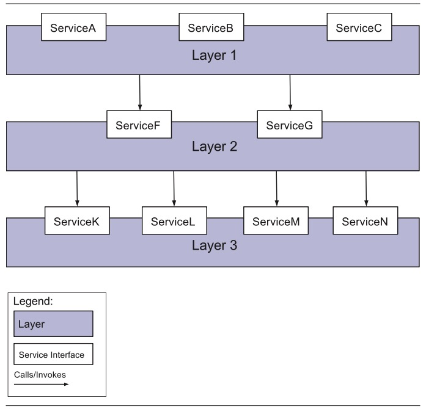

**FIGURE 2.4** The Layers pattern for structuring an application from Pattern-Oriented Software Architecture

> 图2.4 从面向模式的软件体系结构中构造应用程序的层模式

**FIGURE 2.5** The Half-Sync/Half-Async pattern to support concurrency from Pattern-Oriented Software Architecture (Source: Softserve)

> 图2.5 从面向模式的软件架构中支持并发的半同步/半异步模式(来源:Softserve)

---

Although reference architectures may be considered as a type of pattern, we prefer to consider them separately because of the important role they play in structuring an application and because they are more directly connected to technology stacks.

> 尽管参考体系结构可以被视为一种模式，但我们更愿意单独考虑它们，因为它们在构建应用程序中扮演着重要的角色，而且它们与技术堆栈更直接地联系在一起。

Also, a reference architecture typically incorporates-包含,合并 other patterns and often constrains these patterns.

> 此外，参考体系结构通常包含其他模式，并经常约束这些模式。

For example, the reference architecture for web applications shown in Figure 2.3 incorporates the Layers pattern but also establishes how many layers need to be used.

> 例如，图2.3 所示的web应用程序的参考体系结构包含了层模式，但也确定了需要使用多少层。

This reference architecture also incorporates other patterns such as an Application Facade-门面,外观 and Data Access Components.

> 此参考体系结构还合并了其他模式，如应用程序外观和数据访问组件。

### 2.5.3 Deployment Patterns

> 部署模式

Another type of pattern that we prefer to consider separately is *deployment patterns*.

> 我们更愿意单独考虑的另一种模式是*部署模式*。

These patterns provide models on how to physically structure the system to deploy it.

> 这些模式提供了关于如何物理地构建系统以部署它的模型。

Some deployment patterns, such as the one shown in Figure 2.6, are useful to establish an initial physical structure of the system in terms of tiers-层 (physical nodes).

> 一些部署模式(如图2.6 所示)对于根据层(物理节点)建立系统的初始物理结构非常有用。

More specialized deployment patterns, such as the Load-Balanced Cluster in Figure 2.7, are used to satisfy quality attributes such as availability, performance, and security.

> 更专门的部署模式，如图2.7中的负载均衡集群，用于满足质量属性，如可用性、性能和安全性。

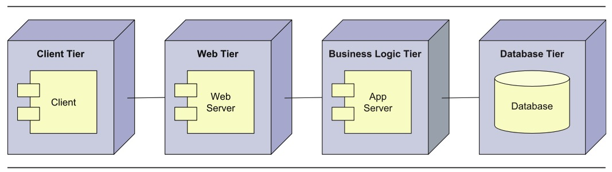

**FIGURE 2.6** Four-tier deployment pattern from the Microsoft Application Architecture Guide (Key: UML)

> 来自 Microsoft 应用程序架构指南的四层部署模式(关键:UML)

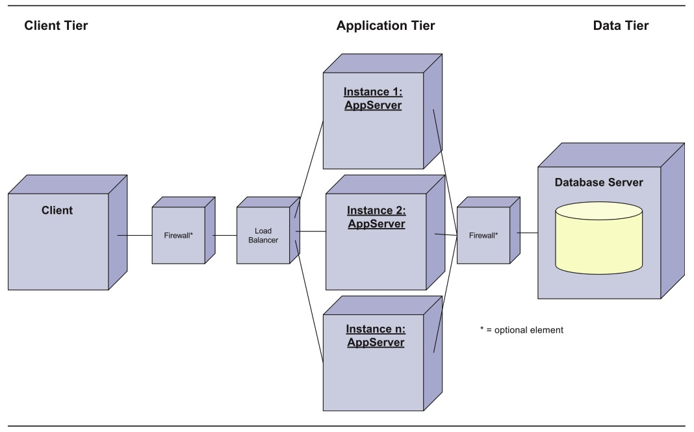

**FIGURE 2.7** Load-Balanced Cluster deployment pattern for performance from the Microsoft Application Architecture Guide (Key: UML)

> 图 2.7 负载均衡集群部署模式的性能，来自 Microsoft 应用程序架构指南(关键:UML)

In general, an initial structure for the system is obtained by mapping the logical elements that are obtained from reference architectures (and other patterns) into the physical elements defined by deployment patterns.

> 通常，系统的初始结构是通过将从参考体系结构(和其他模式)获得的逻辑元素映射到由部署模式定义的物理元素来获得的。

### 2.5.4 Tactics

Architects can use collections of fundamental design techniques to achieve a response for particular quality attributes.

> 架构师可以使用基本设计技术集合来实现对特定质量属性的响应。

We call these architectural design primitives *tactics*.

> 我们称这些架构设计原语为“策略”。

Tactics, like design patterns, are techniques that architects have been using for years.

> 策略和设计模式一样，是建筑师多年来一直在使用的技术。

We do not invent tactics, but simply capture what architects actually have done in practice, over the decades, to manage quality attribute response goals.

>  我们没有发明策略，而只是简单地捕捉架构师在实践中所做的事情，在过去的几十年里，管理质量属性响应目标。

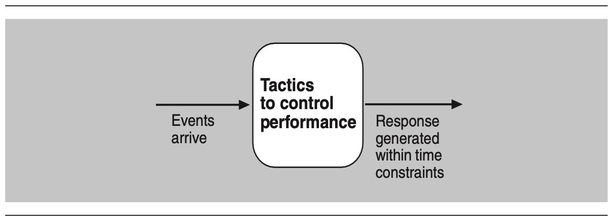

**FIGURE 2.8** Tactics mediate-促成,调解 events and responses.

> 图 2.8 策略调解事件和响应。

Tactics are design decisions that influence the control of a quality attribute response.

> 策略是影响质量属性响应控制的设计决策。

For example, if you want to design a system to have low latency or high throughput-吞吐量, you could make a set of design decisions that would mediate the arrival of events (requests for service), resulting in responses that are produced within some time constraints, as shown in Figure 2.8.

> 例如，如果您希望设计一个具有低延迟或高吞吐量的系统，您可以制定一组设计决策，这些决策将调解事件(服务请求)的到达，从而在一定的时间限制内生成响应，如图 2.8 所示。

---

Tactics are both simpler and more primitive-原始的,远古的 than patterns.

> 战术比模式更简单、更原始。

They focus on the control of a single quality attribute response (although they may, of course, trade off this response with other quality attribute goals).

> 他们关注于对单个质量属性响应的控制(当然，尽管他们可能会用其他质量属性目标来权衡这个响应)。

Patterns, **in contrast**-相反的, typically focus on resolving and balancing multiple forces-力量—that is, multiple quality attribute goals.

> 相反，模式通常关注于解决和平衡多种力量——也就是说，多个质量属性目标。

By way of analogy-类比,比拟, we can say that a tactic is an atom-原子, whereas a pattern is a molecule-分子.

> 通过类比，我们可以说策略是一个原子，而模式是一个分子。

---

Tactics provide a top-down way of thinking about design.

> 策略提供了一种自上而下的设计思维方式。

A tactics categorization begins with a set of design objectives related to the achievement of a quality attribute, and presents the architect with a set of options from which to choose.

> 策略分类从一组与实现质量属性相关的设计目标开始，并向架构师提供一组可供选择的选项。

These options then need to be further instantiated-实例化 through some combination of patterns, frameworks, and code.

> 然后需要通过模式、框架和代码的组合进一步实例化这些选项。

---

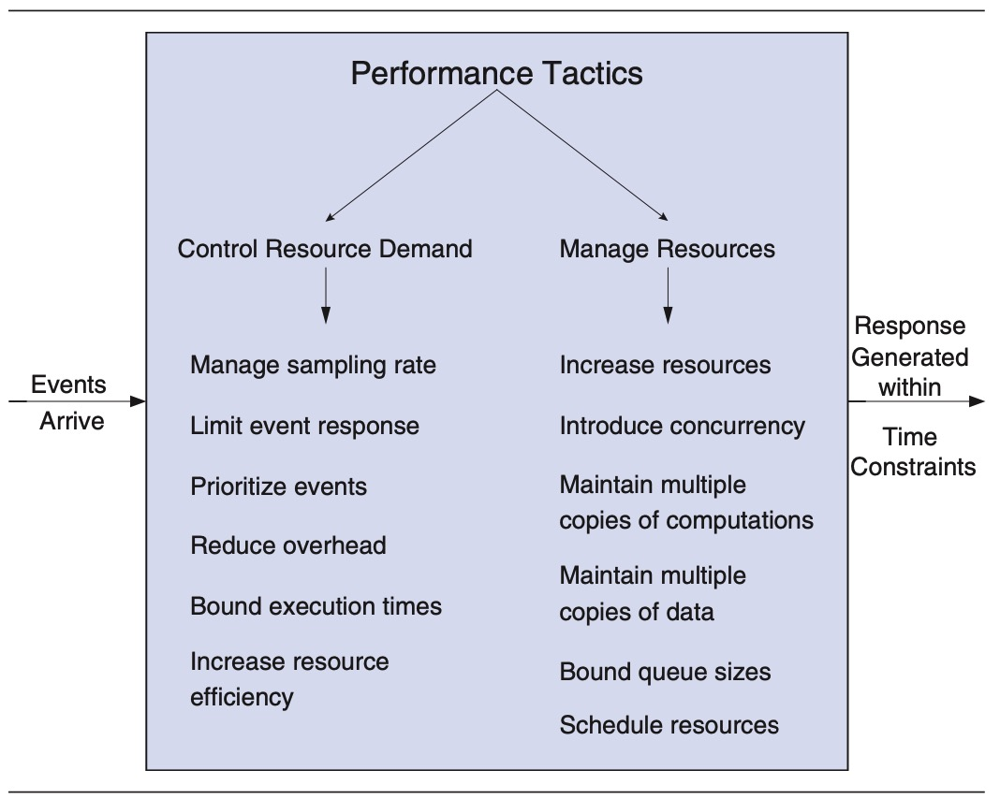

**FIGURE 2.9** Performance tactics from Software Architecture in Practice

> 图 2.9 软件架构实践中的性能策略

---

For example, in Figure 2.9, the design objectives for performance are “Control Resource Demand” and “Manage Resources”.

> 例如，在图2.9中，性能的设计目标是“控制资源需求”和“管理资源”。

An architect who wants to create a system with “good” performance needs to choose one or more of these options.

> 想要创建具有“良好”性能的系统的架构师需要选择这些选项中的一个或多个。

That is, the architect needs to decide if controlling resource demand is feasible-可行的,办得到的, and if managing resources is feasible.

> 也就是说，架构师需要决定控制资源需求是否可行，以及管理资源是否可行。

In some systems, the events arriving at the system can be managed, prioritized, or limited in some way.

> 在某些系统中，到达系统的事件可以通过某种方式进行管理、确定优先级或限制。

If this is not possible, then the architect can manage resources only as part of an attempt to generate responses within acceptable time constraints.

> 如果这是不可能的，那么架构师只能将资源管理作为在可接受的时间限制内生成响应的一部分。

Within the “Manage Resources” category, an architect might choose to increase resources, introduce concurrency, maintain multiple copies of computations, maintain multiple copies of data, and so forth.

> 在“管理资源”类别中，架构师可以选择增加资源、引入并发性、维护计算的多个副本、维护数据的多个副本，等等。

These tactics then need to be instantiated.

> 然后需要实例化这些策略。

As an example, an architect might choose the Half-Sync/Half-Async pattern (see Figure 2.5) as a way of introducing (and managing) concurrency, or the Load-Balanced Cluster deployment pattern (see Figure 2.7) to maintain multiple copies of computations.

> 例如，架构师可以选择半同步/半异步模式(参见图2.5)作为引入(和管理)并发性的方式，或者选择负载均衡集群部署模式(参见图2.7)来维护计算的多个副本。

As we will see in Chapter 3, the choice, combination, and tailoring-迎合,使适应 of tactics and patterns are some of the key steps of the ADD process.

> 正如我们将在第3章看到的，战术和模式的选择、组合和裁剪是ADD过程的一些关键步骤。

There are existing tactics categorizations for the quality attributes of availability, interoperability-互操作性, modifiability, performance, security, testability, and usability.

> 对于可用性、互操作性、可修改性、性能、安全性、可测试性和可用性等质量属性，存在现有的策略分类。

### 2.5.5 Externally Developed Components

> 外部开发组件

Patterns and tactics are abstract in nature.

> 模式和策略本质上是抽象的。

However, when you are designing a software architecture, you need to make these design concepts concrete and closer to the actual implementation.

> 然而，当您设计软件体系结构时，您需要使这些设计概念具体化并更接近实际实现。

There are two ways to achieve this: You can code the elements obtained from tactics and patterns or you can associate technologies with one or more of these elements in the architecture.

> 有两种方法可以实现这一点：您可以对从策略和模式中获得的元素进行编码，或者您可以将技术与体系结构中的一个或多个这些元素关联起来。

This “buy versus build” choice is one of the most important decisions you will make as an architect.

> 这种“购买还是构建”的选择是作为架构师要做的最重要的决定之一。

---

We consider technologies to be *externally developed components*, because they are not created as part of the development project.

> 我们认为技术是“外部开发的组件”，因为它们不是作为开发项目的一部分创建的。

Several types of externally developed components exist:

> 存在几种类型的外部开发组件：

- *Technology families*.

  > 技术家庭

  A technology family represents a group of specific technologies with common functional purposes.

  > 技术族表示一组具有共同功能目的的特定技术。

  It can serve as a placeholder-占位符 until a specific product or framework is selected.

  > 在选定特定的产品或框架之前，它可以用作占位符。

  An example is a relational database management system (RDBMS) or an object-oriented to relational mapper (ORM).

  > 关系数据库管理系统(RDBMS)或面向对象到关系映射器(ORM)就是一个例子。

  Figure 2.10 shows different technology families in the Big Data domain (in regular text).

  > 图2.10展示了大数据领域中不同的技术族(以常规文本表示)。

- *Products*.

  > 产品

  A product (or software package) refers to a self-contained-自包含 functional piece of software that can be integrated into the system that is being designed and that requires only minor configuration or coding.

  > 产品(或软件包)指的是软件的一个自包含的功能部分，它可以集成到正在设计的系统中，只需要少量的配置或编码。

  An example is a relational database management system, such as Oracle or Microsoft SQL Server.

  > 关系数据库管理系统(如Oracle或Microsoft SQL Server)就是一个例子。

  Figure 2.10 shows different products in the Big Data domain (in italics-斜体的).

  > 图2.10 展示了大数据领域的不同产品(斜体部分)。

- *Application frameworks*.

  > 应用程序框架

  An application framework (or just framework) is a reusable software element, constructed out of patterns and tactics, that provides generic functionality addressing recurring domain and quality attribute concerns across a broad range of applications.

  > 应用程序框架(或仅仅是框架)是一个可重用的软件元素，由模式和策略构造而成，它提供了处理跨广泛应用程序中反复出现的域和质量属性关注点的通用功能。

  Frameworks, when carefully chosen and properly implemented, increase the productivity-生产力 of programmers.

  > 如果仔细选择并正确实现框架，则可以提高程序员的工作效率。

  They do so by enabling programmers to focus on business logic and end-user value, rather than underlying-底层 technologies and their implementations.

  > 它们使程序员能够关注业务逻辑和最终用户价值，而不是底层技术及其实现。

  As opposed-相反的 to products, framework functions are generally invoked from the application code or are “injected-注入的” using some type of aspect-oriented approach.

  > 与产品相反，框架函数通常从应用程序代码中调用，或者使用某种类型的面向方面的方法“注入”。

  Frameworks usually require extensive configuration, typically through XML files or other approaches such as annotations in Java.

  > 框架通常需要大量配置，通常通过XML文件或其他方法(如Java中的注释)进行配置。

  A framework example is Hibernate, which is used to perform object-oriented to relational mapping in Java.

  > 一个框架示例是Hibernate，它用于在Java中执行面向对象到关系的映射。

  Several types of frameworks are available: Full-stack frameworks, such as Spring, are usually associated with reference architectures and address general concerns across the different elements of the reference architecture, while non-full-stack frameworks, such as JSF, address specific functional or quality attribute concerns.

  > 有几种类型的框架可用：全栈框架，如Spring，通常与参考体系结构相关联，并解决跨参考体系结构的不同元素的一般问题，而非全栈框架，如 JSF，解决特定的功能或质量属性问题。

- *Platforms*.

  > 平台

  A platform provides a complete infrastructure upon which to build and execute applications.

  > 平台提供了构建和执行应用程序的完整基础结构。

  Examples of platforms include Java, .Net, or and Google Cloud.

  > 平台的例子包括Java、.net 或 Google Cloud。

---

The selection of externally developed components, which is a key aspect of the design process, can be a challenging task because of their extensive-广阔的,大量的 number.

> 外部开发组件的选择是设计过程中的一个关键方面，由于其数量众多，可能是一项具有挑战性的任务。

Here are a few criteria you should consider when selecting externally developed components:

> 在选择外部开发的组件时，您应该考虑以下几个标准:

- *Problem that it addresses.*

  > 它解决的问题

  Is it something specific, such as a framework for object-oriented to relational mapping or something more generic, such as a platform?

  > 它是特定的东西，比如面向对象到关系映射的框架，还是更通用的东西，比如平台?

- *Cost.*

  > 成本

  What is the cost of the license and, if it is free, what is the cost of support and education?

  > 许可证的费用是多少？如果是免费的，支持和教育费用是多少？

- *Type of license.*

  > 许可证类型

  Does it have a license that is compatible-兼容的 with the project goals?

  > 它是否具有与项目目标兼容的许可证?

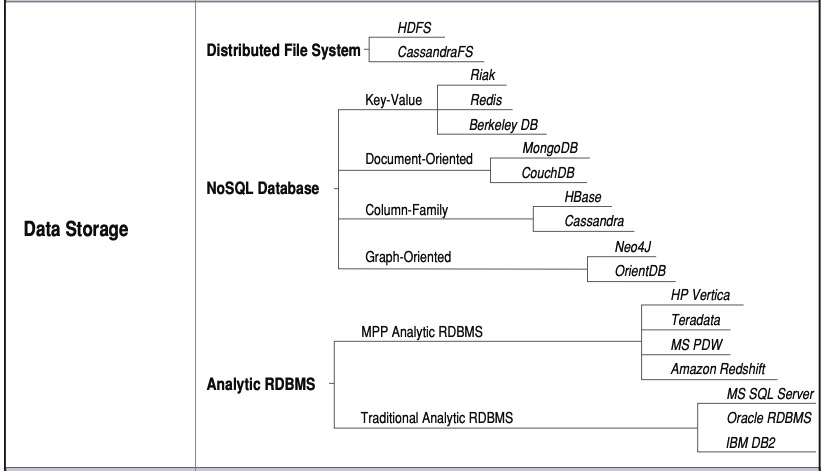

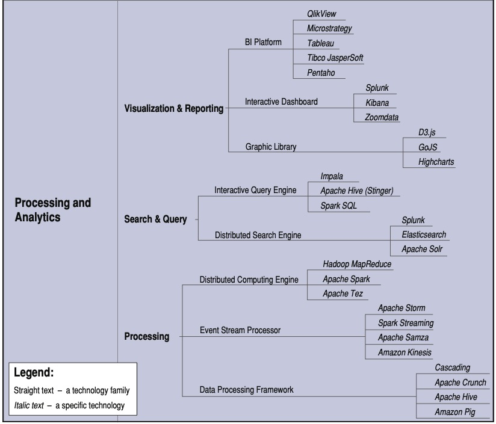

**FIGURE 2.10** A technology family tree for the Big Data application domain

> **图2.10** 大数据应用领域的技术家谱

- *Support.*

  > 支持

  Is it well supported?

  > 它得到很好的支持吗?

  Is there extensive documentation about the technology?

  > 是否有关于该技术的大量文档?

  Is there an extensive user or developer community that you can turn to for advice-建议,忠告?

  > 你是否有广泛的用户或开发者社区可以向你寻求建议?

- *Learning curve.*

  > 学习曲线

  How hard is it to learn this technology?

  > 学习这项技术有多难?

  Have others in your organization already mastered it?

  > 组织中的其他人已经掌握了吗?

  Are there courses available?

  > 有课程吗?

- *Maturity.*

  > 成熟度

  Is it a technology that has just appeared on the market, which may be exciting but still relatively unstable or unsupported?

  > 它是一种刚刚出现在市场上的技术，可能令人兴奋，但仍然相对不稳定或不受支持?

- *Popularity.*

  > 流行

  Is it a relatively-相当地,相对地 widespread technology?

  > 它是一种相对广泛的技术吗?

  Are there positive-积极 testimonials-评价 or adoption by mature-成熟的 organizations?

  > 成熟的组织是否有积极的评价或采用?

  Will it be easy to hire people who have deep knowledge of it?

  > 雇佣对这方面有深入了解的人容易吗?

  Is there an active developer community or user group?

  > 是否有活跃的开发者社区或用户组?

- *Compatibility-兼容性 and ease of integration.*

  > 兼容性和易于集成

  Is it compatible with other technologies used in the project?

  > 它是否与项目中使用的其他技术兼容?

  Can it be integrated easily in the project?

  > 它可以很容易地集成到项目中吗?

- *Support for critical quality attributes.*

  > 支持关键的质量属性

  Does it limit attributes such as performance?

  > 它是否限制了性能等属性?

  Is it secure and robust?

  > 它安全可靠吗?

- *Size.*

  > 大小

  Will the use of the technology have a negative impact on the size of the application under development?

  > 该技术的使用是否会对正在开发的应用程序的大小产生负面影响?

---

Unfortunately-不幸地,遗憾地, the answers to these questions are not always easy to find and the selection of a particular technology may require you do some research or, eventually, to create prototypes that will help you in the selection process.

> 不幸的是，这些问题的答案并不总是很容易找到，选择一种特定的技术可能需要您做一些研究，或者最终创建原型，这将有助于您在选择过程中。

These criteria will have a significant effect on your total cost of ownership-拥有.

> 这些标准将对您的总拥有成本产生重大影响。

## 2.6 Architecture Design Decisions

> 架构设计决策

As we said at the beginning of this chapter, design is the process of making decisions.

> 正如我们在本章开头所说的，设计是做决定的过程。

But the act of making a decision is a *process*, not a moment in time.

> 但是做决定是一个过程，而不是一个瞬间。

Experienced architects, when faced with a design challenge, typically entertain a set of “candidate” decisions (as shown in Figure 2.1); from this set, they choose a best candidate and instantiate that.

> 有经验的架构师，当面对设计挑战时，通常会考虑一组“候选”决策(如图2.1所示)；从这个集合中，他们选择一个最佳候选并实例化它。

They might select this “best” candidate based on experience, constraints, or some form of analysis such as prototyping or simulation-模拟,模仿.

> 他们可能会根据经验、约束或某种形式的分析(如原型或模拟)来选择这个“最佳”候选人。

The reality is that an architect will often make a choice and “ride the horse-马 until it drops”—that is, commit to a decision and revisit it only if it appears to be compromising-妥协,让步 the success of the project.

> 现实情况是，架构师经常会做出一个选择，然后“骑马直到马掉下来”——也就是说，只有当一个决定似乎会影响到项目的成功时，才会重新审视它。

These decisions have serious-严重的,重要的 consequences-结果,后果!

> 这些决定会带来严重的后果!

---

Recall-回想 that, in the early stages of design, decisions focus on the biggest, most critical choices that will have substantial-基本的,实质性的 downstream-下游 consequences: reference architectures, major technologies (such as frameworks), and patterns.

> 回想一下，在设计的早期阶段，决策集中在最大、最关键的选择上，这些选择将产生实质性的下游后果：参考体系结构、主要技术(例如框架)和模式。

Reference architectures, deployment patterns, and other kinds of patterns have been widely discussed—there are many books, websites, and conferences-会议 devoted-献身,用于,致力 to the creation and validation of patterns and pattern languages.

> 参考体系结构、部署模式和其他类型的模式已经得到了广泛的讨论——有许多书籍、网站和会议专门讨论模式和模式语言的创建和验证。

Nevertheless-然而,不过, the output of these activities is always a set of documented patterns.

> 然而，这些活动的输出总是一组文档化的模式。

Interpreting the patterns from a pattern catalog is a critical part of the selection activity for an architect.

> 从模式目录中解释模式是架构师选择活动的关键部分。

Each candidate pattern must be chosen and its instantiation must be analyzed.

> 必须选择每个候选模式，并分析其实例化。

For example, if you chose the Layers pattern from Figure 2.4, you would still have many decisions to make: how many layers there will be, how strict-严格的 the layering will be, which specific services will be placed into each layer, what the interfaces between these functions will be, and so forth.

> 例如，如果您选择了图2.4中的Layers模式，您仍然需要做出许多决定：将有多少层，分层将有多严格，哪些特定的服务将被放置到每层中，这些功能之间的接口将是什么，等等。

If you chose the Load-Balanced Cluster deployment pattern from Figure 2.7, you would have to decide how many servers will be balanced, how many load balancers you will use, where these servers and load balancers will physically reside, which kinds of networks will connect these servers, which form of encryption you will use on those network connections, which form of health monitoring the load balancers will employ, and so forth.

> 如果选择图2.7中的 load - balanced Cluster 部署模式，则必须决定将平衡多少台服务器、将使用多少台负载平衡器、这些服务器和负载平衡器物理驻留的位置、连接这些服务器的网络类型、将在这些网络连接上使用哪种加密形式、负载平衡器将采用哪种健康监控形式，等等。

These decisions are important and will affect the success of the instantiated pattern, so they need to be analyzed.

> 这些决策很重要，将影响实例化模式的成功，因此需要对它们进行分析。

In addition, the quality of the *implementation* of these decisions will affect the success of the pattern.

> 此外，这些决策的“实现”质量将影响模式的成功。

As we like to quip, the architecture giveth and the implementation taketh away.

> **正如我们喜欢说的那样，体系结构给予，实现拿走。**

---

Furthermore-此外,而且, the many catalogs and web pages that present design concepts use different conventions-协定,约定 and notations.

> 此外，许多展示设计概念的目录和网页使用不同的约定和符号。

The focus of our book is on the design method and how it can be used with these external sources.

> 本书的重点是设计方法以及如何将其与这些外部资源一起使用。

For this reason we just take examples from outside sources and show them here as they were originally presented.

> 出于这个原因，我们只是从外部资源中选取一些例子，并在这里按照它们最初的呈现方式展示它们。

This book is not intended to be another design patterns catalog— we want to alert you to the presence of these catalogs and show how they can be an incredibly-难以置信地,非常地 useful resource for an architect, but they must be interpreted and used with care!

> 本书并不是要成为另一个设计模式目录——我们想提醒你这些目录的存在，并向你展示它们是如何成为架构师非常有用的资源的，但是必须小心地解释和使用它们!

In fact, one of your many jobs as an architect is to understand and interpret these catalogs, with their different notations and conventions.

> 事实上，作为架构师，您的许多工作之一就是理解和解释这些目录，以及它们不同的符号和约定。

This is the reality-现实 that you will have to deal with.

> 这就是你必须面对的现实。

---

Finally, once a design decision has been made, you should think about how you will *document* it.

> 最后，一旦做出设计决策，你应该考虑如何“记录”它。

You could, of course, do no documentation.

> 当然，您可以不做文档。

This is, in fact, what is most common in practice.

> 事实上，这在实践中是最常见的。

Architectural concepts are often vague-不明确的,不清楚的 and conveyed-传送,传输 informally-非正式, in “tribal knowledge”: personal communications, emails, naming conventions, and so forth.

> 架构概念通常是模糊的，以“部落知识”的形式非正式地传达：个人通信、电子邮件、命名约定等等。

Alternatively-要不,或者, you could create and maintain full, formal documentation, as is done for some projects with demanding quality attribute requirements, such as safety-critical or high-security systems.

> 或者，您可以创建并维护完整的、正式的文档，就像对一些具有苛刻质量属性需求的项目所做的那样，例如安全关键型或高安全性系统。

If you are designing flight-control software, you will probably end up at this end of the spectrum.

> 如果你正在设计飞行控制软件，你可能会在这一端结束。

In between these endpoints is a broad set of possibilities, and in this space we see less formal (and less costly) forms of architecture documentation, such as sketches-草图 (as we will discuss in Section 3.7).

> 在这些端点之间是一组广泛的可能性，在这个空间中，我们看到了不太正式(并且成本更低)的架构文档形式，例如草图(我们将在3.7节中讨论)。

---

The decision of what, when, and how to document should be risk based.

> 关于什么、何时以及如何记录文件的决定应该基于风险。

You should ask yourself: What is the risk of *not* documenting this decision?

> 你应该问问自己:“不”记录这个决定的风险是什么？

Could it be misinterpreted and undermined-破坏,危害 by future developers?

> 它会被未来的开发者误解和破坏吗？

Could it contribute to near-term or long-term problems in the system?

> 它会给系统带来短期或长期的问题吗?

For example, if the rationale-根本原因,逻辑依据 for layering is not carefully documented, the layering will inevitably-不可避免地,意料之中 break down, losing coherence-一致性 and tending toward increased coupling-耦合.

> 例如，如果没有仔细记录分层的基本原理，则分层将不可避免地破裂，失去一致性并倾向于增加耦合。

Over time, this trend-趋势,动态 will increase the system’s technical debt, making it harder to find and fix bugs or add new features.

> 随着时间的推移，这种趋势将增加系统的技术债务，使查找和修复错误或添加新功能变得更加困难。

To take another example, if the rationale-根本原因,逻辑依据 for allocation of a critical resource is not documented, that resource might become an unintended-无意识的,意外 contention-争用 area, resulting in bottlenecks-瓶颈,障碍物 and failures.

> 再举一个例子，如果没有记录关键资源分配的基本原理，那么该资源可能会成为意外的争用区域，从而导致瓶颈和故障。

## 2.7 Summary

In this chapter, we introduced the idea of design as a set of decisions to satisfy requirements and constraints.

> 在本章中，我们介绍了设计作为满足需求和约束的一组决策的思想。

We also introduced the notion-概念,想法 of “architectural” design and showed that it does not differ from design in general, other than that it addresses the satisfaction of *architectural drivers*: the purpose, primary functionality, quality attribute requirements, architectural concerns, and constraints.

> 我们还介绍了“体系结构”设计的概念，并表明它与一般的设计没有什么不同，除了它解决了对“体系结构驱动因素”的满足:目的、主要功能、质量属性需求、体系结构关注和约束。

What makes a decision “architectural”?

> 是什么使决策成为“体系结构的”?

A decision is architectural if it has nonlocal-非局部的 consequences-结果,后果 *and* those consequences matter to the achievement of an architectural driver.

> 如果一个决策具有非局部的结果，并且这些结果对架构驱动程序的实现很重要，那么这个决策就是架构的。

---

We also discussed why architectural design is so important: because it is the embodiment-体现,化身 of early, far-reaching-影响深远的,波及广泛的, hard-to-change decisions.

> 我们还讨论了为什么架构设计如此重要：因为它是早期的、影响深远的、难以改变的决策的体现。

These decisions will help you meet your architectural drivers, will determine much of your project’s work-breakdown structure, and will affect the tools, skills, and technologies needed to realize the system.

> 这些决策将帮助您满足您的架构驱动因素，将决定您的项目的工作分解结构，并将影响实现系统所需的工具、技能和技术。

Thus architectural design decisions should be scrutinized-详细检查 well, as their consequences are profound-深刻的.

> 因此，应该仔细检查架构设计决策，因为它们的影响是深远的。

In addition, architecture is a key enabler-促成者,赋能者 of agility.

> 此外，体系结构是敏捷性的关键推动者。

---

Architectural design is guided by certain principles.

> 架构设计遵循一定的原则。

For example, to achieve good modularity, high coupling, and low cohesion, the wise architect will probably include some form of layering in the architecture being designed.

> 例如，为了实现良好的模块化、高耦合和低内聚，明智的架构师可能会在所设计的架构中包含某种形式的分层。

Similarly, to achieve high availability, an architect will likely choose a pattern involving some form of redundancy and failover, such as active–passive redundancy, where an active server sends real-time updates to a passive server, so that the passive server can replace the active server in case it fails, with no loss of state.

> 类似地，为了实现高可用性，架构师可能会选择涉及某种形式的冗余和故障转移的模式，例如主动-被动冗余，其中主动服务器向被动服务器发送实时更新，以便被动服务器在发生故障时可以替换主动服务器，而不会丢失状态。

---

Design concepts, such as reference architectures, deployment patterns, architectural patterns, tactics, and externally developed components, are the building blocks of design, and they form the foundation for architectural design as it is performed using ADD.

> 设计概念，如参考体系结构、部署模式、体系结构模式、策略和外部开发的组件，是设计的构建块，它们构成了使用 ADD 执行的体系结构设计的基础。

As you will see in our step-by-step explanation of ADD in Chapter 3, some of the most important design decisions that an architect makes are how design concepts are selected, how they are instantiated, and how they are combined.

> 正如您将在第3章中看到的我们对 ADD 的逐步解释，架构师所做的一些最重要的设计决策是如何选择设计概念，如何实例化它们，以及如何将它们组合起来。

Also, in Appendix A, we present a design concepts catalog that includes several instances of the design concepts presented here.

> 此外，在附录 A 中，我们提供了一个设计概念目录，其中包括这里介绍的设计概念的几个实例。

---

From these foundations, an architecture can be confidently and predictably constructed.

> 从这些基础上，可以自信地和可预测地构建体系结构。

## 2.8 Further Reading

> 延伸阅读

A more in-depth treatment of scenarios and architectural drivers can be found in L. Bass, P. Clements, and R. Kazman, *Software Architecture in Practice,* 3rd ed., Addison-Wesley, 2012.

> L. Bass, P. Clements和R. Kazman， *软件架构实践，*第3版，Addison-Wesley, 2012年，对场景和架构驱动的更深入的处理可以找到。

Also found in this book is an extensive discussion of architectural tactics, which are useful in guiding an architecture to achieve quality attribute goals.

> 本书还对架构策略进行了广泛的讨论，这些策略对于指导架构实现质量属性目标非常有用。

Likewise, this book contains an extensive discussion of QAW and Utility Trees.

> 同样，本书包含了对 **QAW** 和**实用工具树**的广泛讨论。

---

The Mission Thread Workshop is discussed in R. Kazman, M. Gagliardi, and W. Wood, “Scaling Up Software Architecture Analysis”, *Journal of Sys- tems and Software*, 85, 1511–1519, 2012; and in M. Gagliardi, W. Wood, and T. Morrow, *Introduction to the Mission Thread Workshop*, Software Engineering Institute Technical Report CMU/SEI-2013-TR-003, 2013.

> R. Kazman, M. Gagliardi, W. Wood，“scale - Up Software Architecture Analysis”，系统工程与软件学报，85,1511-1519,2012;M. Gagliardi, W. Wood和T. Morrow， *任务线程车间介绍*，软件工程学院技术报告CMU/SEI-2013-TR-003, 2013。

---

An overview of discovery prototyping, JRP, JAD, and accelerated systems analysis can be found in any competent book on systems analysis and design, such as J. Whitten and L. Bentley, *Systems Analysis and Design Methods,* 7th ed., McGraw-Hill, 2007. The combination of architectural approaches with Agile methods will be discussed in Chapter 9.

> 关于发现原型、JRP、JAD和加速系统分析的概述可以在任何关于系统分析和设计的权威书籍中找到，例如J. Whitten和L. Bentley， *系统分析和设计方法，*第7版，McGraw-Hill, 2007。架构方法与敏捷方法的结合将在第9章中讨论。

---

A catalog of reference architectures and deployment patterns appears in the book by the Microsoft Patterns and Practices Team: *Microsoft® Application Ar- chitecture Guide,* 2nd ed., Microsoft Press, 2009. This book also provides an extensive list of architectural concerns associated with the reference architectures that are documented.

> 参考架构和部署模式的目录出现在Microsoft模式和实践团队的书中:*Microsoft®Application Ar- architecture Guide，*第二版，Microsoft出版社，2009。本书还提供了与已记录的参考体系结构相关的体系结构关注点的广泛列表。

---

An extensive collection of architectural design patterns for the construction of distributed systems can be found in F. Buschmann, K. Henney, and D. Schmidt, *Pattern-Oriented Software Architecture Volume 4: A Pattern Language for Distributed Computing*, Wiley, 2007. Other books in the POSA (Patterns Of Soft- ware Architecture) series provide additional pattern catalogs. Many other pattern catalogs specializing in particular application domains and technologies exist. A few examples are listed here:

> 在F. Buschmann, K. Henney和D. Schmidt，《面向模式的软件体系结构第4卷:用于分布式计算的模式语言》，Wiley, 2007年，中可以找到用于构建分布式系统的架构设计模式的广泛集合。POSA(软件架构模式)系列中的其他书籍提供了额外的模式目录。还有许多其他专门针对特定应用程序领域和技术的模式目录。下面是一些例子:

- E. Gamma, R. Helm, R. Johnson, and J. Vlissides. *Design Patterns: Ele- ments of Reusable Object-Oriented Software*. Addison-Wesley, 1995.
- M. Fowler. *Patterns of Enterprise Application Architecture*. Addi- son-Wesley, 2003.
- E. Fernandez-Buglioni. *Security Patterns in Practice: Designing Secure Architectures Using Software Patterns*. Wiley, 2013.
- G. Hohpe and B. Woolf. *Enterprise Integration Patterns: Designing, Build- ing, and Deploying Messaging Solutions*. Addison-Wesley, 2004.

---

The evaluation and selection of software packages is discussed in A. Jadhav and R. Sonar, “Evaluating and Selecting Software Packages: A Review”, *Journal of Information and Software Technology,* 51, 555–563, 2009.

> A. Jadhav和R. Sonar，“软件包的评估与选择:综述”，*信息与软件技术，* 51,555-563,2009。

---

The “bible” for software architecture documentation is P. Clements, F. Bachmann, L. Bass, D. Garlan, J. Ivers, R. Little, P. Merson, R. Nord, and J. Stafford, *Documenting Software Architectures: Views and Beyond*, 2nd ed., Addison-Wesley, 2011.

> 软件架构文档的“圣经”是P. Clements, F. Bachmann, L. Bass, D. Garlan, J. Ivers, R. Little, P. Merson, R. Nord和J. Stafford， *记录软件架构:视图和超越*，第二版，Addison-Wesley, 2011。

---

The technology family tree for the Big Data application domain is based on the Smart Decisions Game by H. Cervantes, S. Haziyev, O. Hrytsay, and R. Kazman, which can be found at http://smartdecisionsgame.com.

> 大数据应用领域的技术谱系树是基于H. Cervantes、S. Haziyev、O. Hrytsay和R. Kazman的《智能决策游戏》，可以在http://smartdecisionsgame.com上找到。

