# Chapter 3. The Architecture Design Process

> 架构设计过程

In this chapter we provide a detailed discussion of ADD, the design method that is the focus of this book.

> 在本章中，我们详细讨论了ADD，这是本书的重点设计方法。

We begin with an overview of the method and of each one of its steps.

> 我们首先概述该方法及其每个步骤。

This overview is followed by more detailed discussions of different aspects that need to be considered when performing these steps.

> 在这个概述之后，将更详细地讨论在执行这些步骤时需要考虑的不同方面。

We suggest different roadmaps that provide guidance on when different types of design concepts can be used depending on which type of system is being designed.

> 我们建议使用不同的路线图，根据所设计的系统类型，为何时可以使用不同类型的设计概念提供指导。

We also discuss the identification and selection of design concepts, the production of structures from these design concepts, the definition of interfaces, the production of preliminary-初步的,预备的 documentation, and, finally, a technique to track design progress.

> 我们还讨论了设计概念的识别和选择，从这些设计概念中产生的结构，接口的定义，初步文档的产生，以及最后跟踪设计进度的技术。

## 3.1 The Need for a Principled Method

> 需要有原则的方法

In Chapter 2, we discussed the various concepts associated with design.

> 在第2章中，我们讨论了与设计相关的各种概念。

The question is, how do you actually perform design?

> 问题是，你如何实际执行设计?

Performing design to *ensure* that the drivers are satisfied requires a principled method.

> 执行设计以“确保”满足驱动程序需要一个原则性的方法。

By “principled”, we refer to a method that takes into account all of the relevant aspects that are needed to produce an adequate-足够的,适当的 design.

> 通过“原则性”，我们指的是一种方法，它考虑了产生适当设计所需的所有相关方面。

Such a method provides guidance that is necessary to guarantee-确保,保证 that your drivers are satisfied.

> 这种方法提供了必要的指导，以确保您的驱动程序满意。

To achieve this goal in a cost-effective, repeatable way, you need a method that guides you in combining and incorporating-包含,合并 reusable design concepts.

> 为了以经济有效的、可重复的方式实现这一目标，您需要一种方法来指导您组合和合并可重用设计概念。

---

Performing design adequately is important because architecture design decisions have significant consequences at different points in a project’s lifetime.

> 充分地执行设计是很重要的，因为架构设计决策在项目生命周期的不同阶段具有重要的影响。

For example, during a pre-sales phase, an appropriate-合适的,相称的 design will allow for a better estimation of cost, scope, and schedule. 

> 例如，在售前阶段，适当的设计将允许对成本、范围和进度进行更好的估计。

During development, an appropriate design will be helpful to avoid later rework and facilitate development and deployment. 

> 在开发期间，适当的设计将有助于避免以后的返工，并促进开发和部署。

Finally, a clear understanding of what architectural design involves is necessary to better manage aspects of technical debt.

> 最后，清楚地了解架构设计所涉及的内容对于更好地管理技术债务的各个方面是必要的。

## 3.2 Attribute-Driven Design 3.0

> 属性驱动设计 3.0

Architecture design is performed in a series of *rounds* across the development of a software project.

> 架构设计是在软件项目开发的一系列“回合”中执行的。

Each design round may take place within a project increment such as a sprint.

> 每一轮设计都可以在一个项目增量中进行，比如冲刺。

Within these rounds, a series of *design iterations* is performed.

> 在这些回合中，执行一系列的“设计迭代”。

Perhaps the most important characteristic of the ADD method is that it provides detailed, step-by-step guidance on the tasks that have to be performed inside the design iterations (see Chapter 7 for a comparison with other design methods).

> ADD 方法最重要的特征可能是它提供了详细的、一步一步地指导必须在设计迭代中执行的任务(参见第7章与其他设计方法的比较)。

When ADD appeared, it was the first method to focus specifically-特意,专门地 on quality attributes and their achievement through the selection of different types of structures and their representation through views.

> 当ADD出现时，它是第一种专门关注质量属性及其通过选择不同类型的结构和通过视图表示的成就的方法。

Another important contribution of ADD was that it recognized that analysis and documentation are an integral-必需的,必要的 part of the design process.

> ADD 的另一个重要贡献是它认识到分析和文档是设计过程中不可分割的一部分。

Although ADD was and is a major contribution in the field of software architecture, we believe that its adoption within the practitioner community has been limited by a number of inherent-内在的,固有的 weaknesses-劣势,弱点, as discussed in Section 1.4.

> 尽管 ADD 过去和现在都是软件体系结构领域的主要贡献，但是我们相信它在实践者社区中的采用受到了一些固有弱点的限制，正如在1.4节中讨论的那样。

---

ADD has been used successfully for more than 15 years.

> ADD 已经成功使用了超过 15 年。

The world of software has changed dramatically-剧烈地,明显地 since ADD’s introduction, however, and even more since version 2.0 was published in 2006.

> 然而，自从 ADD 引入以来，软件世界发生了巨大的变化，自2006年发布2.0版本以来，变化甚至更大。

For this reason, and to address the weaknesses of version 2.0, we have decided to create ADD 3.0.

> 出于这个原因，并解决 2.0 版本的弱点，我们决定创建 ADD 3.0。

Henceforth-从此之后, we will simply refer to this method as ADD.

> 今后，我们将简单地把这个方法称为 ADD。

Figure 3.1 shows the steps and artifacts associated with ADD and in the following subsections-小节 we provide an overview of the activities in each of its steps.

> 图3.1显示了与 ADD 相关的步骤和工件，在接下来的小节中，我们将概述每个步骤中的活动。

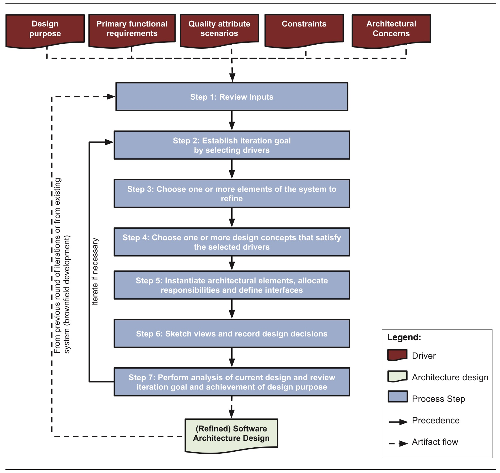

**FIGURE 3.1** Steps and artifacts of ADD version 3.0

> 图 3.1 ADD 3.0版本的步骤和工件

### 3.2.1 Step 1: Review Inputs

> 步骤1：审核输入

Before starting a design round, you need make sure that the inputs to the design process are available and correct.

> 在开始一轮设计之前，您需要确保设计过程的输入是可用的和正确的。

First, you need to ensure that you are clear about the *purpose* for the design activities that will ensue.

> 首先，你需要确保你清楚接下来的设计活动的“目的”。

The purpose may be, for example, to produce a design for early estimation, to refine an existing design to build a new increment of the system, or to design and generate a prototype to mitigate certain technical risks (see Section 2.4.1 for a discussion of the design purpose).

> 目的可能是，例如，为早期评估生成设计，改进现有设计以构建系统的新增量，或者设计并生成原型以减轻某些技术风险(参见第2.4.1节讨论设计目的)。

Also, you need to make sure that the other drivers needed for the design activity are available.

> 此外，您还需要确保设计活动所需的其他驱动程序可用。

These include primary functional requirements, quality attribute scenarios, architectural constraints, and concerns.

> 这些包括主要的功能需求、质量属性场景、体系结构约束和关注点。

Finally, if this is not the first design round, or if this is not greenfield development, an additional input that you need to consider is the existing architecture design.

> 最后，如果这不是第一轮设计，或者这不是绿地开发，那么您需要考虑的另一个输入是现有的体系结构设计。

---

At this point, we assume that primary functionality and quality attribute scenarios have been prioritized, ideally by your most important project stakeholders. (If not, there are techniques that you can employ to elicit-引出,得到 and prioritize them, as discussed in Sections 2.4.2 and 2.4.3.)

> 在这一点上，我们假设主要的功能和质量属性场景已经被优先化了，理想情况下是由你最重要的项目涉众决定的。(如果没有的话，你可以使用一些技巧来引出它们并对它们进行排序，如第2.4.2和2.4.3节所讨论的那样。)

You, as the architect, must now “own” these drivers.

> 作为架构师，您现在必须“拥有”这些驱动程序。

You need to check, for example, whether any important stakeholders were overlooked-忽视,忽略 in the original requirements elicitation process, or whether any business conditions have changed since the prioritization was performed.

> 例如，您需要检查在最初的需求提取过程中是否忽略了任何重要的涉众，或者在执行优先级之后是否更改了任何业务条件。

These drivers really do “drive” design, so getting them right and getting their priority right is crucial.

> 这些驱动因素确实“驱动”设计，所以正确使用它们并确定它们的优先级至关重要。

We cannot stress-强调,着重 this point strongly enough.

> 我们再怎么强调这一点也不为过。

Software architecture design, like most activities in software engineering, is a “garbage in, garbage out” process.

> 软件架构设计，像软件工程中的大多数活动一样，是一个“垃圾输入，垃圾输出”的过程。

The results of ADD cannot be good if the inputs are poorly formed.

> 如果输入格式不佳，则 ADD 的结果不会很好。

---

As a rule of thumb, you should be able to start designing if, besides the design purpose, constraints, and initial architectural concerns, you have established the primary use cases and the most important quality attribute scenarios.

> 根据经验，除了设计目的、约束和最初的体系结构关注之外，如果您已经建立了主要用例和最重要的质量属性场景，那么您应该能够开始设计。

This, of course, does not mean you will make decisions only about these drivers: You still need to address other quality attribute scenarios, use cases and architectural concerns, but these can be treated later on.

> 当然，这并不意味着您将只对这些驱动程序做出决策：您仍然需要处理其他质量属性场景、用例和体系结构问题，但是这些可以稍后处理。

---

The drivers become part of an architectural design backlog-待办事项 that you should use to perform the different design iterations.

> 驱动程序成为架构设计待办事项的一部分，您应该使用它来执行不同的设计迭代。

We discuss this idea in more depth in Section 3.8.1.

> 我们将在 3.8.1 节中更深入地讨论这个想法。

### 3.2.2 Step 2: Establish the Iteration Goal by Selecting Drivers

> 步骤2：通过选择驱动程序建立迭代目标

A design round represents the architecture design activities performed within a development cycle if an iterative development model is used, or the whole-完整的 set of architecture design activities if a waterfall model is used.

> 如果使用迭代开发模型，设计轮代表在开发周期内执行的体系结构设计活动，或者如果使用瀑布模型，则代表整个体系结构设计活动集。

Through one or more rounds, you produce an architecture that suits the established design purpose.

> 通过一个或多个回合，您将生成适合既定设计目的的体系结构。

---

A design round is generally performed in a series of design iterations, where each iteration focuses on achieving a particular goal.

> 一轮设计通常在一系列的设计迭代中进行，其中每个迭代集中于实现一个特定的目标。

Such a goal typically involves designing to satisfy a subset of the drivers.

> 这样的目标通常涉及设计以满足驱动程序的子集。

For example, an iteration goal could be to create structures from elements that will support a particular performance scenario, or that will enable a use case to be achieved.

> 例如，一个迭代的目标可能是从元素中创建结构，这些元素将支持一个特定的性能场景，或者将使一个用例得以实现。

For this reason, when performing design, you need to establish a goal before you start a particular design iteration.

> 因此，在执行设计时，您需要在开始特定的设计迭代之前建立一个目标。

---

As we will discuss in Section 3.3, depending on the type of system whose architecture is being designed, there may be a “best”—or at least strongly suggested—ordering of the iteration goals that need to be addressed.

> 正如我们将在3.3节中讨论的那样，根据所设计的体系结构的系统类型，可能存在需要解决的迭代目标的“最佳”-或至少强烈建议-排序。

For example, for a greenfield system in a mature-成熟的,理智的 domain, your initial goal is typically to identify an overall structure for the system by choosing a reference architecture.

> 例如，对于成熟领域中的绿地系统，您的初始目标通常是通过选择参考体系结构来确定系统的总体结构。

### 3.2.3 Step 3: Choose One or More Elements of the System to Refine-改进,完善

> 步骤3：选择一个或多个要完善的系统元素

Satisfying drivers requires you to produce one or more architectural structures.

> 满足驱动程序要求您生成一个或多个架构结构。

These structures are composed of interrelated-相互关连 elements, and those elements are generally obtained by refining other elements that you previously identified in an earlier iteration.

> 这些结构由相互关联的元素组成，而这些元素通常是通过细化您之前在早期迭代中确定的其他元素来获得的。

Refinement can mean decomposition-分解 into **finer-grained**-细粒度 elements (top-down approach), combination of elements into coarsegrained-粗粒度 elements (bottom-up approach), or improvement of previously identified elements.

> 细化可以意味着分解为细粒度元素(自顶向下方法)，将元素组合为粗粒度元素(自底向上方法)，或者改进先前确定的元素。

For greenfield development, you can start by establishing the system context and then selecting the only available element—that is, the system itself—for refinement by decomposition.

> 对于绿地开发，您可以从建立系统上下文开始，然后选择唯一可用的元素——也就是系统本身——通过分解进行细化。

For existing systems or for later design iterations in greenfield systems, you normally choose to refine elements that were identified in prior iterations.

> 对于现有的系统，或者对于绿地系统中的后期设计迭代，您通常选择细化在先前迭代中确定的元素。

---

The elements that you will select are the ones that are involved in the satisfaction of specific drivers.

> 您将选择的元素是那些与特定驱动程序的满意度有关的元素。

For this reason, when design is performed for an existing system, you need to have a good understanding of the elements that are part of the as-built architecture of the system.

> 因此，在为现有系统执行设计时，您需要很好地理解作为系统已构建体系结构一部分的元素。

This may involve some “detective work”, reverse-逆向 engineering, or discussions with developers.

> 这可能涉及到一些“侦查工作”、逆向工程或与开发人员的讨论。

---

We have presented steps 2 and 3 in the order they appear in the method.

> 我们按照步骤2和步骤3在方法中出现的顺序给出了它们。

That is to say, step 2 precedes step 3.

> 也就是说，步骤2在步骤3之前。

However, in some cases you may need to reverse this order.

> 然而，在某些情况下，您可能需要颠倒这个顺序。

For example, when designing a greenfield system or when fleshing out certain types of reference architectures (as we will show in Chapter 5), you will, at least in the early stages of design, focus on elements of the system and start the iteration by selecting a particular element and then consider the drivers that you want to address.

> 例如，当设计一个绿地系统或者充实特定类型的参考架构时(正如我们将在第5章中展示的那样)，您将，至少在设计的早期阶段，关注系统的元素，并通过选择一个特定的元素开始迭代，然后考虑您想要处理的驱动程序。

### 3.2.4 Step 4: Choose One or More Design Concepts That Satisfy the Selected Drivers

> 步骤4：选择一个或多个满足选定驱动程序的设计概念

Choosing the design concepts is probably the most difficult decision you will face in the design process, because it requires you to identify alternatives among design concepts that can be used to achieve your iteration goal, and to make a selection from these alternatives.

> 选择设计概念可能是您在设计过程中面临的最困难的决定，因为它要求您在可用于实现迭代目标的设计概念中确定可选方案，并从这些可选方案中进行选择。

As we saw in Section 2.5, different types of design concepts exist, and, for each type, there may be many options.

> 正如我们在2.5节中看到的，存在不同类型的设计概念，并且对于每种类型，可能有许多选项。

This can result in a considerable number of alternatives that need to be analyzed to make a choice.

> 这可能导致需要分析大量的备选方案以做出选择。

In Section 3.4, we discuss the identification and selection of design concepts in more detail.

> 在第3.4节中，我们将更详细地讨论设计概念的识别和选择。

### 3.2.5 Step 5: Instantiate Architectural Elements, Allocate Responsibilities, and Define Interfaces

> 步骤5：实例化架构元素，分配职责，并定义接口

Once you have selected one or more design concepts, you must make another design decision, which involves *instantiating* elements out of the design concepts that you selected.

> 一旦你选择了一个或多个设计概念，你必须做出另一个设计决策，这涉及到从你选择的设计概念中“实例化”元素。

For example, if you selected the Layers pattern as a design concept, you must decide how many layers will be used, since the pattern itself does not prescribe-规定,命令 a specific number.

> 例如，如果选择Layers模式作为设计概念，则必须决定将使用多少层，因为模式本身没有规定特定的数量。

In this example, the layers are the elements that are instantiated.

> 在本例中，层是实例化的元素。

In certain cases, instantiation can mean configuration.

> 在某些情况下，实例化可能意味着配置。

For example, you may have dedicated-致力于,献身于 an iteration to selecting technologies and associating them with the elements in your design.

> 例如，您可能已经将一个迭代用于选择技术，并将它们与设计中的元素关联起来。

In further iterations, you might refine these elements by making finer-grained decisions about how they should be configured to support a particular driver, such as a quality attribute.

> 在进一步的迭代中，您可以通过做出更细粒度的决定来细化这些元素，决定如何配置它们以支持特定的驱动程序，例如质量属性。

---

After instantiating the elements, you need to allocate responsibilities to each of them.

> 在实例化元素之后，您需要为每个元素分配职责。

For example, in a typical web-based enterprise system, at least three layers are usually present: the presentation layer, the business layer, and the data layer.

> 例如，在典型的基于web的企业系统中，通常至少有三层：表示层、业务层和数据层。

The responsibilities of these layers differ: The responsibilities of the presentation layer include managing all of the user interactions, whereas the responsibilities of the data layer include managing the persistence of data.

> 这些层的职责各不相同：表示层的职责包括管理所有用户交互，而数据层的职责包括管理数据的持久性。

---

Instantiating elements is just one of the tasks you need to perform to create structures that satisfy a driver or a concern.

> 实例化元素只是创建满足驱动程序或关注点的结构所需执行的任务之一。

The elements that have been instantiated also need to be connected, to allow them to collaborate with one another.

> 已经实例化的元素也需要被连接起来，以允许它们彼此协作。

This requires the existence of *relationships* between the elements and the exchange-交换,互换 of information through some kind of interface.

> 这要求元素之间存在“关系”，并通过某种接口交换信息。

The interface is a contractual-契约性的,依据合同的,合同性的 specification-规格,规范 of how information should flow between the elements.

> 接口是关于信息如何在元素之间流动的契约性规范。

Section 3.5 provides more details on how the different types of design concepts are instantiated and how structures are created, and Section 3.6 discusses how interfaces can be defined.

> 3.5节提供了更多关于如何实例化不同类型的设计概念以及如何创建结构的细节，3.6节讨论了如何定义接口。

### 3.2.6 Step 6: Sketch Views and Record Design Decisions

> 步骤6：草图视图和记录设计决策

At this point, you have finished performing the design activities for the iteration.

> 此时，您已经完成了迭代的设计活动的执行。

Nevertheless-然而,不过, you may not have taken any actions to ensure that the views—the representations of the structures you created—are preserved-保存.

> 然而，您可能没有采取任何操作来确保视图(您创建的结构的表示)得到保存。

For instance, if you performed the previous step in a conference-会议 room, you probably ended up with a series of diagrams on a whiteboard.

> 例如，如果您在会议室执行前面的步骤，您可能会在白板上得到一系列图表。

This information is essential, and you need to capture it so that you can later analyze and communicate it to other stakeholders.

> 这些信息是必不可少的，您需要获取这些信息，以便以后可以对其进行分析并与其他涉众进行交流。

---

The views that you have created are almost certainly incomplete, so these diagrams may need to be revisited and refined in a subsequent-随后的,接着的 iteration.

> 您所创建的视图几乎肯定是不完整的，因此这些图可能需要在随后的迭代中重新访问和细化。

This is typically done to accommodate-容纳 elements resulting from other design decisions that you will make to support additional drivers.

> 这样做通常是为了容纳来自其他设计决策的元素，您将做出这些设计决策以支持其他驱动程序。

This factor explains why we speak of “sketching” the views in ADD—that is, creating a preliminary-初步的,预备的 type of documentation.

> 这个因素解释了为什么我们说 ADD 中的视图“草图”——也就是说，创建一种初步类型的文档。

The more formal, more fully fleshed-out documentation of these views—should you choose to produce them—occurs only after a number of design iterations have been finished (as part of the architectural documentation activity discussed in Section 1.2.2).

> 这些视图的更正式、更充实的文档(如果您选择生成它们的话)只有在完成许多设计迭代之后才会出现(作为第1.2.2节中讨论的体系结构文档活动的一部分)。

---

In addition to storing the sketches of the views, you should record the significant decisions that are made in the design iteration, and the reasons that led to these decisions (i.e., the rationale-基本原理), to facilitate later analysis and understanding of the decisions.

> 除了存储视图的草图之外，您还应该记录在设计迭代中做出的重要决策，以及导致这些决策的原因(即基本原理)，以便于以后分析和理解这些决策。

For example, decisions about important tradeoffs might be recorded at this time.

> 例如，此时可能会记录有关重要权衡的决策。

During a design iteration, decisions are primarily made in steps 4 and 5.

> 在设计迭代期间，决策主要是在步骤4和步骤5中做出的。

Section 3.7 provides further information on how to create preliminary-初步的,预备的 documentation *during* design, including creating sketches, recording design decisions and their rationale.

> 第3.7节提供了关于如何在设计期间创建初步文档的进一步信息，包括创建草图，记录设计决策及其基本原理。

### 3.2.7 Step 7: Perform Analysis of Current Design and Review Iteration Goal and Achievement of Design Purpose

> 步骤7：执行当前设计的分析，并审查迭代目标和设计目的的实现

By the time you reach step 7, you should have created a partial design that addresses the goal established for the iteration. 

> 当您到达第7步时，您应该已经创建了一个部分设计，以解决为迭代建立的目标。

Making sure that this is actually the case is a good idea, so as to avoid unhappy stakeholders and later rework-返工.

> 确保这是一个好主意，这样可以避免不高兴的涉众和以后的返工。

You can perform the analysis yourself by reviewing the sketches of the views and design decisions that you recorded, but an even better idea is to have someone else help you review this design.

> 您可以通过检查所记录的视图草图和设计决策来执行分析，但更好的方法是让其他人帮助您检查此设计。

We do this for the same reason that organizations frequently have a separate testing/quality assurance group: Another person will not share your assumptions, and will have a different experience base and a different perspective.

> 我们这样做的原因与组织经常有一个单独的测试/质量保证小组是一样的：另一个人不会分享你的假设，并且会有不同的经验基础和不同的观点。

Pulling in someone with a different point of view can help you find “bugs”, in both code and architecture.

> 引入具有不同观点的人可以帮助你找到代码和架构中的“bug”。

We discuss analysis in more depth in Chapter 8.

> 我们将在第8章更深入地讨论分析。

---

Once the design performed in the iteration has been analyzed, you should review the state of your architecture in terms of the established design purpose.

> 一旦对迭代中执行的设计进行了分析，您就应该根据已确定的设计目的来检查体系结构的状态。

This means considering if, at this point, you have performed enough design iterations to satisfy the drivers that are associated with the design round as well as considering whether the design purpose has been achieved or if additional design rounds are needed in future project increments.

> 这意味着考虑，在这一点上，您是否已经执行了足够的设计迭代来满足与设计轮相关的驱动程序，以及考虑设计目的是否已经实现，或者在未来的项目增量中是否需要额外的设计轮。

Section 3.8 describes simple techniques that allow you to keep track of design progress.

> 第3.8节描述了允许您跟踪设计进度的简单技术。

### 3.2.8 Iterate If Necessary

> 必要时迭代

Ideally, you should perform additional iterations and repeat steps 2 to 7 for every driver that was considered as part of the input. 

> 理想情况下，您应该执行额外的迭代，并对作为输入一部分的每个驱动程序重复步骤2到步骤7。

More often than not, such iterations are not possible because of time or resource constraints that force-强迫,迫使 you to stop the design activities and move on to the next activities in the development process—typically implementation.

> 通常情况下，这样的迭代是不可能的，因为时间或资源限制迫使您停止设计活动，并转移到开发过程中的下一个活动—通常是实现。

---

What are the criteria for evaluating if more design iterations are necessary?

> 评估是否需要更多的设计迭代的标准是什么?

We let *risk* be our guide.

> 我们让“风险”成为我们的向导。

You should at least have addressed the drivers with the highest priorities.

> 你至少应该优先考虑那些驱动因素。

Ideally, you should have assured-确保 that critical drivers are satisfied or, at least, that the design is “good enough” to satisfy them. 

> 理想情况下，您应该确保满足关键驱动程序，或者至少确保设计“足够好”以满足它们。

Finally, when performing iterative development, you can choose to perform one design round in every project iteration.

> 最后，当执行迭代开发时，您可以选择在每个项目迭代中执行一个设计轮。

The first rounds should focus on addressing the drivers, while subsequent rounds focus on making design decisions for other requirements that were not selected as drivers but that need to be addressed nonetheless-仍然.

> 第一轮应该关注于解决驱动因素，而随后的几轮应该关注于为没有被选为驱动因素但仍然需要解决的其他需求做出设计决策。

## 3.3 Following a Design Roadmap-计划,策略 According to System Type

> 根据系统类型遵循设计思路

When writing, you might have experienced the much-dreaded-害怕,畏惧 “fear-害怕,畏惧 of the blank page”.

> 在写作时，你可能经历过非常可怕的“空白页恐惧”。

Similarly, when you start designing an architecture, you may face a situation in which you ask yourself, “How do I begin designing?”

> 类似地，当您开始设计一个体系结构时，您可能会面临这样一种情况，您会问自己：“我如何开始设计?”

To answer this question, you need to consider which type of system you are designing.

---

Design of software systems falls into three broad categories:

> 软件系统的设计分为三大类：

(1) the design of a *greenfield* system for a mature (i.e., well-known) domain;

> (1)为成熟(即知名)领域设计一个“绿地”系统；

(2) the design of a greenfield system for a domain that is novel (i.e., a domain that has a less established infrastructure and knowledge base);

> (2)为新领域(即基础设施和知识库较少的领域)设计绿地系统；

and (3) the design for making changes to an existing system (*brownfield-棕色地带*).

> (3)对现有系统(棕地)进行更改的设计。

Each one of these categories involves a different roadmap in terms of the sequence of goals that you should perform across the design iterations.

> 根据您应该在设计迭代中执行的目标序列，这些类别中的每一个都涉及到不同的路线图。

### 3.3.1 Design of Greenfield Systems for Mature Domains

> 成熟领域绿地系统的设计

The design of a greenfield system for a mature domain occurs when you are designing an architecture for a system that is built from “scratch” and when this type of system is well known and understood—that is, when there is an established infrastructure of tools and technologies, and an associated knowledge base.

> 当您为“从零开始”构建的系统设计体系结构时，并且当这种类型的系统众所周知并被理解时(也就是说，当存在已建立的工具和技术基础结构以及相关的知识库时)，就会出现成熟领域的绿地系统设计。

Examples of mature domains include the following:

> 成熟领域的例子包括：

- Traditional desktop applications

  > 传统桌面应用程序

- Interactive applications that run on a mobile device

  > 在移动设备上运行的交互式应用程序

- Enterprise applications accessed from a web browser, which store information in a relational database, and which provide support for partially-部分地 or fully automating-使自动化 business processes

  > 从 web 浏览器访问的企业应用程序，它将信息存储在关系数据库中，并为部分或完全自动化的业务流程提供支持

Since these types of applications are relatively common, some general architectural concerns associated with their design are well known, well supported, and well documented.

> 由于这些类型的应用程序相对常见，因此与它们的设计相关的一些一般体系结构关注点是众所周知的，得到了很好的支持，并且有很好的文档记录。

If you are designing a new system that falls into this category, we recommend the following roadmap (shown in Figure 3.2).

> 如果您正在设计一个属于这一类的新系统，我们建议使用以下路线图(如图3.2所示)。

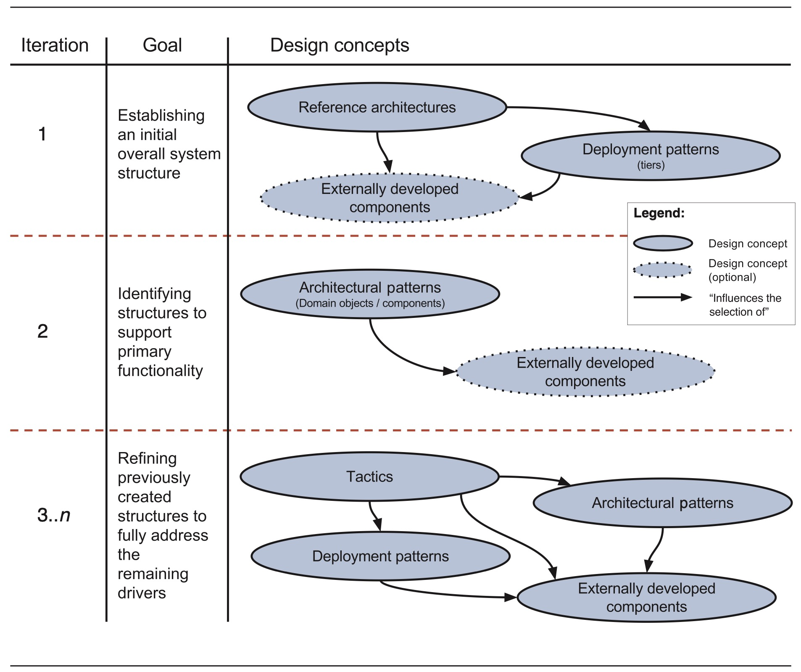

**FIGURE 3.2** Design concept selection roadmap for greenfield systems

> **图3.2** 新建系统设计概念选择路线图

---

The goal of your **initial** design iteration(s) should be to address the general architectural concern of establishing an initial overall system structure.

> 初始设计迭代的目标应该是解决建立初始整体系统结构的一般架构问题。

Is this to be a three-tier client-server application, a peer-to-peer-点对点的 application, a mobile app connecting to a Big Data back-end, and so on?

> 这是一个三层客户机-服务器应用程序、一个点对点应用程序、一个连接到大数据后端的移动应用程序，等等?

Each of these options will lead you to different architectural solutions, and these solutions will help you to achieve your drivers. 

> 这些选项中的每一个都将引导您到不同的体系结构解决方案，这些解决方案将帮助您实现您的驱动程序。

To achieve this iteration goal, you will select some design concepts.

> 为了实现这个迭代目标，您将选择一些设计概念。

Specifically-具体地, you will typically choose one or more reference architectures and deployment patterns (see Sections 2.5.1 and 2.5.3). 

> 具体来说，您通常会选择一个或多个参考体系结构和部署模式(参见第2.5.1和2.5.3节)。

You may also select some externally-外部 developed components, such as frameworks.

> 您还可以选择一些外部开发的组件，例如框架。

The types of frameworks that are typically chosen in early iterations are either “full-stack” frameworks that are associated with the selected reference architectures, or more specific frameworks that are associated with elements established by the reference architecture (see Section 2.5.5).

> 通常在早期迭代中选择的框架类型要么是与所选择的参考体系结构相关联的“全栈”框架，要么是与参考体系结构所建立的元素相关联的更具体的框架(参见章节2.5.5)。

In this first iteration, you should review all of your drivers to select the design concepts, but you will probably pay more attention to the constraints and to quality attributes that are not associated with specific functionalities and that favor particular reference architectures or require particular deployment configurations.

> 在第一次迭代中，您应该检查所有驱动程序以选择设计概念，但是您可能会更多地关注约束和质量属性，这些约束和质量属性与特定功能无关，并且支持特定的参考体系结构或需要特定的部署配置。

Consider an example: If you select a reference architecture for Big Data systems, you have presumably chosen a quality attribute such as low latency with high data volumes as your most important driver.

> 考虑一个例子：如果您为大数据系统选择一个参考体系结构，那么您可能已经选择了一个质量属性，例如具有高数据量的低延迟作为最重要的驱动程序。

Of course, you will make many subsequent-随后的,接着的 decisions to flesh-使充实,使具体 out this early choice, but this driver has already exerted-运用,施加 a great influence on your design such as the selection of a particular reference architecture.

> 当然，您将做出许多后续的决定来充实这个早期的选择，但是这个驱动程序已经对您的设计产生了很大的影响，例如特定参考体系结构的选择。

---

The goal of your **next** design iteration(s) should be to identify structures that support the primary functionality.

> 你的下一个设计迭代的目标应该是确定支持主要功能的结构。

As noted in Section 2.4.3, allocation of functionality (i.e., use cases or user stories) to elements is an important part of architectural design because it has critical downstream-下游的 implications-含义 for modifiability and allocation of work to teams. 

> 如第2.4.3节所述，将功能(例如，用例或用户故事)分配到元素是架构设计的一个重要部分，因为它对团队的可修改性和工作分配具有关键的下游含义。

Furthermore-此外,而且, once functionality has been allocated, the elements that support it can be refined in later iterations to support the quality attributes associated with these functionalities.

> 此外，一旦功能被分配，支持它的元素可以在以后的迭代中被细化，以支持与这些功能相关的质量属性。

For example, a performance-性能 scenario may be associated with a particular use case.

> 例如，性能场景可能与特定的用例相关联。

Achieving the performance goal may require making design decisions across all of the elements that participate in the achievement of this use case.

> 实现性能目标可能需要跨参与实现此用例的所有元素做出设计决策。

To allocate functionality, you usually refine the elements that are associated with the reference architecture by decomposing-分解 them.

> 为了分配功能，您通常通过分解与参考体系结构相关联的元素来细化它们。

A particular use case may require the identification of multiple elements.

> 一个特定的用例可能需要识别多个元素。

For example, if you have selected a web application reference architecture, supporting a use case will probably require you to identify modules across the different layers associated with this reference architecture.

> 例如，如果您选择了一个web应用程序参考体系结构，那么支持一个用例可能需要您识别与该参考体系结构相关的不同层的模块。

Finally, at this point you should also be thinking about allocating functionality—associated with modules—to (teams of) developers.

> 最后，此时您还应该考虑将与模块相关的功能分配给(团队)开发人员。

---

The goal of your **subsequent-随后的,后来的** design iterations should be to refine the structures you have previously created to fully address the remaining drivers.

> 您后续设计迭代的目标应该是细化您之前创建的结构，以完全处理剩余的驱动程序。

Addressing these drivers, and especially quality attributes, will likely require you to use the three major categories of design concepts—tactics, patterns, and externally developed components such as frameworks—as well as commonly accepted design best practices such as modularity-模块化, low coupling, and high cohesion-内聚.

> 处理这些驱动因素，特别是质量属性，可能需要您使用设计概念的三个主要类别——策略、模式和外部开发的组件(如框架)，以及普遍接受的设计最佳实践(如模块化、低耦合和高内聚)。

For example, to (partially) satisfy a performance requirement for the search use case in a web application, you might select the “maintain multiple copies of data” tactic and implement this tactic by configuring a cache in a framework that is used inside an element responsible for persisting data.

> 例如，为了(部分地)满足web应用程序中搜索用例的性能要求，您可能会选择“维护数据的多个副本”策略，并通过在框架中配置缓存来实现该策略，该缓存在负责持久化数据的元素中使用。

---

This roadmap is appropriate for the initial project iterations, but it is also extremely useful for early project estimation activities (see the discussion about the architecture design process during pre-sales in Section 9.1.1).

> 该路线图适用于最初的项目迭代，但对于早期的项目评估活动也非常有用(参见第9.1.1节中关于预售期间架构设计过程的讨论)。

Why have we created such a roadmap?

> 我们为什么要制定这样一个路线图?

First, because the process of starting an architectural design is always complex.

> 首先，因为开始建筑设计的过程总是很复杂。

Second, because many of the steps in this roadmap are frequently overlooked-忽视,忽略 or done in an intuitive-直觉的 and ad **hoc way**-特殊的方式, rather than in a well-considered, reflective way.

> 其次，因为这个路线图中的许多步骤经常被忽略，或者以一种直观的、特别的方式完成，而不是以一种深思熟虑的、深思熟虑的方式完成。

Third, because different types of design concepts exist, and it is not always clear at which point in the design they should be used. 

> 第三，因为存在不同类型的设计概念，并且并不总是清楚应该在设计的哪一点上使用它们。

This roadmap encapsulates best practices that we have observed in the most competent-能胜任的,有能力的 architecture organizations.

> 这个路线图封装了我们在最有能力的架构组织中观察到的最佳实践。

Simply put, the use of a roadmap results in better architectures, particularly-特别是,尤其 for less mature architects.

> 简单地说，使用路线图会产生更好的体系结构，特别是对于不太成熟的架构师。

### 3.3.2 Design of Greenfield Systems for Novel Domains

> 新领域绿地系统的设计

In the case of novel domains, it is more challenging to establish a precise-精确的,准确的 roadmap, because reference architectures may not exist and there may be few, if any, externally developed components that you can use.

> 在新领域的情况下，建立精确的路线图更具挑战性，因为参考体系结构可能不存在，并且您可以使用的外部开发的组件可能很少(如果有的话)。

You are, more than likely, working from first principles and creating your own home-grown solutions.

> 你更有可能从最基本的原则出发，创造自己的解决方案。

Even in this case, however, general-purpose design concepts such as tactics and patterns can guide you, aided by strategic prototyping.

> 然而，即使在这种情况下，战术和模式等通用设计概念也可以在战略原型的帮助下指导您。

In essence-本质,要素, your iteration goals will mostly be to continuously refine previously created structures to fully address the drivers.

> 本质上，您的迭代目标将主要是不断地细化先前创建的结构，以完全处理驱动程序。

---

Many times, your design goal will focus on the creation of prototypes so that you can explore possible solutions to the challenge that you are facing.

> 很多时候，您的设计目标将集中于创建原型，以便您可以探索您所面临的挑战的可能解决方案。

In particular, you may need to focus on quality attributes and design challenges oriented-朝向,面对 toward issues such as performance, scalability, or security.

> 特别是，您可能需要关注质量属性和面向诸如性能、可伸缩性或安全性等问题的设计挑战。

We discuss the creation of prototypes in Section 3.4.2.

> 我们将在第 3.4.2 节讨论原型的创建。

---

Of course, the notion of “novel” is fluid-易变的,不稳定的.

> 当然，“新颖”的概念是多变的。

Mobile application development was a novel domain 10 or 15 years ago, but now it is a well-established-得到确认的,固定下来的 field.

> 10年或15年前，移动应用程序开发还是一个新领域，但现在它已经是一个成熟的领域。

### 3.3.3 Design for an Existing System (Brownfield)

> 现有系统的设计(Brownfield)

Architecture design for an existing system may occur for different purposes.

> 现有系统的体系结构设计可能出于不同的目的。

The most obvious is maintenance—that is, when you need to satisfy new requirements or correct-改正,纠正 issues, and doing so requires changes to the architecture of an existing system.

> 最明显的是维护—也就是说，当您需要满足新需求或纠正问题时，这样做需要对现有系统的体系结构进行更改。

You may also be making architectural changes to an existing system for the purpose of *refactoring*.

> 您也可能为了“重构”的目的对现有系统进行架构更改。

When refactoring, you change the architecture of an existing system, without altering-改变,改动 its functions, to reduce technical debt, to introduce technology updates, or to fix quality attribute problems (e.g., the system is too slow, or insecure, or frequently crashes-崩溃).

> 当重构时，您改变现有系统的架构，而不改变-改变，改动其功能，以减少技术债务，引入技术更新，或修复质量属性问题(例如，系统太慢，或不安全，或经常崩溃)。

---

To be able to choose elements to decompose as part of the design process (step 3 of ADD), you need to first identify which elements are present in the architecture of the existing system.

> 为了能够选择要分解的元素作为设计过程的一部分(ADD的第3步)，您需要首先确定哪些元素出现在现有系统的体系结构中。

In this sense, before starting the design iterations, your first goal should be to make sure that you have a clear understanding of the existing architecture of the system.

> 从这个意义上说，在开始设计迭代之前，您的第一个目标应该是确保您对系统的现有体系结构有一个清晰的理解。

---

Once you understand the elements, properties, and relationships that constitute-组成,构成 the architecture of the system, and the characteristics of the existing code base, you can perform design similar to what is done for greenfield systems after the initial design iteration.

> 一旦您了解了构成系统架构的元素、属性和关系，以及现有代码库的特征，您就可以执行类似于在初始设计迭代之后为绿地系统所做的设计。

Your design iteration goals here will be to identify and refine structures to satisfy architectural drivers, including new functionality and quality attributes, and to address specific architectural concerns.

> 在这里，您的设计迭代目标将是识别和细化结构，以满足体系结构驱动因素，包括新的功能和质量属性，并处理特定的体系结构关注点。

These design iterations will typically not involve establishing a new overall system structure unless-除非,除非在...情况下 you are dealing with a major refactoring.

> 这些设计迭代通常不涉及建立一个新的整体系统结构，除非您正在处理一个主要的重构。

---

It might seem that the preceding-处在…之前,先于 discussion of the different contexts of design is rather abstract and perhaps even confusing.

> 前面关于设计的不同背景的讨论似乎相当抽象，甚至可能令人困惑。

In the next three chapters we will be presenting examples of design of a system in a mature domain (Chap- ter 4), design for a system in a relatively novel domain (Chapter 5), and design to modify an existing system (Chapter 6).

> 在接下来的三章中，我们将介绍在成熟领域中设计系统的例子(第4章)，在相对较新的领域中设计系统的例子(第5章)，以及设计修改现有系统的例子(第6章)。

These extended examples will make the previously described concepts clearer and more concrete-确实的,具体的.

> 这些扩展的示例将使前面描述的概念更加清晰和具体。

## 3.4 Identifying and Selecting Design Concepts

> 识别和选择设计概念

Freeman Dyson, the English physicist, once said the following: “A good scientist is a person with original ideas. A good engineer is a person who makes a design that works with as few original ideas as possible”.

> 英国物理学家弗里曼·戴森(Freeman Dyson)曾经说过：“一个好的科学家是一个有原创思想的人。一个优秀的工程师是一个用尽可能少的原创想法做出设计的人。”

This quotation is particularly-特别是,尤其 relevant in the context of software architecture design: Most of the time you don’t need to, and shouldn’t, reinvent-彻底改造,重新创造 the wheel.

> 这句话特别适用于软件架构设计的上下文中：大多数时候，您不需要，也不应该重新发明轮子。

Rather, your major design activities are to identify and select design concepts to address the challenges and drivers that you encounter across the design iterations.

> 相反，您的主要设计活动是识别和选择设计概念，以解决您在设计迭代中遇到的挑战和驱动因素。

Design is still an original and creative endeavor-尽力,努力, but the creativity resides-存在于 in the appropriate identification of these existing solutions and then on combining and adapting them to the problem at hand.

> 设计仍然是一种原创和创造性的努力，但创造性存在于对这些现有解决方案的适当识别，然后将它们结合并适应手头的问题。

### 3.4.1 Identification of Design Concepts

> 设计概念的识别

The identification of design concepts can appear to be daunting-使人畏惧的,使人气馁的, because of the vast number of design concepts that exist.

> 由于存在大量的设计概念，设计概念的识别可能看起来令人望而生畏。

There are likely dozens of design patterns and externally developed components that you could use to address any particular issue.

> 您可以使用数十种设计模式和外部开发的组件来解决任何特定问题。

To make things worse, these design concepts are scattered-分散的,零散的 across many different sources: in the popular press-媒体, in research literature-文学,文学作品, in books, and on the Internet.

> 更糟糕的是，这些设计概念分散在许多不同的来源：在流行媒体、研究文献、书籍和互联网上。

Moreover, in many cases, there is no canonical-标准的 definition of a concept.

> 此外，在许多情况下，没有一个概念的规范定义。

Different sites, for example, will define the Broker pattern in different, largely informal-非正式的, ways.

> 例如，不同的站点将以不同的(很大程度上是非正式的)方式定义Broker模式。

Finally, once you have identified the alternatives that might potentially help you achieve the design goals of the iteration, you need to select among…之一 them.

> 最后，一旦您确定了可能帮助您实现迭代设计目标的备选方案，您就需要在其中进行选择。

---

To identify which design concepts you need at a particular point, you should consider what we previously discussed regarding-关于,至于 the design roadmap.

> 为了确定在某个特定点需要哪些设计概念，您应该考虑我们之前讨论过的关于设计路线图的内容。

Different points in the design process usually require different types of design concepts.

> 在设计过程的不同阶段，通常需要不同类型的设计概念。

For example, when you are designing a greenfield system in a mature domain, the types of design concepts that will help you initially structure the system are reference architectures and deployment patterns.

> 例如，当您在成熟的领域中设计一个新系统时，将帮助您最初构建系统的设计概念类型是参考体系结构和部署模式。

As you progress-进步,进展 in the design process, you will use all of the categories of design concepts: tactics, architecture and design patterns, and externally developed components.

> 随着您在设计过程中的进展，您将使用所有类别的设计概念：策略、体系结构和设计模式，以及外部开发的组件。

Keep in mind that to address a specific design problem, you can and often will use and combine different types of design concepts.

> 请记住，为了解决特定的设计问题，您可以并且经常会使用和组合不同类型的设计概念。

For example, when addressing a security driver, you may employ-使用,利用 a security pattern, a security tactic, a security framework, or some combination of these.

> 例如，在处理安全驱动程序时，您可以使用安全模式、安全策略、安全框架或这些的某些组合。

---

Once you have more clarity regarding-关于,至于 the types of design concepts that you wish to use, you still need to identify alternatives—that is, design candidates.

> 一旦您对希望使用的设计概念类型有了更清晰的认识，您仍然需要确定备选方案——即设计候选方案。

There are several ways to do so, although you will probably use a combination of these techniques rather than a single one:

> 有几种方法可以做到这一点，尽管你可能会使用这些技术的组合，而不是单一的：

- *Leverage-充分利用 existing best practices.*

  > 利用现有的最佳实践

  You can identify alternatives for your required design concepts by making use of catalogs that are available in printed or online form.

  > 您可以通过使用可用的印刷或在线形式的目录来确定所需设计概念的替代方案。

  Some design concepts, such as patterns, are extensively-广阔地,广泛地 documented; others, such as externally developed components, are documented in a less thorough-彻底的,全面的 way.

  > 有些设计概念，如模式，被广泛地记录下来；其他的，比如外部开发的组件，以一种不太彻底的方式进行记录。

  The benefits of this approach are that you can identify many alternatives, and that you can leverage the considerable-相当大的,相当重要的 knowledge and experience of others.

  > 这种方法的好处是您可以确定许多选择，并且您可以利用其他人的大量知识和经验。

  The downsides-缺点,不利方面 are that searching for and studying the information can require a considerable amount of time, the quality of the documented knowledge is often unknown, and the assumptions and biases-偏见,成见 of the authors are unknown.

  > 缺点是搜索和研究信息可能需要相当多的时间，记录知识的质量通常是未知的，并且作者的假设和偏见是未知的。

- *Leverage your own knowledge and experience.*

  > 利用你自己的知识和经验。

  If the system you are designing is similar to other systems you have designed in the past, you will probably want to begin with some of the design concepts that you have used before.

  > 如果您正在设计的系统与您过去设计的其他系统相似，那么您可能希望从以前使用过的一些设计概念开始。

  The benefit of this approach is that the identification of alternatives is performed rapidly-快速地,迅速地 and confidently.

  > 这种方法的好处是可以快速而自信地确定备选方案。

  The downside is that you may end up using the same ideas repeatedly, even if they are not the most appropriate for all the design problems that you are facing, and if they have been superseded-作废的,被取代的 by newer, better approaches.

  > 这样做的缺点是，你可能会反复使用相同的想法，即使它们并非最适合你所面临的所有设计问题，或者它们已经被更新、更好的方法所取代。

  As the saying goes, “If you give a small child a hammer-锤子, all the world looks like a nail-钉子”.

  > 俗话说，“如果你给小孩一把锤子，整个世界看起来都像一颗钉子”。

- *Leverage the knowledge and experience of others.*

  > 充分利用他人的知识和经验

  As an architect, you have background and knowledge that you have gained through the years.

  > 作为一名建筑师，你有多年来积累的背景和知识。

  This foundation varies from person to person, especially if the types of design problems they have addressed in the past differ.

  > 这个基础因人而异，特别是如果他们过去解决的设计问题类型不同的话。

  You can leverage this information by performing the identification and selection of design concepts with some of your peers through brainstorming.

  > 您可以通过头脑风暴与您的一些同行进行设计概念的识别和选择来利用这些信息。

### 3.4.2 Selection of Design Concepts

> 设计理念的选择

Once you have identified a list of alternative design concepts, you need to select which one is the most appropriate to solve the design problem at hand.

> 一旦您确定了一系列可供选择的设计概念，您就需要选择最适合解决手头设计问题的设计概念。

You can achieve this in a relatively-相当地,相对地 simple way, by creating a table that lists the pros and cons associated with each alternative and selecting one of the alternatives based on those criteria and your drivers.

> 您可以通过一种相对简单的方式实现这一点，通过创建一个表，列出与每个备选方案相关的优点和缺点，并根据这些标准和驱动程序选择其中一个备选方案。

The table can also include other criteria, such as the cost associated with the use of the alternative.

> 该表还可以包括其他标准，例如与使用替代方案相关的成本。

Table 3.1 shows an example of such a table used to support the selection of different reference architectures.

> 表3.1 展示了一个这样的表的例子，用于支持不同参考体系结构的选择。

---

You may also need to perform a more in-depth analysis to select the alternative.

> 您可能还需要执行更深入的分析来选择备选方案。

Methods such as CBAM (cost benefit analysis method) or SWOT (strengths, weaknesses-劣势,弱点, opportunities, threats) can help you to perform this analysis (see the sidebar “The Cost Benefit Analysis Method”).

> 诸如CBAM(成本效益分析方法)或SWOT(优势、劣势、机会、威胁)等方法可以帮助您进行这种分析(参见侧栏“**成本效益分析方法**”)。

**TABLE 3.1** Example of a Table to Support the Selection of Alternatives

> **表3.1 **支持选择选项的表示例

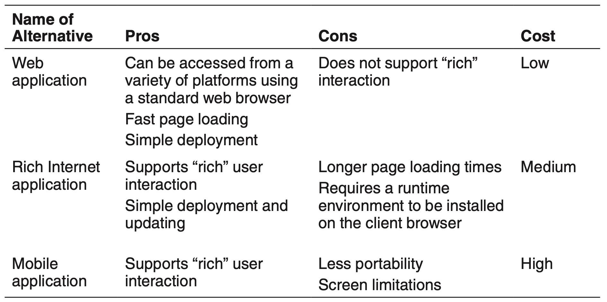

> The Cost Benefit Analysis Method
>
> 成本效益分析法
>
> The CBAM is a method that guides the selection of design alternatives using a quantitative-定量的 approach.
>
> CBAM是一种使用定量方法指导设计方案选择的方法。
>
> This method considers that architectural strategies (i.e., combinations of design concepts) affect quality attribute responses, and that the level of each response in turn provides system stakeholders with some benefit called utility-实用.
>
> 该方法考虑到体系结构策略(例如，设计概念的组合)影响质量属性响应，并且每个响应的级别依次为系统涉众提供一些称为效用的好处。
>
> Each architectural strategy provides a different level of utility, but also has a cost and takes time to implement.
>
> 每种体系结构策略都提供了不同级别的实用程序，但也需要成本和时间来实现。
>
> The idea behind the CBAM is that by studying levels of utility and costs of implementation, particular architectural strategies can be selected based on their associated return on investment (ROI).
>
> CBAM背后的思想是，通过研究效用级别和实现成本，可以根据相关的投资回报(ROI)选择特定的体系结构策略。
>
> The CBAM was conceived-构思,设想 to be performed after an ATAM (architecture tradeoff analysis method), but it is possible to use the CBAM during design—that is, prior to the moment where the architectural evaluation is performed.
>
> CBAM 被认为是在 ATAM(体系结构权衡分析方法)之后执行的，但是在设计期间(即在执行体系结构评估之前)使用 CBAM 是可能的。
>
> ---
>
> The CBAM takes as its input a collection of prioritized traditional quality attribute scenarios, which are then analyzed and refined with additional information.
>
> CBAM 将一组经过优先排序的传统质量属性场景作为输入，然后使用附加信息对其进行分析和细化。
>
> The addition is to consider several levels of response for each scenario:
>
> 增加的内容是考虑对每一种情况作出若干级别的反应:
>
> - The worst-case scenario, which represents the minimum threshold at which a system must perform (utility = 0)
>
>   > 最坏情况，表示系统必须执行的最小阈值(效用= 0)
>
> - The best-case scenario, which represents the level after which stakeholders foresee-预见,预知 no further utility (utility = 100)
>
>   > 最佳情况的场景，它代表了涉众预见到没有进一步效用的水平(效用= 100)
>
> - The current scenario, which represents the level at which the system is already performing (the utility of the current scenario is estimated by stakeholders)
>
>   > 当前场景，它代表了系统已经执行的级别(当前场景的效用是由涉众估计的)
>
> - The desired scenario, which represents the level of response that the stakeholders are hoping to achieve (the utility of the desired scenario is estimated by stakeholders)
>
>   > 期望的场景，它代表了涉众希望实现的响应级别(期望场景的效用由涉众估计)
>
> Using these data points, we can draw a utility–response curve-曲线,弧线, as shown in the figure.
>
> 使用这些数据点，我们可以绘制效用-响应曲线，如图所示。
>
> After the utility–response curve is mapped for each of the different scenarios, a number of contemplated-预期的 design alternatives may be considered, and their expected response values can be estimated.
>
> 在为每个不同的场景映射了效用-响应曲线之后，可以考虑许多预期的设计备选方案，并可以估计它们的预期响应值。
>
> For example, if we are concerned about mean-平均的 time to failure, we might consider three different architectural strategies (i.e., redundancy options)— for example, no redundancy, cold spare, and hot spare.
>
> 例如，如果我们关心平均故障时间，我们可能会考虑三种不同的体系结构策略(即冗余选项)——例如，无冗余、冷备和热备。
>
> For each of these strategies, we could estimate their expected responses (i.e., their expected mean times to failure).
>
> 对于这些策略中的每一个，我们可以估计它们的预期响应(即，它们的预期平均失败时间)。
>
> In the graph shown here, the “e” represents one such option, placed on the curve based on its expected response measure.
>
> 在这里所示的图表中，“e”代表一个这样的选项，根据其预期响应度量放置在曲线上。
>
> ---
>
> Using these response estimates, the utility values of each architectural strategy can now be determined via interpolation-插值, which provides its expected benefit.
>
> 使用这些响应估计，现在可以通过插值确定每个体系结构策略的实用价值，从而提供其预期的好处。
>
> The costs of each architectural strategy are also elicited— one would expect hot spare to be the most costly, followed by cold spare and no redundancy.
>
> 每种体系结构策略的成本也会被提出来——人们会认为热备的成本是最高的，其次是冷备和无冗余。
>
> ---
>
> Given all of this information, architectural strategies can now be selected based on their expected value for cost.
>
> 给定所有这些信息，现在可以根据预期的成本值来选择架构策略。
>
> 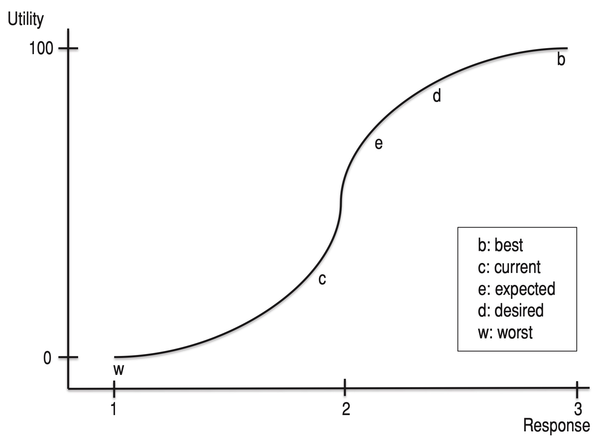
>
> Although the CBAM may seem relatively complex and time-consuming at first, you need to consider that some design decisions can have enormous-巨大的,极大的 economic-经济的 consequences—in terms of their costs, their benefits, and their effects on project schedule.
>
> 尽管 CBAM一开始可能看起来相对复杂且耗时，但您需要考虑到一些设计决策可能会产生巨大的经济后果——就其成本、收益和对项目进度的影响而言。
>
> You must decide if you are willing to take the chance of making these decisions solely-单独地,仅有地 using a gut-feeling approach versus this more rational-理性的,理智的 and systematic-系统的 approach.
>
> 你必须决定你是否愿意冒险用直觉的方法来做这些决定，而不是用更理性和系统的方法。

---

In case the previous analysis techniques do not guide you to make an appropriate selection, you may need to create throwaway-一次性,抛弃,废弃 prototypes and collect measurements from them.

> 如果前面的分析技术不能指导您做出适当的选择，您可能需要创建一次性原型并从中收集测量值。

The creation of early throwaway prototypes is a useful technique to help in the selection of externally developed components. 

> 创建早期的一次性原型是帮助选择外部开发组件的有用技术。

This type of prototype is usually created in a “quick and dirty-肮脏” fashion without too much consideration for maintainability or reuse.

> 这种类型的原型通常以“快速而肮脏”的方式创建，没有过多考虑可维护性或重用性。

For these reasons, it is important to keep in mind that throwaway prototypes should not be used as a basis for further development.

> 由于这些原因，重要的是要记住，一次性的原型不应该被用作进一步开发的基础。

---

Although the creation of prototypes can be costly-昂贵的,值钱的 compared to analysis (the ratio of costs is between 10 and 5 to 1, according to our sources), certain scenarios strongly motivate-激励,激发 the creation of prototypes.

> 尽管与分析相比，原型的创建可能是昂贵的(根据我们的资料，成本的比例在10到5比1之间)，但某些场景强烈地激发了原型的创建。

Aspects that you should consider when deciding whether you will create a prototype include the following:

> 在决定是否创建原型时，你应该考虑以下几个方面：

- Does the project incorporate emerging technologies?

  > 项目是否包含新兴技术?

- Is the technology new in the company?

  > 公司的技术是新的吗?

- Are there certain drivers, particularly quality attributes, whose satisfaction using the selected technology presents risks (i.e., it is not understood if they can be satisfied)?

  > 是否存在某些驱动因素，特别是质量属性，其使用所选技术的满足会带来风险(即，不知道是否可以满足它们)?

- Is there a lack of trusted information, internal or external, that provides some degree of certainty-确定性 that the selected technology will be useful to satisfy the project drivers?

  > 是否缺乏可信赖的信息，内部的或外部的，这些信息提供了一定程度的确定性，即所选择的技术将有助于满足项目驱动因素?

- Are there configuration options associated with the technology that need to be tested or understood?

  > 是否存在需要测试或理解的与技术相关的配置选项?

- Is it unclear whether the selected technology can be integrated with other technologies that are used in the project?

  > 是否不清楚所选择的技术是否可以与项目中使用的其他技术集成?

If most of your answers to these questions are “yes”, then you should strongly consider the creation of a throwaway prototype.

> 如果你对这些问题的回答大多是“是”，那么你就应该考虑创建一个一次性原型了。

---

When identifying and selecting design concepts, you need to keep in mind the *constraints* that are part of the architectural drivers, because some constraints will restrict-限制 you from selecting particular-特定的 alternatives.

> 当识别和选择设计概念时，您需要记住作为架构驱动部分的“约束”，因为一些约束将限制您选择特定的替代方案。

For example, a constraint might require that all libraries and frameworks in the system do not use the GPL-通用公共许可证 license; thus, even if you have found a framework that could be useful for your needs, you may need to discard-扔掉,废弃 it if it has a GPL license.

> 例如，一个约束可能要求系统中的所有库和框架不使用GPL许可；因此，即使您找到了一个可能对您的需求有用的框架，如果它有GPL许可，您也可能需要放弃它。

Also, you need to keep in mind that the decisions regarding the selection of design concepts that you have made in previous iterations may restrict the design concepts that you can select in the future because of incompatibilities-不兼容.

> 另外，您需要记住，由于不兼容，您在以前的迭代中所做的关于设计概念选择的决策可能会限制您将来可以选择的设计概念。

For example, if you selected a web application reference architecture for use in an initial iteration, you cannot select a user interface framework intended for local applications in a subsequent iteration.

> 例如，如果您选择了在初始迭代中使用的web应用程序参考体系结构，那么您就不能在后续迭代中选择用于本地应用程序的用户界面框架。

---

Finally, you need to remember that even though ADD provides guidance on how to perform the design process, it cannot ensure that you will make appropriate design decisions.

> 最后，您需要记住，即使ADD提供了如何执行设计过程的指导，它也不能确保您将做出适当的设计决策。

Thorough reasoning and considering different alternatives (not just the first thing that comes to mind) are the best means to improve the odds of finding a good solution.

> 彻底的推理和考虑不同的选择(不仅仅是想到的第一件事)是提高找到一个好的解决方案的几率的最好方法。

We discuss doing “analysis in the design process” in Chapter 8.

> 我们将在第8章讨论“在设计过程中进行分析”。

## 3.5 Producing Structures

> 生产结构

Design concepts per se won’t help you satisfy your drivers unless-除非 you produce *structures*;

> 设计概念本身不会帮助你满足你的驱动，除非你生产出“结构”;

that is, you need to identify and connect elements that are derived-衍生,起源于 from the selected design concepts.

> 也就是说，您需要识别和连接来自所选设计概念的元素。

This process is the *instantiation* of architectural elements in ADD: creating elements and relationships between them, and associating responsibilities with these elements.

> 这个过程是ADD中体系结构元素的实例化：创建元素和它们之间的关系，并将责任与这些元素关联起来。

It is important to remember that the architecture of a software system is composed-组成,构成 of a set of structures, which can be grouped into three major categories:

> 重要的是要记住，软件系统的架构是由一组结构组成的，这些结构可以分为三大类:

- *Module structures*: composed of logical and static elements that exist at development time, such as files, modules, and classes

  > 模块结构：由开发时存在的逻辑和静态元素组成，如文件、模块和类

- *Component and connector (C&C) structures*: composed of dynamic elements that exist at runtime, such as processes and threads

  > 组件和连接器(C&C)结构：由运行时存在的动态元素组成，如进程和线程

- *Allocation structures*: composed of both software elements (from a module or C&C structure) and non-software elements that may exist both at development time and at runtime, such as file systems, hardware, and development teams

  > *分配结构*：由软件元素(来自模块或C&C结构)和可能在开发时和运行时存在的非软件元素组成，例如文件系统、硬件和开发团队

When you instantiate a design concept, you may actually produce more than one structure.

> 当您实例化一个设计概念时，实际上可能会生成多个结构。

For example, in a particular iteration you may instantiate the Layers pattern, which will result in a Module structure.

> 例如，在一个特定的迭代中，你可以实例化层模式，这将导致一个模块结构。

As part of instantiating this pattern, you will need to choose the number of layers, their relationships, and the specific responsibilities of each layer.

> 作为实例化此模式的一部分，您将需要选择层的数量、层之间的关系以及每一层的特定职责。

As part of the iteration, you may also study how a scenario is supported by the elements that you have just identified.

> 作为迭代的一部分，您还可以研究您刚刚确定的元素是如何支持场景的。

For example, you could create instances of the logical elements in a C&C structure and model how they exchange-交换,互换 messages (see Section 3.6).

> 例如，您可以在C&C结构中创建逻辑元素的实例，并对它们交换消息的方式进行建模(参见第3.6节)。

Finally, you may want to decide who will be responsible for implementing the modules inside each of the layers, which is an allocation decision.

> 最后，您可能想要决定谁将负责实现每个层中的模块，这是一个分配决策。

### 3.5.1 Instantiating Elements

> 实例化元素

The instantiation of architectural elements depends on the type of design concept that you are working with:

> 架构元素的实例化取决于你正在使用的设计概念的类型:

- *Reference architectures.*

  > 参考架构

  In the case of reference architectures, instantiation typically means that you perform some sort of customization.

  > 在参考体系结构的情况下，实例化通常意味着执行某种自定义。

  As part of this work, you will add or remove elements that are part of the structure that is defined by the reference architecture.

  > 作为这项工作的一部分，您将添加或删除由参考体系结构定义的结构的一部分元素。

  For example, if you are designing a web application that needs to communicate with an external application to handle payments, you will probably need an integration layer in addition to the traditional presentation, business, and data layers.

  > 例如，如果您正在设计一个需要与外部应用程序通信以处理支付的web应用程序，那么除了传统的表示层、业务层和数据层之外，您可能还需要一个集成层。

- *Architectural and design patterns*.

  > 架构和设计模式

  These patterns provide a generic structure composed of elements, their relationships and their responsibilities.

  > 这些模式提供了一个由元素、元素之间的关系和它们的职责组成的通用结构。

  As this structure is generic, you will need to adapt-调整,适应 it to your specific problem.

  > 由于此结构是通用的，因此您需要根据具体问题对其进行调整。

  Instantiation usually involves transforming the generic structure defined by the pattern into a specific one that is adapted to the needs of the problem that you are solving.

  > 实例化通常涉及将模式定义的通用结构转换为适合您正在解决的问题的特定结构。

  For example, consider the Pipe and Filters architectural pattern.

  > 例如，考虑管道和过滤器体系结构模式。

  It establishes the basic elements of computation—filters—and their relationships—pipes—but does not specify how many filters you should use for your problem or what their relationships should be.

  > 它建立了计算过滤器的基本元素和它们之间的关系管道，但是没有指定应该为您的问题使用多少过滤器，或者它们之间应该是什么关系。

  You will instantiate this pattern by defining how many pipes and filters are needed to solve your problem, by establishing the specific responsibilities of each of the filters, and by defining their topology-拓扑.

  > 您将通过定义解决问题需要多少管道和过滤器、建立每个过滤器的特定职责以及定义它们的拓扑来实例化此模式。

- *Deployment patterns.*

  > 部署模式

  Similar to the case with architectural and design patterns, the instantiation of deployment patterns generally involves the identification and specification of physical elements.

  > 与体系结构和设计模式的情况类似，部署模式的实例化通常涉及物理元素的标识和规范。

  If, for example, you are using a Load-Balanced Cluster pattern, instantiation may involve identifying the number of replicas to be included in the cluster, the load-balancing algorithm, and the physical location of the replicas.

  > 例如，如果您正在使用负载均衡集群模式，则实例化可能涉及识别集群中要包含的副本数量、负载平衡算法和副本的物理位置。

- *Tactics*.

  > 策略

  This design concept does not prescribe-规定,命令 a particular structure, so you will need to use other design concepts to instantiate a tactic.

  > 这个设计概念并没有规定一个特定的结构，所以你需要使用其他的设计概念来实例化一个策略。

  For example, you may select a security tactic of authenticating actors and instantiate it by creating a custom-coded **ad hoc**-特别的 solution, or by using a security pattern, or by using an externally developed component such as a security framework.

  > 例如，您可以选择对参与者进行身份验证的安全策略，并通过创建自定义编码的特别解决方案、使用安全模式或使用外部开发的组件(如安全框架)来实例化它。

- *Externally developed components*.

  > 外部开发的组件

  The instantiation of these components may or may not imply-暗指,意味着 the creation of new elements.

  > 这些组件的实例化可能意味着也可能不意味着创建新元素。

  For example, in the case of object-oriented frameworks, instantiation may require you to create specific classes that inherit-继承 from the base classes defined in the framework.

  > 例如，在面向对象框架的情况下，实例化可能需要您创建从框架中定义的基类继承的特定类。

  This will result in new elements.

  > 这将产生新的元素。

  Other approaches, which do not involve the creation of new elements, might include choosing a specific technology from a technology family that was identified in a previous iteration, associating a particular framework to elements that were identified in a previous iteration, or specifying configuration options for an element associated with a particular technology (such as a number of threads in a thread pool).

  > 其他不涉及创建新元素的方法，可能包括从先前迭代中确定的技术族中选择特定的技术，将特定框架与先前迭代中确定的元素相关联，或者为与特定技术相关联的元素指定配置选项(例如线程池中的许多线程)。

### 3.5.2 Associating Responsibilities and Identifying Properties

> 关联职责和识别属性

When you are creating elements by instantiating design concepts, you need to consider the responsibilities that are allocated to these elements.

> 当您通过实例化设计概念来创建元素时，您需要考虑分配给这些元素的职责。

For example, if you instantiate the Layers pattern and decide to use the traditional three-layer structure, you might decide that one of the layers will be responsible for managing the interactions with the users (typically known as the presentation layer). 

> 例如，如果您实例化Layers模式并决定使用传统的三层结构，您可能会决定其中一层负责管理与用户的交互(通常称为表示层)。

When instantiating elements and allocating responsibilities, you should keep in mind the high cohesion/low coupling design principle: Elements should have high cohesion (internally), defined by a narrow-狭窄的,狭小的 set of responsibilities, and low coupling (externally), defined by a lack of knowledge of the implementation details of other elements.

> 在实例化元素和分配职责时，您应该牢记高内聚/低耦合设计原则：元素应该具有高内聚(内部)，由一组狭窄的职责定义，以及低耦合(外部)，由缺乏对其他元素的实现细节的了解定义。

---

One additional aspect that you need to consider when instantiating design concepts is the properties of the elements.

> 在实例化设计概念时需要考虑的另一个方面是元素的属性。

This may involve aspects such as the configuration options, statefulness-有状态性, resource management, priority, or even hardware characteristics (if the elements that you created are physical nodes) of the chosen technologies.

> 这可能涉及所选技术的配置选项、状态性、资源管理、优先级甚至硬件特征(如果您创建的元素是物理节点)等方面。

Identifying these properties supports analysis and the documentation of the design rationale-基本原理.

> 识别这些属性有助于分析和记录设计基本原理。

### 3.5.3 Establishing Relationships Between the Elements

> 建立元素之间的关系

The creation of structures also requires making decisions with respect to the relationships that exist between the elements and their properties.

> 结构的创建还需要根据元素及其属性之间存在的关系做出决策。

Once again, consider the Layers pattern.

> 再一次，考虑图层模式。

You may decide that two layers are connected, but these layers will eventually-最终,结果 be allocated to components that are, in turn, allocated to hardware.

> 您可以决定将两个层连接起来，但是这些层最终将分配给组件，而这些组件又分配给硬件。

In such a case, you need to decide how communication will take place between these layers, as they have been allocated to components: Is the communication synchronous or asynchronous?

> 在这种情况下，您需要决定如何在这些层之间进行通信，因为它们已分配给组件：通信是同步的还是异步的?

Does it involve some type of network communication?

> 它是否涉及某种类型的网络通信?

Which type of protocol is used?

> 使用哪种类型的协议?

How much information is transferred and at what rate?

> 有多少信息被传递，以什么速度传递?

These design decisions can have a significant impact with respect to achieving certain quality attributes such as performance.

> 这些设计决策可以对实现某些质量属性(如性能)产生重大影响。

## 3.6 Defining Interfaces

*Interfaces* are the externally visible properties of elements that establish a contractual-契约性的 specification that allows elements to collaborate and exchange information.

> 接口是元素的外部可见属性，它建立了允许元素协作和交换信息的契约规范。

There are two categories of interfaces: external and internal.

### 3.6.1 External Interfaces

External interfaces include interfaces from other systems that are *required* by the system that you are developing and interfaces that are *provided* by your system to other systems.

Required interfaces are part of the constraints for your system, as you usually cannot influence their specification.

> 所需的接口是系统约束的一部分，因为您通常不能影响它们的规范。

Provided interfaces need to be formally defined, which can be performed in a similar way to defining internal interfaces—that is, by considering interactions between the external systems and your system and seeing them as elements of a bigger structure.

> 提供的接口需要正式定义，这可以用与定义内部接口类似的方式来执行——也就是说，通过考虑外部系统和系统之间的交互，并将它们视为更大结构的元素。

---

Establishing a system context at the beginning of the design process is useful to identify external interfaces.

> 在设计过程的开始建立系统上下文对于识别外部接口是有用的。

This context can be represented using a system context diagram, as shown in Figure 3.3.

> 这个上下文可以用系统上下文图来表示，如图3.3所示。

Given that external entities and the system under development interact-相互作用,相互影响 via interfaces, there should be at least one external interface per external system (each relationship in the figure).

> 假设外部实体和正在开发的系统通过接口进行交互，每个外部系统应该至少有一个外部接口(图中的每个关系)。

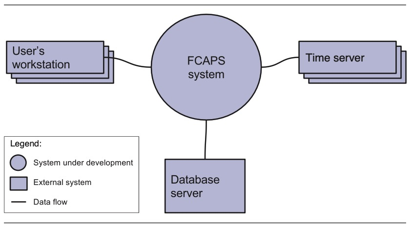

**FIGURE 3.3** A system context diagram

> **图3.3** 系统上下文图

### 3.6.2 Internal Interfaces

Internal interfaces are interfaces between the elements that result from the instantiation of design concepts.

> 内部接口是由设计概念实例化产生的元素之间的接口。

To identify the relationships and the interface details, you generally need to understand how the elements exchange information at runtime.

> 为了确定关系和接口细节，您通常需要了解元素在运行时如何交换信息。

You can achieve this with the help of modeling tools such as UML sequence diagrams (Figure 3.4), which allow you to model the information that is exchanged between elements during execution to support use cases or quality attribute scenarios.

> 您可以在建模工具的帮助下实现这一点，例如 UML 序列图(图3.4)，它允许您对执行期间元素之间交换的信息进行建模，以支持用例或质量属性场景。

This type of analysis is also useful for identifying relationships between elements: If two elements need to exchange information directly, then a relationship between these elements must exist.

> 这种类型的分析对于识别元素之间的关系也很有用：如果两个元素需要直接交换信息，那么这些元素之间必须存在关系。

The information that is exchanged becomes part of the specification of the interface.

> 交换的信息成为接口规范的一部分。

Interfaces typically consist of a set of operations (such as methods) with specified parameters, return values, and possibly, exceptions and pre and post conditions.

> 接口通常由一组操作(比如方法)组成，这些操作带有指定的参数、返回值，可能还有异常、前置和后设条件。

Some interfaces, however, may involve other information exchange mechanisms, such as a component that writes information to a file or database and another component that then accesses this information.

> 但是，有些接口可能涉及其他信息交换机制，例如将信息写入文件或数据库的组件和随后访问该信息的另一个组件。

Interfaces may also establish quality of service agreements-协议.

> 接口还可以建立服务质量协议。

For example, the execution of an operation specified in the interface may be time-constrained to satisfy a performance quality attribute scenario.

> 例如，在接口中指定的操作的执行可能受到时间限制，以满足性能质量属性场景。

---

> The following is an initial sequence diagram for Use Case UC-2 (Detect Fault-故障)1 from the FCAPS case study in Chapter 4.
>
> 以下是来自第4章 FCAPS 案例研究的用例UC-2(检测故障)1的初始序列图。
>
> This diagram shows the interactions between an actor and the five components that participate in UC-2.
>
> 这个图显示了参与者和参与UC-2的五个组件之间的交互。
>
> In creating this diagram, we identify the information that is exchanged, the methods that are invoked, and the values that are passed and returned.
>
> 在创建此关系图时，我们确定了交换的信息、调用的方法以及传递和返回的值。

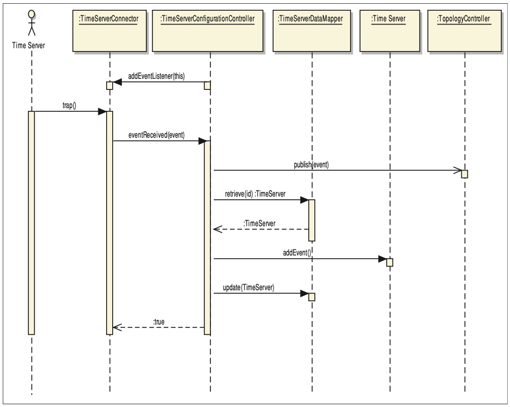

> Key: UML
>
> From this interaction, initial methods for the interfaces of the interacting elements can be identified:
>
> 从这种交互中，可以确定交互元素的接口的初始方法:

**Name:** **TimeServerConnector**

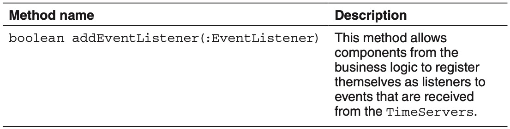

**FIGURE 3.4** A sequence diagram used to identify interfaces

> **图3.4** 用于识别接口的序列图

---

The identification of interfaces is usually not performed equally across all design iterations.

> 接口的识别通常不是在所有设计迭代中平等地执行的。

When you are starting the design of a greenfield system, for example, your first iterations will produce only abstract elements such as layers, with these elements then being refined in later iterations.

> 例如，当您开始设计一个绿地系统时，您的第一次迭代将只产生抽象的元素，例如层，这些元素将在以后的迭代中进行细化。

The interfaces of abstract elements such as layers are typically-通常 underspecified.

> 抽象元素(如层)的接口通常没有详细说明。

For example, in an early iteration you might simply specify that the UI layer sends “commands” to the business logic layer, with the business logic layer sending “results” back.

> 例如，在早期的迭代中，您可以简单地指定 UI 层向业务逻辑层发送“命令”，业务逻辑层返回“结果”。

As you advance-前进,推进 in the design process and particularly-特别是,尤其 when you create structures to address specific-特定的 use cases and quality attribute scenarios, you will need to refine the interfaces of the specific elements that participate in the interaction.

> 随着您在设计过程中的推进，特别是当您创建结构来处理特定的用例和质量属性场景时，您将需要细化参与交互的特定元素的接口。

---

In some special-特殊的,特别的 cases, identification of interfaces is greatly simplified-简化,简化.

> 在某些特殊情况下，接口的识别可以大大简化。

For example, in the Big Data case study we present in Chapter 5, interfaces are already defined by the technologies that are selected.

> 例如，在我们在第5章中介绍的大数据案例研究中，所选择的技术已经定义了接口。

The specification of interfaces then becomes a relatively trivial-琐碎的,不重要的 task, as the chosen technologies are designed to interoperate-交互操作 and hence have already “baked in” many interface assumptions and decisions.

> 接口的规范就变成了一项相对琐碎的任务，因为所选择的技术被设计为互操作，因此已经“融入”了许多接口假设和决策。

---

Finally, you need to consider that not all of the internal interfaces of the system element will be identified as part of the design process (see the sidebar “Identifying Interfaces in Element Interaction Design”).

> 最后，您需要考虑并不是所有系统元素的内部接口都将被标识为设计过程的一部分(请参阅侧栏“在元素交互设计中标识接口”)。

---

> **Identifying Interfaces in Element Interaction Design**
>
> 在元素交互设计中识别接口
>
> Although defining interfaces is an essential part of the architecture design process, it is important to recognize that not all of the internal interfaces are identified during architectural design.
>
> 尽管定义接口是体系结构设计过程的重要组成部分，但重要的是要认识到在体系结构设计期间并不是所有的内部接口都被识别出来。
>
> As part of the architecture design process, you typically consider the primary use cases as part of the architectural drivers, and you identify elements (usually modules) that support this primary functionality along with the other drivers.
>
> 作为体系结构设计过程的一部分，您通常将主要用例视为体系结构驱动程序的一部分，并确定支持该主要功能以及其他驱动程序的元素(通常是模块)。
>
> This process will, however, not uncover-揭露,发现 all of the elements and interfaces for the system that are required to support the entire set of use cases.
>
> 然而，这个过程将不会揭示支持整个用例集所需的系统的所有元素和接口。
>
> This lack of specificity-特殊性 is intended: Architecture is about abstraction, so necessarily some information is less important, particularly in the earliest stages of design.
>
> 这种特异性的缺乏是有意为之的：架构是抽象的，所以一些信息必然不那么重要，特别是在设计的早期阶段。
>
> ---
>
> Identifying the modules that support the nonprimary use cases is often necessary for estimation or work-assignment purposes.
>
> 识别支持非主要用例的模块对于评估或工作分配的目的通常是必要的。
>
> Identifying their interfaces is also necessary to support the individual development and integration of the modules and to perform unit testing.
>
> 识别它们的接口对于支持模块的单独开发和集成以及执行单元测试也是必要的。
>
> This identification of modules may be done early in the project life cycle, but it must not be confused-混淆,弄错 with a big design up front (BDUF) approach.
>
> 这种模块的识别可以在项目生命周期的早期完成，但一定不要将其与大型预先设计(BDUF)方法混淆。
>
> This, at most, is a BDUF that, in certain contexts such as early estimation or iteration planning, is hard to avoid.
>
> 这至多是一个BDUF，在诸如早期评估或迭代计划的特定环境中，是很难避免的。
>
> ---
>
> As an architect, you may identify the set of modules that supports the complete set of use cases for the system or for a particular release of the system, but the identification of the interfaces associated with the modules that support the nonprimary use cases is typically not your responsibility, as it would require a significant amount of your time and does not usually have a major architectural impact.
>
> 作为架构师，您可以确定支持系统或系统的特定版本的完整用例集的模块集，但是与支持非主要用例的模块相关联的接口的识别通常不是您的责任，因为它将需要您大量的时间，并且通常不会对体系结构产生重大影响。
>
> This task, which we call element interaction design (see Section 2.2.2), is usually performed after architectural design ends but before the development of (most of) the modules begins.
>
> 这个任务，我们称之为元素交互设计(参见第2.2.2节)，通常在架构设计结束之后，但在(大多数)模块开发开始之前执行。
>
> Although this task should be performed by other members in the development team, you play a critical role in it, since these interfaces must adhere to the architectural design that you established.
>
> 尽管这项任务应该由开发团队中的其他成员执行，但是您在其中扮演着关键的角色，因为这些接口必须遵循您所建立的体系结构设计。
>
> You, as the architect, must communicate the architecture to the engineers who are responsible for identifying the interfaces and ensure that they understand the rationale for the existing design decisions.
>
> 作为架构师，您必须与负责识别接口的工程师沟通架构，并确保他们理解现有设计决策的基本原理。
>
> ---
>
> A good way to achieve this communication is to use the active reviews for intermediate design (ARID) method.
>
> 实现这种沟通的一个好方法是使用中间设计的主动评审(ARID)方法。
>
> In this method, the architecture design (or part of it) is presented to a group of reviewers—in this case, the engineers who will make use of this design.
>
> 在这种方法中，架构设计(或其中的一部分)呈现给一组审阅者——在这种情况下，是将使用该设计的工程师。
>
> After the design presentation, a set of scenarios is selected by the participants.
>
> 在设计展示之后，参与者选择一组场景。
>
> The selected scenarios are used for the core of the exercise, where the reviewers use the elements present in the architecture to satisfy them.
>
> 所选择的场景用于练习的核心，审稿人使用体系结构中存在的元素来满足它们。
>
> In standard ARID, the reviewers are asked to write code or pseudo-code-假的,伪装的 for the purpose of identifying interfaces. 
>
> 在标准的ARID中，审稿人被要求编写代码或伪代码来标识接口。
>
> Alternatively, the architect can present the architecture, select a nonprimary functional scenario and ask the participants to identify the interfaces of the components that support the scenario using sequence diagrams or a similar method.
>
> 或者，架构师可以呈现体系结构，选择一个非主要的功能场景，并要求参与者使用序列图或类似的方法来识别支持该场景的组件的接口。
>
> ---
>
> Aside from the fact that the architectural design is reviewed in this exercise, there are additional benefits to this approach. 
>
> 除了在本练习中审查了体系结构设计之外，这种方法还有其他好处。
>
> Specifically, in a single meeting, the architecture design or part of it is presented to the entire team, and agreements can be reached with respect to how the interfaces should be defined (e.g., the level of detail or aspects such as parameter passing, data types, or exception management).
>
> 具体地说，在一次会议中，将体系结构设计或其部分内容呈现给整个团队，并就如何定义接口达成一致(例如，细节级别或参数传递、数据类型或异常管理等方面)。

## 3.7 Creating Preliminary-初步的,预备的 Documentation During Design

> 在设计过程中创建初步文档

A software architecture is typically documented as a set of *views*, which represent the different structures-结构 that compose the architecture.

> 软件体系结构通常以一组“视图”的形式记录，这些“视图”表示组成体系结构的不同结构。

The formal documentation of these views is not part of the design process.

> 这些视图的正式文档不是设计过程的一部分。

Structures, however, are produced as part of design.

> 然而，结构是作为设计的一部分产生的。

Capturing them, even in an informal manner (i.e., as sketches), along with the design decisions that led you to create these structures, is a task that should be performed as part of normal design activities.

> 捕获它们，即使是以一种非正式的方式(例如，作为草图)，以及引导您创建这些结构的设计决策，是一项应该作为正常设计活动的一部分执行的任务。

### 3.7.1 Recording Sketches of the Views

> 记录视图草图

When you produce structures by instantiating the design concepts that you have selected to address a particular design problem, you will typically not produce these structures in your mind, but rather will create some *sketches* of them.

> 当你通过实例化你所选择的设计概念来解决一个特定的设计问题时，你通常不会在你的脑海中产生这些结构，而是会创建一些它们的草图。

In the simplest case, you will produce these sketches on a whiteboard, a flip-chart, or even a piece of paper.

> 在最简单的情况下，你可以把这些草图写在白板上、挂图上，甚至是一张纸上。

Otherwise, you may use a modeling tool in which you will draw the structures.

> 否则，您可以使用建模工具来绘制结构。

The sketches that you produce are the initial documentation for your architecture that you should capture and may **flesh out**-充实,丰满 later, if necessary.

> 您生成的草图是您的体系结构的初始文档，您应该捕获它，并在以后必要时充实它。

When you create sketches, you don’t need to always use a more formal language such as UML.

> 当您创建草图时，您不需要总是使用更正式的语言，如UML。

If you use some informal notation, you should at least be careful in maintaining consistency in the use of symbols.

> 如果您使用一些非正式的符号，您至少应该注意保持符号使用的一致性。

Eventually, you will need to add a legend-图例 to your diagrams to provide clarity and avoid ambiguity.

> 最后，您将需要为您的图表添加一个图例，以提供清晰度并避免歧义。

---

You should develop discipline-纪律 in writing down the responsibilities that you allocate to the elements as you create the structures. 

> 在创建结构时，您应该在写下分配给元素的职责时制定规程。

The reasons for this are simple: As you identify an element, you are determining some responsibilities for that element in your mind-头脑.

> 这样做的原因很简单:当您确定一个元素时，您在头脑中确定了该元素的一些责任。

Writing it down *at that moment* ensures that you won’t have to remember it later.

> 在那一刻把它写下来，可以确保你以后不需要记住它。

Also, it is easier to write down the responsibilities associated with your elements gradually-逐渐地,逐步地, rather than compiling all of them at a later time.

> 而且，逐渐地写下与元素相关的职责比稍后再编译它们更容易。

---

Creating this preliminary documentation as you design requires some discipline.

> 在设计时创建这个初步文档需要一些原则。

But the benefits are worth the effort—you will be able to produce the more detailed architecture documentation relatively easily and quickly at a later point.

> 但是这些好处是值得付出努力的——您将能够在稍后相对容易和快速地生成更详细的体系结构文档。

One simple way that you can document responsibilities if you are using a whiteboard, a flip-chart, or a PowerPoint slide is to take a photo of the sketch that you have produced and paste it in a document, along with a table that summarizes the responsibilities of every element depicted-描述,描绘 in the diagram (Figure 3.5 provides an example).

> 如果您正在使用白板、幻灯片或PowerPoint幻灯片，那么您可以记录职责的一个简单方法是将您制作的草图的照片粘贴到文档中，并附上一个表格，该表格总结了图中所描述的每个元素的职责(图3.5提供了一个示例)。

If you are using a computer-aided software engineering (CASE) tool, you can select an element to create and use the text area that usually appears in the properties sheet of the element to document its responsibilities, and then generate the documentation automatically.

> 如果您正在使用计算机辅助软件工程(CASE)工具，您可以选择一个元素来创建，并使用通常出现在元素的属性表中的文本区域来记录其职责，然后自动生成文档。

---

This diagram presents a sketch of a module view depicting the overall system structure from the case study in Chapter 5.

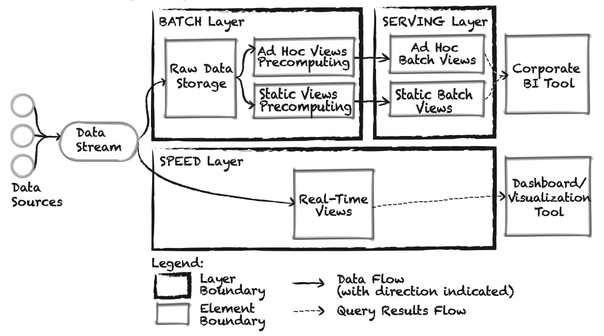

The diagram is complemented-补充,补足 with a table that describes the element’s responsibilities:

> 图中还添加了一个描述元素职责的表格:

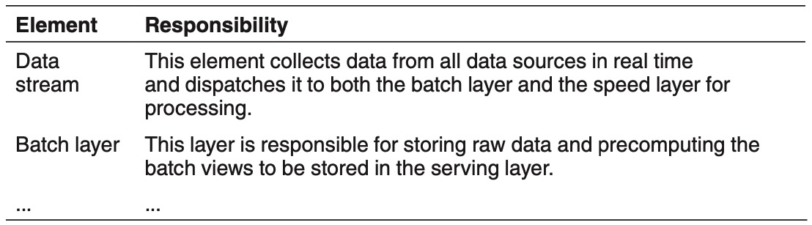

**FIGURE 3.5** Sample preliminary documentation

> **图3.5 ** 初步文件样本

---

Of course, it is not necessary to document *everything*.

The three purposes of documentation are analysis, construction-构造,建造,结构, and education.

> 文档的三个目的是分析、构建和教育。

At the moment you are designing, you should choose a documentation purpose and then document to fulfill that purpose, based on your risk mitigation concerns.

> 在您进行设计的时候，您应该选择一个文档目的，然后根据您的风险缓解问题，编写文档以实现该目的。

For example, if you have a critical quality attribute scenario that your architecture design needs to satisfy, and if you will need to prove this requirement is met in an analysis, then you must take care to document the information that is relevant for the analysis to be satisfactory.

> 例如，如果您有一个关键的质量属性场景，您的体系结构设计需要满足这个场景，并且如果您需要证明在分析中满足了这个需求，那么您必须小心地记录与分析相关的信息，使其令人满意。

Alternatively-要么,或者, if you anticipate-预期,预料 having to train new team members, then you should make a sketch of a C&C view of the system, showing how it operates and how the elements interact at runtime, and perhaps construct a crude-粗略的,大概的 module view of the system, showing at least the major layers or subsystems.

> 另外，如果您期望必须培训新的团队成员，那么您应该绘制系统的C&C视图的草图，显示它是如何操作的，以及运行时元素是如何交互的，并且可能构建系统的粗略模块视图，至少显示主要的层或子系统。

---

Finally, it is a good idea to remember, as you are documenting, that your design may eventually be analyzed.

> 最后，在编写文档时最好记住，您的设计最终可能会被分析。

Consequently-因此,结果, you need to think about which information should be documented to support this analysis (see the sidebar “Scenario-Based Documentation”).

> 因此，您需要考虑应该记录哪些信息来支持此分析(请参阅侧栏“基于场景的文档”)。

---

> **Scenario-Based Documentation**
>
> An analysis of an architecture design is based on your most important use cases and quality attribute scenarios.
>
> 架构设计的分析是基于您最重要的用例和质量属性场景。
>
> Simply put, a scenario is selected and you must explain to reviewers-审查人 how the architecture supports the scenario, and justify-对…作出解释 your decisions.
>
> 简单地说，选择了一个场景，您必须向审查人员解释体系结构如何支持该场景，并证明您的决定是正确的。
>
> To start preparing for the analysis while you design, it is useful to produce and document structures that contain the elements that are involved in the satisfaction of a scenario.
>
> 为了在设计时开始为分析做准备，生成并记录包含满足场景所需元素的结构是很有用的。
>
> This should come naturally given that the design process is guided by scenarios, but keeping this point firmly-坚固地,牢固地 in mind is always helpful.
>
> 考虑到设计过程是由场景引导的，这应该是很自然的，但牢牢记住这一点总是有帮助的。
>
> ---
>
> During the design process, you should at least try to capture the following elements in a single document:
>
> 在设计过程中，您至少应该尝试在单个文档中捕获以下元素:
>
> - The primary presentation: the diagram that represents the structure that you produced
>
>   > 主要表示：表示您生成的结构的图表
>
> - The element responsibilities table: it will help you record the responsibilities of the elements that are present in the structure
>
>   > 元素职责表：它将帮助您记录结构中出现的元素的职责
>
> - The relevant design decisions, and their rationales (see Section 3.7.2) 
>
>   > 相关的设计决策及其基本原理(见第3.7.2节)
>
> ---
>
> You might also capture two other pieces of information:
>
> - A runtime representation of the element’s interaction—for example, a sequence diagram
>
>   > 元素交互的运行时表示——例如，序列图
>
> - The initial interface specifications (which can also be captured in a separate document)
>
>   > 初始接口规范(也可以在单独的文档中获取)
>
> As you can see, all of this information needs to be produced as part of the design process.
>
> 正如您所看到的，所有这些信息都需要作为设计过程的一部分生成。
>
> One way or another, you need to decide which elements are present in the system and how they interact.
>
> 无论如何，您需要决定系统中存在哪些元素以及它们如何相互作用。
>
> The only question is whether you bother to write this information down, or whether its sole-唯一的,仅有的 representation is in the code.
>
> 唯一的问题是您是否费心将这些信息写下来，或者它的唯一表示是否在代码中。
>
> ---
>
> If you follow the approach that we advocate-拥护,提倡 here, at the end of the design you will have a set of preliminary views documented, in which each of the views is associated with a particular scenario, and you will have this documentation at little cost.
>
> 如果您遵循我们提倡的方法(拥护，提倡)，在设计结束时，您将有一组记录的初步视图，其中每个视图都与特定的场景相关联，并且您将以很少的成本获得该文档。
>
> This preliminary documentation can be used “as is” to analyze the design, and particularly through scenario-based evaluations.
>
> 这个初步文档可以“按原样”用于分析设计，特别是通过基于场景的评估。

### 3.7.2 Recording Design Decisions

> 记录设计决策

In each design iteration, you make important design decisions to achieve your iteration goal.

> 在每次设计迭代中，您都要做出重要的设计决策来实现迭代目标。

As we saw previously, these design decisions include the following:

> 如前所述，这些设计决策包括以下内容:

- Selecting a design concept from several alternatives

  > 从几个备选方案中选择一个设计概念

- Creating structures by instantiating the selected design concept

  > 通过实例化选定的设计概念来创建结构

- Establishing relationships between elements and defining interfaces

  > 建立元素之间的关系并定义接口

- Allocating resources (e.g., people, hardware, computation)

  > 分配资源(例如，人员、硬件、计算)

- Others

  > 其他

When you study a diagram that represents an architecture, you see the end product of a thought process, but it may not be easy to understand the decisions that were made to achieve this result.

> 当您研究一个表示体系结构的图时，您看到的是一个思考过程的最终产物，但是要理解为实现这个结果而做出的决策可能并不容易。

Recording design decisions *beyond-除…之外* the representation of the chosen elements, relationships, and properties is fundamental to help in understanding how you arrived at the result: the design rationale.

> 除了所选择的元素、关系和属性的表示之外，记录设计决策是帮助理解如何达到结果的基础：设计原理。

---

When your iteration goal involves satisfying a specific quality attribute scenario, some of the decisions that you make will play significant roles in your ability to achieve the scenario response measure.

> 当您的迭代目标涉及到满足特定的质量属性场景时，您所做的一些决策将在您实现场景响应度量的能力中扮演重要的角色。

These are, therefore, the decisions that you should take the greatest care in recording.

> 因此，这些都是你在记录时应该非常小心的决定。

You should record these decisions because they are essential to facilitate-促进,推动,使容易 analysis of the design you created; then to facilitate implementation; and, still later, to aid in understanding of the architecture (e.g., during maintenance).

> 你应该记录下这些决定，因为它们对于分析你所创造的设计至关重要；然后便于实施;然后，帮助理解体系结构(例如，在维护期间)。

Also *every* design decision is “good enough” but seldom-不常,很少 optimal, so you need to justify-对…作出解释 the decisions made, and possibly revisit the remaining-剩余,剩下 risks later.

> 此外，*每个*设计决策都是“足够好”，但很少是最优的，所以你需要证明所做决策的合理性，并可能在以后重新审视剩余的风险。

---

You might think that recording design decisions is a tedious-乏味,冗长 task.

> 您可能认为记录设计决策是一项乏味的任务。

In reality, depending on the criticality of the system being developed, you can adjust the amount of information that is recorded. 

> 实际上，根据正在开发的系统的重要性，您可以调整记录的信息量。

For example, to record a minimum of information, you can use a simple table such as the one shown in Table 3.2.

> 例如，为了记录最少的信息，您可以使用表3.2所示的简单表。

If you decide to record more than this minimum, the following information can prove-证实,证明 useful:

> 如果您决定记录超过这个最低限度，以下信息可能会证明是有用的:

- What evidence-根据,证据 was produced to justify decisions?

  > 提出了什么证据来证明决定是正确的?

- Who did what?

- Why were shortcuts-捷径,抄近道 taken?

  > 为什么要走捷径?

- Why were tradeoffs made?

  > 为什么要做出权衡?

- What assumptions did you make?

  > 你做了什么假设?

And, in the same way that we suggest you record responsibilities as you identify elements, you should record the design decisions as you make them.

> 并且，正如我们建议您在确定元素时记录职责一样，您应该在做出设计决策时记录它们。

The reason for this is simple: If you leave it until later, you may not remember why you did things.

> 原因很简单：如果你把它留到以后，你可能不记得你为什么做了这些事情。

**TABLE 3.2** Example of a Table to Document Design Decisions

> **表3.2** 文档设计决策的表格示例

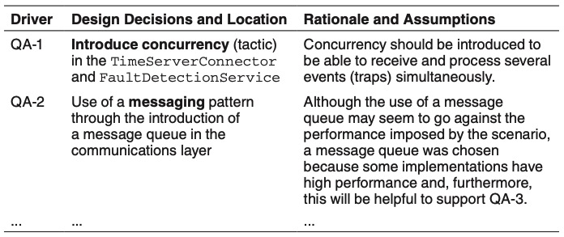

## 3.8 Tracking Design Progress

> 跟踪设计过程

**Even though**-尽管,虽然 ADD provides clear guidelines to perform design systematically, it does not provide a mechanism to track design progress.

> 尽管 ADD 为系统地执行设计提供了清晰的指导方针，但它并没有提供跟踪设计进度的机制。

When you are performing design, however, there are several questions that you want to answer:

> 然而，当你在执行设计时，你需要回答以下几个问题:

- How much design do we need to do?

  > 我们需要做多少设计?

- How much design has been done so far?

  > 到目前为止做了多少设计?

- Are we finished?

  > 我们结束了吗?

Agile practices such as the use of backlogs and Kanban boards can help you track the design progress and answer these questions.

> 敏捷实践，比如使用 backlog 和看板，可以帮助您跟踪设计进度并回答这些问题。

These techniques are not limited to Agile methods, of course.

> 当然，这些技术并不局限于敏捷方法。

Any development project using any methodology should track progress.

> 使用任何方法的任何开发项目都应该跟踪进度。

### 3.8.1 Use of an Architectural Backlog

The concept of an architecture (or design) backlog has been proposed by several authors (see Section 7.1).

> 架构(或设计)待办事项安排的概念已经被一些作者提出(参见7.1节)。

This is similar to what is found in Agile development methods such as Scrum.

> 这与敏捷开发方法(如Scrum)中的情况类似。

The basic idea is that you need to create a list of the pending actions that still need to be performed as part of the architecture design process.

> 其基本思想是，您需要创建一个仍然需要作为体系结构设计过程的一部分执行的挂起操作的列表。

---

Initially-开始,最初, you should populate-填充 the design backlog with your drivers, but other activities that support the design of the architecture can also be included.

> 最初，您应该用您的驱动程序填充设计待办事项，但是也可以包括支持体系结构设计的其他活动。

For example:

- Creation of a prototype to test a particular technology or to address a specific quality attribute risk

  > 创建原型以测试特定的技术或处理特定的质量属性风险

- Exploration and understanding of existing assets-资产 (possibly requiring reverse-逆向 engineering)

  > 探索和理解现有资产(可能需要逆向工程)

- Issues uncovered in a review of the design

  > 在设计审查中发现的问题

- Review of a partial design that was performed on a previous iteration

  > 回顾在之前的迭代中执行的部分设计

---

For example, when using Scrum, the sprint backlog and the design backlog are not independent: Some features in the sprint backlog may require architecture design to be performed, so they will generate items that go into the architectural design backlog.

> 例如，当使用 Scrum 时，sprint 待办事项列表和设计待办事项列表并不是独立的：sprint 待办事项列表中的一些特性可能需要执行架构设计，因此它们将生成进入架构设计待办事项列表的项目。

These two backlogs can be managed separately, however-但是,然而.

> 但是，这两个待处理任务可以分开管理。

The design backlog may even be managed internally, as it contains several items that are typically not discussed or prioritized by the customer (or product owner).

> 设计待办事项列表甚至可以在内部管理，因为它包含几个通常不会被客户(或产品所有者)讨论或优先考虑的项目。

---

Also, additional architectural concerns may arise as decisions are made.

> 此外，在做出决策时可能会出现额外的体系结构问题。

For example, if you choose a reference architecture, you will probably need to add specific architectural concerns, or quality attribute scenarios derived-衍生 from them, to the architectural design backlog.

> 例如，如果您选择一个参考体系结构，您可能需要向体系结构设计待办事项中添加特定的体系结构关注点，或者从中派生的质量属性场景。

An example of such a concern is the management of sessions for a web application reference architecture.

> 这种关注的一个例子是 web 应用程序参考体系结构的会话管理。

### 3.8.2 Use of a Design Kanban Board

> 使用设计看板

As design is performed in rounds and as a series of iterations within these rounds, you need to have a way of tracking the design’s degree of advancement-进展.

> 由于设计是按回合进行的，并且是在这些回合中进行的一系列迭代，因此您需要有一种方法来跟踪设计的进展程度。

You must also decide whether you need to continue making more design decisions (i.e., performing additional iterations).

> 您还必须决定是否需要继续做出更多的设计决策(例如，执行额外的迭代)。

One tool that can be used to facilitate this task is a Kanban board, such as the one shown in Figure 3.6

> 一个可以用来促进这项任务的工具是看板，如图3.6所示

---

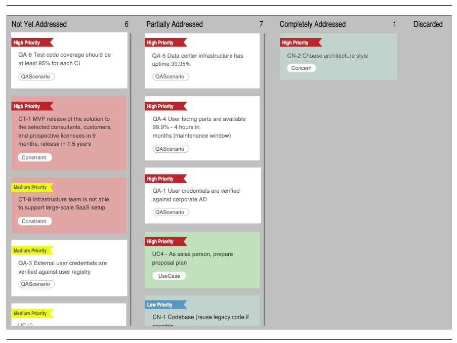

**FIGURE 3.6** A Kanban board used to track design progress

> **图3.6** 用于跟踪设计进度的看板

---

At the beginning of a design round, the inputs to the design process become entries in the backlog.

> 在设计回合的开始，设计过程的输入成为待办事项中的条目。

Initially, that activity occurs in step 1 of ADD; the different entries in your backlog for this design round should be added to the “Not Yet Addressed” column of the board (except if you have some entries that were not concluded-结束,终止 in previous design rounds that you wish to address here).

> 最初，这种活动发生在 ADD 的第一步：本次设计轮的待办事项中的不同条目应该添加到公告板的“尚未处理”栏中(除非您希望在这里处理一些在前几轮设计中未完成的条目)。

When you begin a design iteration, in step 2 of ADD, the backlog entries that correspond-类似于,相当于 to the drivers that you plan to address as part of the design iteration goal should be moved to the “Partially Addressed” column.

> 当您开始设计迭代时，在 ADD 的步骤2中，与您计划作为设计迭代目标的一部分进行处理的驱动程序相对应的待办事项项应该移动到“部分处理”列中。

Finally, once you finish an iteration and the analysis of your design decisions reveals-揭示 that a particular driver has been addressed (step 7 of ADD), the entry should be moved to the “Completely Addressed” column of the board.

> 最后，一旦你完成了一个迭代，并且对你的设计决策的分析揭示了一个特定的驱动程序已经被寻址(ADD的第7步)，这个条目应该被移动到板的“完全解决”列。

It is important to establish clear criteria that will allow a driver to be moved to the “Completely Addressed” column (think of this as the “Definition of Addressed” criteria, similar to the “Definition of Done” criteria used in Scrum).

> 建立清晰的标准是很重要的，它将允许驱动程序移动到“完全寻址”一栏(将其视为“寻址的定义”标准，类似于Scrum中使用的“完成的定义”标准)。

A criterion may be, for example, that the driver has been analyzed or that it has been implemented in a prototype.

> 一个标准可能是，例如，驱动程序已经被分析过，或者它已经在原型中被实现。

Also, drivers that are selected for a particular iteration may not be completely addressed in that particular iteration, in which case they should remain in the “Partially Addressed” column and, in preparation for subsequent iterations, you should consider how they can be allocated to the elements that exist at this point.

> 此外，为特定迭代选择的驱动程序可能不会在该特定迭代中完全解决，在这种情况下，它们应该保留在“部分解决”列中，并且在为后续迭代做准备时，您应该考虑如何将它们分配给此时存在的元素。

---

It can be useful to select a technique that will allow you to differentiate the entries in the board according to their priority.

> 选择一种技术可以让你根据优先级区分板上的条目，这是很有用的。

For example, you might use different colors of Post-it notes depending on the priority.

> 例如，您可以根据优先级使用不同颜色的便利贴。

---

With such a board, it is easy to visually-形象化地,外表上 track the advancement of design, as you can quickly see how many of the (most important) drivers are being or have been addressed in the design round.

> 有了这样一个板，很容易直观地跟踪设计的进展，因为您可以快速看到有多少(最重要的)驱动程序正在或已经在设计回合中得到解决。

This technique also helps you decide whether you need to perform additional iterations as, ideally, the design round is terminated when a majority of your drivers (or at least the ones with the highest priority) are located under the “Completely Addressed” column.

> 这种技术还可以帮助您决定是否需要执行额外的迭代，因为理想情况下，当大多数驱动程序(或至少具有最高优先级的驱动程序)位于“完全解决”列下时，设计轮就会终止。

## 3.9 Summary

In this chapter, we presented a detailed walk-through of the Attribute-Driven Design method, version 3.0.

> 在本章中，我们详细介绍了3.0版本的属性驱动设计方法。

We also discussed several important aspects that need to be considered in the various steps of the design process.

> 我们还讨论了在设计过程的各个步骤中需要考虑的几个重要方面。

These aspects include the use of a backlog, the various possible design roadmaps (for greenfield, brownfield, and novel contexts), the identification and selection of design concepts and their use in producing structures, the definition of interfaces, and the production of preliminary-初步的,预备的 documentation.

> 这些方面包括待办事项的使用，各种可能的设计路线图(用于绿地，棕地和新环境)，设计概念的识别和选择及其在生产结构中的使用，接口的定义，以及初步文档的生产。

---

Even though the overall architecture development life cycle includes documenting and analyzing architecture as activities that are separate from design, we have argued that a clean separation of these activities is artificial-人工的 and harmful-有害的,造成伤害的.

> 即使整个体系结构开发生命周期包括文档化和分析体系结构作为与设计分离的活动，我们也认为将这些活动完全分离是人为的和有害的。

We stress that preliminary documentation and analysis activities need to be regularly performed as integral parts of the design process.

> 我们强调，初步的文件和分析活动需要定期执行，作为设计过程的组成部分。

---

In Chapters 4, 5, and 6, we will instantiate ADD 3.0 in several extended examples, showing how the method works in the real world, in both greenfield and brownfield contexts.

> 在第4章、第5章和第6章中，我们将在几个扩展示例中实例化ADD 3.0，展示该方法如何在现实世界中，在绿地和棕地环境中工作。

## 3.10 Further Reading

Some of the concepts of ADD 3.0 were first introduced in an IEEE Software article: H. Cervantes, P. Velasco, and R. Kazman, “A Principled Way of Using Frameworks in Architectural Design”, *IEEE Software*, 46–53, March/April 2013. Version 2.0 of ADD was first documented in the SEI Technical Report: R. Wojcik, F. Bachmann, L. Bass, P. Clements, P. Merson, R. Nord, and B. Wood, “Attribute-Driven Design (ADD), Version 2.0”, SEI/CMU Technical Report CMU/SEI-2006-TR-023, 2006. An extended example of using ADD 2.0 was documented in W. Wood, “A Practical Example of Applying Attribute-Driven Design (ADD), Version 2.0”, SEI/CMU Technical Report: CMU/SEI-2007-TR-005.

Several alternative methods exist to support the design of software architectures. These are discussed in more detail and referenced in Chapter 7.

The concept of an architecture backlog is discussed in C. Hofmeister, P. Kruchten, R. Nord, H. Obbink, A. Ran, and P. America, “A General Model of Software Architecture Design Derived from Five Industrial Approaches”, *Journal of Systems and Software,* 80:106–126, 2007.

The ARID method is discussed in P. Clements, R. Kazman, and M. Klein, *Evaluating Software Architectures: Methods and Case Studies,* Addison-Wesley, 2002.

The CBAM method is presented in L. Bass, P. Clements, and R. Kazman, *Software Architecture in Practice,* 3rd ed., Addison-Wesley, 2013.

The ways in which an architecture can be documented are covered extensively-广阔地,广泛地 in P. Clements et al. *Documenting Software Architectures: Views and Be- yond*, 2nd ed., Addison-Wesley, 2011. More Agile approaches to documenting are discussed in books such as S. Brown, *Software Architecture for Developers*. Lean Publishing, 2015.

The importance and challenges of capturing design rationale are discussed in A. Tang, M. Ali Babar, I. Gorton, and J. Han, “A Survey of Architecture Design Rationale”, *Journal of Systems and Software*, 79(12):1792–1804, 2007. A minimalistic technique for capturing rationale is discussed in U. Zdun, R. Capilla, H. Tran, and O. Zimmermann, “Sustainable Architectural Design Decisions”, *IEEE Software*, 30(6):46–53, 2013.

