# Chapter 4. Case Study: FCAPS System

We now present a case study of using ADD 3.0 for a greenfield system in a mature-成熟的,理智的 domain.

> 我们现在提出了一个案例研究，将 ADD 3.0 用于成熟领域的绿地系统。

This case study details an initial design round composed of three iterations and is based on a real-world example.

> 本案例研究详细介绍了由三个迭代组成的初始设计轮，并基于真实世界的示例。

We first present the business context, and then we summarize the requirements for the system.

> 我们首先呈现业务上下文，然后总结系统的需求。

This is followed by a step-by-step summary of the activities that are performed during the ADD iterations.

> 接下来是 ADD 迭代期间执行的活动的逐步总结。

## 4.1 Business Case

In 2006, a large telecommunications-电信,电讯 company wanted to expand-扩展,扩大 its Internet Protocol (IP) network to support “carrier-class-电信级 services”, and more specifically high-quality voice over IP (VOIP) systems.

> 2006年，一家大型电信公司希望扩展其互联网协议(IP)网络，以支持“运营商级服务”，更具体地说，是高质量的IP语音(VOIP)系统。

One important aspect to achieve this goal was synchronization of the VOIP servers and other equipment.

> 实现这一目标的一个重要方面是 VOIP 服务器和其他设备的同步。

Poor synchronization results in low quality of service (QoS), degraded-降低 performance, and unhappy customers.

> 较差的同步将导致服务质量(QoS)降低、性能下降和客户不满。

To achieve the required level of synchronization, the company wanted to deploy a network of time servers that support the Network Time Protocol (NTP).

> 为了实现所需的同步级别，该公司希望部署一个支持网络时间协议(NTP)的时间服务器网络。

Time servers are formed-形成,构成 into groups that typically correspond to geographical regions.

> 时间服务器通常按地理区域分成不同的组。

Within these regions, time servers are organized hierarchically in levels or *strata,* where time servers placed in the upper level of the hierarchy (stratum 1) are equipped with hardware (e.g., Cesium Oscillator, GPS signal) that provides precise-精确的,准确的 time.

> 在这些区域内，时间服务器按层次或分层组织，其中放置在层次的上层(层1)的时间服务器配备了提供精确时间的硬件(例如，铯振荡器，GPS信号)。

Time servers that are lower in the hierarchy use NTP to request time from servers in the upper levels or from their peers-同等地位的人.

> 层次结构中较低的时间服务器使用NTP向上层服务器或其对等体请求时间。

---

Many pieces of equipment depend on the time provided by time servers in the network, so one priority for the company was to correct-改正,纠正 any problems that occur on the time servers.

> 许多设备依赖于网络中时间服务器提供的时间，因此公司的首要任务是纠正时间服务器上出现的任何问题。

Such problems may require dispatching-派遣 a technician-技术人员 to perform physical maintenance on the time servers, such as rebooting-重新启动. 

> 此类问题可能需要派遣技术人员对时间服务器进行物理维护，例如重新启动。

Another priority for the company was to collect data from the time servers to monitor the performance of the synchronization framework.

> 该公司的另一个优先事项是从时间服务器收集数据，以监视同步框架的性能。

---

In the initial deployment plans, the company wanted to field-组建,派出 100 time servers of a particular model.

> 在最初的部署计划中，该公司希望部署100台特定型号的时间服务器。

Besides-除…以外（还） NTP, time servers support the Simple Network Management Protocol (SNMP), which provides three basic operations:

> 除了 NTP，时间服务器还支持SNMP (Simple Network Management Protocol)协议，SNMP协议提供三种基本操作:

- set() operations: change configuration variables (e.g., connected peers)

  > set() 操作：更改配置变量(例如，连接的对等体)

- get() operations: retrieve-检索 configuration variables or performance data

  > get()操作：检索配置变量或性能数据

- trap-捕捉() operations: notifications of exceptional events such as the loss or restoration-恢复 of the GPS signal or changes in the time reference

  > trap() 操作：异常事件的通知，如 GPS 信号的丢失或恢复或时间参考的变化

To achieve the company’s goals, a management system for the time servers needed to be developed.

> 为了实现公司的目标，需要开发一个时间服务器的管理系统。

This system needed to conform to the FCAPS model, which is a standard model for network management.

> 该系统需要符合FCAPS模型，FCAPS模型是网络管理的标准模型。

The letters in the acronym stand for:

- *Fault management.*

  > 故障管理

  The goal of fault management is to recognize, isolate, correct-纠正,改正, and log faults that occur in the network.

  > 故障管理的目的是识别、隔离、纠正和记录网络中发生的故障。

  In this case, these faults correspond-类似于,相当于 to traps-捕捉 generated by time servers or other problems such as loss of communication between the management system and the time servers.

  > 在这种情况下，这些故障对应于时间服务器产生的告警或其他问题，如管理系统与时间服务器之间的通信中断等。

- *Configuration management.*

  > 配置管理

  This includes gathering and storing configurations from network devices, thereby-因此,从而 simplifying-简化 the configuration of devices and tracking changes that are made to device configurations.

  > 这包括收集和存储来自网络设备的配置，从而简化设备的配置并跟踪对设备配置所做的更改。

  In this system, besides changing individual configuration variables, it is necessary to be able to deploy a specific configuration to several time servers.

  > 在此系统中，除了更改单个配置变量外，还需要能够将特定配置部署到多个时间服务器。

- *Accounting.*

  The goal here is to gather device information.

  > 这里的目标是收集设备信息。

  In this context, this includes tracking device hardware and firmware-固件 versions, hardware equipment, and other components of the system.

  > 在这种情况下，这包括跟踪设备硬件和固件版本、硬件设备和系统的其他组件。

- *Performance management.*

  > 性能管理

  This category focuses on determining the efficiency of the current network.

  > 这一类侧重于确定当前网络的效率。

  By collecting and analyzing performance data, the network health can be monitored.

  > 通过收集和分析性能数据，可以监视网络的健康状况。

  In this case, delay, offset-便宜, and jitter-抖动,颤动 measures are collected from the time servers.

  > 在这种情况下，从时间服务器收集延迟、偏移和抖动度量。

- *Security management.*

  > 安全管理

  This is the process of controlling access to assets in the network.

  > 这是控制对网络中资产的访问的过程。

  In this case, there are two important types of users: technicians and administrators.

  > 在这种情况下，有两种重要的用户类型：技术人员和管理员。

  Technicians can visualize trap information and configurations but cannot make changes;

  > 技术人员可以可视化捕获信息和配置，但不能进行更改;

  administrators are technicians who can visualize the same information but can also make changes to configurations, including adding and removing time servers from the network.

  > 管理员是可以可视化相同信息的技术人员，但也可以更改配置，包括从网络中添加和删除时间服务器。

Once the initial network was deployed, the company planned to extend it by adding time servers from newer models that might potentially support management protocols other than SNMP.

> 一旦部署了初始网络，该公司计划通过添加可能支持 SNMP 以外的管理协议的新型号的时间服务器来扩展它。

---

The remainder-剩余部分 of this chapter describes a design for this system, created using ADD 3.0.

> 本章的其余部分描述了这个系统的设计，使用 ADD 3.0 创建。

## 4.2 System Requirements

> 系统的需求

Requirement elicitation-引出,诱出 activities had been previously performed, and the following is a summary of the most relevant requirements collected.

> 需求引出活动以前已经执行过了，下面是收集到的最相关需求的摘要。

### 4.2.1 Use Case Model

> 用例模型

The use case model in Figure 4.1 presents the most relevant use cases that support the FCAPS model in the system.

> 图4.1 中的用例模型展示了系统中支持 FCAPS 模型的最相关的用例。

Other use cases are not shown.

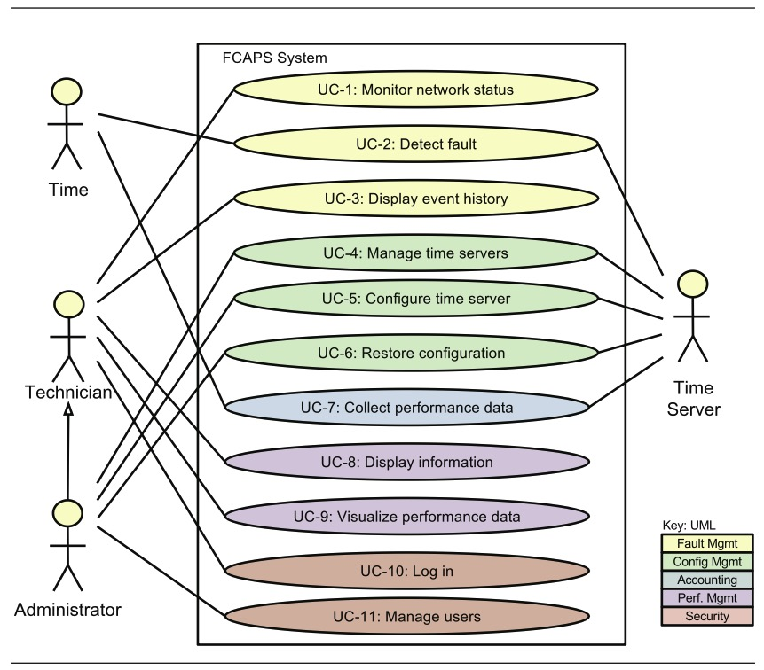

**FIGURE 4.1** Use case model for the FCAPS system

> **图4.1** FCAPS 系统的用例模型

Each of these use cases is described in the following table:

> 下面的表格描述了每一个用例：

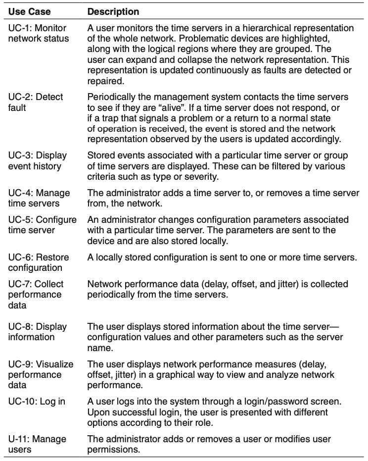

---

**UC-1: Monitor network status**

A user monitors the time servers in a hierarchical representation of the whole network.

> 用户在整个网络的分层表示中监视时间服务器。

Problematic devices are highlighted-突出,强调, along with the logical regions where they are grouped. 

> 有问题的设备被突出显示，以及它们分组的逻辑区域。

The user can expand and collapse-折叠 the network representation.

> 用户可以扩展和折叠网络表示。

This representation is updated continuously as faults are detected or repaired.

> 当检测到或修复故障时，这种表示会不断更新。

---

**UC-2: Detect fault**

Periodically the management system contacts the time servers to see if they are “alive”.

> 管理系统定期与时间服务器联系，查看它们是否“活着”。

If a time server does not respond, or if a trap-陷阱 that signals a problem or a return to a normal state of operation is received, the event is stored and the network representation observed by the users is updated accordingly.

> 如果时间服务器没有响应，或者如果接收到表示出现问题或返回正常操作状态的陷阱，则存储该事件，并相应地更新用户观察到的网络表示。

---

**UC-3: Display event history**

Stored events associated with a particular time server or group of time servers are displayed.

> 显示与特定时间服务器或一组时间服务器关联的存储事件。

These can be filtered by various criteria such as type or severity-严重性.

> 可以通过各种标准(如类型或严重程度)对它们进行过滤。

---

**UC-4: Manage time servers**

The administrator adds a time server to, or removes a time server from, the network.

---

**UC-5: Configure time server**

An administrator changes configuration parameters associated with a particular time server.

The parameters are sent to the device and are also stored locally.

> 参数被发送到设备，也存储在本地。

---

**UC-6: Restore-恢复,修复 configuration**

A locally stored configuration is sent to one or more time servers.

> 本地存储的配置被发送到一个或多个时间服务器。

---

**UC-7: Collect performance data**

Network performance data (delay, offset, and jitter) is collected periodically from the time servers.

> 网络性能数据(延迟、偏移和抖动)定期从时间服务器收集。

---

**UC-8: Display information**

The user displays stored information about the time server— configuration values and other parameters such as the server name.

---

**UC-9: Visualize performance data**

The user displays network performance measures-指标 (delay, offset, jitter) in a graphical way to view and analyze network performance.

> 用户以图形化的方式显示网络性能指标(延迟、偏移、抖动)，以查看和分析网络性能。

---

**UC-10: Log in**

A user logs into the system through a login/password screen.

Upon successful login, the user is presented with different options according to their role.

> 登录成功后，将根据用户的角色为其提供不同的选项。

---

**U-11: Manage users**

> The administrator adds or removes a user or modifies user permissions.

---

### **4.2.2 Quality Attribute Scenarios**

> 质量属性场景

In addition to these use cases, a number of quality attribute scenarios were elicited and documented.

> 除了这些用例之外，还引出并记录了许多质量属性场景。

The six most relevant ones are presented in the following table.

> 下表列出了六个最相关的因素。

For each scenario, we also identify the use case that it is associated with.

> 对于每个场景，我们还确定与之相关联的用例。

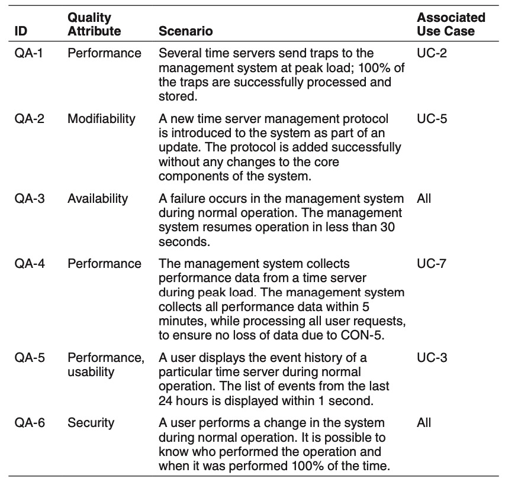

---

**QA-1	Performance	UC-2**

Several time servers send traps to the management system at peak load;

> 多个时间服务器在高峰负荷时向管理系统发送捕获;

100% of the traps are successfully processed and stored.

> 100% 的捕集器被成功处理和储存。

---

**QA-2	Modifiability	UC-5**

A new time server management protocol-协议 is introduced to the system as part of an update.

> 作为更新的一部分，一个新的时间服务器管理协议被引入系统。

The protocol is added successfully without any changes to the core components of the system.

> 在不改变系统核心组件的情况下，协议添加成功。

---

**QA-3	Availability	All**

A failure occurs in the management system during normal operation.

> 管理系统在正常运行过程中出现故障。

The management system resumes-恢复 operation in less than 30 seconds.

> 管理系统在30秒内恢复运行。

---

**QA-4	Performance	UC-7**

The management system collects performance data from a time server during peak-巅峰 load-负载.

> 系统在负载高峰时采集时间服务器的性能数据。

The management system collects all performance data within 5 minutes, while processing all user requests, to ensure no loss of data due to CON-5.

> 系统在5分钟内完成所有性能数据的采集，同时处理所有用户请求，保证数据不因 CON-5 故障丢失。

---

**QA-5	Performance, usability	UC-3**

A user displays the event history of a particular time server during normal operation.

> 用户可以查看指定时间服务器正常运行时的历史事件。

The list of events from the last 24 hours is displayed within 1 second.

> 1秒内显示过去24小时内的事件列表。

---

**QA-6	Security	All**

A user performs a change in the system during normal operation.

> 用户在正常操作过程中对系统进行了修改。

It is possible to know who performed the operation and when it was performed 100% of the time.

> 在100%的情况下，可以知道是谁进行了操作以及何时进行了操作。

---

### 4.2.3 Constraints

> 约束

Finally, a set of constraints on the system and its implementation were collected.

> 最后，收集了系统及其实现的约束条件。

These are presented in the following table.

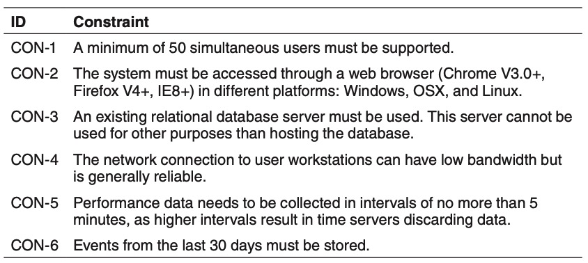

---

**CON-1**

A minimum of 50 simultaneous users must be supported.

> 至少支持50个用户同时使用。

---

**CON-2**

The system must be accessed through a web browser (Chrome V3.0+, Firefox V4+, IE8+) in different platforms: Windows, OSX, and Linux.

> 支持 Windows、OSX 和 Linux 操作系统的浏览器(Chrome V3.0+、Firefox V4+、IE8+)。

---

**CON-3**

An existing relational database server must be used.

> 必须使用现有的关系数据库服务器。

This server cannot be used for other purposes than hosting-托管 the database.

> 此服务器不能用于除托管数据库之外的其他目的。

---

**CON-4**

The network connection to user workstations can have low bandwidth but is generally reliable.

> 到用户工作站的网络连接可能带宽较低，但通常是可靠的。

---

**CON-5**

Performance data needs to be collected in intervals-间隔,间隙 of no more than 5 minutes, as higher intervals result in time servers discarding data.

> 性能数据的收集时间间隔不能超过5分钟，否则时间间隔过长会导致时间服务器丢弃数据。

---

**CON-6**

Events from the last 30 days must be stored.

> 必须存储最近30天内的事件。

---

### 4.2.4 Architectural Concerns

> 架构关注点

Given that this is greenfield development, only a few general architectural concerns are identified initially, as shown in the following table.

> 考虑到这是绿地开发，最初只确定了几个一般的体系结构关注点，如下表所示。

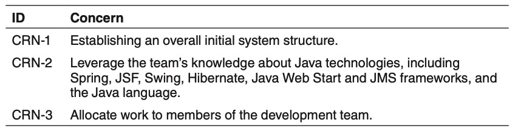

**CRN-1**

Establishing an overall initial system structure.

> 建立总体的初始体系结构。

---

**CRN-2**

Leverage-充分利用 the team’s knowledge-知识 about Java technologies, including Spring, JSF, Swing, Hibernate, Java Web Start and JMS frameworks, and the Java language.

> 利用团队关于Java技术的知识，包括Spring、JSF、Swing、Hibernate、Java Web Start和JMS框架，以及Java语言。

---

**CRN-3**

Allocate work to members of the development team.

> 将工作分配给开发团队的成员。

---

Given these sets of inputs, we are now ready to proceed to describe the design process, as described in Section 3.2.

> 有了这些输入，我们现在准备继续描述设计过程，如第3.2节所述。

In this chapter, we present only the final results of the requirements collection process.

> 在本章中，我们只展示需求收集过程的最终结果。

The job of collecting these requirements is nontrivial-重要的,显要的, but is beyond the scope of this chapter.

> 收集这些需求的工作是非常重要的，但是超出了本章的范围。

## 4.3 The Design Process

> 设计过程

We now ready to make the leap-跨越 from the world of requirements and business concerns to the world of design.

> 现在，我们准备从需求和业务关注的世界跨越到设计的世界。

This is perhaps the most important job for an architect—translating requirements into design decisions.

> 这可能是架构师最重要的工作——将需求转化为设计决策。

Of course, many other decisions and duties are important, but this is the core of what it means to be an architect: making design decisions with far-reaching-影响深远的,波及广泛的 consequences.

> 当然，许多其他决策和职责也很重要，但这是作为架构师的核心意义：做出具有深远影响的设计决策。

### 4.3.1 ADD Step 1: Review Inputs

> 添加步骤1：审查输入

The first step of the ADD method involves reviewing the inputs and identifying which requirements will be considered as drivers (i.e., which will be included in the design backlog).

> ADD 方法的第一步包括审查输入并确定哪些需求将被视为驱动因素(即，哪些需求将包含在设计待办事项中)。

The inputs are summarized in the following table.

> 输入总结如下表所示。

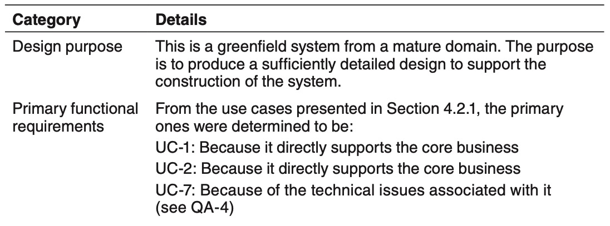

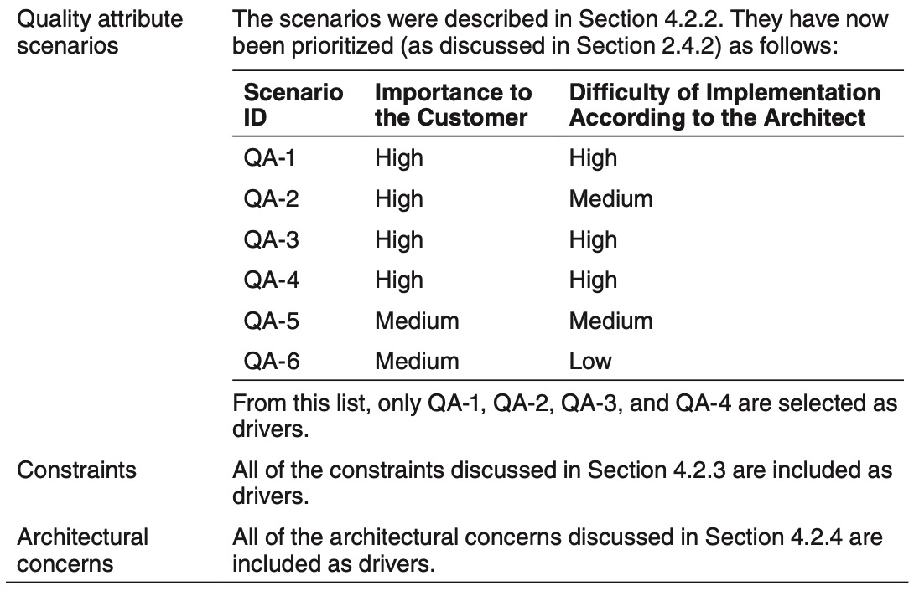

### 4.3.2 Iteration 1: Establishing an Overall System Structure

> 迭代1：建立一个整体的系统结构

This section presents the results of the activities that are performed in each of the steps of ADD in the first iteration of the design process.

> 本部分展示了在设计过程的第一次迭代中ADD的每个步骤中执行的活动的结果。

#### 4.3.2.1 Step 2: Establish Iteration Goal by Selecting Drivers

> 步骤2：通过选择驱动程序建立迭代目标

This is the first iteration in the design of a greenfield system, so the iteration goal is to achieve the architectural concern CNR-1 of *establishing an overall system structure* (see Section 3.3.1).

> 这是绿地系统设计的第一次迭代，因此迭代的目标是实现**建立整体系统结构**的架构关注点CNR-1(参见3.3.1节)。

Although this iteration is driven by a general architectural concern, the architect must keep in mind *all* of the drivers that may influence the general structure of the system.

> 尽管这个迭代是由一般的体系结构驱动的，但是架构师必须记住所有可能影响系统一般结构的驱动因素。

In particular, the architect must be mindful of the following:

> 特别是，架构师必须注意以下几点:

- QA-1: Performance
- QA-2: Modifiability
- QA-3: Availability
- QA-4: Performance
- CON-2: System must be accessed through a web browser in different platforms — Windows, OSX, and Linux
- CON-3: A relational database server must be used
- CON-4: Network connection to users workstations can have low bandwidth and be unreliable
- CRN-2: Leverage team’s knowledge about Java technologies

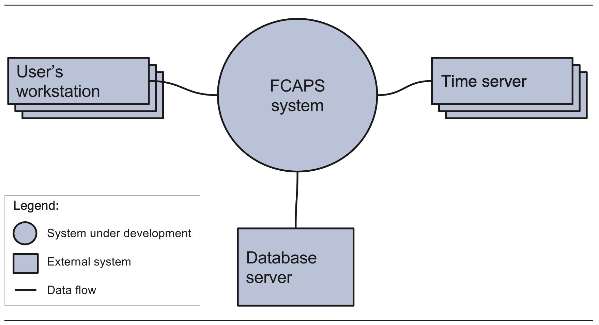

**FIGURE 4.2** Context diagram for the FCAPS system

> **图4.2** FCAPS系统环境图

#### **4.3.2.2** Step 3: Choose One or More Elements of the System to Refine

> 步骤3：选择系统的一个或多个元素进行细化

This is a greenfield-未开发地区的 development effort, so in this case the element to refine is the entire FCAPS system, which is shown in Figure 4.2.

> 这是一个全新的开发工作，因此在这种情况下，需要改进的元素是整个FCAPS系统，如图4.2所示。

In this case, refinement is performed through decomposition-分解,腐烂.

> 在这种情况下，细化是通过分解来执行的。

#### **4.3.2.3** Step 4: Choose One or More Design Concepts That Satisfy the Selected Drivers

> 步骤4：选择一个或多个满足所选驱动程序的设计概念

In this initial iteration, given the goal of structuring the entire system, design concepts are selected according to the roadmap presented in Section 3.3.1.

> 在这个初始迭代中，考虑到构建整个系统的目标，根据第3.3.1节所示的路线图选择设计概念。

The following table summarizes the selection of design decisions.

> 下表总结了设计决策的选择。

Note that all of the design concepts used in this case study are also described in Appendix A.

> 请注意，本案例研究中使用的所有设计概念也在附录A中进行了描述。

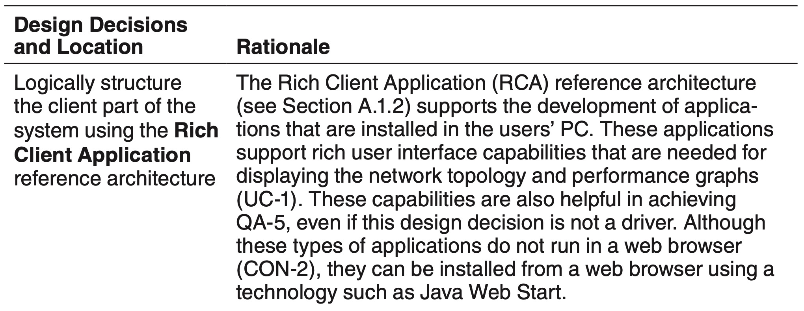

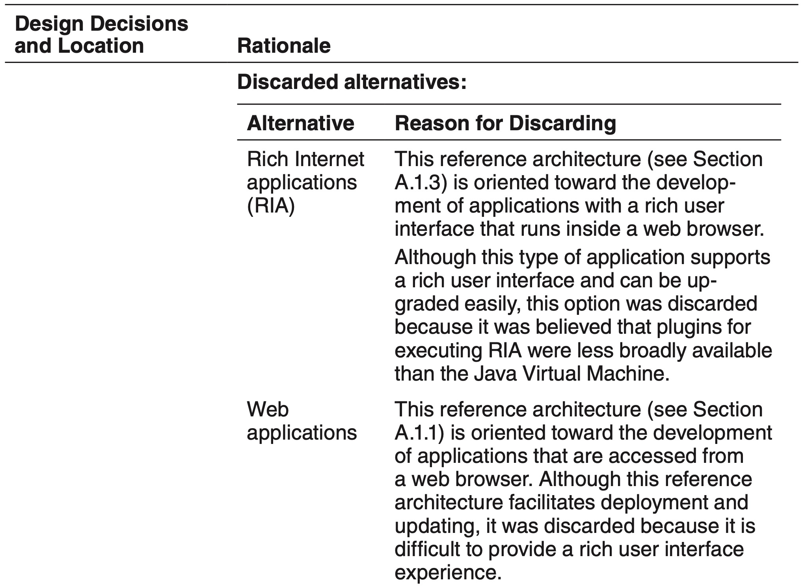

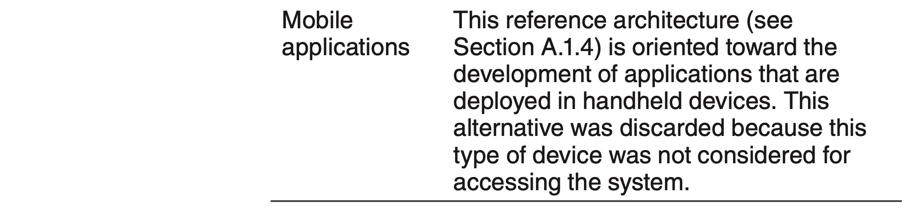

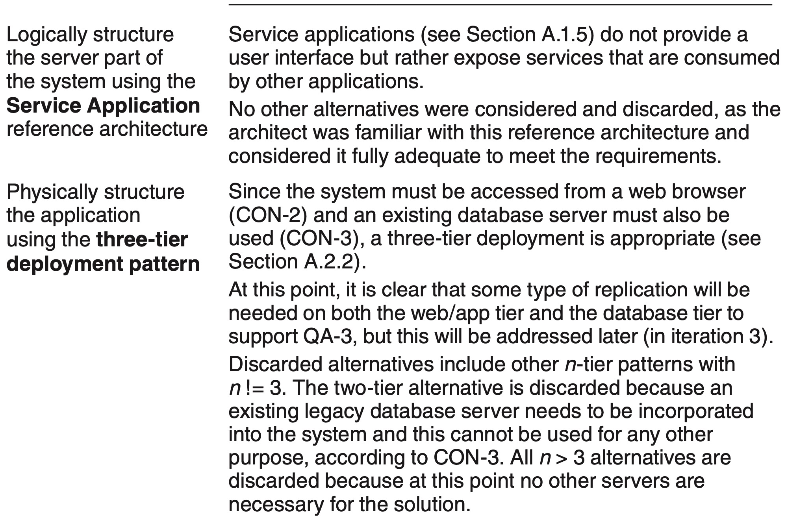

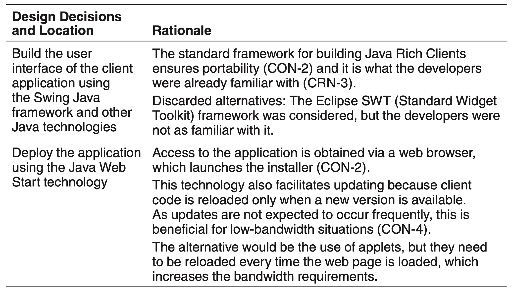

---

**Design Decisions and Location**

Logically structure the client part of the system using the **Rich Client Application** reference architecture

> 使用“丰富的客户端应用程序”参考体系结构在逻辑上构造系统的客户端部分

**Rationale**

The Rich Client Application (RCA) reference architecture (see Section A.1.2) supports the development of applications that are installed in the users’ PC.

> 丰富的客户端应用程序(RCA)参考体系结构(参见章节 A.1.2)支持开发安装在用户 PC 上的应用程序。

These applications support rich user interface capabilities that are needed for displaying the network topology and performance graphs (UC-1).

> 这些应用程序支持显示网络拓扑和性能图(UC-1)所需的丰富用户界面功能。

These capabilities are also helpful in achieving QA-5, even if this design decision is not a driver.

> 这些功能也有助于实现QA-5，即使这个设计决策不是驱动程序。

Although these types of applications do not run in a web browser (CON-2), they can be installed from a web browser using a technology such as Java Web Start.

> 虽然这些类型的应用程序不能在web浏览器(CON-2)中运行，但可以使用 Java web Start 等技术从web浏览器安装它们。

**Discarded alternatives:**

***Alternative***

Rich Internet applications (RIA)

***Reason for Discarding***

This reference architecture (see Section A.1.3) is oriented toward the development of applications with a rich user interface that runs inside a web browser.

> 这个参考架构(参见A.1.3节)是面向在web浏览器中运行的具有富用户界面的应用程序的开发的。

Although this type of application supports a rich user interface and can be upgraded easily, this option was discarded because it was believed that plugins for executing RIA were less broadly available than the Java Virtual Machine.

> 尽管这种类型的应用程序支持富用户界面，并且可以很容易地升级，但这个选项被放弃了，因为人们认为用于执行RIA的插件没有Java虚拟机那么广泛可用。

***Alternative***

Web applications

***Reason for Discarding***

This reference architecture (see Section A.1.1) is oriented toward the development of applications that are accessed from a web browser.

> 这个参考架构(参见章节A.1.1)是面向从web浏览器访问的应用程序的开发的。

Although this reference architecture facilitates deployment and updating, it was discarded because it is difficult to provide a rich user interface experience.

> 尽管此参考体系结构有助于部署和更新，但由于难以提供丰富的用户界面体验，因此放弃了它。

***Alternative***

Mobile applications

***Reason for Discarding***

This reference architecture (see Section A.1.4) is oriented toward-为了 the development of applications that are deployed in handheld-掌上型,手持型 devices.

> 这个参考体系结构(参见第A.1.4节)面向部署在手持设备中的应用程序的开发。

This alternative was discarded because this type of device-设备 was not considered for accessing the system.

> 由于没有考虑使用这种类型的设备来访问系统，因此该替代方案被丢弃。

---

**Design Decisions and Location**

Logically structure the server part of the system using the **Service Application** reference architecture

> 使用 **Service Application** 参考体系结构从逻辑上构造系统的服务器部分

**Rationale**

Service applications (see Section A.1.5) do not provide a user interface but rather expose services that are consumed by other applications.

> 服务应用程序(参见章节A.1.5)不提供用户界面，而是公开由其他应用程序使用的服务。

No other alternatives were considered and discarded, as the architect was familiar with this reference architecture and considered it fully adequate-足够的,适当的 to meet the requirements.

> 没有考虑和丢弃其他替代方案，因为架构师熟悉这个参考体系结构，并认为它完全能够满足需求。

---

**Design Decisions and Location**

Physically structure the application using the **three-tier-三层 deployment pattern**

> 使用三层部署模式在物理上构建应用程序

**Rationale**

Since the system must be accessed from a web browser (CON-2) and an existing database server must also be used (CON-3), a three-tier deployment is appropriate (see Section A.2.2).

> 由于必须通过web浏览器(CON-2)访问系统，并且必须使用现有的数据库服务器(CON-3)，因此三层部署是合适的(参见章节A.2.2)。

At this point, it is clear that some type of replication will be needed on both the web/app tier and the database tier to support QA-3, but this will be addressed later (in iteration 3).

> 在这一点上，很明显，在web/应用程序层和数据库层都需要某种类型的复制来支持 QA-3，但这将在稍后(在迭代3中)解决。

Discarded alternatives include other n-tier patterns with n != 3.

> 丢弃的替代方案包括其他 n != 3 的 n 层模式。

The two-tier alternative is discarded because an existing legacy-遗产,遗赠物 database server needs to be incorporated-包含,合并 into the system and this cannot be used for any other purpose, according to CON-3.

> 根据CON-3的说法，由于需要将现有的遗留数据库服务器合并到系统中，并且不能用于任何其他目的，因此放弃了两层替代方案。

All n > 3 alternatives are discarded because at this point no other servers are necessary for the solution.

> 所有 n > 3 个备选方案都将被丢弃，因为此时解决方案不需要其他服务器。

---

**Design Decisions and Location**

Build the user interface of the client application using the Swing Java framework and other Java technologies

> 使用 Swing Java 框架和其他 Java 技术构建客户端应用程序的用户界面

**Rationale**

The standard framework for building Java Rich Clients ensures portability-可移植性 (CON-2) and it is what the developers were already familiar with (CRN-3).

> 构建Java丰富的客户端的标准框架确保了可移植性(CON-2)，这是开发人员已经熟悉的(CRN-3)。

Discarded alternatives: The Eclipse SWT (Standard Widget Toolkit) framework was considered, but the developers were not as familiar with it.

> 被抛弃的替代方案：考虑了Eclipse SWT (Standard Widget Toolkit)框架，但是开发人员并不熟悉它。

---

**Design Decisions and Location**

Deploy the application using the Java Web Start technology

**Rationale**

Access to the application is obtained via a web browser, which launches-启动 the installer (CON-2).

> 通过 web 浏览器访问应用程序，该浏览器启动安装程序(CON-2)。

This technology also facilitates updating because client code is reloaded only when a new version is available.

> 该技术还促进了更新，因为只有在新版本可用时才重新加载客户端代码。

As updates are not expected to occur frequently, this is beneficial for low-bandwidth situations (CON-4).

> 由于预计更新不会频繁发生，这对于低带宽情况是有益的(CON-4)。

The alternative would be the use of applets, but they need to be reloaded every time the web page is loaded, which increases the bandwidth requirements.

> 另一种选择是使用applet，但每次加载网页时都需要重新加载，这增加了带宽需求。

---

#### **4.3.2.4** Step 5: Instantiate Architectural Elements, Allocate Responsibilities,and Define Interfaces

> 步骤5：实例化架构元素，分配职责，并定义接口

The instantiation design decisions considered and made are summarized in the following table:

> 考虑和做出的实例化设计决策总结如下表：

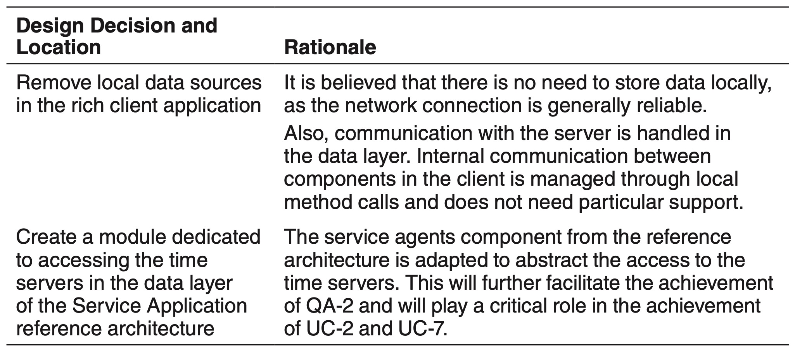

---

**Design Decision and Location**

Remove local data sources in the rich client application

> 删除丰富的客户端应用程序中的本地数据源

**Rationale**

It is believed that there is no need to store data locally, as the network connection is generally reliable.

> 一般认为没有必要在本地存储数据，因为网络连接通常是可靠的。

Also, communication with the server is handled in the data layer.

> 此外，与服务器的通信是在数据层处理的。

Internal communication between components in the client is managed through local method calls and does not need particular support.

> 客户端中组件之间的内部通信通过本地方法调用进行管理，不需要特别的支持。

---

**Design Decision and Location**

Create a module dedicated to accessing the time servers in the data layer of the Service Application reference architecture

> 在 Service Application 参考体系结构的数据层中创建一个专门用于访问时间服务器的模块

**Rationale**

The service agents component from the reference architecture is adapted to abstract the access to the time servers.

> 参考体系结构中的服务代理组件用于抽象对时间服务器的访问。

This will further facilitate the achievement of QA-2 and will play a critical role in the achievement of UC-2 and UC-7.

> 这将进一步促进 QA-2 的实现，并将在 UC-2 和 UC-7 的实现中发挥关键作用。

---

The results of these instantiation decisions are recorded in the next step.

> 这些实例化决策的结果将在下一步中记录。

In this initial iteration, it is typically too early to precisely-精确地,准确地 define functionality and interfaces.

> 在这个初始迭代中，精确定义功能和接口通常还为时过早。

In the next iteration, which is dedicated to defining functionality in more detail, interfaces will begin to be defined.

> 在致力于更详细地定义功能的下一个迭代中，将开始定义接口。

#### **4.3.2.5** Step 6: Sketch Views and Record Design Decisions

> 步骤6：草图视图和记录设计决策

The diagram in Figure 4.3 shows the sketch of a module view of the two reference architectures that were selected for the client and server applications.

> 图4.3 中的图表显示了为客户机和服务器应用程序选择的两个参考体系结构的模块视图草图。

These have now been adapted according to the design decisions we have made.

> 这些现在已经根据我们所做的设计决定进行了调整。

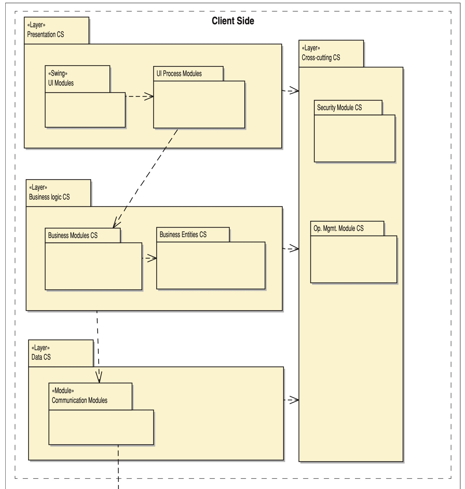

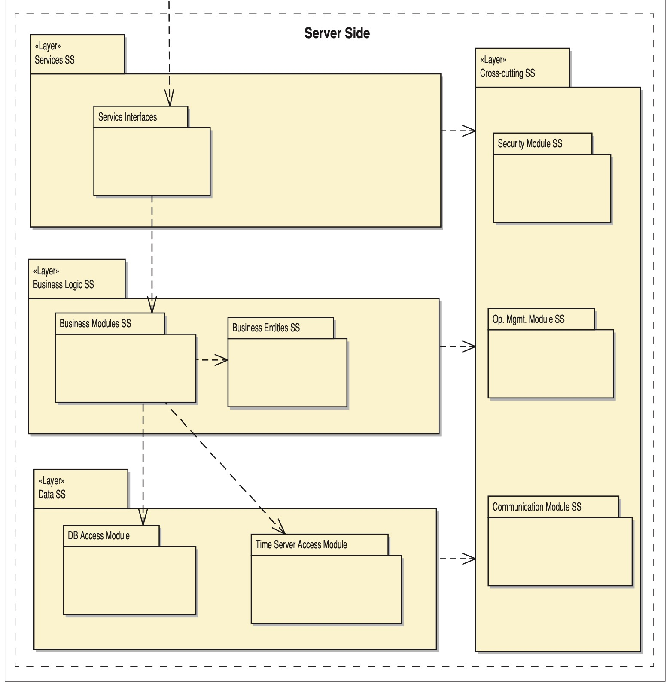

**FIGURE 4.3** Modules obtained from the selected reference architectures (Key: UML)

> **图4.3** 从所选的参考体系结构中获得的模块(关键:UML)

This sketch was created using a CASE tool.

> 这个草图是使用 CASE 工具创建的。

In the tool, each element is selected and a short description of its responsibilities is captured.

> 在该工具中，选择每个元素，并获取其职责的简短描述。

Note that the descriptions at this point are quite crude-粗略的,大概的, just indicating major functional responsibilities, with no details.

> 请注意，这里的描述非常粗糙，只指出了主要的功能职责，没有细节。

The following table summarizes the information that is captured:

> 下表总结了捕获的信息:

| **Element**                   | **Responsibility**                                           |
| ----------------------------- | ------------------------------------------------------------ |
| Presentation client side (CS) | This layer contains modules that control user interaction and use case control flow. |
| Business logic CS             | This layer contains modules that perform business logic operations that can be executed locally on the client side. |
| Data CS                       | This layer contains modules that are responsible for communication with the server. |
| Cross-cutting CS              | This “layer” includes modules with functionality that goes across different layers, such as security, logging, and I/O. This is helpful in achieving QA-6, even if it is not one of the drivers. |
| UI modules                    | These modules render-给予,提供 the user interface and receive user inputs. |
| UI process modules            | These modules are responsible for control flow of all the system use cases (including navigation-访问 between screens). |
| Business modules CS           | These modules either implement business operations that can be performed locally or expose business functionality from the server side. |
| Business entities CS          | These entities make up the domain model. They may be less detailed than those on the server side. |
| Communication modules CS      | These modules consume the services provided by the application running on the server side. |
| Services server side (SS)     | This layer contains modules that expose services that are consumed by the clients. |
| Business Logic SS             | This layer contains modules that perform business logic operations that require processing on the server side. |
| Data SS                       | This layer contains modules that are responsible for data persistence and for communication with the time servers. |
| Cross-cutting SS              | These modules have functionality that goes across different layers, such as security, logging, and I/O. |
| Service interfaces SS         | These modules expose services that are consumed by the clients. |
| Business modules SS           | These modules implement business operations.                 |
| Business entities SS          | These entities make up the domain model.                     |
| DB access module              | This module is responsible for persistence of business entities (objects) into the relational database. It performs object-oriented to relational mapping and shields-保护,保卫 the rest of the application from persistence details. |
| Time server access module     | This module is responsible for communication with the time servers. It isolates and abstracts operations with the time servers to support communication with different types of time servers (see QA-2). |

The deployment diagram in Figure 4.4 sketches an allocation view that illustrates where the components associated with the modules in the previous diagram will be deployed.

> 图4.4 中的部署关系图勾画了一个分配视图，该视图说明了与前面关系图中的模块相关联的组件将被部署在何处。

The responsibilities of the elements are summarized here:

> 各要素的职责总结如下:

| **Element**        | **Responsibility**                                           |
| ------------------ | ------------------------------------------------------------ |
| User workstation   | The user’s PC, which hosts the client side logic of the application |
| Application server | The server that hosts server side logic of the application and also serves web pages 承载应用程序的服务器端逻辑并提供网页服务的服务器 |
| Database server    | The server that hosts the legacy-遗留物,遗产 relational database |
| Time server        | The set of (external) time servers                           |

Also, information about relationships between some elements in the diagram that is worth recording is summarized in the following table:

> 此外，图中一些值得记录的元素之间的关系信息总结如下表:

| **Element**                                | **Responsibility**                                           |
| ------------------------------------------ | ------------------------------------------------------------ |
| Between web/app server and database server | Communication with the database will be done using the JDBC protocol. |
| Between web/app server and time server     | The SNMP protocol is used (at least initially).              |

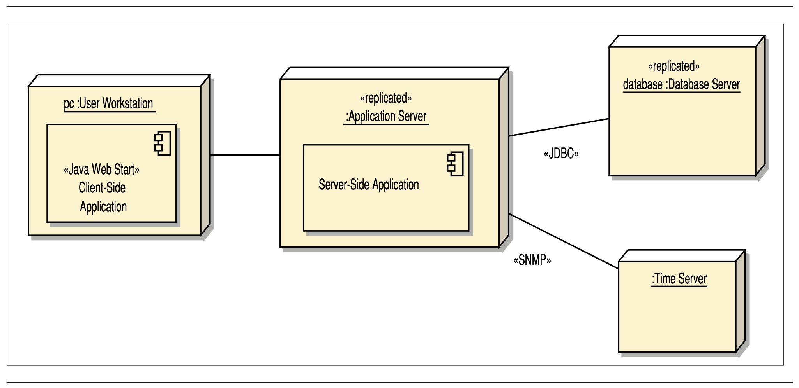

**FIGURE 4.4** Initial deployment diagram for the FCAPS system (Key: UML)

> **图4.4** FCAPS系统的初始部署图(关键字:UML)

#### **4.3.2.6** Step 7: Perform Analysis of Current Design and Review Iteration Goal and Achievement of Design Purpose

> 步骤7：执行当前设计的分析，并审查迭代目标和设计目的的实现

The following table summarizes the design progress using the Kanban board technique discussed in Section 3.8.2.

> 下表总结了使用3.8.2节中讨论的看板技术的设计进度。

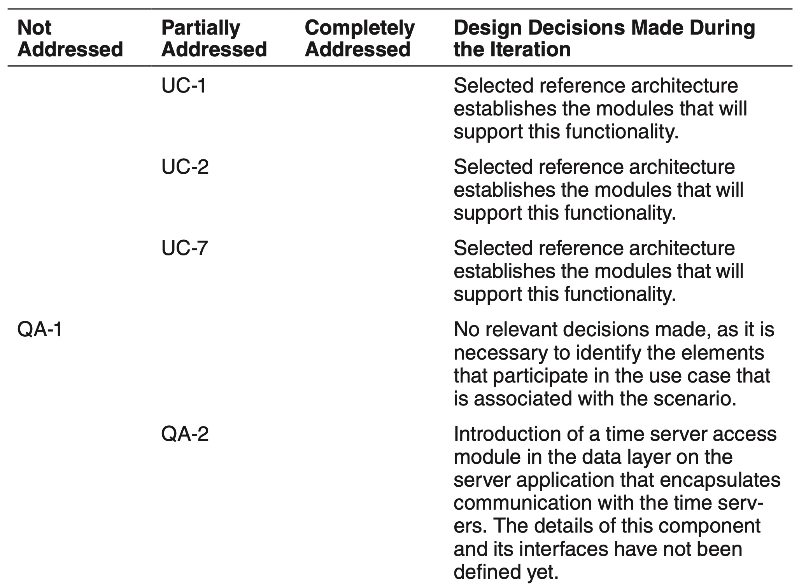

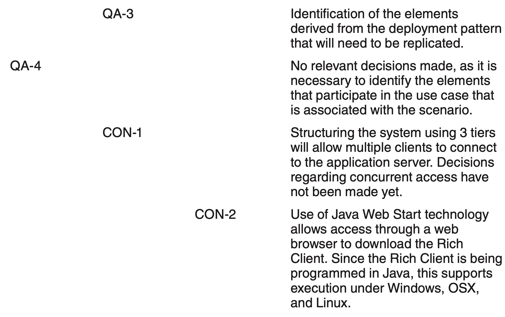

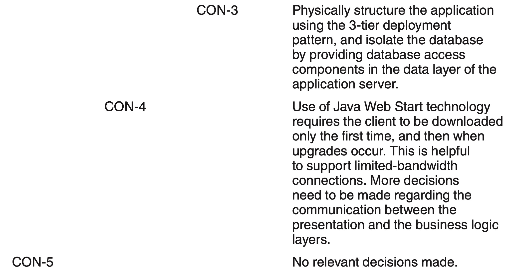

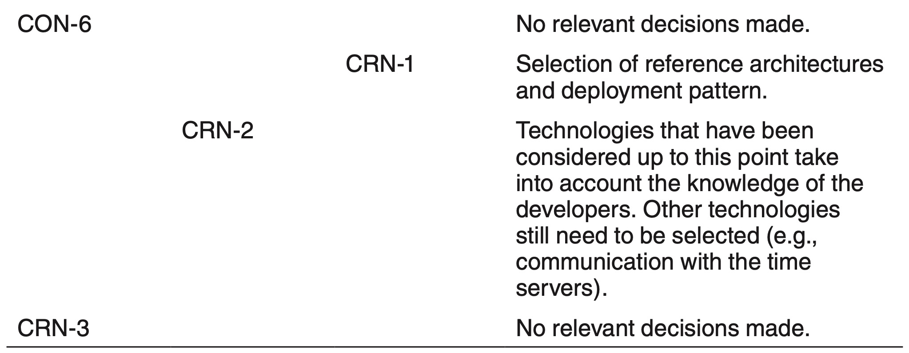

### 4.3.3 Iteration 2: Identifying Structures to Support Primary Functionality

> 迭代2：确定支持主要功能的结构

This section presents the results of the activities that are performed in each of the steps of ADD in the *second* iteration of the design process for the FCAPS system.

> 本节介绍了在FCAPS系统设计过程的“第二次”迭代中ADD的每个步骤中执行的活动的结果。

In this iteration, we move from the generic and coarse-grained-粗略的,大概的 descriptions of functionality used in iteration 1 to more detailed decisions that will drive implementation and hence the formation-组成物,构成,形成 of development teams.

> 在这个迭代中，我们从迭代1中使用的通用和粗粒度的功能描述转向更详细的决策，这些决策将驱动实现并因此形成开发团队。

---

This movement from the generic-通用 to the specific is intentional-故意的,蓄意的, and built into the ADD method.

> 这种从通用到特定的转变是有意为之，并内置于ADD方法中。

We cannot design everything up front, so we need to be disciplined-守规矩的,纪律严明的 about which decisions we make, and when, to ensure that the design is done in a systematic way, addressing the biggest risks first and moving from there to ever finer details.

> 我们不可能预先设计所有内容，所以我们需要严格控制何时做出哪些决定，以确保以系统的方式完成设计，首先解决最大的风险，然后从那里转移到更精细的细节。

Our goal for the first iteration was to establish an overall system structure.

Now that this goal has been met, our new goal for this second iteration is to reason-推理 about the units of implementation, which affect team formation, interfaces, and the means by which development tasks may be distributed, outsourced, and implemented in sprints.

> 现在这个目标已经实现了，我们第二次迭代的新目标是对实现的单元进行推理，这些单元会影响团队的组成、接口，以及在sprint中分发、外包和实现开发任务的方法。

#### 4.3.3.1 Step 2: Establish Iteration Goal by Selecting Drivers

> 步骤2：通过选择驱动程序建立迭代目标

The goal of this iteration is to address the general architectural concern of *identifying structures to support primary functionality*. 

> 此迭代的目标是解决一般的体系结构问题，即识别支持主要功能的结构。

Identifying these elements is useful not only for understanding how functionality is supported, but also for addressing CRN-3—that is, the allocation of work to members of the development team.

> 识别这些元素不仅有助于理解如何支持功能，而且有助于处理 CRN-3，即向开发团队成员分配工作。

---

In this second iteration, besides-除…以外 CRN-3, the architect considers the system’s primary use cases:

> 在第二次迭代中，除了CRN-3，架构师考虑系统的主要用例:

- UC-1
- UC-2
- UC-7

#### 4.3.3.2 Step 3: Choose One or More Elements of the System to Refine

> 步骤3:选择系统的一个或多个要素进行细化

The elements that will be refined in this iteration are the modules located in the different layers defined by the two reference architectures from the previous iteration.

> 将在此迭代中细化的元素是位于不同层中的模块，这些层是由前一个迭代中的两个参考体系结构定义的。

In general, the support of functionality in this system requires the collaboration-合作,协作 of components associated with modules that are located in the different layers.

> 一般来说，该系统中的功能支持需要与位于不同层的模块相关联的组件之间的协作。

#### 4.3.3.3 Step 4: Choose One or More Design Concepts That Satisfy the Selected Drivers

>  步骤4：选择一个或多个满足选定驱动程序的设计概念

In this iteration, several design concepts—in this case, architectural design patterns—are selected from the book *Pattern Oriented Software Architecture, Volume 4*.

> 在这个迭代中，从面向模式的软件体系结构第4卷中选择了几个设计概念——在本例中是体系结构设计模式。

The following table summarizes the design decisions.

> 下表总结了设计决策。

The words in **bold** in the following table refer to architectural patterns from this book, and can be found in Appendix A.

> 下表中**粗体**的文字是指本书中的架构模式，可以在附录A中找到。

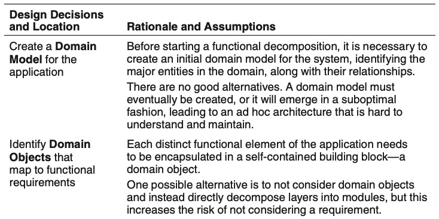

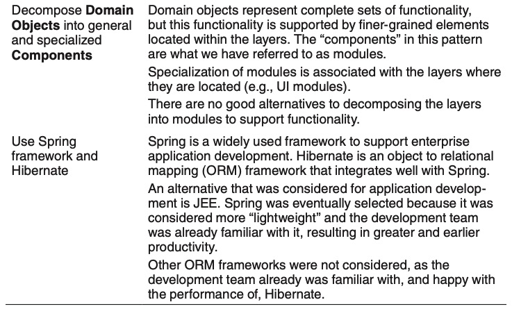

**Design Decisions and Location**

Create a **Domain Model** for the application

**Rationale and Assumptions**

Before starting a functional decomposition, it is necessary to create an initial domain model for the system, identifying the major entities in the domain, along with their relationships.

> 在开始功能分解之前，有必要为系统创建一个初始的领域模型，识别领域中的主要实体，以及它们之间的关系。

There are no good alternatives.

A domain model must eventually be created, or it will emerge in a suboptimal-次最优的,次优的 fashion, leading to an **ad hoc**-特别的 architecture that is hard to understand and maintain.

> 最终必须创建领域模型，否则它将以次优的方式出现，从而导致难以理解和维护的特别架构。

---

**Design Decisions and Location**

Identify **Domain Objects** that map to functional requirements

> 识别映射到功能需求的领域对象

**Rationale and Assumptions**

Each distinct functional element of the application needs to be encapsulated in a self-contained building block—a domain object.

> 应用程序的每个不同的功能元素都需要封装在一个自包含的构建块中——一个域对象。

One possible alternative is to not consider domain objects and instead directly decompose layers into modules, but this increases the risk of not considering a requirement.

> 一种可能的替代方法是不考虑领域对象，而是直接将层分解为模块，但这增加了不考虑需求的风险。

---

**Design Decisions and Location**

Decompose **Domain Objects** into general and specialized **Components**

> 将**领域对象**分解为一般和专门的**组件**

**Rationale and Assumptions**

Domain objects represent complete-完整的,完全的 sets of functionality, but this functionality is supported by finer-grained elements located within the layers.

> 领域对象表示完整的功能集，但是这些功能是由位于层内的细粒度元素支持的。

The “components” in this pattern are what we have referred to as modules.

> 这个模式中的“组件”就是我们所说的模块。

Specialization-专业,专业化 of modules is associated with the layers where they are located (e.g., UI modules).

> 模块的专门化与它们所在的层相关联(例如，UI模块)。

There are no good alternatives to decomposing the layers into modules to support functionality.

> 除了将这些层分解为支持功能的模块之外，没有更好的替代方法。

---

**Design Decisions and Location**

Use Spring framework and Hibernate

**Rationale and Assumptions**

Spring is a widely used framework to support enterprise application development.

> Spring 是一个广泛使用的框架，用于支持企业应用程序开发。

Hibernate is an object to relational mapping (ORM) framework that integrates well with Spring.

> Hibernate 是一个对象到关系映射(ORM)框架，可以很好地与 Spring 集成。

An alternative that was considered for application development is JEE.

> 应用程序开发考虑的另一种选择是JEE。

Spring was eventually selected because it was considered more “lightweight” and the development team was already familiar with it, resulting in greater and earlier productivity.

> 最终选择了Spring，因为它被认为更“轻量级”，并且开发团队已经熟悉它，从而产生更高和更早的生产力。

Other ORM frameworks were not considered, as the development team already was familiar with, and happy with the performance of, Hibernate.

> 其他 ORM 框架没有被考虑，因为开发团队已经熟悉 Hibernate，并且对 Hibernate 的性能很满意。

#### 4.3.3.4 Step 5: Instantiate Architectural Elements, Allocate Responsibilities, and Define Interfaces

> 步骤5：实例化架构元素，分配职责，并定义接口

The instantiation design decisions made in this iteration are summarized in the following table:

> 在此迭代中做出的实例化设计决策总结如下表：

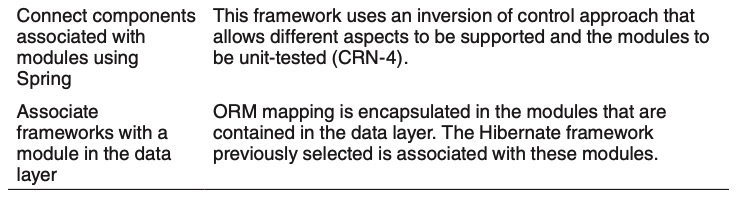

**Design Decisions and Location**

Create only an initial domain model

**Rationale**

The entities that participate in the primary use cases need to be identified and modeled but only an initial domain model is created, to accelerate-加快,促进 this phase of design.

> 参与主要用例的实体需要被识别和建模，但是只创建一个初始的领域模型，以加速这个设计阶段。

---

**Design Decisions and Location**

Map the system use cases to domain objects

**Rationale**

An initial identification of domain objects can be made by analyzing the system’s use cases.

> 可以通过分析系统的用例来初步识别领域对象。

To address CRN-3, domain objects are identified for all of the use cases in Section 4.2.1.

> 为了解决 CRN-3，在4.2.1节中为所有用例识别域对象。

---

**Design Decisions and Location**

Decompose the domain objects across the layers to identify layer-specific modules with an explicit-明确的 interface

> 跨层分解域对象，以使用显式接口标识特定于层的模块

**Rationale**

This technique ensures that modules that support all of the functionalities are identified.

> 该技术可确保识别支持所有功能的模块。

The architect will perform this task just for the primary use cases.

> 架构师将只针对主要用例执行此任务。

This allows another team member to identify the rest of the modules, thereby-因此,从而 allocating work among team members.

> 这允许另一个团队成员识别其余的模块，从而在团队成员之间分配工作。

Having established the set of modules, the architect realizes the need to test these modules, so a new architectural concern is identified here:

> 在建立了模块集之后，架构师意识到需要测试这些模块，因此这里确定了一个新的架构关注点:

***CRN-4: A majority of modules shall be unit tested.***

> CRN-4：大部分模块应进行单元测试。

Only “a majority of modules” are covered by this concern because the modules that implement user interface functionality are difficult to test independently.

> 因为实现用户界面功能的模块很难独立测试，所以只有“大多数模块”被这种关注所覆盖。

---

**Design Decisions and Location**

Connect components associated with modules using Spring

> 使用 Spring 连接与模块关联的组件

**Rationale**

This framework uses an inversion of control approach that allows different aspects to be supported and the modules to be unit-tested (CRN-4).

> 该框架使用控制反转方法，允许支持不同的方面，并对模块进行单元测试(CRN-4)。

---

**Design Decisions and Location**

Associate frameworks with a module in the data layer

> 将框架与数据层中的模块关联起来

**Rationale**

ORM mapping is encapsulated in the modules that are contained in the data layer.

> ORM 映射被封装在数据层中包含的模块中。

The Hibernate framework previously selected is associated with these modules.

> 前面选择的 Hibernate 框架与这些模块相关联。

---

While the structures and interfaces are identified in this step of the method, they are captured in the next step.

> 当结构和接口在方法的这一步中被识别时，它们将在下一步中被捕获。

#### **4.3.3.5** Step 6: Sketch Views and Record Design Decisions

- Figure 4.5 shows an initial domain model for the system.

  > 图4.5 显示了系统的初始域模型。

- Figure 4.6 shows the domain objects that are instantiated for the use case model in Section 4.2.1.

  > 图4.6 显示了为第4.2.1节中的用例模型实例化的域对象。

- Figure 4.7 shows a sketch of a module view with modules that are derived-衍生的 from the business objects and associated with the primary use cases.

  > 图4.7 显示了模块视图的草图，其中的模块派生自业务对象并与主要用例相关联。

  Note that explicit-明确的,直截了当的 interfaces are not shown but their existence is assumed.

  > 注意，这里没有显示显式接口，但假设它们存在。

The responsibilities for the elements identified in Figure 4.7 are summarized in the table that begins on page 95.

> 图4.7 中确定的元素的职责总结在第95页开始的表格中。

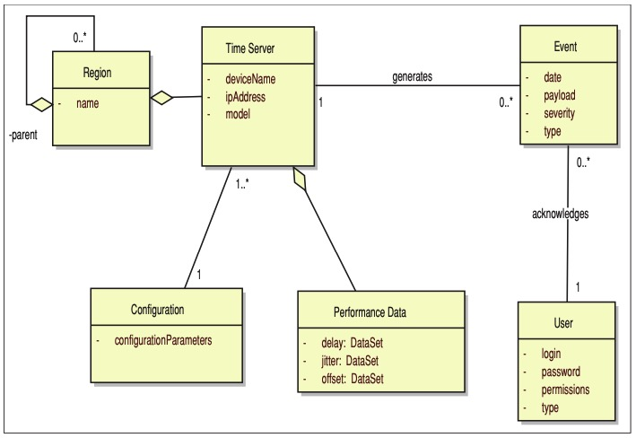

**FIGURE 4.5** Initial domain model (Key: UML)

> **图4.5** 初始域模型(关键字:UML)

**FIGURE 4.6** Domain objects associated with the use case model (Key: UML)

> **图4.6** 与用例模型相关联的领域对象(关键字:UML)

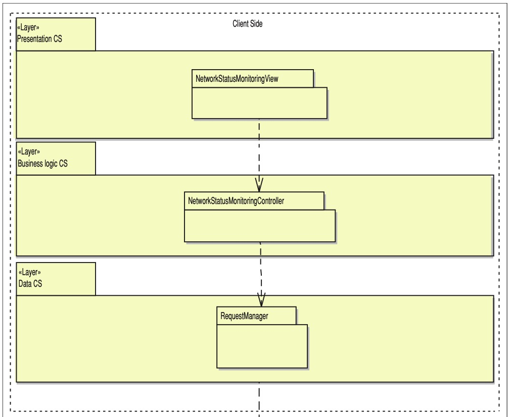

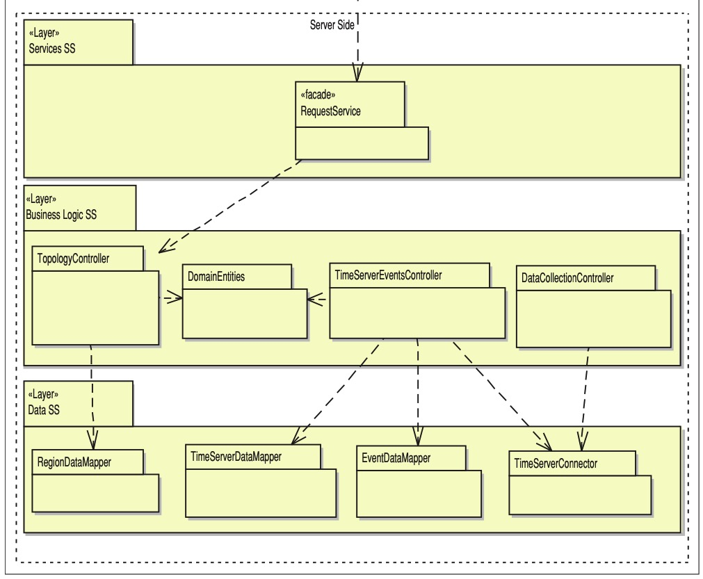

**FIGURE 4.7** Modules that support the primary use cases (Key: UML)

> **图4.7** 支持主要用例的模块(关键:UML)

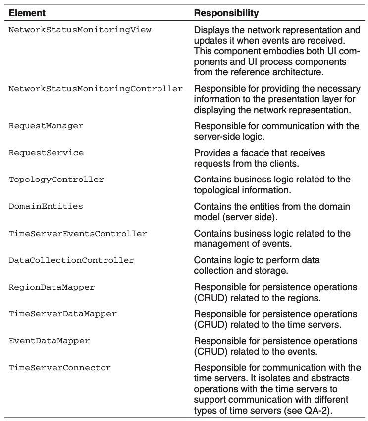

The following sequence diagrams for UC-1 and UC-2 were created in the previous step of the method to define interfaces (as discussed in Section 3.6).

> UC-1 和 UC-2 的以下序列图是在定义接口的方法的前一步中创建的(如第3.6节所述)。

A similar diagram was also created for UC-7 but is not shown here due to space limitations.

> 还为 UC-7 创建了一个类似的图表，但由于篇幅限制，这里没有显示。

---

**UC-1: Monitor Network Status**

Figure 4.8 shows an initial sequence diagram for UC-1 (monitor network status).

It shows how the user representation of the topology is displayed on startup (after the user has successfully logged into the system).

> 它显示了在启动时(在用户成功登录到系统之后)拓扑的用户表示是如何显示的。

Upon launch, the topology is requested from the TopologyController on the server.

> 启动后，从服务器上的 TopologyController 请求拓扑。

This element retrieves-检索,找回,收回 the root region through the RegionDataMapper and returns it to the client.

> 该元素通过 RegionDataMapper 检索根区域并将其返回给客户机。

The client can then populate-充满,填充 the view by traversing-遍历 the relationships within the Region class.

> 然后，客户端可以通过遍历 Region 类中的关系来填充视图。

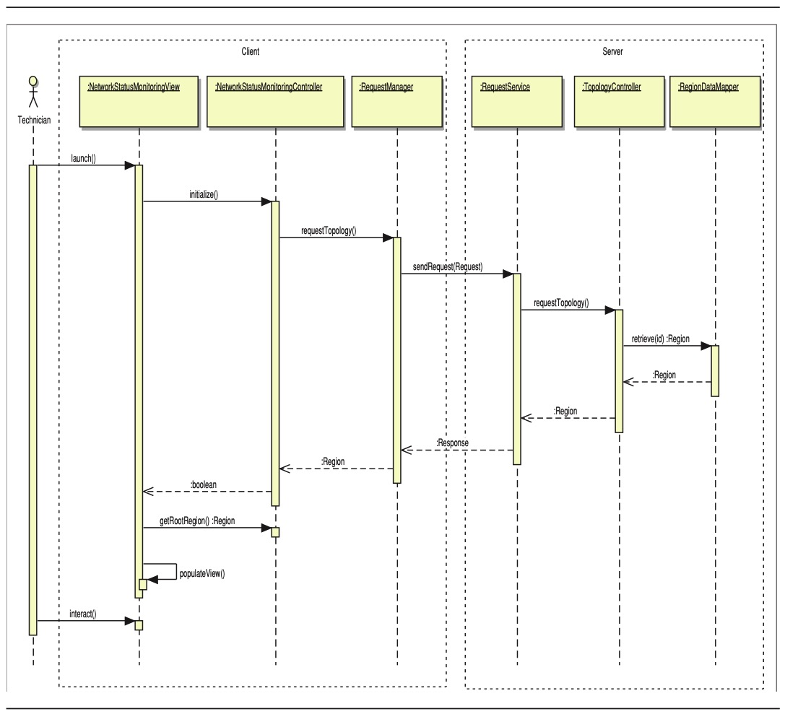

**FIGURE 4.8** Sequence diagram for use case UC-1 (Key: UML)

> **图4.8** 用例UC-1的序列图(关键:UML)

---

From the interactions identified in the sequence diagram, initial methods for the interfaces of the interacting elements can be identified:

> 从序列图中确定的相互作用中，可以确定相互作用元素的接口的初始方法:

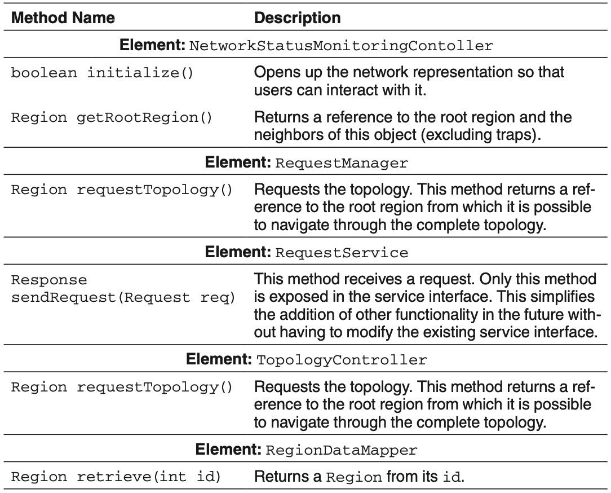

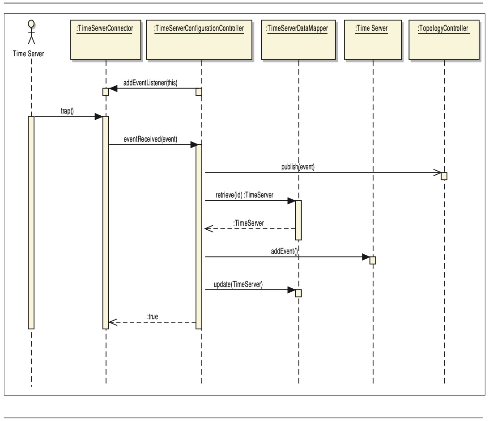

**FIGURE 4.9** Sequence diagram for use case UC-2 (Key: UML)

> **图4.9** 用例 UC-2 的序列图(关键:UML)

**UC-2: Detect Fault**

Figure 4.9 shows an initial sequence diagram for UC-2 (detect fault) shows only the components on the server side.

The interaction starts with a TimeServer sending a trap, which is received by the TimeServerConnector.

The trap is transformed into an Event and sent to the TimeServerConfigurationController.

The Event is sent asynchronously to the TopologyController for publication to the clients and is then persisted.

> 事件被异步发送到 TopologyController 以发布到客户端，然后被持久化。

---

From this interaction, initial methods for the interfaces of the interacting elements can be identified:

> 从这种交互中，可以确定交互元素的接口的初始方法：

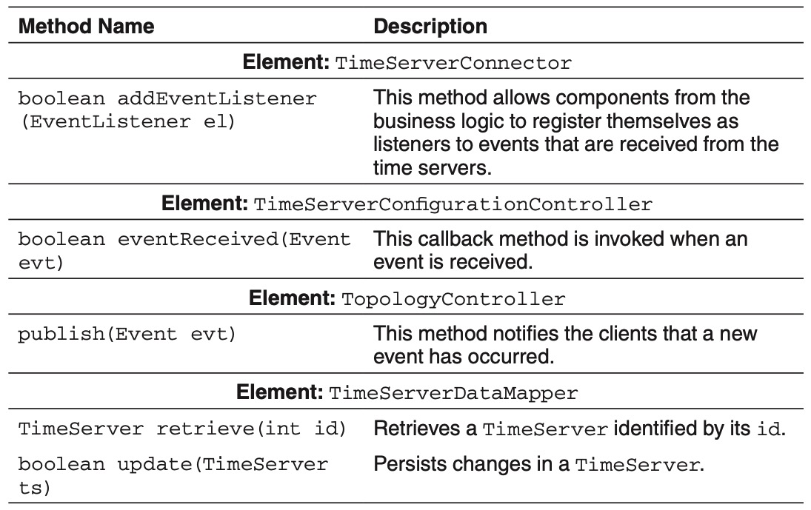

#### **4.3.3.6** Step 7: Perform Analysis of Current Design and Review Iteration Goal and Achievement of Design Purpose

> 步骤7：对当前设计进行分析，评审迭代目标和设计目的的实现

The decisions made in this iteration provided an initial understanding of how functionality is supported in the system.

> 在此迭代中做出的决策提供了对系统中如何支持功能的初步理解。

The modules associated with the primary use cases were identified by the architect, and the modules associated with the rest of the functionality were identified by another team member.

> 与主要用例相关的模块由架构师确定，与其余功能相关的模块由另一个团队成员确定。

From the complete list of modules, a work assignment table was created (not shown here) to address CRN-3.

> 从完整的模块列表中，创建了一个工作分配表(此处未显示)来处理CRN-3。

---

Also, as part of module identification, a new architectural concern was identified and added to the Kanban board.

> 此外，作为模块识别的一部分，一个新的架构关注点被识别并添加到看板板中。

Drivers that were completely addressed in the previous iteration are removed from the table.

> 在前一次迭代中完全解决的驱动程序将从表中删除。

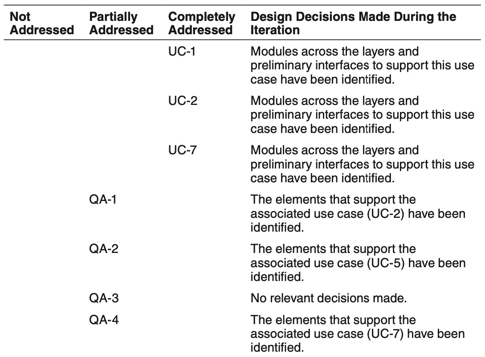

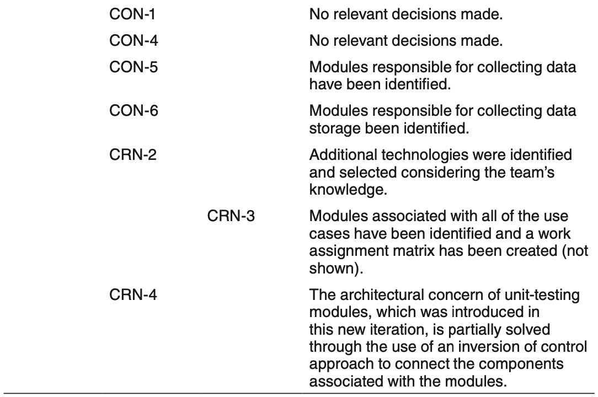

### 4.3.4 Iteration 3: Addressing Quality Attribute Scenario Driver (QA-3)

> 迭代3：解决质量属性场景驱动(QA-3)

This section presents the results of the activities that are performed in each of the steps of ADD in the third iteration of the design process.

> 本部分展示了在设计过程的第三次迭代中 ADD 的每个步骤中执行的活动的结果。

Building on the fundamental structural decisions made in iterations 1 and 2, we can now start to reason about the fulfillment of some of the more important quality attributes.

> 在迭代1和迭代2中所做的基本结构决策的基础上，我们现在可以开始推理一些更重要的质量属性的实现。

This iteration focuses on just one of these quality attribute scenarios.

> 这个迭代只关注这些质量属性场景中的一个。

#### 4.3.4.1 Step 2: Establish Iteration Goal by Selecting Drivers

> 步骤2：通过选择驱动程序建立迭代目标

For this iteration, the architect focuses on the QA-3 quality attribute scenario: A failure occurs in the management system during operation.

The management system resumes operation in less than 30 seconds.

> 管理系统在30秒内恢复运行。

#### 4.3.4.2 Step 3: Choose One or More Elements of the System to Refine

For this availability scenario, the elements that will be refined are the physical nodes that were identified during the first iteration:

> 对于这个可用性场景，将被细化的元素是在第一次迭代期间确定的物理节点:

- Application server
- Database server

#### 4.3.4.3 Step 4: Choose One or More Design Concepts That Satisfy the Selected Drivers

> 步骤4：选择一个或多个满足选定驱动程序的设计概念

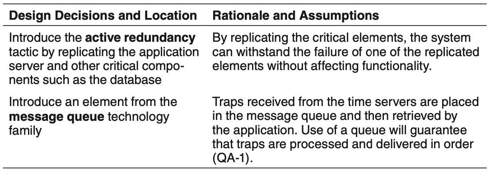

#### 4.3.4.4 Step 5: Instantiate Architectural Elements, Allocate Responsibilities, and Define Interfaces

> 步骤5：实例化架构元素，分配职责，并定义接口

The instantiation design decisions are summarized in the following table:

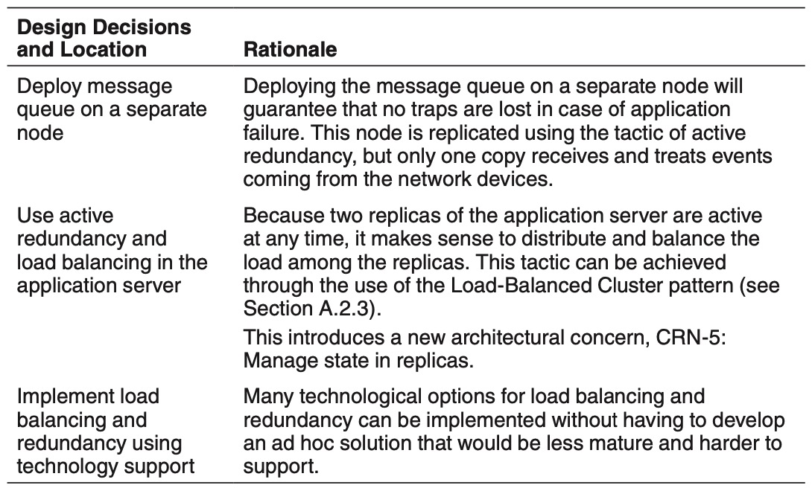

The results of these instantiation decisions are recorded in the next step.

#### 4.3.4.5 Step 6: Sketch Views and Record Design Decisions

Figure 4.10 shows a refined deployment diagram that includes the introduction of redundancy in the system.

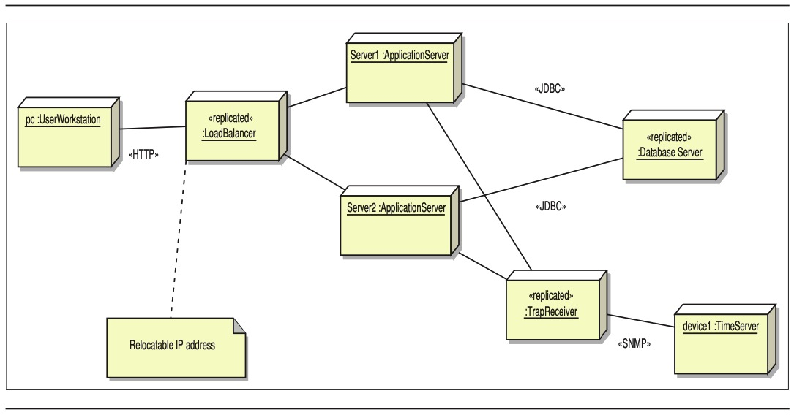

**FIGURE 4.10** Refined deployment diagram (Key: UML)

> 图4.10 精细化部署图(关键字:UML)

The following table describes responsibilities for elements that have not been listed previously (in iteration 1):

> 下表描述了之前没有列出的元素的职责(在迭代1中):

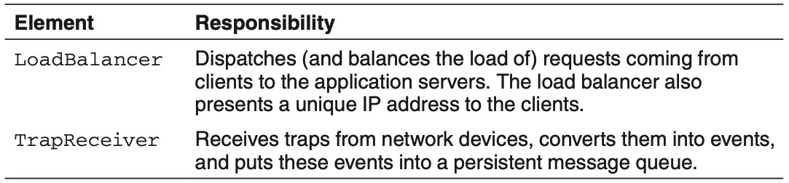

The UML sequence diagram shown in figure 4.11 illustrates how the TrapReceiver that was introduced in this iteration exchanges messages with other elements shown in the deployment diagram to support UC-2 (detect fault), which is associated with both QA-3 (availability) and QA-1 (performance).

> 图4.11 所示的UML序列图说明了在此迭代中引入的 TrapReceiver 如何与部署图中显示的其他元素交换消息，以支持UC-2(检测故障)，这与QA-3(可用性)和QA-1(性能)相关联。

---

As the purpose of this diagram is to illustrate the communication that occurs between the physical nodes, the names of the methods are only preliminary-初步的,预备的; they will be refined in further iterations.

> 由于此图的目的是说明物理节点之间发生的通信，因此方法的名称只是初步的；它们将在进一步的迭代中得到细化。

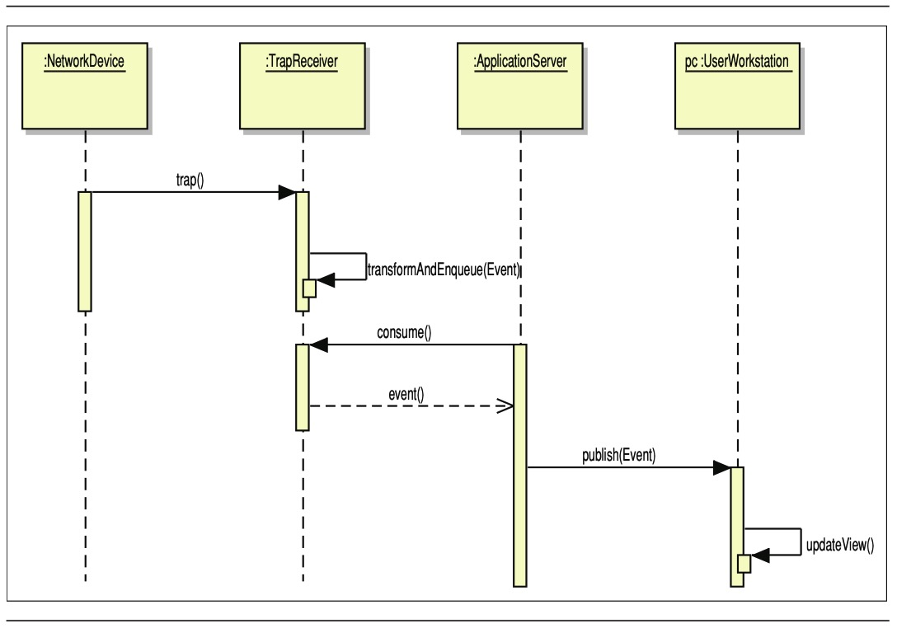

**FIGURE 4.11** Sequence diagram illustrating the messages exchanged between the physical nodes to support UC-2 (Key: UML)

> 图4.11 说明在物理节点之间交换消息以支持 UC-2 的序列图(关键:UML)

#### 4.3.4.6 Step 7: Perform Analysis of Current Design and Review Iteration Goal and Achievement of Design Purpose

In this iteration, important design decisions have been made to address QA-3, which also impacted QA-1.

> 在这个迭代中，为了解决 QA-3 做出了重要的设计决策，这也影响了 QA-1。

The following table summarizes the status of the different drivers and the decisions that were made during the iteration.

> 下表总结了不同驱动程序的状态以及在迭代期间做出的决策。

Drivers that were completely addressed in the previous iteration have been removed from the table.

> 在前一次迭代中完全解决的驱动程序已从表中删除。

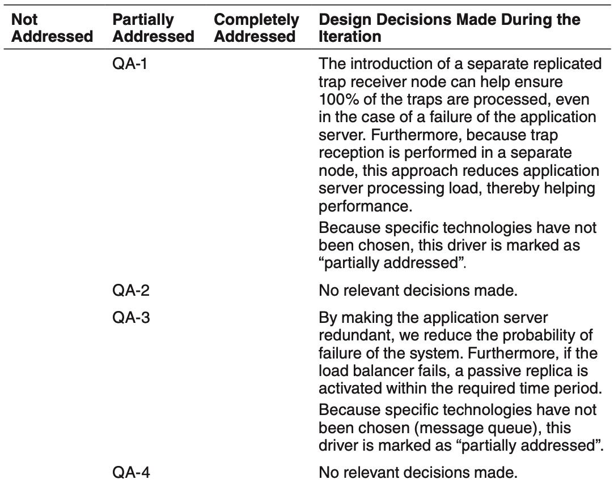

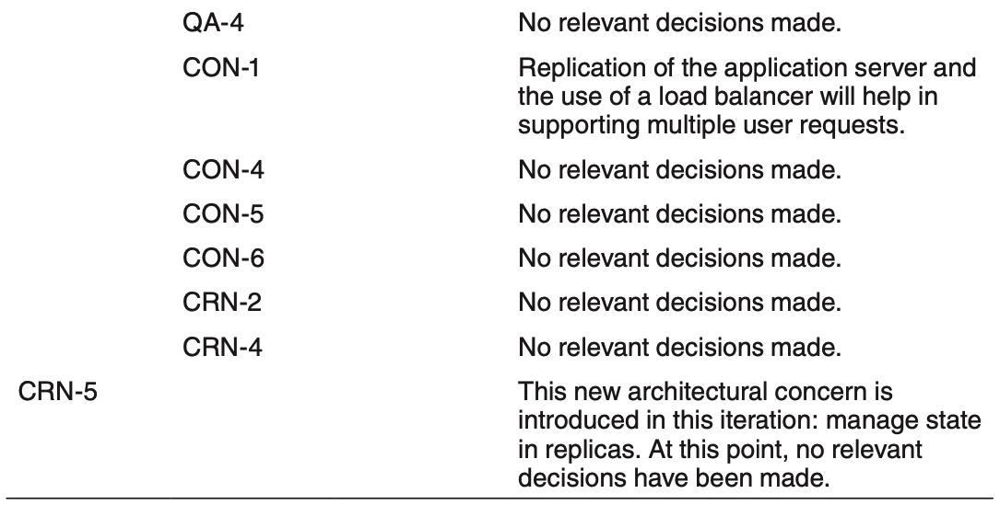

## 4.4 Summary

In this chapter, we presented an example of using ADD to design a greenfield system in a mature domain.

> 在本章中，我们给出了一个使用 ADD 在成熟领域中设计绿地系统的例子。

We illustrated three iterations with different foci-焦点,聚焦: addressing a general concern, addressing functionality, and addressing one key quality attribute scenario.

> 我们用不同的焦点说明了三个迭代：处理一般的关注点，处理功能，以及处理一个关键的质量属性场景。

---

The example followed the roadmap discussed in Section 3.3.1.

It is interesting to observe that in the first iteration, two different reference architectures were used to structure the system.

> 有趣的是，在第一次迭代中，使用了两种不同的参考体系结构来构建系统。

Also, the selection of externally developed components—in this case, frameworks—was carried out across the different iterations.

> 此外，外部开发的组件(在本例中是框架)的选择是在不同的迭代中执行的。

Finally, the example illustrates how new architectural concerns appear as the design progresses.

> 最后，该示例说明了随着设计的进展，新的架构关注点是如何出现的。

---

This example demonstrates how architectural concerns, primary use cases, and quality attribute scenarios can be addressed as part of architectural design.

> 这个例子演示了如何将体系结构关注、主要用例和质量属性场景作为体系结构设计的一部分来处理。

In a real system, more iterations would be necessary to create a complete architecture design by addressing other scenarios with high priority.

> 在真实的系统中，通过处理具有高优先级的其他场景来创建完整的体系结构设计需要更多的迭代。

---

In this example, we assumed that the architect is using a CASE tool during design, so diagrams were produced using UML.

> 在这个例子中，我们假设架构师在设计过程中使用 CASE 工具，因此图是使用UML生成的。

This is certainly not mandatory, as we will see in the case study presented in Chapter 5.

> 这当然不是强制性的，我们将在第5章的案例研究中看到。

Also, note that it is relatively simple to generate preliminary view sketches-草图 by using the information that is generated as part of the design process.

> 另外，请注意，通过使用作为设计过程一部分生成的信息来生成初步视图草图是相对简单的。

## 4.5 Further Reading

Appendix A provides descriptions and bibliographical references of all the design concepts used in this case study.
