# Chapter 5. Case Study: Big Data System

We now present an extended design example of using ADD 3.0 in a greenfield system for a challenging domain—that of Big Data. 

> 我们现在提出了一个扩展的设计示例，在一个具有挑战性的领域——大数据领域——的绿地系统中使用ADD 3.0。

As of the time of writing, this domain was still relatively new and rapidly-快速地,迅速地 evolving.

> 在撰写本文时，这个领域仍然相对较新，并且发展迅速。

As such, the architects could not solely-仅仅,单独地,仅有地 rely on past experience to guide them.

> 因此，建筑师不能仅仅依靠过去的经验来指导他们。

They instead complemented-补充,补足 the design process with periodic-阶段性的,定期的 analyses and strategic prototyping, as we will now describe.

> 相反，他们用定期分析和战略性原型来补充设计过程，正如我们现在所描述的。

## **5.1 Business Case**

This case study involves an Internet company that provides popular content and online services to millions of web users.

> 本案例研究涉及一家为数百万网络用户提供流行内容和在线服务的互联网公司。

Besides providing information externally, the company collects and analyzes massive-大量的,大规模的 logs of data that are generated from its infrastructure (e.g., application and server logs, system metrics).

> 除了向外部提供信息外，该公司还收集和分析从其基础设施生成的大量数据日志(例如，应用程序和服务器日志、系统指标)。

Such an approach of dealing with computer-generated log messages is also called *log management* (http://en.wikipedia.org/wiki/Log_management_and_intelligence).

> 这种处理计算机生成的日志消息的方法也称为**日志管理** (http://en.wikipedia.org/wiki/Log_management_and_intelligence)。

---

Because of very fast infrastructure growth, the company’s IT department realizes that the existing in-house systems can **no longer**-不再,已不 process the required log data volume-大量的 and velocity-速度,速率.

> 由于基础设施的快速发展，公司的 IT 部门意识到现有的内部系统无法再处理所需的日志数据量和速度。

Moreover-此外,而且, requests for a new system are coming from other company stakeholders, including product managers and data scientists, who would like to leverage the various kinds of data that can be collected from multiple data sources, not just logs.

> 此外，对新系统的请求来自公司的其他利益相关者，包括产品经理和数据科学家，他们希望利用可以从多个数据源收集的各种数据，而不仅仅是日志。

---

The *marketecture* diagram (informal-非正式的 depiction-描述,描绘 of the system’s structure) shown in Figure 5.1 represents the desired-渴望,期望 solution from a functional perspective for three major groups of users.

> 图5.1所示的“市场结构”图(系统结构的非正式描述)从功能的角度为三大类用户提供了理想的解决方案。

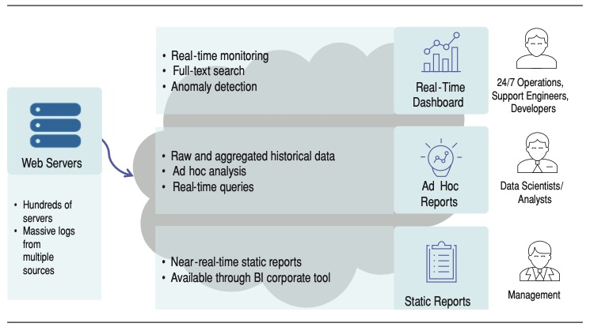

**FIGURE 5.1** Marketecture diagram for the Big Data system

> **图5.1** 大数据系统市场结构图

## 5.2 System Requirements

Requirement elicitation-引出,诱出 activities have been previously performed.

> 需求引出活动已经在以前执行过了。

The most important requirements collected are summarized here.

> 这里总结了收集到的最重要的需求。

They comprise-包含,组成,构成 a set of primary use cases, a set of quality attribute scenarios, a set of constraints, and a set of architectural concerns.

> 它们包括一组主要用例、一组质量属性场景、一组约束和一组体系结构关注。

### 5.2.1 Use Case Model

The primary use cases for the system are described in the following table.

> 系统的主要用例如下表所示。

| Use Case                                 | Description                                                  |
| ---------------------------------------- | ------------------------------------------------------------ |
| UC-1: Monitor online services            | On-duty operations staff can monitor the current state of services and IT infrastructure (such as web server load, user activities, and errors) through a real-time operational dashboard, which enables them to quickly react to issues. 值班操作人员可以通过实时操作仪表板监视服务和 IT 基础设施的当前状态(例如web服务器负载、用户活动和错误)，这使他们能够快速对问题做出反应。 |
| UC-2: Troubleshoot online service issues | Operations, support engineers, and developers can do troubleshooting and root-cause analysis on the latest collected logs by searching log patterns and filtering log messages. 操作人员、技术支持工程师和开发人员可以通过搜索日志模式和过滤日志消息，对最近收集的日志进行故障排除和根本原因分析。 |
| UC-3: Provide management reports         | Corporate users, such as IT and product managers, can see historical information through predefined (static) reports in a corporate-公司的,共同的 BI (business intelligence) tool, such as those showing system load over time, product usage, service level agreement (SLA) violations-违背,违反, and quality of releases. 企业用户，例如IT和产品经理，可以通过企业BI(商业智能)工具中的预定义(静态)报告查看历史信息，例如那些显示随时间变化的系统负载、产品使用、服务水平协议(SLA)违反情况和发布质量的报告。 |
| UC-4: Support data analytics             | Data scientists and analysts can do **ad hoc**-临时的 data analysis through SQL-like queries to find specific data patterns and correlations-相关性 to improve infrastructure capacity planning and customer satisfaction. 数据科学家和分析师可以通过类似sql的查询进行临时数据分析，以找到特定的数据模式和相关性，从而改进基础设施容量规划和客户满意度。 |
| UC-5: Anomaly-异常 detection             | The operations team should be notified-通知 24/7 about any unusual behavior of the system. To support this notification plan, the system shall implement real-time anomaly detection and alerting (future requirement). 对于系统的任何异常行为，操作团队应该得到全天候的通知。为支持此通知计划，系统应实现实时异常检测和报警(未来需求)。 |
| UC-6: Provide security reports           | Security analysts should be provided with the ability to investigate-调查 potential security and compliance-合规 issues by exploring-研究 audit-审计 log entries-条目 that include destination and source addresses, a time stamp-戳, and user login information (future requirement). 应该为安全分析人员提供调查潜在安全性和遵从性问题的能力，方法是研究审计日志条目，其中包括目标和源地址、时间戳和用户登录信息(未来的需求)。 |

### 5.2.2 Quality Attribute Scenarios

> 质量属性场景

The most relevant quality attribute (raw) scenarios are presented in the following table.

For each scenario, we also identify the use case that it is associated with.

| ID    | Quality Attribute | Scenario                                                     | Associated Use Cas |
| ----- | ----------------- | ------------------------------------------------------------ | ------------------ |
| QA-1  | Performance       | The system shall collect up to 15,000 events/ second from approximately 300 web servers. 该系统将从大约300个web服务器收集多达15,000个事件/秒。 | UC-1, 2, 5         |
| QA-2  | Performance       | The system shall automatically refresh the real-time monitoring dashboard for on-duty operations staff with < 1 min latency. 系统自动刷新值班操作人员实时监控仪表板，延时< 1 min。 | UC-1               |
| QA-3  | Performance       | The system shall-将要,将会 provide real-time search queries for emergency-紧急情况下的 troubleshooting with < 10 seconds query execution time, for the last 2 weeks of data. 对于最近2周的数据，系统应提供紧急故障处理的实时查询，查询执行时间< 10秒。 | UC-2               |
| QA-4  | Performance       | The system shall provide near-real-time static reports with per-minute aggregation for business users with < 15 min latency, < 5 seconds report load. 系统为业务用户提供近实时的、按分钟聚合的静态报表，时延< 15分钟，报表加载< 5秒。 | UC-3, 6            |
| QA-5  | Performance       | The system shall provide ad hoc (i.e., non-predefined) SQL-like human-time queries for raw and aggregated historical data, with < 2 minutes query execution time. Results should be available for query in < 1 hour. 系统应该为原始和聚合的历史数据提供类似sql的临时(即非预定义)人工时间查询，查询执行时间小于2分钟。结果应在1小时内可查询。 | UC-4               |
| QA-6  | Scalability       | The system shall store raw-原始的 data for the last 2 weeks available for emergency troubleshooting (via full-text search through logs). 系统存储最近2周的原始数据，可用于紧急故障排除(通过日志全文检索)。 | UC-2               |
| QA-7  | Scalability       | The system shall store raw-原始的 data for the last 60 days (approximately 1 TB of raw data per day, approximately 60 TB in total). 系统存储最近60天的原始数据(每天约1tb，总计约60tb)。 | UC-4               |
| QA-8  | Scalability       | The system shall store per-minute aggregated data for 1 year (approximately 40 TB) and per-hour aggregated data for 10 years (approximately 50 TB). 每分钟汇总数据存储1年(约40tb)，每小时汇总数据存储10年(约50tb)。 | UC-3, 4, 6         |
| QA-9  | Extensibility     | The system shall support adding new data sources by just updating a configuration, with no interruption of ongoing data collection. 系统应支持通过更新配置来添加新的数据源，而不会中断正在进行的数据收集。 | UC-1, 2, 5         |
| QA-10 | Availability      | The system shall continue operating with no downtime if any single node or component fails. 如果任何单个节点或组件发生故障，系统应继续运行，不停机。 | All use cases      |
| QA-11 | Deployability     | The system deployment procedure-过程,步骤 shall be fully automated and support a number of environments: development, test, and production. 系统部署过程应该是完全自动化的，并支持多种环境：开发、测试和生产。 | All use cases      |

### 5.2.3 Constraints

The constraints associated with the system are presented in the following table.

| ID    | Constraint                                                   |
| ----- | ------------------------------------------------------------ |
| CON-1 | The system shall be composed primarily of open source technologies (for cost reasons). For those components where the value/cost of using proprietary-专利的,专有的 technology is much higher, proprietary technology may be used. 系统应主要由开源技术组成(出于成本原因)。对于那些使用专有技术的价值/成本要高得多的组件，可以使用专有技术。 |
| CON-2 | The system shall use the corporate-公司的,企业的 BI tool with a SQL interface for static reports (e.g., MicroStrategy, QlikView, Tableau). 系统应使用带有SQL接口的企业BI工具进行静态报表(如MicroStrategy、QlikView、Tableau)。 |
| CON-3 | The system shall support two specific deployment environments: private cloud (with VMware vSphere Hypervisor) and public cloud (Amazon Web Services). Architecture and technology decisions should be made to keep deployment vendor as agnostic-无关 as possible. 系统需要支持两种特定的部署环境：私有云(VMware vSphere Hypervisor)和公有云(Amazon Web Services)。架构和技术决策应该尽可能与部署供应商无关。 |

### 5.2.4 Architectural Concerns

The initial architectural concerns that are considered are shown in the following table.

| ID    | Constraint                                                   |
| ----- | ------------------------------------------------------------ |
| CRN-1 | Establishing an initial overall structure as this is a greenfield system. 建立一个初步的总体结构，因为这是一个绿地系统。 |
| CRN-1 | Leverage the team’s knowledge of the Apache Big Data ecosystem-生态系统. 充分利用团队对 Apache 大数据生态系统的了解。 |

## 5.3 The Design Process

Now that we have enumerated-列举,枚举 the requirements, we are ready to begin the first iteration of ADD.

This is a system from a relatively novel domain that is being created **from scratch**-从零开始.

> 这是一个来自一个相对较新的领域的系统，它是从头开始创建的。

Hence we follow the roadmap of design for greenfield systems in mature domains (as discussed in Section 3.3.1), albeit-虽然,尽管 with some modifications to address the uncertainties inherent-内在的,固有的 in the Big Data domain, such as the rapid-迅速的,快速的 emergence and evolution of technologies.

> 因此，我们遵循成熟领域全新的系统的设计路线图(如第3.3.1节所述)，尽管有一些修改，以解决大数据领域固有的不确定性，如技术的快速出现和发展。

### 5.3.1 ADD Step 1: Review Inputs

The first step of the method involves reviewing the inputs.

They are summarized in the following table.

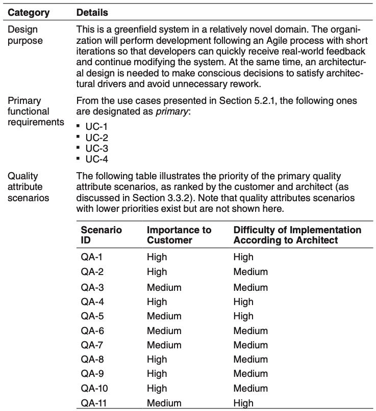

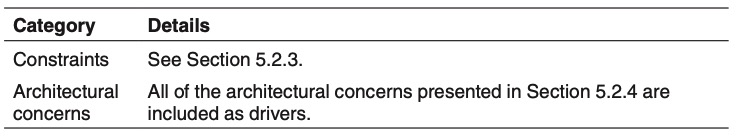

### 5.3.2 Iteration 1: Reference Architecture and Overall System Structure

> 迭代1：参考体系结构和整体系统结构

This section presents the results of the activities that are performed in each of the steps of the ADD method in the first iteration of the design process.

> 本部分展示了在设计过程的第一次迭代中 ADD 方法的每个步骤中执行的活动的结果。

#### 5.3.2.1 Step 2: Establish Iteration Goal by Selecting Drivers

> 通过选择驱动来建立迭代目标

This is the first iteration in the design of a greenfield system, so the iteration goal is to establish an initial overall structure for the system (CRN-1).

> 这是全新的系统设计的第一次迭代，因此迭代的目标是建立系统的初始总体结构(CRN-1)。

Even though this first iteration is driven by a general architectural concern, the architect must keep in mind all of the drivers and, in particular-特别的, constraints and quality attributes:

> 即使第一次迭代是由一般的架构关注点驱动的，架构师也必须记住所有的驱动因素，特别是约束和质量属性:

- CON-1: Leverage open source technologies whenever applicable
- CON-2: Use corporate-公司的,法人的 BI tool with SQL interface for static reports
- CON-3: Two deployment environments: private and public clouds
- QA-1, 2, 3, 4, 5: Performance
- QA-6, 7, 8: Scalability
- QA-9: Extensibility
- QA-10: Availability
- QA-11: Deployability

#### 5.3.2.2 Step 3: Choose One or More Elements of the System to Refine

Again, as this is greenfield development, and we are in the initial iteration, the element to refine is the entire system.

> 再一次，因为这是一个全新的开发，我们在最初的迭代中，需要完善的元素是整个系统。

#### 5.3.2.3 Step 4: Choose One or More Design Concepts That Satisfy the Selected Drivers

> 步骤4：选择一个或多个满足选定驱动程序的设计概念

In this iteration, design concepts are selected from a group of data analytics reference architectures (a list of such reference architectures can be found in the design concepts catalog of the Smart Decisions Game; see the Further Reading section for more information).

> 在这个迭代中，设计概念是从一组数据分析参考架构中选择的(这些参考架构的列表可以在 Smart Decisions Game 的设计概念目录中找到；有关更多信息，请参阅进一步阅读部分)。

---

**Design Decisions and Location**

> 设计决策和位置

Build the application as an instance of the Lambda (reference) architecture

> 将应用程序构建为 Lambda (引用)体系结构的实例

**Rationale**

The Lambda architecture, shown in Figure 5.2, is a reference architecture that splits the processing of a data stream into two streams:

> 如图 5.2 所示，Lambda 架构是一个参考架构，它将数据流的处理分为两个流:

the “speed layer”, which supports access to real-time data (UC-1, UC-2, UC-5),

> “速度层”，支持访问实时数据(UC-1、UC-2、UC-5);

and a layer that groups the “batch” and “serving” layers, which supports access to historical data (UC-3, UC-4, UC-6).

> 以及一个将“批处理”和“服务”层分组的层，支持访问历史数据(UC-3, UC-4, UC-6)。

(The creators of the Lambda architecture refer to these as “layers”, but this is different from prior—and more standard—usages of this term, which typically refer to a grouping of modules. Here the layers are groups of runtime components.)

> ( Lambda 体系结构的创建者将这些称为“层”，但这与该术语的先前和更标准的用法不同，后者通常指的是一组模块。这里的层是运行时组件组。)

While the batch layer is based on immutable-永恒的,不可改变的 nonrelational techniques, the speed layer is based on streaming techniques to support strict-严格的 real-time processing requirements.

> 批处理层基于不可变的非关系技术，而速度层基于流技术，以支持严格的实时处理需求。

Immutability-永恒性,不变性 in this case means that the data is not updated or deleted when it is collected; that is, it can be only appended.

> 在这种情况下，不变性意味着数据在收集时不会更新或删除；也就是说，它只能被追加。

As all data is collected, no data can be lost and a machine or human error can be tolerated-容忍,允许.

> 由于所有数据都已收集，因此不会丢失任何数据，并且可以容忍机器或人为错误。

For example, if a software engineer made an occasional-偶尔的,不经常的 mistake in processing or viewing logic, once that problem is resolved, the collected data can be used to replay and recompute the views from scratch.

> 例如，如果软件工程师在处理或查看逻辑时偶尔犯了错误，一旦解决了这个问题，收集到的数据就可以用于从头开始重播和重新计算视图。

For the reader’s convenience-方便,便利性 we describe the basic concepts of the Lambda architecture by walking through five steps:

> 为了方便读者，我们通过五个步骤来描述Lambda架构的基本概念：

1. All data received from multiple data sources is dispatched through the data stream element to both the batch layer and the speed layer for processing.

   > 从多个数据源接收到的所有数据都通过数据流元素发送到批处理层和速度层进行处理。

2. The batch layer acts as a landing zone that corresponds-类似于,相当于 to the master dataset element (as an immutable-永恒的,不可改变的, append-only set of raw data), and also precomputes information that will be used by the batch views.

   > 批处理层充当与主数据集元素相对应的着陆区(作为不可变的、只能追加的原始数据集)，并且还预先计算将由批处理视图使用的信息。

3. The serving layer contains precalculated and aggregated views optimized for querying with low latency, which is often required by reporting solutions.

   > 服务层包含预先计算和聚合的视图，这些视图针对低延迟的查询进行了优化，这通常是报告解决方案所需要的。

4. The speed layer processes and provides access to recent data through real-time views that are not available in the serving layer due to the high latency of batch processing.

   > 速度层通过实时视图处理并提供对最新数据的访问，由于批处理的高延迟，实时视图在服务层中不可用。

5. All data in the system is available for querying, whether it is historical or recent, representing the key Lambda architecture principle: query = function (batch data + real-time data).

   > 系统中的所有数据都可以查询，无论是历史数据还是近期数据，体现了 Lambda 架构的关键原则：query = function (batch data + real-time data)。

The parallel streams provide “complexity isolation”, meaning that design decisions, development, and execution of each stream can be done independently, which has been shown to increase **fault tolerance**-容错性, scalability, and modifiability (see Table 5.1).

> 并行流提供了“复杂性隔离”，这意味着每个流的设计决策、开发和执行都可以独立完成，这已经被证明可以提高容错性、可伸缩性和可修改性(参见**表5.1**)。

Figure 5.3 depicts-描述,描绘 the architectural tradeoffs between these alternatives, and demonstrates the differences between the reference architectures in terms of four quality dimensions-维度,方面: scalability, support for ad hoc analysis, unstructured data processing capabilities, and real-time analysis capabilities:

> 图5.3 描述了这些替代方案之间的体系结构权衡，并从四个质量维度展示了参考体系结构之间的差异：可伸缩性、对特别分析的支持、非结构化数据处理能力和实时分析能力。

As Figure 5.3 shows, the Lambda architecture provides the best tradeoff between scalability and ad hoc analysis.

> 如图5.3所示，Lambda体系结构提供了可伸缩性和临时分析之间的最佳折衷。

---

**Design Decisions and Location**

Use fault tolerance and no single point of failure principle for all elements in the system

> 对系统中的所有元件采用容错和无单点故障原则

**Rationale**

Fault tolerance has become a standard for most Big Data technologies and the Lambda architecture already implies a number of design decisions to build a robust-稳固的,健壮的 and fault-tolerant system, as noted above.

> 容错已经成为大多数大数据技术的标准，Lambda架构已经暗示了许多设计决策，以构建一个健壮和容错的系统，如上所述。

However, we will need to make sure, in all subsequent-随后的,接着的 design and deployment decisions, that all candidate technologies will support the QA-10 requirement by providing fault-tolerant configurations and adhering to the “no single point of failure” principle.

> 然而，我们需要确保，在所有后续的设计和部署决策中，所有候选技术都将通过提供容错配置和坚持“无单点故障”原则来支持QA-10需求。

---

**TABLE 5.1** Alternatives and Reasons for Discarding

> **表5.1** 丢弃的备选方案和原因

| Alternative                               | Reason for Discarding                                        |
| ----------------------------------------- | ------------------------------------------------------------ |
| Traditional relational 传统的关系      | This reference architecture is based on traditional relational model principles and SQL-based DBMSs, which are considered highly efficient for complex ad hoc read queries. This is, however, **the least**-最少,最不 appropriate alternative because of scalability and real-time processing limitations. 这个参考体系结构基于传统的关系模型原则和基于 SQL 的 DBMSs ，它们被认为对于复杂的临时读取查询非常高效。然而，由于可伸缩性和实时处理的限制，这是最不合适的替代方案。 |
| Extended relational 扩展关系           | Although this reference architecture is completely based on relational model principles and SQL-based DBMSs, it intensively-强烈地,广泛地 uses massive-大量的,大规模的 parallel processing (MPP) and inmemory techniques to improve scalability and extensibility. It is less appropriate because of its high cost and real-time processing limitations. 尽管这个参考体系结构完全基于关系模型原则和基于 SQL 的 DBMSs，但它大量使用大规模并行处理(MPP)和内存技术来提高可伸缩性和可扩展性。由于其高成本和实时处理的限制，它不太合适。 |
| Pure-存粹的 nonrelational 纯粹的非关系 | This reference architecture does not rely on relational model principles. It is often built on techniques such as NoSQL and MapReduce, and is effective for processing semistructured-半结构化的 and unstructured data. 这个参考体系结构不依赖于关系模型原则。它通常建立在NoSQL和MapReduce等技术之上，对于处理半结构化和非结构化数据非常有效。 This alternative is closer to the goal in terms of cost economy-经济 and scalability, but ad hoc analysis is limited. 在成本经济和可伸缩性方面，这种替代方法更接近目标，但是特别分析是有限的。 |
| Data refinery 数据提炼                 | A non-relational component performs an extract–transform–load (ETL) process to refine semistructured/unstructured data and load it, cleansed, into a data warehouse (a relational database) for further analysis. 非关系组件执行提取-转换-加载(ETL)过程，以细化半结构化/非结构化数据，并将清理后的数据加载到数据仓库(关系数据库)中以供进一步分析。 It is less appropriate for this solution mostly because of its high cost and significant deficiencies-缺乏,不足 in terms of real-time processing capabilities. 它不太适合此解决方案，主要是因为它的高成本和在实时处理能力方面的重大缺陷。 |

---

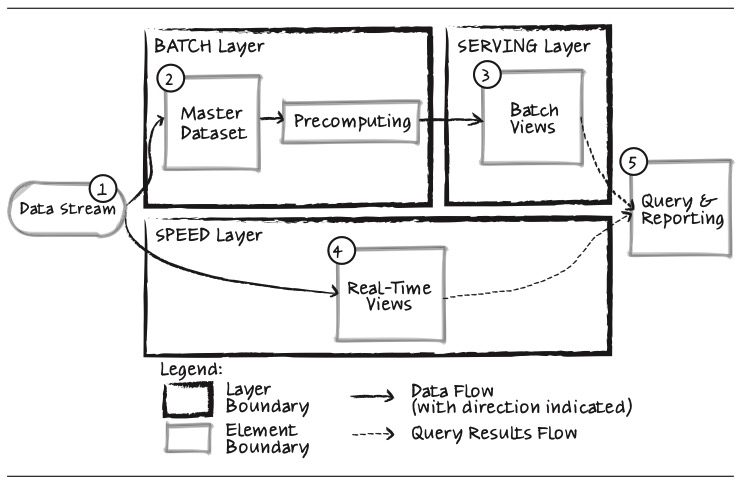

**FIGURE 5.2** Lambda Architecture

> **图5.2** Lambda 架构

---

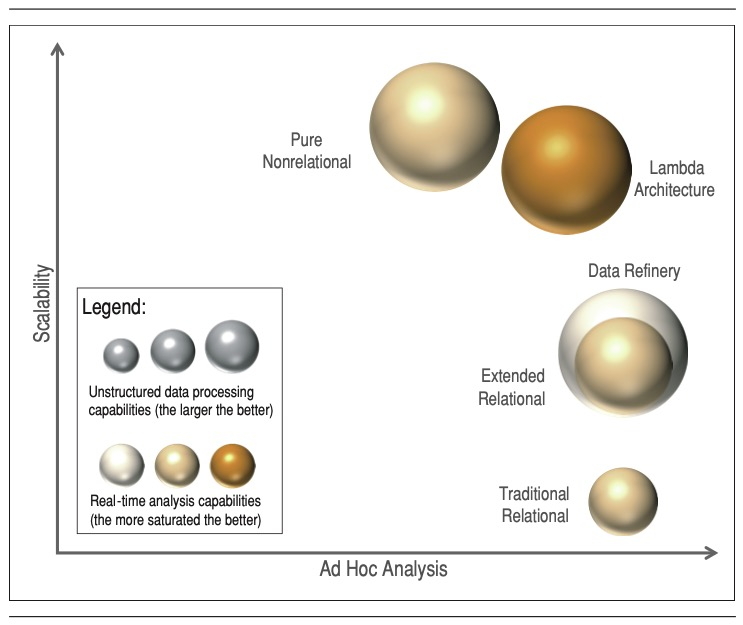

**FIGURE 5.3** Tradeoffs among data analytics reference architectures

> **图5.3** 数据分析参考架构之间的权衡

#### 5.3.2.4 Step 5: Instantiate Architectural Elements, Allocate Responsibilities,and Define Interfaces

> 步骤5：实例化架构元素，分配职责，并定义接口

The instantiation design decisions considered and made are summarized in the following table.

> 考虑和做出的实例化设计决策总结在下表中。

---

**Design Decision and Location**

Split the Query and Reporting element into two subelements associated with the drivers

> 将 Query 和 Reporting 元素拆分为与驱动程序相关的两个子元素

**Rationale**

The Query and Reporting element in the Lambda architecture is **divided into**-分为,划分 the following two sub-elements.

> Lambda 架构中的 Query 和 Reporting 元素分为以下两个子元素。

They are associated with drivers as follows:

- Corporate-企业的,公司的 BI tool (UC-3, UC-4, QA-4, QA-5, CON-2)

  > 企业 BI 工具(UC-3、UC-4、QA-4、QA-5、CON-2)

- Dashboard/visualization tool (UC-1, UC-2, QA-2, QA-3)

  > 仪表板/可视化工具(UC-1、UC-2、QA-2、QA-3)

This division-分开,分配,划分 is driven by knowledge of the domain and the availability of tools.

> 这种划分是由领域知识和工具的可用性驱动的。

The guiding rationale is to have flexibility in selecting appropriate technologies—there could not be one single “universal-普遍的,通用的” tool to satisfy all of these use cases, constraints, and quality attributes.

> 指导原理是在选择适当的技术时具有灵活性——不可能有一个单一的“通用”工具来满足所有这些用例、约束和质量属性。

Thus, we choose to separate concerns, which should give us more design options.

> 因此，我们选择分离关注点，这应该给我们更多的设计选择。

Another difference from the “standard” Lambda architecture is that we may not need to merge the results of queries: According to our use cases, they can be executed independently for batch and real-time views.

> 与“标准”Lambda架构的另一个区别是，我们可能不需要合并查询的结果：根据我们的用例，它们可以独立执行批处理和实时视图。

---

**Design Decision and Location**

Split the Precomputing and Batch Views elements into subelements associated with Ad Hoc and Static Views

> 将预计算和批处理视图元素拆分为与 Ad Hoc 和静态视图相关联的子元素

**Rationale**

These elements are decomposed into two subelements each:

> 这些元素分别被分解为两个子元素：

- Ad Hoc Views Precomputing and Ad Hoc Batch Views (UC-4, QA-5)

- Static Views Precomputing and Static Batch Views (UC-3, QA-4, CON-2)

The reason for this subdivision-细分 is the same as with the previous case: It gives us more flexibility to select the optimal patterns and technologies.

> 这种细分的原因与前一种情况相同：它使我们能够更灵活地选择最佳模式和技术。

If we discover, in subsequent design iterations, that there is one approach to address these two concerns simultaneously, it will be simple to merge these elements.

> 如果我们发现，在随后的设计迭代中，有一种方法可以同时处理这两个关注点，那么合并这些元素就很简单了。

---

**Design Decision and Location**

Change semantics-语义的,语义学的 and name of the Master Dataset to Raw Data Storage

> 将主数据集的语义和名称更改为原始数据存储

**Rationale**

This is more than just a name change; it is also a change in semantics.

> 这不仅仅是一个名字的改变；这也是语义上的变化。

According to QA-7, the system shall store raw data for least 60 days.

> 根据 QA-7，系统应保存原始数据至少60天。

Thus older data can be archived-归档,存档 and stored using other storage technologies(or even deleted).

> 因此，可以使用其他存储技术对旧数据进行归档和存储(甚至删除)。

The Master Dataset has more responsibilities: It includes raw data storage as well as archived data.

> 主数据集有更多的职责：它包括原始数据存储和归档数据。

To simplify this case, the study of archived data will not be addressed.

> 为了简化这种情况，将不讨论归档数据的研究。

---

In this initial iteration it is typically too early to precisely-精确地,准确地 define functionality and interfaces.

> 在这个初始迭代中，精确地定义功能和接口通常还为时过早。

#### 5.3.2.5 Step 6: Sketch Views and Record Design Decisions

Figure 5.4 shows the result of the prior-先前的,事先的 instantiation design decisions.

The table that begins on the next page summarizes each element’s responsibilities.

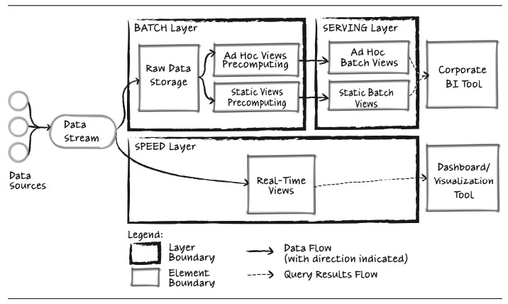

**FIGURE 5.4** Instantiation of the Lambda architecture

> **图5.4** Lambda架构的实例化

| Element                       | Responsibility                                               |
| ----------------------------- | ------------------------------------------------------------ |
| Data Sources                  | Web servers that generate logs and system metrics (e.g., Apache access and error log, Linux sysstat). |
| Data Stream                   | This element collects data from all data sources in real-time and dispatches it to both the Batch Layer and the Speed Layer for processing. 此元素实时地从所有数据源收集数据，并将其分发给批处理层和速度层进行处理。 |
| Batch Layer                   | This layer is responsible for storing raw data and precomputing the batch views to be stored in the Serving Layer. |
| Serving Layer                 | This layer exposes-暴露,公开 the batch views in a data store (with no random writes, but batch updates and random reads), so that they can be queried with low latency. 这一层公开了数据存储中的批处理视图(没有随机写入，但是批量更新和随机读取)，因此可以以低延迟进行查询。 |
| Speed Layer                   | This layer processes and provides access to recent data, which is not available yet in the serving layer due to the high latency of batch processing, through a set of real-time views. 该层通过一组实时视图处理并提供对最近数据的访问，由于批处理的高延迟，这些数据在服务层中还不可用。 |
| Raw Data Storage              | This element is a part of the batch layer and is responsible for storing raw data (immutable, append only) for a specified-规定的,指定的 period of time (QA-7). 此元素是批处理层的一部分，负责在指定时间段内存储原始数据(不可变，仅追加)(QA-7)。 |
| Ad Hoc Views Precomputing     | This element is a part of the Batch Layer and is responsible for precomputing the Ad Hoc Batch Views. The precomputing represents batch operations over raw data that transform it to a state suitable for fast human-time querying. 该元素是批处理层的一部分，负责预先计算特设批处理视图。预计算表示对原始数据进行批处理操作，将其转换为适合快速人工查询的状态。 |
| Static Views Precomputing     | This element is a part of the Batch Layer and is responsible for precomputing the Static Batch Views. The precomputing represents batch operations over raw data that transform it to a state suitable for fast human-time querying. 该元素是批处理层的一部分，负责预计算静态批处理视图。预计算表示对原始数据进行批处理操作，将其转换为适合快速人工查询的状态。 |
| Ad Hoc Batch Views            | This element is a part of the Serving Layer and contains precalculated and aggregated data optimized for ad hoc low-latency queries (QA-5) executed by data scientists/analysts. 此元素是服务层的一部分，包含预先计算和聚合的数据，这些数据针对数据科学家/分析师执行的特殊低延迟查询(QA-5)进行了优化。 |
| Static Batch Views            | This element is a part of the Serving Layer and contains precalculated and aggregated data optimized for predefined low-latency queries (QA-4) generated by a corporate BI tool. 此元素是服务层的一部分，包含针对企业BI工具生成的预定义低延迟查询(QA-4)进行优化的预计算和聚合数据。 |
| Real-Time Views               | This element is a part of the Speed Layer and contains indexed logs optimized for ad hoc, low-latency search queries (QA-3) executed by operations and engineering staff. 该元素是速度层的一部分，包含为操作和工程人员执行的临时低延迟搜索查询(QA-3)优化的索引日志。 |
| Corporate BI Tool             | This business intelligence-情报,智力 tool is licensed to be used across different departments. The tool supports a SQL interface (such as ODBC or JDBC) and can be connected to multiple data sources, including this system (UC-3, UC-4, CON-2). 此业务智能工具已获得许可，可以跨不同部门使用。该工具支持SQL接口(如ODBC或JDBC)，并且可以连接到多个数据源，包括此系统(UC-3、UC-4、CON-2)。 |
| Dashboard/ Visualization Tool | The operations team uses this real-time operational dashboard to monitor online services, search for important messages in logs, and quickly react to potential issues (UC-1, UC-2). 操作团队使用实时操作仪表板监视在线服务，搜索日志中的重要消息，并快速响应潜在问题(UC-1, UC-2)。 |

#### 5.3.2.6 Step 7: Perform Analysis of Current Design and Review Iteration Goal and Achievement of Design Purpose

> 步骤7:执行当前设计的分析，并审查迭代目标和设计目的的实现

The decisions made in this iteration address important early considerations affecting the overall system structure.

> 在这个迭代中做出的决定处理了影响整个系统结构的重要的早期考虑。

You do not need to start from a “blank page”, because the selected reference architecture already offers a proven initial decomposition and data flow that significantly saves design time and effort.

> 您不需要从“空白页”开始，因为所选择的参考体系结构已经提供了经过验证的初始分解和数据流，从而显著节省了设计时间和精力。

Further design decisions will need to be made to selected candidate technologies and more details provided on how use cases and quality attributes will be supported.

> 进一步的设计决策将需要选择候选技术，并提供更多关于如何支持用例和质量属性的细节。

---

The following table summarizes the design progress using the Kanban board technique discussed in Section 3.8.2.

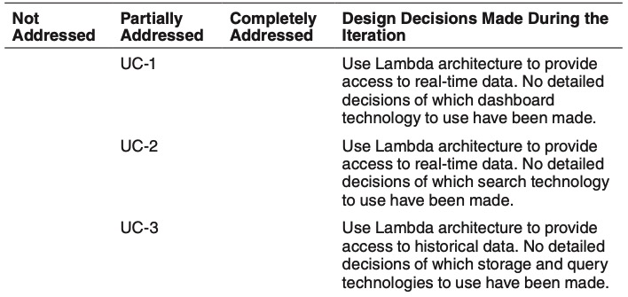

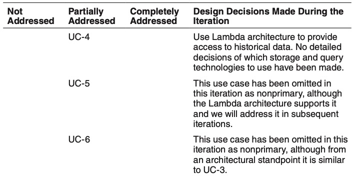

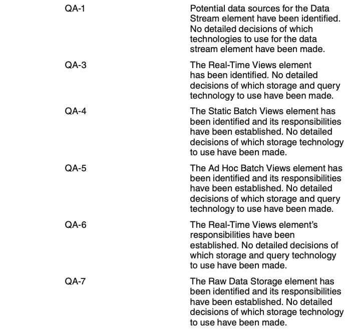

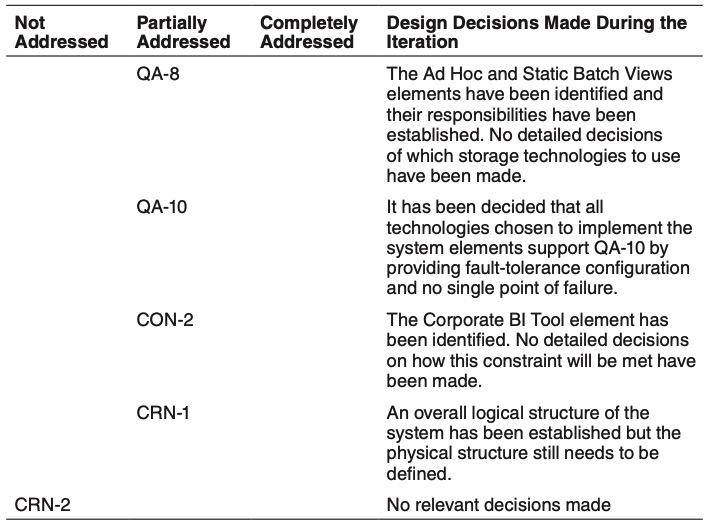

### 5.3.3 Iteration 2: Selection of Technologies

> 迭代2：技术选择

This section presents the results of the activities that are performed in each of the steps of ADD in the second iteration of the design process.

---

Technology choices often influence the system architecture, meaning that we need to select technologies at the earliest stages of architecture design.

Choosing technologies starts with the identification and selection of technology families that are further instantiated into specific-明确的,具体的 technologies.

> 选择技术始于识别和选择进一步实例化为具体技术的技术族。

Starting with technology families allows us to make specific technologies interchangeable-可互换的,可交换的 and thus keep the right level of technology agnosticism-不可知论 to avoid vendor lock-in (and as a result, there is less risk and less cost to change a technology to a better one in the future).

> 从技术家族开始，使我们能够使特定的技术可以互换，从而保持适当的技术不可知论水平，以避免供应商锁定(因此，在未来将技术更改为更好的技术的风险和成本更低)。

---

In this iteration we will show a technology tree that helps us choose optimal building blocks when designing Big Data greenfield systems.

> 在这个迭代中，我们将展示一个技术树，帮助我们在设计大数据全新的系统时选择最佳的构建模块。

---

#### 5.3.3.1 Step 2: Establish Iteration Goal by Selecting Drivers

The goal of this iteration is to address CRN-2 (leverage the team’s knowledge of the Apache Big Data ecosystem) by selecting technologies to support system requirements defined in Section 5.2, particularly keeping in mind CON-1 (favor-较喜欢,偏袒 open source technologies).

> 这次迭代的目标是通过选择技术来支持5.2节中定义的系统需求来解决CRN-2(利用团队对Apache大数据生态系统的了解)，特别是要记住CON-1(支持开源技术)。

#### 5.3.3.2 Step 3: Choose One or More Elements of the System to Refine

The reference architecture selected in the previous iteration (the Lambda architecture) was decomposed into elements that facilitate the selection of technology families and their associated specific technologies.

> 在前一个迭代中选择的参考体系结构(Lambda体系结构)被分解为促进技术家族及其相关特定技术选择的元素。

These elements include the Data Stream, Raw Data Storage, Ad Hoc and Static Views Precomputing, Ad Hoc and Static Batch Views, Real-Time Views, and Dashboard/Visualization Tool.

#### 5.3.3.3 Step 4: Choose One or More Design Concepts That Satisfy the Selected Drivers

> 步骤4：选择一个或多个满足选定驱动程序的设计概念

The design concepts used in this iteration are externally developed components.

> 在此迭代中使用的设计概念是外部开发的组件。

Initially, technology families are selected and associated with the elements to be refined.

> 最初，选择技术族并将其与要细化的元素相关联。

A technology family represents a group of technologies with common functional purposes (see Section 2.5.5).

> 技术族表示一组具有共同功能目的的技术(参见第2.5.5节)。

The family names are indicative-象征的 of their function, and some specific technologies may belong to several families at the same time, but having such a classification helps us make rational-合理的 design decisions that eventually-最终,结果 **pay off**-取得成功 in less rework and better readiness for changes.

> 家族名称指示了它们的功能，并且一些特定的技术可能同时属于几个家族，但是拥有这样的分类可以帮助我们做出合理的设计决策，最终减少返工并更好地为更改做好准备。

The history of the software industry shows that technology implementations are emerging, evolving, and disappearing-消失 much faster than the patterns and principles represented by their families.

> 软件行业的历史表明，技术实现的出现、发展和消失的速度比它们所代表的模式和原则要快得多。

---

Figure 5.5 illustrates family groups, technology families (in regular text), and their associated specific technologies (in italic-斜体的 text) for the Big Data domain.

> 图5.5 说明了大数据领域的族组、技术族(以常规文本表示)及其相关的特定技术(以斜体文本表示)。

Further details about a number of these technologies can be found in the design concepts catalog of the Smart Decisions Game (see the Further Reading section).

> 关于这些技术的更多细节可以在《Smart Decisions Game》的设计概念目录中找到(参见进一步阅读部分)。

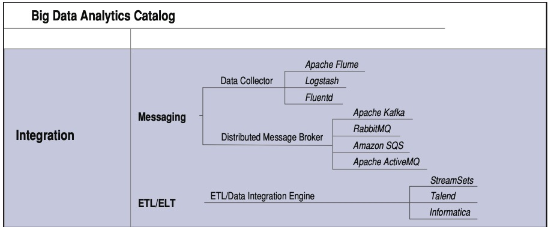

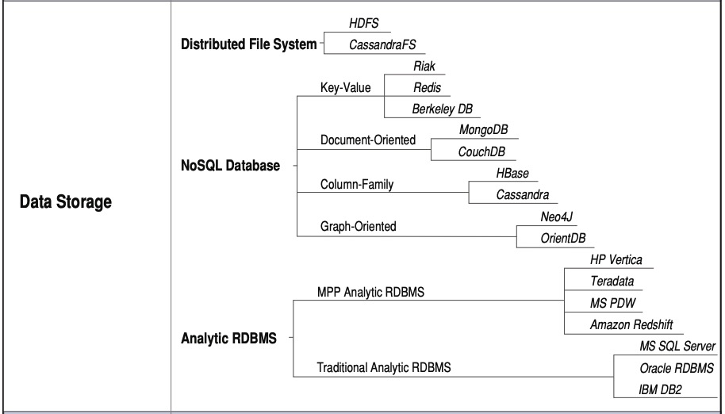

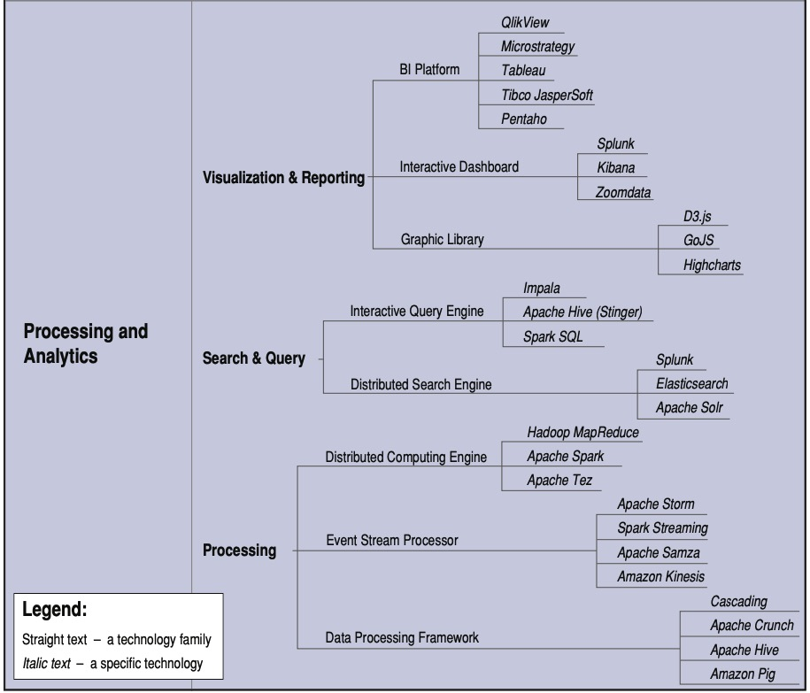

**FIGURE 5.5** An example of a Big Data analytics design concepts catalog (Source: Softserve)

> **图5.5** 大数据分析设计概念目录示例(来源:Softserve)

The BI Platform family group and related technologies are not considered further in this design exercise because the corporate BI tool is external to the target system.

> 由于企业BI工具位于目标系统的外部，因此在此设计练习中没有进一步考虑BI平台家族组和相关技术。

---

**Design Decisions and Location**

Select the Data Collector family for the Data Stream element

> 为 Data Stream 元素选择 Data Collector 系列

**Rationale and Assumptions**

Data Collector is a technology family (and an architectural pattern) that collects, aggregates, and transfers log data for later use. 

> Data Collector 是一个收集、聚合和传输日志数据以供以后使用的技术家族(和体系结构模式)。

Usually Data Collector implementations offer out-of-the-box plug-ins for integrating with popular event sources and destinations.

> 通常，Data Collector 实现提供开箱即用的插件，用于与流行的事件源和目标集成。

The destinations are the Raw Data Storage and Real-Time Views elements, which will also be addressed in this iteration.

> 目标是 Raw Data Storage 和 Real-Time Views 元素，它们也将在此迭代中处理。

***Alternative***

ETL Engine

***Reason for Discarding***

The main purpose of ETL engines is to perform batch transformations, rather than per-event operations.

> ETL 引擎的主要目的是执行批处理转换，而不是每个事件操作。

This means that real-time performance and scalability criteria (QA-1, QA-2) will be extremely difficult to meet (if it is possible to meet them at all).

> 这意味着实时性能和可伸缩性标准(QA-1, QA-2)将非常难以满足(如果可能的话)。

***Alternative***

Distributed Message Broker

> 分布式消息代理

***Reason for Discarding***

Although this technology family can be solely used to implement the Data Stream element, it provides less support for extensibility-扩展性 (QA-9) and, therefore, is better suited as a complement-补充,补足 to the data collector.

> 尽管该技术系列可以单独用于实现 Data Stream 元素，但它对可扩展性(QA-9)提供的支持较少，因此更适合作为数据收集器的补充。

This can be achieved, for example, using Flavka—a combination of Apache Flume (Data Collector) and Apache Kafka (Distributed Message Broker).

> 这可以实现，例如，使用 Flavka - Apache Flume(数据收集器)和 Apache Kafka(分布式消息代理)的组合。

---

**Design Decisions and Location**

Select the Distributed File System family for the Raw Data Storage element

> 为原始数据存储元素选择分布式文件系统系列

**Rationale and Assumptions**

According to the Lambda architecture principles, the Raw Data Storage element must be immutable.

> 根据 Lambda 体系结构原则，Raw Data Storage 元素必须是不可变的。

Thus new data should not modify existing data, but just be appended to the dataset.

> 因此，新数据不应该修改现有数据，而只是添加到数据集中。

Data will be read in batch operations for transforming raw data to Batch Views.

> 数据将在批处理操作中读取，以便将原始数据转换为批处理视图。

For these purposes, we can confidently choose a Distributed File System.

> 出于这些目的，我们可以自信地选择分布式文件系统。

***Alternative***

NoSQL Database

***Reason for Discarding***

Although NoSQL databases (especially column-family and document-oriented) can be used for storing raw data, such as logs, this will cause-引起 unnecessary overhead in resource consumption-消耗 (mostly memory consumption because of caching mechanisms) and maintainability (because of the need of configuring and evolving a schema).

> 尽管NoSQL数据库(尤其是列族数据库和面向文档的数据库)可以用于存储原始数据，比如日志，但这会导致不必要的资源消耗(主要是由于缓存机制造成的内存消耗)和可维护性(由于需要配置和发展模式)。

***Alternative***

Analytic RDBMS

***Reason for Discarding***

All relational databases including analytic capabilities are based on the relational model, forming tables and rows.

> 包括分析功能在内的所有关系数据库都基于关系模型，形成表和行。

This works very well for executing complex queries, but this option is awkward-难对付的,难处理的 (and expensive) for storing semistructured-半结构化的 logs in their raw-原始的,未加工的 format.

> 这对于执行复杂的查询非常有效，但是对于以原始格式存储半结构化日志来说，这个选项很笨拙(而且代价高昂)。

---

**Design Decisions and Location**

Select Interactive Query Engine family for both the Static and Ad Hoc Batch Views elements

> 为静态和临时批处理视图元素选择交互式查询引擎系列

**Rationale and Assumptions**

As we stated in the previous iteration, the Batch Views element is refined into two elements, the Static and Ad Hoc Batch Views, to support two use cases: the generation of static reports (UC-3, 6) and the support for ad hoc querying (UC-4).

> 正如我们在之前的迭代中所述，批处理视图元素被细化为两个元素，静态和临时批处理视图，以支持两个用例：生成静态报告(UC-3, 6)和支持临时查询(UC-4)。

The main design decision is to use the same technology family for both Static and Ad Hoc Batch Views—namely, the Interactive Query Engine.

> 主要的设计决策是对静态和临时批处理视图使用相同的技术系列——即交互式查询引擎。

These engines allow analytic database capabilities over data stored in a Distributed File System (thus this technology family is also selected implicitly).

> 这些引擎允许对存储在分布式文件系统中的数据进行分析数据库功能(因此也隐式地选择了该技术家族)。

If we select a technology that is fast enough, it can be used for both elements.

> 如果我们选择一种足够快的技术，它可以用于这两个元素。

The benefit of using a single technology family is that we do not need to have separate storage technologies for reporting and querying data.

> 使用单一技术家族的好处是，我们不需要为报告和查询数据使用单独的存储技术。

***Alternative***

NoSQL Database

***Reason for Discarding***

The Static Batch Views element can be implemented with the Materialized View pattern, by storing data in a form that is ready for querying and displaying in a reporting system (a corporate BI tool).

> 静态批处理视图元素可以使用Materialized View模式实现，方法是将数据存储在报表系统(企业BI工具)中查询和显示的表单中。

The NoSQL Database family is often used for this purpose because it provides good scalability and, being open source, satisfies QA-8 (approximately 90 TB of aggregated data) and CON-1 (open source license).

> NoSQL 数据库系列经常用于此目的，因为它提供了良好的可伸缩性，并且是开源的，满足QA-8(大约90 TB的聚合数据)和CON-1(开源许可)。

However, NoSQL databases are not good options to use as data warehouses-仓库,仓储 for ad hoc queries because they were not designed for analytic purposes.

> 然而，NoSQL 数据库并不是用于特殊查询的数据仓库的好选择，因为它们不是为分析目的而设计的。

Although they can be used for this purpose, this application will result in significant performance penalties-处罚,损失.

> 尽管它们可以用于此目的，但此应用程序将导致严重的性能损失。

This alternative is therefore discarded as it can be used only for the Static Batch Views, but is ineffective for Ad Hoc Batch Views

> 因此，这种替代方法被丢弃，因为它只能用于静态批处理视图，但对于临时批处理视图无效

***Alternative***

Analytic RDBMS

***Reason for Discarding***

Ad hoc queries can be any queries that are supported by a SQL-like interface.

> 特别查询可以是由类似sql的接口支持的任何查询。

The query result must be returned within “human” time (QA-5).

> 查询结果必须在“人”时间(QA-5)内返回。

The described scenario is exactly what a data warehouse is used for.

> 所描述的场景正是数据仓库的用途。

This pattern is usually implemented with Analytic RDBMS technologies following the Kimball or Inmon design approaches.

> 这种模式通常使用遵循 Kimball 或 Inmon 设计方法的Analytic RDBMS技术来实现。

At the same time, it will be quite costly-昂贵的,值钱的 to satisfy the scalability requirement of having approximately 90 TB of aggregated data. 

> 同时，要满足大约90tb聚合数据的可伸缩性需求，成本将相当高。

The cost per terabyte in MPP analytic databases is significantly higher (up to 30 times) than the same amount of data in a NoSQL database or a distributed file system (such as Hadoop).

> MPP 分析数据库中每tb的成本明显高于 NoSQL 数据库或分布式文件系统(如Hadoop)中相同数量数据的成本(最高可达30倍)。

This alternative is rejected because even if it can be used for both Static and Ad Hoc Batch Views, the technologies associated with this family are costly compared to (open source) Hadoop-based alternatives.

> 这种替代方案被拒绝，因为即使它可以用于静态和临时批处理视图，与(开放源码的)基于 hadoop 的替代方案相比，与此系列相关的技术成本也很高。

---

**Design Decisions and Location**

Use Data Processing Framework for the Views Precomputing elements

> 对视图的预计算元素使用数据处理框架

**Rationale and Assumptions**

As we have already selected the Distributed File System family for Raw Data Storage and Batch Views, the next step is to choose a solution for data transformation from the Raw Data Storage to the format used in the Batch Views.

> 由于我们已经为原始数据存储和批处理视图选择了分布式文件系统系列，下一步是选择从原始数据存储到批处理视图中使用的格式的数据转换的解决方案。

The decision is to select Data Processing Framework as this technology family allows data processing pipelines to be created using abstractions that support faster development and better maintainability.

> 我们决定选择 Data Processing Framework，因为该技术家族允许使用支持更快开发和更好可维护性的抽象来创建数据处理管道。

***Alternative***

Distributed Computing Engine

***Reason for Discarding***

Most Distributed Computing Engine technologies are designed for batch data processing, but require substantial-大量的 knowledge of low-level primitives (e.g., for writing MapReduce tasks).

> 大多数分布式计算引擎技术都是为批处理数据而设计的，但需要大量的底层原语知识(例如，编写MapReduce任务)。

***Alternative***

Event Stream Processor

***Reason for Discarding***

This is designed for real-time streaming processing; it is ineffective-无效果的,不起作用的 for batch operations.

> 这是为实时流处理而设计的；对于批处理操作是无效的。

---

**Design Decisions and Location**

Select Distributed Search Engine for the Real-Time Views element

> 为实时视图元素选择分布式搜索引擎

**Rationale and Assumptions**

The Real-Time Views element is responsible for full-text search over recent logs and for feeding an operational dashboard with real-time monitoring data (UC-1, UC-2).

> Real-Time Views 元素负责对最近的日志进行全文搜索，并为操作仪表板提供实时监控数据(UC-1、UC-2)。

Distributed Search Engine is a technology family that serves just such purposes.

> 分布式搜索引擎就是一个服务于这种目的的技术家族。

***Alternative***

NoSQL Database

***Reason for Discarding***

Some NoSQL databases provide keyword search or text search, but these are not as powerful and fast as search engines that also provide text-processing features such as stemming and geolocation.

> 一些 NoSQL 数据库提供关键字搜索或文本搜索，但它们不如搜索引擎强大和快速，这些搜索引擎也提供诸如词干提取和地理定位之类的文本处理特性。

***Alternative***

Analytic RDBMS

***Reason for Discarding***

Some databases provide full-text search capabilities (e.g., MS SQL Server); however, they are less desirable from extensibility, maintenance, and cost standpoints-角度.

> 一些数据库提供全文搜索功能(例如，MS SQL Server);然而，从可扩展性、维护和成本的角度来看，它们不太理想。

***Alternative***

Distributed File System and Interactive Query Engine

***Reason for Discarding***

This approach works well for batch historical data; however, the latency of storing and processing will be too high for real-time data.

> 这种方法适用于批量历史数据；但是，存储和处理的延迟对于实时数据来说太高了。

---

**Design Decisions and Location**

Automate deployment of the system with Puppet scripts

> 使用 Puppet 脚本自动部署系统

**Rationale and Assumptions**

Puppet scripts can be used for both Private Cloud (e.g., VMware) and Public Cloud (e.g., AWS) deployments.

> Puppet 脚本既可以用于私有云(例如VMware)，也可以用于公共云(例如AWS)部署。

This supports the satisfaction of CON-3.

> 这支持 CON-3 的满足。

Puppet allows automating the deployment process as well as managing the configuration of a system.

> Puppet 允许自动化部署过程以及管理系统的配置。

There is a library of predefined scripts written by the Puppet community to automate the deployment of many popular open source technologies.

> Puppet 社区编写了一个预定义脚本库，用于自动部署许多流行的开放源码技术。

#### 5.3.3.4 Step 5: Instantiate Architectural Elements, Allocate Responsibilities, and Define Interfaces

In this iteration, instantiation is performed by associating specific technologies with the technology families that were previously selected.

> 在这个迭代中，实例化是通过将特定的技术与先前选择的技术族相关联来执行的。

The instantiation design decisions considered and made are summarized in the following table:

> 考虑和做出的实例化设计决策总结如下表:

---

**Design Decisions and Location**

Use Apache Flume from the Data Collector family for the Data Stream element

> 使用 Data Collector 家族中的 Apache Flume 作为 Data Stream 元素

**Rationale**

As a primary candidate technology, we will select Apache Flume.

> 作为主要候选技术，我们将选择 Apache Flume。

It provides the required configurability to support QA-9 (adding new data sources by just updating a configuration at run-time).

> 它提供了支持QA-9所需的可配置性(只需在运行时更新配置即可添加新数据源)。

***Alternative***

Logstash or Fluentd

***Reason for Discarding***

Although Logstash and Fluentd are quite popular technologies (perhaps as popular as Flume) and will satisfy the requirements, we have to make a choice and select only one.

> 虽然 Logstash 和 Fluentd 是非常流行的技术(可能和Flume一样流行)，并且会满足需求，但我们必须做出选择，只选择一个。

An extra argument for choosing Flume is its support by three major Hadoop distribution vendors.

> 选择 Flume 的另一个理由是，它得到了三大 Hadoop 发行版供应商的支持。

---

**Design Decisions and Location**

Use HDFS from the Distributed File System family for the Raw Data Storage element

> 使用分布式文件系统家族中的 HDFS 作为原始数据存储元素

**Rationale**

For this technology, we can confidently choose HDFS, which was designed to support exactly this type of usage scenario for large data sets (QA-7, storing approximately 60 TB of raw data).

> 对于这种技术，我们可以自信地选择HDFS，它的设计正是为了支持这种大型数据集的使用场景(QA-7，存储大约60 TB的原始数据)。

There are also a number of Hadoop file formats in which to store data in HDFS, such as text file, SequenceFile, RCFile, ORCFile, Avro, and Parquet.

> 在 HDFS 中存储数据的 Hadoop 文件格式也有很多，如text file、SequenceFile、RCFile、ORCFile、Avro、Parquet等。

The selection of a file format will be addressed in the third iteration.

> **文件格式的选择将在第三次迭代中讨论。**

***Alternative***

CassandraFS

***Reason for Discarding***

This technology is dependent on a NoSQL Database (Cassandra), whereas we have chosen Distributed File System alone.

> 该技术依赖于NoSQL数据库(Cassandra)，而我们单独选择了分布式文件系统。

---

**Design Decisions and Location**

Use Impala from the Interactive Query Engine family for both the Static and Ad Hoc Batch Views elements

> 使用交互式查询引擎家族中的 Impala 来处理静态和临时批处理视图元素

**Rationale**

We select Impala as a primary candidate technology, as it offers competitive-有竞争力的,竞争的 performance (although it is still not as fast as the top Analytic RDBMS platforms) and an ODBC interface for connectivity with a corporate BI tool.

> 我们选择 Impala 作为主要候选技术，因为它提供了具有竞争力的性能(尽管它仍然不如顶级的analytical RDBMS平台那么快)和ODBC接口，用于与企业BI工具连接。

Keeping possible performance issues in mind, we plan a proof-证明,验证-of-concept in the next iterations to make sure this technology selection satisfies QA-4 (less than 5 seconds report load) and QA-5 (less than 2 minutes ad hoc query execution time).

> 考虑到可能出现的性能问题，我们计划在下一个迭代中进行概念验证，以确保此技术选择满足QA-4(少于5秒的报告加载)和QA-5(少于2分钟的临时查询执行时间)。

***Alternative***

Apache Hive (Stinger)

***Reason for Discarding***

Although Hive improved-改进,提高 performance thanks to the Stinger initiative, the speed of queries is still slow compared to other alternatives such as Impala and Spark SQL.

> 虽然 Hive 的性能得到了提高，但与Impala和Spark SQL等其他替代品相比，查询的速度仍然很慢。

***Alternative***

Spark SQL

***Reason for Discarding***

Spark is a very promising-前途,承诺 technology for Big Data analytics, but the use case of serving as a SQL adapter for a BI tool might not be optimal for Spark SQL.

> Spark 是一项非常有前途的大数据分析技术，但是作为BI工具的SQL适配器的用例可能不是Spark SQL的最佳选择。

The downside-缺点,不利方面 is the high memory requirements and long query time of noncached data.

> 缺点是内存需求高，非缓存数据的查询时间长。

In contrast, Impala has been designed and optimized for this exact-确切的,精确的 scenario.

> 相比之下，Impala 的设计和优化正是针对这种情况。

---

**Design Decisions and Location**

Use Elasticsearch from the Distributed Search Engine family for the Real-Time Views elements.

> 使用分布式搜索引擎家族中的 Elasticsearch 来获取实时视图元素。

Use Kibana from the Interactive Dashboard family for the Dashboard/ Visualization Tool element.

> 使用交互式仪表板家族中的Kibana作为仪表板/可视化工具元素。

**Rationale**

As a primary candidate technology, we select Elasticsearch, since it also provides a visualization tool: an interactive dashboard called Kibana.

> 作为主要的候选技术，我们选择 Elasticsearch，因为它还提供了一个可视化工具：一个名为Kibana的交互式仪表板。

Although Kibana is a relatively simple dashboard without role-based security (at least, at the moment of designing this solution), it satisfies use cases UC-1, 2 and QA-2 (auto-refresh dashboard with a less than 1 minute period).

> 尽管 Kibana 是一个相对简单的仪表板，没有基于角色的安全性(至少在设计这个解决方案的时候是这样)，但它满足用例UC-1、2和QA-2(周期少于1分钟的自动刷新仪表板)。

Elasticsearch also provides a domain-specific language (Query DSL) that is supported by Kibana to query, filter, and visualize time series.

> Elasticsearch 还提供了一种特定于领域的语言(Query DSL)， Kibana 支持这种语言来查询、过滤和可视化时间序列。

***Alternative***

Splunk

***Reason for Discarding***

Splunk also provides indexing and visualization capabilities (offering more features than Elasticsearch and Kibana); however, CON-1 drives us to prefer an open source solution.

> Splunk 还提供索引和可视化功能(提供比 Elasticsearch 和 Kibana 更多的功能)；然而，CON-1促使我们更喜欢开源解决方案。

---

**Design Decisions and Location**

Use Hive from the Data Processing Framework for the Views Precomputing elements

> 使用数据处理框架中的 Hive 来处理视图的预计算元素

**Rationale**

We select Hive as a primary technology candidate, although we will need to make sure that QA-4 (less than 15 minutes latency) is satisfied by creating a proof-of-concept prototype in a subsequent iteration.

> 我们选择 Hive 作为主要候选技术，尽管我们需要确保 QA-4 (少于15分钟延迟)在随后的迭代中创建一个概念验证原型来满足。

Hive provides a SQL-like language, just like Impala (which has been already selected in this iteration); thus it allows us to leverage the skills of data warehouse-货仓,仓储 designers when writing data transformation scripts.

> Hive 提供了一种类似 sql 的语言，就像 Impala 一样(在这次迭代中已经选择了Impala)；因此，它允许我们在编写数据转换脚本时利用数据仓库设计人员的技能。

***Alternative***

Cascading or Apache Pig

***Reason for Discarding***

We disqualified-取消…的资格 Cascading and Pig so that we can minimize development time by leveraging the SQL skills of an existing development team.

> 我们取消了 Cascading 和 Pig 的资格，这样我们就可以通过利用现有开发团队的 SQL 技能来最小化开发时间。

---

The data exchanged between the elements will be defined more precisely in subsequent iterations.

> 元素之间交换的数据将在随后的迭代中更精确地定义。

The format of this data constitutes-组成,构成 the “interfaces” between the elements.

> 这些数据的格式构成了元素之间的“接口”。

#### 5.3.3.5 Step 6: Sketch Views and Record Design Decisions

Figure 5.6 illustrates the result of the instantiation decisions.

> 图5.6 演示了实例化决策的结果。

The responsibilities of the elements shown in the diagram were discussed in step 6 of Iteration 1.

> 图中显示的元素的职责在迭代1的第6步中讨论过。

The following table summarizes the technology families and candidate specific technologies selected for these elements:

> 下表总结了为这些元素选择的技术家族和候选特定技术:

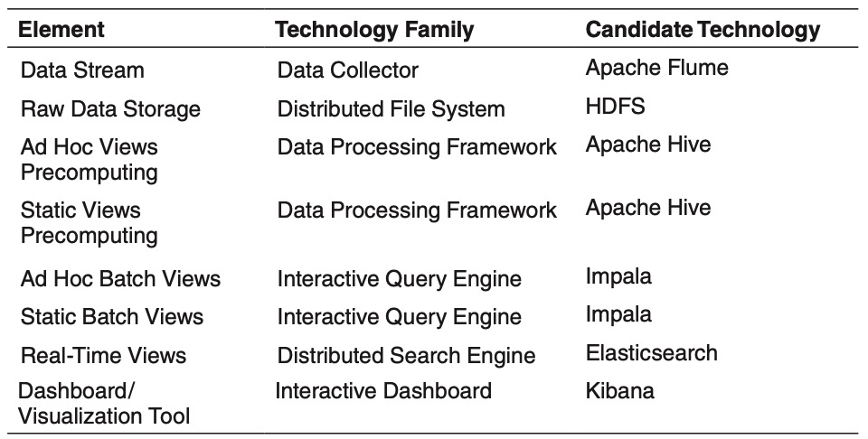

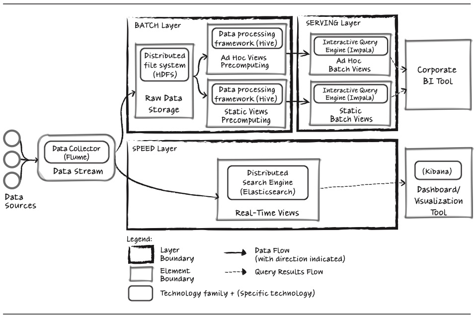

**FIGURE 5.6** Iteration 2 instantiation design decisions

> **图5.6** 迭代2实例化设计决策

The next table explains the relationships between elements based on the selected technologies:

> 下表解释了基于所选技术的元素之间的关系:

#### 5.3.3.6 Step 7: Perform Analysis of Current Design and Review Iteration Goal and Achievement lf Design Purpose

> 步骤7：执行当前设计的分析，并审查迭代的目标和实现设计目的

The following Kanban table summarizes the design progress and the decisions made during the iteration.

> 下面的看板表总结了迭代过程中的设计进度和决策。

Note that drivers that were completely addressed in the previous iteration are not shown.

> 注意，在之前的迭代中完全解决的驱动程序没有显示出来。

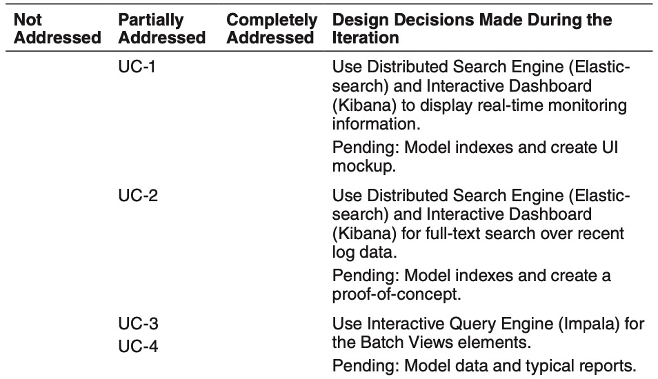

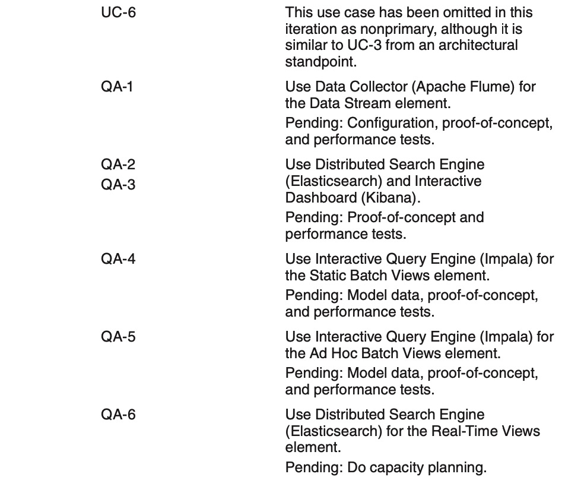

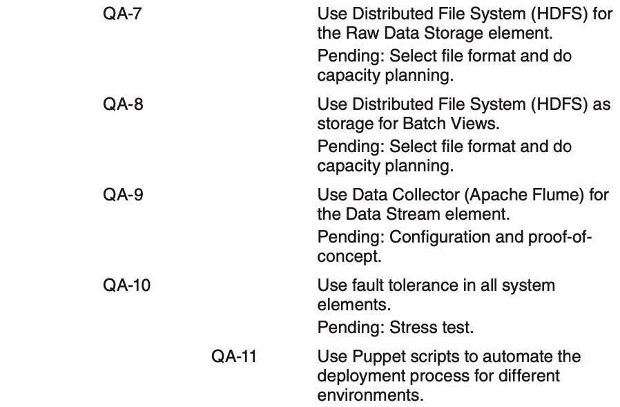

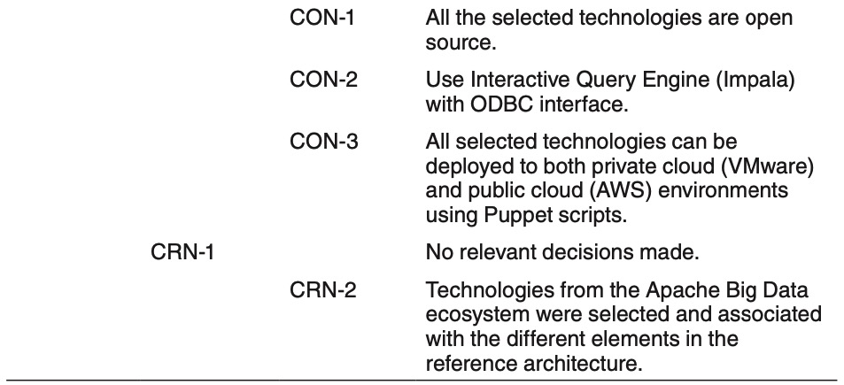

### 5.3.4 Iteration 3: Refinement of the Data Stream Element

> 迭代3：细化数据流元素

This section presents the results of the activities that are performed in each of the steps of ADD for the third iteration of the design process.

> 本部分展示了在设计过程的第三次迭代的 ADD 的每个步骤中执行的活动的结果。

---

Some design decisions made in this iteration require the creation of a proof-of-concept prototype, as they cannot be addressed in a purely-完全地,纯粹地 conceptual manner.

> 在此迭代中做出的一些设计决策需要创建概念验证原型，因为它们不能以纯粹的概念方式解决。

Given that the Big Data field is young and technologies are rapidly-快速地,迅速地 evolving, proofs-of-concepts of key elements are necessary to mitigate technology risks (e.g., incompatibility, slow performance, unsatisfactory reliability, limitations of claimed features) and to have the option to switch to an alternative early in the design and development process, thereby saving overall time and budget by avoiding later rework.

> 考虑到大数据领域还很年轻，技术正在迅速发展，关键要素的概念验证对于降低技术风险(例如，不兼容、性能缓慢、可靠性不理想、所声称的功能的限制)以及在设计和开发过程的早期选择切换到替代方案是必要的，从而通过避免后期返工节省总体时间和预算。

#### 5.3.4.1 Step 2: Establish the Iteration Goal by Selecting Drivers

The goal of this iteration is to address several concerns associated with the selection of Apache Flume, as the technology to be used for the Data Collector element.

> 这次迭代的目标是解决与选择 Apache Flume 相关的几个问题，作为 Data Collector 元素要使用的技术。

Apache Flume provides a reference structure—a data-flow model—depicted in the informal diagram shown in Figure 5.7.

> Apache Flume 提供了一个参考结构 —— 一个数据流模型 —— 如**图5.7**所示的非正式图表所示。

The elements in Flume’s structure include:

- The source: consumes events delivered to it by external data sources such as web servers

  > 源：使用由外部数据源(如web服务器)交付给它的事件

- The channel: stores events received by the source

  > 通道：存储源接收到的事件

- The sink: removes events from the channel and puts them in an external repository (i.e., destination)

  > 接收器：从通道中删除事件，并将其放入外部存储库(即目的地)。

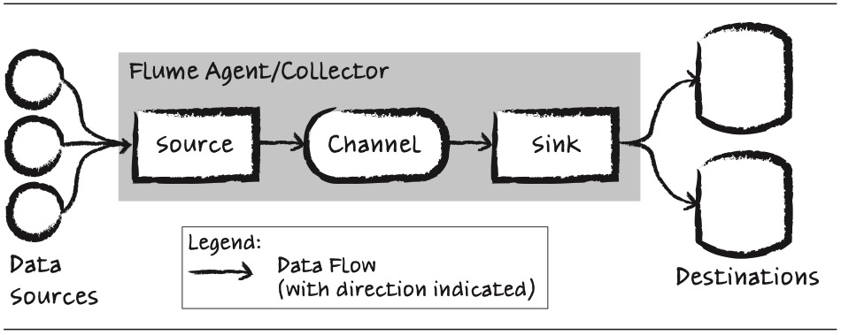

**FIGURE 5.7** Apache Flume data-flow reference structure

> 图5.7 Apache Flume数据流引用结构

---

The selection of Apache Flume raises several specific architectural concerns that need to be addressed:

> Apache Flume 的选择提出了几个需要解决的特定架构问题:

- Selecting a mechanism for getting data from the external sources

  > 选择从外部源获取数据的机制

- Selecting specific input formats in the Source element

  > 在 Source 元素中选择特定的输入格式

- Selecting a file data format in which to store the events

  > 选择用于存储事件的文件数据格式

- Selecting a mechanism for the channeling events in the channel

  > 为通道中的通道事件选择机制

- Establishing a deployment topology for the Data Source elements

  > 为数据源元素建立部署拓扑

Addressing these specific architectural concerns will contribute-做贡献,有助于 to the satisfaction of the following quality attributes:

> 解决这些特定的架构问题将有助于满足以下质量属性:

- QA-1 (Performance)
- QA-7 (Scalability)
- QA-9 (Extensibility)
- QA-10 (Availability)

#### 5.3.4.2 Step 3: Choose One or More Elements of the System to Refine

> 步骤3：选择一个或多个要完善的系统元素

In this iteration, the focus is on the elements in Flume’s structure.

> 在这个迭代中，重点是 Flume 结构中的元素。

#### 5.3.4.3 Step 4: Choose One or More Design Concepts That Satisfy the Selected Drivers

> 步骤4：选择一个或多个满足选定驱动程序的设计概念

In this iteration most of the decisions are about instantiation, since they primarily involve configuring the elements that are already established by Flume.

> 在这个迭代中，大多数决策都是关于实例化的，因为它们主要涉及配置 Flume 已经建立的元素。

The only selection design decision involves choosing tactics to satisfy the availability and performance quality attributes.

> 唯一的选择设计决策涉及选择满足可用性和性能质量属性的策略。

---

**Design Decisions and Location**

Use Flume in agent/collector configuration.

> 在代理/收集器配置中使用 Flume。

Agents are co-located-同地协作 on the web servers, and the collector runs in the Data Stream element.

> 代理位于 web 服务器上，收集器在 Data Stream 元素中运行。

**Rationale and Assumptions**

A Flume instance can run in two modes: as an agent (directly co-located in the data sources) or as a collector (which combines data streams from multiple agents and writes to destinations).

> Flume 实例可以以两种模式运行：作为代理(直接位于数据源中)或作为收集器(将来自多个代理的数据流合并并写入目标)。

From these two modes, Flume can be used in different configurations.

> 从这两种模式中，Flume 可以在不同的配置中使用。

The decision is to use Flume in both agent and collector configuration: The agents are co-located with the data sources and the Collector runs in the Data Stream element.

> 我们决定在代理和收集器配置中都使用 Flume：代理与数据源位于同一位置，收集器在 Data Stream 元素中运行。

***Alternative***

Flume agents are on each web server and write events directly to sinks (no collectors)

> Flume 代理在每个 web 服务器上，并直接将事件写入接收器(没有收集器)。

***Reason for Discarding***

Generates heavy traffic from 300-plus simultaneous connections to sinks (HDFS and Elasticsearch).

> 从 300 多个并发连接到sink (HDFS和Elasticsearch)产生大量流量。

Produces multiple (per web server) files in HDFS, which is suboptimal for this distributed file system (rather than having larger files that aggregate data from multiple web servers).

> 在 HDFS 中生成多个(每个web服务器)文件，这对于分布式文件系统来说是次优的(而不是从多个web服务器聚合数据的更大的文件)。

***Alternative***

Flume collectors receive events directly from web servers (no agents) and write to sinks

> Flume 收集器直接从 web 服务器(没有代理)接收事件并写入接收器

***Reason for Discarding***

Does not support failover-故障切换 mode. If a collector node fails, the connected web servers will lose a receiver.

> 不支持故障切换模式。如果一个采集器节点故障，连接的 web 服务器将失去一个接收器。

---

**Design Decisions and Location**

Introduce the tactic of “maintaining multiples copies of computations” by using a load-balanced, failover tiered-阶梯式的,分层的 configuration

> 通过使用负载均衡、故障转移分层配置，引入“维护多个计算副本”的策略

**Rationale and Assumptions**

**Out of**-从…中选出 the possible topology alternatives, the selected one is a load-balanced and failover tiered topology based on performance (QA-1, 15,000 events/second) and availability (QA-10, no single point of failure) quality attribute scenarios.

> 在可能的拓扑替代方案中，选择的拓扑是基于性能(QA-1, 15,000个事件/秒)和可用性(QA-10，无单点故障)质量属性场景的负载平衡和故障转移分层拓扑。

***Alternative***

Not replicating the collector

> 没有复制收集器

***Reason for Discarding***

This would decrease performance and availability.

> 这将降低性能和可用性。

---

#### 5.3.4.4 Step 5: Instantiate Architectural Elements, Allocate Responsibilities, and Define Interfaces

The instantiation design decisions made in this iteration are summarized in the following table:

> 在此迭代中做出的实例化设计决策总结如下表:

---

**Design Decisions and Location**

Use access and error logs from the Apache HTTP Server as input formats

> 使用来自 Apache HTTP Server 的访问和错误日志作为输入格式

**Rationale and Assumptions**

The system requirements include the collection and analysis of logs such as web server load, user activities, and errors.

> 系统需求包括 web 服务器负载、用户活动和错误等日志的收集和分析。

In reality, there could be tens (and sometimes hundreds) of data source types.

> 实际上，可能有几十种(有时是数百种)数据源类型。

For the development of the proof-of-concept, a single type of data source system is considered: an Apache HTTP server (“web server”).

> 对于概念验证的开发，考虑了单一类型的数据源系统：Apache HTTP服务器(“web服务器”)。

The data to be collected includes user activities that will be tracked through an access log and system errors through an error log.

> 要收集的数据包括将通过访问日志跟踪的用户活动和通过错误日志跟踪的系统错误。

The web server access log records all requests processed by the server.

> web 服务器访问日志记录了服务器处理的所有请求。

A log entry might look like this: 143.21.52.246 - - [19/Jun/2014:12:15:17+0000] "GET /test.html HTTP/1.1" 200 341 "-" "Mozilla/5.0 (X11; Linux x86_64; rv:6.0a1) Gecko/20110421 Firefox/6.0a1".

This example consists of the following data fields: client IP address, client identity, user ID, time stamp, request method, request URL, request protocol, response code, response size, referrer, user agent.

> 该示例由以下数据字段组成：客户端IP地址、客户端标识、用户ID、时间戳、请求方法、请求URL、请求协议、响应代码、响应大小、引用者、用户代理。

The web server error log sends diagnostic-诊断的,判断的 information and records any errors that it encounters when processing user requests.

> web 服务器错误日志发送诊断信息，记录处理用户请求时遇到的任何错误。 

For example: [19/Jun/2014:14:23:15 +0000] [error] [client 50.83.180.156] Directory index forbidden by rule: /home/httpd/

This example consists of the following data fields: time stamp, severity level, client IP address, message.

> 此示例由以下数据字段组成：时间戳、严重级别、客户端IP地址、消息。

Further data modeling and technology configuration will be based on these two types of logs and the described fields.

> 进一步的数据建模和技术配置将基于这两种类型的日志和所描述的字段。

---

**Design Decisions and Location**

Log files are piped through an IP port in the source element of Flume agent

> 日志文件通过 Flume 代理的 source 元素中的 IP 端口进行管道传输

**Rationale and Assumptions**

Apache Flume is configured to pipe log data through an IP port, such as by using syslog.

> Apache Flume 配置为通过IP端口传输日志数据，例如使用 syslog。

***Alternative***

Read from a log file (e.g., running the UNIX command tail -F access_log)

> 从日志文件中读取(例如，运行 UNIX 命令 tail -F access_log)

***Reason for Discarding***

This option looks the simplest but does not guarantee event delivery (events can be lost), which is stated in the Flume user guide.

> 这个选项看起来是最简单的，但不能保证事件交付(事件可能会丢失)，这在 Flume 用户指南中有说明。

---

**Design Decisions and Location**

Identify event channeling methods for both the agents and the collector; make final decision through prototyping

> 确定代理和收集器的事件通道方法：通过原型制作做出最终决定

**Rationale and Assumptions**

The ingested-摄取,吸收 events from the Source element are staged in the Channel element.

> 从 Source 元素摄取的事件在 Channel 元素中存放。

At the moment Flume offers three possible options to configure the channel:

> 目前 Flume 提供了三种配置通道的选项:

1. Memory channel: in-memory queue; faster, but if any events are left in the memory queue when a Flume process dies, they cannot be recovered.

   > 内存通道：内存队列；更快，但是如果 Flume 进程死亡时在内存队列中留下任何事件，则无法恢复它们。

2. File channel: durable-持久的,耐用的 and backed up by the local file system.

   > 文件通道：持久通道，由本地文件系统备份。

3. Apache Kafka: an approach in which Kafka serves as a distributed and highly available channel.

   > Apache Kafka：一种将 Kafka 作为分布式和高可用通道的方法。

The selection from these options actually is a “classic” tradeoff of performance versus availability (or what is sometimes termed-把…称作 durability).

> 从这些选项中进行选择实际上是性能与可用性(有时称为持久性)之间的“经典”权衡。

Although we do not have an explicit durability scenario, we understand that with the future system extension (UC-6, security reports), this requirement becomes more critical.

> 虽然我们没有明确的持久性场景，但我们知道，随着未来的系统扩展(UC-6，安全报告)，这个需求将变得更加关键。

This is an example of an architectural concern, in the sense that it does not appear in any requirements document, but the architect has to deal with it nonetheless-然而,尽管如此.

> 这是架构关注的一个例子，因为它没有出现在任何需求文档中，但是架构师必须处理它。

Given these options and no publicly available information about the performance consequences, this is a good candidate for prototyping and making a decision based on the results.

> 考虑到这些选项，并且没有关于性能结果的公开信息，这是原型设计和基于结果做出决策的好选择。

Another rationale for prototyping and performance measurement is the need to calculate the required hardware resources.

> 原型和性能度量的另一个基本原理是需要计算所需的硬件资源。

As a consequence, a new concern is identified and added to the backlog:

> 因此，一个新的关注点被识别并添加到待办事项列表中:

- CRN-3: Data modeling and developing proof-of-concept prototypes for key system elements

  > CRN-3：数据建模和开发关键系统元素的概念验证原型

---

**Design Decisions and Location**

Select Avro as a specific file format for storing raw data in the HDFS sink

> 选择 Avro 作为在 HDFS sink 中存储原始数据的特定文件格式

**Rationale and Assumptions**

One decision that needs to be made when designing a solution based on Hadoop is the selection of an optimal file format. 

> 在设计基于Hadoop的解决方案时，需要做出的一个决定是选择最佳文件格式。

Hadoop supports a variety of formats that provide different functionalities, compression, and performance results depending on stored data and usage scenarios.

> Hadoop 支持多种格式，根据存储的数据和使用场景提供不同的功能、压缩和性能结果。

In this case the main scenarios are related to quality attributes such as performance (QA-1, 15,000 events/ second), scalability (QA-7, approximately 60 TB of raw data), and extensibility (QA-9, adding new data sources).

> 在这种情况下，主要场景与质量属性相关，例如性能(QA-1, 15,000个事件/秒)、可伸缩性(QA-7，大约60 TB的原始数据)和可扩展性(QA-9，添加新数据源)。

When we translate these requirements to file format traits-特征,特点, they will be impacted by performance (how fast data can be pushed by the Data Stream), a compression-压缩 factor (less space to store), and ease of schema evolution (when adding new log formats or changing existing ones).

> 当我们将这些需求转换为文件格式特征时，它们将受到性能(数据流推送数据的速度有多快)、压缩因子(更少的存储空间)和模式演化的便利性(添加新日志格式或更改现有日志格式时)的影响。

We select Avro, as it supports rich data structures, provides good compression levels (with the Snappy compression codec), and is flexible enough to accommodate-适应 schema changes (employing a self-describing format where data is stored with its schema).

> 我们选择 Avro，因为它支持丰富的数据结构，提供良好的压缩级别(使用Snappy压缩编解码器)，并且足够灵活以适应模式更改(采用自描述格式，其中数据与模式一起存储)。

***Alternative***

Text file (plain text, CSV, XML, JSON)

***Reason for Discarding***

The compression ratio is poor compared with binary file formats (e.g., Avro).

> 与二进制文件格式(如Avro)相比，压缩比较差。

Also, text files do not support block compression, which is necessary when storing files larger than the size of an HDFS block.

> 此外，文本文件不支持块压缩，这在存储大于HDFS块大小的文件时是必要的。

***Alternative***

SequenceFile

**Reason for Discarding**

Does not support flexible schema evolution. Consists of binary key/value pairs and does not store metadata with the data.

> 不支持灵活的模式演化。由二进制键/值对组成，不随数据存储元数据。

***Alternative***

RCFile

**Reason for Discarding**

This Hadoop columnar-列 file format does not support schema evolution, and writing requires more CPU and memory compared with non-columnar formats.

> 这种 Hadoop 列文件格式不支持模式演变，与非列文件格式相比，写入文件需要更多的CPU和内存。

***Alternative***

ORCFile

**Reason for Discarding**

Optimized RCFile provides better compression and faster querying, but has the same drawbacks-缺点 as RCFile in terms of schema evolution, at the expense of writing performance.

> 优化后的 RCFile 提供了更好的压缩和更快的查询，但在模式演变方面与 RCFile 有相同的缺点，以牺牲写性能为代价。

***Alternative***

Parquet

**Reason for Discarding**

Parquet is a columnar file format that partially supports schema evolution, but still is slower for write operations compared with non-columnar file formats.

> Parquet是一种列文件格式，它部分支持模式演变，但与非列文件格式相比，写操作仍然较慢。

---

#### 5.3.4.5 Step 6: Sketch Views and Record Design Decisions

> 步骤6：草图视图和记录设计决策

Figure 5.8 illustrates the result of the instantiation decisions.

| Element         | Responsibility                                               |
| --------------- | ------------------------------------------------------------ |
| Flume agent     | Consume log events generated by a web server, split text log entries to separate fields, and deliver the parsed event records to a collector. |
| Flume collector | Collect event records from multiple agents in a load-balanced and fault-tolerant-容错的 manner and deliver them to destinations (HDFS and Elasticsearch) for further persistency and processing. |

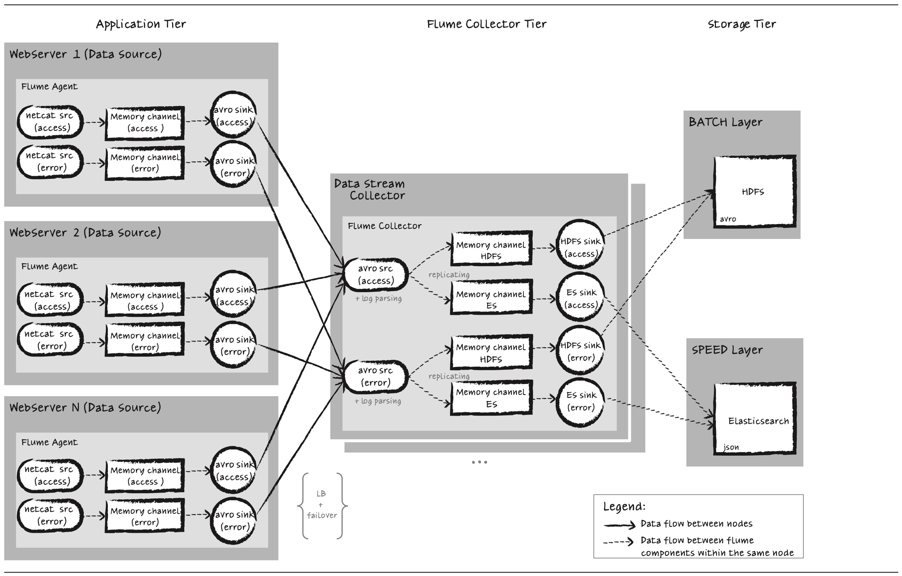

**FIGURE 5.8** Iteration 3 instantiation design decisions

> **图5.8** 迭代3 实例化设计决策

#### 5.3.4.6 Step 7: Perform Analysis of Current Design and Review Iteration Goal and Achievement of Design Purpose

The following Kanban table summarizes the design progress and the decisions made during the iteration. 

Note that drivers that were completely addressed in the previous iteration are not shown.

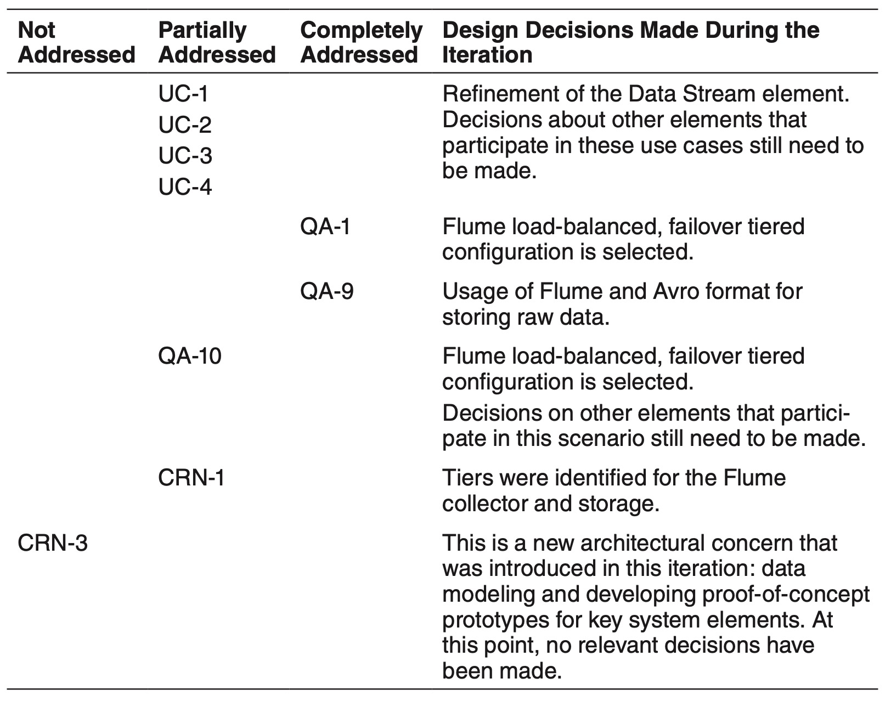

### 5.3.5 Iteration 4: Refinement of the Serving Layer

> 迭代4：服务层的细化

We now present the results of the activities that are performed in each of the steps of ADD in the fourth iteration of the design process.

> 我们现在展示了在设计过程的第四次迭代中ADD的每个步骤中执行的活动的结果。

We selected the Serving Layer for refinement (not the Batch Layer) because the risk of not achieving requirements is higher for this layer.

> 我们选择了服务层进行细化(而不是批处理层)，因为该层没有实现需求的风险更高。

This layer is directly involved in use cases UC-3 and UC-4 and a number of quality attribute scenarios in which performance and scalability are critical factors.

> 这一层直接涉及用例 UC-3 和 UC-4，以及许多质量属性场景，其中性能和可伸缩性是关键因素。

As in the previous iteration, design activities involve the creation of prototypes.

> 在之前的迭代中，设计活动包括原型的创建。

In this iteration, UI prototypes are also created.

> 在这个迭代中，还创建了UI原型。

There are at least two reasons for this:

> 这至少有两个原因:

- It will facilitate receiving early feedback from users, which can help to update requirements.

  > 它将有助于接收来自用户的早期反馈，这有助于更新需求。

- Data visualization scenarios often have an influence on data modeling.

  > 数据可视化场景通常会对数据建模产生影响。

#### 5.3.5.1 Step 2: Establish the Iteration Goal by Selecting Drivers

The goal of this iteration is to address the newly identified concern of data modeling and developing proof-of-concept prototypes for key system elements (CRN-3) so as to satisfy the primary use cases and system requirements associated with the analysis and visualization of historic data.

> 此迭代的目标是处理新确定的数据建模和开发关键系统元素(CRN-3)的概念验证原型的问题，以便满足与历史数据的分析和可视化相关的主要用例和系统需求。

These use cases include:

- UC-3
- UC-4

The quality attribute scenarios associated with these use cases are:

- QA-4 (Performance)
- QA-5 (Performance)
- QA-7 (Scalability)
- QA-8 (Scalability)

#### 5.3.5.2 Step 3: Choose One or More Elements of the System to Refine

In this iteration, the elements that are refined are the ones that support historical data, which include the Serving Layer elements: 

> 在这个迭代中，被细化的元素是那些支持历史数据的元素，包括服务层元素:

the Ad Hoc and Static Batch Views.

> 特别的和静态批处理视图。

Given that both types of elements use the same technology (Impala), the decisions made in this iteration affect both types of elements.

> 假设两种类型的元素使用相同的技术(**Impala**)，那么在此迭代中所做的决策会影响两种类型的元素。

#### 5.3.5.3 Step 4: Choose One or More Design Concepts That Satisfy the Selected Drivers

As in the previous iteration, the design activities here involve the configuration of the technologies that were associated with the elements.

> 与之前的迭代一样，这里的设计活动涉及与元素相关联的技术的配置。

For this reason, no new design concepts are selected and all of the decisions belong to the instantiation category.

> 由于这个原因，没有选择新的设计概念，所有的决策都属于实例化类别。

#### 5.3.5.4 Step 5: Instantiate Architectural Elements, Allocate Responsibilities, and Define Interfaces

In this iteration, design concepts are instantiated based on the best practices of using the chosen technologies.

> 在这个迭代中，设计概念是基于使用所选技术的最佳实践实例化的。

---

**Design Decisions and Location**

Select Parquet as a file format for Impala in the Batch Views

> 在批处理视图中选择 Parquet 作为 Impala 的文件格式

**Rationale and Assumptions**

The decision-making process for selecting a file format for Batch Views is similar to that in the previous iteration, where we selected a format for raw data storage.

> 为批处理视图选择文件格式的决策过程类似于之前的迭代，我们为原始数据存储选择了一种格式。

The data usage scenario is somewhat-稍微,有些 different, however-然而,可是.

> 然而，数据使用场景有些不同。

The previous case was about fast writing, effectively storing data, and extending data formats.

> 前一个案例是关于快速写入、有效存储数据和扩展数据格式的。

This case is focused on fast querying (QA-4, less than 5 seconds report load; QA-5, less than 2 minutes ad hoc query execution time), although scalability (QA-8, approximately 90 TB of aggregated data) and extensibility (QA-9, adding new data sources) drivers are still relevant.

> 本案例重点关注快速查询(QA-4，少于5秒的报表加载；尽管可伸缩性(QA-8，大约90 TB的聚合数据)和可扩展性(QA-9，添加新数据源)驱动程序仍然相关，但QA-5，临时查询执行时间少于2分钟)。

Out of all the available alternatives, the Parquet file format looks like the most promising option to satisfy these requirements.

> 在所有可用的替代方案中，Parquet 文件格式看起来是满足这些需求的最有希望的选择。

In Parquet, a columnar structure represents relational tables on computer clusters and is designed for fast query processing, which is important for ad hoc data exploration-研究,探究 and static reports.

> 在 Parquet 中，列结构表示计算机集群上的关系表，并设计用于快速查询处理，这对于临时数据探索和静态报表非常重要。

In addition, Parquet is optimized for Impala, which we selected as a primary technology for the interactive query engine during the second iteration.

> 此外，Parquet 针对 Impala 进行了优化，我们在第二次迭代中选择 Impala 作为交互式查询引擎的主要技术。

Finally, it provides a good compression ratio and allows some schema extension, by adding new columns at the end of the structure.

> 最后，通过在结构的末尾添加新列，它提供了良好的压缩比，并允许进行一些模式扩展。

***Alternative***

Text file (plain text, CSV, XML, JSON)

***Reason for Discarding***

Slow for reads, especially when querying individual columns.

> 读取速度慢，特别是在查询单个列时。

Also does not support block compression, which is necessary when storing files larger than the size of an HDFS block.

> 也不支持块压缩，这在存储大于HDFS块大小的文件时是必需的。

***Alternative***

SequenceFile

***Reason for Discarding***

Slow for reads, especially when querying individual columns.

> 读取速度慢，特别是在查询单个列时。

***Alternative***

RCFile

***Reason for Discarding***

The first columnar file format adopted in Hadoop. Does not support schema evolution.

> Hadoop中采用的第一种柱状文件格式。不支持模式进化。

***Alternative***

ORCFile

***Reason for Discarding***

Provides better compression and faster querying than RCFile, but has the same drawbacks-缺点 as RCFile in terms of schema evolution.

> 提供比 RCFile 更好的压缩和更快的查询，但在模式演变方面与 RCFile 有相同的缺点。

Compared-比较,对比 with Parquet, the compression ratio is better, but query performance is slower.

> 与 Parquet 相比，压缩比更好，但查询性能较慢。

Another major limitation is that it is not supported by Impala.

> 另一个主要限制是 Impala 不支持它。

***Alternative***

Avro

***Reason for Discarding***

Although Avro is considered the best multipurpose storage format for Hadoop, its query performance is noticeably-显著地,明显地 slower compared with columnar formats, such as RCFile, ORCFile, and Parquet.

> 虽然 Avro 被认为是 Hadoop 最好的多用途存储格式，但与RCFile、ORCFile和Parquet等柱状格式相比，它的查询性能明显要慢一些。

---

**Design Decisions and Location**

Use the star schema as a data model in the Batch Views

> 在批处理视图中使用星型架构作为数据模型

**Rationale and Assumptions**

In the previous iteration, we selected Impala as a single technology for the Batch Views components, which impacts both static reports (UC-3, 6) and ad hoc querying (UC-4).

> 在之前的迭代中，我们选择 Impala 作为批处理视图组件的单一技术，它同时影响静态报告(UC-3, 6)和临时查询(UC-4)。

The star schema technique was selected for two reasons:

> 选择星型模式技术有两个原因：

- Impala was designed for analytical queries, so it naturally provides good support for star schema data modeling.

  > Impala 是为分析查询而设计的，因此它自然为星型模式数据建模提供了良好的支持。

- Ad hoc querying in combination with BI tools requires data to be well modeled to simplify query complexity and, as a result, allow faster query performance.

  > 结合 BI 工具的特别查询需要对数据进行良好的建模，以简化查询的复杂性，从而实现更快的查询性能。

In our case, the star schema was designed to have small-dimension-尺寸小 (in terms of number of rows) tables to avoid joins between big tables, as this typically consumes large amounts of system resources and affects query execution performance.

> 在我们的示例中，星型模式被设计为具有小维(就行数而言)表，以避免大表之间的连接，因为这通常会消耗大量系统资源并影响查询执行性能。

Small-dimension tables can fit in memory and joins can be performed more effectively.

> 小维表可以放在内存中，并且可以更有效地执行连接。

***Alternative***

Flat-平的,平面的 tables

***Reason for Discarding***

Flat tables are typically represented in the format of wide denormalized tables that contain all measures and dimension attributes.

> 平面表通常以宽非规范化表的格式表示，其中包含所有度量和维度属性。

Flat tables can cause significant performance issues when querying against large volumes of data.

> 在查询大量数据时，扁平表可能会导致严重的性能问题。

---

#### 5.3.5.5 Step 6: Sketch Views and Record Design Decisions

Figure 5.9 depicts the star schema data model implemented using Impala and Parquet.

> **图5.9** 描述了使用 Impala 和 Parquet 实现的星型模式数据模型。

The screenshot-屏幕截图 in Figure 5.10 presents a sample static report implemented with Tableau to demonstrate a possible view through a corporate BI tool.

> **图5.10** 中的截图展示了一个用 Tableau 实现的静态报表示例，以演示通过企业BI工具实现的可能视图。

The report was created using test data stored in Parquet and provided by Impala through the ODBC interface.

> 该报告使用存储在 Parquet 中的测试数据创建，并由 Impala 通过 ODBC 接口提供。

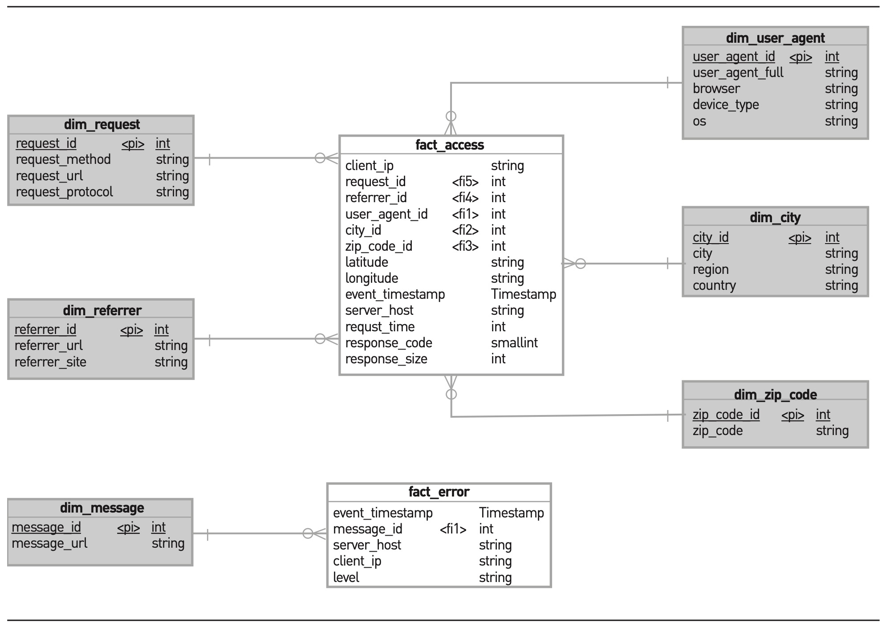

**FIGURE 5.9** Star schema implemented in Impala and Parquet

> **图5.9** 星型模式在 Impala 和 Parquet 中实现

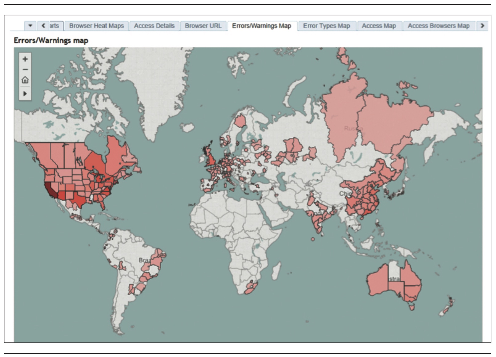

**FIGURE 5.10** Sample static report implemented with Tableau

> **图5.10** 用 Tableau 实现的静态报表示例

#### 5.3.5.6 Step 7: Perform Analysis of Current Design and Review Iteration Goal and Achievement of Design Purpose

The following Kanban table summarizes the design progress and the decisions made during the iteration.

> 下面的看板表总结了迭代过程中的设计进度和决策。

Note that drivers that were completely addressed in the previous iteration are not shown.

> 注意，在之前的迭代中完全寻址的驱动程序没有显示出来。

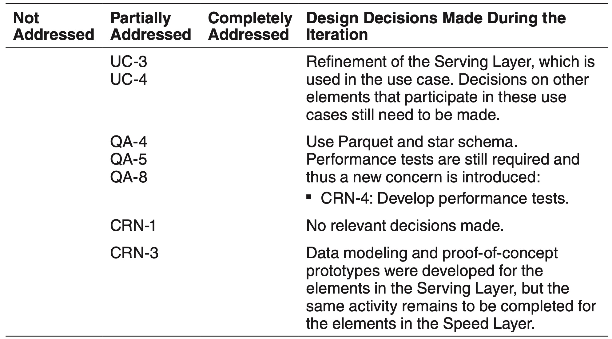

## 5.4 Summary

In this chapter we presented an extended example of using ADD 3.0 in a relatively novel domain, that of Big Data.

> 在本章中，我们展示了一个扩展的例子，在一个相对新颖的领域，即大数据中使用 ADD 3.0。

As this example shows, architectural design can require many detailed decisions to be made to ensure that the quality attributes will be satisfied.

> 正如这个例子所示，架构设计可能需要做出许多详细的决定，以确保满足质量属性。

---

Also, this example shows that a large number of decisions rely on knowledge of many different patterns and technologies.

> 此外，这个例子表明，大量的决策依赖于许多不同模式和技术的知识。

The more novel the domain, the more likely that preexisting-先前存在 information (e.g., design concepts catalog, books of patterns, and reference architectures) will not be available for it.

> 领域越新颖，先前存在的信息(例如，设计概念目录、模式书籍和参考体系结构)就越有可能无法用于该领域。

In such a case, you need to rely on your own judgment and experience, or you need to perform experiments and build prototypes.

> 在这种情况下，您需要依靠自己的判断和经验，或者您需要执行实验并构建原型。

**One way or another**-无论如何, such decisions must be made.

> 无论如何，必须做出这样的决定。

---

This instance of ADD also differed from the example presented in Chapter 4 in that we spent relatively little time and effort on building sequence diagrams as a means of deriving-衍生,派生 interface specifications.

> ADD 的这个实例也不同于第4章中的例子，因为我们花了相对较少的时间和精力来构建序列图，作为派生接口规范的一种方法。

The example presented here relied on a relatively simple data-flow architecture with a modest number of components, so sequence diagrams were not needed to understand the relationships between the components.

> 这里给出的示例依赖于一个相对简单的数据流体系结构，其中包含少量的组件，因此不需要序列图来理解组件之间的关系。

The “contracts” between the elements were determined by the information exchanged, as exemplified in step 5 of Iteration 3 (Section 5.3.4.4).

> 元素之间的“约束”由交换的信息决定，如迭代3的第5步(第5.3.4.4节)所示。

## 5.5 Further Reading

The design of a data warehouse has been extensively studied. Two good approaches are documented in R. Kimball and M. Ross, *The Data Warehouse Tool- kit,* 3rd ed., Wiley, 2013; and W. Inmon, *Building the Data Warehouse,* 4th ed., Wiley, 2005.

The Lambda architecture was first presented by N. Marz and J. Warren, *Big Data: Principles and Best Practices of Scalable Realtime Data Systems*, Man- ning, 2015.

A good discussion of how to engineer for scalability can be found in M. Ab- bott and M. Fisher, *The Art of Scalability: Scalable Web Architecture, Processes, and Organizations for the Modern Enterprise,* Addison-Wesley, 2010.

P. Sadalage and M. Fowler. *NoSQL Distilled: A Brief Guide to the Emerging World of Polyglot Persistence*, Addison-Wesley, 2009.

A discussion of how and when to prototype as part of the architecture design process can be found in H-M Chen, R. Kazman, and S. Haziyev, “Strategic Pro- totyping for Developing Big Data Systems”, *IEEE Software*, March/April 2016.

A design concepts catalog that includes many of the reference architectures and technologies used in this case study is part of the Smart Decisions Game, which can be found at H. Cervantes, S. Haziyev, O. Hrytsay, and R. Kazman, “Smart Decisions Game”, http://smartdecisionsgame.com.

