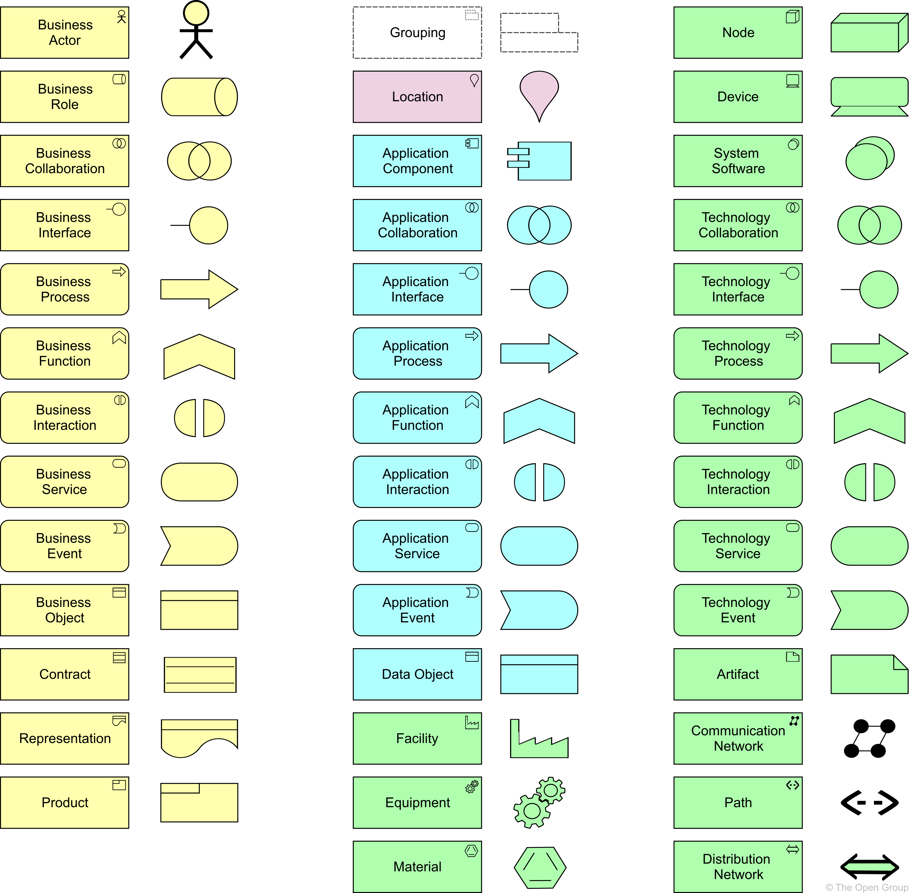
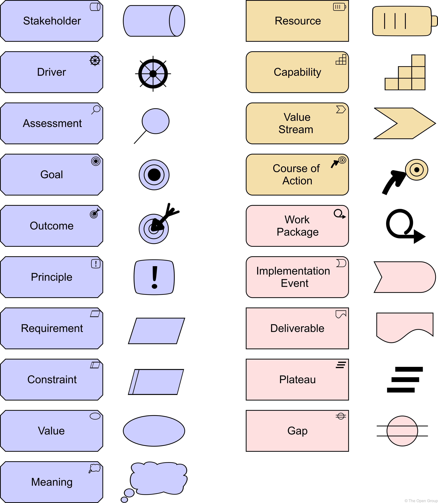
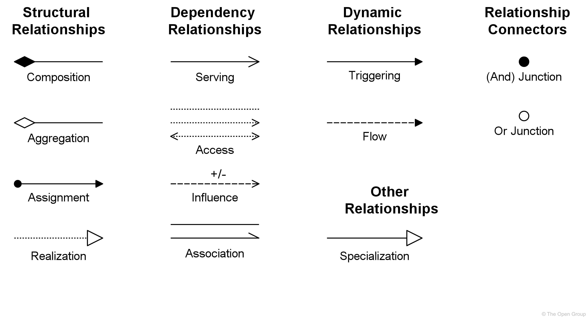

# Appendix A: Summary of Language Notation

> 语言符号概述

This appendix describes the default iconography of the ArchiMate language.

> 本附录描述了 ArchiMate 语言的默认图像。

Modelers can choose to use a different iconography on any diagram if it helps to communicate better with stakeholders. 

> 建模者可以选择在任何图表上使用不同的图像，如果它有助于与利益相关者更好地沟通。

However, it is recommended to use the default iconography so that teams using the ArchiMate language have a collective understanding of the view being developed.

> 但是，建议使用默认的图像，以便使用ArchiMate语言的团队对正在开发的视图有一个共同的理解。

Conforming-遵守,符合 tools shall at least support these notations.

> 符合标准的工具至少应该支持这些符号。

## A.1. Core Elements

> 核心元素

## A.2. Motivation, Strategy, Implementation and Migration Elements

> 动机、策略、实施和迁移要素

## A.3. Relationships and Relationship Connectors

> 关系和关系连接器

