# Chapter 10. Technology Layer

> 技术层

The Technology Layer elements are typically used to model the Technology Architecture of the enterprise, describing the structure and behavior of the technology infrastructure-基础设施,基础建设 of the enterprise.

> 技术层元素通常用于为企业的技术体系结构建模，描述企业的技术基础结构的结构和行为。

The physical elements are an extension to the Technology Layer for modeling the physical world.

> 物理元素是技术层的扩展，用于对物理世界进行建模。

They only include active and passive structure elements; no specific physical behavior elements are defined.

> 它们只包括主动和被动结构要素；没有定义特定的物理行为元素。

Physical technology elements can be combined with other technology elements (such as device) and be part of the same node, to model an integrated piece of operational and information technology.

> 物理技术元素可以与其他技术元素(如设备)组合在一起，并成为同一节点的一部分，以模拟操作技术和信息技术的集成部分。

## 10.1. Technology Layer Metamodel

> 技术层元模型

[Figure 82](https://pubs.opengroup.org/architecture/archimate3-doc/ch-Technology-Layer.html#fig-Technology-Layer-Metamodel) gives an overview of the Technology Layer elements and their relationships.

> [图82](https://pubs.opengroup.org/architecture/archimate3-doc/ch-Technology-Layer.html#fig-Technology-Layer-Metamodel) 给出了技术层元素及其关系的概述。

Whenever applicable-适用的,适当的, inspiration is drawn from the analogy-类比,比拟 with the Business and Application Layers.

> 只要适用，就从业务层和应用层的类比中汲取灵感。

In the following sections, several more elements will be introduced.

> 在下面几节中，将介绍更多的元素。

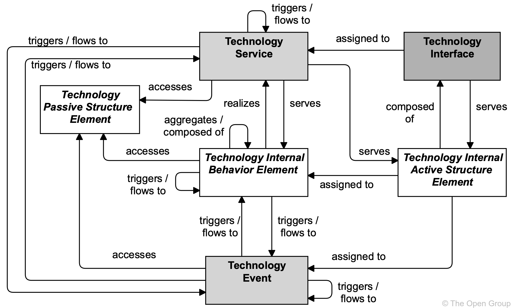

**Figure 82. Technology Layer Metamodel**

> 图82 技术层元模型

> [!NOTE]
>
> This figure does not show all permitted relationships; every element in the language can have composition, aggregation, and specialization relationships with elements of the same type.
>
> > 这个数字并没有显示所有允许的关系；语言中的每个元素都可以与相同类型的元素具有组合、聚合和专门化关系。
>
> Furthermore, there are indirect relationships that can be derived, as explained in [Section 5.7](https://pubs.opengroup.org/architecture/archimate3-doc/ch-Relationships-and-Relationship-Connectors.html#sec-Derivation-of-Relationships).
>
> > 此外，还可以推导出间接关系，如 [第5.7节](https://pubs.opengroup.org/architecture/archimate3-doc/ch-Relationships-and-Relationship-Connectors.html#sec-Derivation-of-Relationships) 所述。

## 10.2. Active Structure Elements

> 主动结构元素

The main active structure element for the Technology Layer is the *node*.

> 技术层的主要活动结构元素是节点。

This element is used to model structural entities in this layer.

> 此元素用于对该层中的结构实体进行建模。

It strictly-严格地 models the structural aspect of a system: its behavior is modeled by an explicit relationship to a behavior element.

> 它严格地为系统的结构方面建模：它的行为是通过与行为元素的显式关系来建模的。

A *technology interface* is the (logical) place where the technology services offered by a node can be accessed by other nodes or by application components from the Application Layer.

> 技术接口是一个节点提供的技术服务可以被其他节点或来自应用层的应用程序组件访问的(逻辑)位置。

Nodes can consist of information and technology elements modeled as *devices* and *system software*, and also of physical technology elements modeled as facilities-设施,设备 and equipment (see [Section 10.6](https://pubs.opengroup.org/architecture/archimate3-doc/ch-Technology-Layer.html#sec-Physical-Active-Structure-Elements)).

> 节点可以由建模为*设备*和*系统软件*的信息和技术元素组成，也可以由建模为设施和设备的物理技术元素组成(参见[10.6节](https://pubs.opengroup.org/architecture/archimate3-doc/ch-Technology-Layer.html#sec-Physical-Active-Structure-Elements))。

A *device* models a physical computational resource, upon which artifacts may be deployed for execution.

> 设备对物理计算资源进行建模，工件可以在其上部署以执行。

*System software* is an infrastructural software component running on a device.

> **系统软件**是运行在设备上的基础软件组件。

Typically, a node consists of a number of sub-nodes; for example, a device such as a server and system software to model the operating system.

> 通常，一个节点由许多子节点组成；例如，一个设备，如服务器和系统软件来模拟操作系统。

The inter-relationships of components in the Technology Layer are mainly formed-形成,构成 by the communication infrastructure.

> 技术层组件之间的相互关系主要由通信基础设施构成。

The *path* models the relation between two or more technology internal active structure elements, through which these can exchange-交换,互换 information.

> 路径对两个或多个技术内部活动结构元素之间的关系进行建模，通过这些元素可以交换信息。

The physical realization of a path is modeled with a *communication* *network*; i.e., a physical communication medium between two or more devices (or other networks).

> 路径的物理实现用通信网络建模；即，两个或多个设备(或其他网络)之间的物理通信介质。

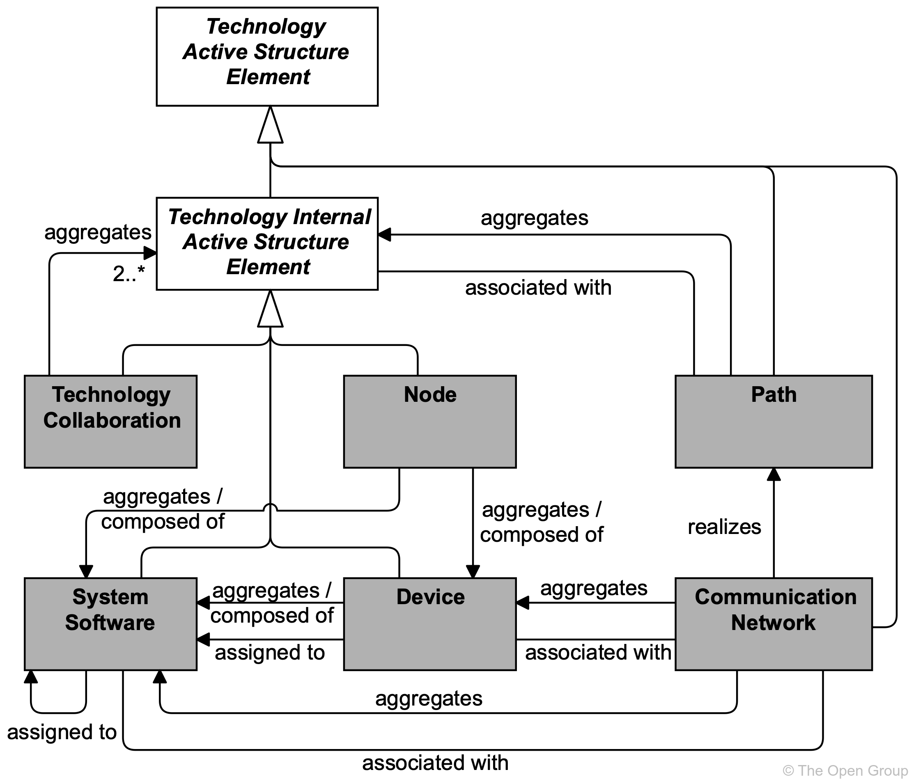

**Figure 83. Technology Active Structure Elements**

> 图83 技术主动结构元素

> [!NOTE]
>
> This figure does not show all permitted relationships; every element in the language can have composition, aggregation, and specialization relationships with elements of the same type.
>
> > 这个数字并没有显示所有允许的关系；语言中的每个元素都可以与相同类型的元素具有组合、聚合和专门化关系。
>
> Furthermore, there are indirect relationships that can be derived, as explained in [Section 5.7](https://pubs.opengroup.org/architecture/archimate3-doc/ch-Relationships-and-Relationship-Connectors.html#sec-Derivation-of-Relationships).
>
> > 此外，还可以推导出间接关系，如 [第5.7节](https://pubs.opengroup.org/architecture/archimate3-doc/ch-Relationships-and-Relationship-Connectors.html#sec-Derivation-of-Relationships) 所述。

### 10.2.1. Node

> 节点

A node represents a computational or physical resource that hosts, manipulates-操纵,操作, or interacts with other computational or physical resources.

> 节点表示承载、操作或与其他计算或物理资源交互的计算或物理资源。

Nodes are active structure elements that perform technology behavior and execute, store, and process artifacts or materials.

> 节点是执行技术行为和执行、存储和处理工件或材料的活动结构元素。

For instance, nodes are used to model application platforms, defined by the TOGAF framework [[4](https://pubs.opengroup.org/architecture/archimate3-doc/ch-Referenced-docs.html#Ref4)] as: “*a collection of technology components of hardware and software that provide the services used to support applications*”.

> 例如，节点用于为应用程序平台建模，由TOGAF框架[[4](https://pubs.opengroup.org/architecture/archimate3-doc/ch-Referenced-docs.html#Ref4)])定义为:“*提供用于支持应用程序的服务的硬件和软件的技术组件的集合*”。

Nodes can be interconnected-互相联系 by paths and may be assigned to an artifact to model that the artifact is deployed on the node.

> 节点可以通过路径相互连接，并且可以分配给工件来建模工件部署在节点上。

The name of a node should preferably be a noun.

> 节点的名称最好是名词。

A node may consist of sub-nodes.

> 一个节点可以由子节点组成。

Artifacts deployed on a node may either be drawn inside the node or connected to it with an assignment relationship.

> 部署在节点上的构件可以在节点内部绘制，也可以通过分配关系连接到节点。

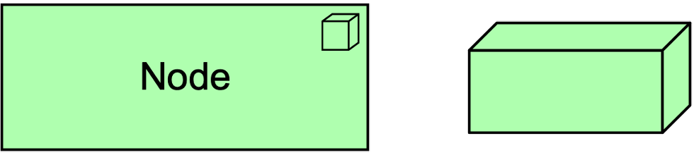

**Figure 84. Node Notation**

> 图84 节点符号

### 10.2.2. Device

> 设备

A device represents a physical IT resource upon which system software and artifacts may be stored or deployed for execution.

> 设备代表物理IT资源，系统软件和工件可以在其上存储或部署以执行。

A device represents a physical IT resource with processing capability.

> 设备代表一个具有处理能力的物理IT资源。

It is typically used to model hardware systems such as mainframes-主机,大型机, PCs, smartphones, or routers.

> 它通常用于建模硬件系统，如大型机、pc、智能手机或路由器。

It can also be used to model virtualized hardware, e.g., in an IaaS environment.

> 它还可以用于模拟虚拟化硬件，例如在IaaS环境中。

Usually, devices are part of a node together with system software.

> 通常，设备和系统软件都是节点的一部分。

Devices may be composite-合成的,复合的; i.e., consist of sub-devices.

> 器件可以是复合的；即，由子设备组成。

Devices can be interconnected-相互连接 by communication networks as well as being assigned to artifacts and to system software, to model deployment on that device.

> 设备可以通过通信网络相互连接，也可以分配给工件和系统软件，以便对该设备上的部署进行建模。

A node can contain one or more devices.

> 一个节点可以包含一个或多个设备。

The name of a device should preferably be a noun phrase referring to the type of hardware; e.g., “IBM System z mainframe-主机,大型机”.

> 设备的名称最好是指代硬件类型的名词短语；例如，“IBM System z大型机”。

**Figure 85. Device Notation**

> 图85 设备符号

### 10.2.3. System Software

> 系统软件

System software represents software that provides or contributes to an environment for storing, executing, and using software or data deployed within it.

> 系统软件表示提供或有助于存储、执行和使用部署在其中的软件或数据的环境的软件。

System software is used to model the software environment in which artifacts run.

> 系统软件用于对工件运行的软件环境进行建模。

This can be, an operating system, a JEE application server, a database system, or a workflow engine.

> 它可以是操作系统、JEE应用服务器、数据库系统或工作流引擎。

System software can also be used to represent communication middleware.

> 系统软件也可以用来表示通信中间件。

Usually, system software is combined with a device representing the hardware environment to form-形成,构成 a general-总体的，普遍的 node.

> 通常，系统软件与代表硬件环境的设备相结合，形成一个总节点。

A device or system software can be assigned to other system software; e.g., to model different layers of software running on top of each other.

> 一个设备或系统软件可以分配给其他系统软件；例如，对运行在彼此之上的不同软件层进行建模。

System software can be assigned to artifacts to model that these artifacts are deployed on that software and can realize other system software.

> 可以将系统软件分配给工件，以建模这些工件部署在该软件上，并且可以实现其他系统软件。

A node can be composed of or aggregate-集合,聚集 system software.

> 节点可以由系统软件组成，也可以是系统软件的集合。

The name of system software should preferably be a noun referring to the type of execution environment; e.g., “JEE server”. 

> 系统软件的名称最好是指代执行环境类型的名词；例如，“JEE服务器”。

System software may be composed of other system software; e.g., an operating system containing a database.

> 系统软件可以由其他系统软件组成；例如，包含数据库的操作系统。

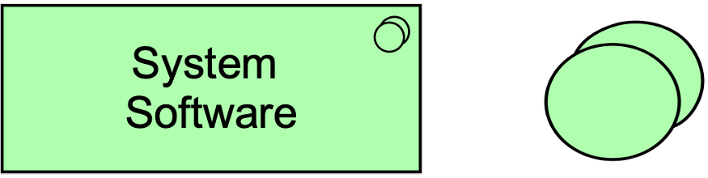

**Figure 86. System Software Notation**

> 图86 系统软件符号

### 10.2.4. Technology Collaboration

> 技术协作

A technology collaboration represents an aggregate of two or more technology internal active structure elements that work together to perform collective technology behavior.

> 技术协作表示两个或多个技术内部活动结构元素的集合，这些元素一起工作以执行集体技术行为。

A technology collaboration specifies which technology internal active structure elements and/or other technology collaborations cooperate to perform some task.

> 技术协作指定了哪些技术内部活动结构元素和/或其他技术协作来执行某些任务。

The collaborative behavior, including the communication pattern of these elements, is modeled by a technology interaction.

> 协作行为，包括这些元素的通信模式，由技术交互建模。

A technology collaboration typically models a logical or temporary collaboration of technology internal active structure elements and does not exist as a separate entity in the enterprise.

> 技术协作通常是对技术内部活动结构元素的逻辑或临时协作进行建模，而不是作为企业中的独立实体存在。

Technology collaboration is a specialization of technology internal active structure element, and aggregates two or more (cooperating) technology internal active structure elements.

> 技术协作是技术内部活动结构要素的专业化，是两个或两个以上(合作的)技术内部活动结构要素的聚合。

A technology collaboration is an internal active structure element that may be assigned to one or more technology interactions, or to other technology internal behavior elements that model the associated behavior.

> 技术协作是一个内部活动结构元素，它可以分配给一个或多个技术交互，或者分配给其他技术内部行为元素，这些技术内部行为元素对相关行为进行建模。

A technology interface may serve a technology collaboration, and a technology collaboration may be composed of technology interfaces.

> 技术接口可以为技术协作服务，技术协作可以由技术接口组成。

The name of a technology collaboration should preferably be a noun.

> 技术合作的名称最好是名词。

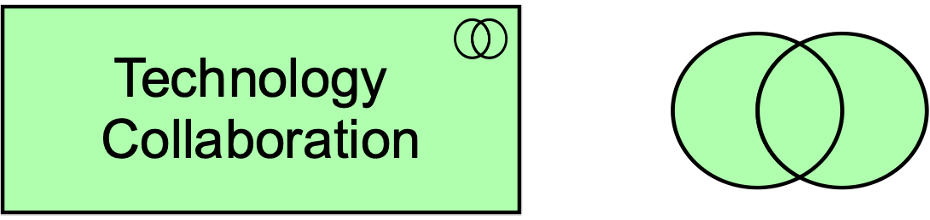

**Figure 87. Technology Collaboration Notation**

> 图87 技术协作符号

### 10.2.5. Technology Interface

> 技术接口

A technology interface represents a point of access where technology services offered by a technology internal active structure element can be accessed.

> 技术接口表示可以访问技术内部活动结构元素提供的技术服务的访问点。

A technology interface specifies how the technology services of a technology internal active structure element can be accessed by other elements.

> 技术接口指定了技术内部活动结构元素的技术服务如何被其他元素访问。

A technology interface exposes a technology service to the environment.

> 技术接口向环境公开技术服务。

The same service may be exposed through different interfaces.

> 相同的服务可以通过不同的接口公开。

In a sense, a technology interface specifies a kind of contract that a node realizing this interface must fulfill.

> 从某种意义上说，技术接口指定了实现该接口的节点必须履行的一种契约。

This may include, parameters, protocols used, pre- and post-conditions, and data formats.

> 这可能包括参数、使用的协议、前置和后置条件以及数据格式。

A technology interface may be part of a technology internal active structure through composition, which means that these interfaces are provided by that element and can serve other elements.

> 技术接口可以通过组合成为技术内部活动结构的一部分，这意味着这些接口由该元素提供并且可以为其他元素服务。

A technology interface can be assigned to a technology service, to expose that service to the environment.

> 可以将技术接口分配给技术服务，以便将该服务公开给环境。

The name of a technology interface should preferably be a noun.

> 技术接口的名称最好是名词。

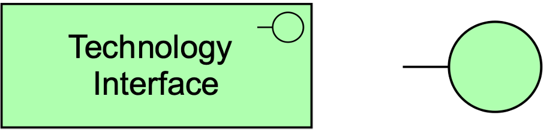

**Figure 88. Technology Interface Notation**

> 图88 技术接口符号

> [!NOTE]
>
> In previous versions of this standard, this element was called “infrastructure interface”.
>
> > 在这个标准的早期版本中，这个元素被称为“基础设施接口”。
>
> This usage is still permitted but deprecated-声明不赞成,弃用 and will be removed from a future version of the standard.
>
> > 这种用法仍然被允许，但不推荐使用，并将从标准的未来版本中删除。

### 10.2.6. Path

> 路径

A path represents a link between two or more technology internal active structure elements, through which these elements can exchange-交换 data, energy-能量, or material.

> 路径表示两个或多个技术内部活动结构元素之间的链接，通过这些元素可以交换数据、能量或材料。

A path is used to model the logical communication (or distribution) relations between technology internal active structure elements.

> 路径用于对技术内部活动结构元素之间的逻辑通信(或分布)关系进行建模。

It is realized by one or more communication networks (or distribution networks when modeling physical elements; see [Section 10.6.3](https://pubs.opengroup.org/architecture/archimate3-doc/ch-Technology-Layer.html#sec-Distribution-Network)), which represent the physical communication (or distribution) links.

> 建模物理元素时，它由一个或多个通信网络(或分布网络)实现；参见 [章节10.6.3](https://pubs.opengroup.org/architecture/archimate3-doc/ch-Technology-Layer.html#sec-Distribution-Network))，它代表物理通信(或分发)链路。

The properties (e.g., bandwidth, latency) of a path are usually aggregated from these underlying-下层的,底层的 networks.

> 路径的属性(例如，带宽，延迟)通常从这些底层网络聚合。

A path connects two or more technology internal active structure elements.

> 一条路径连接两个或多个技术内部活动结构元素。

A path is realized by one or more networks.

> 一条路径由一个或多个网络实现。

A path can aggregate nodes.

> 一条路径可以聚合节点。

**Figure 89. Path Notation**

> 图89 路径符号

### 10.2.7. Communication Network

> 通信网络

A communication network represents a set of structures that connects devices or system software for transmission-传输, routing, and reception of data.

> 通信网络代表了一组连接设备或系统软件的结构，用于传输、路由和接收数据。

A communication network represents the physical communication infrastructure.

> 通信网络代表物理通信基础设施。

It *“provides the basic services to interconnect-互相联系 systems and provide the basic mechanisms-机制 for opaque transfer of data.It contains the hardware and software elements which make up the networking and physical communications links used by a system, and of course all the other systems connected to the network”*, as described by the TOGAF Series Guide: The TOGAF Technical Reference Model (TRM) [[19](https://pubs.opengroup.org/architecture/archimate3-doc/ch-Referenced-docs.html#Ref19)].

> 它提供了基本的服务来连接系统，并为不透明的数据传输提供了基本的机制。它包含硬件和软件元素，这些元素构成了系统使用的网络和物理通信链路，当然还有连接到网络的所有其他系统，如 TOGAF 系列指南：TOGAF 技术参考模型(TRM) [[19](https://pubs.opengroup.org/architecture/archimate3-doc/ch-Referenced-docs.html#Ref19)])所描述的那样。

A communication network connects two or more devices or system software.

> 通信网络连接两个或多个设备或系统软件。

The most basic communication network is a single link between two devices, but it may comprise-包括,包含 multiple links and associated network equipment or software.

> 最基本的通信网络是两个设备之间的单个链路，但它可能包括多个链路和相关的网络设备或软件。

A network has properties such as bandwidth-带宽 and latency-延迟.

> 网络具有带宽和延迟等属性。

A communication network realizes one or more paths.

> 通信网络实现一条或多条路径。

It embodies-具体表现,体现 the physical realization of the logical path between nodes.

> 它体现了节点间逻辑路径的物理实现。

A communication network can consist of sub-networks.

> 一个通信网络可以由子网组成。

It can aggregate devices and system software to model the routers, switches, and firewalls that are part of the network infrastructure.

> 它可以聚合设备和系统软件来对路由器、交换机和防火墙进行建模，这些都是网络基础设施的一部分。

**Figure 90. Communication Network Notation**

> 图90 通信网络符号

> [!NOTE]
>
> Formerly-以前,原来, this element was called “network”.
>
> > 以前，这个元素被称为“网络”。
>
> This usage is still permitted but deprecated and will be removed from a future version of the standard.
>
> > 这种用法仍然被允许，但不推荐使用，并将从标准的未来版本中删除。

### 10.2.8. Example

Two “Blade-刀片 System” devices are connected to a communication network “Data Center Network”.

> 两台“刀片系统”设备连接到一个通信网络“数据中心网络”。

This in turn is connected to another communication network “Wide Area Network” through a node “Data Center Switch”.

> 这反过来又通过节点“数据中心交换机”连接到另一个通信网络“广域网”。

The two communication networks together realize a path “Data Replication Path”.

> 两个通信网络共同实现了一条路径“数据复制路径”。

Both “Blade System” devices and the “Data Center Switch” node have a technology interface “Management Interface”.

> “刀片系统”设备和“数据中心交换机”节点都有一个技术接口“管理接口”。

Device “Blade System 1” deploys “Hypervisor” system software for hardware virtualization.

> “Blade System 1”设备部署“Hypervisor”系统软件，实现硬件虚拟化。

Two system software components are deployed on the “Hypervisor”: an “Open Source Operating System” and a “Proprietary Operating System”, creating two virtual hosts, modeled as nodes “Quotation Virtual Host” and “Purchase Virtual Host”.

> 两个系统软件组件部署在“Hypervisor”上：一个“开源操作系统”和一个“专有操作系统”，创建两个虚拟主机，建模为节点“报价虚拟主机”和“购买虚拟主机”。

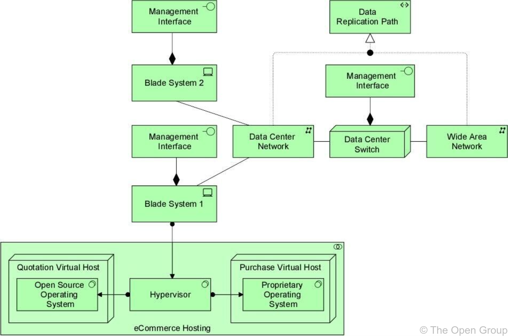

**Example 30: Technology Active Structure Elements**

> 示例30 技术主动结构元素

## 10.3. Behavior Elements

> 行为元素

Behavior elements in the Technology Layer are similar to the behavior elements in the other layers.

> 技术层中的行为元素与其他层中的行为元素相似。

As in the Business and Application Layers, a distinction is made between the external behavior of technology internal active structure elements in terms of *technology services*, and the internal behavior of these elements; i.e., *technology functions*, *technology processes*, and *technology interactions* that realize these services.

> 与在业务层和应用层中一样，对技术内部活动结构元素(以“技术服务”表示)的外部行为和这些元素的内部行为进行了区分；即实现这些服务的*技术功能*、*技术过程*和*技术交互*。

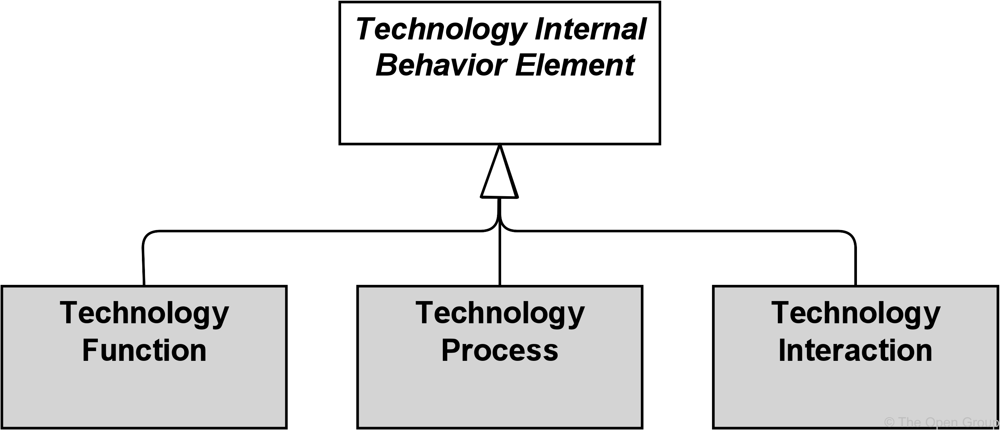

**Figure 91. Technology Internal Behavior Elements**

> 图91 技术内部行为元素

### 10.3.1. Technology Function

> 技术方法

A technology function represents a collection of technology behavior that can be performed by a technology internal active structure element.

> 技术功能表示可以由技术内部活动结构元素执行的技术行为的集合。

A technology function describes the internal behavior of a technology internal active structure element; for the user of an element that performs a technology function, this function is invisible.

> 技术功能描述技术内部活动结构元件的内部行为；对于执行技术功能的元素的用户来说，该功能是不可见的。

If its behavior is exposed externally, this is done through one or more technology services.

> 如果其行为对外公开，则通过一个或多个技术服务来完成。

A technology function abstracts from the way it is implemented.

> 技术功能从其实现方式中抽象出来。

Only the necessary behavior is specified-指定.

> 只指定必要的行为。

A technology function may realize technology services.

> 技术功能可以实现技术服务。

A technology function may access technology passive structure elements.

> 技术功能可以访问技术被动结构要素。

An internal active structure element may be assigned to a technology function (which means that the node performs the technology function).

> 可以将内部活动结构元素分配给技术功能(这意味着该节点执行该技术功能)。

The name of a technology function should preferably be a verb ending with “-ing”.

> 技术功能的名称最好是一个以“-ing”结尾的动词。

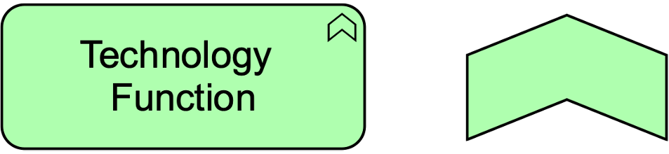

**Figure 92. Technology Function Notation**

> 图92 技术方法符号

> [!NOTE]
>
> In previous versions of this standard, this element was called “infrastructure function”.
>
> > 在这个标准的先前版本中，这个元素被称为“基础设施功能”。
>
> This usage is still permitted but deprecated and will be removed from a future version of the standard.
>
> > 这种用法仍然被允许，但不推荐使用，并将从标准的未来版本中删除。

### 10.3.2. Technology Process

> 技术过程

A technology process represents a sequence of technology behaviors that achieves a specific result.

> 技术过程表示实现特定结果的一系列技术行为。

A technology process describes internal behavior of a technology internal active structure element; for the user of that element, this process is invisible.

> 技术过程描述了技术内部活动结构要素的内部行为；对于该元素的用户，这个过程是不可见的。

If its behavior is exposed externally, this is done through one or more technology services.

> 如果其行为对外公开，则通过一个或多个技术服务来完成。

A technology process abstracts from the way it is implemented.

> 一个技术过程从它的实现方式中抽象出来。

Only the necessary behavior is specified.

> 只指定必要的行为。

It can access technology passive structure elements as input and use or transform these to produce other technology passive structure elements as output.

> 它可以获取技术被动结构要素作为输入，并利用或改造这些技术被动结构要素以产生其他技术被动结构要素作为输出。

A technology process may realize technology services and other technology services may serve (be used by) a technology process.

> 技术过程可以实现技术服务，其他技术服务可以为技术过程服务(被技术过程使用)。

A technology internal active structure element may be assigned to a technology process, which means that this element performs the process.

> 技术内部活动结构元素可以分配给技术过程，这意味着该元素执行该过程。

The name of a technology process should clearly identify a series of technology behaviors using a verb or verb-noun combination; e.g., “Boot up system” or “Replicate database”.

> 技术过程的名称应使用动词或动名词组合来明确识别一系列技术行为；例如，“启动系统”或“复制数据库”。

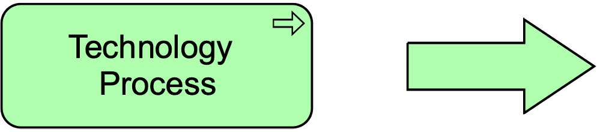

**Figure 93. Technology Process Notation**

> 图93 技术过程符号

### 10.3.3. Technology Interaction

> 技术交互

A technology interaction represents a unit of collective technology behavior performed by (a collaboration of) two or more technology internal active structure elements.

> 技术交互表示由两个或多个技术内部活动结构元素(协作)执行的集体技术行为单元。

A technology interaction describes the collective behavior that is performed by two or more technology internal active structure elements, possibly via their participation in a technology collaboration.

> 技术交互描述了由两个或多个技术内部活动结构元素执行的集体行为，可能通过它们参与技术协作来实现。

This may include the communication pattern between these elements.

> 这可能包括这些元素之间的通信模式。

A technology interaction can also specify the joint behavior needed to realize a technology service.

> 技术交互还可以指定实现技术服务所需的联合行为。

The details of the interaction between the technology internal active structure elements involved in a technology interaction, can be expressed during the detailed design using a UML interaction diagram.

> 在技术交互中涉及的技术内部活动结构元素之间的交互的细节，可以在使用UML交互图的详细设计期间表示。

A technology collaboration, or two or more nodes, may be assigned to a technology interaction.

> 一个技术协作，或者两个或多个节点，可以分配给一个技术交互。

A technology interaction may realize technology services and technology services may serve a technology interaction.

> 技术交互可以实现技术服务，技术服务可以为技术交互服务。

A technology interaction may access artifacts.

> 技术交互可以访问工件。

The name of a technology interaction should clearly identify a collective technology behavior; e.g., “client profile-档案 creation” or “update customer records”.

> 技术交互的名称应当明确标识集体技术行为；例如，“创建客户档案”或“更新客户记录”。

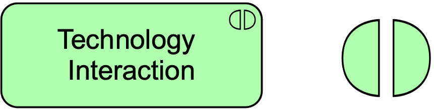

**Figure 94. Technology Interaction Notation**

> 图94 技术交互符号

### 10.3.4. Technology Event

> 技术事件

A technology event represents a technology state change.

> 技术事件表示技术状态的变化。

Technology functions and other technology behavior may be triggered or interrupted by a technology event.

> 技术功能和其他技术行为可能被技术事件触发或中断。

Technology functions may raise events that trigger other technology behavior.

> 技术功能可能引发触发其他技术行为的事件。

Unlike processes, functions, and interactions, an event is instantaneous-瞬间完成的,瞬间发生的: it does not have a duration.

> 与流程、函数和交互不同，事件是瞬时的：它没有持续时间。

Events may originate-起源,产生 from the environment of the organization, but also internal events may occur generated by other devices within the organization.

> 事件可能源于组织的环境，但也可能由组织内部的其他设备产生内部事件。

A technology event may have a time attribute that denotes the moment or moments at which the event happens.

> 技术事件可能有一个时间属性，表示事件发生的时刻。

For example, this can be used to model time schedules; e.g., to model an event that triggers a recurring-再发生,重复 infrastructure function such as making a daily backup.

> 例如，这可以用来为时间计划建模；例如，对触发重复的基础设施功能(如每日备份)的事件进行建模。

A technology event may trigger or be triggered (raised) by a technology function, process, or interaction.

> 技术事件可以由技术功能、流程或交互触发或被触发(引发)。

A technology event may access an artifact or material and may be composed of other technology events.

> 技术事件可以访问工件或材料，并且可以由其他技术事件组成。

The name of a technology event should preferably be a verb in the perfect-完成时的 tense; e.g., “message received”.

> 技术活动的名称最好是动词的完成时态；例如，“收到的消息”。

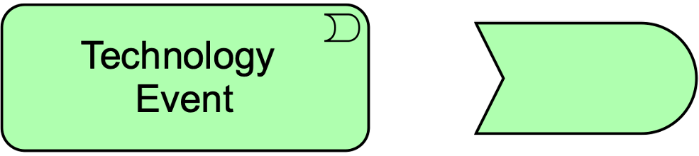

**Figure 95. Technology Event Notation**

> 图95 技术事件符号

### 10.3.5. Technology Service

> 技术服务

A technology service represents an explicitly-显式的,直截了当地 defined exposed technology behavior.

> 技术服务表示显式定义的公开技术行为。

A technology service exposes the functionality of a technology internal active structure element to its environment.

> 技术服务向其环境公开技术内部活动结构元素的功能。

This functionality is accessed through one or more technology interface and may require, use, and produce artifacts.

> 此功能通过一个或多个技术接口访问，并且可能需要、使用和生成工件。

A technology service should be meaningful from the point of view of the environment; it should provide a unit of behavior that is, in itself, useful to its users, such as application components and nodes.

> 从环境的角度来看，技术服务应该是有意义的；它应该提供一个本身对用户有用的行为单元，比如应用程序组件和节点。

This added value can be modeled as a value element associated with the service.

> 这个附加值可以建模为与服务关联的值元素。

Typical technology services may include messaging, storage, naming, and directory-目录,文件夹 services.

> 典型的技术服务可能包括消息传递、存储、命名和目录服务。

It may access artifacts; e.g., a file containing a message.

> 它可以访问工件；例如，包含消息的文件。

A technology service may serve business, application components, and technology behavior or active structure elements.

> 技术服务可以为业务、应用程序组件和技术行为或活动结构元素提供服务。

A technology service is realized by a technology function, process, or interaction.

> 技术服务是通过技术功能、流程或交互实现的。

A technology service is exposed by a technology internal active structure element by assigning technology interfaces to it.

> 技术服务由技术内部活动结构元素通过为其分配技术接口来公开。

A technology service may access artifacts.

> 技术服务可以访问工件。

A technology service may consist of sub-services.

> 技术服务可以由子服务组成。

The name of a technology service should preferably be a verb ending with “-ing”; e.g., “messaging”.

> 技术服务的名称最好是一个以“-ing”结尾的动词;例如,“消息”。

Also, a name explicitly containing the word “service” may be used.

> 此外，可以使用显式包含“服务”一词的名称。

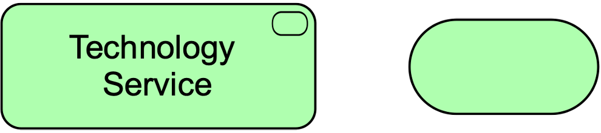

**Figure 96. Technology Service Notation**

> 图96 技术服务符号

> [!NOTE]
>
> In previous versions of this standard, this element was called “infrastructure service”.
>
> > 在这个标准的早期版本中，这个元素被称为“基础设施服务”。
>
> This usage is still permitted but deprecated and will be removed from a future version of the standard.
>
> > 这种用法仍然被允许，但不推荐使用，并将从标准的未来版本中删除。

### 10.3.6. Example

A technology event “Database Update” triggers a technology process “Replicate Remote Data”, which is served by a technology service “Database Update Replication”.

> “数据库更新”技术事件触发“远程数据复制”技术过程，该过程由“数据库更新复制”技术服务提供服务。

This technology service is realized by a technology function “Database Replication”, which is composed of four other technology functions: “Administrate Replication”, “Handle Local Updates”, “Handle Remote Updates”, and “Monitor Replication Status”.

> 该技术服务通过“数据库复制”技术功能实现，该技术功能由“管理复制”、“处理本地更新”、“处理远程更新”和“监控复制状态”四个技术功能组成。

There are information flows from the “Administrate Replication” technology function to the other three technology functions.

> 存在从“管理复制”技术功能到其他三个技术功能的信息流。

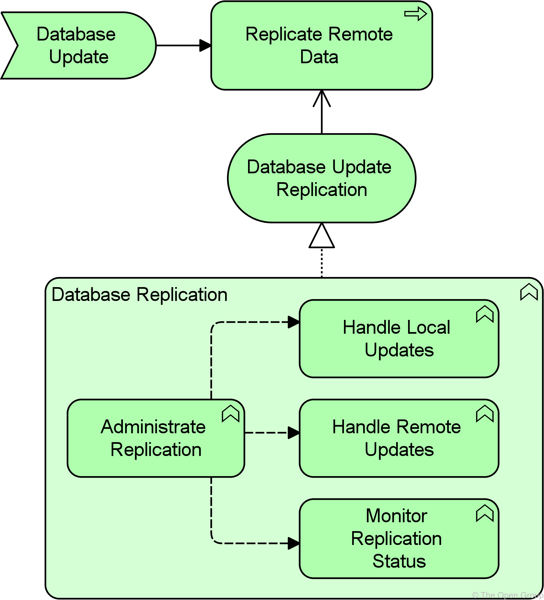

**Example 31: Technology Behavior Elements**

> 示例31 技术行为元素

## 10.4. Passive Structure Elements

> 被动结构元素

Technology passive structure elements model the passive structure elements that are used and processed by the infrastructure. 

> 技术被动结构元素对基础设施使用和处理的被动结构元素进行建模。

Technology passive structure elements represent the informational and physical objects manipulated-操作,使用 by the infrastructure of an enterprise.

> 技术被动结构要素是指由企业的基础设施所操纵的信息对象和物理对象。

They are abstract elements; i.e., they are not instantiated in models but serve as the generic type of the things manipulated by the Technology Layer.

> 它们是抽象的元素；也就是说，它们不是在模型中实例化的，而是作为技术层操作的事物的一般类型。

This may include both artifacts (e.g., files) and physical material.

> 这可能包括工件(例如，文件)和物理材料。

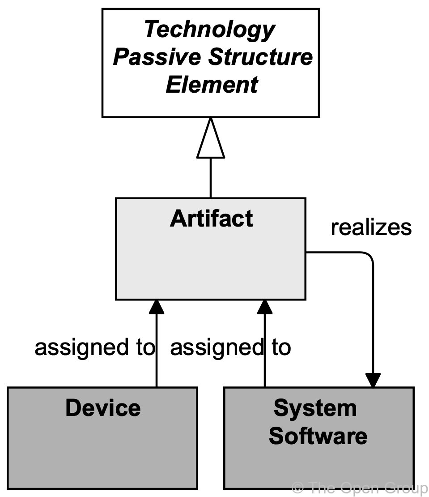

**Figure 97. Technology Passive Structure Elements**

> 图97 技术被动结构元素

Technology passive structure elements may be accessed by technology behavior (functions, processes, interactions, events, and services).

> 技术被动结构元素可以通过技术行为(功能、过程、交互、事件和服务)来访问。

A technology passive structure elements may have association, specialization, aggregation, or composition relationships with other technology passive structure elements.

> 技术被动结构元素可以与其他技术被动结构元素具有关联、专门化、聚合或组合关系。

It may be an artifact (see [Section 10.4.1](https://pubs.opengroup.org/architecture/archimate3-doc/ch-Technology-Layer.html#sec-Artifact)) or material (see [Section 10.7.1](https://pubs.opengroup.org/architecture/archimate3-doc/ch-Technology-Layer.html#sec-Material)).

> 它可能是一个工件(参见 [第10.4.1节](https://pubs.opengroup.org/architecture/archimate3-doc/ch-Technology-Layer.html#sec-Artifact) )或材料(参见 [第10.7.1节](https://pubs.opengroup.org/architecture/archimate3-doc/ch-Technology-Layer.html#sec-Material) )。

Specific technology internal active structure elements may be assigned to technology passive structure elements.

> 具体技术内部主动结构元素可归属于技术被动结构元素。

For example, a device may be assigned to an artifact, modeling the deployment of the artifact on that device.

> 例如，可以将一个设备分配给一个工件，对该设备上工件的部署进行建模。

### 10.4.1. Artifact

> 工件

An artifact represents a piece of data that is used or produced in a software development process, or by deployment and operation of an IT system.

> 工件表示在软件开发过程中使用或产生的数据，或者通过IT系统的部署和操作。

An artifact represents a “physical” element in the IT world.

> 工件表示IT世界中的“物理”元素。

Artifact is a specialization of technology passive structure elements.

> 工件是一种专业化技术的被动结构元素。

It is typically used to model (software) products such as source files, executables, scripts, database tables, messages, documents, specifications-规范,规格, and model files.

> 它通常用于对(软件)产品建模，例如源文件、可执行文件、脚本、数据库表、消息、文档、规范和模型文件。

It can be accessed (created, deleted, read, written) by technology behavior elements.

> 它可以被技术行为元素访问(创建、删除、读取、写入)。

An instance (copy) of an artifact can be deployed on a device or system software; this is modeled with an assignment relationship.

> 工件的实例(副本)可以部署在设备或系统软件上；这是用赋值关系建模的。

An artifact could be used to represent a physical data component that realizes a data object.

> 工件可以用来表示实现数据对象的物理数据组件。

An application component or system software may be realized by one or more artifacts.

> 应用程序组件或系统软件可以由一个或多个工件来实现。

A data object may be realized by one or more artifacts.

> 数据对象可以由一个或多个工件来实现。

A device or system software element may be assigned to an artifact to model that the artifact is deployed on this element.

> 可以将设备或系统软件元素分配给工件，以对工件部署在该元素上的模型进行建模。

Thus, the two typical ways to use the artifact element are as an *execution component* or as a *data file*.

> 因此，使用工件元素的两种典型方法是作为“执行组件”或“数据文件”。

In fact, these could be defined as specializations of the artifact element.

> 事实上，这些可以被定义为工件元素的专门化。

The name of an artifact should preferably be the name of the file it represents; e.g., “order.jar”.

> 工件的名称最好是它所代表的文件的名称；例如,“order.jar”。

An artifact may consist of sub-artifacts.

> 一个工件可以由子工件组成。

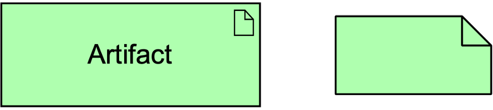

**Figure 98. Artifact Notation**

> 图98 工件符号

## 10.5. Physical Elements Metamodel

> 物理元素元模型

[Figure 99](https://pubs.opengroup.org/architecture/archimate3-doc/ch-Technology-Layer.html#fig-Physical-Elements-Metamodel) gives an overview of the physical elements and their relationships.

> [图99](https://pubs.opengroup.org/architecture/archimate3-doc/ch-Technology-Layer.html#fig-Physical-Elements-Metamodel) 给出了物理元素及其关系的概述。

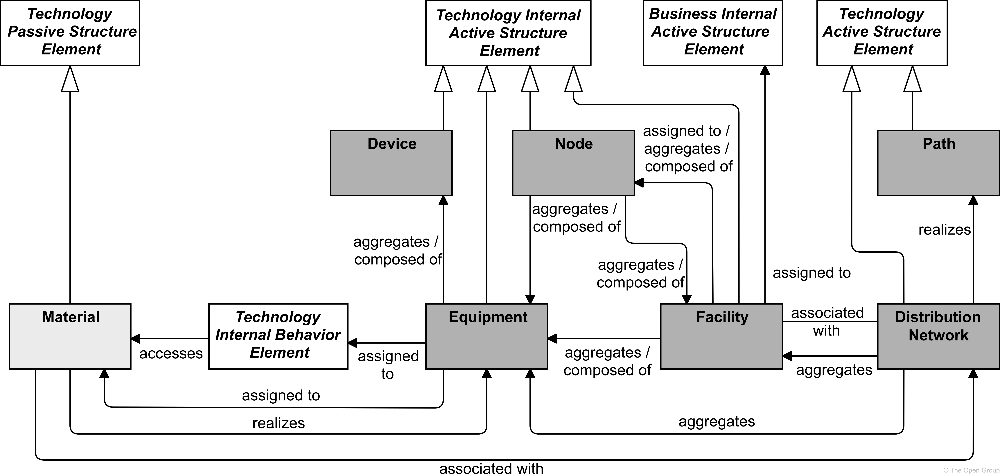

**Figure 99. Physical Elements Metamodel**

> 图99 物理元素元模型

> [!NOTE]
>
> This figure does not show all permitted relationships; every element in the language can have composition, aggregation, and specialization relationships with elements of the same type.
>
> > 这个数字并没有显示所有允许的关系；语言中的每个元素都可以与相同类型的元素具有组合、聚合和专门化关系。
>
> Furthermore, there are indirect relationships that can be derived, as explained in [Section 5.7](https://pubs.opengroup.org/architecture/archimate3-doc/ch-Relationships-and-Relationship-Connectors.html#sec-Derivation-of-Relationships).
>
> > 此外，还可以推导出间接关系，如 [第5.7节](https://pubs.opengroup.org/architecture/archimate3-doc/ch-Relationships-and-Relationship-Connectors.html#sec-Derivation-of-Relationships) 所述。

## 10.6. Physical Active Structure Elements

> 物理主动结构元素

The *equipment* element is the main active structure element within the physical elements.

> 设备元素是物理元素中主要的活动结构元素。

This element is used to model structural entities-实体,独立存在体 in this layer.

> 此元素用于对该层中的结构实体进行建模。

It is used to model any physical machinery, tools, instruments-仪器, or implements.

> 它用于模拟任何物理机械、工具、仪器或工具。

It strictly-严格地,严厉地 models the structural aspect of a system; its behavior is modeled by an explicit relationship to the behavior elements. 

> 它严格模拟系统的结构方面；它的行为通过与行为元素的显式关系建模。

The *facility* active structure element is used to model the environment in which this equipment is used; for example, office buildings, factories, laboratories-实验室,实验大楼, or data centers.

> *facility*活动结构元素用于模拟使用该设备的环境；例如，办公楼、工厂、实验室或数据中心。

The inter-relationships-相互关系 of physical elements are mainly formed by the logistics infrastructure.

> 物理元素的相互关系主要是由物流基础设施形成的。

The path element from the Technology Layer models the relation between two or more nodes, through which these nodes can exchange information or material.

> 来自技术层的路径元素为两个或多个节点之间的关系建模，通过这些节点可以交换信息或材料。

The physical realization of a path is modeled with a *distribution network*; i.e., a physical connection between two or more pieces of equipment (or other physical networks).

> 路径的物理实现用“分布网络”建模；即，两个或多个设备(或其他物理网络)之间的物理连接。

This can be used to model, for example, rail-轨道 or road networks, the water supply-供应,提供, power grid, or gas network.

> 这可以用于建模，例如，铁路或公路网、供水、电网或燃气网络。

### 10.6.1. Equipment

> 设备

Equipment represents one or more physical machines, tools, or instruments-仪器 that can create, use, store, move, or transform materials.

> 设备是指一台或多台能够制造、使用、储存、移动或转化材料的物理机器、工具或仪器。

Equipment comprises-包括,包含 all active processing elements that carry out physical processes in which materials are used or transformed.

> 设备包括执行使用或转化材料的物理过程的所有活动处理元件。

It is possible to model nodes that are formed by a combination of IT infrastructure (devices, system software) and physical infrastructure (equipment); e.g., an MRI-核磁共振 scanner at a hospital, a production plant with its control systems, etc.

> 可以对由 IT 基础设施(设备、系统软件)和物理基础设施(设备)组合而成的节点进行建模；例如，医院的核磁共振扫描仪、生产工厂及其控制系统等。

Material can be accessed (e.g., created, used, moved, transformed, or otherwise manipulated) by equipment.

> 材料可以通过设备访问(例如，创建、使用、移动、转换或以其他方式操作)。

Equipment may be assigned to material in order to model where the material is stored.

> 设备可以分配给材料，以便模拟材料存储的位置。

Material may realize equipment.

> 材料可实现设备。

Equipment can serve other equipment as well as other active structure elements such as business roles and actors, and facilities can be assigned to equipment.

> 设备可以为其他设备以及其他活动结构元素(如业务角色和参与者)服务，并且可以将设施分配给设备。

A piece of equipment can be composed of other pieces of equipment or devices.

> 一台设备可以由其他设备或装置组成。

Facilities can be assigned to equipment (i.e., equipment is installed and used in or on a facility).

> 设施可以分配给设备(即设备安装和使用在设施内或设施上)。

Equipment can be aggregated in a location.

> 设备可以集中在一个地点。

The name of **a piece of**-一件 equipment should preferably be a noun.

> 一件设备的名称最好是名词。

**Figure 100. Equipment Notation**

> 图100 设备符号

### 10.6.2. Facility

> 设施

A facility represents a physical structure or environment.

> 设施代表一个物理结构或环境。

A facility represents a physical resource that has the capability of facilitating (e.g., housing or locating) the use of equipment.

> 设施是一种物理资源，具有便利(例如，安置或定位)设备使用的能力。

It is typically used to model factories, buildings, or outdoor-户外的 constructions that have an important role in production or distribution processes.

> 它通常用于模拟工厂、建筑物或在生产或分配过程中起重要作用的室外建筑。

Examples of facilities include a factory, laboratory, warehouse, shopping mall, cave, or spaceship.

> 设施的例子包括工厂、实验室、仓库、购物中心、洞穴或宇宙飞船。

Facilities may be composite; i.e., consist of sub-facilities.

> 设施可以是复合的；即，由子设施组成。

Facilities can be interconnected by distribution networks.

> 设施可以通过配电网相互连接。

A facility can serve other facilities and other active structure elements such as business roles and actors.

> 设施可以为其他设施和其他活动结构元素(如业务角色和参与者)提供服务。

A facility can be composed of other facilities or nodes and can be aggregated in a location.

> 一个设施可以由其他设施或节点组成，也可以聚集在一个位置。

The name of a facility should preferably be a noun referring to the type of facility; e.g., “Rotterdam oil-油 refinery-提炼厂,精炼厂”.

> 设施的名称最好是指代设施类型的名词；例如，“鹿特丹炼油厂”。

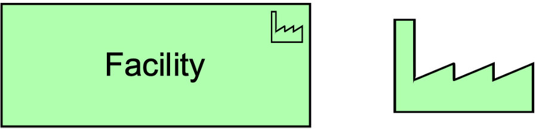

**Figure 101. Facility Notation**

> 图101 设施符号

### 10.6.3. Distribution Network

> 分布网络

A distribution network represents a physical network used to transport materials or energy.

> 分布网络表示用于运输材料或能源的物理网络。

A distribution network represents the physical distribution or transportation-运输,运送 infrastructure.

> 分销网络代表物理分销或运输基础设施。

It embodies-体现 the physical realization of the logical paths between facilities.

> 它体现了设备间逻辑路径的物理实现。

A distribution network connects two or more facilities and may realize one or more paths.

> 配电网连接两个或多个设施，并可实现一条或多条路径。

A distribution network can consist of sub-networks and can aggregate facilities and equipment to model railway-火车 stations and trains-火车 that are part of a rail-铁路系统 network.

> 分配网络可以由子网络组成，并且可以聚合设施和设备来模拟作为铁路网络一部分的火车站和火车。

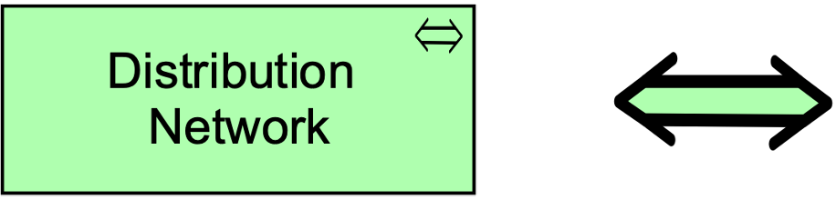

**Figure 102. Distribution Network Notation**

> 图102 分布网络符号

## 10.7. Passive Structure Elements

> 被动结构元素

### 10.7.1. Material

> 材料

Material represents tangible physical matter-物质,材料 or energy.

> Material 代表有形的物质或能量。

Material is typically used to model raw-原始 materials and physical products, and also energy sources such as fuel-燃料 and electricity.

> 材料通常用于模拟原材料和实物产品，以及燃料和电力等能源。

Material can be accessed by technology behavior elements to model how it is created, used, moved, transformed, or otherwise manipulated.

> 材料可以通过技术行为元素来访问，以建模如何创建、使用、移动、转换或以其他方式操作。

Equipment may be assigned to material, to model where the material is stored.

> 设备可以分配给物料，以模拟物料存储的位置。

This allows you to model the distinction between, for instance, “the sand-沙,沙子 is in the dump truck” and “the sand is poured into the concrete mixer-搅拌机”.

> 这可以让你对“沙子在自卸卡车里”和“沙子被倒入混凝土搅拌机里”之间的区别进行建模。

Material may realize equipment.

> 材料可实现设备。

The name of material should be a noun.

> 材料的名称应该是名词。

Pieces-一种 of material may be composed of other pieces of material.

> 一种材料可以由另一种材料组成。

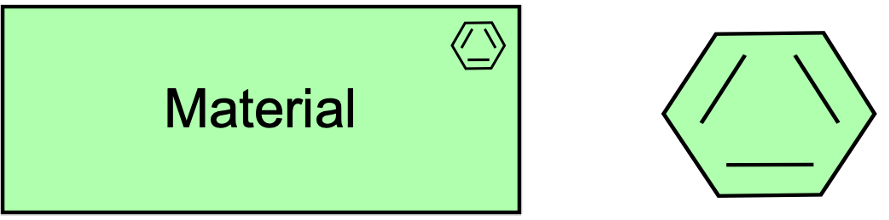

**Figure 103. Material Notation**

> 图103 材料符号

## 10.8. Example

An “Assembly Line”, modeled as equipment and installed at a facility “Manufacturing Plant”, makes use of materials “Pre-Assembled Circuit Board”, “Internal Antenna”, and “Plastic Case” to produce material “Vehicle Telematics Appliance”.

> “流水线”以设备为模型，安装在设施“制造工厂”中，使用“预组装电路板”、“内部天线”和“塑料外壳”材料生产“车辆远程信息处理设备”。

The appliance-装置 is subsequently transported from the “Manufacturing Plant” to the facilities “National Distribution Center”, and from there to the “Local Distribution Center”.

> 装置随后从“制造工厂”运往“国家配送中心”，再从那里运往“地方配送中心”。

These are connected via the distribution networks “Overseas Shipping” and “Local Trucking”.

> 这些都是通过分销网络“海外航运”和“本地卡车运输”连接起来的。

These distribution networks together realize the path “Intermodal Freight”.

> 这些配送网络共同实现了“多式联运”的路径。

Note that in a life-size architecture model, you may want to split this up into multiple views; for example, one that shows the production of the “Vehicle Telematics Appliance” from the input materials, a second that shows the material flows between the plant and the distribution centers, and a third that focuses in on the transportation modalities between these facilities.

> 注意，在实物大小的架构模型中，您可能希望将其拆分为多个视图；例如，其中一个显示了从输入材料生产“车辆远程信息处理设备”，第二个显示了工厂和配送中心之间的物料流动，第三个侧重于这些设施之间的运输方式。

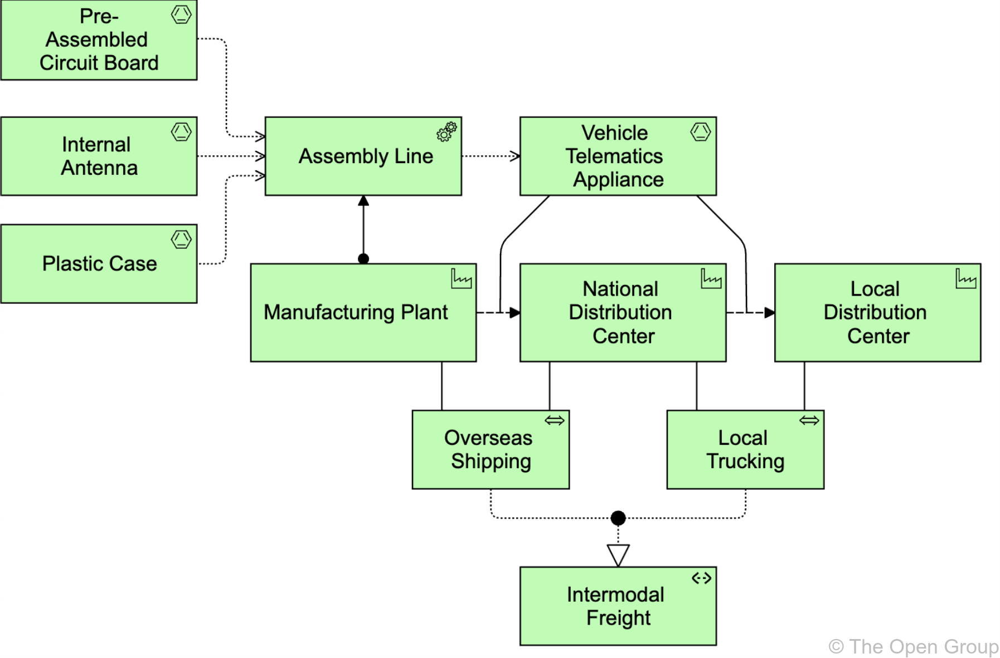

**Example 33: Physical Elements**

> 示例33 物理元素

## 10.9. Summary of Technology Layer Elements

> 技术层元素总结

Table 8 gives an overview of the Technology Layer elements, with their definitions.

> 表格8 概述了技术层元素及其定义。

**Table 8. Technology Layer Elements**

> 表格8 技术层元素

| Element                  | Definition                                                   | Notation                                                     |
| ------------------------ | ------------------------------------------------------------ | ------------------------------------------------------------ |
| Node                     | Represents a computational or physical resource that hosts, manipulates-操纵, or interacts with other computational or physical resources. 表示承载、操纵或与其他计算或物理资源交互的计算或物理资源。 |     |
| Device                   | Represents a physical IT resource upon which system software and artifacts may be stored or deployed for execution. 表示一个物理 IT 资源，系统软件和工件可以在其上存储或部署以供执行。 |   |
| System Software          | Represents software that provides or contributes to an environment for storing, executing, and using software or data deployed within it. 表示提供或有助于存储、执行和使用部署在其中的软件或数据的环境的软件。 |  |
| Technology Collaboration | Represents an aggregate of two or more technology internal active structure elements that work together to perform collective technology behavior. 表示一起工作以执行集体技术行为的两个或多个技术内部活动结构元素的集合。 |  |
| Technology Interface     | Represents a point of access where technology services offered by a technology internal active structure can be accessed. 表示可以访问技术内部活动结构提供的技术服务的接入点。 |  |
| Path                     | Represents a link between two or more technology internal active structure elements, through which these elements can exchange data, energy, or material. 表示两个或多个技术内部活动结构元素之间的联系，通过这些元素可以交换数据、能量或材料。 |     |
| Communication Network    | Represents a set of structures that connects devices or system software for transmission, routing, and reception of data. 表示一组连接设备或系统软件的结构，用于数据的传输、路由和接收。 |  |
|                          |                                                              |                                                              |
| Technology Function      | Represents a collection of technology behavior that can be performed by a technology internal active structure element. 表示可由技术内部活动结构元素执行的技术行为的集合。 |  |
| Technology Process       | Represents a sequence of technology behaviors that achieves a specific result. 表示实现特定结果的一系列技术行为。 |  |
| Technology Interaction   | Represents a unit of collective technology behavior performed by (a collaboration of) two or more technology internal active structure elements. 表示由两个或多个技术内部活动结构元素(协作)执行的集体技术行为单元。 |  |
| Technology Event         | Represents a technology state change. 表示技术状态的变化。 |  |
| Technology Service       | Represents an explicitly defined exposed technology behavior. 表示显式定义的公开技术行为。 |  |
|                          |                                                              |                                                              |
| Artifact                 | Represents a piece of data that is used or produced in a software development process, or by deployment and operation of an IT system. 表示在软件开发过程中或在IT系统的部署和操作中使用或产生的一段数据。 |  |
|                          |                                                              |                                                              |
| Equipment                | Represents one or more physical machines, tools, or instruments-仪器 that can create, use, store, move, or transform materials. 表示一个或多个能够创造、使用、存储、移动或转换材料的物理机器、工具或仪器。 |  |
| Facility                 | Represents a physical structure or environment. 表示一个物理结构或环境。 |  |
| Distribution Network     | Represents a physical network used to transport materials or energy. 表示用于传输材料或能源的物理网络。 |  |
|                          |                                                              |                                                              |
| Material                 | Represents tangible-有形的 physical matter-物质 or energy. 代表有形的物质或能量。 |  |

