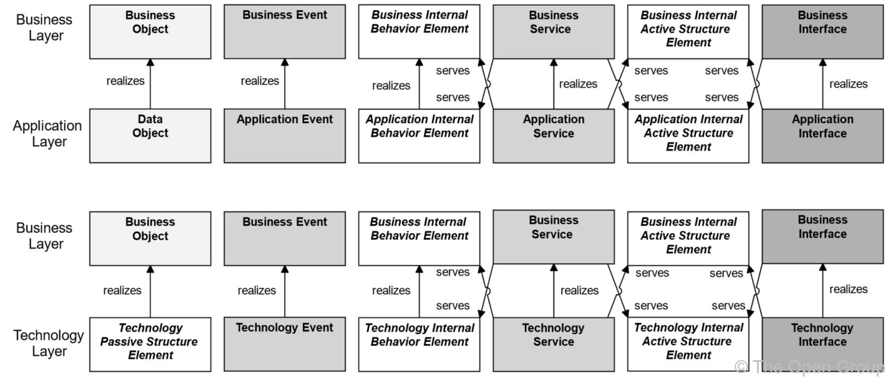
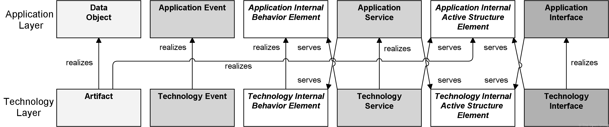
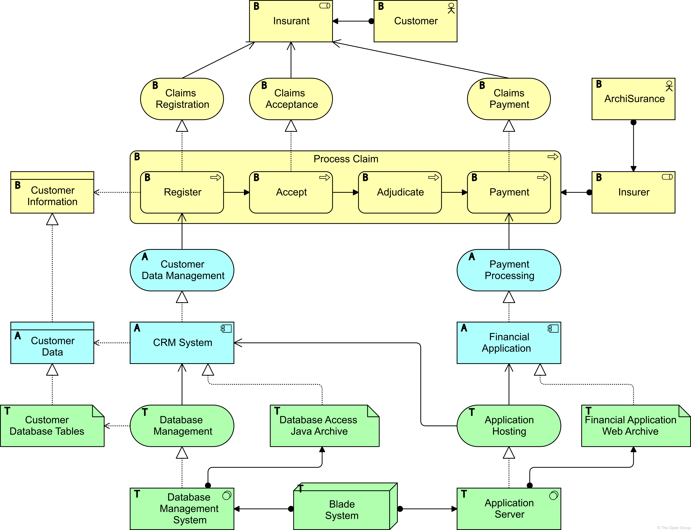

# Chapter 11. RelationShips Between Core Layers

> 核心层之间的关系

The previous chapters have presented the concepts to model the Business, Application, and Technology Layers of an enterprise. 

> 前面的章节已经介绍了对企业的业务层、应用层和技术层进行建模的概念。

However, a central issue in Enterprise Architecture is business-IT alignment: how can these layers be matched?

> 然而，企业架构中的一个中心问题是业务 - IT 对齐：这些层如何匹配?

This chapter describes the relationships that the ArchiMate language offers to model the link between business, applications, and technology.

> 本章描述了 ArchiMate 语言为业务、应用程序和技术之间的联系建模所提供的关系。

## 11.1. Alignment of the Business Layer and Lower Layers

> 业务层和较低层的对齐

[Figure 104](https://pubs.opengroup.org/architecture/archimate3-doc/ch-Relationships-Between-Core-Layers.html#fig-Relationships-Between-Business-Layer-and-Application-and-Technology-Layer-Elements) shows the relationships between the Business Layer, the Application Layer, and the Technology Layer elements.

> [图104](https://pubs.opengroup.org/architecture/archimate3-doc/ch-Relationships-Between-Core-Layers.html#fig-Relationships-Between-Business-Layer-and-Application-and-Technology-Layer-Elements) 显示了业务层、应用层和技术层元素之间的关系。

There are two main types of relationships between these layers:

> 这些层之间的关系主要有两种:

1. *Serving* relationships; for example, between application service and the different types of business behavior elements, and between application interface and business role;

	> 服务关系；例如，应用程序服务和不同类型的业务行为元素之间，以及应用程序接口和业务角色之间；

	**vice versa**-反之亦然, serving relationships between business service and application behavior elements, and between business interface and application component.

	> 反之亦然，业务服务和应用程序行为元素之间以及业务接口和应用程序组件之间的关系也是如此。

	These relationships represent the behavioral and structural aspects of the support of the business by applications.

	> 这些关系代表了应用程序对业务支持的行为和结构方面。

2. *Realization* relationships; for example, from an application process or function to a business process or function, or from a data object or a technology passive structure element to a business object, to indicate that the data object is a digital representation of the corresponding-相应的,相关的 business object, or the technology element is a physical representation of the business object.

	> 实现关系；例如，从应用程序流程或功能到业务流程或功能，或从数据对象或技术被动结构元素到业务对象，以表明数据对象是相应业务对象的数字表示，或技术元素是业务对象的物理表示。

	Note that there is no realization of business internal active structure elements by application or technology elements because people cannot be realized by applications or technology.

	> 请注意，没有通过应用程序或技术元素实现业务内部活动结构元素，因为人不能通过应用程序或技术实现。

	Instead, the business behavior of those active structure elements can be realized by application or technology behavior elements, to which in turn application or technology active structure elements can be assigned.

	> 相反，这些活动结构元素的业务行为可以通过应用程序或技术行为元素来实现，而应用程序或技术活动结构元素又可以分配给这些元素。

In addition, there may be an aggregation relationship between a product and an application or technology service, and a data or technology passive structure element, to indicate that these services or objects can be offered directly to a customer as part of the product.

> 此外，产品与应用程序或技术服务之间可能存在聚合关系，以及数据或技术被动结构元素，以表明这些服务或对象可以作为产品的一部分直接提供给客户。

**Figure 104. Relationships Between Business Layer and Application and Technology Layer Elements**

> 图104 业务层与应用和技术层元素之间的关系

> [!NOTE]
>
> This figure does not show all permitted relationships; there are indirect relationships that can be derived, as explained in [Section 5.7](https://pubs.opengroup.org/architecture/archimate3-doc/ch-Relationships-and-Relationship-Connectors.html#sec-Derivation-of-Relationships).
>
> > 这个图并没有显示所有允许的关系；可以推导出一些间接的关系，详见 [章节5.7](https://pubs.opengroup.org/architecture/archimate3-doc/ch-Relationships-and-Relationship-Connectors.html#sec-Derivation-of-Relationships)。

## 11.2. Alignment-对齐,一致 of the Application and Technology Layers

> 应用程序层和技术层的对齐

[Figure 105](https://pubs.opengroup.org/architecture/archimate3-doc/ch-Relationships-Between-Core-Layers.html#fig-Relationships-Between-Application-Layer-and-Technology-Layer-Elements) shows the relationships between Application Layer and Technology Layer elements.

> [图105](https://pubs.opengroup.org/architecture/archimate3-doc/ch-Relationships-Between-Core-Layers.html#fig-Relationships-Between-Application-Layer-and-Technology-Layer-Elements) 显示了应用层和技术层元素之间的关系。

There are two types of relationships between these layers:

> 这些层之间有两种类型的关系:

1. *Serving* relationships, between technology service and the different types of application behavior elements, and between technology interface and application component;

	> 技术服务与不同类型的应用程序行为元素之间、技术接口与应用程序组件之间的服务关系；

	*vice versa*, serving relationships between application service and technology behavior, and application interface and technology internal active structure element.

	> 反之亦然，服务于应用服务和技术行为之间的关系，以及应用接口和技术内部活动结构元素之间的关系。

	These relationships represent the behavioral and structural aspects of the use of technology infrastructure by applications and *vice versa*.

	> 这些关系表示应用程序使用技术基础设施的行为和结构方面，反之亦然。

2. *Realization* relationships from technology process or function to application process or function, from artifact to data object, to indicate that the data object is realized by, for example, a physical data file, from artifact to application component, to indicate that a physical data file is an executable that realizes an application or part of an application.

	> 实现从技术过程或功能到应用过程或功能的关系，从工件到数据对象的关系，表明数据对象是由物理数据文件实现的，例如，从工件到应用程序组件，表明物理数据文件是实现应用程序或应用程序的一部分的可执行文件。

	(NOTE: In this case, an artifact represents a “physical” component that is deployed on a device or system software element; this is modeled with an assignment relationship.A (logical) application component is realized by an artifact and, indirectly, by the element on which the artifact is deployed.)

	> (注意：在这种情况下，工件表示部署在设备或系统软件元素上的“物理”组件;这是用赋值关系建模的。(逻辑)应用程序组件由工件实现，并间接地由部署工件的元素实现。

**Figure 105. Relationships Between Application Layer and Technology Layer Elements**

> 图105 应用层和技术层元素之间的关系

> [!NOTE]
>
> This figure does not show all permitted relationships; there are indirect relationships that can be derived, as explained in [Section 5.7](https://pubs.opengroup.org/architecture/archimate3-doc/ch-Relationships-and-Relationship-Connectors.html#sec-Derivation-of-Relationships).
>
> > 这个图并没有显示所有允许的关系；可以推导出一些间接的关系，详见 [章节5.7](https://pubs.opengroup.org/architecture/archimate3-doc/ch-Relationships-and-Relationship-Connectors.html#sec-Derivation-of-Relationships)。

Due to the derived relationships that are explained in [Section 5.7](https://pubs.opengroup.org/architecture/archimate3-doc/ch-Relationships-and-Relationship-Connectors.html#sec-Derivation-of-Relationships), it is also possible to draw relationships directly between the Business and Technology Layers.

> 由于在 [第5.7节](https://pubs.opengroup.org/architecture/archimate3-doc/ch-Relationships-and-Relationship-Connectors.html#sec-Derivation-of-Relationships) 中解释了派生关系，因此也可以直接绘制业务层和技术层之间的关系。

For example, if a business object is realized by a data object, which in turn is realized by an artifact, this artifact indirectly realizes the business object.

> 例如，如果业务对象由数据对象实现，而数据对象又由工件实现，则该工件间接实现业务对象。

## 11.3. Example

[Example 34](https://pubs.opengroup.org/architecture/archimate3-doc/ch-Relationships-Between-Core-Layers.html#ex-Cross-Layer-Relationships) shows how the cross-layer relationships integrate the different layers, and how this can be depicted-描述,描绘 in one view.

> [示例34](https://pubs.opengroup.org/architecture/archimate3-doc/ch-Relationships-Between-Core-Layers.html#ex-Cross-Layer-Relationships) 展示了跨层关系如何集成不同的层，以及如何在一个视图中描述这一点。

It also shows how the optional notation with letters in the upper-left corner is used to distinguish between layers.

> 它还展示了如何使用左上角带有字母的可选符号来区分层。

**Example 34: Cross-Layer Relationships**

> 示例34 跨层的关系

