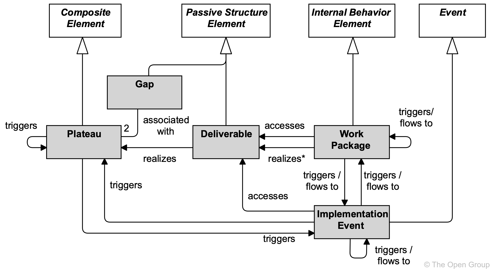
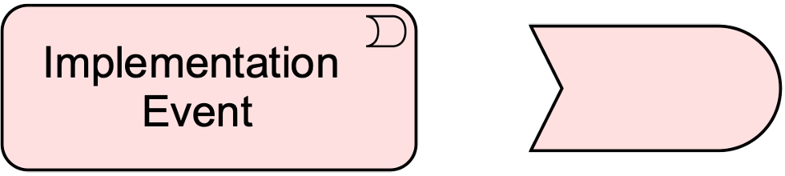
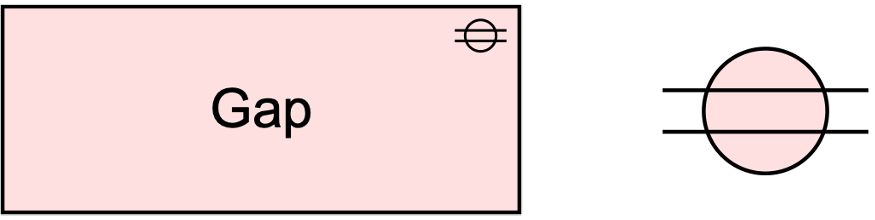
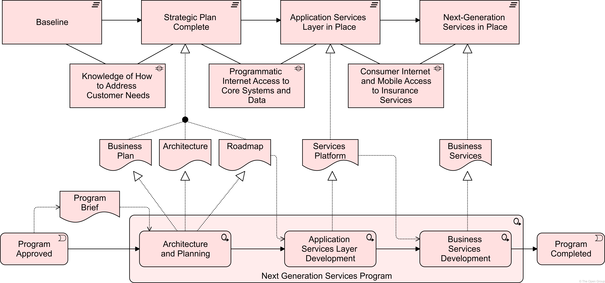
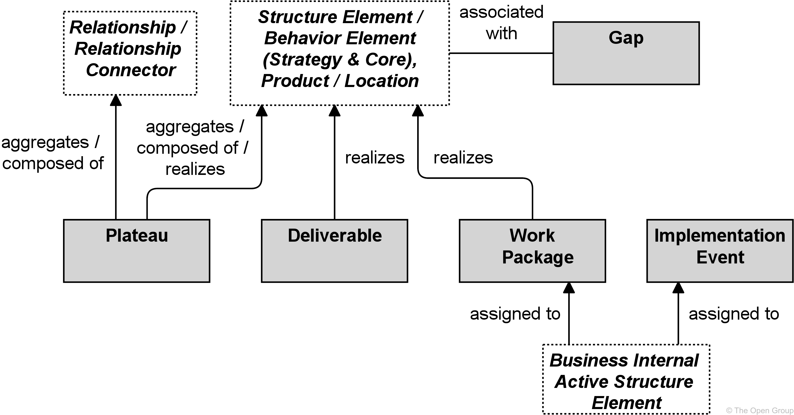
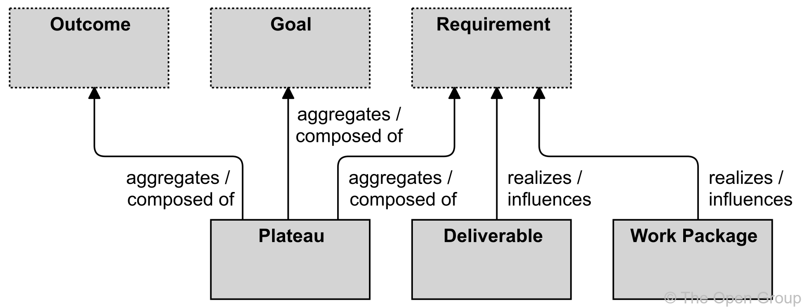

# Chapter 12. Implementation and Migration-迁移,改变 Layer

> 实现和迁移层

The implementation and migration elements support the implementation and migration of architectures.

> 实现和迁移元素支持体系结构的实现和迁移。

This includes modeling implementation programs-计划 and projects to support program, portfolio, and project management.

> 这包括建模实现计划和项目，以支持计划、投资组合和项目管理。

It also includes support for migration planning.

> 它还包括对迁移计划的支持。

## 12.1. Implementation and Migration Elements Metamodel

> 实现和迁移元素元模型

[Figure 106](https://pubs.opengroup.org/architecture/archimate3-doc/ch-Implementation-and-Migration-Layer.html#fig-Implementation-and-Migration-Metamodel) gives an overview of the implementation and migration elements and their relationships.

> [图106](https://pubs.opengroup.org/architecture/archimate3-doc/ch-Implementation-and-Migration-Layer.html#fig-Implementation-and-Migration-Metamodel) 给出了实现和迁移元素及其关系的概述。

**Figure 106. Implementation and Migration Metamodel**

> 图106 实现和迁移元模型

> [!NOTE]
>
> This figure does not show all permitted relationships; every element in the language can have composition, aggregation, and specialization relationships with elements of the same type.
>
> > 这个数字并没有显示所有允许的关系；语言中的每个元素都可以与相同类型的元素具有组合、聚合和专门化关系。
>
> Furthermore, there are indirect relationships that can be derived, as explained in [Section 5.7](https://pubs.opengroup.org/architecture/archimate3-doc/ch-Relationships-and-Relationship-Connectors.html#sec-Derivation-of-Relationships).
>
> > 此外，还可以推导出间接关系，如 [第5.7节](https://pubs.opengroup.org/architecture/archimate3-doc/ch-Relationships-and-Relationship-Connectors.html#sec-Derivation-of-Relationships) 所述。
>
> The realization relationship from Work Package to Deliverable (marked with an asterisk in the figure) is deprecated and may be removed in a future version of the standard.
>
> > 从 Work Package 到 Deliverable 的实现关系(在图中用星号标记)已被弃用，并且可能在标准的未来版本中被删除。
>
> It is recommended to use an access relationship instead.
>
> > 建议使用访问关系。

## 12.2. Implementation and Migration Elementss

> 实现和迁移元素

### 12.2.1. Work Package

> 工作包

A work package represents a series of actions identified and designed to achieve specific results within specified time and resource constraints.

> 工作包代表了在指定的时间和资源限制内确定和设计的一系列行动，以实现特定的结果。

The central behavioral element is a *work package*.

> 核心行为元素是一个“工作包”。

A work package is typically not a continuously ongoing activity, but has a start and an end.

> 工作包通常不是持续进行的活动，而是有开始和结束的。

These may be modeled as attributes.

> 这些可以建模为属性。

It produces a well-defined set of results, typically modeled as goals, outcomes, or deliverables.

> 它产生一组定义良好的结果，通常建模为目标、结果或交付物。

The work package element can be used to model sub-projects or tasks within a project, complete projects, programs, or project portfolios.

> 工作包元素可用于对子项目或项目中的任务、完成项目、规划或项目组合进行建模。

In an Agile context, a work package can be used to model the work performed in an Agile iteration (e.g., sprint) or higher level increment.

> 在敏捷环境中，工作包可用于对敏捷迭代(例如，sprint)或更高级别增量中执行的工作进行建模。

**Figure 107. Work Package Notation**

> 图107 工作包符号

Conceptually-概念上, a work package is similar to a business process, in that it consists of a set of causally-related-因果关系 tasks, aimed at producing a well-defined result.

> 从概念上讲，工作包类似于业务流程，因为它由一组因果相关的任务组成，旨在产生定义良好的结果。

However, a work package is a unique “one-off” process.

> 然而，工作包是一个独特的“一次性”过程。

Still, a work package can be described in a way very similar to the description of a process.

> 但是，工作包可以用与过程描述非常相似的方式来描述。

### 12.2.2. Deliverable

> 可交付成果

A deliverable represents a precisely-精确地,准确地 defined result of a work package.

> 可交付成果代表工作包的精确定义的结果。

Work packages produce *deliverables*.

> 工作包产生“可交付成果”。

These may be results of any kind; e.g., reports, papers, services, software, physical products, etc., or intangible results such as organizational change.

> 这些可能是任何一种结果；例如，报告、文件、服务、软件、实物产品等，或无形的结果，如组织变革。

A deliverable may also be the implementation of (a part of) an architecture.

> 可交付物也可以是体系结构的实现(一部分)。

**Figure 108. Deliverable Notation**

> 图108 可交付成果符号

Often, deliverables are contractually-合约地,合同性地 specified and in turn formally reviewed, agreed, and signed off by the stakeholders as is, for example, prescribed-规定 by the TOGAF framework [[4](https://pubs.opengroup.org/architecture/archimate3-doc/ch-Referenced-docs.html#Ref4)].

> 通常，可交付成果是按照合同规定的，然后由涉众按照 TOGAF 框架 [[4](https://pubs.opengroup.org/architecture/archimate3-doc/ch-Referenced-docs.html#Ref4)] )的规定进行正式的审查、同意和签署。

### 12.2.3. Implementation Event

> 实现事件

An implementation event represents a state change related to implementation or migration.

> 实现事件表示与实现或迁移相关的状态更改。

Work packages may be triggered or interrupted by an implementation event.

> 工作包可能被实现事件触发或中断。

Also, work packages may raise events that trigger other behavior.

> 此外，工作包可能会引发触发其他行为的事件。

Unlike a work package, an event is instantaneous: it does not have a duration.

> 与工作包不同，事件是瞬时的：它没有持续时间。

An implementation event may have a time attribute that denotes the moment or moments at which the event happens.

> 实现事件可能有一个时间属性，表示事件发生的时刻。

For example, this can be used to model project schedules and milestones; e.g., an event that triggers a work package, an event that denotes its completion (with a triggering relationship from the work package to the event), or an event that denotes a lifecycle change of a deliverable (via an access relationship to that deliverable).

> 例如，这可以用于对项目进度和里程碑进行建模；例如，一个触发工作包的事件，一个表示工作包完成的事件(通过从工作包到事件的触发关系)，或者一个表示可交付成果的生命周期变更的事件(通过对可交付成果的访问关系)。

Implementation events access deliverables to fulfill project objectives.

> 实施事件访问可交付成果以实现项目目标。

For example, in a project to deliver a completely new application along with the technology needed to host it, an implementation event “release to production” could access the deliverables “final build”, “staging environment”, and “production environment”.

> 例如，在交付全新应用程序以及托管它所需的技术的项目中，“发布到生产环境”的实现事件可以访问可交付的“最终构建”、“登台环境”和“生产环境”。

An implementation event may trigger or be triggered (raised) by a work package or a plateau-平台.

> 实现事件可能由工作包或平台触发或被触发(引发)。

An implementation event may access a deliverable and may be composed of other implementation events.

> 实现事件可以访问可交付成果，也可以由其他实现事件组成。

An implementation event may be associated with any core element; e.g., to indicate a lifecycle state change.

> 实现事件可以与任何核心元素相关联；例如，指示生命周期状态的变化。

The name of an implementation event should preferably be a verb in the perfect-完成 tense-时态; e.g., “project initiation phase completed”.

> 实现事件的名称最好是完成时态的动词;例如，“项目启动阶段完成”。

**Figure 109. Implementation Event Notation**

> 图109 实现事件符号

### 12.2.4. Plateau

> 平台

A plateau represents a relatively stable state of the architecture that exists during a limited period of time.

> 平台表示在有限的时间内存在的体系结构的相对稳定状态。

An important premise-前提,假设 in the TOGAF framework is that the various architectures are described for different stages in time.

> TOGAF 框架中的一个重要前提是，不同的体系结构是针对不同的阶段进行描述的。

In each of the Phases B, C, and D of the ADM, Baseline and Target Architecture descriptions are created, describing the current situation and the desired future situation.

> 在 ADM 的每个阶段B、C和D中，基线和目标架构描述被创建，描述当前情况和期望的未来情况。

In Phase E (Opportunities and Solutions), so-called Transition Architectures are defined, showing the enterprise at incremental states reflecting periods of transition between the Baseline and Target Architectures.

> 在阶段E(机会和解决方案)中，定义了所谓的产品化架构，显示了企业在反映基线和目标架构之间产品化阶段的增量状态。

Transition Architectures are used to allow for individual work packages and projects to be grouped into managed portfolios and programs, illustrating the business value at each stage and expressing the step-by-step approach to migration.

> 产品化体系结构用于允许将单个工作包和项目分组到受管理的投资组合和计划中，说明每个阶段的业务价值，并表示逐步迁移的方法。

In order to support this, the *plateau* element is defined.

> 为了支持这一点，定义了“平台”元素。

**Figure 110. Plateau Notation**

> 图110 平台符号

### 12.2.5. Gap

> 间隔、差距

A gap represents a statement of difference between two plateaus.

> 间隙表示两个平台之间的差异。

The *gap* element is associated with two plateaus (e.g., Baseline and Target Architectures, or two consecutive-连续的,不间断的 Transition Architectures) and represents the differences between these plateaus.

> “间隙”元素与两个平台相关联(例如，基线和目标架构，或两个连续的产品化架构)，并表示这些平台之间的差异。

In the TOGAF framework [[4](https://pubs.opengroup.org/architecture/archimate3-doc/ch-Referenced-docs.html#Ref4)], a gap is an important outcome of a gap analysis in Phases B, C, and D of the ADM process, and forms an important input for the subsequent implementation and migration planning.

> 在TOGAF框架 [[4](https://pubs.opengroup.org/architecture/archimate3-doc/ch-Referenced-docs.html#Ref4)] )中，差距是ADM过程的阶段B、C和D中差距分析的重要结果，并形成后续实施和迁移计划的重要输入。

**Figure 111. Gap Notation**

> 图111 差距符号

### 12.2.6. Example

The “Next Generation-一代,代 Services Program” work package is composed of three other work packages.

> “下一代服务计划”工作包由其他三个工作包组成。

An implementation event “Program Approved” triggers the first work package, “Architecture and Planning”, which triggers the work package “Application Services Layer Development”, which triggers the work package “Business Services Development”, which triggers the implementation event “Program Completed”.

> 实施事件“程序批准”触发第一个工作包“体系结构和规划”，该工作包触发“应用服务层开发”工作包，“应用服务开发”工作包触发“业务服务开发”工作包，“业务服务开发”工作包触发“程序完成”实施事件。

The “Program Approved” implementation event also provides a deliverable “Program Brief-摘要,概要”, as input for the first work package. 

> “已批准的规划”实施事件还提供可交付的“规划概要”，作为第一个工作包的输入。

Work package “Architecture and Planning” realizes three deliverables: “Business Plan”, “Architecture”, and “Roadmap” (which is accessed by the “Application Services Layer Development” work package), which collectively realize the plateau “Strategic Plan Complete”.

> “架构与计划”工作包实现了“业务计划”、“架构”和“路线图”三个可交付成果(由“应用服务层开发”工作包访问)，共同实现了“战略计划完成”平台。

This plateau follows the initial plateau “Baseline”, filling the gap “Knowledge of How to Address Customer Needs”.

> 这个平台遵循最初的平台“基线”，填补了“如何解决客户需求的知识”的空白。

Similarly, the other work packages realize other deliverables that realize the subsequent plateaus.

> 类似地，其他工作包实现了实现后续平台的其他可交付成果。

**Example 35: Implementation and Migration Elements**

> 示例35 实现和迁移元素

## 12.3. Summary of Implementation and Migration Elements

> 实现和迁移元素总结

Table 9 gives an overview of the implementation and migration elements, with their definitions.

> 表9 给出了实现和迁移元素及其定义的概述。

**Table 9. Implementation and Migration Elements**

> 表9 实现和迁移元素

| Element              | Definition                                                   | Notation                                                     |
| -------------------- | ------------------------------------------------------------ | ------------------------------------------------------------ |
| Work Package         | Represents a series of actions identified and designed to achieve specific results within specified time and resource constraints. 表示在规定的时间和资源限制下，为达到特定的结果而确定和设计的一系列行动。 |  |
| Deliverable          | Represents a precisely-精确地,准确地 defined result of a work package. 表示工作包的精确定义结果。 |  |
| Implementation Event | Represents a state change related to implementation or migration. 表示与实现或迁移相关的状态更改。 |  |
| Plateau              | Represents a relatively-相当地,相对地 stable state of the architecture that exists during a limited period of time. 表示在有限时间内存在的体系结构的相对稳定状态。 |  |
| Gap                  | Represents a statement of difference between two plateaus. 表示两个平台之间的差异。 |      |

## 12.4. Relationships

> 关系

The implementation and migration elements use the standard ArchiMate relationships.

> 实现和迁移元素使用标准的 ArchiMate 关系。

## 12.5. Relationships with Other Aspects and Layers

> 与其他方面和层的关系

[Figure 112](https://pubs.opengroup.org/architecture/archimate3-doc/ch-Implementation-and-Migration-Layer.html#fig-Relationships-of-Implementation-and-Migration-Elements-with-Core-Elements) shows how the implementation and migration elements can be related to the ArchiMate core elements.

> [图112](https://pubs.opengroup.org/architecture/archimate3-doc/ch-Implementation-and-Migration-Layer.html#fig-Relationships-of-Implementation-and-Migration-Elements-with-Core-Elements) 显示了实现和迁移元素如何与ArchiMate核心元素相关联。

**Figure 112. Relationships of Implementation and Migration Elements with Core Elements**

> 图112 实现和迁移元素与核心元素的关系

A business internal active structure element may be assigned to a work package.

> 业务内部活动结构元素可以分配给工作包。

This is used to model, for instance, a Project Manager business role that is responsible for the work package.

> 这用于建模，例如，负责工作包的项目经理业务角色。

A plateau is linked to an architecture that is valid for a certain time span.

> 平台与在特定时间范围内有效的建筑相关联。

To indicate which parts of the architecture belong to a certain plateau, a plateau may aggregate or compose any of the concepts of the ArchiMate core language.

> 为了表明架构的哪些部分属于某个平台，平台可以聚合或组成 ArchiMate 核心语言的任何概念。

Realization from a plateau to part of the architecture is also permitted.

> 从平台到架构的一部分的实现也是允许的。

For example, a capability may be realized by a plateau, signifying that a certain capability increment is valid only during the time span of that plateau.

> 例如，一个能力可以通过一个平台来实现，表明一个特定的能力增量只在该平台的时间范围内有效。

A gap is associated with the core concepts that are unique to one of the plateaus linked by the gap; i.e., the core concepts that make up the difference between these plateaus.

> 差距与核心概念相关联，这些核心概念是由差距所连接的平台所特有的；也就是说，核心概念构成了这些平台之间的差异。

A deliverable may realize, among others, the implementation of an architecture or a part of an architecture.

> 交付物可以实现体系结构的实现或体系结构的一部分。

Therefore, any of the concepts of the ArchiMate core language may be linked to a deliverable by means of-…的方式 a realization relationship.

> 因此，ArchiMate 核心语言的任何概念都可以通过实现关系链接到可交付物。

Like most of the core language concepts, a composite element may aggregate a work package or deliverable.

> 与大多数核心语言概念一样，组合元素可以聚合工作包或可交付产品。

Weaker-较弱的,下跌的 relationships may also be defined.

> 也可以定义较弱的关系。

For example, the association relationship may be used to show that parts of the architecture are affected in some way by certain work packages.

> 例如，可以使用关联关系来显示体系结构的某些部分以某种方式受到某些工作包的影响。

Strictly-严格地,严厉地 speaking, the relationships between the implementation and migration elements and the motivation elements are indirect relationships; e.g., a deliverable realizes a requirement or goal through the realization of an ArchiMate core element (e.g., an application component, business process, or service).

> 严格地说，实施和迁移要素与动机要素之间的关系是间接关系；例如，一个可交付产品通过实现一个核心元素(例如，一个应用组件、业务流程或服务)来实现一个需求或目标。

However, it is still useful to make these relationships explicit-明确的,直截了当的 to show that a deliverable is needed to realize certain requirements and goals.

> 然而，将这些关系明确地显示为实现某些需求和目标所需要的可交付物仍然是有用的。

Also, motivation elements can be related to a certain plateau; e.g., certain requirements may only be applicable to the Target Architecture, while others may apply to a certain Transition Architecture.

> 此外，动机元素可能与一定的平台期有关；例如，某些需求可能只适用于目标体系结构，而其他需求可能适用于某个过渡体系结构。

Similarly, plateaus can be used for capability-based planning.

> 类似地，平台期也可用于基于能力的规划。

This can be modeled by means of the aggregation or composition relationships.

> 这可以通过聚合或组合关系来建模。

[Figure 113](https://pubs.opengroup.org/architecture/archimate3-doc/ch-Implementation-and-Migration-Layer.html#fig-Relationships-of-Implementation-and-Migration-Elements-with-Motivation-Elements) summarizes the relationships between implementation and migration elements and motivation elements.

> [图113](https://pubs.opengroup.org/architecture/archimate3-doc/ch-Implementation-and-Migration-Layer.html#fig-Relationships-of-Implementation-and-Migration-Elements-with-Motivation-Elements) 总结了实现和迁移元素与动机元素之间的关系。

Goals, outcomes, and requirements can be aggregated or composed in plateaus.

> 目标、结果和需求可以在平台中聚合或组合。

Requirements can be realized by deliverables.

> 需求可以通过交付物来实现。

Since outcomes and goals can be realized by requirements, they can of course be realized indirectly by deliverables as well.

> 由于结果和目标可以通过需求来实现，它们当然也可以通过交付物来间接实现。

**Figure 113. Relationships of Implementation and Migration Elements with Motivation Elements**

> 图113 实现和迁移元素与动机元素关系

