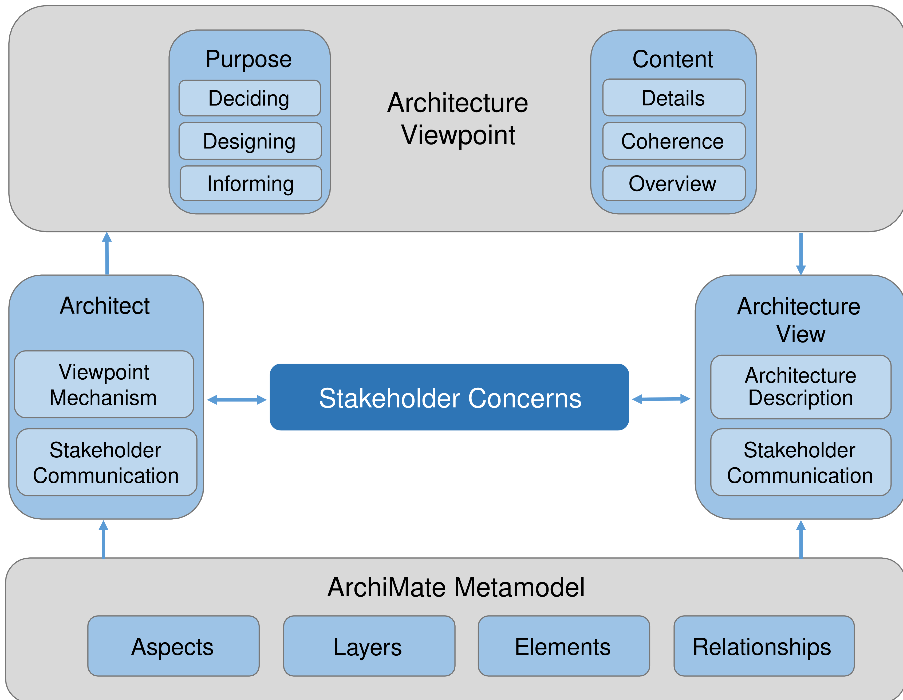

# Chapter 13. Stakeholder Architecture Views and Viewpoints

> 利益相关者、体系结构试图和观点

## 13.1. Introduction

Establishing and maintaining a coherent-一致的,团结一致的 Enterprise Architecture is clearly a complex task, because it involves many different people with differing backgrounds using various notations.

> 建立和维护一致的企业架构显然是一项复杂的任务，因为它涉及到许多具有不同背景、使用各种符号的不同人员。

In order to get a handle on this complexity, researchers have initially focused on the definition of architectural frameworks for classifying and positioning the various architectural descriptions with respect to each other (e.g., the Zachman framework [[5](https://pubs.opengroup.org/architecture/archimate3-doc/ch-Referenced-docs.html#Ref5)], [[8](https://pubs.opengroup.org/architecture/archimate3-doc/ch-Referenced-docs.html#Ref8)]).

> 为了掌握这种复杂性，研究人员最初集中在体系结构框架的定义上，用于分类和定位相对于彼此的各种体系结构描述(例如，Zachman 框架 [[5](https://pubs.opengroup.org/architecture/archimate3-doc/ch-Referenced-docs.html#Ref5)]， [[8](https://pubs.opengroup.org/architecture/archimate3-doc/ch-Referenced-docs.html#Ref8)]))。

Architecture frameworks provide general guidance to deliver Architecture Descriptions along with a process.

> 体系结构框架为交付体系结构描述和过程提供了一般指导。

The ArchiMate language, as a modeling notation, provides a detailed insight-洞悉,了解 into the structure and coherence of different architectures, so its use complements-补充,补足 and supports architecture frameworks.

> 作为一种建模符号，ArchiMate 语言提供了对不同体系结构的结构和一致性的详细洞察，因此它的使用补充并支持体系结构框架。

The ArchiMate language provides a flexible approach in which architects and other stakeholders can use their own views on the Enterprise Architecture.

> ArchiMate 语言提供了一种灵活的方法，其中架构师和其他涉众可以使用他们自己对企业架构的看法。

In this approach, architecture views are specified-指定,明确指出 by architecture viewpoints.

> 在这种方法中，体系结构视图由体系结构视点指定。

Architecture viewpoints define abstractions on the set of models representing the Enterprise Architecture, each aimed at a particular type of stakeholder and addressing a particular set of concerns.

> 体系结构视点定义了代表企业体系结构的一组模型上的抽象，每个模型针对一种特定类型的涉众，并处理一组特定的关注点。

Viewpoints can be used to view certain aspects in isolation-孤立,隔离, and to relate two or more aspects.

> 视点可用于孤立地观察某些方面，并将两个或多个方面联系起来。

In the domain of Enterprise Architecture, the TOGAF framework describes a taxonomy-分类学,分类法 of architecture views for different categories of stakeholders.

> 在企业架构领域，TOGAF 框架为不同类别的涉众描述了架构视图的分类。

In addition to this description of views, the TOGAF framework also provides guidelines for the development and use of architecture viewpoints and views in Enterprise Architecture models.

> 除了对视图的描述之外，TOGAF 框架还为企业架构模型中架构视点和视图的开发和使用提供了指导方针。

The architecture viewpoints and views proposed by any of the above-mentioned frameworks should not be considered in isolation: views are inter-related and, often, it is exactly a combination-组合,结合,联合 of views together with their underlying inter-dependency-互相依赖 relationships that is the best way to describe and communicate a piece of architecture.

> 不应该孤立地考虑任何上述框架提出的体系结构视点和视图：视图是相互关联的，通常，正是视图及其潜在的相互依赖关系的组合是描述和交流体系结构的最佳方式。

It should, however, be noted that viewpoints and views have a limiting character.

> 但是，应当指出，观点和观点具有局限性。

They are eventually-最终,结果 a restriction-限制规定,限制法规 of the whole system (and architecture) to a partial-部分的,不完全的 number of aspects – a view is just a partial incomplete-不完整的,不完全的 depiction of the system.

> 它们最终将整个系统(和体系结构)限制在部分方面——视图只是系统的部分不完整描述。

## 13.2. Stakeholders and Concerns

> 利益相关者和关注点

This chapter introduces a method for using the ArchiMate language to systematically address stakeholder concerns, the *viewpoint mechanism*.

> 本章介绍了一种使用 ArchiMate 语言系统地处理涉众关注点的方法，即“视点机制”。

This viewpoint mechanism conforms-遵守,符合 to the ISO/IEC 42010 standard [[14](https://pubs.opengroup.org/architecture/archimate3-doc/ch-Referenced-docs.html#Ref14)], which provides a model for Architecture Description. 

> 这个视点机制符合ISO/IEC 42010标准 [[14](https://pubs.opengroup.org/architecture/archimate3-doc/ch-Referenced-docs.html#Ref14)] )，它为架构描述提供了一个模型。

Stakeholders, concerns, viewpoints, and views are important elements in this model, as depicted in [Figure 34](https://pubs.opengroup.org/architecture/archimate3-doc/ch-Motivation-Elements.html#fig-Motivation-Elements-Metamodel).

> 涉众、关注点、观点和视图是这个模型中的重要元素，如 [图114](https://pubs.opengroup.org/architecture/archimate3-doc/ch-Motivation-Elements.html#fig-Motivation-Elements-Metamodel) 所示。

**Figure 114. Conceptual Model of an Architecture Description [[14](https://pubs.opengroup.org/architecture/archimate3-doc/ch-Referenced-docs.html#Ref14)]**

> 图114 架构描述的概念模型 [[14](https://pubs.opengroup.org/architecture/archimate3-doc/ch-Referenced-docs.html#Ref14)]

The ArchiMate language with the viewpoint mechanism described in [Section 13.4](https://pubs.opengroup.org/architecture/archimate3-doc/ch-Stakeholders-Architecture-Views-and-Viewpoints.html#sec-Viewpoint-Mechanism) assists-帮助,协助 and guides the architect in definition and classification of governing-治理,统治,管理 viewpoints.

> 在 [第13.4节](https://pubs.opengroup.org/architecture/archimate3-doc/ch-Stakeholders-Architecture-Views-and-Viewpoints.html#sec-Viewpoint-Mechanism) 中描述的具有视点机制的 ArchiMate 语言帮助并指导架构师定义和分类治理视点。

The architect will use this mechanism in their work to construct and design views for stakeholder communication.

> 架构师将在他们的工作中使用这种机制来构建和设计涉众沟通的视图。

## 13.3. Architecture Views and Viewpoints

> 架构视图和视点

Architecture views are an ideal mechanism to purposefully-有目的地,自觉地 convey information about architecture areas.

> 架构视图是一种理想的机制，可以有目的地传递关于架构区域的信息。

In general, a view is defined as a part of an Architecture Description that addresses a set of related concerns and is tailored-定做的,迎合,使适应 for specific stakeholders.

> 通常，视图被定义为体系结构描述的一部分，该描述处理一组相关的关注点，并为特定的涉众量身定制。

A view is specified by means of an architecture viewpoint, which prescribes-规定,命令 the concepts, models, analysis techniques, and visualizations that are provided by the view.

> 视图是通过架构视点来指定的，架构视点规定了由视图提供的概念、模型、分析技术和可视化。

Simply put, a view is what you see, and a viewpoint is where you are looking from.

> 简单地说，view 是你所看到的，viewpoint 是你从哪里看。

An Architecture Description includes one or more architecture views.

> 体系结构描述包括一个或多个体系结构视图。

An architecture view (or simply “view”) addresses one or more of the concerns held by a stakeholder of the system.

> 架构视图(或者简单的“视图”)处理系统涉众所关注的一个或多个问题。

An architecture view expresses the architecture of the system of interest **in accordance-按照,依据 with**-与…一致 an architecture viewpoint (or simply “viewpoint”).

> 架构视图根据架构观点(或者简单的“观点”)表达感兴趣的系统的架构。

There are two aspects to a viewpoint: the concerns it frames for the stakeholders and the conventions-惯例,会议 it establishes on views.

> 一个观点有两个方面：它为利益相关者构建的关注点和它在观点上建立的惯例。

An architecture viewpoint frames-勾勒出 one or more concerns.

> 架构视点构建一个或多个关注点。

A concern can be framed by more than one viewpoint.

> 一个关注点可以由多个观点构成。

A view is governed-控制 by its viewpoint: the viewpoint establishes the conventions-协定 for constructing, interpreting-解释,说明, and analyzing the view to address concerns framed by that viewpoint.

> 视图由它的视点控制：视点建立了用于构造、解释和分析视图的约定，以处理由该视点构成的关注点。

Viewpoint conventions can include languages, notations, model kinds, design rules and/or modeling methods, analysis techniques, and other operations on views.

> 视点约定可以包括语言、符号、模型类型、设计规则和/或建模方法、分析技术，以及对视图的其他操作。

Architecture viewpoints are a means to focus on particular aspects and layers of the architecture.

> 体系结构视点是关注体系结构的特定方面和层的一种方法。

These aspects and layers are determined by the concerns of a stakeholder with whom communication takes place.

> 这些方面和层次是由与之进行沟通的涉众的关注点决定的。

What should and should not be visible from a specific viewpoint is therefore entirely dependent on the argumentation-论证 with respect to a stakeholder’s concerns.

> 因此，从一个特定的观点来看，什么应该和不应该是可见的完全取决于与涉众关注的相关的论证。

Viewpoints are designed for the purpose of communicating certain aspects and layers of an architecture.

> 视点的设计目的是为了交流体系结构的某些方面和层。

The communication enabled by a viewpoint can be strictly-严格地,严厉地 informative-提供有用信息的, but in general is bi-directional-双向的,双指向性.

> 视点支持的通信可以严格地提供信息，但通常是双向的。

The architect informs stakeholders, and stakeholders give their feedback (critique-评论 or consent-同意) on the presented aspects and layers.

> 架构师通知涉众，涉众就所呈现的方面和层给出他们的反馈(批评或同意)。

What is and what is not shown in an architecture view depends on the scope of the viewpoint and on what is relevant to the concerns of the stakeholder.

> 架构视图中显示的和不显示的内容取决于视点的范围以及与涉众的关注点相关的内容。

Ideally, these are the same; i.e., the viewpoint is designed with specific concerns of a stakeholder in mind.

> 理想情况下，它们是相同的；也就是说，视点的设计考虑了涉众的特定关注点。

Relevance-相关性,实用性 to a stakeholder’s concern, therefore, is the selection criterion-标准,准则 that is used to determine which elements and relationships are to appear in a view.

> 因此，与涉众关注的相关性是用于确定视图中出现哪些元素和关系的选择标准。

## 13.4. Viewpoint Mechanism

> 观点的机制

An architect is confronted-面对,面临 with many different types of stakeholders and concerns.

> 架构师面临许多不同类型的涉众和关注点。

To help in selecting the right viewpoints for the task at hand, we introduce a framework for the definition and classification of viewpoints: the *viewpoint mechanism*.

> 为了帮助为手头的任务选择正确的视点，我们引入了一个视点定义和分类的框架：视点机制。

The framework is based on two dimensions-方面: purpose and content.

> 该框架基于两个维度：目的和内容。

[Figure 115](https://pubs.opengroup.org/architecture/archimate3-doc/ch-Stakeholders-Architecture-Views-and-Viewpoints.html#fig-Framing-Stakeholder-Concerns-using-the-Viewpoint-Mechanism) shows how the viewpoint mechanism is used to create views addressing stakeholder concerns.

> [图115](https://pubs.opengroup.org/architecture/archimate3-doc/ch-Stakeholders-Architecture-Views-and-Viewpoints.html#fig-Framing-Stakeholder-Concerns-using-the-Viewpoint-Mechanism) 显示了如何使用视点机制来创建处理涉众关注点的视图。

**Figure 115. Framing Stakeholder Concerns using the Viewpoint Mechanism**

> 图115 使用视点机制构建涉众关注点

The architect communicates with the stakeholder to understand and document their concerns.

> 架构师与涉众沟通，以理解并记录他们的关注点。

The viewpoint mechanism is used to identify purpose and content and to help define and classify-把…分类 the viewpoint.

> 视点机制用于识别目的和内容，并帮助定义和分类视点。

The viewpoint governs-支配 the construction and design of the view.

> 视点支配着视点的构造和设计。

The view is a description of the architecture addressing stakeholder concerns and is governed by the viewpoint.

> 视图是处理涉众关注的体系结构的描述，并由视点管理。

Creating an ArchiMate viewpoint consists of two steps:

> 创建一个 ArchiMate 视点包括两个步骤:

1. Selecting a subset of relevant concepts (elements and relationships) from the ArchiMate metamodel, based on the information that is needed to address the stakeholder’s concerns.

   > 根据解决涉众关注的问题所需的信息，从 ArchiMate 元模型中选择相关概念(元素和关系)的子集。

2. Defining a representation to depict these concepts in a way that is understood by the stakeholders. This can be a diagram that uses standard or customized ArchiMate notation, a catalog-目录 of elements, a matrix showing the relationships between two groups of elements, or an entirely different visualization.

   > 定义一种表示，以涉众能够理解的方式描述这些概念。这可以是使用标准或定制的 ArchiMate 表示法的图表、元素目录、显示两组元素之间关系的矩阵，或者完全不同的可视化。

Applying this viewpoint to an architecture model means that those parts of the architecture are selected that match the chosen set of concepts (Step 1) and are depicted in the manner-方式 prescribed-规定 by Step 2.

> 将这个观点应用到体系结构模型中意味着体系结构的那些部分被选择来匹配所选择的概念集(步骤1)，并以步骤2规定的方式进行描述。

### 13.4.1. Defining and Classifying Viewpoints

> 视点的定义和分类

To help define and classify viewpoints based on a repeatable structure, the ArchiMate language assists the architect in selecting purpose and content relevant for the stakeholder’s concerns.

> 为了帮助定义和分类基于可重复结构的视点，ArchiMate语言帮助架构师选择与涉众关注的问题相关的目的和内容。

The purpose dimension-维度 is supported by the following three categories:

> 目的维度由以下三类支持:

- Designing: design viewpoints support architects and designers in the design process from initial sketch-草图 to detailed design.

  Typically, design viewpoints consist of diagrams.

  > 设计：设计观点支持建筑师和设计师在设计过程中从最初的草图到详细设计。 
  >
  > 通常，设计视点由图组成。

- Deciding: decision support viewpoints assist managers in the process of decision-making by offering insight into cross-domain architecture relationships, typically through projections-投影 and intersections-交叉 of underlying models, but also by means of analytical-分析的 techniques

  Typical examples are cross-reference tables, landscape-景观 maps, lists, and reports.

  > 决策：决策支持视点通过提供对跨领域架构关系的洞察(通常是通过底层模型的投影和交叉)，以及通过分析技术的手段，在决策过程中帮助管理人员。
  >
  > 典型的例子是交叉引用表、景观地图、列表和报告。

- Informing: informing viewpoints help to inform any stakeholder about the Enterprise Architecture, in order to achieve understanding, obtain commitment, and convince-说服,劝服 adversaries-敌手.

  Typical examples are illustrations-插图, animations-动画, cartoons-漫画, flyers-传单, etc.

  > 告知：告知观点有助于告知任何涉众关于企业架构的信息，以便获得理解，获得承诺，并说服对手。
  >
  > 典型的例子有插图、动画、漫画、传单等。

The content dimension-维度,方面 uses the ArchiMate Core Framework to select relevant aspects and layers.

> 内容维度使用 ArchiMate 核心框架来选择相关的方面和层。

This is supported by the following three categories:

> 这得到以下三类的支持：

- Details: views on the detailed level typically consider one layer and one aspect from the ArchiMate Core Framework.

  Typical stakeholders are a software engineer responsible for design and implementation of a software component or a process owner-所有者 responsible for effective and efficient process execution.

  > 细节：细节级别的视图通常考虑来自 ArchiMate 核心框架的一个层和一个方面。
  >
  > 典型的涉众是负责设计和实现软件组件的软件工程师，或者负责有效和高效执行过程的过程所有者。

- Coherence-连贯性: at the coherence abstraction level, multiple layers or multiple aspects are spanned.

  Extending the view to more than one layer or aspect enables the stakeholder to focus on architecture relationships like process-uses-system (multiple layer) or application-uses-object (multiple aspect). Typical stakeholders are operational managers responsible for a collection of IT services or business processes.

  > 连贯性：在连贯性抽象层面，跨越了多个层次或多个方面。
  >
  > 将视图扩展到多个层或方面，使涉众能够关注架构关系，如过程-使用-系统(多层)或应用程序-使用-对象(多层)。典型的涉众是负责 IT 服务或业务流程集合的运营经理。

- Overview: the overview abstraction level addresses both multiple layers and multiple aspects.

  Typically, such overviews are addressed to Enterprise Architects and decision-makers, such as CEOs and CIOs.

  > 概述：概述抽象级别涉及多个层和多个方面。
  >
  > 通常，这样的概述是针对企业架构师和决策者的，比如 CEO 和 CIOs。

### 13.4.2. Creating the View

> 创建视图

With a governing viewpoint, the architect can create and design a view.

> 通过控制视点，架构师可以创建和设计视图。

The view contains elements and relationships (concepts) from the ArchiMate metamodel.

> 视图包含来自 ArchiMate 元模型的元素和关系(概念)。

The architect can design and create an appropriate representation for these elements and relationships, suitable for the stakeholder(s) and concern(s) being framed.

> 架构师可以为这些元素和关系设计并创建一个合适的表示，适合于所构建的涉众和关注点。

The architect may use the profile mechanism described in [Section 14.1](https://pubs.opengroup.org/architecture/archimate3-doc/ch-Language-Customization-Mechanisms.html#sec-Adding-Attributes-to-ArchiMate-Concepts) to create representations based on attributes of elements and relationships; for example, to create color-coded heat maps.

> 架构师可以使用 [第14.1节](https://pubs.opengroup.org/architecture/archimate3-doc/ch-Language-Customization-Mechanisms.html#sec-Adding-Attributes-to-ArchiMate-Concepts) 中描述的配置文件机制来创建基于元素和关系属性的表示；例如，创建彩色编码的热图。

The view does not have to be visual or graphical in nature-本质.

> 视图本质上不一定是可视的或图形的。

## 13.5. Example Viewpoints

See [Appendix C](https://pubs.opengroup.org/architecture/archimate3-doc/ch-Example-Viewpoints.html) for a set of example viewpoints.

> 参见 [附录C](https://pubs.opengroup.org/architecture/archimate3-doc/ch-Example-Viewpoints.html) 获得一组示例视点。

