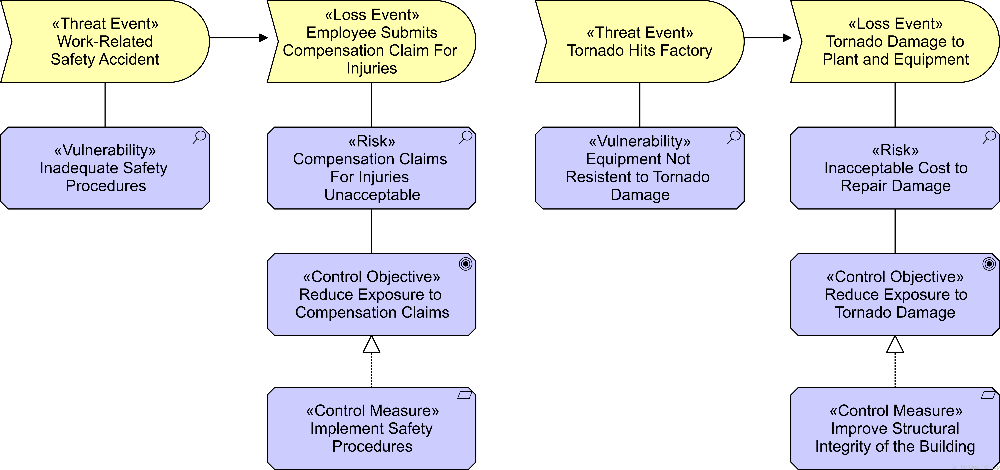

# Chapter 14. Language Customization-定制 Notation

> 语言定制表示法

Every specific purpose and usage of an architecture modeling language brings about its own specific demands on the language. 

> 体系结构建模语言的每个特定目的和用法都会对该语言产生特定的要求。

Yet, it should be possible to use a language for only a limited, though non-specific, modeling purpose.

> 然而，应该可以将一种语言仅用于有限的(尽管不是特定的)建模目的。

Therefore, the ArchiMate language, specified in the ArchiMate metamodel and described in [Chapter 4](https://pubs.opengroup.org/architecture/archimate3-doc/ch-Generic-Metamodel.html) to [Chapter 12](https://pubs.opengroup.org/architecture/archimate3-doc/ch-Implementation-and-Migration-Layer.html), contains only the basic elements and relationships that serve general Enterprise Architecture modeling purposes.

> 因此，在ArchiMate元模型中指定并在 [第4章 ](https://pubs.opengroup.org/architecture/archimate3-doc/ch-Generic-Metamodel.html)到 [第12章](https://pubs.opengroup.org/architecture/archimate3-doc/ch-Implementation-and-Migration-Layer.html) 中描述的ArchiMate语言，只包含服务于一般企业架构建模目的的基本元素和关系。

However, the language should also be able to facilitate, through customization[[1](https://pubs.opengroup.org/architecture/archimate3-doc/ch-Language-Customization-Mechanisms.html#_footnotedef_1)] mechanisms, specialized, or domain-specific purposes, such as:

> 然而，该语言还应该能够通过自定义[[1](https://pubs.opengroup.org/architecture/archimate3-doc/ch-Language-Customization-Mechanisms.html#_footnotedef_1)]机制)促进专门化或特定于领域的目的，例如:

- Support for specific types of model analysis

  > 支持特定类型的模型分析

- Support for the communication of architectures

  > 支持体系结构之间的通信

- Capture the specifics of a certain application domain (e.g., the financial sector)

  > 捕获特定应用程序领域的细节(例如，金融部门)

The argument behind this statement is to provide a means to allow customization of the language that is tailored-迎合,使适应 towards such specific domains or applications, without burdening-负担 the language with a lot of additional concepts and notations which most people would barely use.

> 这种说法背后的论点是提供一种方法，允许针对特定领域或应用程序定制语言，而不会给语言增加许多大多数人几乎不会使用的额外概念和符号的负担。

The remainder of this chapter is devoted to the customization mechanisms that are part of the ArchiMate language, and to a series of illustrative examples of such customizations.

> 本章的其余部分将专门讨论作为 ArchiMate 语言一部分的自定义机制，以及一系列此类自定义的说明性示例。

## 14.1. Adding Attributes to ArchiMate Concepts

> 添加属性到 ArchiMate 概念

As stated earlier in this standard, the ArchiMate language contains only the elements and relationships that are necessary for general architecture modeling.

> 正如本标准前面所述，ArchiMate语言只包含一般体系结构建模所必需的元素和关系。

However, users might want to perform model-based performance-性能,绩效 or cost calculations to attach supplementary information (textual, numerical, etc.) to the model concepts.

> 然而，用户可能希望执行基于模型的性能或成本计算，以便将补充信息(文本、数字等)附加到模型概念上。

Every concept in an ArchiMate model can have attributes attached to it.

> ArchiMate 模型中的每个概念都可以有附加的属性。

ArchiMate concepts can be enriched in a generic way with supplementary information by means of a “profiling-剖析研究,分析” specialization mechanism (see also [[9](https://pubs.opengroup.org/architecture/archimate3-doc/ch-Referenced-docs.html#Ref9)]).

> ArchiMate 概念可以通过“剖析”专门化机制(参见[9](https://pubs.opengroup.org/architecture/archimate3-doc/ch-Referenced-docs.html#Ref9)]))以一种通用的方式丰富补充信息。

A *profile* is a data structure which can be defined separately from the ArchiMate language but can be dynamically coupled with concepts; i.e., the user of the language is free to decide whether and when the assignment of a profile to a model concept is necessary.

> 配置文件是一种数据结构，它可以从 ArchiMate 语言中单独定义，但可以与概念动态耦合;也就是说，该语言的用户可以自由决定是否以及何时需要将概要文件分配给模型概念。

Profiles are specified as sets of typed attributes.

> 配置文件被指定为一组类型属性。

Each of these attributes may have a default value that can be changed by the user.

> 这些属性中的每一个都可能有一个默认值，用户可以对其进行更改。

Two types of profiles can be distinguished:

> 可以区分两种类型的配置文件:

- *Pre-defined profiles*: these are profiles that have a predefined attribute structure and can be implemented beforehand in any tool supporting the ArchiMate language

  > **预定义配置文件**：这些配置文件具有预定义的属性结构，可以事先在任何支持ArchiMate语言的工具中实现

  Examples of such profiles are sets of attributes for ArchiMate concepts that have to be specified in order to execute common types of analysis.

  > 此类配置文件的示例是 ArchiMate 概念的属性集，为了执行常见类型的分析，必须指定这些属性集。

- *User-defined profiles:* through a profile definition language, the user is able to define new profiles, thus extending the definition of ArchiMate elements or relationships with supplementary attribute sets.

  > **用户自定义配置文件**:通过配置文件定义语言，用户能够定义新的配置文件，从而扩展具有补充属性集的 ArchiMate 元素或关系的定义。

At least the following basic data types are allowed for these attributes:

> 这些属性至少允许以下基本数据类型：

- String
- Integer
- Real
- Boolean
- Currency
- Date
- URL

In addition, the following complex types are supported:

> 此外，还支持以下复杂类型:

- Structure, consisting of one or more fields of a basic type

  > 结构，由一个或多个基本类型的字段组成

- List, consisting of elements of one of the other types

  > 列表，由其他类型之一的元素组成

The ArchiMate Model Exchange File Format [[20](https://pubs.opengroup.org/architecture/archimate3-doc/ch-Referenced-docs.html#Ref20)] defines how these types are encoded-编码 and exchanged.

> ArchiMate模型交换文件格式[[20](https://pubs.opengroup.org/architecture/archimate3-doc/ch-Referenced-docs.html#Ref20)])定义了如何对这些类型进行编码和交换。

**Examples**

[Table 10](https://pubs.opengroup.org/architecture/archimate3-doc/ch-Language-Customization-Mechanisms.html#tbl-Profile-Examples) shows possible profiles with input attributes needed for certain types of cost and performance analysis of architecture models [[13](https://pubs.opengroup.org/architecture/archimate3-doc/ch-Referenced-docs.html#Ref13)].

> [表10](https://pubs.opengroup.org/architecture/archimate3-doc/ch-Language-Customization-Mechanisms.html#tbl-Profile-Examples) 显示了某些类型的架构模型的成本和性能分析所需的输入属性的可能配置文件[[13](https://pubs.opengroup.org/architecture/archimate3-doc/ch-Referenced-docs.html#Ref13)])。

Each “serving” relationship may have a weight (indicating the average number of uses);

> 每个“服务”关系可能有一个权重(表示平均使用次数);

each (business, application, or technology) “service” may have fixed and variable costs and an (average) service time;

> 每个(业务、应用程序或技术)“服务”可能具有固定和可变成本以及(平均)服务时间;

and each structure element (e.g., business role, business actor, application component, device) may have fixed and variable costs and a capacity.

> 并且每个结构元素(例如，业务角色、业务参与者、应用程序组件、设备)可能具有固定和可变的成本和容量。

**Table 10. Profile Examples**

| “Serving” Profile |      | “Service” Profile |          | “Structure Element” Profile |          |
| ----------------- | ---- | ----------------- | -------- | --------------------------- | -------- |
| Attribute         | Type | Attribute         | Type     | Attribute                   | Type     |
| Weight            | Real | Fixed cost        | Currency | Fixed cost                  | Currency |
|                   |      | Variable cost     | Currency | Variable cost               | Currency |
|                   |      | Service time      | Time     | Capacity                    | Integer  |

[Table 11](https://pubs.opengroup.org/architecture/archimate3-doc/ch-Language-Customization-Mechanisms.html#tbl-Relationship-Profile-Example) shows a generic profile that can be used to model cardinalities-基数 and role labels of relationships.

> [表11](https://pubs.opengroup.org/architecture/archimate3-doc/ch-Language-Customization-Mechanisms.html#tbl-Relationship-Profile-Example) 显示了一个通用的配置文件，它可用于为关系的基数和角色标签建模。

**Table 11. Relationship Profile Example**

| Cardinality and Relation Roles Profile |                                                              |
| -------------------------------------- | ------------------------------------------------------------ |
| Attribute                              | Type                                                         |
| ‘From’ cardinality                     | Structure (lower bound, upper bound), e.g. 0..0, 0..1, 0..**, 1..** |
| ‘To’ cardinality                       | Structure (lower bound, upper bound)                         |
| ‘From’ relation role                   | String                                                       |
| ‘To’ relation role                     | String                                                       |

## 14.2. Specialization of Concepts

> 概念专业化

Specialization is a simple and powerful way to define new elements or relationships based on the existing ones.

> 专业化是一种基于现有元素或关系定义新元素或关系的简单而强大的方法。

Specialized elements inherit-继承 the properties of their generalized elements (including the relationships that are allowed for the element), but some of the relationships that apply to the specialized element need not be allowed for the generalized element. 

> 专门化元素继承其一般化元素的属性(包括元素允许的关系)，但是一般化元素不允许应用于专门化元素的一些关系。

Also, new graphical notation could be introduced for a specialized concept, but preferably-最好是 with a resemblance-相似,相像 to the notation of the generalized concept; e.g., by adding an icon or other graphical marker, or changing the existing icon.

> 此外，新的图形符号可以为一个专门的概念引入，但最好与广义概念的符号相似；例如，通过添加图标或其他图形标记，或更改现有图标。

A specialized element or relationship strongly resembles-相似,相像 a stereotype-模式化的思想,老一套 as it is used in UML.

> 在UML中使用的专门化元素或关系与原型非常相似。

The stereotype notation with angled-角 brackets-括号 may also be used to denote a specialized concept.

> 带尖括号的原型符号也可以用来表示一个专门化的概念。

Finally, for a specialized concept, certain attributes may be predefined, as described in the previous section.

> 最后，对于专门化的概念，可以预先定义某些属性，如前一节所述。

Specialization of relationships is also allowed.

> 关系专业化也是允许的。

Similar to specialization of elements, a specialized relationship inherits-继承 all properties of its “parent” relationship, with possible additional restrictions-限制,约束.

> 与元素的专门化类似，专门化关系继承其“父”关系的所有属性，并可能有额外的限制。

For example, two specializations of the assignment relationship may be used to model responsibility *versus* accountability. 

> 例如，分配关系的两个专门化可以用来对责任与责任进行建模。

Another example is a specialization of the flow relationship to model material-物料 flow in a supply chain.

> 另一个例子是对流关系的专门化，以模拟供应链中的物料流。

Specialization of concepts provides extra flexibility as it allows organizations or individual users to customize the language to their own preferences and needs, while the underlying precise-精确的,准确的 definition of the concepts is preserved.

> 概念的专门化提供了额外的灵活性，因为它允许组织或个人用户根据自己的偏好和需求定制语言，同时保留了概念的底层精确定义。

This also implies-暗示,暗指,意味着 that analysis and visualization techniques developed for the ArchiMate language still apply when the specialized concepts are used.

> 这也意味着，当使用专门化的概念时，为 ArchiMate 语言开发的分析和可视化技术仍然适用。

Specialization of concepts is done by using the profile mechanism described in [Section 14.1](https://pubs.opengroup.org/architecture/archimate3-doc/ch-Language-Customization-Mechanisms.html#sec-Adding-Attributes-to-ArchiMate-Concepts).

> 概念的专门化是通过使用 [第14.1节](https://pubs.opengroup.org/architecture/archimate3-doc/ch-Language-Customization-Mechanisms.html#sec-Adding-Attributes-to-ArchiMate-Concepts) 中描述的配置文件机制来完成的。

The name of the profile is the name of the specialization, and it may have other attributes if relevant-有关的,相关的 to the specialization.

> 配置文件的名称是专门化的名称，如果与专门化相关，它可能具有其他属性。

The specialized concept is modeled by assigning such a profile to the general concept.

> 通过将这样一个配置文件分配给一般概念来对专门化概念进行建模。

The profile may also define a specific notation to denote the specialization.

> 配置文件还可以定义一个特定的符号来表示专门化。

The default is the guillemet notation of UML for stereotypes-构造型 (“«specialization name»”).

> 默认的是UML构造型的 guillemet 符号(“«专门化名称»”)。

Other options include specific icons, colors, fonts, or symbols.

> 其他选项包括特定的图标、颜色、字体或符号。

Note that multiple specialization profiles may be assigned to the same generalized-广义的,普遍的 concept; in the default notation, these are shown as a comma-separated list (“«specialization 1, specialization 2»”).

> 注意，多个专门化配置文件可以分配给相同的广义概念；在默认的表示法中，它们显示为逗号分隔的列表(“«特殊化1，特殊化2»”)。

### 14.2.1. Examples of Specializations of Business Layer Elements (Informative)

> 业务层元素专门化示例(参考资料)

Table 12 shows examples of specializations of Business Layer concepts.

> 表12显示了业务层概念专门化的示例。

**Table 12. Example Specializations of Business Layer Elements**

> 表12. 业务层元素专门化示例

| Parent Concept         | Specialized Concept                    | Description                                                  |
| ---------------------- | -------------------------------------- | ------------------------------------------------------------ |
| Business Actor         | Individual - 个人                      | A natural person capable of performing behavior in the context of an enterprise. 能够在企业环境中执行行为的自然人。 |
|                        | Organizational Unit - 组织单位         | Any named subdivision-分部 of an organization (e.g., a department). 组织中任何已命名的分支(如部门)。 |
|                        | Organization - 组织                    | An entity such as an institution-机构,团体, corporation-公司, or association-协会 that has a collective goal and is linked to an external environment. 具有共同目标并与外部环境相联系的实体，如机构、公司或协会。 |
|                        | Threat Agent - 威胁代理                | Anything (e.g., an object, substance, individual, or group) that is capable of acting against an asset in a manner that can result in harm. This can be intentional; i.e., an attacker, but also unintentional; e.g., a well-intentioned, but inept, computer operator who trashes a daily batch job by typing the wrong command. 任何(如物体、实体、个人或团体)能够以可能导致损害的方式对资产起作用的东西。这可能是有意为之;即，有攻击者，但也是无意的;例如，一个好心但不称职的计算机操作员，由于输入了错误的命令而破坏了每天的批处理作业。 |
| Business Service       | Business Decision 商业决策          | A conclusion that a business arrives at through business logic and which the business is interested in managing.  业务通过业务逻辑得出的结论，业务有兴趣对其进行管理。 |
| Business Collaboration | Social Network 社交网络             | A social structure made up of social actors (individuals or organizations) and the connections between these actors. 由社会行动者(个人或组织)和这些行动者之间的联系组成的社会结构。 |
| Business Process       | Business Activity                      | Atomic internal behavior element (at the considered abstraction level) that will not be decomposed-分解的 any further. 不会进一步分解的原子内部行为元素(在考虑的抽象级别)。 |
| Business Event         | Threat Event (Risk & Security Overlay) | Event with the potential to adversely impact an asset. An a*ttack* is a specific type of threat event that is the result of an intentional malicious-恶意的,恶毒的 activity of an attacker, which is a specific type of threat agent. 可能对资产产生不利影响的事件。攻击是一种特定类型的威胁事件，是攻击者故意恶意活动的结果，攻击者是一种特定类型的威胁代理。 |
|                        | Loss Event (Risk & Security Overlay)   | Any circumstance that causes a loss or damage to an asset. 造成资产损失或损坏的任何情况。 |

### 14.2.2. Examples of Specializations of Application Layer Elements (Informative)

> 应用层元素专门化示例(参考)

Table 13 shows examples of specializations of Application Layer elements.

> 表13 显示了应用层元素专门化的示例。

**Table 13. Example Specializations of Application Layer Elements**

> 表13. 应用层元素专门化示例

| Parent Concept        | Specialized Concept                            | Description                                                  |
| :-------------------- | :--------------------------------------------- | :----------------------------------------------------------- |
| Application Component | Logical Application Component 逻辑应用组件  | An encapsulation of application functionality that is independent of a particular implementation. 独立于特定实现的应用程序功能的封装。 |
|                       | Physical Application Component 物理应用组件 | An application, application module, application service, or other deployable component of functionality. 应用程序、应用程序模块、应用程序服务或其他可部署的功能组件。 |
| Application Interface | Application-to-Application Interface           | Interface that is used to communicate between application components. 用于在应用程序组件之间通信的接口。 |
|                       | Graphical User Interface 图形用户界面       | On-screen interface (GUI) with which a human user can interact with an application component. 屏幕上的界面(GUI)，人类用户可以通过它与应用程序组件进行交互。 |

### 14.2.3. Examples of Specializations of Technology Layer Elements (Informative)

> 技术层元素专门化的例子(参考资料)

Table 14 shows examples of specializations of Technology Layer elements.

> 表14 显示了Technology Layer元素专门化的示例。

**Table 14. Example Specializations of Technology Layer Elements**

> 表14 技术层元素专门化示例

| Parent Concept     | Specialized Concept                           | Description                                                  |
| :----------------- | :-------------------------------------------- | :----------------------------------------------------------- |
| Node               | Logical Technology Component 逻辑技术组件  | An encapsulation of technology infrastructure-基础设施 that is independent of a particular product. A class of technology product. 独立于特定产品的技术基础设施的封装。一类科技产品。 |
|                    | Physical Technology Component 物理技术组件 | A specific technology infrastructure product or technology infrastructure product instance. 特定的技术基础结构产品或技术基础结构产品实例。 |
| Device             | Mobile Device                                 | A portable-便携式的 device such as a smartphone or tablet. 便携式设备，如智能手机或平板电脑 |
|                    | Embedded Device                               | A computing device that is part of a piece of equipment. 计算机:作为设备一部分的计算设备 |
| Network            | Wi-Fi Network                                 | Wireless Local Area Network (WLAN). 无线局域网(WLAN)。    |
|                    | Wide Area Network                             | Long-range data communication network. 远程数据通信网络。 |
| Technology Service | Processing Service                            | Service used for processing data by a node. 用于节点处理数据的服务。 |
|                    | Storage Service                               | Service used for storing data on a node, typically offered by a database or file system. 用于在节点上存储数据的服务，通常由数据库或文件系统提供。 |
|                    | Communication Service                         | Service used for transporting information (e.g., voice, data) between nodes. 用于在节点之间传输信息(如语音、数据)的服务。 |

### 14.2.4. Examples of Specializations of Physical Elements (Informative)

> 物理元素专门化的例子(资料性)

Table 15 shows examples of specializations of physical elements.

> 表15 显示了物理元素专门化的示例。

**Table 15. Example Specializations of Physical Elements**

> 表15 物理元素专门化示例

| Parent Concept       | Specialized Concept | Description                                                  |
| :------------------- | :------------------ | :----------------------------------------------------------- |
| Equipment            | Vehicle             | A movable piece of equipment used for transportation purposes. 运输工具:用于运输目的的可移动设备 |
|                      | Train               | A vehicle intended for use on a rail-铁路系统 network. 火车:用于铁路网络的交通工具 |
| Facility             | Factory             | A large-scale physical resource used for receipt, temporary storage, and redistribution of goods. 一种大规模的物理资源，用于接收、临时储存和重新分配货物。 |
| Material             | Ore                 | Rock containing minerals, raw material in mining, and related industries. 含矿物的岩石，采矿和有关工业的原料。 |
|                      | Building Material   | Material used in building and construction such as concrete, bricks and mortar, beams, and girders, etc. 建筑材料用于建筑和建筑的材料，如混凝土、砖和砂浆、梁和梁等。 |
|                      | Fuel                | Material used as an energy source in, for example, production or transportation. 能源:在生产或运输中用作能源的材料 |
| Distribution Network | Rail Network        | Network for rail transport, on which trains are used. 铁路运输网络，火车在上面使用。 |
|                      | Energy Grid         | Network for distribution of energy, such as an electrical power grid or a gas distribution network. 能源分配网络，如电网或燃气分配网络。 |

### 14.2.5. Examples of Specializations of Motivation Elements (Informative)

> 动机要素专门化的例子(参考资料)

Table 16 shows examples of specializations of motivation elements.

> 表16 显示了动机元素专门化的例子。

**Table 16. Example Specializations of Motivation Elements**

> 表16 动机元素专门化示例

| Parent Concept          | Specialized Concept                                          | Description                                                  |
| :---------------------- | :----------------------------------------------------------- | :----------------------------------------------------------- |
| Driver                  | Metric 衡量标准,度规                                      | The extent, quantity, amount, or degree of something, as determined by measurement or calculation. 量:通过测量或计算确定的某物的范围、数量、数量或程度 |
| Assessment 评估,评价 | Vulnerability (Risk & Security Overlay) 漏洞(风险与安全覆盖) | The probability that an asset will be unable to resist-抵抗,抵制 the actions of a threat agent. 资产无法抵抗威胁代理人行动的概率。 |
|                         | Risk (Risk & Security Overlay-覆盖) 风险(风险与安全覆盖)  | The probable frequency and probable magnitude-规模,幅度 of future loss. 未来损失的可能频率和可能幅度。 |
| Goal                    | Business Objective                                           | A time-bound milestone for an organization used to demonstrate progress towards a goal. 一个有时间限制的里程碑，用于组织向目标展示进展情况。 |
|                         | Control Objective (Risk & Security Overlay) 控制目标(风险与安全叠加) | Aim or purpose of specified control measures which address the risks that these control measures are intended to mitigate. 特定控制措施的目的或目的，这些控制措施旨在减轻风险。 |
| Principle               | Business Policy                                              | A directive-指示,指令 that is not directly enforceable-可实施的, whose purpose is to govern or guide the enterprise. 一种不能直接执行的指令，其目的是管理或指导企业。 |
| Requirement             | Control Measure (Risk & Security Overlay) 控制措施(风险与安全叠加) | An action, device, procedure, or technique that reduces a threat, a vulnerability, or an attack by eliminating or preventing it, by minimizing the harm it can cause, or by discovering and reporting it so that corrective action can be taken. 通过消除或预防威胁、漏洞或攻击，通过将其可能造成的伤害最小化，或通过发现并报告以采取纠正措施来减少威胁、漏洞或攻击的一种行动、设备、程序或技术。 |
|                         | Business Rule                                                | An enforceable-可实施的,可强制执行的 directive intended to govern-统治,管理, guide, or influence business behavior. 管理、指导或影响商业行为的可强制执行的指令。 |

Example 36 illustrates the use of specializations of Business Layer and motivation elements to model the results of a risk analysis, and the control objectives and required control measures to mitigate the identified risks.

> 例36 说明了使用业务层和动机元素的专门化来对风险分析的结果、控制目标和所需的控制措施进行建模，以减轻已识别的风险。

This example uses the UML stereotype-原型 notation with angled brackets-括号 to denote specialized elements.

> 这个例子使用带有尖括号的UML原型符号来表示专门化的元素。

**Example 36: Specializations of Business Layer and Motivation Elements**

> 例36 业务层和动机元素的专门化

### 14.2.6. Examples of Specializations of Strategy Elements (Informative)

> 战略要素专门化的例子(参考资料)

Table 17 shows examples of specializations of strategy elements.

> 表17 显示了战略元素专门化的例子。

**Table 17. Example Specializations of Strategy Elements**

> 表17 策略元素的示例专门化

| Parent Concept               | Specialized Concept              | Description                                                  |
| :--------------------------- | :------------------------------- | :----------------------------------------------------------- |
| Capability 能力,才能      | Capability Increment 能力增加 | A specialization of a capability realized by a specific plateau or a state in the architecture that represents a stage in the evolution of that capability. 一个能力的专门化，由一个特定的平台或体系结构中的一个状态来实现，该体系结构代表了该能力发展的一个阶段。 |
| Course of Action 行动方案 | Strategy 战略                 | A high-level, broad-scope approach to achieve a long-term goal. 实现长期目标的高层次的、广泛的方法。 |
|                              | Tactic 战术                   | A narrow-scope approach to achieve a short-term goal, used to detail a strategy. 实现短期目标的一种小范围方法，用于细化战略。 |

### 14.2.7. Examples of Specializations of Implementation and Migration Elements (Informative)

> 实现和迁移元素的专门化示例(参考)

Table 18 shows examples of specializations of implementation and migration elements.

> 表18 显示了实现和迁移元素的专门化示例。

**Table 18. Example Specializations of Implementation and Migration Elements**

> 表18 实现和迁移元素的示例专门化

| Parent Concept | Specialized Concept | Description                                                  |
| :------------- | :------------------ | :----------------------------------------------------------- |
| Work Package   | Program             | A coordinated set of projects that deliver business benefits to the organization. 为组织提供业务利益的一组协调的项目。 |
|                | Project             | A time- and resource-bound activity that delivers specific business benefits to an organization. 为组织提供特定业务利益的受时间和资源限制的活动。 |

### 14.2.8. Examples of Specializations of Composite Elements (Informative)

> 组合元素专门化示例(参考资料)

Table 19 shows examples of specializations of compound elements. In addition to the specialization of single model elements, grouping can also be used to define specific compound elements.

> 表19 显示了复合元素专门化的示例。除了单个模型元素的专门化之外，分组还可以用于定义特定的复合元素。

**Table 19. Example Specializations of Composite Elements**

> 表19 复合元素的特化示例

| Parent Concept                                               | Specialized Concept                                          | Description                                                  |
| :----------------------------------------------------------- | :----------------------------------------------------------- | :----------------------------------------------------------- |
| Grouping                                                     | Risk Domain (Risk & Security Overlay) 风险域(风险与安全覆盖) | A domain consisting of entities that share one or more characteristics relevant to risk management or security. A risk domain is also a context or set of conditions that affects a risk exposure level. 由共享一个或多个与风险管理或安全相关的特征的实体组成的领域。风险域也是影响风险暴露水平的上下文或一组条件。 |
| Grouping of Application Component, Application Function, and Data Object | Data Store                                                   | A repository for persistently storing and managing collections of data. 用于持久存储和管理数据集合的存储库。 |

### 14.2.9. Examples of Specializations of Relationships and Relationship Connectors (Informative)

> 关系专门化和关系连接器的示例(参考)

Table 20 shows examples of specializations of relationships and relationship connectors.

> 表20 显示了关系专门化和关系连接器的示例。

**Table 20. Example Specializations of Relationships and Relationship Connectors**

> 表20 关系和关系连接器的示例专门化

| Parent Concept | Specialized Concept         | Description                                                  |
| :------------- | :-------------------------- | :----------------------------------------------------------- |
| Flow           | Money Flow                  | A flow of money between behavior elements. 行为元素之间的资金流动。 |
| Assignment     | Responsibilities Assignment | Assignment from a business actor to a business role. 从业务参与者到业务角色的分配。 |
|                | Behavior Assignment         | Assignment from an active structure to a behavior element. 从活动结构到行为元素的赋值。 |
| Or-junction    | Or-join                     | A junction with two or more incoming triggering and one outgoing triggering relationship, representing that at least one of the incoming relationships must be triggered to trigger the outgoing one. 具有两个或多个传入触发和一个传出触发关系的连接点，表示必须触发至少一个传入关系才能触发传出关系。 |

