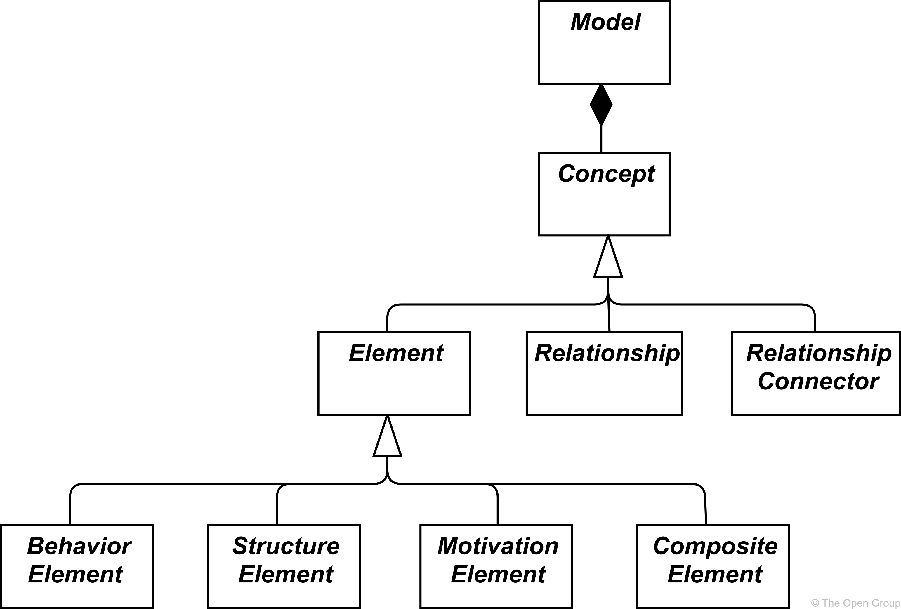
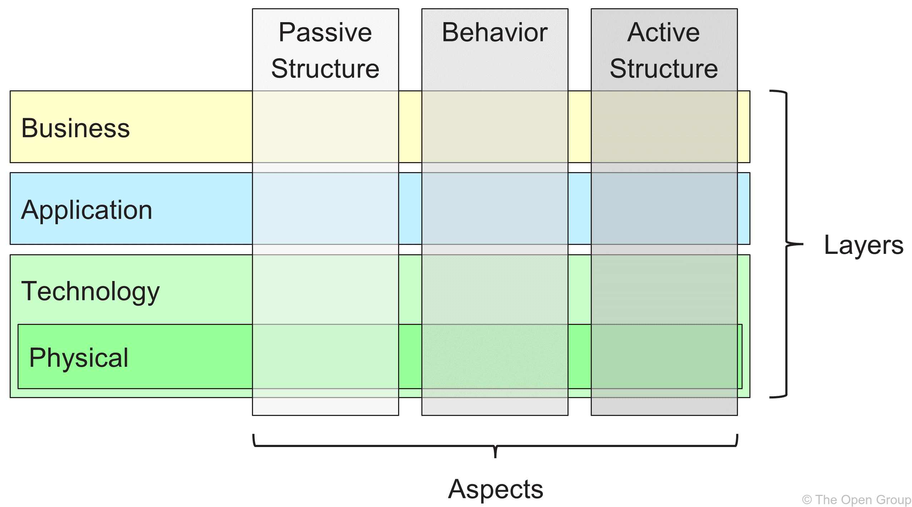

> Chapter 3. Language Structure
>
> 语言结构

# 3. Language Structure

> 语言结构

This chapter describes the structure of the ArchiMate Enterprise Architecture modeling language.

> 本章描述了 ArchiMate 企业架构建模语言的结构。

The detailed definition and examples of its standard set of elements and relationships follow in [Chapter 4](https://pubs.opengroup.org/architecture/archimate3-doc/ch-Generic-Metamodel.html) to [Chapter 12](https://pubs.opengroup.org/architecture/archimate3-doc/ch-Implementation-and-Migration-Layer.html).

> 在  [Chapter 4](https://pubs.opengroup.org/architecture/archimate3-doc/ch-Generic-Metamodel.html)  到 [Chapter 12](https://pubs.opengroup.org/architecture/archimate3-doc/ch-Implementation-and-Migration-Layer.html) 中详细介绍了其标准元素和关系的定义和示例。

## 3.1. Language Design Considerations-注意事项

> 语言设计注意事项

A key challenge in the development of a general metamodel for Enterprise Architecture is to strike a balance between the specificity of languages for individual architecture domains and a very general set of architecture concepts, which reflects a view of systems as a mere-仅仅,只不过 set of inter-related entities.

> 在为企业架构开发通用元模型的过程中，一个关键的挑战是在各个体系结构领域的语言的特殊性和一组非常通用的体系结构概念之间取得平衡，这反映了系统仅仅是一组相互关联的实体的观点。

The design of the ArchiMate language started from a set of relatively generic concepts.

> ArchiMate 语言的设计从一组相对通用的概念开始。

These have been specialized-专门研究 towards application at different architectural layers, as explained in the following sections.

> 这些特性专门针对不同架构层的应用程序，如下面的部分所述。

The most important design restriction-限制,约束 on the language is that it has been explicitly-现实地,清楚明确地,直截了当地 designed to be as small as possible, but still usable for most Enterprise Architecture modeling tasks.

> 该语言最重要的设计限制是，它被显式地设计得尽可能小，但仍然可用于大多数企业架构建模任务。

Many other languages try to accommodate-满足,适应 the needs of all possible users.

> 许多其他语言试图满足所有可能用户的需求。

In the interest of simplicity of learning and use, the ArchiMate language has been limited to the concepts that suffice-足够,足以 for modeling the proverbial-众所周知的 80% of practical-真实的,实际的 cases.

> 为了学习和使用的简单性，ArchiMate 语言被限制在足以对 80% 的实际情况建模的概念上。

This standard does not describe the detailed rationale-基本原理,根本原因,逻辑依据 behind the design of the ArchiMate language.

> 这个标准没有详细描述 ArchiMate 语言设计背后的基本原理。

The interested reader is referred to [[1](https://pubs.opengroup.org/architecture/archimate3-doc/ch-Referenced-docs.html#Ref1)], [[2](https://pubs.opengroup.org/architecture/archimate3-doc/ch-Referenced-docs.html#Ref2)], and [[3](https://pubs.opengroup.org/architecture/archimate3-doc/ch-Referenced-docs.html#Ref3)], which provide a detailed description of the language construction and design considerations.

> 感兴趣的读者可以参考 [[1](https://pubs.opengroup.org/architecture/archimate3-doc/ch-Referenced-docs.html#Ref1)] 、[[2](https://pubs.opengroup.org/architecture/archimate3-doc/ch-Referenced-docs.html#Ref2)] 和 [[3](https://pubs.opengroup.org/architecture/archimate3-doc/ch-Referenced-docs.html#Ref3)] ，它们提供了语言构造和设计注意事项的详细描述。

## 3.2. Top-Level Language Structure

> 顶层语言结构

Figure 1 outlines the top-level hierarchical-层次 structure of the language:

> 图1 概述了该语言的顶层层次结构:

- A model is a collection of *concepts* – a concept is either-或者,要么 an *element* or a *relationship*

	> 模型是“概念”的集合 —— 一个概念要么是“元素”，要么是“关系”

- An element is either a behavior element, a structure element, a motivation element, or a composite element

	> 元素可以是行为元素、结构元素、动机元素或组合元素

Note that these are *abstract* concepts; they are not intended to be used directly in models.

> 注意，这些都是“抽象”的概念；它们不打算在模型中直接使用。

To signify this, they are depicted-描述,描绘 in white-白色 with labels-标签 in italics-斜体字,斜体.

> 为了表示这一点，它们用白色表示，标签用斜体表示。

See [Chapter 4](https://pubs.opengroup.org/architecture/archimate3-doc/ch-Generic-Metamodel.html) for an explanation of the notation-符号 used in [Figure 1](https://pubs.opengroup.org/architecture/archimate3-doc/ch-Language-Structure.html#fig-Top-Level-Hierarchy-of-ArchiMate-Concepts).

> 参见 [第4章](https://pubs.opengroup.org/architecture/archimate3-doc/ch-Generic-Metamodel.html)，了解 [图1](https://pubs.opengroup.org/architecture/archimate3-doc/ch-Language-Structure.html#fig-Top-Level-Hierarchy-of-ArchiMate-Concepts) 中使用的符号的解释。

**Figure 1. Top-Level Hierarchy-层次结构,等级制度 of ArchiMate Concepts**

> 图1 ArchiMate 概念的顶层层次结构

## 3.3. Layering of the ArchiMate Language

> ArchiMate 语言的分层

The ArchiMate core language defines a structure of generic elements and their relationships, which can be specialized-专门化 in different layers.

> ArchiMate 核心语言定义了通用元素及其关系的结构，可以在不同的层中进行专门化。

Three layers are defined within the ArchiMate core language as follows:

> 在 ArchiMate 核心语言中定义了以下三个层:

1. The *Business Layer* depicts-描述,描绘 business services offered to customers, which are realized in the organization by business processes performed by business actors.

	> **业务层**描述提供给客户的业务服务，这些服务在组织中由业务参与者执行的业务流程实现。

2. The *Application Layer* depicts-描述,描绘 application services that support the business, and the applications that realize them.

	> **应用层**描述了支持业务的应用程序服务，以及实现这些服务的应用程序。

3. The *Technology Layer* comprises-包括,包含 both information and operational technology. You can model, for example, processing, storage, and communication-通信 technology in support of the application world and Business Layers, and model operational or physical technology with facilities-设施,设备, physical equipment, materials, and distribution networks.

	> **技术层**包括信息技术和操作技术。例如，您可以对支持应用程序世界和业务层的处理、存储和通信技术进行建模，并对使用设施、物理设备、材料和分布网络的操作或物理技术进行建模。

The general structure of models within the different layers is similar.

> 不同层中模型的一般结构是相似的。

The same types of elements and relationships are used, although their exact-确切的,精确的 nature and granularity-粒度 differ.

> 使用相同类型的元素和关系，尽管它们的确切性质和粒度不同。

In the next chapter, the structure of the generic-泛型,一般的,通用的 metamodel is presented.

> 下一章给出了泛型元模型的结构。

In [Chapter 8](https://pubs.opengroup.org/architecture/archimate3-doc/ch-Business-Layer.html), [Chapter 9](https://pubs.opengroup.org/architecture/archimate3-doc/ch-Application-Layer.html), and [Chapter 10](https://pubs.opengroup.org/architecture/archimate3-doc/ch-Technology-Layer.html) these elements are specialized-专门化 to obtain-得到,获得 elements specific-特定的 to a particular layer.

> 在 [第8章](https://pubs.opengroup.org/architecture/archimate3-doc/ch-Business-Layer.html)， [第9章](https://pubs.opengroup.org/architecture/archimate3-doc/ch-Application-Layer.html) 和 [第10章](https://pubs.opengroup.org/architecture/archimate3-doc/ch-Technology-Layer.html) 中，这些元素被专门化以获得特定于特定层的元素。

In alignment with service-orientation, the most important relationship between layers is formed by “serving”[[1](https://pubs.opengroup.org/architecture/archimate3-doc/ch-Language-Structure.html#_footnotedef_1)] relationships, which show how the elements in one layer are served by the services of other layers.

> 与面向服务一致，层之间最重要的关系是通过“服务”[[1](https://pubs.opengroup.org/architecture/archimate3-doc/ch-Language-Structure.html#_footnotedef_1)]关系形成的，它显示了一个层中的元素如何由其他层的服务提供服务。

(Note, however, that services need not only serve elements in another layer, but also can serve elements in the same layer.)

> (但是，请注意，服务不仅需要为另一层中的元素提供服务，而且还可以为同一层中的元素提供服务。)

A second type of link is formed by realization relationships: elements in lower layers may realize comparable elements in higher layers; 

> 第二种链接是由实现关系形成的:较低层次的元素可以实现较高层次的可比元素;

e.g.

> 例如

 a “data object” (Application Layer) may realize a “business object” (Business Layer);

> 一个“数据对象”(应用层)可以实现一个“业务对象”(业务层);

or an “artifact” (Technology Layer) may realize either a “data object” or an “application component” (Application Layer).

> 或者“工件”(技术层)可以实现“数据对象”或“应用程序组件”(应用层)。

## 3.4. The ArchiMate Core Framework

The ArchiMate Core Framework is a framework of nine cells-单元 used to classify elements of the ArchiMate core language.

> ArchiMate核心框架是一个由九个单元组成的框架，用于对ArchiMate核心语言的元素进行分类。

It is made up of three aspects and three layers, as illustrated in Figure 2.

> 它由三个方面和三个层组成，如图2所示。

This is known as the ArchiMate Core Framework.

> 这被称为ArchiMate核心框架。

It is important to understand that the classification of elements based on aspects and layers is only a global one.

> 重要的是要理解基于方面和层的元素分类只是一个全局分类。

Real-life architecture elements need not strictly-严格地,严厉地 be confined-限制,局限 to one aspect or layer because elements that link the different aspects and layers, play a central role in a coherent architectural description.

> 现实生活中的体系结构元素不需要严格地局限于一个方面或层，因为连接不同方面和层的元素在连贯的体系结构描述中起着中心作用。

For example, running somewhat ahead of the later conceptual-概念的,观念的 discussions, business roles serve as intermediary-中间的,过渡的 elements between “purely-完全地,仅仅 behavioral” elements and “purely structural” elements, and it may depend on the context whether a certain piece of software is considered to be part of the Application Layer or the Technology Layer.

> 例如，在稍后的概念讨论之前，业务角色充当“纯行为”元素和“纯结构”元素之间的中介元素，并且可能取决于上下文，某个软件块是被认为是应用层的一部分还是技术层的一部分。

**Figure 2. ArchiMate Core Framework**

> 图2 ArchiMate 核心框架

The structure of the framework allows for modeling of the enterprise from different viewpoints, where the position within the cells highlights the concerns-关注点 of the stakeholder.

> 框架的结构允许从不同的角度对企业进行建模，其中单元中的位置突出了涉众的关注点。

A stakeholder typically can have concerns that cover multiple cells.

> 涉众通常可以有覆盖多个单元的关注点。

The dimensions of the framework are as follows:

> 框架的尺寸如下:

- Layers – the three levels at which an enterprise can be modeled in ArchiMate – Business, Application, and Technology (as described in [Section 3.3](https://pubs.opengroup.org/architecture/archimate3-doc/ch-Language-Structure.html#sec-Layering-of-the-ArchiMate-Language))

	> 层 —— 企业可以在ArchiMate中建模的三个层次-业务，应用和技术(如[3.3节](https://pubs.opengroup.org/architecture/archimate3-doc/ch-Language-Structure.html#sec-Layering-of-the-ArchiMate-Language)中所述)

- Aspects:

	> 方面：

	- The *Active Structure Aspect*, which represents the structural elements (the business actors, application components, and devices that display actual behavior; i.e., the “subjects” of activity)

		> **活动结构方面**，它表示结构元素(业务参与者、应用程序组件和显示实际行为的设备);即活动的“主体”)

	- The *Behavior Aspect*, which represents the behavior (processes, functions, events, and services) performed by the actors; structural elements are assigned to behavioral elements, to show who or what displays the behavior

		> **行为方面**，表示参与者执行的行为(过程、功能、事件和服务);结构元素被分配给行为元素，以显示谁或什么显示了行为

	- The *Passive-被动的 Structure Aspect*, which represents the objects on which behavior is performed; these are usually information objects in the Business Layer and data objects in the Application Layer, but they may also be used to represent physical objects

		> **被动结构方面**，表示在其上执行行为的对象;这些对象通常是业务层中的信息对象和应用层中的数据对象，但它们也可以用来表示物理对象

		These three aspects were inspired by natural language where a sentence-句子 has a subject-主语 (active structure), a verb-动词 (behavior), and an object (passive structure). By using the same constructs that people are used to in their own languages, the ArchiMate language is easier to learn and read.

		> 这三个方面是受自然语言的启发，一个句子有主语(主动结构)、动词(行为)和宾语(被动结构)。通过使用人们在自己的语言中习惯使用的相同结构，阿祖马特语言更容易学习和阅读。

		Since ArchiMate notation-符号 is a *graphical* language where elements are organized spatially-空间地, this order is of no consequence-结果,后果 in modeling.

		> 由于 ArchiMate 表示法是一种“图形”语言，其中元素是按空间组织的，因此这种顺序在建模中没有任何影响。

A composite element, as shown in [Figure 1](https://pubs.opengroup.org/architecture/archimate3-doc/ch-Language-Structure.html#fig-Top-Level-Hierarchy-of-ArchiMate-Concepts), is an element that does not necessarily fit in a single aspect (column) of the framework but may combine two or more aspects.

> 复合元素，如图1所示，是一种不一定适合框架的单个方面(列)，但可以结合两个或更多方面的元素。

Note that the ArchiMate language does not require the modeler to use any particular layout-布局,设计 such as the structure of this framework; it is merely-仅仅,只 a categorization of the language elements.

> 请注意，ArchiMate 语言不要求建模者使用任何特定的布局，比如这个框架的结构;它仅仅是对语言元素的分类。

## 3.5. The ArchiMate Full Framework

> ArchiMate 完整框架

The ArchiMate Full Framework, as described in this version of the standard, adds a number of layers and an aspect to the Core Framework.

> 正如这个版本的标准所描述的那样，ArchiMate 完整框架在核心框架的基础上增加了许多层和一个方面。

The physical elements are included in the Technology Layer for modeling physical facilities-设施 and equipment, distribution networks, and materials.

> 物理元素包含在技术层中，用于对物理设施和设备、分销网络和材料进行建模。

As such, these are also core elements.

> 因此，这些也是核心元素。

The strategy-战略 elements are introduced-引入 to model strategic-战略 direction and choices.

> 引入战略要素对战略方向和战略选择进行建模。

They are described in [Chapter 7](https://pubs.opengroup.org/architecture/archimate3-doc/ch-Strategy-Layer.html).

> 它们在 [第七章](https://pubs.opengroup.org/architecture/archimate3-doc/ch-Strategy-Layer.html) 中有描述。

The motivation aspect is introduced at a generic level in the next chapter and described in detail in [Chapter 6](https://pubs.opengroup.org/architecture/archimate3-doc/ch-Motivation-Elements.html).

> 动机方面将在下一章进行一般性介绍，并在 [第6章](https://pubs.opengroup.org/architecture/archimate3-doc/ch-Motivation-Elements.html) 中进行详细描述。

The implementation and migration elements are described in [Chapter 12](https://pubs.opengroup.org/architecture/archimate3-doc/ch-Implementation-and-Migration-Layer.html).

> 实现和迁移元素在 [第12章](https://pubs.opengroup.org/architecture/archimate3-doc/ch-Implementation-and-Migration-Layer.html) 中有描述。

The resulting ArchiMate Full Framework is shown in Figure 3.

> 最终的 ArchiMate 完整框架 如图3 所示。

**Figure 3. ArchiMate Full Framework**

> ArchiMate 完整框架

The ArchiMate language does not define a specific layer for information; however, elements from the passive structure aspect such as business objects, data objects, and artifacts are used to represent information entities.

> ArchiMate 语言没有为信息定义一个特定的层；然而，来自被动结构方面的元素(如业务对象、数据对象和工件)用于表示信息实体。

Information modeling is supported across the different ArchiMate layers.

> 跨不同的 ArchiMate 层支持信息建模。

## 3.6. Abstraction in the ArchiMate Language

> ArchiMate 语言中的抽象

The structure of the ArchiMate language accommodates-包含,考虑到,顾及 several familiar-熟悉的,常见的 forms of abstraction and refinement.

> ArchiMate 语言的结构包含几种常见的抽象和细化形式。

First of all, the distinction-区别,区分 between an external (black-box, abstracting from the contents of the box) and internal (white-box) view is common in systems design.

> 首先，外部(黑盒，从盒子的内容中抽象出来)和内部(白盒)视图之间的区别在系统设计中很常见。

The external view depicts-描述,描绘 what the system has to do for its environment, while the internal view depicts-描述,描绘 how it does this.

> 外部视图描述了系统必须为其环境做些什么，而内部视图描述了它如何做到这一点。

Second, the distinction between behavior and active structure is commonly used to separate what the system must do and how the system does it from the system constituents-组成的,构成的 (people, applications, and infrastructure) that do it.

> 其次，行为和活动结构之间的区别通常用于将系统必须做什么以及系统如何做这些事情与执行这些事情的系统组成部分(人员、应用程序和基础设施)分开。

In modeling new systems, it is often useful to start with the behaviors that the system must perform, while in modeling existing systems, it is often useful to start with the people, applications, and infrastructure that comprise-构成,组成 the system, and then analyze in detail the behaviors performed by these active structures.

> 在对新系统建模时，从系统必须执行的行为开始通常是有用的，而在对现有系统建模时，从组成系统的人员、应用程序和基础设施开始通常是有用的，然后详细分析由这些活动结构执行的行为。

A third distinction is between conceptual-概念的,观念的, logical-逻辑（上）的,合乎逻辑的, and physical abstraction levels. 

> 第三个区别是概念抽象层次和物理抽象层次之间的区别。

This has its roots-根源 in data modeling: conceptual elements represent the information the business finds relevant; logical elements provide logical structure to this information for manipulation-操作,处理 by information systems; physical elements describe the storage of this information; for example, in the form of files or database tables.

> 这源于数据建模:概念元素表示业务认为相关的信息;逻辑元素为这些信息提供逻辑结构，供信息系统操作;物理元素描述了这些信息的存储;例如，以文件或数据库表的形式。

In the ArchiMate language, this corresponds with business objects, data objects, and artifacts, along with the realization-实现 relationships between them.

> 在ArchiMate语言中，这对应于业务对象、数据对象和工件，以及它们之间的实现关系。

The distinction between logical and physical elements has also been **carried over**-延续 to the description of applications.

> 逻辑和物理元素之间的区别也被延续到应用程序的描述中。

The TOGAF Enterprise Metamodel [[4](https://pubs.opengroup.org/architecture/archimate3-doc/ch-Referenced-docs.html#Ref4)] includes a set of entities that describe business, data, application, and technology components and services to describe architecture-体系结构 concepts.

> TOGAF企业元模型[[4](https://pubs.opengroup.org/architecture/archimate3-doc/ch-Referenced-docs.html#Ref4)])包括一组描述业务、数据、应用程序和技术组件的实体，以及描述体系结构概念的服务。

Logical components are implementation or product-independent-独立于产品 encapsulations-封装,包装 of data or functionality, whereas-但是,然而 physical components are tangible software components, devices, etc.

> 逻辑组件是数据或功能的实现或独立于产品的封装，而物理组件是有形的软件组件、设备等。

This distinction is captured-体现 in the TOGAF framework in the form of Architecture Building Blocks (ABBs) and Solution Building Blocks (SBBs).

> 这种区别在TOGAF框架中以体系结构构建块(ABBs)和解决方案构建块(sbb)的形式体现出来。

This distinction is again useful in progressing-进步,进展 Enterprise Architectures from high-level, abstract descriptions to tangible, implementation-level designs.

> 这种区别在将企业架构从高级的、抽象的描述推进到实际的、实现级的设计时也很有用。

Note that building blocks may contain multiple elements, which are typically modeled using the grouping concept in the ArchiMate language.

> 请注意，构建块可能包含多个元素，这些元素通常使用 ArchiMate 语言中的分组概念进行建模。

The ArchiMate language has three ways of modeling such abstractions.

> ArchiMate 语言有三种对这种抽象建模的方法。

First, as described in [[6](https://pubs.opengroup.org/architecture/archimate3-doc/ch-Referenced-docs.html#Ref6)], behavior elements such as application and technology functions can be used to model logical components, since they represent implementation-independent encapsulations-封装,包装 of functionality.

> 首先，正如 [[6](https://pubs.opengroup.org/architecture/archimate3-doc/ch-Referenced-docs.html#Ref6)] 中所描述的，行为元素(如应用程序和技术功能)可以用来对逻辑组件建模，因为它们代表了独立于实现的功能封装。

The corresponding physical components can then be modeled using active structure elements such as application components and nodes, assigned to the behavior elements.

> 然后可以使用分配给行为元素的活动结构元素(如应用程序组件和节点)对相应的物理组件进行建模。

Second, the ArchiMate language supports the concept of realization.

> 其次，ArchiMate 语言支持实现的概念。

This can best be described by working with the Technology Layer upwards-向上,在上部.

> 这可以通过向上使用技术层来最好地描述。

The Technology Layer defines the physical artifacts and software that realize an application component.

> 技术层定义实现应用程序组件的物理构件和软件。

It also provides a mapping to other physical concepts such as devices, networks, etc. needed for the realization of an information system.

> 它还提供了到其他物理概念(如设备、网络等)的映射。需要实现一个信息系统。

The realization relationship is also used to model more abstract kinds of realization, such as that between a (more specific) requirement and a (more generic) principle, where fulfillment-实现 of the requirement implies adherence to the principle.

> 实现关系还用于为更抽象的实现类型建模，例如(更具体的)需求和(更一般的)原则之间的关系，其中需求的实现意味着对原则的遵守。

Realization is also allowed between application components and between nodes.

> 在应用程序组件之间和节点之间也允许实现。

This way you can model a physical application or technology component realizing a logical application or technology component, respectively-分别地,依次地.

> 通过这种方式，您可以分别对实现逻辑应用程序或技术组件的物理应用程序或技术组件进行建模。

Third, logical and physical application components can be defined as metamodel-level specializations-专业,专业化 of the application component element, as described in [Chapter 14](https://pubs.opengroup.org/architecture/archimate3-doc/ch-Language-Customization-Mechanisms.html) (see also the examples in [Section 14.2.2](https://pubs.opengroup.org/architecture/archimate3-doc/ch-Language-Customization-Mechanisms.html#sec-Examples-of-Specializations-of-Application-Layer-Elements-Informative)).

> 第三，逻辑和物理应用组件可以定义为应用组件元素的元模型级专门化，如 [第14章](https://pubs.opengroup.org/architecture/archimate3-doc/ch-Language-Customization-Mechanisms.html) 所述 (参见 [第14.2.2节](https://pubs.opengroup.org/architecture/archimate3-doc/ch-Language-Customization-Mechanisms.html#sec-Examples-of-Specializations-of-Application-Layer-Elements-Informative) 中的示例)。

The same holds for the logical and physical technology components of the TOGAF Content Metamodel, which can be defined as specializations of the node element (see [Section 14.2.3](https://pubs.opengroup.org/architecture/archimate3-doc/ch-Language-Customization-Mechanisms.html#sec-Examples-of-Specializations-of-Technology-Layer-Elements-Informative)).

> TOGAF内容元模型的逻辑和物理技术组件也是如此，它们可以被定义为节点元素的专门化(参见 [第14.2.3节](https://pubs.opengroup.org/architecture/archimate3-doc/ch-Language-Customization-Mechanisms.html#sec-Examples-of-Specializations-of-Technology-Layer-Elements-Informative) )。

The ArchiMate language intentionally-故意地,有意地 does not support a difference between types and instances.

> ArchiMate 语言有意不支持类型和实例之间的差异。

At the Enterprise Architecture abstraction level, it is more common to model types and/or exemplars rather than instances. 

> 在企业架构抽象级别，更常见的是对类型和/或范例建模，而不是对实例建模。

Similarly, a business process in the ArchiMate language does not describe an individual instance (i.e., one execution of that process).

> 类似地，使用 ArchiMate 语言的业务流程不描述单个实例(即，该流程的一次执行)。

In most cases, a business object is therefore-因此,所以 used to model an object type (*cf.* a UML®) class), of which several instances may exist within the organization.

> 因此，在大多数情况下，业务对象用于对对象类型建模。(一个UML®)类)，其中的几个实例可能存在于组织中。

For instance, each execution of an insurance application process may result in a specific instance of the insurance policy business object, but that is not modeled in the Enterprise Architecture.

> 例如，保险应用程序流程的每次执行都可能导致保险策略业务对象的特定实例，但在企业体系结构中没有对其进行建模。

## 3.7. Concepts and their Notation-符号

> 概念及其符号

The ArchiMate language separates-分离,分开的 the language concepts (i.e., the constituents of the metamodel) from their notation.

> ArchiMate 语言将语言概念(即元模型的组成部分)与其符号分离开来。

Different stakeholder groups may require different notations in order to understand an architecture model or view.

> 为了理解架构模型或视图，不同的涉众组可能需要不同的符号。

In this respect-方面,, the ArchiMate language differs from languages such as UML or BPMN™, which have only one standardized notation.

> 在这方面，ArchiMate语言与UML或BPMN™等语言不同，后者只有一种标准化的符号。

The viewpoint-视点,观点 mechanism-机制 explained in [Chapter 13](https://pubs.opengroup.org/architecture/archimate3-doc/ch-Stakeholders-Architecture-Views-and-Viewpoints.html) provides the means for defining such stakeholder-oriented visualizations.

> 在 [第13章](https://pubs.opengroup.org/architecture/archimate3-doc/ch-Stakeholders-Architecture-Views-and-Viewpoints.html) 中解释的视点机制提供了定义这种面向涉众的可视化的方法。

Although the notation of the ArchiMate concepts-概念,观念 can (and should) be stakeholder-specific, the standard provides one common-通用的 graphical notation which can be used by architects and others who develop ArchiMate models.

> 尽管 ArchiMate 概念的表示法可以(也应该)是特定于涉众的，但是标准提供了一种通用的图形表示法，架构师和开发 ArchiMate 模型的其他人可以使用它。

This notation-符号,表示法 is targeted towards an audience used to existing technical modeling techniques such as Entity Relationship Diagrams (ERDs), UML, or BPMN, and therefore resembles-像,与…相似 them.

> 这种表示法针对的是使用现有技术建模技术(如实体关系图、UML 或 BPMN)的受众，因此与它们相似。

In the remainder-剩余部分 of this document, unless-除非 otherwise noted, the symbols used to depict-描述,描绘 the language concepts represent the ArchiMate standard notation.

> 在本文档的其余部分中，除非另有说明，用于描述语言概念的符号表示 ArchiMate 标准符号。

This standard notation for most elements consists of a box with an icon in the upper-right corner-角.

> 大多数元素的标准表示法包括一个右上角带有图标的框。

In several cases, this icon by itself may also be used as an alternative notation.

> 在某些情况下，这个图标本身也可以用作替代符号。

This standard iconography should be preferred-优先的,首选,更喜爱 whenever possible so that anyone knowing the ArchiMate language can read the diagrams produced in the language.

> 任何可能的情况下，都应该优先使用这种标准的图像，这样任何了解阿祖马特语言的人都可以阅读用该语言制作的图表。

## 3.8. Use of Nesting

Nesting-嵌套 elements inside other elements can be used as an alternative graphical notation to express some relationships.

> 在其他元素中嵌套元素可以用作表达某些关系的替代图形符号。

This is explained in more detail in [Chapter 5](https://pubs.opengroup.org/architecture/archimate3-doc/ch-Relationships-and-Relationship-Connectors.html) and in the definition of each of these relationships.

> 这在 [第5章](https://pubs.opengroup.org/architecture/archimate3-doc/ch-Relationships-and-Relationship-Connectors.html) 和这些关系的定义中有更详细的解释。

## 3.9. Use of Colors and Notational-符号 Cues

> 使用颜色和符号提示

In the metamodel pictures within this standard, shades of grey are used to distinguish elements belonging to the different aspects of the ArchiMate framework, as follows:

> 在本标准的元模型图片中，使用灰色阴影来区分属于 ArchiMate 框架的不同方面的元素，如下：

- White for abstract (i.e., non-instantiable) concepts

	> 白色表示抽象(即，不可实例化)概念

- Light grey for passive-被动的,消极的 structures

	> 浅灰色为被动结构

- Medium grey for behavior

	> 中灰色代表行为

- Dark grey for active structures

	> 活动结构为深灰色

In ArchiMate models, there are no formal semantics-语义的,语义学的 assigned to colors and the use of color is **left to**-留给 the modeler.

> 在 ArchiMate 模型中，没有分配给颜色的正式语义，颜色的使用留给建模者。

However, they can be used freely to stress-强调 certain aspects in models.

> 但是，可以自由地使用它们来强调模型中的某些方面。

For instance, in many of the example models presented in this standard, colors are used to distinguish between the layers of the ArchiMate Core Framework, as follows:

> 例如，在本标准提供的许多示例模型中，使用颜色来区分 ArchiMate 核心框架的层，如下所示:

- Yellow for the Business Layer

	> 黄色表示业务层

- Blue for the Application Layer

	> 蓝色表示应用层

- Green for the Technology Layer

	> 绿色表示技术层

They can also be used for visual emphasis; see [Chapter 6](https://pubs.opengroup.org/architecture/archimate3-doc/ch-Motivation-Elements.html) in [[1](https://pubs.opengroup.org/architecture/archimate3-doc/ch-Referenced-docs.html#Ref1)].

> 它们也可以用于视觉强调；参见 [[1](https://pubs.opengroup.org/architecture/archimate3-doc/ch-Referenced-docs.html#Ref1)] 中的 [第6章](https://pubs.opengroup.org/architecture/archimate3-doc/ch-Motivation-Elements.html) 。

In addition to the colors, other notational cues can be used to distinguish between the layers of the framework.

> 除了颜色之外，还可以使用其他符号线索来区分框架的层。

A letter M, S, B, A, T, P, or I in the top-left corner of an element can be used to denote a Motivation, Strategy, Business, Application, Technology, Physical, or Implementation & Migration element, respectively-分别地,依次地.

> 元素左上角的字母M、S、B、A、T、P或I可分别用于表示动机、战略、业务、应用程序、技术、物理或实现与迁移元素。

An example of this notation is depicted in [Example 34](https://pubs.opengroup.org/architecture/archimate3-doc/ch-Relationships-Between-Core-Layers.html#ex-Cross-Layer-Relationships).

> [例34](https://pubs.opengroup.org/architecture/archimate3-doc/ch-Relationships-Between-Core-Layers.html#ex-Cross-Layer-Relationships) 描述了这种表示法的一个例子。

The standard notation also uses a convention-约定,协定 with the shape of the corners of its symbols for different element types, as follows:

> 对于不同的元素类型，标准表示法还使用了符号角的形状约定，如下所示:

- Square corners are used to denote-标志,表示 structure elements

	> 方角用来表示结构元素

- Round corners are used to denote-标志,表示 behavior elements

	> 圆角用于表示行为元素

- Diagonal-对角的 corners are used to denote-标志,表示 motivation elements

	> 对角角用来表示动机元素

