# 4. Generic Metamodel

> 通用的元模型

> [!NOTE]
>
> The relationships shown in the metamodel figures-图形 are not to be confused with ArchiMate relationships. They are metamodel relationships expressing the structure of the language rather than a model in the language.
>
> > 元模型图中显示的关系不要与 ArchiMate 关系混淆。它们是表达语言结构的元模型关系，而不是语言中的模型。

## 4.1. Behavior and Structure Elements

> 行为和结构元素

The main hierarchy of behavior and structure elements of the ArchiMate language is presented in the metamodel fragment-碎片,片段 of [Figure 4](https://pubs.opengroup.org/architecture/archimate3-doc/ch-Generic-Metamodel.html#fig-Hierarchy-of-Behavior-and-Structure-Elements).

> ArchiMate 语言的行为和结构元素的主要层次结构呈现在 [图4](https://pubs.opengroup.org/architecture/archimate3-doc/ch-Generic-Metamodel.html#fig-Hierarchy-of-Behavior-and-Structure-Elements) 的元模型片段中。

It defines these elements in a generic, layer-independent way.

> 它以一种通用的、独立于层的方式定义这些元素。

Note that most of these elements (the white boxes) are *abstract* metamodel elements; i.e., these are not instantiated in models but only **serve to**-用来,起...作用 structure the metamodel.

> 请注意，这些元素(白框)中的大多数都是抽象元模型元素；也就是说，它们不会在模型中实例化，而只是用于构建元模型。

The notation presented in this chapter is therefore the generic way in which the specializations of these elements (i.e., the elements of the different architecture layers) are depicted.

> 因此，本章中呈现的符号是描述这些元素(即不同体系结构层的元素)的专门化的通用方式。

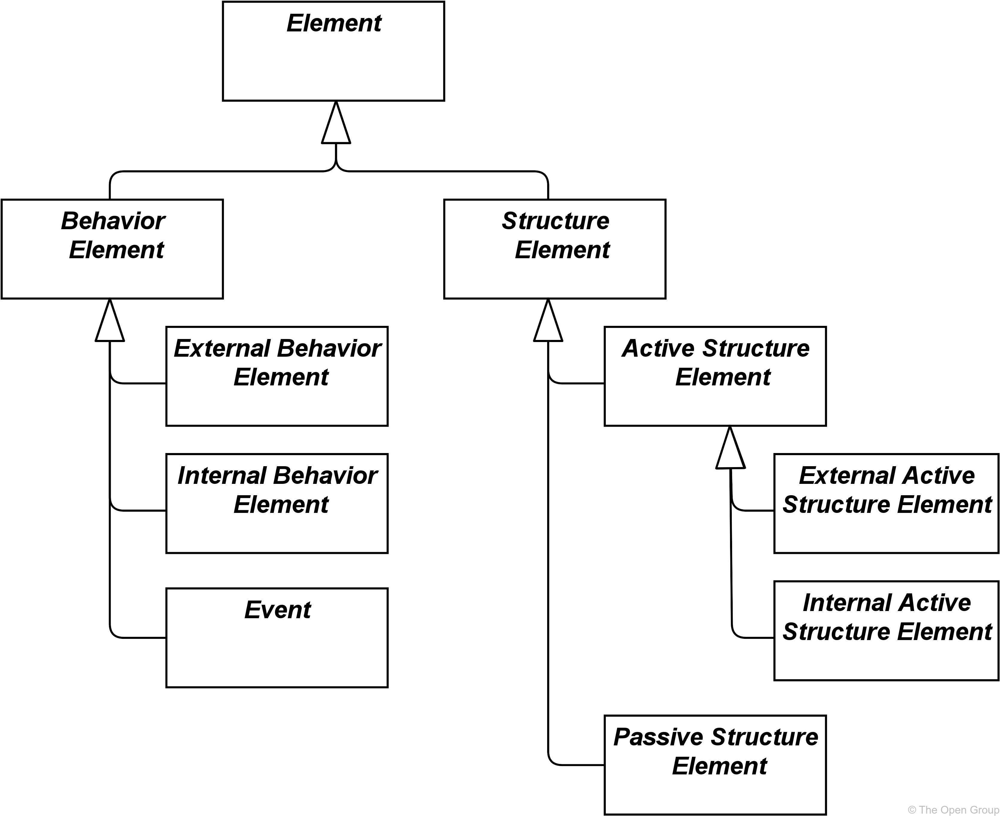

**Figure 4. Hierarchy-层次结构 of Behavior and Structure Elements**

> 图4. 行为和结构元素的层次结构

This generic metamodel fragment consists of two main types of elements: *structure* (“nouns-名词”) and *behavior* elements (“verbs-动词”).

> 这个通用元模型片段由两种主要类型的元素组成:*结构*(“名词”)和*行为*元素(“动词”)。

Structure elements can be subdivided-细分,再分 into *active structure* elements and *passive structure* elements.

> 结构要素可细分为主动结构元素和被动结构元素。

Active structure elements can be further subdivided into *external* active structure elements (also called *interfaces*) and *internal* active structure elements.

> 主动结构元素可以进一步细分为**外部**主动结构元素(也称为**接口**)和**内部**主动结构元素。

Behavior elements can be subdivided-细分,再分 into *internal behavior* elements, *external behavior* elements (also called *services*), and *events*.

> 行为元素可以细分为**内部行为**元素、**外部行为**元素(也称为**服务**)和**事件**。

[Figure 5](https://pubs.opengroup.org/architecture/archimate3-doc/ch-Generic-Metamodel.html#fig-Behavior-and-Structure-Elements-Metamodel) specifies the main relationships between the behavior and structure elements defined above.

> [图5](https://pubs.opengroup.org/architecture/archimate3-doc/ch-Generic-Metamodel.html#fig-Behavior-and-Structure-Elements-Metamodel) 指定了上面定义的行为和结构元素之间的主要关系。

For an explanation of the different types of relationships see [Chapter 5](https://pubs.opengroup.org/architecture/archimate3-doc/ch-Relationships-and-Relationship-Connectors.html).

> 有关不同类型关系的解释，请参见 [第5章](https://pubs.opengroup.org/architecture/archimate3-doc/ch-Relationships-and-Relationship-Connectors.html)。

In this and other metamodel figures, the label of a relationship signifies-表达,表示 the role of the source element in the relationship;

> 在这个和其他元模型图中，关系的标签表示源元素在关系中的角色;

e.g. - 例如, a service serves an internal behavior element.

> 例如：服务服务于内部行为元素。

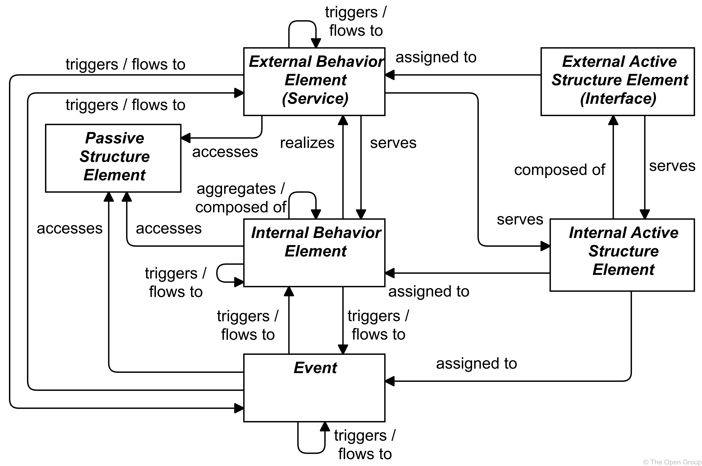

**Figure 5. Behavior and Structure Elements Metamodel**

> 图5 行为和结构元素元模型

 

> [!NOTE]
>
> This figure-图形 does not show all permitted-批准,许可 relationships; every element in the language can have composition, aggregation, and specialization relationships to elements of the same type. Furthermore-此外,而且, there are indirect-间接的,非直接的 relationships that can be derived-推导,衍生, as explained in [Section 5.7](https://pubs.opengroup.org/architecture/archimate3-doc/ch-Relationships-and-Relationship-Connectors.html#sec-Derivation-of-Relationships). The full specification of permitted relationships can be found in [Appendix B](https://pubs.opengroup.org/architecture/archimate3-doc/ch-relationships-Normative.html).
>
> > 此图并未显示所有允许的关系；语言中的每个元素都可以与相同类型的元素具有组合、聚合和专门化关系。此外，还可以推导出间接关系，如 [第5.7节](https://pubs.opengroup.org/architecture/archimate3-doc/ch-Relationships-and-Relationship-Connectors.html#sec-Derivation-of-Relationships) 所述。允许关系的完整规范可以在 [附录B](https://pubs.opengroup.org/architecture/archimate3-doc/ch-relationships-Normative.html) 中找到。

> [!NOTE]
>
> This figure is to be read as a generic template for the layers of the ArchiMate core (see [Section 3.4](https://pubs.opengroup.org/architecture/archimate3-doc/ch-Language-Structure.html#sec-The-ArchiMate-Core-Framework)), but is not applied directly. Each layer defines its own specialized version of this.
>
> > 这个图是作为 ArchiMate 核心层的通用模板来读取的(参见[Section 3.4](https://pubs.opengroup.org/architecture/archimate3-doc/ch-Language-Structure.html#sec-The-ArchiMate-Core-Framework))，但不直接应用。每一层都定义了它自己的特殊版本。

### 4.1.1. Active Structure Elements

> 主动结构元素

Active structure elements are the subjects-主体 that can perform behavior.

> 主动结构元素是能够执行行为的主体。

These can be subdivided into internal active structure elements; i.e., the business actors, application components, nodes, etc., that realize this behavior, and external active structure elements; i.e., the interfaces that expose-暴露 this behavior to the environment. An interface provides an external view on the service provider and hides its internal structure.

> 这些可细分为**内部主动结构元素**；例如，实现此行为的业务参与者、应用程序组件、节点等，以及**外部活动结构元素**；例如，向环境暴露此行为的接口。接口提供服务提供者的外部视图，并隐藏其内部结构。

An internal active structure element represents an entity that is capable of performing behavior.

> 内部活动结构元素表示能够执行行为的实体。

Active structure elements are denoted-标志,表示 using boxes with square corners and an icon in the upper-right corner, or by the icon on its own.

> 活动结构元素使用带有方角的方框和右上角的图标来表示，或者使用单独的图标来表示。

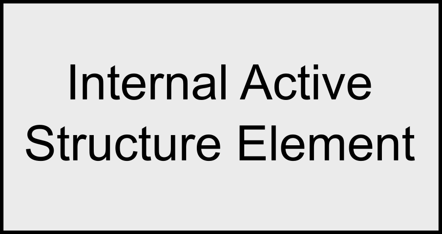

**Figure 6. Generic Internal Active Structure Element Notation**

> 图6 通用内部活动结构元素表示法

An external active structure element, called an interface, represents a point of access where one or more services are provided to the environment.

> 称为接口的外部主动结构元素表示向环境提供一个或多个服务的访问点。

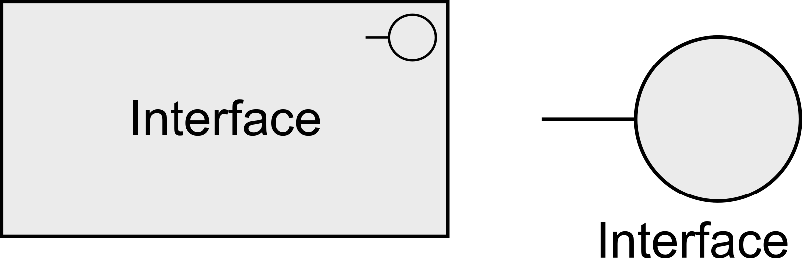

**Figure 7. Generic External Active Structure Elements (Interface) Notation**

> 图7 通用外部活动结构元素(接口)符号

### 4.1.2. Behavior Elements

> 行为元素

Behavior elements represent the dynamic aspects of the enterprise-企业,事业. Similar to active structure elements, behavior elements can be subdivided into *internal* behavior elements and *external* behavior elements; i.e., the services that are exposed to the environment.

> 行为元素表示企业的动态方面。与活动结构元素类似，行为元素可细分为**内部**行为元素和**外部**行为元素；即，向环境公开的服务。

An internal behavior element represents a unit of activity that can be performed by one or more active structure elements.

> 内部行为元素表示可以由一个或多个主动结构元素执行的活动单元。

Behavior elements are denoted in the standard iconography using boxes with round corners and an icon in the upper-right corner, or by the icon on its own.

> 行为元素在标准图标中使用带有圆角的方框和右上角的图标来表示，或者单独使用图标来表示。

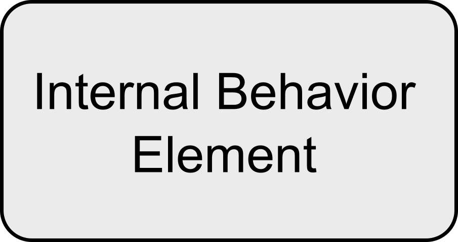

**Figure 8. Generic Internal Behavior Element Notation**

> 图8 通用内部行为元素符号

An external behavior element, called a service, represents an explicitly-清楚明确地,直截了当地 defined exposed behavior.

> 外部行为元素(称为服务)表示显式定义的公开行为。

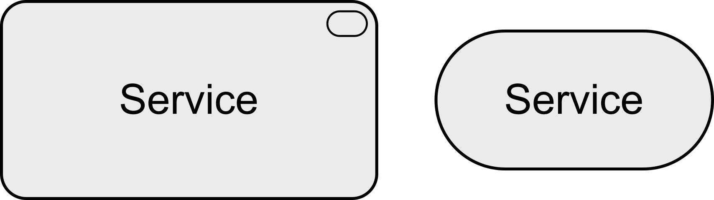

**Figure 9. Generic External Behavior Element (Service) Notation**

> 图9 通用外部行为元素(服务)符号

Thus-因此,这样, a service is the externally visible behavior of the providing system, from the perspective of systems that use that service; the environment consists of everything outside this providing system.

> 因此，从使用该服务的系统的角度来看，服务是提供系统的外部可见行为；环境由提供系统之外的一切组成。

The value offered to the user of the service provides the motivation for the existence of the service.

> 提供给服务用户的价值提供了服务存在的动机。

For the users, only this exposed behavior and value, together with non-functional aspects such as the quality of service, costs, etc., are relevant.

> 对于用户来说，只有这种暴露的行为和价值，以及服务质量、成本等非功能方面是相关的。

These can be specified-指定 in a contract or Service-Level Agreement (SLA).

> 这些可以在合同或服务水平协议(SLA)中指定。

Services are accessible through interfaces.

> 服务可以通过接口访问。

In addition to this, a third type of behavior element is defined to denote an event that can occur; for example, to signal a state change.

> 除此之外，还定义了第三种类型的行为元素来表示可能发生的**事件**；例如，发出状态更改的信号。

An event represents a state change.

> 事件表示状态变化。

An event may have a time attribute that indicates the moment or moments at which the event happens. For example, this can be used to model time schedules.

> 事件可能有一个时间属性，用来指示事件发生的时刻。例如，这可以用来为时间计划建模。

**Figure 10. Generic Event Notation**

> 图10 通用事件表示法

### 4.1.3. Passive Structure Elements

> 被动结构元素

Passive structure elements can be accessed by behavior elements.

> 被动结构元素可以通过行为元素访问。

A passive structure element represents an element on which behavior is performed.

> 被动结构元素表示在其上执行行为的元素。

A passive structure element is a structural element that cannot perform behavior.

> 被动结构元素是不能执行行为的结构元素。

Active structure elements can perform behavior on passive structure elements.

> 主动结构元素可以对被动结构元素执行行为。

Passive structure elements are often information or data objects, but they can also represent physical objects.

> 被动结构元素通常是信息或数据对象，但它们也可以表示物理对象。

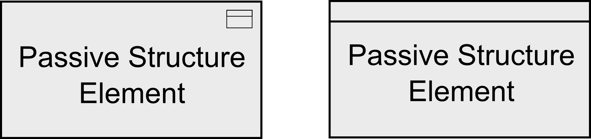

**Figure 11. Generic Passive Structure Element Notation**

> 图11 通用被动结构元素表示法

## 4.2. Specializations of Structure and Behavior Elements

> 结构和行为元素的专业化

The specializations of core elements are summarized in [Figure 12](https://pubs.opengroup.org/architecture/archimate3-doc/ch-Generic-Metamodel.html#fig-Specializations-of-Core-Elements). Within each layer, it is permitted to use composition and aggregation relationships between processes, functions, and interactions; e.g., a process can be composed of other processes, functions, and/or interactions-相互交互,相互作用.

> 核心元素的专门化总结在 [图12](https://pubs.opengroup.org/architecture/archimate3-doc/ch-Generic-Metamodel.html#fig-Specializations-of-Core-Elements) 中。在每一层中，允许在流程、功能和交互之间使用组合和聚合关系;例如，一个过程可以由其他过程、功能和/或相互作用组成。

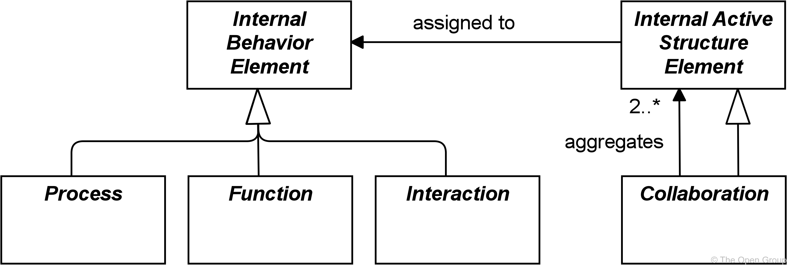

**Figure 12. Specializations of Core Elements**

> 图12 核心元素专业化

For individual internal behavior elements, a distinction is made between processes and functions.

> 对于单个内部行为元素，要区分过程和功能。

A process represents a sequence of behaviors that achieves a specific-具体的,特定的 result.

> 流程表示实现特定结果的一系列行为。

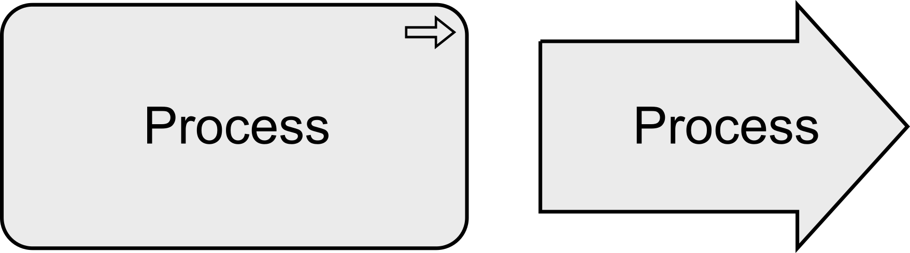

**Figure 13. Generic Process Notation**

> 图13 通用过程符号

A function represents a collection of behavior based on specific criteria, such as required resources, competencies-能力, or location, and is managed, performed, or implemented as a whole.

> 功能表示基于特定标准的行为集合，例如所需的资源、能力或位置，并且作为一个整体进行管理、执行或实现。

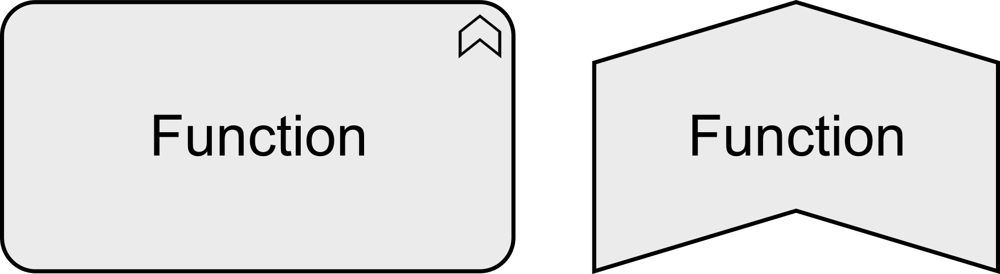

**Figure 14. Generic Function Notation**

> 图14 通用函数符号

Internal behavior elements can be composed of or aggregate other internal behavior elements, as shown in [Figure 5](https://pubs.opengroup.org/architecture/archimate3-doc/ch-Generic-Metamodel.html#fig-Behavior-and-Structure-Elements-Metamodel).

> 内部行为元素可以由其他内部行为元素组成或聚合，如 [图5](https://pubs.opengroup.org/architecture/archimate3-doc/ch-Generic-Metamodel.html#fig-Behavior-and-Structure-Elements-Metamodel) 所示。

This means, for instance, that processes can be composed of functions and **vice versa**-反之亦然.

> 这意味着，例如，进程可以由函数组成，反之亦然。

The collective nature of a behavior can be modeled either implicitly-含蓄地 (several active structure elements assigned to the same internal behavior via an *and* junction) or explicitly through the use of a collective internal behavior element, interaction, that is performed by (a collaboration of) multiple active structure elements.

> 行为的集体性可以隐式建模(通过 and 连接将几个主动结构元素分配给相同的内部行为)，也可以通过使用一个集体内部行为元素——交互(interaction)——显式建模，这是由多个主动结构元素(协作)执行的。

An interaction represents a unit of collective behavior that must be performed by two or more internal active structure elements, either-或者,要么 assigned directly or aggregated in a collaboration.

> 交互表示必须由两个或多个内部主动结构元素执行的集体行为单元，这些元素可以是直接分配的，也可以是在协作中聚合的。

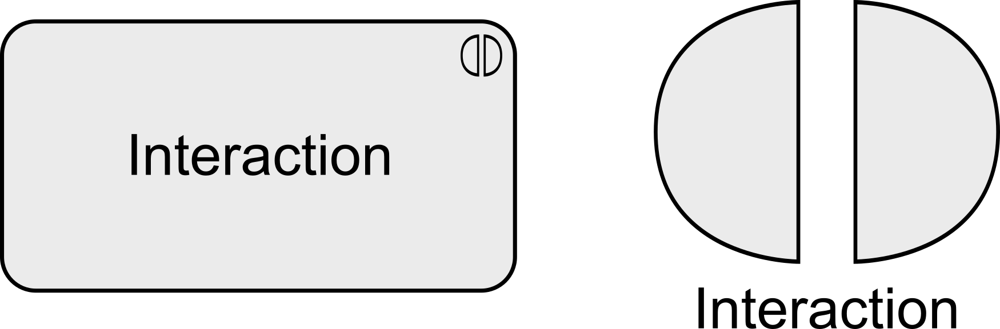

**Figure 15. Generic Interaction Notation**

> 图15 通用交互符号

A collaboration represents an aggregate of two or more internal active structure elements, working together to perform some collective behavior.

> 协作表示两个或多个内部主动结构元素的集合，它们一起工作以执行一些集体行为。

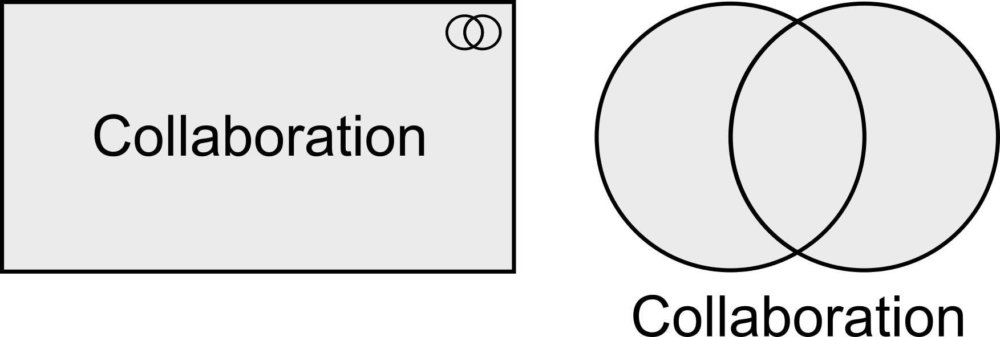

## 4.3. Summary of Structure and Behavior Elements

> 结构和行为要素概述

[Table 1](https://pubs.opengroup.org/architecture/archimate3-doc/ch-Generic-Metamodel.html#tbl-Core-Elements) gives an overview of the core elements, their definitions, and their default graphical notation.

> [表1](https://pubs.opengroup.org/architecture/archimate3-doc/ch-Generic-Metamodel.html#tbl-Core-Elements) 概述了核心元素、它们的定义和默认的图形符号。

But note that most of these elements are abstract; they are not used in models but only their descendants-派生物,衍生物 in the different layers of the ArchiMate language.

> 但请注意，这些元素大多是抽象的；它们不在模型中使用，而只在 ArchiMate 语言中的不同层次中使用它们的派生物。

**Table 1. Core Elements**

> 核心元素

| **Element**                                   | Specializations | Definition                                                   | Notation                                                     |
| --------------------------------------------- | --------------- | ------------------------------------------------------------ | ------------------------------------------------------------ |
| **Active Structure**                          |                 |                                                              |                                                              |
| Internal Active Structure Element             |                 | Represents an entity that is capable of performing behavior. |  |
|                                               | Collaboration   | Represents an aggregate of two or more internal active structure elements, working together to perform some collective behavior. 表示两个或多个内部活动结构元素的集合，它们一起工作以执行某些集体行为。 |  |
| Interface (External Active Structure Element) |                 | Represents a point of access where one or more services are exposed to the environment. 表示向环境公开一个或多个服务的访问点。 |  |
|                                               |                 |                                                              |                                                              |
| **Behavior**                                  |                 |                                                              |                                                              |
| Internal Behavior Element                     |                 | Represents a unit of activity that can be performed by one or more active structure elements. |  |
|                                               | Process         | Represents a sequence of behaviors that achieves a specific result. 表示实现特定结果的一系列行为。 |  |
|                                               | Function        | Represents a collection of behavior based on specific criteria, such as required resources, competencies, or location, and is managed, performed, or implemented as a whole. |  |
|                                               | Interaction     | Represents a unit of collective behavior that must be performed by two or more internal active structure elements, either assigned directly or aggregated in a collaboration. 表示必须由两个或多个内部活动结构元素执行的集体行为单元，这些元素可以是直接分配的，也可以是在协作中聚合的。 |  |
| Service (External Behavior Element)           |                 | Represents an explicitly defined exposed behavior. 表示显式定义的公开行为。 |  |
| Event                                         |                 | Represents a state change.                                   |  |
|                                               |                 |                                                              |                                                              |
| **Passive Structure**                         |                 |                                                              |                                                              |
| Passive Structure Element                     |                 | Represents an element on which behavior is performed. 表示在其上执行行为的元素。 |  |

## 4.4. Motivation Elements

> 动机元素

The core elements of the ArchiMate language focus on describing the architecture-体系结构 of systems that support the enterprise.

> ArchiMate 语言的核心元素集中于描述支持企业的系统体系结构。

They do not cover the elements which, in different ways, *drive* the design and operation of the enterprise.

> 它们没有涵盖以不同方式“驱动”企业设计和运营的要素。

These motivation aspects correspond to the “Why” column of the Zachman framework [[5](https://pubs.opengroup.org/architecture/archimate3-doc/ch-Referenced-docs.html#Ref5)].

> 这些动机方面对应于 Zachman 框架的“为什么”一栏[[5](https://pubs.opengroup.org/architecture/archimate3-doc/ch-Referenced-docs.html#Ref5)])。

Several *motivation elements* are included in the language: stakeholder, value, meaning, driver, assessment, goal, outcome, principle, and requirement, which in turn has constraint-限制,约束 as a subtype.

> 语言中包含了几个“动机元素”：利益相关者、价值、意义、驱动因素、评估、目标、结果、原则和需求，而约束又是一个子类型。

In this section, the generic motivation element is introduced.

> 在本节中，将介绍一般动机元素。

The more specific motivation elements are described in [Chapter 6](https://pubs.opengroup.org/architecture/archimate3-doc/ch-Motivation-Elements.html).

> 更具体的动机要素在 [第6章](https://pubs.opengroup.org/architecture/archimate3-doc/ch-Motivation-Elements.html) 中描述。

The motivation elements address the way the Enterprise Architecture is aligned to its context, as described by these intentions-意图,目的.

> 动机元素处理企业架构与其上下文相一致的方式，正如这些意图所描述的那样。

A motivation element represents the context of or reason behind the architecture of an enterprise.

> 动机元素表示企业架构背后的上下文或原因。

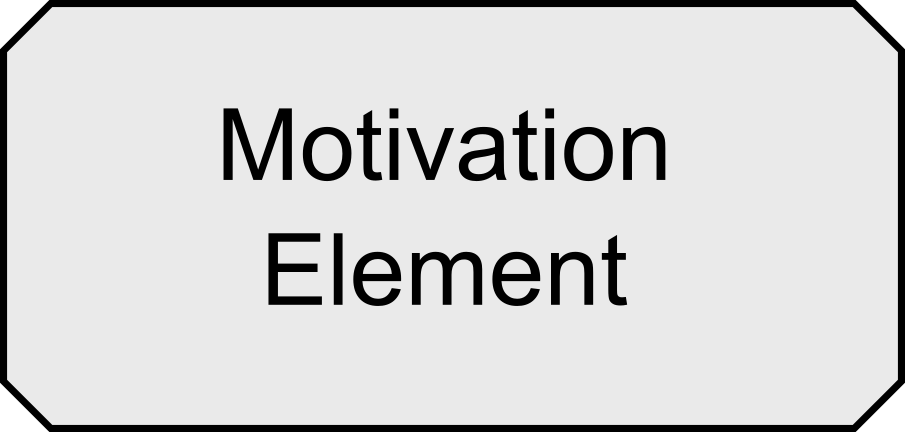

**Figure 17. Generic Motivation Element Notation**

> 图17 通用动机元素符号

Motivation elements are usually denoted using boxes with diagonal corners.

> 动机元素通常用带有对角线的方框表示。

**Table 2. Motivation Element**

> 动机元素

| Element            | Definition                                                   | Notation                                                     |
| ------------------ | ------------------------------------------------------------ | ------------------------------------------------------------ |
| Motivation Element | Represents the context of or reason behind the architecture of an enterprise. |  |

## 4.5. Composite Elements

> 复合元素

Composite elements consist of other concepts, possibly from multiple aspects or layers of the language.

> 复合元素由其他概念组成，可能来自语言的多个方面或层。

Grouping and location are generic composite elements (see [Figure 18](https://pubs.opengroup.org/architecture/archimate3-doc/ch-Generic-Metamodel.html#fig-Composite-Elements)).

> 分组和位置是通用的组合元素(参见 [图18](https://pubs.opengroup.org/architecture/archimate3-doc/ch-Generic-Metamodel.html#fig-Composite-Elements) )。

Other composite elements include Product (see [Section 8.5.1](https://pubs.opengroup.org/architecture/archimate3-doc/ch-Business-Layer.html#sec-Product)) and Plateau (see [Section 12.2.4](https://pubs.opengroup.org/architecture/archimate3-doc/ch-Implementation-and-Migration-Layer.html#sec-Plateau)).

> 其他复合元素包括Product(见 [8.5.1节](https://pubs.opengroup.org/architecture/archimate3-doc/ch-Business-Layer.html#sec-Product)) 和 Plateau(见 [12.2.4节](https://pubs.opengroup.org/architecture/archimate3-doc/ch-Implementation-and-Migration-Layer.html#sec-Plateau) )。

Composite elements can themselves aggregate or compose other composite elements.

> 复合元素本身可以聚合或组合其他组合元素。

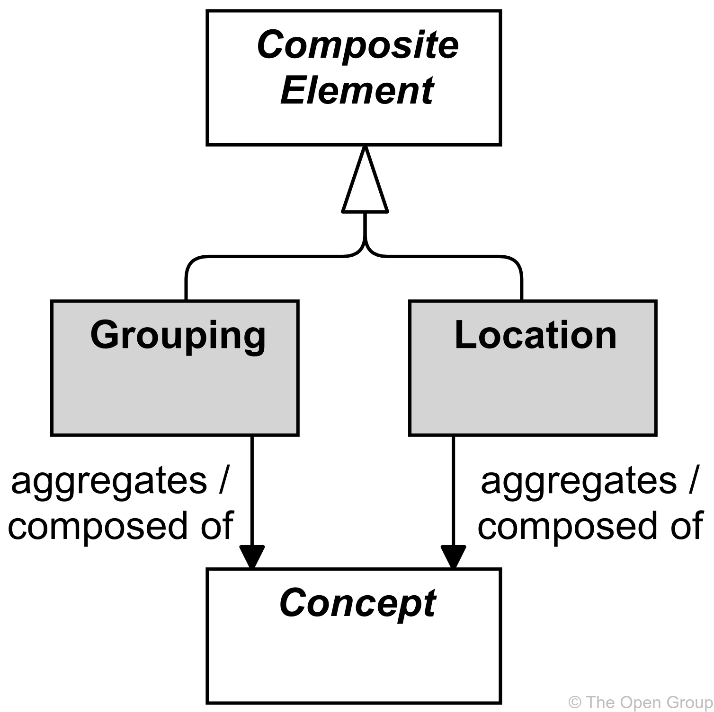

**Figure 18. Composite Elements**

> 图18 复合元素

### 4.5.1. Grouping

The grouping element aggregates or composes-组成,构成 concepts that belong together based on some common characteristic.

> 分组元素根据一些共同特征聚集或组合属于一起的概念。

The grouping element is used to aggregate or compose an arbitrary-任意的 group of concepts, which can be elements and/or relationships of the same or of different types.

> 分组元素用于聚合或组成任意一组概念，这些概念可以是相同或不同类型的元素和/或关系。

An aggregation or composition-组成 relationship is used to link the grouping element to the grouped concepts.

> 聚合或组合关系用于将分组元素链接到分组概念。

Grouping elements can also have other relationships to and from them, as shown in [Appendix B](https://pubs.opengroup.org/architecture/archimate3-doc/ch-relationships-Normative.html).

> 分组元素之间也可以有其他关系，如 [附录B](https://pubs.opengroup.org/architecture/archimate3-doc/ch-relationships-Normative.html) 所示。

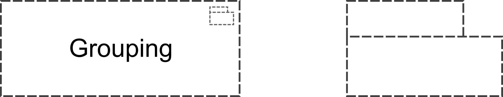

**Figure 19. Grouping Notation**

> 图19 组合符号

Concepts may be aggregated by multiple (overlapping) groups.

> 概念可以由多个(重叠的)组聚合。

One useful way of employing-使用,利用 grouping is for modeling Architecture and Solution Building Blocks (ABBs and SBBs), as described in the TOGAF framework [[4](https://pubs.opengroup.org/architecture/archimate3-doc/ch-Referenced-docs.html#Ref4)].

> 采用分组的一种有用方法是对体系结构和解决方案构建块(ABBs和sbb)进行建模，如TOGAF框架 [[4](https://pubs.opengroup.org/architecture/archimate3-doc/ch-Referenced-docs.html#Ref4)] )中所描述的那样。

Another useful application of grouping is for modeling domains.

> 分组的另一个有用的应用是对域进行建模。

For example, the TOGAF framework [[4](https://pubs.opengroup.org/architecture/archimate3-doc/ch-Referenced-docs.html#Ref4)] Glossary of Supplementary Definition defines Information Domain as: *“grouping of information (or data entities) by a set of criteria such as security classification, ownership, location, etc. In the context of security, Information Domains are defined as a set of users, their information objects, and a security policy”*.

> 例如，TOGAF框架[[4](https://pubs.opengroup.org/architecture/archimate3-doc/ch-Referenced-docs.html#Ref4)]补充定义术语表)将信息域定义为：“*根据一组标准(如安全分类、所有权、位置等)对信息(或数据实体)进行分组”。在安全上下文中，信息域被定义为一组用户、他们的信息对象和一个安全策略*”。

> [!NOTE]
>
> The use of grouping is not to be confused with creating views on the architecture ([Section 13.3](https://pubs.opengroup.org/architecture/archimate3-doc/ch-Stakeholders-Architecture-Views-and-Viewpoints.html#sec-Architecture-Views-and-Viewpoints)). Although like a view it comprises concepts that belong together for some reason, it does not provide a separate visualization of these concepts. Moreover-此外,而且, groupings are used *within* architecture views to provide additional structure to an architecture model and its visualization.
>
> > 不要将分组的使用与在架构上创建视图混淆( [第13.3节](https://pubs.opengroup.org/architecture/archimate3-doc/ch-Stakeholders-Architecture-Views-and-Viewpoints.html#sec-Architecture-Views-and-Viewpoints) )。尽管像视图一样，它包含了由于某种原因属于一起的概念，但它不提供这些概念的单独可视化。此外，在体系结构视图中使用分组，为体系结构模型及其可视化提供额外的结构。

**Example**

In Example 1, the “Grouping” element is used to aggregate a conglomerate-聚集物,合成物 of two processes and an object that together realize a service (both with nesting and explicitly drawn aggregation relationships).

> 在示例1中，“Grouping” 元素用于聚合两个流程和一个对象的集合，这些流程和对象共同实现了一个服务(具有嵌套和显式绘制的聚合关系)。

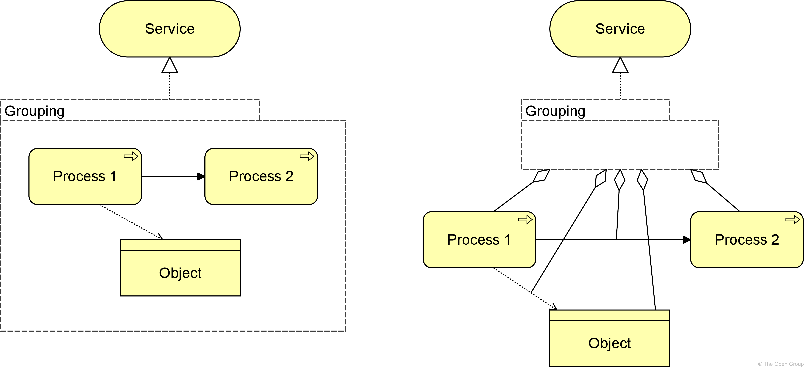

**Example 1: Grouping**

> 示例1：分组

> [!NOTE]
>
> The semantics-语义的,语义学的 of grouping imply-意味着,暗指 that a relationship from or to a group should be interpreted as a collective relationship with the group’s contents. In the example, the implied meaning is that the contents of the group together, or parts thereof-在其中, realize the service. However, this is not always easily expressed in simple derivable-可推论的,可引出的 relationships.
>
> > 分组的语义意味着来自组或到组的关系应该被解释为与组的内容的集体关系。在示例中，隐含的含义是组的内容一起或其中的部分实现服务。然而，这并不总是容易用简单的可推导关系来表示。

### 4.5.2. Location

A location represents a conceptual or physical place or position where concepts are located (e.g., structure elements) or performed (e.g., behavior elements).

> 位置表示概念(如结构要素)或执行概念(如行为要素)的概念或物理地点或位置。

The location element is used to model the places where (active and passive) structure elements such as business actors, application components, and devices-设备 are located.

> location 元素用于对(主动和被动)结构元素(如业务参与者、应用程序组件和设备)所在的位置进行建模。

This is modeled by means of an aggregation relationship from a location to structure element.

> 这是通过从位置到结构元素的聚合关系来建模的。

A location can also aggregate a behavior element, to indicate where the behavior is performed.

> 位置还可以聚合行为元素，以指示执行行为的位置。

This element corresponds to the “Where” column of the Zachman framework [[5](https://pubs.opengroup.org/architecture/archimate3-doc/ch-Referenced-docs.html#Ref5)].

> 这个元素对应于 Zachman 框架的 “Where” 列 [[5](https://pubs.opengroup.org/architecture/archimate3-doc/ch-Referenced-docs.html#Ref5)] )。

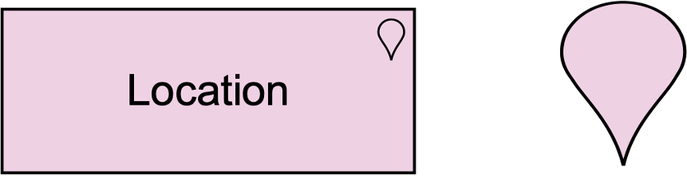

**Figure 20. Location Notation**

> 图20 位置服务

