# Chapter 5. Relationships and Relationship Connectors

> 关系和关系连接器

In addition to the generic elements outlined in [Chapter 4](https://pubs.opengroup.org/architecture/archimate3-doc/ch-Generic-Metamodel.html), the ArchiMate language defines a core set of generic relationships, each of which can connect a predefined-预先定义 set of source and target concepts (in most cases elements, but in a few cases also other relationships).

> 除了在 [第4章](https://pubs.opengroup.org/architecture/archimate3-doc/ch-Generic-Metamodel.html) 中概述的通用元素之外，ArchiMate 语言还定义了一组核心的通用关系，每个通用关系都可以连接一组预定义的源和目标概念(在大多数情况下是元素，但在少数情况下也是其他关系)。

Many of these relationships are “overloaded”; i.e., their exact meaning differs depending on the source and destination-目的 concepts that they connect.

> 这些关系中有许多是“超负荷的”；也就是说，它们的确切含义取决于它们所连接的源和目的概念。

The relationships are classified-把…分类 as follows (see [Figure 21](https://pubs.opengroup.org/architecture/archimate3-doc/ch-Relationships-and-Relationship-Connectors.html#fig-Overview-of-Relationships)):

> 关系分类如下(参见 [图21](https://pubs.opengroup.org/architecture/archimate3-doc/ch-Relationships-and-Relationship-Connectors.html#fig-Overview-of-Relationships) ):

- *Structural* relationships, which model the static construction-构造 or composition of concepts of the same or different types

	> 结构关系，对相同或不同类型的概念的静态构造或组合进行建模

- *Dependency* relationships, which model how elements are used to support other elements

	> 依赖关系，它描述了元素如何被用来支持其他元素

- *Dynamic* relationships, which are used to model behavioral dependencies between elements

	> 动态关系，用于对元素之间的行为依赖进行建模

- *Other* relationships, which do not **fall into**-属于 one of the above categories

	> 其他关系，不属于上述类别之一的关系

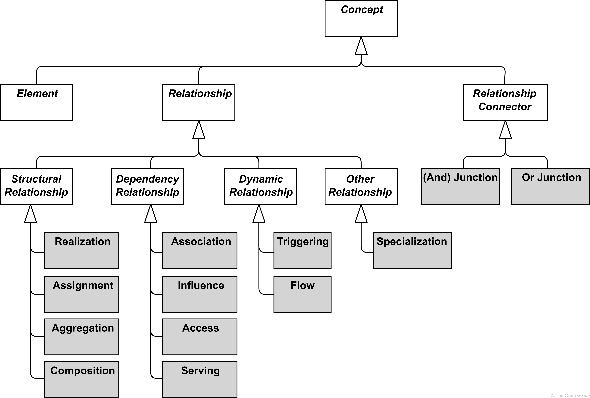

**Figure 21. Overview of Relationships**

> 图21 关系概述

Each relationship has exactly one “from” and one “to” concept (element, relationship, or relationship connector) as endpoints.

> 每个关系都有一个“从”和一个“到”概念(元素、关系或关系连接器)作为端点。

The following restrictions-约束,限定 apply:

> 以下限制适用：

- No relationships are allowed between two relationships

	> 两个关系之间不允许有任何关系

- All relationships connected with relationship connectors must be of the same type

	> 使用关系连接器连接的所有关系必须具有相同的类型

- A chain of relationships of the same type that connects two elements, and is in turn connected via relationship connectors, is valid only if a direct relationship of that same type between those two elements is valid

	> 连接两个元素并依次通过关系连接器连接的相同类型的关系链只有在这两个元素之间的相同类型的直接关系有效时才有效

- A relationship connecting an element with a second relationship can only be an aggregation, composition, or association; aggregation or composition are valid only from a composite element to that second relationship

	> 将元素与第二个关系连接起来的关系只能是聚合、组合或关联；聚合或组合仅对第二个关系的组合元素有效

It is good practice to explicitly name or label any relationship that would else be ambiguous-模棱两可的,不确定的 or otherwise misunderstood.

> 明确地命名或标记任何关系是一种很好的做法，否则就会产生歧义或误解。

For the sake-利益,好处 of readability, the metamodel figures throughout this document do not show all possible relationships in the language.

> 为了便于阅读，本文档中的元模型图并没有显示语言中所有可能的关系。

[Section 5.7](https://pubs.opengroup.org/architecture/archimate3-doc/ch-Relationships-and-Relationship-Connectors.html#sec-Derivation-of-Relationships) describes a set of derivation-派生 rules to derive indirect-间接的 relationships between elements in a model.

> [第5.7节](https://pubs.opengroup.org/architecture/archimate3-doc/ch-Relationships-and-Relationship-Connectors.html#sec-Derivation-of-Relationships) 描述了一组派生规则，用于派生模型中元素之间的间接关系。

Aggregation, composition, and specialization relationships are always permitted between two elements of the same type, and association is always allowed between any two elements, and between any element and relationship.

> 相同类型的两个元素之间总是允许聚合、组合和专业化关系，任何两个元素之间以及任何元素和关系之间总是允许关联。

The exact specification-规格,规范 of permitted relationships is given in [Appendix B](https://pubs.opengroup.org/architecture/archimate3-doc/ch-relationships-Normative.html).

> 允许的关系的确切规范在 [附录B](https://pubs.opengroup.org/architecture/archimate3-doc/ch-relationships-Normative.html) 中给出。

## 5.1. Structural Relationships

> 结构关系

Structural relationships represent the “static” coherence-一致性 within an architecture.

> 结构关系表示体系结构中的“静态”一致性。

The uniting (composing, aggregating, assigned, or realizing) concept (the “from” side of the relationship) is always an element; for assignment and realization it can be an element or a relationships connector.

> 统一(组合、聚合、分配或实现)概念(关系的“从”方面)始终是一个要素；对于分配和实现，它可以是一个元素或一个关系连接器。

The united (being composed, aggregated, assigned to, or realized) concept (the “to” side of the relationship) may in some cases also be another relationship or relationship connector.

> 统一(被组合、聚合、分配或实现)概念(关系的“到”端)在某些情况下也可能是另一个关系或关系连接器。

As an alternative to the graphical notations proposed in this section, structural relationships may also be expressed by nesting the united concept within the uniting element.

> 作为本节中提出的图形符号的替代方法，结构关系也可以通过在统一元素中嵌套统一概念来表示。

Note, however, that this can lead to ambiguous-歧义 views (although unambiguous in the model), in case multiple structural relationships are allowed between these elements.

> 但是请注意，如果这些元素之间允许存在多个结构关系，那么这会导致歧义视图(尽管在模型中没有歧义)。

### 5.1.1. Composition Relationship

> 组合关系

The composition relationship represents that an element consists of one or more other concepts.

> 组合关系表示一个元素由一个或多个其他概念组成。

The composition relationship has been inspired by the composition relationship in UML class diagrams.

> 组合关系受到UML类图中的组合关系的启发。

Composition is a whole/part relationship that expresses an existence dependency: if a composite is deleted, its parts are (normally) deleted as well.

> 组合是一种表达存在依赖性的整体/部分关系:如果一个组合被删除，它的部分(通常)也会被删除。

When you model real-world elements – for example, an organization structure of departments and teams expressed as business actors – this dependency applies to these elements themselves.

> 当您为真实世界的元素建模时——例如，表示为业务参与者的部门和团队的组织结构——这种依赖关系应用于这些元素本身。

When you model exemplars or categories – as is common in Enterprise Architecture – this dependency may be interpreted-解释,说明 as applying to their real-world instances.

> 当您为范例或类别建模时(这在企业架构中很常见)，这种依赖关系可能被解释为应用于它们的实际实例。

For example, a specific kind of server can be modeled as a node composed of a device and system software; this implies an existence dependency between individual servers of that kind and the individual devices and system software instances of which they consist.

> 例如，可以将特定类型的服务器建模为由设备和系统软件组成的节点；这意味着这种类型的单个服务器与它们组成的单个设备和系统软件实例之间存在依赖关系。

A composition relationship is always allowed between two instances of the same element type.

> 相同元素类型的两个实例之间总是允许复合关系。

In addition to this, the metamodel explicitly defines other source and target elements that may be connected by a composition relationship.

> 除此之外，元模型明确地定义了可能通过组合关系连接的其他源元素和目标元素。

**Figure 22. Composition Notation**

> 图22 组合符号

The interpretation of a composition relationship is that the *whole or part* of the source element is composed of the *whole of* the target element. See also [Section 5.1.5](https://pubs.opengroup.org/architecture/archimate3-doc/ch-Relationships-and-Relationship-Connectors.html#sec-Semantics-of-Structural-Relationships).

> 组合关系的解释是源元素的“整体或部分”由目标元素的“整体”组成。参见[第5.1.5节](https://pubs.opengroup.org/architecture/archimate3-doc/ch-Relationships-and-Relationship-Connectors.html#sec-Semantics-of-Structural-Relationships)。

**Example**

Example 2 shows the two ways to express that the “Financial Processing” business function is composed of three sub-functions.

> 示例2 展示了表示“财务处理”业务功能由三个子功能组成的两种方式。

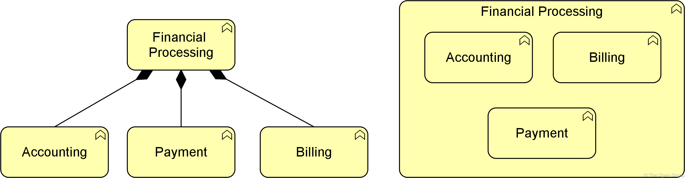

**Example 2: Composition**

> 示例2 组合

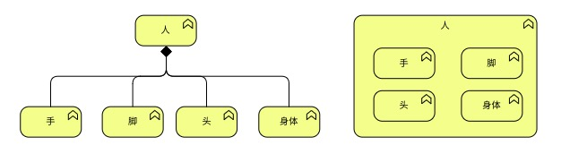

**示例 2.1**

### 5.1.2. Aggregation Relationship

> 聚合关系

The aggregation relationship represents that an element combines one or more other concepts.

> 聚合关系表示一个元素结合了一个或多个其他概念。

The aggregation relationship has been inspired by the aggregation relationship in UML class diagrams.

> 聚合关系受到UML类图中的聚合关系的启发。

Unlike composition, aggregation does not imply an existence dependency between the aggregating and aggregated concepts.

> 与组合不同，聚合并不意味着在聚合和聚合概念之间存在依赖关系。

An aggregation relationship is always allowed between two instances of the same element type.

> 相同元素类型的两个实例之间始终允许存在聚合关系。

In addition to this, the metamodel explicitly defines other source and target elements that may be connected by an aggregation relationship.

> 除此之外，元模型明确地定义了可能通过聚合关系连接的其他源元素和目标元素。

**Figure 23. Aggregation Notation**

> 图23 聚合符号

The interpretation-解释,理解 of an aggregation relationship is that the *whole or part* of the source element aggregates the *whole of* the target concept. See also [Section 5.1.1](https://pubs.opengroup.org/architecture/archimate3-doc/ch-Relationships-and-Relationship-Connectors.html#sec-Composition-Relationship).

> 聚合关系的解释是源元素的“整体或部分”聚合了目标概念的“整体”。参见 [第5.1.1节](https://pubs.opengroup.org/architecture/archimate3-doc/ch-Relationships-and-Relationship-Connectors.html#sec-Composition-Relationship)。

**Example**

Example 3 shows two ways to express that the “Customer File” aggregates an “Insurance Policy” and “Insurance Claim”.

> 示例3展示了两种表达“客户文件”聚合“保险单”和“保险索赔”的方法。

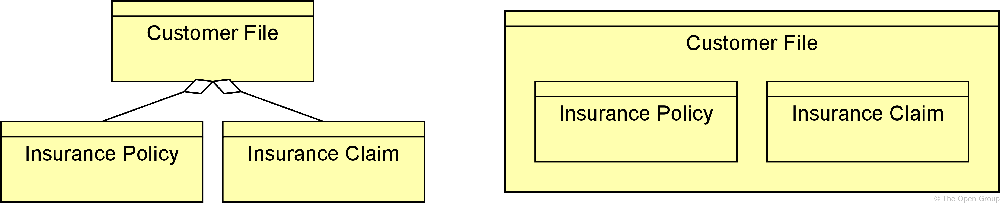

**Example 3: Aggregation**

> 示例3 聚合

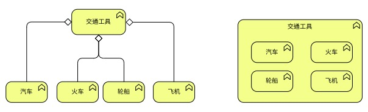

**示例 3.1**

### 5.1.3. Assignment Relationship

> 分配关系

The assignment relationship represents the allocation of responsibility, performance of behavior, storage, or execution.

> 分配关系表示责任的分配、行为的执行、存储或执行。

The assignment relationship links active structure elements with units of behavior that are performed by them, business actors-参与者 with business roles that are fulfilled by them, and nodes with technology passive structure elements.

> 分配关系将主动结构元素与由它们执行的行为单元、业务参与者与由它们完成的业务角色以及节点与技术被动结构元素联系起来。

It can, for example, relate an internal active structure element with an internal behavior element, an interface with a service, or a node, device, and system software with an artifact.

> 例如，它可以将内部主动结构元素与内部行为元素、与服务的接口、或与工件的节点、设备和系统软件关联起来。

The full set of permitted relationships is listed in [Appendix B](https://pubs.opengroup.org/architecture/archimate3-doc/ch-relationships-Normative.html).

> 完整的允许关系列在 [附录B](https://pubs.opengroup.org/architecture/archimate3-doc/ch-relationships-Normative.html) 中。

**Figure 24. Assignment Notation**

> 图24 分配符号

In the ArchiMate framework described in [Section 3.4](https://pubs.opengroup.org/architecture/archimate3-doc/ch-Language-Structure.html#sec-The-ArchiMate-Core-Framework), it always points from active structure to behavior, from behavior to passive structure, and from active to passive structure.

> 在 [第3.4节](https://pubs.opengroup.org/architecture/archimate3-doc/ch-Language-Structure.html#sec-The-ArchiMate-Core-Framework) 中描述的ArchiMate框架中，它总是从主动结构指向行为，从行为指向被动结构，从主动指向被动结构。

The non-directional notation from the ArchiMate 2.1 Specification-规格,规范 and before, which shows the black ball at both ends of the relationship, is still allowed but deprecated-弃用,贬低.

> 来自 ArchiMate 2.1 规范及之前版本的非定向符号(在关系的两端显示黑球)仍然是允许的，但已弃用。

As with all structural relationships, an assignment relationship can also be expressed by nesting the model elements.

> 与所有结构关系一样，分配关系也可以通过嵌套模型元素来表示。

The direction-方向 mentioned-提到,谈到 above is also the direction of nesting; for example, a business role inside the business actor performing that role, an application function inside an application component executing that function, or an artifact inside a node that stores it.

> 上述方向也是嵌套的方向；例如，执行该角色的业务参与者中的业务角色，执行该功能的应用程序组件中的应用程序功能，或者存储该功能的节点中的工件。

The interpretation of an assignment relationship is that the *whole or part* of the source element is assigned the *whole of* the target element (see also [Section 5.1](https://pubs.opengroup.org/architecture/archimate3-doc/ch-Relationships-and-Relationship-Connectors.html#sec-Structural-Relationships)).

> 分配关系的解释是源元素的“全部或部分”被分配给目标元素的“全部”(参见[Section 5.1](https://pubs.opengroup.org/architecture/archimate3-doc/ch-Relationships-and-Relationship-Connectors.html#sec-Structural-Relationships))。

This means that if, for example, two active structure elements are assigned to the same behavior element, either of them can perform the complete behavior.

> 这意味着，例如，如果将两个主动结构元素分配给相同的行为元素，则它们中的任何一个都可以执行完整的行为。

If both active structure elements are needed to perform the behavior, the grouping element or a junction-连接,结合 (see [Section 5.5](https://pubs.opengroup.org/architecture/archimate3-doc/ch-Relationships-and-Relationship-Connectors.html#sec-Relationship-Connectors)) can be used, and if the combination of these elements has a more substantive-实质性 and independent-独立性 character, a collaboration would be the right way to express this.

> 如果需要两个活动结构元素来执行行为，则可以使用分组元素或连接(参见 [第5.5节](https://pubs.opengroup.org/architecture/archimate3-doc/ch-Relationships-and-Relationship-Connectors.html#sec-Relationship-Connectors) )，并且如果这些元素的组合具有更实质性和独立性，则协作将是表达这一点的正确方式。

**Example**

Example 4 includes the two ways to express the assignment relationship.

> 示例4 包含了表达赋值关系的两种方式。

The “Finance” application component is assigned to the “Transaction Processing” application function, and the “Payment Interface” is assigned to the “Payment Service”.

> “财务”应用组件分配给“交易处理”应用功能，“支付接口”分配给“支付服务”。

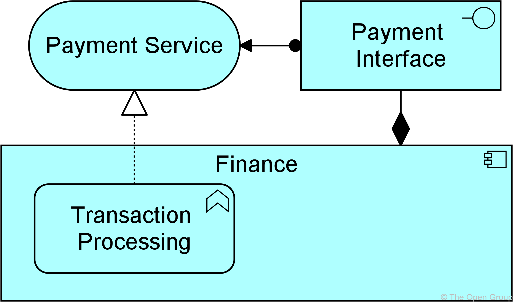

**Example 4: Assignment**

> 示例4 分配

### 5.1.4. Realization Relationship

> 实现关系

The realization relationship represents that an element plays a critical role in the creation, achievement-成就, sustenance-支持, or operation of a more abstract element.

> 实现关系表示一个元素在一个更抽象的元素的创造、成就、维持或操作中起关键作用。

The realization relationship indicates that more abstract elements (“what” or “logical”) are realized by means of more tangible-明确的 elements (“how” or “physical”).

> 实现关系表明更抽象的元素(“什么”或“逻辑”)是通过更明确的元素(“如何”或“物理”)来实现的。

The realization relationship is used to model run-time realization; for example, that a business process realizes a business service, and that a data object realizes a business object, an artifact realizes an application component, or a core element realizes a motivation element.

> 实现关系用于对运行时实现建模；例如，业务流程实现业务服务，数据对象实现业务对象，工件实现应用程序组件，或者核心元素实现动机元素。

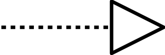

**Figure 25. Realization Notation**

> 图25 实现符号

The interpretation of a realization relationship is that the *whole or part* of the source element realizes the *whole of* the target element (see also [Section 5.1](https://pubs.opengroup.org/architecture/archimate3-doc/ch-Relationships-and-Relationship-Connectors.html#sec-Structural-Relationships)).

> 实现关系的解释是源元素的“全部或部分”实现了目标元素的“全部”(参见[第5.1节](https://pubs.opengroup.org/architecture/archimate3-doc/ch-Relationships-and-Relationship-Connectors.html#sec-Structural-Relationships))。

This means that if, for example, two internal behavior elements have a realization relationship to the same service, either of them can realize the complete service.

> 这意味着，例如，如果两个内部行为元素对同一服务具有实现关系，则它们中的任何一个都可以实现完整的服务。

If both internal behavior elements are needed to realize, the grouping element or an *and* junction (see [Section 5.5.1](https://pubs.opengroup.org/architecture/archimate3-doc/ch-Relationships-and-Relationship-Connectors.html#sec-Junction)) can be used. 

> 如果两个内部行为元素都需要实现，可以使用分组元素或 *and* 连接(参见 [Section 5.5.1](https://pubs.opengroup.org/architecture/archimate3-doc/ch-Relationships-and-Relationship-Connectors.html#sec-Junction) )。

For weaker-较弱的,下跌的 types of effects on the realization of a motivation element, the influence relationship (see [Section 5.2.3](https://pubs.opengroup.org/architecture/archimate3-doc/ch-Relationships-and-Relationship-Connectors.html#Influence_Relationship)) should be used.

> 对于对动机要素实现的较弱类型的影响，应使用影响关系(见 [第5.2.3节](https://pubs.opengroup.org/architecture/archimate3-doc/ch-Relationships-and-Relationship-Connectors.html#Influence_Relationship) )。

**Example**

Example 5 illustrates two ways to use the realization relationship.

> 示例5 说明了使用实现关系的两种方法。

A “Transaction Processing” business function realizes a “Billing Service”; the “Billing Data” business object is realized by the representation “Paper Invoice”.

> “交易处理”业务功能实现“计费服务”；“账单数据”业务对象通过“纸质发票”表示实现。

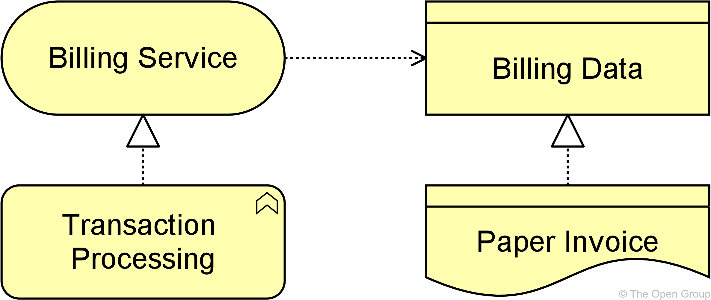

**Example 5: Realization**

> 示例5 实现

### 5.1.5. Semantics of Structural Relationships

> 结构关系语义

Structural relationships describe that the element on the source side contains, groups, performs, or realizes the concept on the target side of the relationship.

> 结构关系描述源端的元素在关系的目标端包含、分组、执行或实现概念。

Structural relationships can be transitively-过渡地 applied to (possibly unmodeled) parts of the source element.

> 结构关系可以传递地应用于源元素的部分(可能未建模)。

Below are some examples of how these semantics work:

> 下面是这些语义如何工作的一些例子:

- Composition and aggregation relationships from parts also apply to the whole

	> 部分的组合和聚合关系也适用于整体

	For example, if a part of A aggregates B, A itself is also considered to aggregate B. Conversely-相反地,反过来说, if A aggregates B, that can be interpreted as some part of A aggregating B.

	> 例如，如果 A 的一部分聚合了 B，则认为 A 本身也聚合了 B。反之，如果 A 聚合了 B，则可以解释为 A 的某些部分聚合了 B。

- Assignment relationships to behavior elements also apply to the active structure elements

	> 行为元素的赋值关系也适用于主动结构元素

	For example, if business role A is assigned to business process B, some part of A may perform B. Conversely-相反地,反过来说, if a part of A is assigned to B, A itself is also considered to be assigned to B.

	> 例如，如果将业务角色A分配给业务流程B，则A的某些部分可能执行B，反之，如果将A的一部分分配给B，则A本身也被认为分配给B。

- Realization relationships to external behavior elements also apply to the internal behavior elements

	> 与外部行为元素的实现关系也适用于内部行为元素

	For example, if a service B is realized by a process A, B may be realized by some part of A. Conversely, if a part of A realizes B, A itself is also considered to realize B.

	> 例如，如果服务 B 是由进程 A 实现的，则 B 可能是由 A 的某个部分实现的。反之，如果 A 的某个部分实现了 B，则认为 A 本身也实现了 B。

**Example**

In the left-hand side of Example 6, the entire business actor B (possibly a department) is composed in business actor A (possibly a division), via some unmodeled element inside A.

> 在示例6 的左侧，整个业务参与者B (可能是一个部门)通过业务参与者A (可能是一个部门)中一些未建模的元素组成。

In the example on the right, business process A completely realizes business service B, via some unmodeled element inside A.

> 在右边的示例中，业务流程A通过A中一些未建模的元素完全实现了业务服务B。

**Example 6: Semantics of Structural Relationships**

> 示例6：结构关系的语义

## 5.2. Dependency Relationships

> 依赖关系

Dependency relationships describe how elements support or are used by other elements.

> 依赖关系描述了元素如何支持或被其他元素使用。

Four types of dependency relationship are distinguished:

> 依赖关系分为四种类型：

- The *serving* relationship represents a *control* dependency, denoted by a solid line

	> “服务”关系表示“控制”依赖，用实线表示

- The *access* relationship represents a *data* dependency, denoted by a dotted-点虚线 line

	> “访问”关系表示“数据”依赖关系，用虚线表示

- The *influence* relationship represents an *impact* dependency, denoted by a dashed-虚线 line

	> “影响”关系表示“影响”依赖关系，用虚线表示

- The *association-关联* relationship represents a dependency not covered by any of the other relationships

	> ”关联”关系表示任何其他关系都没有涵盖的依赖关系

Note that, although the notation of these relationships resembles the notation of the dependency relationship in UML, these relationships have distinct meanings in ArchiMate notation and (usually) point in the opposite-相反的 direction.

> 请注意，尽管这些关系的符号类似于UML中依赖关系的符号，但这些关系在 ArchiMate 符号中具有不同的含义，并且(通常)指向相反的方向。

One advantage of this is that it yields-产生 models with directionality-方向性, where most of the arrows-箭头 that represent such supporting, influencing, serving, or realizing dependencies point “upwards-向上,在上部” towards the client/user/business, as you can see in the layered viewpoint example in [Section C.1.5](https://pubs.opengroup.org/architecture/archimate3-doc/ch-Example-Viewpoints.html#sec-Layered-Viewpoint).

> 这样做的一个优点是，它产生了具有方向性的模型，其中大多数表示支持、影响、服务或实现依赖的箭头都指向“向上”的客户端/用户/业务，正如您在 [C.1.5节](https://pubs.opengroup.org/architecture/archimate3-doc/ch-Example-Viewpoints.html#sec-Layered-Viewpoint) 中的分层视点示例中所看到的那样。

Another reason for this direction, in particular for the serving relationship, is that it abstracts from the “caller” or “initiator-发起人,创始人”, since a service may be delivered proactively-主动地 or reactively.

> 这个方向的另一个原因，特别是对于服务关系，是它从“调用者”或“发起者”抽象出来的，因为服务可以主动或被动地交付。

The direction of delivery-递送 is always the same, but the starting point for the interaction can be on either end.

> 传递的方向总是相同的，但是交互的起点可以在任何一端。

UML’s dependency is often used to denote-标志,表示 the latter, showing that the caller depends on some operation that is called.

> UML的依赖性通常用于表示后者，显示调用者依赖于被调用的某些操作。

However, for modeling this type of initiative, the ArchiMate language provides the triggering relationship ([Section 5.3.1](https://pubs.opengroup.org/architecture/archimate3-doc/ch-Relationships-and-Relationship-Connectors.html#sec-Triggering-Relationship)), which can be interpreted-解释,说明 as a dynamic (i.e., temporal) dependency.

> 然而，为了对这种类型的活动建模，ArchiMate语言提供了触发关系( [第5.3.1节](https://pubs.opengroup.org/architecture/archimate3-doc/ch-Relationships-and-Relationship-Connectors.html#sec-Triggering-Relationship) )，它可以被解释为一个动态的(即时间的)依赖。

Similarly, the flow relationship is used to model how something (usually information) is transferred from one element to another, which is also a dynamic kind of dependency.

> 类似地，流关系用于对某些东西(通常是信息)如何从一个元素转移到另一个元素进行建模，这也是一种动态依赖。

### 5.2.1. Serving Relationship

> 服务关系

The serving relationship represents that an element provides its functionality to another element.

> 服务关系表示一个元素向另一个元素提供它的功能。

The serving relationship describes how the services or interfaces offered by a behavior or active structure element serve entities in their environment.

> 服务关系描述了由行为或活动结构元素提供的服务或接口如何为其环境中的实体提供服务。

This relationship is applied for both the behavior aspect and the active structure aspect.

> 这种关系既适用于行为方面，也适用于活动结构方面。

Compared to the earlier versions of this standard, the name of this relationship has been changed from “used by” to “serving”, to better reflect its direction with an active verb: a service serves a user.

> 与此标准的早期版本相比，这种关系的名称已经从“被使用”改为“服务”，以便用一个主动动词更好地反映其方向:服务为用户服务。

The meaning of the relationship has not been altered.

> 这种关系的意义并没有改变。

The “used by” designation-指定,委任 is still allowed but deprecated, and will be removed in a future version of the standard.

> “被使用”的标识仍然被允许，但已弃用，并将在标准的未来版本中删除。

**Figure 26. Serving Notation**

> 服务符号

**Example**

Example 7 illustrates the serving relationship.

> 示例7 说明了服务关系。

The “Payment Interface” serves the “Customer”, while the “Payment Service” serves the “Pay Invoices” business process of that customer.

> “支付接口”服务于“客户”，而“支付服务”服务于该客户的“支付发票”业务流程。

**Example 7: Serving**

> 示例7 服务

### 5.2.2. Access Relationship

> 访问关系

The access relationship represents the ability of behavior and active structure elements to observe or act upon passive structure elements.

> 访问关系表示行为和主动结构元素观察或作用于被动结构元素的能力。

The access relationship indicates that a process, function, interaction, service, or event “does something” with a passive structure element; e.g., create a new object, read data from the object, write or modify the object data, or delete the object.

> 访问关系表明流程、功能、交互、服务或事件使用被动结构元素“做某事”；例如，创建一个新对象，从对象中读取数据，写入或修改对象数据，或删除对象。

The relationship can also be used to indicate that the object is just associated with the behavior; e.g., it models the information that comes with an event, or the information that is made available as part of a service.

> 这种关系也可以用来表明对象只是与行为相关联；例如，它对事件带来的信息或作为服务一部分可用的信息进行建模。

The arrowhead-箭头, if present-出现, indicates the creation, change, or usage of passive structure elements.

> 如果出现箭头，则表示被动结构元素的创建、更改或使用。

The access relationship should not be confused-混淆 with the UML dependency relationship, which uses a similar notation.

> 访问关系不应该与UML依赖关系混淆，后者使用类似的符号。

Note that, at the metamodel level, the direction of the relationship is always from an active structure element or a behavior element to a passive structure element, although the notation may point in the other direction to denote “read” access, and in both directions to denote read-write access.

> 注意，在元模型级别，关系的方向总是从主动结构元素或行为元素到被动结构元素，尽管符号可能指向另一个方向以表示“读”访问，或者指向两个方向以表示读写访问。

Care must be taken when using access with derived-衍生,派生 relationships because the arrow on the relationship has no bearing to its directionality.

> 在对派生关系使用访问时必须小心，因为关系上的箭头与它的方向性无关。

**Figure 27. Access Notation**

> 图27 访问符号

Alternatively-要不,或者, an access relationship can be expressed by nesting the passive structure element inside the behavior or active structure element that accesses it; for example, nesting a data object inside an application component.

> 或者，访问关系可以通过将被动结构元素嵌套在访问它的行为或主动结构元素中来表示；例如，在应用程序组件中嵌套数据对象。

**Example**

Example 8 illustrates the access relationship.

> 示例8 说明了访问关系。

The “Create Invoice” sub-process writes/creates the “Invoice” business object; the “Send Invoice” sub-process reads that object.

> “创建发票”子流程写入/创建“发票”业务对象；“发送发票”子流程读取该对象。

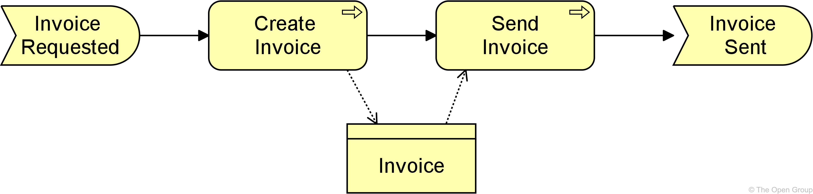

**Example 8: Access**

> 示例8：访问

### 5.2.3. Influence Relationship

> 影响关系

The influence relationship represents that an element affects the implementation or achievement of some motivation element.

> 影响关系表示某一要素影响某一动机要素的实现或完成。

The influence relationship is used to describe some architectural-架构,建筑学的 elements that influence the achievement or implementation of a motivation element, such as a goal or a principle.

> 影响关系用于描述影响动机元素(如目标或原则)的成就或实现的一些架构元素。

In general, a motivation element is realized to a certain degree.

> 一般来说，一个动机要素在一定程度上得到了实现。

For example, consistently satisfying the principle “serve customers wherever they are”, will help to make the goal “increase market share-份额”, come true.

> 例如，始终如一地满足“无论客户在哪里”的原则，将有助于实现“增加市场份额”的目标。

In other words, the principle contributes to the goal.

> 换句话说，原则有助于实现目标。

In turn, to implement the principle “serve customers wherever they are”, it may be useful to impose-强制推行,强制实行 a requirement of “24x7 web availability” on some customer-facing application component.

> 反过来，为了实现“无论客户在哪里，都要为他们服务”的原则，在一些面向客户的应用程序组件上强加“24x7网络可用性”的要求可能会很有用。

This can be modeled as a requirement that has an influence on that principle and as an application component that in turn influences the requirement.

> 这可以建模为影响该原则的需求，也可以建模为反过来影响该需求的应用程序组件。

Consistently modeling these dependencies with an influence relationship yields a traceable-可追踪的,可描绘的 motivational path that explains why, in this example, a certain application component contributes to the corporate goal to “increase market share”. 

> 始终如一地用影响关系对这些依赖关系进行建模，产生了可追溯的动机路径，该路径解释了为什么在本例中，某个应用程序组件有助于实现“增加市场份额”的公司目标。

This kind of traceability supports measuring the results of Enterprise Architecture and provides valuable information to, for example, change impact assessments.

> 这种可追溯性支持度量企业架构的结果，并提供有价值的信息，例如，变更影响评估。

Additional to this “vertical-垂直的” use of contribution, from core elements upwards to requirements and goals, the relationship can also be used to model “horizontal-水平的” contributions between motivation elements.

> 除了这种贡献的“垂直”使用之外，从核心元素向上到需求和目标，这种关系还可以用于模拟动机元素之间的“水平”贡献。

The influence relationship in that case describes that some motivation element may influence (the achievement or implementation of) another motivation element.

> 在这种情况下，影响关系描述了一些动机因素可能影响(实现或实施)另一个动机因素。

In general, a motivation element is achieved to a certain degree.

> 一般来说，动机元素在一定程度上得到了实现。

An influence by some other element may affect this depending on the degree in which the other element is satisfied itself.

> 其他因素的影响可能会影响这一点，这取决于其他因素对自身的满意程度。

For example, the degree in which a goal to increase customer satisfaction is realized, may be represented by the percentage of satisfied customers that participate in a market interview-采访,访谈.

> 例如，提高顾客满意度的目标实现的程度，可以用参加市场访谈的满意顾客的百分比来表示。

This percentage may be influenced by, for example, the goal to improve the reputation-名誉,名声 of the company; i.e., a higher degree of improvement results in a higher increase in customer satisfaction.

> 这一比例可能受到以下因素的影响，例如，提高公司声誉的目标；也就是说，更高的改进程度会导致更高的客户满意度的增加。

On the other hand, the goal to lay off employees-雇员,职工 may influence the company reputation negatively; i.e., more lay-offs-下岗人员 could result in a lower increase (or even decrease) in the company reputation.

> 另一方面，裁员目标可能会对公司声誉产生负面影响;也就是说，更多的裁员可能导致公司声誉的增长(甚至下降)更低。

Thus-因此,这样 (indirectly-间接地), the goal to increase customer satisfaction may also be influenced negatively.

> 因此(间接地)，提高顾客满意度的目标也可能受到负面影响。

The realization relationship should be used to represent relationships that are critical to the existence or realization of the target. 

> 实现关系应该用来表示对目标的存在或实现至关重要的关系。

The influence relationship should be used to represent relationships that are not critical to the target object’s existence or realization.

> 影响关系应该用来表示对目标对象的存在或实现不重要的关系。

For example, a business actor representing a construction crew may realize the goal of constructing a building, and a requirement to add additional skilled \ workers to an already adequate-足够的,适当的 crew may influence the goal of constructing the building. 

> 例如，代表施工人员的业务参与者可能实现建造建筑物的目标，并且要求在已经足够的工作人员基础上增加额外的熟练工人可能会影响建造建筑物的目标。

However, the business actor also realizes an additional goal of opening the building by a particular date.

> 然而，业务参与者还实现了在特定日期之前开放建筑物的附加目标。

An influence relationship can be used to model either:

> 影响关系可用于建模：

- The fact that an element positively contributes to the achievement or implementation of some motivation element, or

	> 一个元素对某些动机元素的实现或执行有积极的贡献，或者

- The fact that an element negatively influences – i.e., prevents-阻止,阻碍 or counteracts-抵消,中和 – such achievement

	> 一种因素对这种成就产生负面影响的事实，即阻止或抵消这种成就

Attributes can be used to indicate the sign and/or strength-强度,优势 of the influence.

> 属性可用于指示影响的程度和/或强度。

The choice of possible attribute values is left to the modeler; e.g., \{++, +, 0, -, --} or [0..10].

> 可能的属性值的选择留给建模者;例如，\{++，+，0，-，——}或[0..10]。

By default, the influence relationship models a contribution with unspecified-未指明的,未详细说明的 sign and strength.

> 默认情况下，影响关系对未指定符号和强度的贡献进行建模。

**Figure 28. Influence Notation**

> 影响符号

**Example**

Example 9 illustrates the use of the influence relationship to model the different effects of the same requirement, “Assign Personal Assistant”.

> 示例9 演示了使用影响关系对相同需求“分配个人助理”的不同效果进行建模。

This has a strongly positive influence on “Reduce Workload Of Employees”, but a strongly negative influence on “Decrease Costs”.

> 这对“减少员工工作量”有强烈的积极影响，但对“降低成本”有强烈的消极影响。

**Example 9: Influence**

> 示例9 影响

### 5.2.4. Association-关联,联合 Relationship

> 关联关系

An association relationship represents an unspecified relationship, or one that is not represented by another ArchiMate relationship.

> 关联关系表示未指定的关系，或者未由另一个 ArchiMate 关系表示的关系。

An association relationship is always allowed between two elements, or between a relationship and an element.

> 两个元素之间或一个关系与一个元素之间总是允许存在关联关系。

The association relationship can be used when drawing a first high-level model where relationships are initially denoted in a generic way, and later refined-细化 to show more specific relationship types.

> 在绘制第一个高级模型时，可以使用关联关系，其中关系最初以一般方式表示，然后进行细化以显示更具体的关系类型。

In the metamodel pictures, some specific uses of the association relationship are explicitly-明确地 shown-解释.

> 在元模型图中，明确显示了关联关系的一些特定用途。

An association is undirected-无向的 by default but may be directed-有向的.

> 默认情况下，关联是无向的，但也可以是有向的。

See also [Section 5.2.5](https://pubs.opengroup.org/architecture/archimate3-doc/ch-Relationships-and-Relationship-Connectors.html#sec-Semantics-of-Dependency-Relationships).

> 参见 [第5.2.5节](https://pubs.opengroup.org/architecture/archimate3-doc/ch-Relationships-and-Relationship-Connectors.html#sec-Semantics-of-Dependency-Relationships)。

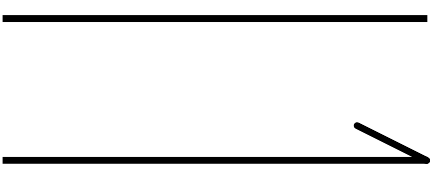

**Figure 29. Association Notation**

> 关联符号

**Example**

Example 10 illustrates two directed association relationships between a contract-合同,契约 and two business objects to which this contract refers.

> 示例 10 说明了契约和该契约所引用的两个业务对象之间的两个直接关联关系。

It also shows an association between a flow relationship and this contract, to indicate that the contract is transferred from Policy Creation to Policy Management.

> 它还显示了流关系与此契约之间的关联，以指示契约从策略创建转移到策略管理。

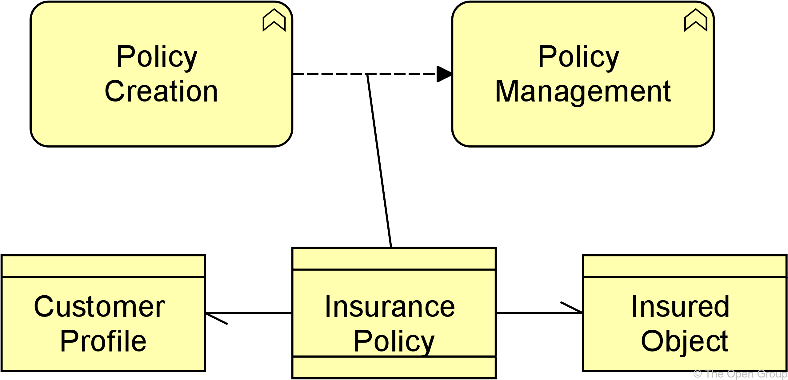

**Example 10: Association**

> 示例10：关联

### 5.2.5. Semantics of Dependency Relationships

> 依赖关系的语义

Dependency relationships describe that a part of the target element has a dependency on a part of the source element.

> 依赖关系描述了目标元素的一部分依赖于源元素的一部分。

Although there is a dependency between the two elements, it does not necessarily mean this applies to all of the parts of the element as defined by any structural relationships.

> 尽管两个元素之间存在依赖关系，但这并不一定意味着这适用于由任何结构关系定义的元素的所有部分。

This semantic allows you to model dependencies at a high level (with details removed) without implying-暗示,暗指 specific dependencies at a more detailed level.

> 这种语义允许您在高层次上对依赖关系进行建模(删除细节)，而不会在更详细的级别上暗示特定的依赖关系。

This means, for example, that:

> 例如，这意味着：

- In serving relationships, some part of an internal behavior element is served by some part of an external behavior element; for example, if a business service A serves a business process B, some unmodeled sub-service of A may serve an unmodeled sub-process of B

	> 在服务关系中，内部行为要素的某些部分由外部行为要素的某些部分提供服务；例如，如果业务服务 A 为业务流程 B 提供服务，则 A 的一些未建模的子服务可能会为 B 的未建模的子流程提供服务

- In access relationships, some part of a behavior element accesses some part of a passive structure element; for example, if an application function A accesses a data object B, some unmodeled sub-function of A may access an unmodeled part of B

	> 在访问关系中，行为元素的某些部分访问被动结构元素的某些部分；例如，如果应用程序函数A访问数据对象B，则A的一些未建模的子函数可能访问B的未建模部分

- In influence relationships, some part of a core element influences some part of a motivational element; for example, if an application component A influences a requirement B, some unmodeled part of A may influence some unmodeled part of B

	> 在影响关系中，核心元素的某些部分影响动机元素的某些部分；例如，如果应用程序组件A影响需求B，则A的某些未建模部分可能会影响B的某些未建模部分

- In association relationships, some part of an element is related to some part of another element; if it is directed, it can only be used in derivations-派生 in that direction (see [Section 5.7](https://pubs.opengroup.org/architecture/archimate3-doc/ch-Relationships-and-Relationship-Connectors.html#sec-Derivation-of-Relationships))

	> 在关联关系中，一个元素的某些部分与另一个元素的某些部分相关；如果它是定向的，它只能在该方向的派生中使用(参见 [Section 5.7](https://pubs.opengroup.org/architecture/archimate3-doc/ch-Relationships-and-Relationship-Connectors.html#sec-Derivation-of-Relationships) )。

**Example**

In the left-hand side of Example 11, a part of business process B is served by a part of application service A.

> 在示例11的左侧，业务流程B的一部分由应用程序服务a的一部分提供服务。

In the right-hand example, a part of business process B accesses (reads) a part of business object A.

> 在右边的示例中，业务流程B的一部分访问(读取)业务对象A的一部分。

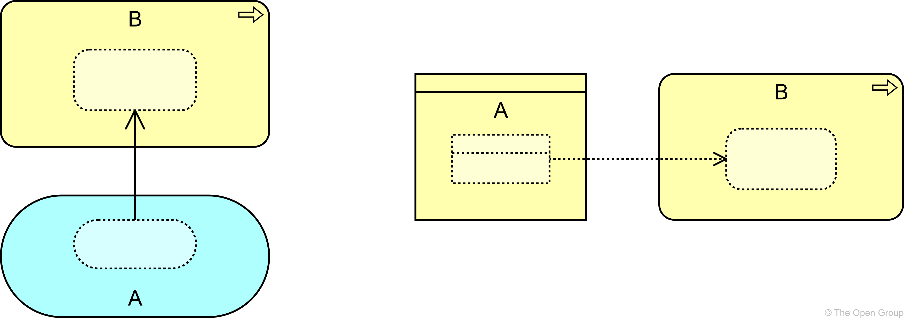

**Example 11: Semantics of Dependency Relationships**

> 示例11：依赖关系的语义

## 5.3. Dynamic Relationships

> 动态关系

The dynamic relationships describe temporal dependencies between elements within the architecture.

> 动态关系描述了体系结构中元素之间的时间依赖关系。

Two types of dynamic relationships are distinguished: *triggering* and *flow*.

> 这里区分了两种动态关系：触发关系和流关系。

### 5.3.1. Triggering Relationship

> 触发关系

The triggering relationship represents a temporal-时间的 or causal-因果的 relationship between elements.

> 触发关系表示元素之间的时间或因果关系。

The triggering relationship is used to model the temporal or causal precedence-优先级 of behavior elements in a process.

> 触发关系用于对流程中行为元素的时间或因果优先级进行建模。

The interpretation-解释说明 of a triggering relationship is that some part of the source element should be completed before the target element can start (see also [Section 5.3.3](https://pubs.opengroup.org/architecture/archimate3-doc/ch-Relationships-and-Relationship-Connectors.html#sec-Semantics-of-Dynamic-Relationships)).

> 触发关系的解释是源元素的某些部分应该在目标元素开始之前完成 [参见第5.3.3节](https://pubs.opengroup.org/architecture/archimate3-doc/ch-Relationships-and-Relationship-Connectors.html#sec-Semantics-of-Dynamic-Relationships)。

Note that this does not necessarily represent that one behavior element actively starts another; a traffic light turning green also triggers the cars to go through the intersection-十字路口,交汇点.

> 注意，这并不一定表示一个行为元素主动启动另一个行为元素；交通灯变绿也会促使汽车通过十字路口。

**Figure 30. Triggering Notation**

> 触发符号

**Example**

Example 12 illustrates that triggering relationships are used to model causal dependencies between (sub-)processes and/or events.

> 示例 12 说明了触发关系用于对(子)过程和/或事件之间的因果依赖进行建模。

**Example 12: Triggering**

> 示例12：触发

### 5.3.2. Flow Relationship

> 流关系

The flow relationship represents transfer from one element to another.

> 流关系表示从一个元素到另一个元素的转移。

The flow relationship is used to model the flow of, for example, information, goods, or money between behavior elements.

> 流关系用于模拟行为元素之间的流动，例如信息、商品或金钱。

A flow relationship does not imply a causal relationship.

> 流动关系并不意味着因果关系。

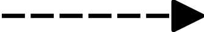

**Figure 31. Flow Notation**

> 流符号

**Example**

Example 13 shows a “Claim Assessment” business function, which forwards decisions about the claims to the “Claim Settlement-协议” business function.

> 示例13显示了一个“索赔评估”业务功能，它将有关索赔的决策转发给“索赔结算”业务功能。

In order to determine the order in which the claims should be assessed, “Claim Assessment” makes use of schedule information received from the “Scheduling” business function.

> 为了确定理赔评估的顺序，“理赔评估”使用从“Scheduling”业务功能接收到的进度信息。

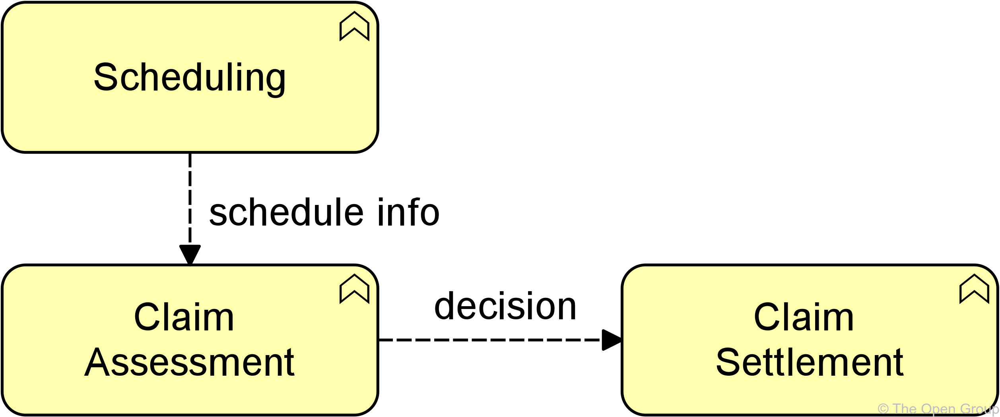

**Example 13: Flow**

> 示例13：流

### 5.3.3. Semantics of Dynamic Relationships

> 动态关系语义

The semantics of triggering and flow relationships differ.

> 触发关系和流关系的语义不同。

The triggering relationship follows the same semantics as structural relationships ([Section 5.1.5](https://pubs.opengroup.org/architecture/archimate3-doc/ch-Relationships-and-Relationship-Connectors.html#sec-Semantics-of-Structural-Relationships)).

> 触发关系遵循与结构关系相同的语义 ([Section 5.1.5](https://pubs.opengroup.org/architecture/archimate3-doc/ch-Relationships-and-Relationship-Connectors.html#sec-Semantics-of-Structural-Relationships))。

A triggering relationship from A to B indicates that everything in B is preceded-在…之前发生 by a part of A.

> 从 A 到 B 的触发关系表示 B 中的所有内容之前都有 A 的一部分。

When A and B are business processes, for example, it means that all steps in business process B are performed after a part of A has occurred, but steps in A can occur after some or all steps in B have occurred.

> 例如，当A和B是业务流程时，这意味着业务流程B中的所有步骤都是在A的一部分发生之后执行的，但是A中的步骤可以在B中的部分或全部步骤发生之后发生。

A stronger interpretation of triggering (everything in B is preceded by everything in A) could be imposed-强制推行,强制实行,强加于 on the ArchiMate model by a modeling group wishing to do so.

> 对触发的更强的解释(B中的所有内容都先于A中的所有内容)可以通过希望这样做的建模组强加给 ArchiMate 模型。

The flow relationships follow the same semantics as dependency relationships (see [Section 5.2.5](https://pubs.opengroup.org/architecture/archimate3-doc/ch-Relationships-and-Relationship-Connectors.html#sec-Semantics-of-Dependency-Relationships)).

> 流关系遵循与依赖关系相同的语义(参见 [Section 5.2.5](https://pubs.opengroup.org/architecture/archimate3-doc/ch-Relationships-and-Relationship-Connectors.html#sec-Semantics-of-Dependency-Relationships))。

A flow relationship from A to B indicates that the whole or some part of A transfers something (e.g., information) to the whole or some part of B.

> 从 A 到 B 的流动关系是指 A 的整体或部分将某些东西(如信息)传递给B的整体或部分。

## 5.4. Other Relationships

> 其他关系

### 5.4.1. Specialization Relationship

> 专业化的关系

The specialization relationship represents that an element is a particular kind of another element.

> 专业化关系表示一个元素是另一个元素的特定类型。

The specialization relationship has been inspired by the generalization-泛化 relationship in UML class diagrams but is applicable-适用的,适当的 to specialize a wider range of concepts.

> 专业化关系受到 UML 类图中的泛化关系的启发，但适用于专业化范围更广的概念。

A specialization relationship is always allowed between two instances of the same element type.

> 在相同元素类型的两个实例之间始终允许有专业化关系。

**Figure 32. Specialization Notation**

> 专业化符号

Alternatively-要不,或者, a specialization relationship can be expressed by nesting the specialized element inside the generic-泛型 element.

> 或者，专业化关系可以通过在泛型元素中嵌套专业化元素来表示。

**Example**

Example 14 illustrates the use of the specialization relationship for a process.

> 示例14 演示了对流程的专门化关系的使用。

In this case, the “**Take Out**-购买 Travel Insurance” and “Take Out Luggage-行李 Insurance” business processes are a specialization of a more generic “Take Out Insurance” business process.

> 在这种情况下，“购买旅行保险”和“购买行李保险”业务流程是更通用的“购买保险”业务流程的专门化。

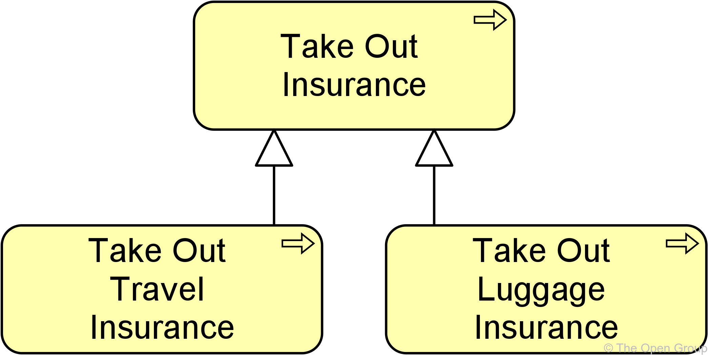

**Example 14: Specialization**

> 专业化

### 5.4.2. Semantics of Other Relationships

> 其他关系的语义

The semantics of the specialization relationship are that the whole of the generic element is specialized by the specialized element.

> 专业化关系的语义是整个泛型元素被专业化元素专业化。

## 5.5. Relationship Connectors

> 连接器的关系

### 5.5.1. Junction

> 连接

A junction is not an actual relationship in the same sense as the other relationships described in this chapter, **but rather**-而是 a relationship connector.

> 与本章中描述的其他关系不同，连接不是一个实际的关系，而是一个关系连接器。

A junction is used to connect relationships of the same type.

> 连接用于连接相同类型的关系。

A path with junctions that connect relationships of a specific type is only allowed between two concepts if a direct relationship of that type between these concepts is also permitted.

> 只有在两个概念之间存在直接关系的情况下，才允许在两个概念之间存在连接特定类型关系的连接路径。

Simply put, you cannot use junctions to create relationships between concepts that would otherwise not be allowed.

> 简单地说，您不能使用连接来创建概念之间的关系，否则这些关系是不允许的。

A junction may have multiple incoming relationships and one outgoing relationship, one incoming relationship and multiple outgoing relationships, or multiple incoming and outgoing relationships (the latter can be considered a shorthand-简写 of two contiguous-连续的 junctions).

> 一个连接点可以有多个传入关系和一个传出关系，一个传入关系和多个传出关系，或者多个传入和传出关系(后者可以被认为是两个连续连接点的简写)。

A junction is used to explicitly express that all elements together must participate in the relationship (*and* junction) or that at least one of the elements participates in the relationship (*or* junction).

> 连接用于显式表示所有元素必须一起参与关系( *and* 连接)，或者至少有一个元素参与关系( *or* 连接)。

The *or* junction can be used to express both inclusive and exclusive or conditions, which could be indicated by a modeler by naming the junction to reflect its type.

> 可以使用 *or* 连接来表示包含和排除或条件，建模者可以通过命名连接来反映其类型来指示这些条件。

In addition to the above, a junction (which connects some relationships), may also be aggregated or composed in a plateau-稳定期,停滞期, grouping, or location element.

> 除此之外，连接(连接某些关系)也可以在平台、分组或位置元素中聚集或组成。

If that junction connects other aggregation or composition relationships, it should be interpreted-解释,说明 without the aggregation or composition to this containing element.

> 如果该连接连接了其他聚合或组合关系，则应该在不将聚合或组合解释到包含该元素的情况下对其进行解释。

The composition or aggregation merely-仅仅 states that the junction is part of a plateau, grouping, or location.

> 组合或聚集仅仅说明该连接点是平台、分组或位置的一部分。

Without that relationship, the junction must fulfill the same conditions as above: it connects relationships of the same type, with at least one incoming and one outgoing relationship.

> 如果没有这种关系，结点必须满足上述相同的条件：它连接相同类型的关系，至少有一个传入关系和一个传出关系。

It is allowed to omit-省去,遗漏 arrowheads-箭头 of relationships leading into a junction.

> 省略关系的箭头是允许的。

**Figure 33. Junction Notation**

> 连接符号

Junctions may be used on triggering relationships.

> 连接可用于触发关系。

This is a technique used by other modeling languages.

> 这是其他建模语言使用的一种技术。

For example, the BPMN notation uses gateways-网关 as junctions, and the UML notation uses forks and joins in their modeling activity diagrams.

> 例如，BPMN 表示法使用网关作为连接，UML 表示法在其建模活动图中使用分叉和连接。

They can be used to model high-level process flow.

> 它们可用于为高级流程流建模。

A label may be added to outgoing triggering relationships of a junction to indicate a choice, condition, or guard-保护 that applies to that relationship.

> 可以在连接的外向触发关系中添加标签，以指示适用于该关系的选择、条件或保护。

Such a label is only an informal-非正式的 indication.

> 这样的标签只是一种非正式的指示。

No formal, operational semantics have been defined for these relationships because implementation-level languages such as BPMN and UML, differ in their execution semantics and the ArchiMate language does not want to unduly-过度地,不适当地 constrain mappings to such languages.

> 没有为这些关系定义正式的、可操作的语义，因为实现级语言(如 BPMN 和 UML )的执行语义不同，而 ArchiMate 语言不希望过度地将映射约束到这些语言。

**Examples**

In Example 15, the and junction in the model is used to denote that the “Sales” and “Finance” business functions together realize the “Invoicing” business service.

> 在示例15中，模型中的和连接用于表示“Sales”和“Finance”业务功能一起实现“Invoicing”业务服务。

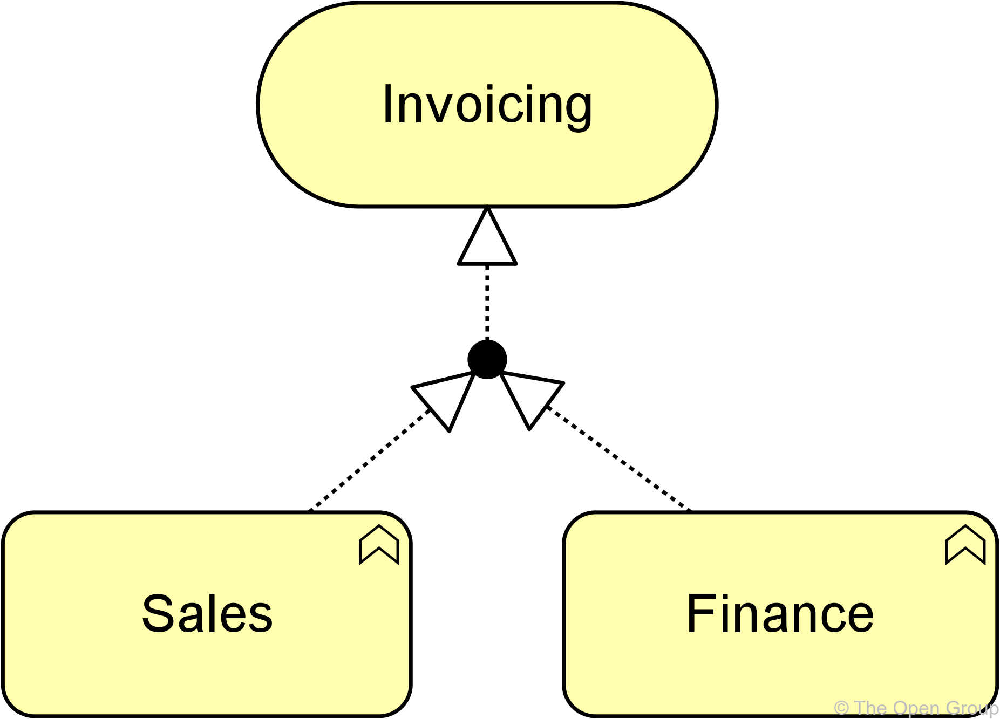

**Example 15: (And) Junction**

> 示例15：and 连接

In Example 16, the or junction is used to denote a choice: business process “Assess Request” triggers either “Accept Request” or “Reject Request”. (The usual interpretation of two separate triggering relations, one from “Assess Request” to “Accept Request” and one from “Assess Request” to “Reject Request”, is that “Assess Request” triggers both of the other business processes.)

> 在示例16中，或连接用于表示一种选择:业务流程“评估请求”触发“接受请求”或“拒绝请求”。
>
> (对于两个独立的触发关系，一个从“评估请求”到“接受请求”，另一个从“评估请求”到“拒绝请求”，通常的解释是“评估请求”触发其他两个业务流程。)

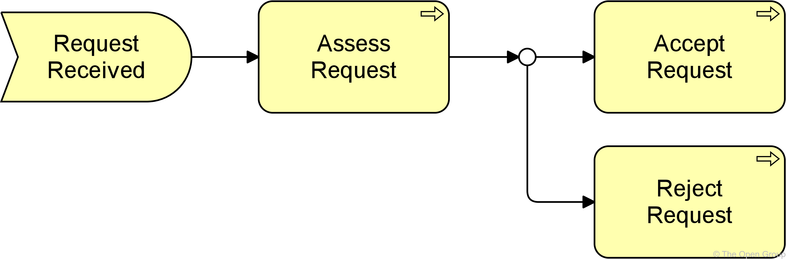

**Example 16: Or Junction**

> 示例16：or 连接

## 5.6. Summary of Relationships

> 关系总结

Table 3 gives an overview of the ArchiMate relationships with their definitions.

> 表3 概述了 ArchiMate 关系及其定义。

**Table 3. Relationships**

> 关系

| Structural Relationships     |                                                              | Notation                                                     | Role Names                                                |
| ---------------------------- | ------------------------------------------------------------ | ------------------------------------------------------------ | --------------------------------------------------------- |
| Composition                  | Represents that an element consists of one or more other concepts. 表示元素由一个或多个其他概念组成。 |  | → composed of ← composed in                           |
| Aggregation                  | Represents that an element combines one or more other concepts. 表示一个元素结合了一个或多个其他概念。 |  | → aggregates ← aggregated in                          |
| Assignment                   | Represents the allocation-分配 of responsibility, performance of behavior, storage, or execution. 表示职责的分配、行为的执行、存储或执行。 |  | → assigned to ← has assigned                          |
| Realization                  | Represents that an element plays a critical role in the creation, achievement, sustenance, or operation of a more abstract element. 表示一个元素在一个更抽象的元素的创造、成就、支持或操作中起着关键作用。 |  | → realizes ← realized by                              |
|                              |                                                              |                                                              |                                                           |
| **Dependency Relationships** |                                                              | **Notation**                                                 | **Role Names**                                            |
| Serving - 服务               | Represents that an element provides its functionality to another element. 表示一个元素将其功能提供给另一个元素。 |  | → serves ← served by                                  |
| Access - 访问                | Represents the ability of behavior and active structure elements to observe or act upon passive structure elements. 表示行为和主动结构元素观察或作用于被动结构元素的能力。 |   | → accesses ← accessed by                              |
| Influence - 影响             | Represents that an element affects the implementation or achievement of some motivation element. 表示某个元素影响某些动机元素的实现或实现。 |  | → influences ← influenced by                              |
| Association - 关联           | Represents an unspecified relationship, or one that is not represented by another ArchiMate relationship. 表示未指定的关系，或未由另一个 ArchiMate 关系表示的关系。 |  | associated with → associated to ← associated from |
|                              |                                                              |                                                              |                                                           |
| **Dynamic Relationships**    |                                                              | **Notation**                                                 | **Role Names**                                            |
| Triggering - 触发            | Represents a temporal or causal relationship between elements. 表示元素之间的时间关系或因果关系。 |  | → triggers ← triggered by                             |
| Flow - 流                    | Represents transfer from one element to another. 表示从一个元素到另一个元素的转移。 |     | → flows to ← flows from                               |
|                              |                                                              |                                                              |                                                           |
| **Other Relationships**      |                                                              | **Notation**                                                 | **Role Names**                                            |
| Specialization - 专业化      | Represents that an element is a particular kind of another element. 表示一个元素是另一个元素的特定类型。 |  | → specializes ← specialized by                        |
|                              |                                                              |                                                              |                                                           |
| **Relationship Connectors**  |                                                              | **Notation**                                                 | **Role Names**                                            |
| Junction - 连接              | Used to connect relationships of the same type. 用于连接相同类型的关系。 |  |                                                           |

## 5.7. Derivation-派生 of Relationships

> 派生关系

In the ArchiMate language, you can derive indirect relationships between elements in a model, based on the modeled relationships.

> 在 ArchiMate 语言中，您可以基于建模的关系派生出模型中元素之间的间接关系。

This makes it possible to abstract from intermediary-中间的,过渡的 elements that are not relevant in order to show a certain model or view of the architecture that supports impact analysis.

> 这使得从不相关的中间元素中抽象出来，以显示支持影响分析的体系结构的某个模型或视图成为可能。

The precise-精确的,准确的 rules for making such derivations are specified in [Appendix B](https://pubs.opengroup.org/architecture/archimate3-doc/ch-relationships-Normative.html).

> 进行此类推导的精确规则见 [附录B](https://pubs.opengroup.org/architecture/archimate3-doc/ch-relationships-Normative.html)。

**Example**

In Example 17, assume that the goal is to abstract from the application functions, sub-functions, and services in the model.

> 在示例17中，假设目标是从模型中的应用程序功能、子功能和服务中抽象出来。

In this case, an indirect serving relationship (thick-厚的 red arrow on the right) can be derived from “Financial Application” to the “Invoicing and Collections” business process (from the chain assignment – composition – realization – serving).

> 在这种情况下，可以从“财务应用程序”派生到“发票和收款”业务流程(从链分配-组合-实现-服务)的间接服务关系(右侧粗红色箭头)。

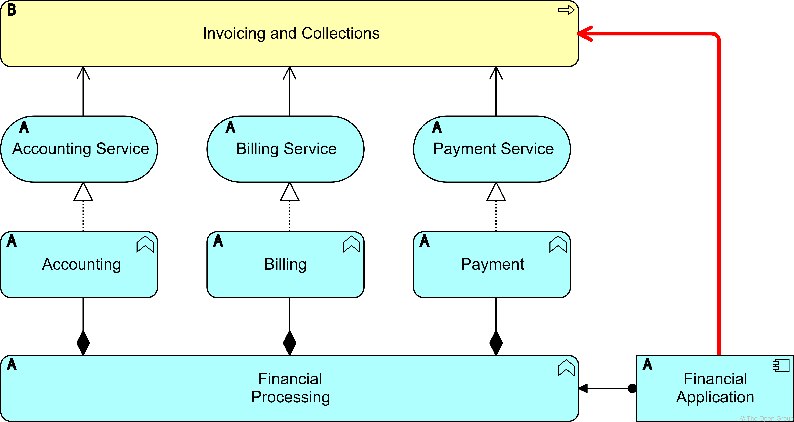

**Example 17: Derivation from a Chain of Relationships**

> 示例17：关系链的推导

Derivation of relationships is intended as a way to create summaries of detailed models.

> 关系的派生是用来创建详细模型的摘要的一种方法。

It is a way to remove (to abstract from) details in a model while still making valid “statements”.

> 这是一种删除(抽象)模型细节的方法，同时仍然可以做出有效的“陈述”。

Hence-因此,之后, derivation is always meant to go from more detail to less detail.

> 因此，推导总是意味着从更多的细节到更少的细节。

This mechanism-机制,机构 is one of the unique properties of the ArchiMate language compared to other modeling languages.

> 与其他建模语言相比，这种机制是 ArchiMate 语言的独特属性之一。

The language allows the modeler to directly create relationships that are necessarily valid derived relationships without the constituents-成分,组成的,构成的 of the derivation being available in the model.

> 该语言允许建模者直接创建关系，这些关系是必要的有效派生关系，而派生的成分在模型中是可用的。

These relationships (for example, a realization relationship between an application component and an application service) assume that the required constituents (for example, an application function) needed for the derived relationship exist;

> 这些关系(例如，应用程序组件和应用程序服务之间的实现关系)假定存在派生关系所需的组件(例如，应用程序功能);

however, these missing elements need not be modeled explicitly, and the derived relationships can be used as if they have not been derived.

> 然而，这些缺失的元素不需要明确的建模，并且可以使用派生关系，就好像它们没有派生一样。

Thus-因此,这样, the modeler has full freedom in choosing the required level of detail.

> 因此，建模者在选择所需的细节级别方面有充分的自由。

Because the essence-本质,要素 of derivation is to make simplifications or summaries, it cannot be used to infer more detail.

> 因为推导的本质是简化或总结，它不能用来推断更多的细节。

For example, a realization relationship from an application component to an application service can be modeled, but from it no conclusions-结论,推论 can be drawn about the exact source of this derivation (e.g., which functions realize which services).

> 例如，可以对从应用程序组件到应用程序服务的实现关系进行建模，但从中无法得出关于该派生的确切来源的结论(例如，哪个函数实现哪个服务)。

This is information that should be added by a modeler during the design process: a higher-level, more abstract model can be refined by elaborating-细说,阐述 the derived relationships (in the previous example by adding an application function that realizes the application service and to which the application component is assigned).

> 这是建模人员在设计过程中应该添加的信息：可以通过细化派生关系来细化更高级别、更抽象的模型(在前面的示例中，通过添加实现应用程序服务的应用程序功能，并将应用程序组件分配给它)。

It is important to note that all these derived relationships are also valid in the ArchiMate language.

> 值得注意的是，所有这些派生关系在 ArchiMate 语言中也是有效的。

They are not shown in the metamodel diagrams included in the standard because this would reduce their legibility-易读性,易辨认.

> 它们没有显示在标准中包含的元模型图中，因为这会降低它们的易读性。

However, the tables in [Appendix B](https://pubs.opengroup.org/architecture/archimate3-doc/ch-relationships-Normative.html) show all permitted relationships between two elements in the language.

> 然而，[附录B](https://pubs.opengroup.org/architecture/archimate3-doc/ch-relationships-Normative.html) 中的表格显示了语言中两个元素之间所有允许的关系。

