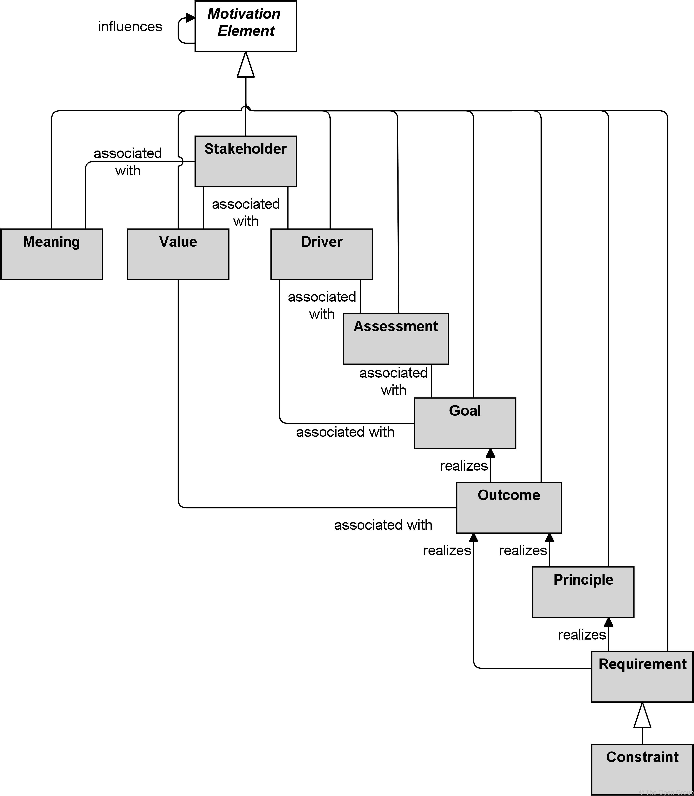
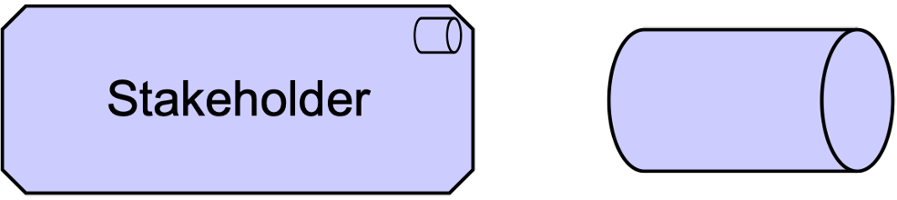
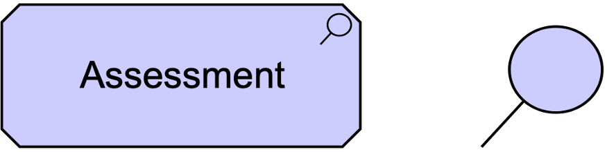
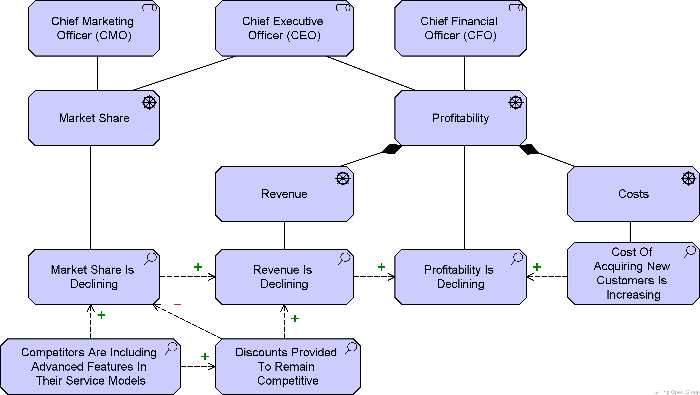
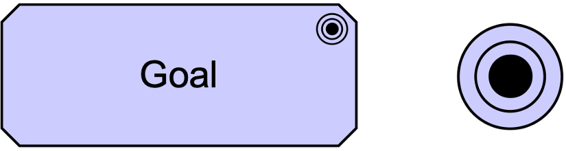
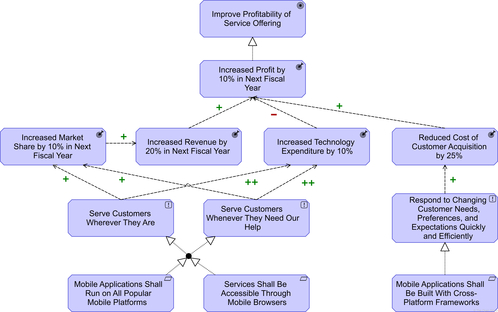
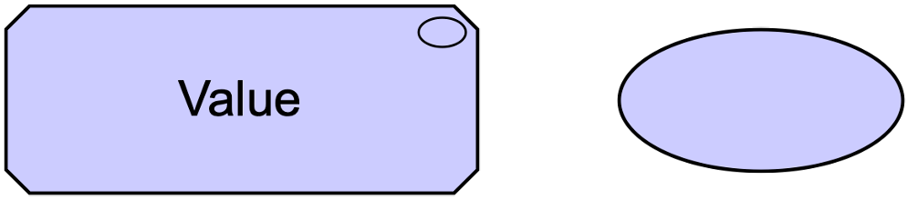
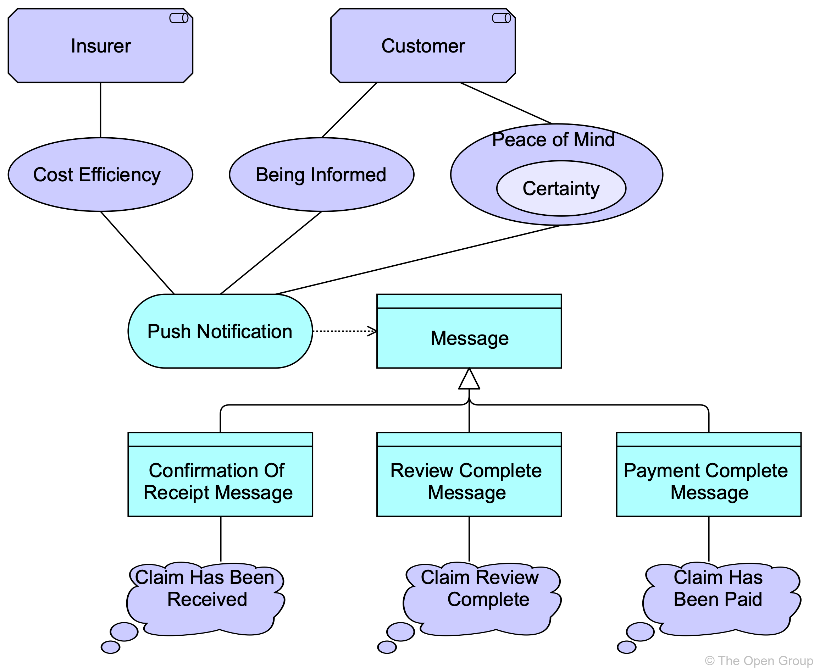
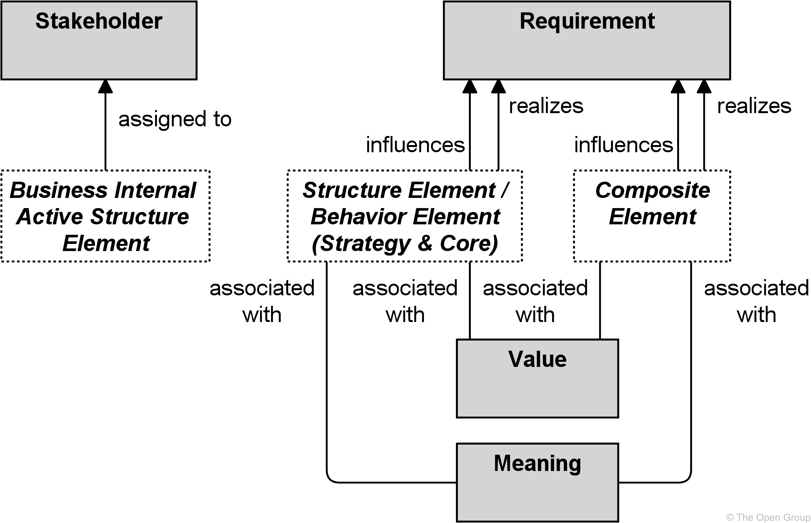

# Chapter 6. Motivation Elements

> 动机元素

Motivation elements are used to model the motivations, or reasons, that guide the design or change of an Enterprise Architecture.

> 动机元素用于对指导企业架构设计或变更的动机或原因进行建模。

## 6.1. Motivation Elements Metamodel

> 动机元素元模型

Figure 34 gives an overview of the motivation elements and their relationships.

> 图 34 给出了动机元素及其关系的概述。

**Figure 34. Motivation Elements Metamodel**

> 图34. 动机元素元模型

> [!NOTE]
>
> This figure does not show all permitted relationships; every element in the language can have composition, aggregation, and specialization relationships with elements of the same type.
>
> > 这个数字并没有显示所有允许的关系;语言中的每个元素都可以与相同类型的元素具有组合、聚合和专门化关系。
>
> Furthermore-此外,而且, there are indirect relationships that can be derived, as explained in [Section 5.7](https://pubs.opengroup.org/architecture/archimate3-doc/ch-Relationships-and-Relationship-Connectors.html#sec-Derivation-of-Relationships).
>
> > 此外，还可以推导出间接关系，如 [第5.7节](https://pubs.opengroup.org/architecture/archimate3-doc/ch-Relationships-and-Relationship-Connectors.html#sec-Derivation-of-Relationships) 所述。
>
> The full specification of permitted relationships can be found in [Appendix B](https://pubs.opengroup.org/architecture/archimate3-doc/ch-relationships-Normative.html).
>
> > 允许关系的完整规范可以在 [附录B](https://pubs.opengroup.org/architecture/archimate3-doc/ch-relationships-Normative.html) 中找到。

## 6.2. Stakeholder, Driver, and Assessment

> 利益相关者、驱动和评估

It is essential to understand the factors, often referred to as *drivers*, which influence other motivation elements.

> 有必要了解影响其他动机因素的因素，通常被称为“驱动因素”。

They can originate from either inside or outside the enterprise.

> 它们可以来自企业内部，也可以来自企业外部。

A *stakeholder* can be an individual or a group of people, such as a project team, enterprise, or society-社会.

> 利益相关者可以是个人，也可以是一群人，比如项目团队、企业或社会。

Drivers that are associated with a stakeholder are often called “concerns-关注点” of that stakeholder.

> 与涉众相关联的驱动通常被称为涉众的“关注点”。

Examples of such drivers are customer satisfaction, compliance-合规,服从,遵守 to legislation-法规,法律, or profitability-盈利能力.

> 这些驱动因素的例子包括客户满意度、对法规的遵守或盈利能力。

It is common for enterprises to undertake-承担,从事 an *assessment* of these drivers; e.g., using a Strengths-优势, Weaknesses-劣势, Opportunities, and Threats-威胁,恐吓 (SWOT) analysis, in order to respond in the best way.

> 企业通常会对这些驱动因素进行“评估”；例如，使用优势，劣势，机会和威胁(SWOT)分析，以便以最佳方式做出反应。

### 6.2.1. Stakeholder

> 涉众

A stakeholder represents the role of an individual, team, or organization (or classes thereof-在其中,由此) that represents their interests-利益 in the effects-效果 of the architecture.

> 涉众代表个人、团队或组织(或其类)的角色，代表他们在体系结构效果中的利益。

This definition is based on the definition in the TOGAF framework [[4](https://pubs.opengroup.org/architecture/archimate3-doc/ch-Referenced-docs.html#Ref4)].

> 该定义基于 TOGAF 框架中的定义 [[4](https://pubs.opengroup.org/architecture/archimate3-doc/ch-Referenced-docs.html#Ref4)] )。

A stakeholder has one or more interests in, or concerns about, the organization and its Enterprise Architecture.

> 涉众对组织及其企业体系结构有一个或多个兴趣或关注。

In order to direct efforts to these interests and concerns, stakeholders change, set, and emphasize goals.

> 为了将努力导向这些利益和关注点，涉众改变、设定并强调目标。

Stakeholders may also influence each other.

> 利益相关者也可能相互影响。

Examples of stakeholders are the Chief Executive Officer (CEO), **the board of directors**-董事会, shareholders-股东, customers, business and application architects, but also legislative-立法的 authorities-机构,官方.

> 涉众的例子包括首席执行官(CEO)、董事会、股东、客户、业务和应用程序架构师，以及立法机构。

The name of a stakeholder should preferably-更合意地,最好是 be a noun-名词.

> 利益相关者的名字最好是名词。

**Figure 35. Stakeholder Notation**

> 图35. 涉众符号

### 6.2.2. Driver

> 驱动

A driver represents an external or internal condition that motivates-激励,激发 an organization to define its goals and implement the changes necessary to achieve them.

> 驱动程序表示激励组织定义其目标并实现实现目标所需的变更的外部或内部条件。

Drivers that are associated with a stakeholder are often called “concerns” of that stakeholder.

> 与涉众相关联的驱动通常被称为涉众的“关注点”。

Stakeholder concerns are defined in the TOGAF framework [[4](https://pubs.opengroup.org/architecture/archimate3-doc/ch-Referenced-docs.html#Ref4)] as “*an interest in a system relevant to one or more of its stakeholders. Concerns may pertain-适合,关于 to any aspect of the system’s functioning, development, or operation, including considerations-考虑因素 such as performance-性能, reliability-可靠性, security, distribution, and evolvability and may determine the acceptability of the system.*”

> 涉众关注在TOGAF框架[[4](https://pubs.opengroup.org/architecture/archimate3-doc/ch-Referenced-docs.html#Ref4)])中被定义为“与一个或多个涉众相关的系统中的利益。关注可能涉及系统功能、开发或操作的任何方面，包括性能、可靠性、安全性、分布和可演化性等考虑因素，并可能决定系统的可接受性。”

Examples of internal drivers are customer satisfaction and profitability-盈利能力.

> 内部驱动因素的例子是客户满意度和盈利能力。

Drivers of change may also be external to the enterprise (e.g., economic-经济的 changes or changing legislation-立法,法规) and need not have a stakeholder associated with them.

> 变革的驱动因素也可能是企业外部的(例如，经济变化或不断变化的立法)，不需要与利益相关者相关联。

The name of a driver should preferably be a noun.

> 驱动的名字最好是名词。

**Figure 36. Driver Notation**

> 图36. 驱动符号

### 6.2.3. Assessment

> 评估

An assessment represents the result of an analysis of the state of affairs-事务 of the enterprise with respect-方面,尊敬 to some driver.

> 评估代表了对企业有关某些驱动因素的事务状态进行分析的结果。

An assessment may reveal-揭示,透露 strengths-优势, weaknesses-劣势, opportunities, or threats-威胁 for some area of interest.

> 评估可能会揭示某些领域的优势、劣势、机会或威胁。

These need to be addressed by adjusting existing goals or setting new ones, which may trigger changes to the Enterprise Architecture.

> 需要通过调整现有目标或设置新目标来解决这些问题，这可能会触发对企业架构的更改。

Strengths and weaknesses are internal to the organization.

> 优势和劣势是组织内部的。

Opportunities and threats are external to the organization.

> 机会和威胁是组织的外部因素。

Weaknesses and threats can be considered as problems that need to be addressed by goals that “negate-否定,使无效” the weaknesses and threats.

> 弱点和威胁可以被视为需要通过“否定”弱点和威胁的目标来解决的问题。

Strengths and opportunities may be translated directly into goals.

> 优势和机会可以直接转化为目标。

For example, the weakness “Customers complain-抱怨,投诉 about the helpdesk-帮助台” can be addressed by defining the goal “Improve helpdesk”. 

> 例如，弱点“客户抱怨帮助台”可以通过定义目标“改进帮助台”来解决。

Or the opportunity “Customers favor insurances that can be managed online” can be addressed by the goal “Introduce online portfolio management”.

> 或者，“客户喜欢可以在线管理的保险”这个机会可以通过“引入在线投资组合管理”这个目标来解决。

The name of an assessment should preferably be a noun or a (very) short sentence.

> 评估的名称最好是一个名词或一个(非常)简短的句子。

**Figure 37. Assessment Notation**

> 图37. 评估符号

### 6.2.4. Example

The stakeholder “Chief Marketing Officer (CMO)” is concerned with the driver “Market Share”, the stakeholder “Chief Executive Officer (CEO)” is concerned with the drivers “Market Share” and “Profitability”, and the stakeholder “Chief Financial Officer (CFO)” is concerned with the driver “Profitability”.

> 利益相关者“首席营销官(CMO)”关注的是驱动因素“市场份额”，利益相关者“首席执行官(CEO)”关注的是驱动因素“市场份额”和“盈利能力”，利益相关者“首席财务官(CFO)”关注的是驱动因素“盈利能力”。

The driver “Profitability” is composed of two other drivers: “Revenue” and “Costs”.

> 驱动“盈利能力”由另外两个驱动组成：“收入”和“成本”。

Several assessments are associated with these drivers (e.g., the assessment “Market Share Is Declining-下降,减少” is associated with driver “Market Share”), and assessments may influence each other in a positive or negative way (e.g., “Market Share Is Declining” results in “Revenue Is Declining”, which in turn results in “Profitability Is Declining”).

> 若干评估与这些驱动因素相关联(例如，评估“市场份额在下降”与驱动因素“市场份额”相关联)，评估可能以积极或消极的方式相互影响(例如，“市场份额在下降”导致“收入在下降”，进而导致“盈利能力在下降”)。

**Example 18: Stakeholder, Driver, and Assessment**

> 示例18 涉众、驱动和评估

## 6.3. Goal, Outcome, Principle, Requirement, and Constraint

> 目标、结果、原则、要求和约束

The motivation of an organization or individual to achieve certain results is represented by goals, principles, requirements, and constraints.

> 组织或个人实现某些结果的动机由目标、原则、要求和约束来表示。

*Goals* represent that a stakeholder wants to realize a certain outcome; e.g., “Increase customer satisfaction by 10%”.

> *目标*表示利益相关者想要实现某种结果；例如，“将客户满意度提高10%”。

The end results realized by capabilities that realize these goals are *outcomes.*

> 实现这些目标的能力所实现的最终目标是结果。

Principles and requirements represent desired-期望的,渴望的 properties of solutions – or means-方法 – to realize the goals.

> 原则和需求表示实现目标所需的解决方案或方法的属性。

*Principles* are normative-规范的,标准的 guidelines-指导方针 that guide the design of all possible solutions in a given context.

> **原则**是在给定环境中指导设计所有可能解决方案的规范性指导方针。

For example, the principle “Data should be stored only once” represents a means to achieve the goal of “Data consistency” and applies to all possible designs of the organization’s architecture.

> 例如，“数据应该只存储一次”的原则代表了实现“数据一致性”目标的一种手段，并适用于组织架构的所有可能设计。

*Requirements* represent formal statements of need, expressed-表达,体现 by stakeholders, which must be met by the architecture or solutions.

> **需求**表示需求的正式陈述，由涉众表达，必须由体系结构或解决方案满足。

For example, the requirement “Use a single CRM system” conforms-遵守,符合 to the aforementioned-上述的,前面提及的 principle by applying it to the current organization’s architecture in the context of the management of customer data.

> 例如，“使用单个CRM系统”的需求通过将其应用于客户数据管理上下文中的当前组织架构，从而符合上述原则。

### 6.3.1. Goal

> 目标

A goal represents a high-level statement of intent-目的,意图, direction, or desired end state for an organization and its stakeholders.

> 目标代表了组织及其涉众的意图、方向或期望的最终状态的高级声明。

In principle, a goal can represent anything a stakeholder may desire, such as a state of affairs-事务,事情, or a produced value.

> 原则上，目标可以表示涉众可能期望的任何东西，例如事务状态或产生的价值。

Examples of goals are: to increase profit, to reduce waiting times at the helpdesk, or to introduce-引入,介绍,引见 online portfolio management. 

> 目标的例子有：增加利润，减少在帮助台的等待时间，或者引入在线投资组合管理。

Goals are typically used to measure success of an organization.

> 目标通常用来衡量一个组织的成功。

Goals are generally expressed using qualitative-定性的,质量的 words; e.g., “increase”, “improve”, or “easier”.

> 目标一般用定性词汇来表达；例如，" increase "， " improve "，或" easy "。

Goals can also be decomposed-分解,腐烂; e.g., “increase profit” can be decomposed into the goals “reduce cost” and “increase sales”. 

> 目标也可以分解；例如，“增加利润”可以分解为“降低成本”和“增加销售”两个目标。

However, it is also very common to associate-联系 concrete-具体的,实在的 outcomes with goals, which can be used to describe both the quantitative and time-related results that are essential to describe the desired state, and when it should be achieved.

> 然而，将具体的结果与目标联系起来也是很常见的，它可以用来描述定量的和与时间相关的结果，这些结果对于描述期望的状态以及何时应该实现是必不可少的。

**Figure 38. Goal Notation**

> 图38. 目标符号

### 6.3.2. Outcome

> 结果

An outcome represents an end result, effect-效果, or consequence-结果,后果 of a certain state of affairs.

> 结果表示某一事件状态的最终结果、效果或后果。

Outcomes are high-level, business-oriented results produced by capabilities of an organization, and by inference-推断,推理 by the core elements of its architecture that realize these capabilities.

> 结果是由组织的能力以及通过实现这些能力的体系结构核心元素的推断产生的高层次的、面向业务的结果。

Outcomes are tangible, possibly quantitative, and time-related, and can be associated with assessments.

> 结果是有形的，可能是定量的，与时间相关的，并且可以与评估相关联。

An outcome may have a different value for different stakeholders.

> 结果对于不同的涉众可能具有不同的价值。

The notion-概念,想法 of outcome is important in business outcome-driven approaches to Enterprise Architecture and in capability-based planning.

> 在企业架构的业务结果驱动方法和基于能力的规划中，结果的概念非常重要。

Outcomes are closely-密切地 related to requirements, goals, and other intentions-意图,目的.

> 结果与需求、目标和其他意图密切相关。

The distinction between goals and outcomes is important.

> 目标和结果之间的区别很重要。

Simply put, a goal is what you want, and an outcome is what you get.

> 简单地说，目标是你想要的，结果是你得到的。

Outcomes are the end results, and goals or requirements are often related to outcomes that should be realized.

> 结果是最终结果，目标或需求通常与应该实现的结果相关。

Capabilities-功能,能力 can be designed to achieve such outcomes.

> 可以设计功能来实现这样的结果。

However, not all outcomes relate to goals.

> 然而，并不是所有的结果都与目标有关。

When modeling a future state, an outcome models some result or effect that is expected to have been achieved or occur at that future point in time.

> 当对未来状态进行建模时，结果对预期在未来时间点已经实现或发生的一些结果或效果进行建模。

Unlike goals, outcomes can also be used to model potentially unwanted effects; for example, in order to design appropriate-合适的,相称的 mitigating-减轻,缓和 measures-措施,衡量.

> 与目标不同，结果也可以用来模拟潜在的不良影响;例如，为了设计适当的缓解措施。

Outcome names should unambiguously-明白地 identify end results that have been achieved or are expected to be achieved at a definite point in the future.

> 结果名称应明确地指明已达到或预期在未来某一时刻达到的最终结果。

Examples include “First-place customer satisfaction ranking achieved” and “Key supplier partnerships-合作伙伴 **in place**-到位”.

> 例子包括“客户满意度排名第一”和“关键供应商合作伙伴关系到位”。

Outcome names can also be more specific; e.g., “10% year-over-year-同比 quarterly profits increase in 2018”.

> 结果名称也可以更具体;例如，“2018年季度利润同比增长10%”。

**Figure 39. Outcome Notation**

> 图39. 结果符号

### 6.3.3. Principle

> 原则

A principle represents a statement of intent defining a general property that applies to any system in a certain context in the architecture-体系结构.

> 原则代表了一种意图声明，它定义了一种通用属性，这种属性适用于体系结构中特定上下文中的任何系统。

The term “system” is used in its general meaning; i.e., as a group of (functionally) related elements, where each element may be considered as a system again.

> 术语“系统”是按其一般含义使用的；例如，作为一组(功能上)相关的元素，其中每个元素可以再次被视为一个系统。

Therefore, a system may refer to any active structural element, behavior element, or passive structural element of some organization, such as a business actor, application component, business process, application service, business object, or data object.

> 因此，系统可以引用某个组织的任何主动结构元素、行为元素或被动结构元素，例如业务参与者、应用程序组件、业务流程、应用程序服务、业务对象或数据对象。

Principles are strongly related to goals and requirements.

> 原则与目标和需求密切相关。

Similar to requirements, principles define intended-预期的 properties of systems.

> 与需求类似，原则定义了系统的预期属性。

However, in contrast-对比,对照 to requirements, principles are broader in scope and more abstract than requirements.

> 然而，与需求相比，原则的范围更广，而且比需求更抽象。

A principle defines a general property that applies to any system in a certain context, whereas-但是,然而 a requirement defines a property that applies to a specific system as described by an architecture.

> 原则定义了适用于特定上下文中任何系统的一般属性，而需求定义了适用于架构所描述的特定系统的属性。

For example, the principle “Information management processes comply-遵从,服从 with all relevant laws, policies, and regulations” is realized by the requirements that are imposed-强制推行,强制实行 by the actual laws, policies, and regulations-法规,规则 that apply to the specific system under design.

> 例如，“信息管理过程遵守所有相关的法律、政策和法规”的原则是通过应用于所设计的特定系统的实际法律、政策和法规所施加的需求来实现的。

**Figure 40. Principle Notation**

> 图40. 原则符号

### 6.3.4. Requirement

> 需求

A requirement represents a statement of need defining a property that applies to a specific system as described by the architecture.

> 需求代表了需求的陈述，定义了应用于体系结构所描述的特定系统的属性。

In the end, a business goal must be realized by a plan or concrete change goal, which may or may not require a new system or changes to an existing system.

> 最后，业务目标必须通过计划或具体的变更目标来实现，这可能需要也可能不需要新的系统或对现有系统的变更。

Requirements model the properties of these elements that are needed to achieve the “ends” that are modeled by the goals.

> 需求对这些元素的属性进行建模，这些元素是实现由目标建模的“目的”所必需的。

In this respect-方面, requirements represent the “means-方法,手段” to realize goals.

> 在这方面，需求代表了实现目标的“手段”。

During the design process, goals may be decomposed-已分解的 until the resulting sub-goals are sufficiently-充分地,足够地 detailed to enable their realization by properties that can be exhibited-展出,显示 by systems.

> 在设计过程中，目标可以被分解，直到产生的子目标足够详细，从而能够通过系统显示的属性来实现它们。

At this point, goals can be realized by requirements that demand these properties from the systems.

> 在这一点上，目标可以通过要求系统提供这些属性的需求来实现。

For example, two alternative requirements may be identified to realize the goal “Improve portfolio management”:

> 例如，为了实现“改进项目组合管理”的目标，可以确定两个可选的需求:

- By assigning a personal assistant-助理,助手 to each customer, or

	> 通过为每位顾客指派一名私人助理，或者

- By introducing-引入 online portfolio management

	> 通过引入在线投资组合管理

The former-旧时的,以前的 requirement can be realized by a human actor and the latter后者的,后期的 by a software application.

> 前者的需求可以由人来实现，后者可以由软件应用程序来实现。

These requirements can be decomposed further to define the requirements on the human actor and the software application in more detail.

> 这些需求可以进一步分解，以更详细地定义对人类参与者和软件应用程序的需求。

**Figure 41. Requirement Notation**

> 图41. 需求符号

### 6.3.5. Constraint

> 约束

A constraint represents a limitation on aspects of the architecture, its implementation process, or its realization.

> 约束表示对体系结构、其实现过程或其实现方面的限制。

In contrast-对比,对照,反差 to a requirement, a constraint does not prescribe-规定 some intended functionality of the system to be realized but imposes-强制推行,强制实行 a restriction-限制,约束 on the way it operates or may be realized.

> 与需求相反，约束并不规定要实现的系统的某些预期功能，而是对其操作或可能实现的方式施加限制。

This may be a restriction on the implementation of the system (e.g., specific technology that is to be used), a restriction-限制,约束 on the implementation process (e.g., time or budget constraints), or a restriction on the functioning of the system (e.g., legal constraints).

> 这可能是对系统实施的限制(例如，要使用的特定技术)，对实施过程的限制(例如，时间或预算限制)，或对系统功能的限制(例如，法律限制)。

**Figure 42. Constraint Notation**

> 图42. 约束符号

### 6.3.6. Example

The goal “Improve Profitability-盈利能力 of Service Offering” is realized by the outcome “Increased Profit by 10% in Next Fiscal-财政的 Year”.

> “提高服务盈利能力”的目标通过“下一财年利润增加10%”的结果得以实现。

This outcome is influenced positively by the outcomes “Increased Revenue by 20% in Next Fiscal Year” and “Reduced Cost of Customer Acquisition-获取 by 25%”.

> 这一结果受到“下一财年收入增加20%”和“客户获取成本降低25%”结果的积极影响。

The outcome “Increased Revenue by 20% in Next Fiscal Year” is influenced positively by an outcome “Increased Market Share by 10% in Next Fiscal Year”.

> 结果“下一财年收入增加20%”受到结果“下一财年市场份额增加10%”的积极影响。

There is also a negative outcome: “Increased Technology Expenditure-经费,支出 by 10%”.

> 还有一个负面结果：“增加了10%的技术支出”。

These outcomes are realized by a combination of two principles: “Serve Customers Wherever They Are” and “Serve Customers Whenever They Need Our Help”.

> 这些成果是通过两个原则的结合来实现的：“服务客户，无论他们在哪里”和“服务客户，无论他们需要我们的帮助”。

Both of these principles are realized by a combination of two requirements: “Mobile Applications Shall-将要,将会 Run On All Popular Mobile Platforms” and “Services Shall Be Accessible Through Mobile Browsers”.

> 这两个原则都是通过两个要求的结合来实现的：“移动应用程序应该在所有流行的移动平台上运行”和“服务应该通过移动浏览器访问”。

The outcome “Reduced Cost Of Customer Acquisition by 25%” is realized by a principle “Respond To Changing Customer Needs, Preferences, And Expectations-期待,期望 Quickly And Efficiently”, which in turn is realized by a constraint “Mobile Applications Shall Be Built With Cross-Platform Frameworks”.

> 结果“降低25%的用户获取成本”是通过“快速有效地响应不断变化的客户需求、偏好和期望”原则实现的，而这一原则又是通过“移动应用程序应该使用跨平台框架构建”约束实现的。

**Example 19: Goal, Outcome, Principle, Requirement, and Constraint**

> 示例19：目标、结果、原则、需求、约束

## 6.4. Meaning and Value

> 意义和价值

Different stakeholders may attach-赋予 a different *value* to outcomes since they may have different interests-利益.

> 不同的利益相关者可能会对结果赋予不同的“价值”，因为他们可能有不同的利益。

Similarly, they may give their own *meaning* or interpretation to core elements of the architecture.

> 类似地，它们可能会对体系结构的核心元素给出自己的“含义”或解释。

### 6.4.1. Meaning

> 意义

Meaning represents the knowledge or expertise present in, or the interpretation given to, a concept in a particular context-语境.

> 意义代表了在特定语境中存在的知识或专业知识，或对概念的解释。

A meaning represents the interpretation of a concept of the architecture.

> 意义代表了对建筑概念的解释。

In particular, this is used to describe the meaning of passive structure elements (for example, a document, message).

> 特别地，这用于描述被动结构元素(例如，文档、消息)的含义。

It is a description that expresses the *intent* of that element; i.e., how it informs the *external user*.

> 它是表达该元素“意图”的描述；例如，它如何通知“外部用户”。

It is possible that different users view the informative-提供有用信息的 functionality-功能 of an element differently.

> 不同的用户可能会以不同的方式查看元素的信息功能。

For example, what may be a “registration confirmation” for a client could be a “client mutation-转变,改变” for a CRM department (assuming for the sake-缘故 of argument-辩论,讨论,争论,争吵 that it is modeled as an external user).

> 例如，客户端的“注册确认”可能是CRM部门的“客户端转变”(为了讨论的缘故，假设它被建模为外部用户)。

Also, various different representations may carry essentially-本质上 the same meaning.

> 此外，各种不同的表示可能具有本质上相同的含义。

For example, various different documents (a web document, a filled-in paper form, a “client contact” report from the call center) may essentially carry the same meaning.

> 例如，各种不同的文档(web文档、填写的纸质表单、呼叫中心的“客户联系”报告)本质上可能具有相同的含义。

A meaning can be associated with any concept.

> 意义可以与任何概念联系在一起。

To denote that a meaning is specific to a particular stakeholder, this stakeholder can also be associated to the meaning.

> 为了表示某个意义是特定于某个利益相关者的，这个利益相关者也可以与该意义相关联。

The name of a meaning should preferably be a noun or noun phrase-短语,词组.

> 意思的名称最好是名词或名词短语。

**Figure 43. Meaning Notation**

> 图43. 意义符号

### 6.4.2. Value

> 价值

Value represents the relative worth, utility-效用, or importance of a concept.

> 价值代表一个概念的相对价值、效用或重要性。

Value represents the usefulness-有用性,有效性, advantage, benefit, desirability-欲求,吸引力, or gain-收益 for a customer, stakeholder, or end user by, for example, selling a product, using a service, or completing some activity.

> 价值表示对客户、利益相关者或最终用户的有用性、优势、利益、可取性或收益，例如通过销售产品、使用服务或完成某些活动。

Value is often expressed in terms of money, but it has long since been recognized that non-monetary-非货币的 value is also essential to business; for example, practical-真实的,实际的/functional value (including the *right* to use a service), and the value of information or knowledge. 

> 价值通常用金钱来表示，但人们早就认识到，非货币价值对商业也是必不可少的；例如，实用/功能价值(包括使用某项服务的“权利”)、信息或知识的价值。

Though value can hold-保持 internally-在内部 for some system or organizational unit, it is most typically applied to *external* appreciation-增值,欣赏 of goods, services, information, knowledge, or money, normally as part of some sort of customer-provider relationship.

> 虽然价值可以在某些系统或组织单位内部保持不变，但它最典型地应用于商品、服务、信息、知识或金钱的“外部”增值，通常作为某种客户-提供者关系的一部分。

A value can be associated with any concept.

> 一个值可以与任何概念相关联。

To model the stakeholder for whom this value applies, this stakeholder can also be associated with that value.

> 为了对这个值适用的涉众建模，这个涉众也可以与那个值相关联。

Although the name of a value can be expressed in many different ways (including amounts, objects), where the “functional” value of an architecture element is concerned, it is recommended to try and express it as an action or state that can be performed or reached as a result of the corresponding element being available.

> 虽然一个值的名称可以用许多不同的方式来表示(包括数量、对象)，但是当涉及到架构元素的“功能”值时，建议尝试将其表示为一个动作或状态，这个动作或状态可以作为相应元素可用的结果来执行或达到。

**Figure 44. Value Notation**

> 图44. 价值符号

### 6.4.3. Example

Sending push notifications has a value of “Cost Efficiency” for the stakeholder “Insurer-保险公司,承保人”, and a value of “Being Informed” and “**Peace of Mind**-安心” (which is partly due to a value of “Certainty”) for the stakeholder “Customer”.

> 发送推送通知对于利益相关者“保险人”具有“成本效率”的价值，对于利益相关者“客户”具有“知情”和“安心”的价值(这部分是由于“确定性”的价值)。

Different meanings can be assigned to the different specific types of notification messages.

> 可以为不同类型的通知消息分配不同的含义。

A “Confirmation Of Receipt Message” has the meaning “Claim Has Been Received”, a “Review Complete Message” has the meaning “Claim Review Complete”, and a “Payment Complete Message” has the meaning “Claim Has Been Paid”.

> “收货确认信息”的含义为“索赔已收到”，“审核完成信息”的含义为“索赔已审核完成”，“付款完成信息”的含义为“索赔已支付”。

**Example 20: Meaning and Value**

> 示例20：意义和价值

## 6.5. Summary of Motivation Elements

> 动机元素的总结

Table 4 gives an overview of the motivation elements, with their definitions.

> 表格4 给出了动机元素及其定义的概述。

**Table 4. Motivation Elements**

> 动机元素

| Element            | Definition                                                   | Notation                                                     |
| ------------------ | ------------------------------------------------------------ | ------------------------------------------------------------ |
| Stakeholder - 涉众 | Represents the role of an individual, team, or organization (or classes thereof) that represents their interests in the effects of the architecture. 表示个人、团队或组织(或其类)的角色，这些角色表示他们对体系结构的效果感兴趣。 |  |
| Driver - 驱动      | Represents an external or internal condition that motivates an organization to define its goals and implement the changes necessary to achieve them. 表示激励组织确定其目标并实施实现目标所需的变更的外部或内部条件。 |   |
| Assessment         | Represents the result of an analysis of the state of affairs of the enterprise with respect to some driver. 表示对企业有关某些驱动因素的事务状态进行分析的结果。 |  |
|                    |                                                              |                                                              |
| Goal               | Represents a high-level statement of intent, direction, or desired end state for an organization and its stakeholders. 表示组织及其涉众的意图、方向或期望的最终状态的高级声明。 |     |
| Outcome            | Represents an end result, effect, or consequence of a certain state of affairs. 代表某一事件状态的最终结果、效果或后果。 |  |
| Principle          | Represents a statement of intent defining a general property that applies to any system in a certain context in the architecture. 表示一个意图声明，它定义了一个通用属性，该属性适用于体系结构中特定上下文中的任何系统。 |  |
| Requirement        | Represents a statement of need defining a property that applies to a specific system as described by the architecture. 表示需求声明，定义应用于体系结构所描述的特定系统的属性。 |  |
| Constraint         | Represents a limitation on aspects of the architecture, its implementation process, or its realization. 表示对体系结构、其实现过程或其实现方面的限制。 |  |
|                    |                                                              |                                                              |
| Meaning            | Represents the knowledge or expertise present in, or the interpretation given to, a concept in a particular context. 表示在特定语境中存在的知识或专业知识，或对概念的解释。 |  |
| Value              | Represents the relative worth, utility, or importance of a concept. 代表一个概念的相对价值、效用或重要性。 |    |

## 6.6. Relationships with Core Elements

> 与核心元素的关系

The purpose of the motivation elements is to model the motivation behind the core elements in an Enterprise Architecture. 

> 动机元素的目的是对企业架构中核心元素背后的动机进行建模。

Therefore, it should be possible to relate motivation elements to core elements.

> 因此，应该能够将动机元素与核心元素联系起来。

As shown in Figure 45, a requirement (and, indirectly, also a principle, outcome, and goal) can be related directly to a structure or behavior element by means of a realization relationship.

> 如图45所示，需求(以及间接的原则、结果和目标)可以通过实现关系直接关联到结构或行为元素。

Also, the weaker-较弱的 influence relationship is allowed between these elements.

> 此外，允许这些元素之间存在较弱的影响关系。

Meaning and value can be associated with any structure or behavior element.

> 意义和价值可以与任何结构或行为元素相关联。

**Figure 45. Relationships Between Motivation Elements and Core Elements**

> 图45. 动机要素与核心要素之间的关系

Additionally, a business internal active structure element (i.e., business actor, role, or collaboration) may be assigned to a stakeholder to express that someone with an operational position within the enterprise is also a stakeholder of that enterprise.

> 此外，可以将业务内部活动结构元素(即业务参与者、角色或协作)分配给涉众，以表示在企业中具有操作职位的人也是该企业的涉众。

