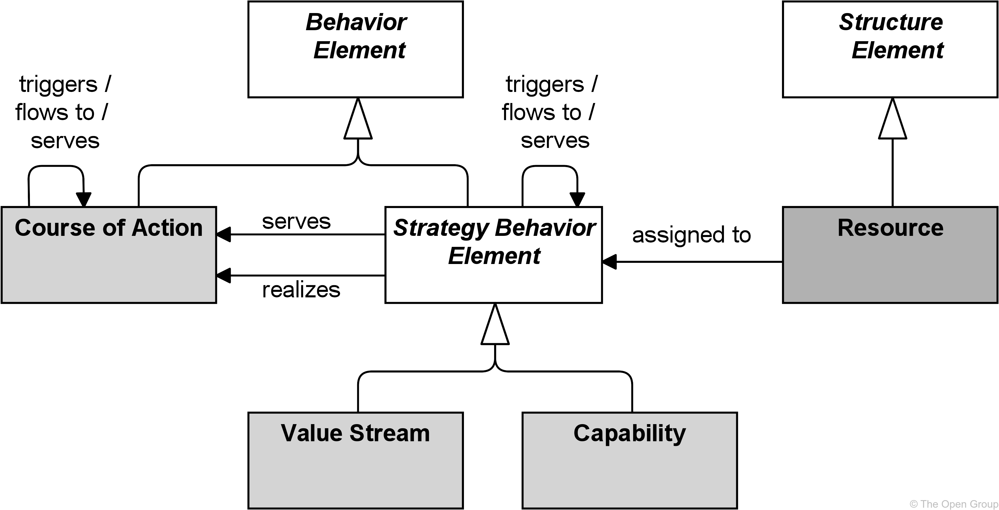
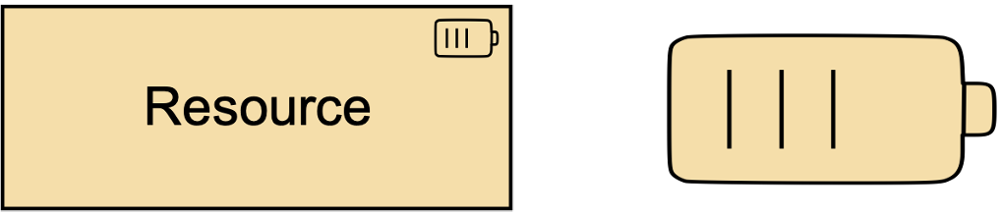
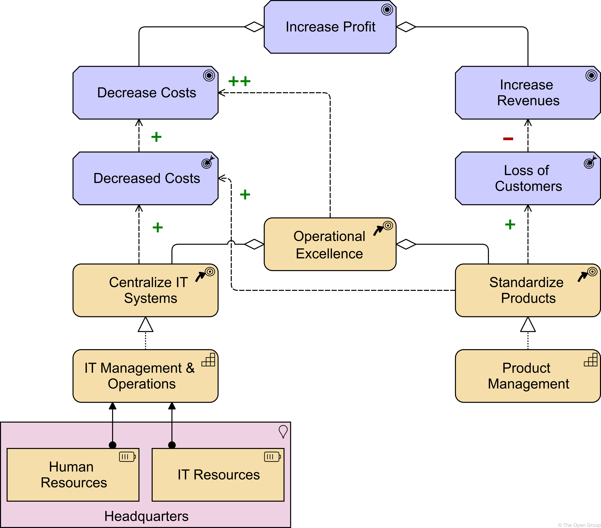
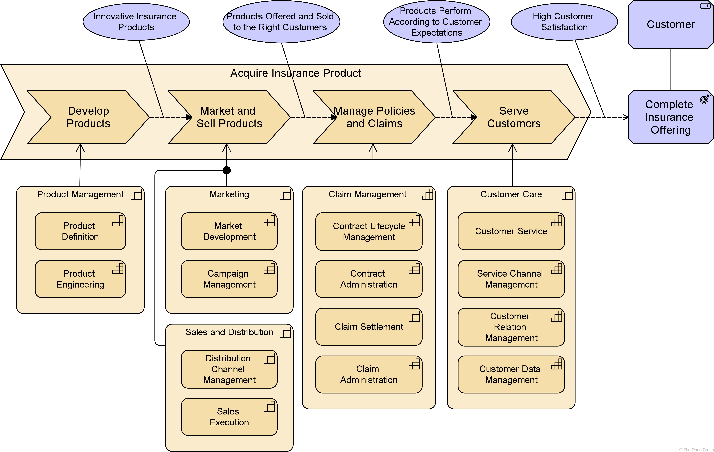
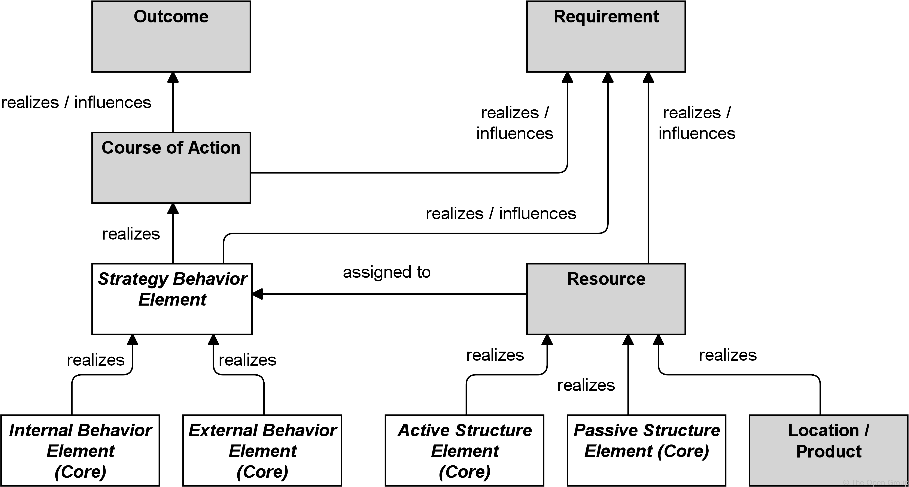

# Chapter 7. Strategy Layer

> 战略层

The strategy elements are typically used to model the strategic direction and choices of an enterprise, as far as the impact on its architecture is concerned-影响.

> 战略元素通常用于为企业的战略方向和选择建模，就其对体系结构的影响而言。

They can be used to express how the enterprise wants to create value for its stakeholders, the capabilities it needs, the resources needed to support these capabilities, as well as how it plans to configure and use these capabilities and resources to achieve its aims (see [Chapter 6](https://pubs.opengroup.org/architecture/archimate3-doc/ch-Motivation-Elements.html)).

> 它们可以用来表达企业希望如何为它的利益相关者创造价值，它需要的能力，支持这些能力所需的资源，以及它计划如何配置和使用这些能力和资源来实现它的目标(参见[第6章](https://pubs.opengroup.org/architecture/archimate3-doc/ch-Motivation-Elements.html))。

Strategy elements are used to model the strategic direction and choices of the enterprise, whereas-但是,然而 Business Layer elements ([Chapter 8](https://pubs.opengroup.org/architecture/archimate3-doc/ch-Business-Layer.html)) are used to model the operational organization of an enterprise.

> 战略元素用于为企业的战略方向和选择建模，而业务层元素([第8章](https://pubs.opengroup.org/architecture/archimate3-doc/ch-Business-Layer.html))用于为企业的运营组织建模。

Intentionally-故意地,有意地, the set of elements in the Strategy Layer is kept as small and simple as possible.

> 有意地，策略层中的元素集尽量保持小而简单。

The Strategy elements are more abstract than the Business elements.

> 战略元素比业务元素更抽象。

The Strategy Layer abstracts from the difference between active and passive structure, and from the internal/external distinction in the Business, Application, and Technology layers.

> 战略层从主动和被动结构之间的区别，以及业务层、应用程序层和技术层的内部/外部区别中抽象出来。

Unlike these layers, it therefore does not have service or interface elements.

> 因此，与这些层不同，它没有服务或接口元素。

## 7.1. Strategy Elements Metamodel

> 战略元素元模型

[Figure 46](https://pubs.opengroup.org/architecture/archimate3-doc/ch-Strategy-Layer.html#fig-Strategy-Elements-Metamodel) gives an overview of the strategy elements and their relationships.

> [图46](https://pubs.opengroup.org/architecture/archimate3-doc/ch-Strategy-Layer.html#fig-Strategy-Elements-Metamodel) 给出了策略元素及其关系的概述。

Note that “Course-方针 of Action” is a behavior element but not a strategy behavior element, because it models a different type of behavior and has a different set of relationships.

> 请注意，“行动方针”是一种行为元素，而不是战略行为元素，因为它模拟了不同类型的行为，并且具有不同的关系集。

**Figure 46. Strategy Elements Metamodel**

> 图46. 战略元素元模型

> [!NOTE]
>
> This figure does not show all permitted relationships; every element in the language can have composition, aggregation, and specialization relationships with elements of the same type.
>
> > 这个图并没有显示所有允许的关系；语言中的每个元素都可以与相同类型的元素具有组合、聚合和专门化关系。
>
> Furthermore-此外,而且, there are indirect relationships that can be derived-衍生,导出,得自, as explained in [Section 5.7](https://pubs.opengroup.org/architecture/archimate3-doc/ch-Relationships-and-Relationship-Connectors.html#sec-Derivation-of-Relationships).
>
> > 此外，还可以推导出间接关系，如[第5.7节](https://pubs.opengroup.org/architecture/archimate3-doc/ch-Relationships-and-Relationship-Connectors.html#sec-Derivation-of-Relationships)所述。
>
> The full specification-规格,规范 of permitted relationships can be found in [Appendix B](https://pubs.opengroup.org/architecture/archimate3-doc/ch-relationships-Normative.html).
>
> > 允许关系的完整规范可以在 [附录B](https://pubs.opengroup.org/architecture/archimate3-doc/ch-relationships-Normative.html) 中找到。

## 7.2. Structure Elements

> 结构元素

### 7.2.1. Resource

> 资源

A resource represents an asset-资产,财产 owned or controlled by an individual or organization.

> 资源表示由个人或组织拥有或控制的资产。

Resources are a central concept in the field of strategic management, economics-经济学, computer science, portfolio management, and more.

> 资源是战略管理、经济学、计算机科学、投资组合管理等领域的中心概念。

They are often recognized along-沿着,顺着 with capabilities, to be sources of competitive advantage for organizations.

> 它们通常与能力一起被认为是组织竞争优势的来源。

Resources are analyzed in terms of strengths and weaknesses, and considered when implementing-执行,贯彻,实施 strategies.

> 根据优势和劣势分析资源，并在实施战略时加以考虑。

Due to resources being limited, they can often be a deciding-决定 factor for choosing which strategy, goal, and project to implement and in which order.

> 由于资源有限，它们通常是选择以何种顺序实施哪个战略、目标和项目的决定性因素。

Resources can be classified-把…分类,把…分级 in different ways; including tangible assets, intangible assets, and human assets.

> 资源可以以不同的方式分类；包括有形资产、无形资产和人力资产。

Examples of tangible assets include financial assets (cash, securities, borrowing capacity, etc.) and physical assets (plant-厂房,工厂, equipment, land, mineral-矿物质,矿物 reserves-储藏,储备, etc.).

> 有形资产的例子包括金融资产(现金、证券、借款能力等)和实物资产(厂房、设备、土地、矿产储备等)。

Examples of intangible assets include technology assets (patents-专利, copyrights-版权,著作权, trade secrets-秘密, etc.), reputation-名誉,名声 assets (brand, relationships, etc.), and culture assets.

> 无形资产的例子包括技术资产(专利、版权、商业秘密等)、声誉资产(品牌、关系等)和文化资产。

Examples of human assets include skills/know-how-专门知识,实际经验, capacity for communication and collaboration, and motivation.

> 人力资产的例子包括技能/专门知识、沟通和协作能力以及动机。

Resources are realized by active and passive structure elements and are therefore classified as structures that are **neither**-既不…也不… active **nor** passive.

> 资源是通过主动和被动的结构要素来实现的，因此被划分为非主动和非被动的结构。

The name of a resource should preferably be a noun.

> 资源的名称最好是名词。

**Figure 47. Resource Notation**

> 图47. 资源符号

## 7.3. Behavior Elements

> 行为元素

### 7.3.1. Capability

> 能力

A capability represents an ability that an active structure element, such as an organization, person, or system, possesses.

> 能力表示主动结构元素(如组织、人员或系统)所拥有的能力。

In the field of business, strategic thinking and planning delivers strategies and high-level goals that are often not directly implementable in the architecture of an organization.

> 在业务领域中，战略思考和计划交付的策略和高级目标通常不能在组织的体系结构中直接实现。

These long-term or generic plans need to be specified and made actionable-可执行,可行动 in a way that both business leaders and Enterprise Architects can relate to, and at a relatively high abstraction level.

> 这些长期的或通用的计划需要以业务领导和企业架构师都能联系到的方式进行指定，并在相对较高的抽象级别上进行操作。

Capabilities help to reduce this gap by focusing on business outcomes.

> 功能通过关注业务结果来帮助缩小这一差距。

On the one hand, they provide a high-level view of the current and desired abilities of an organization, in relation to its strategy and its environment.

> 一方面，它们提供了与组织的战略和环境相关的组织当前和期望的能力的高级视图。

On the other hand, they are realized by various elements (people, processes, systems, and so on) that can be described, designed, and implemented using Enterprise Architecture approaches.

> 另一方面，它们是由各种元素(人员、过程、系统等)实现的，这些元素可以使用企业架构方法进行描述、设计和实现。

Capabilities may also have serving-服务 relationships; for example, to denote that one capability contributes-有助于 to another.

> 能力也可能有服务关系；例如，表示一种能力有助于另一种能力。

Capabilities are classified as behavior in the ArchiMate language because they describe abilities: what the enterprise can (is able to) *do* (now or in the future).

> 在 ArchiMate 语言中，能力被归类为行为，因为它们描述了能力：企业能够(现在或将来)做什么。

Capabilities are expressed in general, high-level terms that are typically realized by a combination of organization, people, processes, information, and technology.

> 能力用一般的、高级的术语来表示，这些术语通常由组织、人员、过程、信息和技术的组合来实现。

For example, business planning, customer management, or asset management [[21](https://pubs.opengroup.org/architecture/archimate3-doc/ch-Referenced-docs.html#Ref21)].

> 例如，业务规划、客户管理或资产管理 [[21](https://pubs.opengroup.org/architecture/archimate3-doc/ch-Referenced-docs.html#Ref21)])。

This capability concept corresponds to the business capability in the TOGAF framework [[6](https://pubs.opengroup.org/architecture/archimate3-doc/ch-Referenced-docs.html#Ref6)].

> 这个能力概念对应于 TOGAF 框架中的业务能力 [[6](https://pubs.opengroup.org/architecture/archimate3-doc/ch-Referenced-docs.html#Ref6)])。

Capabilities are typically aimed-旨在 at achieving some goal.

> 功能通常旨在实现某些目标。

Capabilities are themselves realized by core elements.

> 能力本身是由核心元素实现的。

To denote that a set of core elements together realizes a capability, grouping can be used.

> 为了表示一组核心元素一起实现了一个功能，可以使用分组。

Capabilities are often used for capability-based planning, to describe their evolution over time.

> 能力通常用于基于能力的计划，以描述它们随时间的演变。

To model such so-called capability increments, the specialization relationship can be used to denote that a certain capability increment is a specific version of that capability.

> 为了对这种所谓的能力增量进行建模，可以使用专门化关系来表示某个能力增量是该能力的特定版本。

Aggregating those increments and the core elements that realize them in plateaus-平台,稳定期 (see [Section 12.2.4](https://pubs.opengroup.org/architecture/archimate3-doc/ch-Implementation-and-Migration-Layer.html#sec-Plateau)) can be used to model the evolution of the capabilities.

> 将这些增量和在平台中实现它们的核心元素聚合在一起(参见 [12.2.4节](https://pubs.opengroup.org/architecture/archimate3-doc/ch-Implementation-and-Migration-Layer.html#sec-Plateau) )，可以用来为能力的演化建模。

The name of a capability should emphasize “what we do” rather than “how we do it”.

> 能力的名称应该强调“我们做什么”而不是“我们如何做”。

Typically, it should be expressed as a compound-混合物,复合的 noun or gerund-动名词 (-ing form of verb); e.g., “Risk Management”, “Market Development”, “Product Engineering”, etc.

> 通常，它应该以复合名词或动名词(动词的-ing形式)的形式表达；如“风险管理”、“市场开发”、“产品工程”等。

**Figure 48. Capability Notation**

> 图48. 能力符号

### 7.3.2. Value Stream

> 价值流

A value stream represents a sequence of activities that create an overall result for a customer, stakeholder, or end user.

> 价值流表示为客户、涉众或最终用户创建总体结果的一系列活动。

A value stream describes how an enterprise organizes its activities to create value.

> 价值流描述了企业如何组织其活动来创造价值。

As described in the TOGAF Series-连续,一系列 Guide: Value Streams [[17](https://pubs.opengroup.org/architecture/archimate3-doc/ch-Referenced-docs.html#Ref17)], a key principle of value streams is that value is always defined from the perspective of the stakeholder – the customer, end user, or recipient of the product, service, or deliverable produced by the work.

> 正如TOGAF系列指南：价值流[[17](https://pubs.opengroup.org/architecture/archimate3-doc/ch-Referenced-docs.html#Ref17)])中所描述的那样，价值流的一个关键原则是，价值总是从涉众的角度来定义的——客户、最终用户、产品、服务或工作产生的可交付成果的接受者。

The value obtained is in the eye of the beholder-旁观者,观看者; it depends more on the stakeholder’s perception-看法,认识 of the worth of the product, service, outcome, or deliverable than on its intrinsic-内在的,固有的 value; i.e., the cost to produce.

> 获得的价值是在旁观者的眼中；它更多地取决于利益相关者对产品、服务、结果或可交付成果价值的看法，而不是其内在价值；即生产成本。

This is modeled in the ArchiMate language by using the value element and in turn, is associated on the one hand with the result being produced, and on the other hand may be associated with the stakeholder.

> 这是通过使用 value 元素在 ArchiMate 语言中建模的，并且反过来，它一方面与生成的结果相关联，另一方面可能与涉众相关联。

Value streams may be defined at different levels of the organization; e.g., at the enterprise level, business unit level, or department level.

> 价值流可以在组织的不同层次上定义；例如，在企业级别、业务单位级别或部门级别。

Value streams can be a composition or aggregation of value-adding activities.

> 价值流可以是增值活动的组合或聚合。

These are also modeled with the value stream element and known as value (stream) stages.

> 这些也用价值流元素建模，并称为价值(流)阶段。

Each of which creates and adds incremental value from one stage to the next.

> 从一个阶段到下一个阶段，每个阶段都创造并增加了增量价值。

These stages are typically related using flow relationships to model the flow of value between them.

> 这些阶段通常使用流关系来模拟它们之间的价值流。

Resources can be assigned to value streams and capabilities can serve (i.e., enable) a value stream.

> 资源可以分配给价值流，能力可以服务于(即启用)价值流。

Importantly, value streams and business processes may seem alike, but they are defined at different abstraction levels and serve separate purposes.

> 重要的是，价值流和业务流程可能看起来很相似，但是它们是在不同的抽象级别上定义的，并且服务于不同的目的。

A business process describes the (time-ordered) sequence of behaviors required to create some result for an individual case, and it may describe alternative paths and decision points (modeled with junctions).

> 业务流程描述为单个案例创建某些结果所需的(按时间顺序的)行为序列，并且它可能描述可选路径和决策点(用连接点建模)。

**In contrast**-相反地, a value stream focuses on the overall value-creating behavior from the perspective of the importance, worth, or usefulness of what is produced, and is not a description of time-ordered tasks for individual cases.

> 与此相反，价值流从重要性、价值或产出的有用性的角度关注于整体的价值创造行为，而不是对个别情况的时间顺序任务的描述。

Value streams (and capabilities) reflect an organization’s business model and value proposition-主张,观点, whereas business processes (and business functions) reflect its operating model.

> 价值流(和能力)反映组织的业务模型和价值主张，而业务过程(和业务功能)反映其操作模型。

At their respective abstraction levels, value streams and business processes both represent the “enterprise in motion-运动”, whereas capabilities and business functions both describe the “enterprise at rest-静止,停止”.

> 在它们各自的抽象层次上，价值流和业务流程都代表了“活动中的企业”，而能力和业务功能都描述了“静止的企业”。

Value streams are typically realized by business processes and possibly other core behavior elements.

> 价值流通常由业务流程和可能的其他核心行为元素实现。

The stages in a value stream provide a framework for organizing and defining business processes, but different parts of the organization may have their own implementations of business processes that realize the same value stream stage.

> 价值流中的阶段为组织和定义业务过程提供了一个框架，但是组织的不同部分可能有自己的实现相同价值流阶段的业务过程。

It is recommended that the name of a value stream be expressed using a verb-noun construct in the active tense-时态; e.g., “Acquire Insurance Product”.

> 建议使用主动语态的动名词结构来表达价值流的名称；例如，“获取保险产品”。

**Figure 49. Value Stream Notation**

> 图49. 价值流符号

### 7.3.3. Course-方针 of Action

> 行动方针

A course-方针 of action represents an approach or plan for configuring some capabilities and resources of the enterprise, undertaken-从事,开始进行 to achieve a goal.

> 行动方针代表了一种方法或计划，用于配置企业的某些能力和资源，以实现目标。

A course of action represents what an enterprise has decided to do.

> 行动方针代表企业决定要做的事情。

Courses of action can be categorized as strategies and tactics.

> 行动方针可分为战略和战术。

It is not possible to make a hard distinction between the two, but strategies tend to be long-term and fairly broad in scope, while tactics tend to be shorter-term and narrower-有限的,窄小的 in scope.

> 两者之间很难区分，但战略往往是长期的，范围相当广泛，而战术往往是短期的，范围较窄。

**Figure 50. Course of Action Notation**

> 图50. 行动方针符号

## 7.4. Example

“Increase Profit” is a goal that can be decomposed-已腐烂的,已分解的 into a number of other goals: “Decrease Costs” and “Increase Revenue”.

> “增加利润”这个目标可以分解成许多其他目标：“降低成本”和“增加收入”。

**The former**-前者 is related to the “Operational Excellence” strategy of the company, modeled as a course of action.

> 前者与公司的“卓越运营”战略有关，作为一种行动方针。

This is decomposed into two other courses of action: “Centralize IT Systems” and “Standardize Products”.

> 这被分解为另外两个行动过程：“集中IT系统”和“标准化产品”。

These result in two outcomes: “Decreased Costs” and “Loss of Customers”, which influence the goals in positive and negative ways.

> 这导致了两种结果：“降低成本”和“失去客户”，它们以积极和消极的方式影响目标。

This shows an important difference between goals and outcomes: not all outcomes lead to the intended-预期的 results.

> 这表明了目标和结果之间的一个重要区别：并非所有的结果都会导致预期的结果。

The courses of action are realized by a number of capabilities: “IT Management & Operations” and “Product Management”, and appropriate resources “Human Resources” and “IT Resources” are assigned to **the former**-前者.

> 行动过程由“IT管理与运营”和“产品管理”等多个能力来实现，并为前者分配适当的资源“人力资源”和“IT资源”。

The model fragment also shows that these resources are located in the “Headquarters” of the organization, in line with the “Centralize IT Systems” course of action.

> 模型片段还显示了这些资源位于组织的“总部”，与“集中化IT系统”行动过程一致。

**Example 21: Capability, Resource, and Course of Action**

> 示例21 能力、资源和行动方针

Example 22 shows a model of a high-level value stream for an insurance company, where each stage in the value stream is served by a number of capabilities.

> 例22 显示了保险公司的高级价值流模型，其中价值流中的每个阶段都由许多功能提供服务。

Between these stages, we see the value flows with associated value items, and at the end the business outcome that this value stream realizes for a particular stakeholder.

> 在这些阶段之间，我们看到带有相关价值项的价值流，并在最后看到这个价值流为特定涉众实现的业务结果。

**Example 22: Value Stream with Capability Cross-Mapping**

> 示例22 具有能力交叉映射的价值流

## 7.5. Summary of Strategy Elements

> 战略元素总结

Table 5 gives an overview of the strategy elements, with their definitions.

> 表5 给出了战略元素及其定义的概述。

**Table 5. Strategy Elements**

> 战略元素

| Element          | Description                                                  | Notation                                                     |
| ---------------- | ------------------------------------------------------------ | ------------------------------------------------------------ |
| Resource         | Represents an asset owned or controlled by an individual or organization. 表示由个人或组织拥有或控制的资产。 |  |
| Capability       | Represents an ability that an active structure element, such as an organization, person, or system, possesses. 表示活动结构元素(如组织、人员或系统)所拥有的一种能力。 |  |
| Value Stream     | Represents a sequence of activities that create an overall result for a customer, stakeholder, or end user. 表示为客户、涉众或最终用户创建总体结果的一系列活动。 |  |
| Course of Action | Represents an approach or plan for configuring some capabilities and resources of the enterprise, undertaken to achieve a goal. 表示一种方法或计划，用于配置企业的某些能力和资源，以实现一个目标。 |  |

## 7.6. Relationships with Motivation and Core Elements

> 与动机和核心元素的关系

[Figure 51](https://pubs.opengroup.org/architecture/archimate3-doc/ch-Strategy-Layer.html#fig-Relationships-Between-Strategy-Elements-and-Motivation-and-Core-Elements) shows how the strategy elements are related to core elements and motivation elements.

> [图51](https://pubs.opengroup.org/architecture/archimate3-doc/ch-Strategy-Layer.html#fig-Relationships-Between-Strategy-Elements-and-Motivation-and-Core-Elements) 显示了战略元素是如何与核心元素和动机元素相关联的。

Internal and external behavior elements may realize strategy behavior elements (value streams and capabilities), while an active or passive structure element may realize a resource.

> 内部和外部的行为元素可以实现战略行为元素(价值流和能力)，而主动或被动的结构元素可以实现资源。

Capabilities, value streams, courses of action, and resources may realize or influence requirements (and indirectly, as described in [Section 5.7](https://pubs.opengroup.org/architecture/archimate3-doc/ch-Relationships-and-Relationship-Connectors.html#sec-Derivation-of-Relationships), also principles or goals), and a course of action may also realize or influence an outcome (and, indirectly, also a goal).

> 能力、价值流、行动方针和资源可以实现或影响需求(也可以间接地，如 [第5.7节](https://pubs.opengroup.org/architecture/archimate3-doc/ch-Relationships-and-Relationship-Connectors.html#sec-Derivation-of-Relationships) 所述，也可以是原则或目标)，行动方针也可以实现或影响结果(也可以间接地，影响目标)。

**Figure 51. Relationships Between Strategy Elements and Motivation and Core Elements**

> 图51. 策略元素与动机、核心元素的关系

