# Chapter 8. Business Layer

> 业务层

Business Layer elements are used to model the operational organization of an enterprise in a **technology-independent**-技术独立 manner-方式, whereas strategy elements ([Chapter 7](https://pubs.opengroup.org/architecture/archimate3-doc/ch-Strategy-Layer.html)) are used to model the strategic direction and choices of the enterprise.

> 业务层元素用于以技术独立的方式对企业的运营组织进行建模，而战略元素( [第7章](https://pubs.opengroup.org/architecture/archimate3-doc/ch-Strategy-Layer.html) )用于对企业的战略方向和选择进行建模。

## 8.1. Business Layer Metamodel

> 业务层元模型

Figure 52 gives an overview of the Business Layer elements and their relationships.

> 图52 给出了业务层元素及其关系的概述。

“Business Internal Active Structure Element”, “Business Internal Behavior Element”, and “Business Passive Structure Element” are abstract elements; only their specializations (as defined in the following sections) are instantiated-实例化 in models.

> “业务内部主动结构元素”、“业务内部行为元素”和“业务被动结构元素”是抽象元素；只有它们的专门化(如下面的部分所定义)在模型中被实例化。

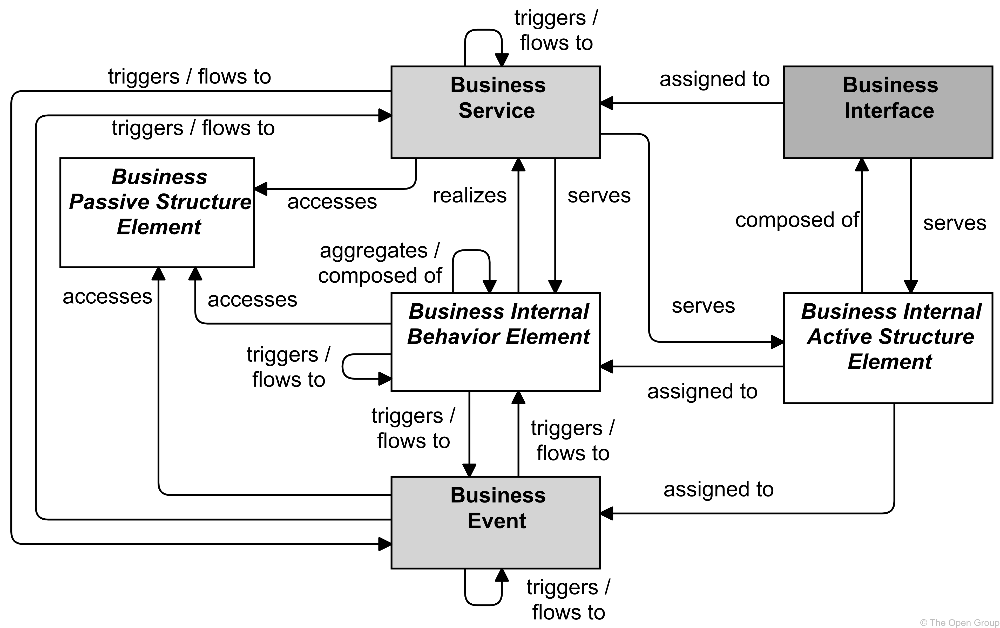

**Figure 52. Business Layer Metamodel**

> 图52 业务层元模型

> [!NOTE]
>
> This figure does not show all permitted relationships; every element in the language can have composition, aggregation, and specialization relationships with elements of the same type.
>
> > 这个数字并没有显示所有允许的关系；语言中的每个元素都可以与相同类型的元素具有组合、聚合和专门化关系。
>
> Furthermore-此外,而且, there are indirect relationships that can be derived, as explained in [Section 5.7](https://pubs.opengroup.org/architecture/archimate3-doc/ch-Relationships-and-Relationship-Connectors.html#sec-Derivation-of-Relationships).
>
> > 此外，还可以推导出间接关系，如 [第5.7节](https://pubs.opengroup.org/architecture/archimate3-doc/ch-Relationships-and-Relationship-Connectors.html#sec-Derivation-of-Relationships )所述。

## 8.2. Active Structure Elements

> 主动结构元素

The active structure aspect of the Business Layer refers to the static structure of an organization, in terms of the entities that **make up**-组成,构成 the organization and their relationships.

> 业务层的主动结构方面指的是组织的静态结构，指的是组成组织的实体及其关系。

The *active entities* are the subjects (e.g., business actors or business roles) that perform-执行 behavior such as business processes or functions (capabilities).

> 活动实体是执行诸如业务流程或功能(能力)等行为的主体(例如，业务参与者或业务角色)。

Business actors may be individual persons (e.g., customers or employees), but also groups of people (organization units) and resources that have a permanent-永久的,长期的 (or at least long-term) status within the organizations.

> 业务参与者可以是个人(例如，客户或雇员)，也可以是在组织内具有永久(或至少是长期)状态的一组人(组织单位)和资源。

Typical examples of the latter are a department and a business unit.

> 后者的典型例子是部门和业务单位。

Architectural descriptions focus on structure, which means that the inter-relationships of entities within an organization play an important role-作用.

> 体系结构描述关注于结构，这意味着组织中实体之间的相互关系起着重要的作用。

To make this explicit-明确的, the element of business collaboration has been introduced-介绍,引进.

> 为了明确这一点，我们引入了业务协作的元素。

The element of business interface is introduced to explicitly model the (logical or physical) places or channels where the services that a role offers to the environment can be accessed.

> 引入业务接口元素是为了显式地对角色提供给环境的服务可以访问的位置或通道(逻辑或物理)进行建模。

The same service may be offered on a number of different interfaces; e.g., by mail, by telephone, or through the Internet.

> 相同的服务可以在许多不同的接口上提供；例如，通过邮件、电话或通过互联网。

In contrast-差异,对比 to application modeling, it is uncommon-罕有的 in current Business Layer modeling approaches to recognize the business interface element.

> 与应用程序建模相比，在当前的业务层建模方法中很少识别业务接口元素。

In the Business Layer, three types of internal active structure element are defined: *business actor*, *business role*, and *business collaboration*.

> 在业务层，定义了三种类型的内部活动结构元素：业务参与者*、*业务角色和业务协作。

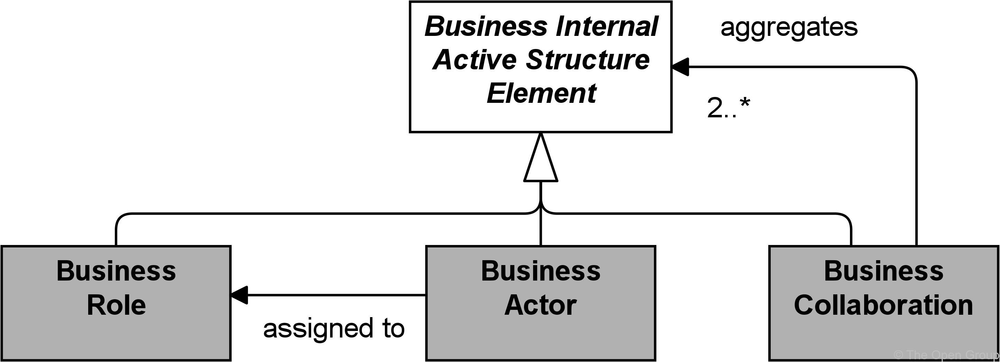

**Figure 53. Business Internal Active Structure Elements**

> 图53 业务内部主动结构元素

> [!NOTE]
>
> This figure does not show all permitted relationships; every element in the language can have composition, aggregation, and specialization relationships with elements of the same type.
>
> > 这个图并没有显示所有允许的关系；语言中的每个元素都可以与相同类型的元素具有组合、聚合和专门化关系。
>
> Furthermore-此外,而且, there are indirect relationships that can be derived, as explained in [Section 5.7](https://pubs.opengroup.org/architecture/archimate3-doc/ch-Relationships-and-Relationship-Connectors.html#sec-Derivation-of-Relationships).
>
> > 此外，还可以推导出间接关系，如 [第5.7节](https://pubs.opengroup.org/architecture/archimate3-doc/ch-Relationships-and-Relationship-Connectors.html#sec-Derivation-of-Relationships) 所述。
>
> The full specification-规格,规范 of permitted relationships can be found in [Appendix B](https://pubs.opengroup.org/architecture/archimate3-doc/ch-relationships-Normative.html).
>
> > 允许关系的完整规范可以在 [附录B](https://pubs.opengroup.org/architecture/archimate3-doc/ch-relationships-Normative.html) 中找到。

### 8.2.1. Business Actor

> 业务参与者

A business actor represents a business entity that is capable of performing behavior.

> 业务参与者表示能够执行行为的业务实体。

A business actor is a business entity as opposed-与...竞争,与...角逐 to a technical entity; i.e., it belongs to the Business Layer.

> 业务参与者是与技术实体相对的业务实体；也就是说，它属于业务层。

Actors may, however-然而,可是, include entities outside the actual organization; e.g., customers and partners.

> 然而，参与者可能包括实际组织之外的实体；例如，客户和合作伙伴。

A business actor can represent such business entities at different levels of detail and may correspond-类似于,相当于 to both an actor and an organizational unit in the TOGAF framework [[4](https://pubs.opengroup.org/architecture/archimate3-doc/ch-Referenced-docs.html#Ref4)].

> 业务参与者可以在不同的细节级别上表示这样的业务实体，并且可以对应于 TOGAF 框架中的参与者和组织单元[[4](https://pubs.opengroup.org/architecture/archimate3-doc/ch-Referenced-docs.html#Ref4)])。

Examples of business actors are humans, departments, and business units.

> 业务参与者的例子包括人、部门和业务单位。

A business actor may be assigned to one or more business roles.

> 业务参与者可以被分配到一个或多个业务角色。

It can then perform the behavior to which these business roles are assigned.

> 然后，它可以执行分配给这些业务角色的行为。

A business actor can be aggregated in a location-地点,位置.

> 业务参与者可以聚集在一个位置。

The name of a business actor should preferably-最好是 be a noun.

> 业务参与者的名称最好是名词。

Business actors may be specific individuals or organizations; e.g., “John Smith” or “ABC Corporation”, or they may be generic; e.g., “customer” or “supplier”.

> 业务参与者可以是特定的个人或组织；例如，“约翰·史密斯”或“ABC公司”，或者它们可能是通用的；例如，“顾客”或“供应商”。

**Figure 54. Business Actor Notation**

> 图54. 业务参与者符号

### 8.2.2. Business Role

A business role represents the responsibility for performing specific behavior, to which an actor can be assigned, or the part an actor plays in a particular action or event.

> 业务角色表示执行特定行为的责任，可以分配给参与者，或者参与者在特定动作或事件中扮演的角色。

Business roles with certain responsibilities or skills are assigned to business processes or business functions.

> 具有特定职责或技能的业务角色被分配给业务流程或业务功能。

A business actor that is assigned to a business role is responsible for ensuring that the corresponding-相应的,相关的 behavior is **carried out**-实施, either by performing it or by delegating and managing its performance.

> 分配给业务角色的业务参与者负责通过执行或委托和管理其性能来确保执行相应的行为。

In addition to the relation of a business role with behavior, a business role is also useful in a (structural) organizational sense; for instance, in the division-分配 of labor within an organization.

> 除了业务角色与行为的关系之外，业务角色在(结构)组织意义上也很有用；例如，在一个组织内部的劳动分工中。

A business role may be assigned to one or more business processes or business functions, while a business actor may be assigned to one or more business roles.

> 业务角色可以分配给一个或多个业务流程或业务功能，而业务参与者可以分配给一个或多个业务角色。

A business interface or an application interface may serve a business role, while a business interface may be part of a business role.

> 业务接口或应用程序接口可以服务于业务角色，而业务接口可以是业务角色的一部分。

The name of a business role should preferably-最好是 be a noun.

> 业务角色的名称最好是名词。

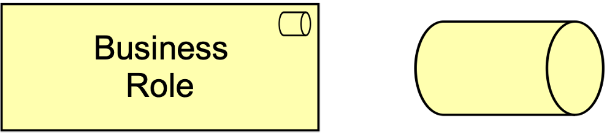

**Figure 55. Business Role Notation**

> 图55 业务角色符号

ArchiMate modelers may represent generic organizational entities that perform behavior as either business actors or business roles.

> ArchiMate 建模器可以表示作为业务参与者或业务角色执行行为的一般组织实体。

For example, the business actor “Supplier” depicts-描述,描绘 an organizational entity, while the business role “Supplier” depicts a responsibility.

> 例如，业务参与者“供应商”描述一个组织实体，而业务角色“供应商”描述一个职责。

Specific or generic business actors can be assigned to carry responsibilities depicted as business roles.

> 可以分配特定的或一般的业务参与者来承担描述为业务角色的职责。

For example, the specific business actor “ABC Corporation” or the generic business actor “Business Partner” can be assigned to the “Supplier” business role.

> 例如，特定的业务参与者“ABC Corporation”或通用的业务参与者“Business Partner”可以分配给“Supplier”业务角色。

### 8.2.3. Business Collaboration

> 业务协作

A business collaboration represents an aggregate of two or more business internal active structure elements that work together to perform collective-共同的,集体的 behavior.

> 业务协作表示两个或多个业务内部活动结构元素的集合，这些元素一起工作以执行集体行为。

A business process or function may be interpreted as the internal behavior of a single business internal active structure element. 

> 业务流程或功能可以解释为单个业务内部主动结构元素的内部行为。

In some cases, behavior is the collective effort of more than one business internal active structure element; in fact, a collaboration of two or more business internal active structure elements results in collective behavior which may be more than simply the sum of the behavior of the separate elements.

> 在某些情况下，行为是一个以上的企业内部活动结构元素的集体努力；事实上，两个或多个业务内部活动结构元素的协作会导致集体行为，而集体行为可能不仅仅是单独元素行为的简单总和。

Business collaborations represent this collective effort.

> 业务合作代表了这种集体努力。

Business interactions-交互,相互影响 can be used to describe the internal behavior that takes place within business collaboration.

> 业务交互可以用来描述在业务协作中发生的内部行为。

A business collaboration is a (possibly temporary) collection of business roles, actors, or other collaborations within an organization which perform collaborative behavior (interactions).

> 业务协作是组织内执行协作行为(交互)的业务角色、参与者或其他协作的集合(可能是临时的)。

Unlike a department, a business collaboration need not have an official (permanent) status within the organization; it is specifically aimed at a specific interaction or set of interactions between roles.

> 与部门不同，业务协作不需要在组织中具有正式(永久)状态；它专门针对角色之间的特定交互或一组交互。

It is especially useful in modeling Business-to-Business (B2B) interactions between different organizations such as provider networks, and also for describing social networks.

> 它在为不同组织(如提供者网络)之间的企业对企业(B2B)交互建模以及描述社会网络时特别有用。

A business collaboration may aggregate a number of business roles, actors, or other collaborations and may be assigned to one or more business interactions or other business internal behavior elements.

> 业务协作可以聚合许多业务角色、参与者或其他协作，并且可以分配给一个或多个业务交互或其他业务内部行为元素。

A business interface or an application interface may serve a business collaboration, while a business collaboration may have business interfaces (through composition, and also through aggregation via derived-衍生的,派生的 relationships).

> 业务接口或应用程序接口可以为业务协作提供服务，而业务协作可以具有业务接口(通过组合，也可以通过派生关系进行聚合)。

The name of a business collaboration should preferably-最好是 be a noun.

> 业务合作的名称最好是名词。

It is also rather-颇,相当 common to leave a business collaboration unnamed.

> 不命名业务协作也很常见。

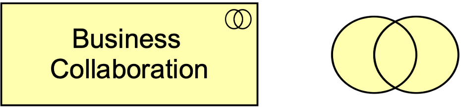

**Figure 56. Business Collaboration Notation**

> 图56. 业务协作符号

### 8.2.4. Business Interface

> 业务接口

A business interface represents a point of access where business services are made available to the environment.

> 业务接口表示向环境提供业务服务的访问点。

A business interface exposes-暴露,公开 the functionality of a business service to other business roles or actors.

> 业务接口向其他业务角色或参与者公开业务服务的功能。

It is often referred to as a channel (telephone, Internet, local office, etc.).

> 它通常被称为通道(电话、因特网、本地办公室等)。

The same business service may be exposed through different interfaces.

> 相同的业务服务可以通过不同的接口公开。

A business interface may be part of a business role or actor through a composition relationship, and a business interface may serve a business role.

> 业务接口可以通过组合关系成为业务角色或参与者的一部分，并且业务接口可以服务于业务角色。

A business interface may be assigned to one or more business services, which means that these services are exposed by the interface.

> 业务接口可以分配给一个或多个业务服务，这意味着这些服务由接口公开。

The name of a business interface should preferably be a noun.

> 业务接口的名称最好是名词。

**Figure 57. Business Interface Notation**

> 图57 业务接口符号

### 8.2.5. Example

> 示例

The “ArchiSurance Contact Center”, modeled as a business actor, is composed of three employees, also modeled as business actors: “Greg”, “Joan”, and “Larry”.

> 作为业务参与者建模的“ArchiSurance Contact Center”由三名员工组成，他们也被建模为业务参与者：“Greg”、“Joan”和“Larry”。

The “ArchiSurance Contact Center” has three business interfaces to serve customers: “Phone”, “E-mail”, and “Web Chat”.

> “建筑保险联络中心”有三个业务接口为客户服务：“电话”、“电子邮件”和“网络聊天”。

Greg fulfills the business role of “Travel Insurance Claim Analyst”, Joan fulfills the business role of “Home Insurance Product Specialist”, and Larry fulfills the business role of “Customer Service Representative”.

> Greg担任“旅游保险索赔分析师”的业务角色，Joan担任“家庭保险产品专家”的业务角色，Larry担任“客户服务代表”的业务角色。

The former two business roles are specializations of a business role “Specialist-专家”.

> 前两个业务角色是业务角色“专家”的专门化。

“High-Risk Claims Adjudication-裁定,判决” is a business collaboration of two business roles: “Specialist” and “Customer Service Representative”.

> “高风险索赔裁决”是两个业务角色的业务协作：“专家”和“客户服务代表”。

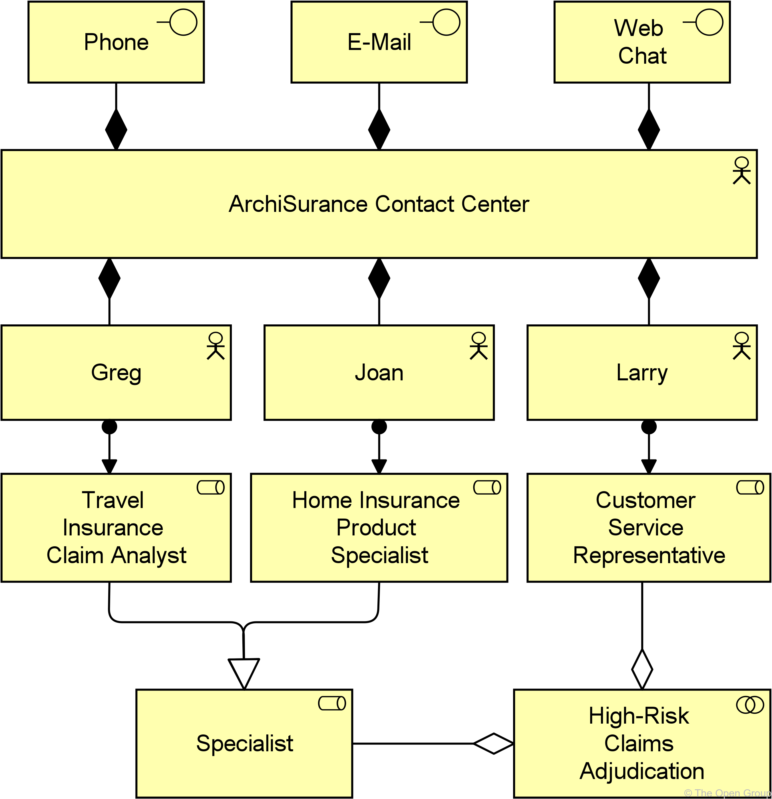

**Example 23: Business Active Structure Elements**

> 示例23 业务主动结构元素

## 8.3. Behavior Elements

> 行为元素

Based on service-orientation, a crucial design decision for the behavioral part of the ArchiMate metamodel is the distinction between “external” and “internal” behavior of an organization.

> 基于面向服务，ArchiMate 元模型的行为部分的一个关键设计决策是区分组织的“外部”和“内部”行为。

The externally visible behavior is modeled by the element *business service*.

> 外部可见的行为由元素**业务服务**建模。

A business service represents a coherent-团结一致的,连贯的 piece of functionality that offers **added value**-附加价值 to the environment, independent-独立的 of the way this functionality is realized internally.

> 业务服务表示为环境提供附加价值的一段连贯的功能，与该功能在内部实现的方式无关。

A distinction can be made between “external” business services, offered to external customers, and “internal” business services, offering supporting functionality to processes or functions within the organization.

> 可以区分为外部客户提供的“外部”业务服务和为组织内的流程或功能提供支持功能的“内部”业务服务。

Several-几个,不同的,各自的 types of internal behavior elements that can realize a service are distinguished.

> 可以实现服务的几种类型的内部行为元素是有区别的。

Although the distinction between the two is not always sharp-清晰的, it is often useful to distinguish a *process view* and a *function view* on behavior; two elements associated with these views, *business process* and *business function*, are defined.

> 虽然两者之间的区别并不总是很明显，但在行为上区分“过程视图”和“函数视图”通常是有用的；定义了与这些视图关联的两个元素，**业务流程**和**业务功能**。

Both elements can be used to group more detailed business processes/functions but based on different grouping criteria-标准.

> 这两个元素都可用于对更详细的业务流程/功能进行分组，但基于不同的分组标准。

A *business process* represents a workflow consisting of smaller processes/functions, with one or more clear starting points and leading to some result.

> 一个“业务流程”代表了一个由更小的流程/功能组成的工作流，有一个或多个明确的起点，并导致一些结果。

It is sometimes described as “customer to customer”, where this customer may also be an internal customer, in the case of sub-processes within an organization.

> 它有时被描述为“客户对客户”，在组织内的子过程中，该客户也可能是内部客户。

The goal of such a business process is to “satisfy or delight-高兴 the customer” [[10](https://pubs.opengroup.org/architecture/archimate3-doc/ch-Referenced-docs.html#Ref10)].

> 这种业务流程的目标是“使客户满意或高兴”[[10](https://pubs.opengroup.org/architecture/archimate3-doc/ch-Referenced-docs.html#Ref10)])。

A *business function* offers functionality that may be useful for one or more business processes.

> **业务功能**提供的功能可能对一个或多个业务流程有用。

It groups behavior based on, required skills, resources, (application) support, etc.

> 它根据所需的技能、资源、(应用程序)支持等对行为进行分组。

Typically, the business processes of an organization are defined based on the *products* and *services* that the organization offers, while the business functions are the basis for the assignment of resources to tasks and the application support.

> 通常，组织的业务流程是基于组织提供的“产品”和“服务”来定义的，而业务功能是将资源分配给任务和应用程序支持的基础。

A *business interaction* is a unit of behavior similar to a business process or function, but which is performed in a collaboration of two or more roles within the organization.

> 业务交互是类似于业务流程或功能的行为单元，但它是在组织内两个或多个角色的协作中执行的。

Unlike the interaction concept in AMBER [[9](https://pubs.opengroup.org/architecture/archimate3-doc/ch-Referenced-docs.html#Ref9)], which is an *atomic* unit of collaborative behavior, the ArchiMate business interaction can be decomposed into smaller interactions.

> 与AMBER [[9](https://pubs.opengroup.org/architecture/archimate3-doc/ch-Referenced-docs.html#Ref9)] 中的交互概念(协作行为的*原子*单元)不同，ArchiMate 业务交互可以分解为更小的交互。

Although interactions are external behavior from the perspective of the roles participating in the collaboration, the behavior is internal to the collaboration as a whole.

> 尽管从参与协作的角色的角度来看，交互是外部行为，但对于整个协作来说，交互是内部行为。

Similar to processes or functions, the result of a business interaction can be made available to the environment through a business service.

> 与流程或功能类似，业务交互的结果可以通过业务服务提供给环境。

A *business event* is something that happens and may influence business processes, functions, or interactions.

> **业务事件**是指发生并可能影响业务流程、功能或交互的事件。

The business event is similar to BPMN event, and to the initial state and final state elements in UML activity diagrams.

> 业务事件类似于 BPMN 事件，也类似于 UML 活动图中的初始状态和最终状态元素。

However, the ArchiMate business event is more generally applicable-适用的,适当的 in the sense that it can also be used to model other types of events, in addition to triggers.

> 然而，ArchiMate 业务事件更普遍适用，因为除了触发器之外，它还可以用于对其他类型的事件建模。

In the Business Layer, three types of internal behavior element are defined: *business process*, *business function*, and *business interaction*.

> 在业务层中，定义了三种类型的内部行为元素:**业务流程**、**业务功能**和**业务交互**。

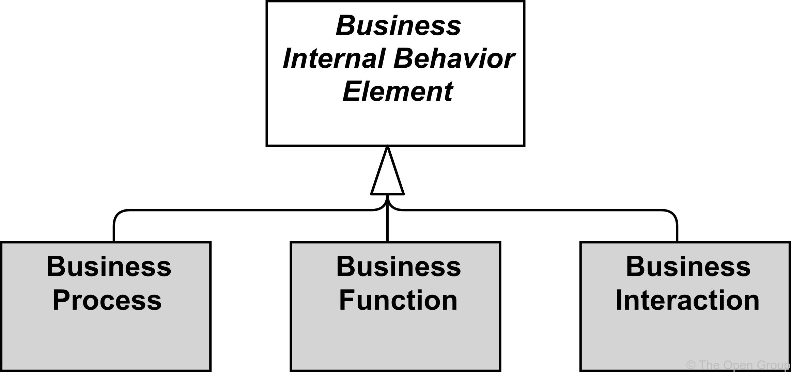

**Figure 58. Business Internal Behavior Elements**

> 图58 业务内部行为元素

> [!NOTE]
>
> This figure-图形 does not show all permitted relationships; every element in the language can have composition, aggregation, and specialization relationships with elements of the same type.
>
> > 这个图形并没有显示所有允许的关系;语言中的每个元素都可以与相同类型的元素具有组合、聚合和专门化关系。
>
> Furthermore-此外,而且, there are indirect relationships that can be derived, as explained in [Section 5.7](https://pubs.opengroup.org/architecture/archimate3-doc/ch-Relationships-and-Relationship-Connectors.html#sec-Derivation-of-Relationships).
>
> > 此外，还可以推导出间接关系，如[第5.7节](https://pubs.opengroup.org/architecture/archimate3-doc/ch-Relationships-and-Relationship-Connectors.html#sec-Derivation-of-Relationships)所述。
>
> The full specification-规格,规范 of permitted relationships can be found in [Appendix B](https://pubs.opengroup.org/architecture/archimate3-doc/ch-relationships-Normative.html).
>
> > 允许关系的完整规范可以在 [附录B](https://pubs.opengroup.org/architecture/archimate3-doc/ch-relationships-Normative.html) 中找到。

### 8.3.1. Business Process

> 业务流程

A business process represents a sequence of business behaviors that achieves a specific result such as a defined set of products or business services.

> 业务流程表示实现特定结果(如一组已定义的产品或业务服务)的业务行为序列。

A business process describes the internal behavior performed by a business role that is required to produce a set of products and services.

> 业务流程描述了生产一组产品和服务所需的业务角色所执行的内部行为。

For a consumer, the products and services are relevant, and the required behavior is merely-仅仅,只 a black box, hence-因此,之后 the designation “internal”.

> 对于消费者来说，产品和服务是相关的，而所需的行为只是一个黑盒子，因此被称为“内部”。

A complex business process may be an aggregation of other, **finer-grained**-细粒度的 processes.

> 复杂的业务流程可能是其他细粒度流程的聚合。

To each of these, finer-grained roles may be assigned.

> 对于其中的每一个，可以分配更细粒度的角色。

There is a potential many-to-many relationship between business processes and business functions.

> 业务流程和业务功能之间存在潜在的多对多关系。

Informally-非正式地,通俗的 speaking, processes describe some kind of “flow” of activities, whereas functions group activities **according to**-根据 required skills, knowledge, resources, etc.

> 非正式地说，过程描述了活动的某种“流”，而功能根据所需的技能、知识、资源等对活动进行分组。

A business process may be triggered by, or trigger, any other business behavior element (e.g., business event, business process, business function, or business interaction).

> 业务流程可以由任何其他业务行为元素(例如，业务事件、业务流程、业务功能或业务交互)被触发或触发。

A business process may access business objects.

> 业务流程可以访问业务对象。

A business process may realize one or more business services and may be served by business, application, or technology services.

> 业务流程可以实现一个或多个业务服务，并且可以由业务、应用程序或技术服务提供服务。

A business role may be assigned to a business process to perform this process manually.

> 可以将业务角色分配给业务流程，以手动执行该流程。

An automated business process can be realized by an application process.

> 自动化的业务流程可以通过应用程序流程实现。

The name of a business process should clearly indicate a predefined sequence of actions using a verb or verb-noun combination and may include the word “process”.

> 业务流程的名称应该使用动词或动词-名词组合清楚地指示预定义的操作序列，并且可以包括单词“流程”。

Examples are “adjudicate-裁决,判决 claim”, “employee on-boarding-新员工入职培训”, “approval process”, or “financial reporting”.

> 例如“裁决索赔”、“雇员入职”、“批准流程”或“财务报告”。

In an ArchiMate model, the existence of business processes is depicted.

> 在 ArchiMate 模型中，描述了业务流程的存在。

High-level business, end-to-end processes, macro-大规模的,宏观的 flows, and workflows can all be expressed with the same business process element in the ArchiMate language.

> 高级业务、端到端流程、宏流和工作流都可以用 ArchiMate 语言中的相同业务流程元素表示。

It does not, however, list the flow of activities in detail.

> 但是，它没有详细列出活动的流程。

This is typically done during business process modeling, where a business process can be expanded using a business process design language; e.g., BPMN [[12](https://pubs.opengroup.org/architecture/archimate3-doc/ch-Referenced-docs.html#Ref12)].

> 这通常在业务流程建模期间完成，其中可以使用业务流程设计语言扩展业务流程；例如，BPMN(Business Process Modeling Notation) [[12](https://pubs.opengroup.org/architecture/archimate3-doc/ch-Referenced-docs.html#Ref12)])。

**Figure 59. Business Process Notation**

> 图59 业务流程符号

### 8.3.2. Business Function

> 业务方法

A business function represents a collection of business behavior based on a chosen set of criteria such as required business resources and/or competencies-能力,本领, and is managed or performed as a whole.

> 业务功能表示基于一组选定的标准(如所需的业务资源和/或能力)的业务行为的集合，并作为一个整体进行管理或执行。

Just like a business process, a business function also describes internal behavior performed by a business role.

> 就像业务流程一样，业务功能也描述了业务角色执行的内部行为。

However, while a business process groups behavior based on a sequence or flow of activities that is needed to realize a product or service, a business function typically groups behavior based on required business resources, skills, competencies, knowledge, etc.

> 然而，业务流程根据实现产品或服务所需的活动序列或流对行为进行分组，而业务功能通常根据所需的业务资源、技能、能力、知识等对行为进行分组。

There is a potential many-to-many relation between business processes and business functions.

> 业务流程和业务功能之间存在潜在的多对多关系。

Complex processes in general involve activities that offer various functions.

> 复杂过程通常包括提供各种功能的活动。

In this sense, a business process forms a string-一系列 of business functions.

> 从这个意义上说，业务流程构成了一系列业务功能。

In general, a business function delivers added value from a business point of view.

> 通常，从业务的角度来看，业务功能提供附加价值。

Organizational units or applications may coincide-一致,相交 with business functions due to their specific grouping of business activities. 

> 组织单位或应用程序可能由于其特定的业务活动分组而与业务功能一致。

Business functions are often closely aligned to an organization, but not necessarily explicitly governed-管理 by the organization.

> 业务功能通常与组织紧密结合，但不一定由组织明确管理。

Business functions can realize capabilities-功能,性能,能力.

> 业务功能可以实现功能。

Where business functions are often aligned with organization structure and describe the current, day-to-day activities of the enterprise, capabilities (see [Section 7.3.1](https://pubs.opengroup.org/architecture/archimate3-doc/ch-Strategy-Layer.html#sec-Capability)) represent its potential behavior and are independent from the implementation in the organization structure.

> 在业务功能通常与组织结构一致并描述企业当前的日常活动的情况下，能力(参见 [第7.3.1节](https://pubs.opengroup.org/architecture/archimate3-doc/ch-Strategy-Layer.html#sec-Capability) )代表其潜在行为，并且独立于组织结构中的实现。

A business function may be triggered by, or trigger, any other business behavior element (business event, business process, business function, or business interaction).

> 业务功能可以由任何其他业务行为元素(业务事件、业务流程、业务功能或业务交互)触发或触发。

A business function may access business objects.

> 业务功能可以访问业务对象。

A business function may realize one or more business services and may be served by business, application, or technology services.

> 业务功能可以实现一个或多个业务服务，并且可以由业务、应用程序或技术服务提供服务。

A business role may be assigned to a business function.

> 业务角色可以分配给业务功能。

The name of a business function should clearly indicate a well-defined behavior.

> 业务功能的名称应该清楚地表明定义良好的行为。

Examples are customer management, claims administration, member services, recycling-回收利用,再利用, or payment processing.

> 例如客户管理、索赔管理、成员服务、回收或支付处理。

**Figure 60. Business Function Notation**

> 图60 业务方法符号

### 8.3.3. Business Interaction

> 业务交互

A business interaction represents a unit of collective business behavior performed by (a collaboration of) two or more business actors, business roles, or business collaborations.

> 业务交互表示由两个或多个业务参与者、业务角色或业务协作执行的集体业务行为单元。

A business interaction is similar to a business process or function, but while a process or function may be performed by a single business active structure element, an interaction is performed by (a collaboration of) multiple active structure elements.

> 业务交互类似于业务流程或功能，但是流程或功能可能由单个业务活动结构元素执行，而交互则由多个活动结构元素(协作)执行。

These elements share the responsibility for performing the interaction.

> 这些元素共同承担执行交互的责任。

A business interaction may be triggered by, or trigger, any other business behavior element (business event, business process, business function, or business interaction).

> 业务交互可以由任何其他业务行为元素(业务事件、业务流程、业务功能或业务交互)触发或触发。

A business interaction may access business objects.

> 业务交互可以访问业务对象。

A business interaction may realize one or more business services and may use (internal) business services or application services. 

> 业务交互可以实现一个或多个业务服务，并且可以使用(内部)业务服务或应用程序服务。

A business collaboration or two or more business actors or roles may be assigned to a business interaction.

> 一个业务协作或两个或更多的业务参与者或角色可以分配给一个业务交互。

The name of a business interaction should preferably be a verb in the simple present-现在的,目前的 tense-时态.

> 业务交互的名称最好是一般现在时的动词。

**Figure 61. Business Interaction Notation**

> 图61 业务交互符号

### 8.3.4. Business Event

> 业务事件

A business event represents a business-related state change.

> 业务事件表示与业务相关的状态更改。

Business processes and other business behavior may be triggered or interrupted by a business event.

> 业务流程和其他业务行为可能由业务事件触发或中断。

Business processes may raise events that trigger other business processes, functions, or interactions.

> 业务流程可能引发触发其他业务流程、功能或交互的事件。

Unlike business processes, functions, and interactions, a business event is instantaneous: it does not have a duration-持续,持续时间.

> 与业务流程、功能和交互不同，业务事件是瞬时的:它没有持续时间。

Events may originate from the environment of the organization (e.g., from a customer), as well as internal events generated by other processes within the organization.

> 事件可能源于组织的环境(如顾客)，也可能源于组织内其他过程产生的内部事件。

A business event may have a time attribute that denotes the moment or moments at which the event happens.

> 业务事件可以有一个时间属性，表示事件发生的时刻。

For example, this can be used to model time schedules; e.g., to model an event that triggers a recurring business process to execute every first Monday of the month.

> 例如，这可以用来为时间计划建模；例如，对触发每月第一个星期一执行的重复业务流程的事件进行建模。

A business event may trigger or be triggered (raised) by a business process, business function, or business interaction.

> 业务事件可以由业务流程、业务功能或业务交互触发或引发(引发)。

A business event may access a business object and may be composed of other business events.

> 业务事件可以访问业务对象，也可以由其他业务事件组成。

The name of a business event should preferably be a verb in the perfect-完成时的 tense; e.g., “claim received”.

> 商务活动的名称最好是动词的完成时态；例如，“索赔已收到”。

**Figure 62. Business Event Notation**

> 图62 业务事件符号

### 8.3.5. Business Service

> 业务服务

A business service represents explicitly defined behavior that a business role, business actor, or business collaboration exposes to its environment.

> 业务服务表示业务角色、业务参与者或业务协作向其环境公开的明确定义的行为。

A business service exposes the functionality of business roles or collaborations to their environment.

> 业务服务向其环境公开业务角色或协作的功能。

This functionality is accessed through one or more business interfaces.

> 此功能可通过一个或多个业务接口访问。

A business service should provide a unit of behavior that is meaningful from the point of view of the environment. 

> 业务服务应该提供从环境的角度来看有意义的行为单元。

It has a purpose which states this utility-实用程序 **in terms of**-从…角度来看 the value it delivers, and is modeled as a value element associated with the service.

> 它有一个目的，根据它所交付的价值来声明这个实用程序，并被建模为与服务相关联的价值元素。

The environment includes the (behavior of) users from outside as well as inside the organization.

> 环境包括来自外部和组织内部的用户(行为)。

Business services can be external, customer-facing services (e.g., a travel insurance service) or internal support services (e.g., a resource management service).

> 业务服务可以是面向客户的外部服务(例如，旅行保险服务)或内部支持服务(例如，资源管理服务)。

A business service may serve business, application, and technology behavior or active structure elements.

> 业务服务可以服务于业务、应用程序和技术行为或活动结构元素。

A business process, business function, or business interaction may realize a business service.

> 业务流程、业务功能或业务交互可以实现业务服务。

A business interface may be assigned to a business service.

> 业务接口可以分配给业务服务。

A business service may access business objects.

> 业务服务可以访问业务对象。

The name of a business service should preferably be a verb ending with “-ing”; e.g., transaction processing.

> 业务服务的名称最好是以“-ing”结尾的动词；例如，事务处理。

Also, a name explicitly containing the word “service” may be used.

> 此外，可以使用显式包含“服务”一词的名称。

**Figure 63. Business Service Notation**

> 图63 业务服务符号

### 8.3.6. Example

> 示例

“Claims Administration” is a business function that is composed of a number of business processes and a business interaction. 

> “索赔管理”是一个业务功能，它由许多业务流程和一个业务交互组成。

This business function realizes a “Claims Processing” business service.

> 此业务功能实现“索赔处理”业务服务。

A business event “Claim Filed” triggers the first business process “Accept Claim”, which in turn triggers a business process “Assign Claim”.

> 业务事件“索赔提交”触发第一个业务流程“接受索赔”，该流程又触发业务流程“分配索赔”。

Depending on the type of claim, either the business process “Adjudicate Standard Claim” or the business interaction “Adjudicate High-Risk Claim” is performed.

> 根据索赔的类型，执行业务流程“裁决标准索赔”或业务交互“裁决高风险索赔”。

Adjudication of high-risk claims is a business interaction because, according to the company policy, two people should always be involved in this activity to minimize the risk of fraud-欺诈,骗局.

> 高风险索赔的裁决是一种业务交互，因为根据公司政策，应该始终有两个人参与这项活动，以尽量减少欺诈的风险。

After adjudication, the business processes “Notify Customer” and “Pay Claim” are performed in parallel, and when both have finished, business process “Close Claim” is triggered.

> 在裁决之后，业务流程“通知客户”和“支付索赔”并行执行，当两者都完成时，将触发业务流程“关闭索赔”。

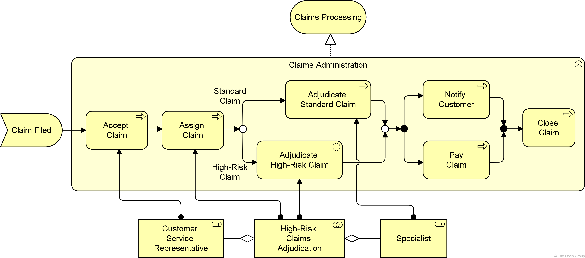

**Example 24: Business Behavior Elements**

> 示例24 业务行为元素

## 8.4. Passive Structure Elements

> 被动结构元素

The passive structure aspect of the Business Layer contains the passive structure elements (business objects) that are manipulated-操作 by behavior, such as business processes or functions.

> 业务层的被动结构方面包含由行为(如业务流程或功能)操作的被动结构元素(业务对象)。

The passive entities represent the important concepts in which the business thinks about a domain.

> 被动实体表示业务考虑领域时所使用的重要概念。

In the Business Layer, there are two main types of passive structure elements: *business object* and *representation-表示*.

> 在业务层中，有两种主要类型的被动结构元素:业务对象和表示。

Furthermore-此外,而且, a contract, used in the context of a product, is a specialization of a business object.

> 此外，在产品上下文中使用的契约是业务对象的专门化。

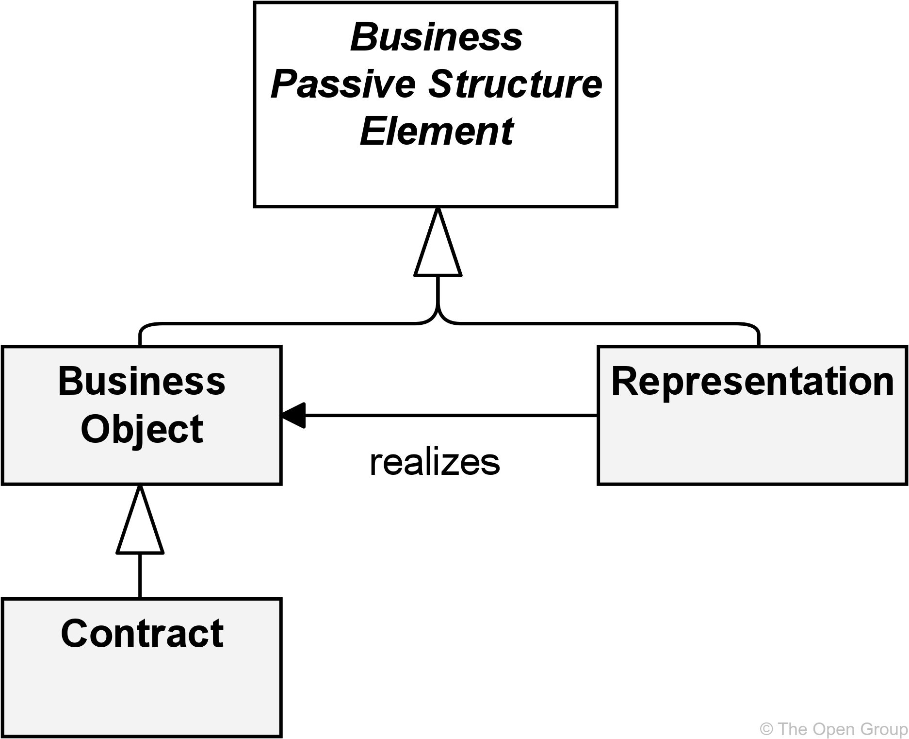

**Figure 64. Business Passive Structure Elements**

> 图64 业务被动结构元素

### 8.4.1. Business Object

> 业务对象

A business object represents a concept used within a particular business domain.

> 业务对象表示在特定业务域中使用的概念。

As explained in [Section 3.6](https://pubs.opengroup.org/architecture/archimate3-doc/ch-Language-Structure.html#sec-Abstraction-in-the-ArchiMate-Language), the ArchiMate language in general focuses on the modeling of types, not instances, since this is the most relevant at the Enterprise Architecture level of description.

> 正如在 [第3.6节](https://pubs.opengroup.org/architecture/archimate3-doc/ch-Language-Structure.html#sec-Abstraction-in-the-ArchiMate-Language) 中所解释的那样，ArchiMate 语言通常关注于类型的建模，而不是实例，因为这在企业架构级别的描述中是最相关的。

Hence-因此,之后 a business object typically models an object type (*cf.* a UML class) of which multiple instances may exist in operations.

> 因此，业务对象通常建模对象类型(*cf)。(一种UML类)，在操作中可能存在多个实例。

Only occasionally-偶然,偶尔, business objects represent actual instances of information produced and consumed by behavior elements such as business processes.

> 只是偶尔，业务对象表示由行为元素(如业务流程)产生和使用的信息的实际实例。

This is in particular the case for singleton types; i.e., types that have only one instance.

> 对于单例类型尤其如此；例如，只有一个实例的类型。

A wide variety of types of business objects can be defined.

> 可以定义各种类型的业务对象。

Business objects are passive in the sense that they do not trigger or perform processes.

> 业务对象是被动的，因为它们不触发或执行流程。

A business object could be used to represent information assets that are relevant from a business **point of view**-观点,角度 and can be realized by data objects.

> 业务对象可用于表示从业务角度来看相关的信息资产，并且可以通过数据对象实现。

Business objects may be accessed (e.g., in the case of information objects, they may be created, read, or written) by a business process, function, business interaction, business event, or business service.

> 业务对象可以被业务流程、功能、业务交互、业务事件或业务服务访问(例如，在信息对象的情况下，它们可以被创建、读取或写入)。

A business object may have association, specialization, aggregation, or composition relationships with other business objects.

> 业务对象可能与其他业务对象具有关联、专门化、聚合或组合关系。

A business object may be realized by a representation or by a data object (or both).

> 业务对象可以通过表示或数据对象(或两者)来实现。

The name of a business object should preferably be a noun.

> 业务对象的名称最好是名词。

**Figure 65. Business Object Notation**

> 图65 业务对象符号

### 8.4.2. Contract

> 契约,合同

A contract represents a formal or informal specification-规格,规范 of an agreement between a provider and a consumer that specifies the rights and obligations-义务,责任 associated with a product and establishes functional and non-functional parameters for interaction.

> 契约代表了提供者和消费者之间协议的正式或非正式规范，它指定了与产品相关的权利和义务，并为交互建立了功能和非功能参数。

The contract element may be used to model a contract in the legal sense, but also a more informal agreement associated with a product.

> 合同要素可以用来模拟法律意义上的合同，也可以用来模拟与产品有关的非正式协议。

It may also be or include an SLA describing an agreement about the functionality and quality of the services that are part of a product.

> 它也可以是或包括一个SLA，它描述了作为产品一部分的服务的功能和质量的协议。

A contract is a specialization of a business object.

> 契约是业务对象的专门化。

The relationships that apply to a business object also apply to a contract.

> 适用于业务对象的关系也适用于契约。

In addition, a contract may have an aggregation relationship with a product.

> 此外，契约可能与产品有聚合关系。

The name of a contract is preferably a noun.

> 合同的名称最好是名词。

**Figure 66. Contract Notation**

> 图66 合同符号

### 8.4.3. Representation

> 表示

A representation represents a perceptible-可感知的,看得见的 form of the information carried by a business object.

> 表示表示业务对象所携带信息的一种可感知形式。

Representations (messages or documents) are the perceptible-可感知的 carriers of information that are related to business objects.

> 表示(消息或文档)是与业务对象相关的信息的可感知载体。

If relevant, representations can be classified in various ways; for example, in terms of medium (electronic, paper, audio, etc.) or format (HTML, ASCII, PDF, RTF, etc.).

> 如果相关，表征可以以各种方式分类；例如，在媒介(电子，纸张，音频等)或格式(HTML, ASCII, PDF, RTF等)方面。

A single business object can have a number of different representations as well as realize one or more specific business objects.

> 单个业务对象可以有许多不同的表示，也可以实现一个或多个特定的业务对象。

A meaning can be associated with a representation that carries-运载,承载 this meaning.

> 一个含义可以与承载这个含义的表示相关联。

The name of a representation is preferably a noun.

> 代表的名称最好是名词。

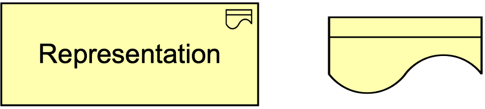

**Figure 67. Representation Notation**

> 图67 表示符号

### 8.4.4. Example

The business object “Claim” may be realized by either of the following three physical representations (in different stages of the claims administration process): “Submission Form”, “Claim File Summary”, or “Claim Letter”.

> 业务对象“Claim”可以通过以下三种物理表示(在索赔管理流程的不同阶段)中的任何一种实现：“提交表单”、“索赔文件摘要”或“索赔信”。

All of these representations refer to a representation “Policy Summary”, which realizes a contract “Insurance Policy”.

> 所有这些陈述均为“保险单摘要”的表述，实现了合同“保险单”。

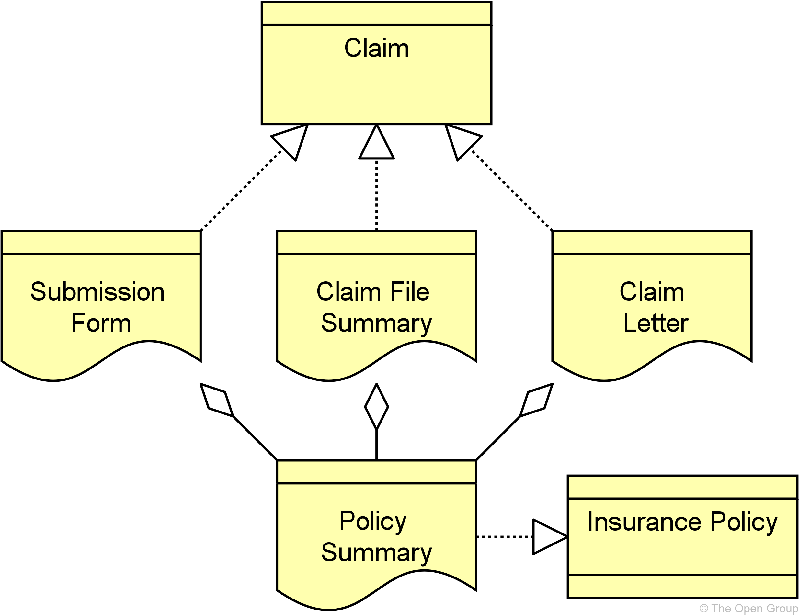

**Example 25: Business Passive Structure Elements**

> 示例25 业务被动结构元素

## 8.5. Composite Elements

> 复合元素

The Business Layer contains one composite element: *product*.

> 业务层包含一个组合元素：product。

This aggregates or composes services and passive structure elements across the layers of the ArchiMate core language.

> 这将聚合或组合跨 ArchiMate 核心语言层的服务和被动结构元素。

[Figure 68](https://pubs.opengroup.org/architecture/archimate3-doc/ch-Business-Layer.html#fig-Product-Metamodel) shows the applicable part of the metamodel.

> [图68 ](https://pubs.opengroup.org/architecture/archimate3-doc/ch-Business-Layer.html#fig-Product-Metamodel)显示了元模型的适用部分。

This crosses layers, as also described in [Chapter 11](https://pubs.opengroup.org/architecture/archimate3-doc/ch-Relationships-Between-Core-Layers.html).

> 这是跨层的，在 [第11章](https://pubs.opengroup.org/architecture/archimate3-doc/ch-Relationships-Between-Core-Layers.html) 中也有描述。

**Figure 68. Product Metamodel**

> 图68 产品元模型

### 8.5.1. Product

A product represents a coherent collection of services and/or passive structure elements, accompanied-伴随的,陪伴 by a contract, which is offered as a whole to (internal or external) customers.

> 产品代表服务和/或被动结构元素的连贯集合，伴随着作为一个整体提供给(内部或外部)客户的合同。

This definition covers both intangible, services-based, or information products that are common in information-intensive-信息密集型 organizations, as well as tangible, physical products.

> 这个定义既包括信息密集型组织中常见的无形的、基于服务的或信息产品，也包括有形的、物理的产品。

A financial or information product consists of a collection of services along with a contract that specifies-指定 the characteristics, rights-权利,权限, and requirements associated with the product.

> 金融或信息产品由一系列服务以及指定与产品相关的特征、权利和需求的合同组成。

“Buying” a product gives the customer the right to use the associated services.

> “购买”产品赋予客户使用相关服务的权利。

Generally, the product element is used to specify a product *type*.

> 通常，product 元素用于指定产品类型。

The number of product types in an organization is typically relatively stable-稳定的,牢固的 compared to the processes that realize or support the products.

> 与实现或支持产品的过程相比，组织中产品类型的数量通常相对稳定。

“Buying” is usually one of the services associated with a product which results in a new instance of that product (belonging to a specific customer). 

> “购买”通常是与产品相关的服务之一，它导致该产品的新实例(属于特定客户)。

Similarly, there may be services to modify or destroy a product.

> 同样，也可能存在修改或销毁产品的服务。

A product may aggregate or compose business services, application services, technology services, business objects, data objects, and technology passive structure elements (artifacts and material), **as well as**-也,以及,还有 a contract.

> 产品可以聚合或组合业务服务、应用程序服务、技术服务、业务对象、数据对象和技术被动结构元素(工件和材料)，以及契约。

Hence-因此,之后 a product may aggregate or compose elements from other layers than the Business Layer.

> 因此，产品可以聚合或组合来自业务层以外其他层的元素。

A value may be associated with a product.

> 一个值可能与一个产品相关联。

The name of a product is usually the name used in the communication with customers, or possibly a more generic noun (e.g., “travel insurance”).

> 产品的名称通常是在与客户沟通时使用的名称，或者可能是一个更通用的名词(例如，“旅游保险”)。

**Figure 69. Product Notation**

> 图69 产品符号

### 8.5.2. Example

A product “Insurance” consists of a contract “Insurance Policy” and a business service “Customer Service”, which aggregates four other business services: “Application”, “Renewal-延长,续订”, “Claims Processing”, and “Appeal-上诉,申诉”.

> 产品“Insurance”由合同“Insurance Policy”和业务服务“Customer service”组成，业务服务“Customer service”聚合了另外四个业务服务：“Application”、“renew”、“Claims Processing”和“Appeal”。

An “Auto-汽车的 Insurance” product is a specialization of the generic “Insurance” product, with an additional business service “Drive Well and Save”, and accompanying-伴随的 contract “Drive Well and Save Agreement”.

> “汽车保险”产品是一般“保险”产品的专业化，附加了“良好驾驶和节约”的业务服务，并附带了“良好驾驶和节约协议”。

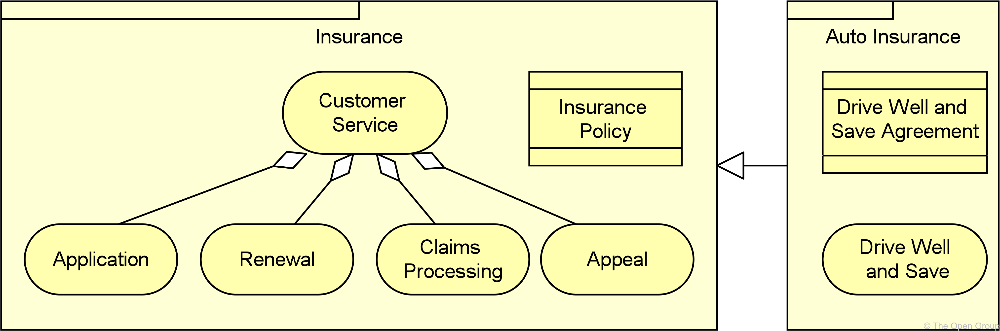

**Example 26: Business Composite Element: Product**

> 示例26 业务复合元素：产品

## 8.6. Summary of Business Layer Elements

> 业务层元素总结

Table 6 gives an overview of the Business Layer elements, with their definitions.

> 表6 概述了业务层元素及其定义。

**Table 6. Business Layer Elements**

> 表6 业务层元素

| Element                | Description                                                  | Notation                                                     |
| ---------------------- | ------------------------------------------------------------ | ------------------------------------------------------------ |
| Business Actor         | Represents a business entity that is capable of performing behavior. 表示能够执行行为的业务实体。 |  |
| Business Role          | Represents the responsibility for performing specific behavior, to which an actor can be assigned, or the part an actor plays in a particular action or event. 表示执行特定行为的责任，可以分配给参与者，或者参与者在特定动作或事件中扮演的角色。 |  |
| Business Collaboration | Represents an aggregate of two or more business internal active structure elements that work together to perform collective behavior. 表示一起工作以执行集体行为的两个或多个业务内部活动结构元素的集合。 |  |
| Business Interface     | Represents a point of access where business services are made available to the environment. 表示向环境提供业务服务的访问点。 |  |
|                        |                                                              |                                                              |
| Business Process       | Represents a sequence of business behaviors that achieves a specific result such as a defined set of products or business services. 表示实现特定结果(如一组已定义的产品或业务服务)的业务行为序列。 |  |
| Business Function      | Represents a collection of business behavior based on a chosen set of criteria such as required business resources and/or competencies, and is managed or performed as a whole. 表示基于一组选定的标准(如所需的业务资源和/或能力)的业务行为的集合，并作为一个整体进行管理或执行。 |  |
| Business Interaction   | Represents a unit of collective business behavior performed by (a collaboration of) two or more business actors, business roles, or business collaborations. 表示由两个或多个业务参与者、业务角色或业务协作执行的集体业务行为单元。 |  |
| Business Event         | Represents a business-related state change. 表示与业务相关的状态更改。 |  |
| Business Service       | Represents explicitly defined behavior that a business role, business actor, or business collaboration exposes to its environment. 表示业务角色、业务参与者或业务协作向其环境公开的明确定义的行为。 |  |
|                        |                                                              |                                                              |
| Business Object        | Represents a concept used within a particular business domain. 表示在特定业务域中使用的概念。 |  |
| Contract               | Represents a formal or informal specification of an agreement between a provider and a consumer that specifies the rights and obligations associated with a product and establishes functional and non-functional parameters for interaction. 表示提供者和消费者之间协议的正式或非正式规范，该规范规定了与产品相关的权利和义务，并为交互建立了功能和非功能参数。 |  |
| Representation         | Represents a perceptible form of the information carried by a business object. 表示业务对象所携带信息的可感知形式。 |  |
|                        |                                                              |                                                              |
| Product                | Represents a coherent collection of services and/or passive structure elements, accompanied by a contract, which is offered as a whole to (internal or external) customers. 表示服务和/或被动结构元素的连贯集合，伴随着合同，作为一个整体提供给(内部或外部)客户。 |  |

