# Chapter 9. Application Layer

> 应用层

The Application Layer elements are typically used to model the Application Architecture that describes the structure, behavior, and interaction of the applications of the enterprise.

> 应用程序层元素通常用于对描述企业应用程序的结构、行为和交互的应用程序体系结构进行建模。

## 9.1. Application Layer Metamodel

> 应用层元模型

Figure 70 gives an overview of the Application Layer elements and their relationships.

> 图70 给出了 Application Layer 元素及其关系的概述。

Whenever applicable-适用的,适当的, inspiration has been drawn from the analogy-类比,比拟 with the Business Layer.

> 只要适用，就可以从与业务层的类比中获得灵感。

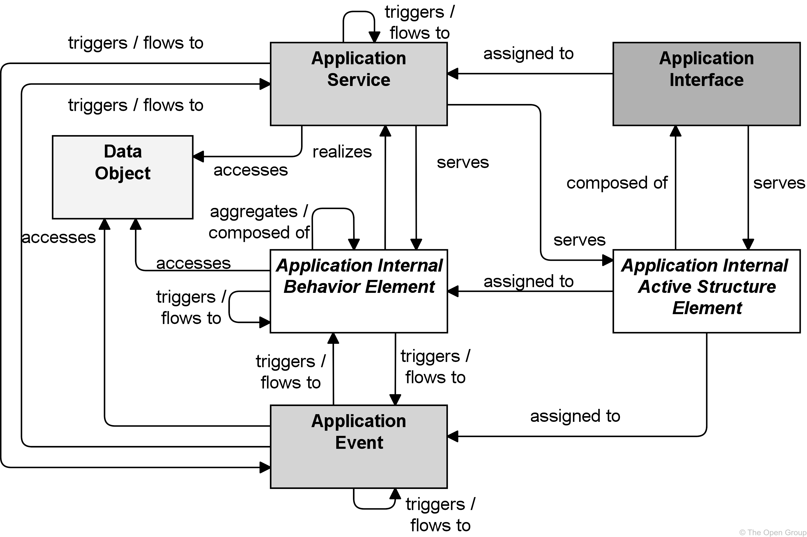

**Figure 70. Application Layer Metamodel**

> 图70 应用层元模型

> [!NOTE]
>
> This figure does not show all permitted relationships; every element in the language can have composition, aggregation, and specialization relationships with elements of the same type.
>
> > 这个数字并没有显示所有允许的关系；语言中的每个元素都可以与相同类型的元素具有组合、聚合和专门化关系。
>
> Furthermore, there are indirect relationships that can be derived, as explained in [Section 5.7](https://pubs.opengroup.org/architecture/archimate3-doc/ch-Relationships-and-Relationship-Connectors.html#sec-Derivation-of-Relationships).
>
> > 此外，还可以推导出间接关系，如 [第5.7节](https://pubs.opengroup.org/architecture/archimate3-doc/ch-Relationships-and-Relationship-Connectors.html#sec-Derivation-of-Relationships) 所述。

## 9.2. Active Structure Elements

> 主动结构元素

The main active structure element for the Application Layer is the *application component*.

> 应用层的主要活动结构元素是应用组件。

This element is used to model any structural entity in the Application Layer: not just (re-usable) software components that can be part of one or more applications, but also complete-完全的,完整的 software applications, sub-applications, or information systems.

> 此元素用于为应用层中的任何结构实体建模：不仅是(可重用的)软件组件，可以是一个或多个应用程序的一部分，还包括完整的软件应用程序、子应用程序或信息系统。

Although very similar to the UML component, the ArchiMate application component element strictly-严格地 models the structural aspect of an application; its behavior is modeled by an explicit relationship to the behavior element.

> 尽管与UML组件非常相似，ArchiMate 应用程序组件元素严格地对应用程序的结构方面进行建模；它的行为通过与行为元素的显式关系建模。

The inter-relationships-相互关系 of components also form essential-基本的 parts of the Application Architecture.

> 组件之间的相互关系也构成了应用程序体系结构的基本部分。

Therefore, we also introduce the element of *application collaboration* here (see [Figure 71](https://pubs.opengroup.org/architecture/archimate3-doc/ch-Application-Layer.html#fig-Application-Internal-Active-Structure-Elements)), defined as a collective of application components which perform application interactions.

> 因此，我们在这里也引入了应用程序协作的元素(参见 [图71](https://pubs.opengroup.org/architecture/archimate3-doc/ch-Application-Layer.html#fig-Application-Internal-Active-Structure-Elements) )，它被定义为执行应用程序交互的应用程序组件的集合。

The element is very similar to the collaboration as defined in the UML standard [[7](https://pubs.opengroup.org/architecture/archimate3-doc/ch-Referenced-docs.html#Ref7)], [[8](https://pubs.opengroup.org/architecture/archimate3-doc/ch-Referenced-docs.html#Ref8)].

> 元素与UML标准 [[7](https://pubs.opengroup.org/architecture/archimate3-doc/ch-Referenced-docs.html#Ref7)]， [[8](https://pubs.opengroup.org/architecture/archimate3-doc/ch-Referenced-docs.html#Ref8)])中定义的协作非常相似。

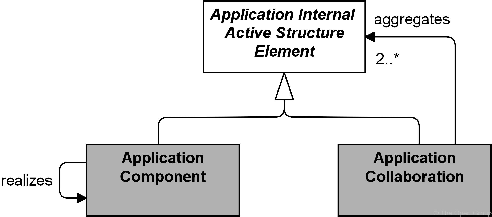

**Figure 71. Application Internal Active Structure Elements**

> 图71 应用内部主动结构元素

> [!NOTE]
>
> This figure does not show all permitted relationships; every element in the language can have composition, aggregation, and specialization relationships with elements of the same type.
>
> > 这个数字并没有显示所有允许的关系；语言中的每个元素都可以与相同类型的元素具有组合、聚合和专门化关系。
>
> Furthermore, there are indirect relationships that can be derived, as explained in [Section 5.7](https://pubs.opengroup.org/architecture/archimate3-doc/ch-Relationships-and-Relationship-Connectors.html#sec-Derivation-of-Relationships).
>
> > 此外，还可以推导出间接关系，如 [第5.7节](https://pubs.opengroup.org/architecture/archimate3-doc/ch-Relationships-and-Relationship-Connectors.html#sec-Derivation-of-Relationships) 所述。

In the purely-纯粹的,完全地,仅仅 structural sense, an *application interface* is the (logical) channel through which the services of a component can be accessed.

> 在纯粹的结构意义上，应用程序接口是(逻辑)通道，通过它可以访问组件的服务。

In a broader sense (as used in, among others, the UML definition), an application interface defines some elementary-简单的,基本的 behavioral characteristics: it defines the set of operations and events that are provided by the component.

> 在更广泛的意义上(如在UML定义中使用的那样)，应用程序接口定义了一些基本的行为特征：它定义了由组件提供的一组操作和事件。

Thus, it is used to describe the functionality-功能,功能性,函数性 of a component.

> 因此，它被用来描述组件的功能。

The application interface element can be used to model both *application-to-application* interfaces, which offer internal application services, and *application-to-business* interfaces (and/or *user interfaces*), which offer external application services.

> 应用程序接口元素可用于为提供内部应用程序服务的“应用程序到应用程序”接口和提供外部应用程序服务的“应用程序到业务”接口(和/或“用户接口”)建模。

### 9.2.1. Application Component

> 应用组件

An application component represents an encapsulation-封装,包装 of application functionality aligned to implementation structure, which is modular-组合式的,模块化的 and replaceable-可替换的,可置换的.

> 应用程序组件表示与实现结构一致的应用程序功能的封装，实现结构是模块化和可替换的。

An application component is a self-contained unit.

> 应用程序组件是一个自包含的单元。

As such, it is independently deployable-可部署的, re-usable-可重复使用的, and replaceable.

> 因此，它是可独立部署、可重用和可替换的。

An application component performs one or more application functions.

> 应用程序组件执行一个或多个应用程序功能。

It encapsulates its behavior and data, exposes services, and makes them available through interfaces.

> 它封装它的行为和数据，公开服务，并使它们通过接口可用。

Cooperating-合作,协作 application components are connected via application collaborations.

> 协作应用程序组件通过应用程序协作连接起来。

An application component may be assigned to one or more application functions.

> 可以将应用程序组件分配给一个或多个应用程序功能。

An application component has one or more application interfaces, which expose its functionality.

> 应用程序组件具有一个或多个应用程序接口，这些接口公开其功能。

Application interfaces of other application components may serve an application component.

> 其他应用程序组件的应用程序接口可以为一个应用程序组件服务。

The name of an application component should preferably be a noun.

> 应用程序组件的名称最好是名词。

The application component element is used to model entire applications (i.e., deployed and operational IT systems, as defined by the TOGAF framework [[4](https://pubs.opengroup.org/architecture/archimate3-doc/ch-Referenced-docs.html#Ref4)]) and individual parts of such applications, at all relevant levels of detail.

> 应用程序组件元素用于在所有相关的细节级别上对整个应用程序(例如，由 TOGAF 框架[[4](https://pubs.opengroup.org/architecture/archimate3-doc/ch-Referenced-docs.html#Ref4)])定义的已部署和可操作的IT系统)以及此类应用程序的各个部分进行建模。

Application components can realize other application components.

> 应用组件可以实现其他应用组件。

This is explained in [Section 3.6](https://pubs.opengroup.org/architecture/archimate3-doc/ch-Language-Structure.html#sec-Abstraction-in-the-ArchiMate-Language).

> 这在 [第3.6节](https://pubs.opengroup.org/architecture/archimate3-doc/ch-Language-Structure.html#sec-Abstraction-in-the-ArchiMate-Language) 中有解释。

**Figure 72. Application Component Notation**

> 图72 应用组件符号

### 9.2.2. Application Collaboration

> 应用程序协作

An application collaboration represents an aggregate of two or more application internal active structure elements, that work together to perform collective-集体的,共同的 application behavior.

> 应用程序协作表示两个或多个应用程序内部活动结构元素的聚合，它们一起工作以执行集体应用程序行为。

An application collaboration specifies which application components or other application collaborations cooperate-合作,协作,配合 to perform a task.

> 应用程序协作指定哪些应用程序组件或其他应用程序协作来执行任务。

Collaborative behaviors similar to the communication pattern of these components are modeled by an application interaction.

> 与这些组件的通信模式类似的协作行为由应用程序交互建模。

An application collaboration typically models a logical or temporary collaboration of application components and does not exist as a separate-单独的 entity in the enterprise.

> 应用程序协作通常对应用程序组件的逻辑协作或临时协作进行建模，而不是作为企业中的独立实体存在。

Application collaboration is a specialization of application internal active structure element, and aggregates two or more (cooperating) application components or other application collaborations.

> 应用程序协作是应用程序内部活动结构元素的专门化，聚合两个或多个(协作的)应用程序组件或其他应用程序协作。

An application collaboration is an active structure element that may be assigned to one or more application interactions or other application internal behavior elements, which model the associated behavior.

> 应用程序协作是一个活动的结构元素，可以将其分配给一个或多个应用程序交互或其他应用程序内部行为元素，这些元素对相关行为进行建模。

An application interface may serve an application collaboration which also may be composed of application interfaces.

> 应用程序接口可以服务于也可以由应用程序接口组成的应用程序协作。

The name of an application collaboration should preferably be a noun.

> 应用程序协作的名称最好是名词。

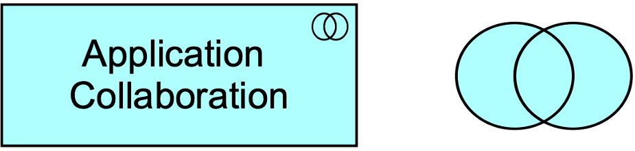

**Figure 73. Application Collaboration Notation**

> 图73 应用协作符号

### 9.2.3. Application Interface

> 应用接口

An application interface represents a point of access where application services are made available to a user, another application component, or a node.

> 应用程序接口表示向用户、另一个应用程序组件或节点提供应用程序服务的访问点。

An application interface specifies how the functionality of a component can be accessed by other elements.

> 应用程序接口指定了其他元素如何访问组件的功能。

An application interface exposes application services to the environment.

> 应用程序接口向环境公开应用程序服务。

The same application service may be exposed through different interfaces, and the same interface may expose multiple services.

> 相同的应用程序服务可以通过不同的接口公开，而相同的接口可以公开多个服务。

In a sense, an application interface specifies a contract that a component making this interface available must fulfill.

> 从某种意义上说，应用程序接口指定了使该接口可用的组件必须履行的契约。

This may include parameters, protocols used, pre- and post-conditions, and data formats.

> 这可能包括参数、使用的协议、前置和后置条件以及数据格式。

An application interface may be part of an application component through composition, which means that these interfaces are provided by that component and can serve other application components.

> 应用程序接口可以通过组合成为应用程序组件的一部分，这意味着这些接口由该组件提供，并且可以为其他应用程序组件服务。

An application interface can be assigned to application services, which means that the interface exposes these services to the environment.

> 可以将应用程序接口分配给应用程序服务，这意味着该接口将这些服务公开给环境。

The name of an application interface should preferably be a noun.

> 应用程序接口的名称最好是名词。

**Figure 74. Application Interface Notation**

> 图74 应用接口符号

### 9.2.4. Example

The “Online Travel Insurance Sales” application collaboration aggregates two application components: “Quotation-报价” and “Purchase”.

> “在线旅游保险销售”应用协作聚合了两个应用组件:“报价”和“购买”。

The application collaboration provides an application interface “Web Services Interface” that serves another application component “Travel Website”.

> 应用程序协作提供了一个应用程序接口“Web服务接口”，该接口为另一个应用程序组件“旅游网站”提供服务。

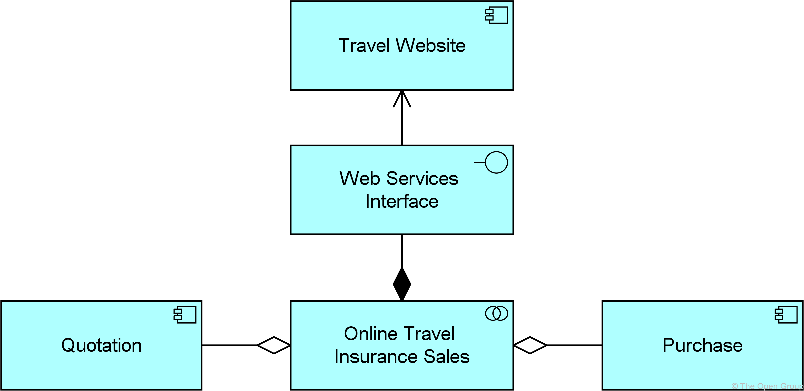

## 9.3. Behavior Elements

> 行为元素

Behavior in the Application Layer is described in a way that is very similar to Business Layer behavior.

> 应用层中的行为以与业务层行为非常相似的方式描述。

As in the Business Layer, a distinction is made between the external behavior of application components **in terms of**-从…角度来看 *application services*, and the internal behavior of these components; e.g., *application functions* that realize these services.

> 与业务层一样，应用程序组件的外部行为(以*应用程序服务*表示)与这些组件的内部行为是有区别的；例如，实现这些服务的应用程序函数。

An *application service* is an externally visible unit of behavior, provided by one or more components, exposed through well-defined interfaces, and meaningful to the environment.

> 应用程序服务是一个外部可见的行为单元，由一个或多个组件提供，通过定义良好的接口公开，并且对环境有意义。

The service element provides a way to explicitly-显式地,直截了当地 describe the functionality that components share with each other and the functionality that they make available to the environment.

> 服务元素提供了一种显式描述组件彼此共享的功能以及它们对环境可用的功能的方法。

The concept fits well within service-oriented application architecture.

> 这个概念非常适合面向服务的应用程序体系结构。

The functionality that an interactive computer program provides through a user interface, is also modeled using an application service that is exposed by an application-to-business interface representing the user interface.

> 交互式计算机程序通过用户界面提供的功能也可以使用应用程序服务进行建模，该应用程序服务由表示用户界面的应用程序到业务接口公开。

Internal application services are exposed through an application-to-application interface.

> 内部应用程序服务通过应用程序到应用程序接口公开。

An *application function* describes the internal behavior of a component needed to realize one or more application services.

> 应用程序功能描述了实现一个或多个应用程序服务所需的组件的内部行为。

In analogy-类似,类比,比拟 with the Business Layer, an *application process* models an ordering of application behavior, as a counterpart-副本,对照物 of a business process.

> 与业务层类似，应用程序流程为应用程序行为的排序建模，作为业务流程的对应物。

Note that in most cases the internal behavior of a component is not modeled in too much detail in an architectural description. 

> 请注意，在大多数情况下，组件的内部行为不会在体系结构描述中进行太详细的建模。

The description of such behavior may lead the architect-架构师 to be confronted-面对,面临,处理,解决 with detailed design issues.

> 这种行为的描述可能会导致架构师面临详细的设计问题。

An *application interaction* is the behavior of a collaboration of two or more application components.

> 应用程序交互是两个或多个应用程序组件协作的行为。

An application interaction is external behavior from the perspective of each of the participating components, but the behavior is internal to the collaboration as a whole.

> 从每个参与组件的角度来看，应用程序交互是外部行为，但该行为是整个协作的内部行为。

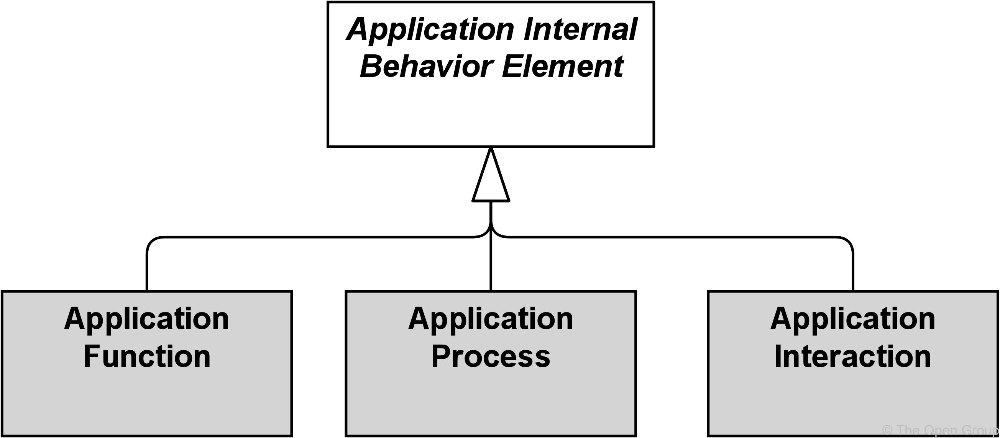

**Figure 75. Application Internal Behavior Elements**

> 图75 应用内部行为元素

> [!NOTE]
>
> This figure does not show all permitted relationships; every element in the language can have composition, aggregation, and specialization relationships with elements of the same type.
>
> > 这个数字并没有显示所有允许的关系；语言中的每个元素都可以与相同类型的元素具有组合、聚合和专门化关系。
>
> Furthermore-此外,而且, there are indirect relationships that can be derived, as explained in [Section 5.7](https://pubs.opengroup.org/architecture/archimate3-doc/ch-Relationships-and-Relationship-Connectors.html#sec-Derivation-of-Relationships).
>
> > 此外，还可以推导出间接关系，如 [第5.7节](https://pubs.opengroup.org/architecture/archimate3-doc/ch-Relationships-and-Relationship-Connectors.html#sec-Derivation-of-Relationships) 所述。

### 9.3.1. Application Function

> 应用方法

An application function represents automated behavior that can be performed by an application component.

> 应用程序功能表示可由应用程序组件执行的自动化行为。

An application function describes the internal behavior of an application component.

> 应用程序功能描述了应用程序组件的内部行为。

If this behavior is exposed externally, this is done through one or more services.

> 如果此行为对外公开，则通过一个或多个服务完成。

An application function abstracts from the way it is implemented.

> 应用程序功能从其实现方式中抽象出来。

Only the necessary behavior is specified.

> 只指定必要的行为。

An application function may realize one or more application services.

> 一个应用功能可以实现一个或多个应用服务。

Application services of other application functions and technology services may serve an application function.

> 其他应用功能的应用服务和技术服务可以服务于某一应用功能。

An application function may access data objects.

> 应用程序函数可以访问数据对象。

An application component may be assigned to an application function (which means that the application component performs the application function).

> 可以将应用程序组件分配给应用程序功能(这意味着该应用程序组件执行该应用程序功能)。

The name of an application function should preferably be a verb ending with “-ing”; e.g., “accounting”.

> 应用程序函数的名称最好是一个以“-ing”结尾的动词；例如,“会计”。

**Figure 76. Application Function Notation**

> 图76 应用程序方法符号

### 9.3.2. Application Interaction

> 应用交互

An application interaction represents a unit of collective-集体的,共同的 application behavior performed by (a collaboration of) two or more application components.

> 应用程序交互表示由两个或多个应用程序组件(协作)执行的集体应用程序行为单元。

An application interaction describes the collective-集体的,共同的 behavior that is performed by the components that participate in an application collaboration.

> 应用程序交互描述了由参与应用程序协作的组件执行的集体行为。

This may, for example, include the communication pattern between these components.

> 例如，这可能包括这些组件之间的通信模式。

An application interaction can also specify the joint behavior needed to realize an application service.

> 应用程序交互还可以指定实现应用程序服务所需的联合行为。

The details of the interaction between the application components involved in an application interaction can be expressed during the detailed application design using, for example, a UML interaction diagram.

> 应用程序交互中涉及的应用程序组件之间交互的细节可以在详细的应用程序设计期间使用例如 UML 交互图来表示。

An application collaboration of two or more individual application components may be assigned to an application interaction.

> 两个或多个独立应用程序组件的应用程序协作可以分配给应用程序交互。

An application interaction may realize application services.

> 应用程序交互可以实现应用程序服务。

Business services, application services, and technology services may serve an application interaction.

> 业务服务、应用程序服务和技术服务可以为应用程序交互提供服务。

An application interaction may access data objects.

> 应用程序交互可以访问数据对象。

The name of an application interaction should clearly identify a series of application behaviors; e.g., “client profile-档案 creation” or “update customer records”.

> 应用程序交互的名称应该清楚地标识一系列应用程序行为；例如，“创建客户档案”或“更新客户记录”。

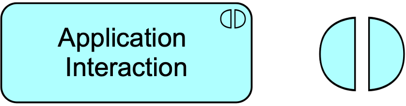

**Figure 77. Application Interaction Notation**

> 图77 应用交互符号

### 9.3.3. Application Process

> 应用流程

An application process represents a sequence of application behaviors that achieves a specific result.

> 应用程序进程表示实现特定结果的一系列应用程序行为。

An application process describes the internal behavior performed by an application component that is required to realize a set of services.

> 应用程序流程描述了实现一组服务所需的应用程序组件执行的内部行为。

For a (human or automated) consumer the services are relevant, and the required behavior is merely a black box, hence the designation “internal”.

> 对于(人工或自动化的)消费者来说，服务是相关的，而所需的行为只是一个黑盒，因此称为“内部”。

An application process may realize application services.

> 一个应用进程可以实现应用服务。

Other application services may serve (be used by) an application process.

> 其他应用程序服务可以为应用程序进程服务(由应用程序进程使用)。

An application process may access data objects.

> 应用程序进程可以访问数据对象。

An application component may be assigned to an application process (which means that this component performs the process). 

> 可以将应用程序组件分配给应用程序流程(这意味着该组件执行该流程)。

The name of an application process should clearly identify a series of application behaviors using a verb or verb-noun combination; e.g., “claims adjudication-裁定,判决 process”, or “general ledger-账户 update job”.

> 应用程序的名称应使用动词或动名词组合来清楚地识别一系列应用程序行为；例如，“索赔裁决程序”，或“总账更新工作”。

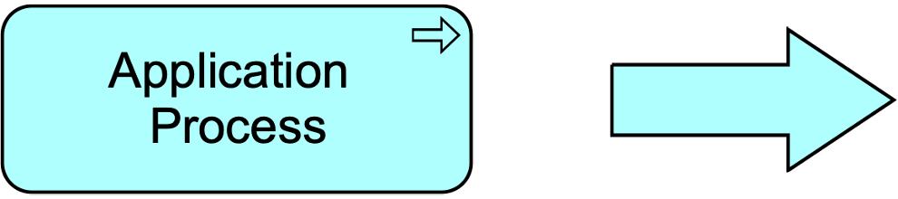

**Figure 78. Application Process Notation**

> 图78 应用过程符号

### 9.3.4. Application Event

> 应用事件

An application event represents an application state change.

> 应用程序事件表示应用程序状态更改。

Application functions and other application behavior may be triggered or interrupted by an application event.

> 应用事件可能触发或中断应用的功能和其他应用行为。

Also, application behavior may raise events that trigger other application behavior.

> 此外，应用程序行为可能引发触发其他应用程序行为的事件。

Unlike processes, functions, and interactions, an event is instantaneous-瞬间发生的,瞬间完成的; it does not have duration.

> 与过程、函数和交互不同，事件是瞬时的；它没有持续时间。

Events may originate from the environment of the organization (e.g., from an external application), but also internal events may occur generated by, for example, other applications within the organization.

> 事件可能源自组织的环境(例如，来自外部应用程序)，但也可能发生内部事件，例如，由组织内的其他应用程序生成。

An application event may have a time attribute that denotes the moment or moments at which the event happens.

> 应用程序事件可以有一个时间属性，表示事件发生的时刻。

For example, this can be used to model time schedules; e.g., an event that triggers a daily batch process.

> 例如，这可以用来为时间计划建模；例如，触发每日批处理过程的事件。

An application event may trigger or be triggered (raised) by an application function, process, or interaction.

> 应用程序事件可以由应用程序函数、流程或交互触发或引发(引发)。

An application event may access a data object and may be composed of other application events.

> 应用程序事件可以访问数据对象，也可以由其他应用程序事件组成。

The name of an application event should preferably be a verb in the perfect-完成 tense-时态; e.g., “claim received”.

> 应用程序事件的名称最好是完成时态的动词；例如，“索赔已收到”。

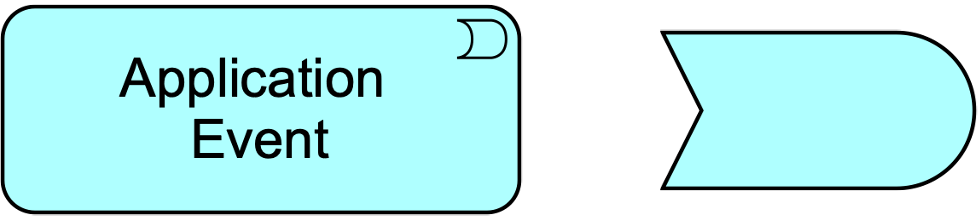

**Figure 79. Application Event Notation**

> 图79 应用事件符号

### 9.3.5. Application Service

> 应用服务

An application service represents an explicitly-显式,直截了当的 defined exposed application behavior.

> 应用程序服务表示显式定义的公开应用程序行为。

An application service exposes the functionality of components to their environment.

> 应用程序服务向其环境公开组件的功能。

This functionality is accessed through one or more application interfaces and is realized by one or more application functions that are performed by the component.

> 此功能可通过一个或多个应用程序接口访问，并由组件执行的一个或多个应用程序功能实现。

It may require, use, and produce data objects.

> 它可能需要、使用和生成数据对象。

An application service should be meaningful from the point of view of the environment; it should provide a unit of behavior that is, in itself, useful to its users.

> 从环境的角度来看，应用程序服务应该是有意义的；它应该提供一个本身对用户有用的行为单元。

It has a purpose that states this utility to the environment in terms of the value it delivers, modeled as a value element associated with the service.

> 它的目的是根据其交付的价值向环境声明此实用程序，并将其建模为与服务关联的价值元素。

This means that if this environment includes business processes, application services should have business relevance-相关性,实用性,意义.

> 这意味着如果此环境包含业务流程，则应用程序服务应该具有业务相关性。

An application service may serve business, application, and technology behavior or active structure elements.

> 应用程序服务可以服务于业务、应用程序和技术行为或活动结构元素。

An application function or process may realize an application service.

> 应用程序功能或进程可以实现应用程序服务。

An application interface may be assigned to an application service.

> 可以将应用程序接口分配给应用程序服务。

An application service may access data objects.

> 应用程序服务可以访问数据对象。

The name of an application service should preferably be a verb ending with “-ing”; e.g., “transaction processing”.

> 应用服务的名称最好是一个以“-ing”结尾的动词；例如，“事务处理”。

Also, a name explicitly containing the word “service” may be used.

> 此外，可以使用显式包含“服务”一词的名称。

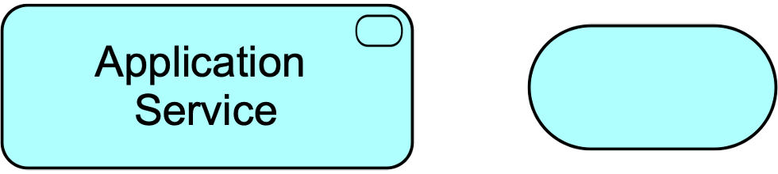

**Figure 80. Application Service Notation**

> 图80 应用服务符号

### 9.3.6. Example

The “Purchase Travel Insurance” application function is composed of two other application functions: “Transfer Quotation”, realizing an application service “Get Quotation”, and “Finalize Purchase”, realizing an application service “Purchase Quoted Insurance”.

> “购买旅游保险”应用功能由另外两个应用功能组成：“转让报价”，实现“获取报价”的应用服务；“完成购买”，实现“购买报价保险”的应用服务。

These application functions model the behavior of the “Quotation” and “Purchase” application components of [Example 27](https://pubs.opengroup.org/architecture/archimate3-doc/ch-Application-Layer.html#ex-Application-Active-Structure-Elements).

> 这些应用程序函数为 [示例27](https://pubs.opengroup.org/architecture/archimate3-doc/ch-Application-Layer.html#ex-Application-Active-Structure-Elements) 的“Quotation”和“Purchase”应用程序组件的行为建模。

An application event “Request for a Quotation” triggers an application process “Obtain Travel Insurance”, which is served by the two aforementioned-上述的,前面提及的 application services.

> 应用程序事件“请求报价”触发应用程序流程“获取旅行保险”，该流程由上述两个应用程序服务提供。

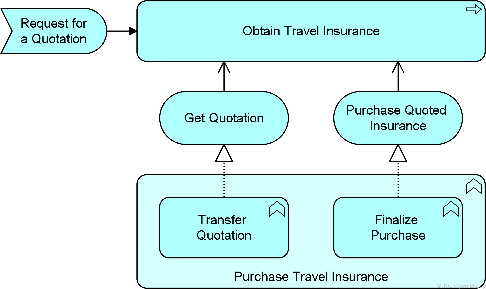

**Example 28: Application Behavior Elements**

> 示例28 应用行为元素

## 9.4. Passive Structure Elements

> 被动结构元素

The passive counterpart of the application component in the Application Layer is called a *data object.*

> 应用层中应用组件的被动对应被称为数据对象

This element is used in the same way as data objects (or object types) in well-known data modeling approaches, most notably-明显地,显著地 the “class” concept in UML class diagrams.

> 该元素的使用方式与众所周知的数据建模方法中的数据对象(或对象类型)相同，最明显的是UML类图中的“类”概念。

A data object can be seen as a representation of a business object, as a counterpart of the representation element in the Business Layer.

> 数据对象可以看作是业务对象的表示，是业务层中表示元素的对应物。

The ArchiMate language does not define a specific layer for information; however, elements such as business objects and data objects are used to represent the information entities and also the logical data components that realize the business objects.

> ArchiMate 语言没有为信息定义一个特定的层；但是，诸如业务对象和数据对象之类的元素用于表示信息实体以及实现业务对象的逻辑数据组件。

### 9.4.1. Data Object

> 数据对象

A data object represents data structured for automated processing.

> 数据对象表示为自动处理而结构化的数据。

A data object should be a self-contained piece of information with a clear meaning to the business, not just to the application level.

> 数据对象应该是一段自包含的信息，对业务(而不仅仅是应用程序级别)具有明确的含义。

Typical examples of data objects are a customer record, a client data set, or an insurance claim.

> 数据对象的典型示例是客户记录、客户数据集或保险索赔。

As explained in [Section 3.6](https://pubs.opengroup.org/architecture/archimate3-doc/ch-Language-Structure.html#sec-Abstraction-in-the-ArchiMate-Language), the ArchiMate language in general focuses on the modeling of types, not instances, since this is the most relevant at the Enterprise Architecture level of description.

> 正如在 [第3.6节](https://pubs.opengroup.org/architecture/archimate3-doc/ch-Language-Structure.html#sec-Abstraction-in-the-ArchiMate-Language) 中所解释的那样，ArchiMate语言通常关注于类型的建模，而不是实例，因为这在企业架构级别的描述中是最相关的。 

Hence a data object typically models a logical object type of which one or many instances may exist in operational applications.

> 因此，数据对象通常建模一种逻辑对象类型，其中一个或多个实例可能存在于操作应用程序中。

An application function or process can operate on data objects.

> 应用程序函数或进程可以对数据对象进行操作。

A data object may be communicated-通信 via interactions and used or produced by application services.

> 数据对象可以通过交互进行通信，并由应用程序服务使用或生成。

A data object can be accessed by an application function, application interaction, or application service.

> 数据对象可以通过应用程序功能、应用程序交互或应用程序服务进行访问。

A data object may realize a business object and may be realized by an artifact.

> 数据对象可以实现业务对象，也可以由工件实现。

A data object may have association, specialization, aggregation, or composition relationships with other data objects.

> 数据对象可能与其他数据对象具有关联、专门化、聚合或组合关系。

The name of a data object should preferably be a noun.

> 数据对象的名称最好是名词。

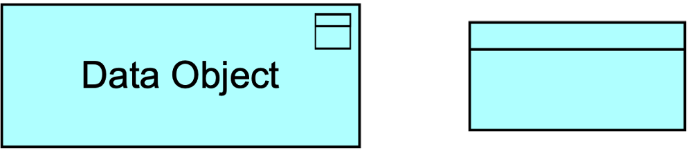

**Figure 81. Data Object Notation**

> 图81 数据对象符号

### 9.4.2. Example

An “Online Insurance Quotation” data object is composed of three other data objects: “Quoted Price”, “Terms-条款 and Conditions-条件”, and “Certificate of Authenticity”.

> “在线保险报价”数据对象由另外三个数据对象组成：“报价”、“条款与条件”和“真品证书”。

“Auto Insurance Quotation” and “Travel Insurance Quotation” are two specializations of the “Online Insurance Quotation” data object.

> “车险报价”和“旅游险报价”是“在线保险报价”数据对象的两个专门化。

“Travel Insurance Quotation” contains an additional data object “Purchased Itinerary-行程”.

> “旅行保险报价”包含一个额外的数据对象“购买的行程”。

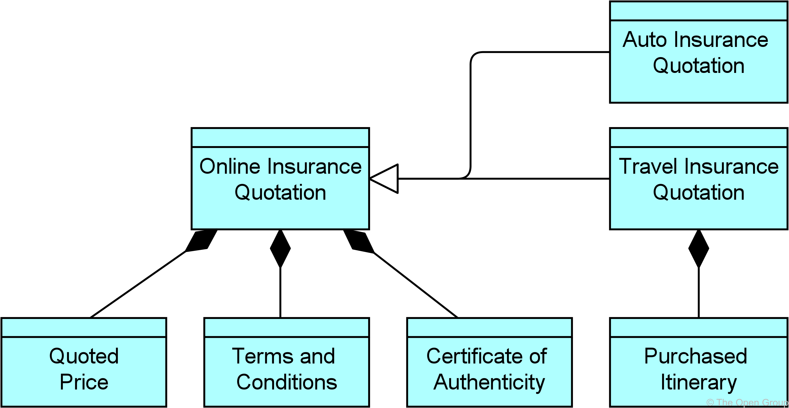

**Example 29: Application Passive Structure Elements**

> 示例29 应用被动结构元素

## 9.5. Summary of Application Layer Elements

> 应用层元素总结

Table 7 gives an overview of the Application Layer elements, with their definitions.

> 表格7 概述了应用层元素及其定义。

**Table 7. Application Layer Elements**

> 表格7 应用层元素

| Element                   | Definition                                                   | Notation                                                     |
| ------------------------- | ------------------------------------------------------------ | ------------------------------------------------------------ |
| Application Component     | Represents an encapsulation of application functionality aligned to implementation structure, which is modular-模块化 and replaceable-可替换的. 表示与实现结构一致的应用程序功能的封装，该实现结构是模块化和可替换的。 |  |
| Application Collaboration | Represents an aggregate of two or more application internal active structure elements that work together to perform collective application behavior. 表示两个或多个应用程序内部活动结构元素的聚合，这些元素一起工作以执行集体应用程序行为。 |  |
| Application Interface     | Represents a point of access where application services are made available to a user, another application component, or a node. 表示将应用程序服务提供给用户、另一个应用程序组件或节点的访问点。 |  |
|                           |                                                              |                                                              |
| Application Function      | Represents automated behavior that can be performed by an application component. 表示可由应用程序组件执行的自动化行为。 |  |
| Application Interaction   | Represents a unit of collective application behavior performed by (a collaboration of) two or more application components. 表示由两个或多个应用程序组件(协作)执行的集体应用程序行为单元。 |  |
| Application Process       | Represents a sequence of application behaviors that achieves a specific result. 表示实现特定结果的一系列应用程序行为。 |  |
| Application Event         | Represents an application state change. 表示应用程序状态更改。 |  |
| Application Service       | Represents an explicitly defined exposed application behavior. 表示显式定义的公开应用程序行为。 |  |
|                           |                                                              |                                                              |
| Data Object               | Represents data structured for automated processing. 表示用于自动处理的结构化数据。 |  |

