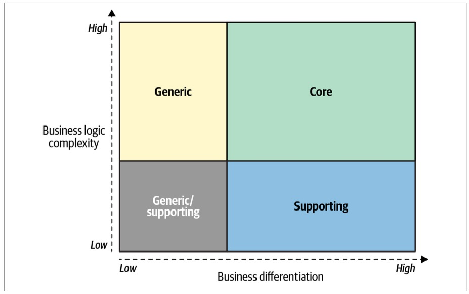
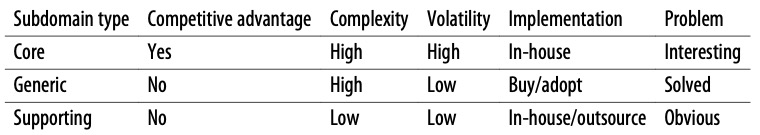
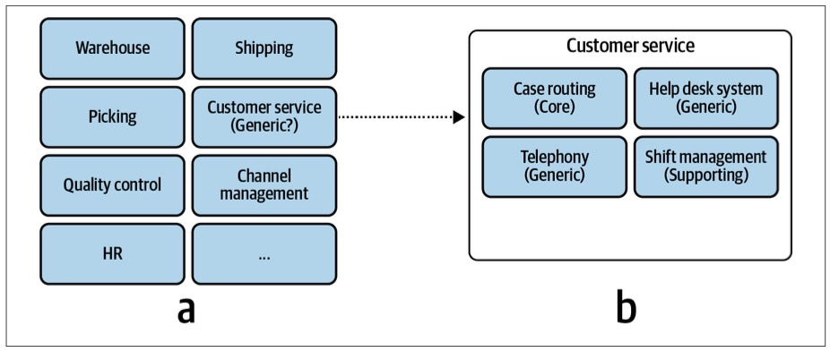
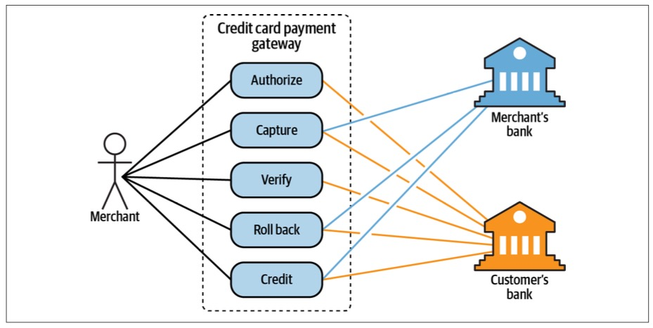
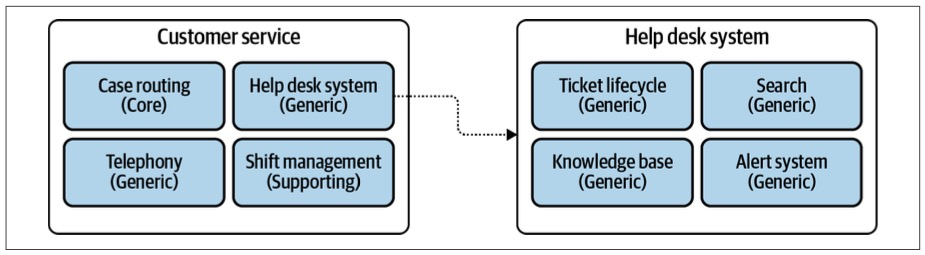

> Chapter 1. Analyzing Business Domains
>
> 章节 1. 分析业务领域

If you are anything like me, you love writing code: solving complex problems, coming up with elegant-高雅,优雅的 solutions, and constructing whole new worlds by carefully crafting their rules, structures, and behavior.

> 如果您像我一样，那么您一定喜欢编写代码：解决复杂的问题，提出优雅的解决方案，并通过精心设计规则、结构和行为来构建全新的世界。

I believe that’s what interested you in domain-driven design (DDD): you want to be better at your craft.

> 我相信这就是你对领域驱动设计(DDD)感兴趣的地方：你想在你的手艺上做得更好。

This chapter, however, has nothing to do with writing code.

> 然而，本章与编写代码无关。

In this chapter, you will learn how companies work: why they exist, what goals they are pursuing-追求,致力于, and their strategies for achieving their goals.

> 在本章中，你将学习公司是如何运作的：他们为什么存在，他们追求什么目标，以及他们实现目标的策略。

---

When I teach this material in my domain-driven design classes, many students actually ask, “Do we need to know this material? We are writing software, not running businesses.”

> 当我在领域驱动设计课程中教授这些材料时，许多学生实际上会问：“我们需要了解这些材料吗？我们是在写软件，不是在做生意。”

The answer to their question is a resounding “yes.”

> 他们的问题的答案是响亮的“是”。

To design and build an effective solution, you have to understand the problem.

> 为了设计和构建一个有效的解决方案，你必须理解问题。

The problem, in our context, is the software system we have to build.

> 在我们的环境中，问题是我们必须构建的软件系统。

To understand the problem, you have to understand the context within which it exists—the organization’s business strategy, and what value it seeks to gain by building the software.

> 要理解问题，您必须理解问题存在的环境——组织的业务策略，以及通过构建软件寻求获得的价值。

---

In this chapter, you will learn domain-driven design tools for analyzing a company’s business domain and its structure: its core, supporting, and generic subdomains.

> 在本章中，您将学习用于分析公司业务领域及其结构的领域驱动设计工具：核心，支持和通用子领域。

This material is the groundwork-基础,地基 for designing software.

> 这些材料是设计软件的基础。

In the remaining chapters, you will learn the different ways these concepts affect software design.

> 在剩下的章节中，您将了解这些概念影响软件设计的不同方式。

# What Is a Business Domain?

A business domain defines a company’s main area of activity.

> 业务领域定义了公司的主要活动领域。

Generally speaking, it’s the service the company provides to its clients.

> 一般来说，它是公司为客户提供的服务。

For example:

- FedEx provides courier-快递 delivery.

  > 联邦快递提供快递服务。

- Starbucks is best known for its coffee.

  > 星巴克最出名的是它的咖啡。

- Walmart is one of the most widely recognized-承认,认可 retail establishments-机构.

  > 沃尔玛是最受认可的零售机构之一。

A company can operate in multiple business domains.

> 公司可以在多个业务领域中运营。

For example, Amazon provides both retail and cloud computing services.

> 例如，亚马逊同时提供零售和云计算服务。

Uber is a rideshare-拼车 company that also provides food delivery and bicycle-sharing services.

> 优步是一家拼车公司，也提供外卖和自行车共享服务。

---

It’s important to note that companies may change their business domains often.

> 重要的是要注意，公司可能经常改变他们的业务领域。

A canonical-典范 example of this is Nokia, which over the years has operated in fields as diverse as wood-木材 processing, rubber-橡胶 manufacturing-制造, telecommunications-电信, and mobile communications.

> 一个典型的例子是诺基亚，多年来，它在木材加工、橡胶制造、电信和移动通信等领域开展业务。

# What Is a Subdomain?

> 什么是子域？

To achieve its business domain’s goals and targets, a company has to operate in multiple *subdomains*.

> 为了实现其业务领域的目标和指标，公司必须在多个“子领域”中运作。

A subdomain is a fine-grained area of business activity.

> 子域是业务活动的细粒度区域。

All of a company’s subdomains form its business domain: the service it provides to its customers.

> 公司的所有子域构成了它的业务域：它为客户提供的服务。

Implementing a single subdomain is not enough for a company to succeed; it’s just one building block in the overarching-总体 system. 

> 实现单个子域是不足以让公司成功的；它只是整个系统的一个组成部分。

The subdomains have to interact-相互作用,相互影响 with each other to achieve the company’s goals in its business domain.

> 子域必须相互交互以实现公司在其业务域中的目标。

For example, Starbucks may be most recognized for its coffee, but building a successful coffeehouse chain requires more than just knowing how to make great coffee.

> 例如，星巴克可能以其咖啡而闻名，但建立一个成功的咖啡馆连锁店需要的不仅仅是知道如何制作好咖啡。

You also have to buy or rent-租用,租借 real estate-房地产 at effective locations, hire personnel, and manage finances, among-以及 other activities.

> 你还必须在有效的地点购买或租赁房地产，雇佣人员，管理财务，以及其他活动。

None of these subdomains on its own will make a profitable-盈利的 company.

> 这些子域名本身都不能使公司盈利。

All of them together are necessary for a company to be able to compete in its business domain(s).

> 所有这些都是公司能够在其业务领域竞争所必需的。

## Types of Subdomains

Just as a software system comprises-构成,组成 various architectural components—databases, frontend applications, backend services, and others—subdomains bear-具有,带有 different strategic/business values.

> 正如软件系统由各种体系结构组件(数据库、前端应用程序、后端服务等)组成一样，子域具有不同的战略/业务价值。

Domain-driven design distinguishes between three types of subdomains: core, generic, and supporting.

> 领域驱动设计区分了三种类型的子领域：核心、通用和支持。

Let’s see how they differ from a company strategy point of view.

> 让我们从公司战略的角度来看它们有什么不同。

### Core subdomains

> 核心子域

A *core subdomain* is what a company does differently from its competitors.

> 核心子域名是公司与其竞争对手的不同之处。

This may involve inventing new products or services or reducing costs by optimizing existing processes.

> 这可能涉及发明新产品或服务，或通过优化现有流程来降低成本。

---

Let’s take Uber as an example.

Initially, the company provided a novel form of transportation: ridesharing.

> 最初，该公司提供了一种新颖的交通方式：拼车。

As its competitors **caught up**-追赶上, Uber found ways to optimize and evolve its core business: for example, reducing costs by matching riders-乘客 heading-前往 in the same direction-方向.

> 随着竞争对手的迎头赶上，优步找到了优化和发展其核心业务的方法：例如，通过匹配前往同一方向的乘客来降低成本。

---

Uber’s core subdomains affect its bottom line.

> 优步的核心子域名影响着它的利润。

This is how the company differentiates itself from its competitors.

> 这就是该公司区别于竞争对手的方式。

This is the company’s strategy for providing better service to its customers and/or maximizing its profitability.

> 这是公司为客户提供更好的服务和/或最大化其盈利能力的战略。

To maintain a competitive advantage, core subdomains involve inventions, smart optimizations, business knowhow-知识,诀窍,技巧, or other **intellectual property**-知识产权.

> 为了保持竞争优势，核心子领域涉及发明、智能优化、业务知识或其他知识产权。

---

Consider another example: Google Search’s ranking algorithm.

At the time of this writing, Google’s advertising-广告 platform **accounts for**-占,解释,账户 the majority of its profits.

> 在撰写本文时，谷歌的广告平台占其利润的大部分。

That said, Google Ads is not a subdomain, but rather a separate business domain with subdomains comprising-包含,组成 it, among its cloud computing service (Google Cloud Platform), productivity and collaboration tools (Google Workspaces), and other fields in which Alphabet, Google’s parent company, operates.

> 也就是说，谷歌广告不是一个子域名，而是一个独立的业务域名，其中包含子域名，包括其云计算服务(谷歌云平台)、生产力和协作工具(谷歌工作区)，以及谷歌母公司 Alphabet 运营的其他领域。

But what about Google Search and its ranking algorithm?

> 但是谷歌搜索和它的排名算法呢?

Although the search engine is not a paid service, it serves as the largest display platform for Google Ads.

> 虽然搜索引擎不是付费服务，但它是谷歌广告的最大展示平台。

Its ability to provide excellent search results is what drives traffic, and subsequently, it is an important component of the Ads platform.

> 它提供优秀搜索结果的能力是驱动流量的因素，随后，它是广告平台的重要组成部分。

Serving suboptimal-次优的 search results due to a bug in the algorithm or a competitor coming up with an even better search service will hurt the ad business’s revenue.

> 由于算法中的错误或竞争对手提供更好的搜索服务而提供次优搜索结果将损害广告业务的收入。

So, for Google, the ranking algorithm is a core subdomain.

> 所以，对谷歌来说，排名算法是一个核心子域。

---

**Complexity.**

> 复杂性

A core subdomain that is simple to implement can only provide a shortlived competitive advantage.

> 简单实现的核心子域只能提供短暂的竞争优势。

Therefore, core subdomains are naturally-自然地 complex.

> 因此，核心子域自然是复杂的。

Continuing with the Uber example, the company not only created a new marketspace with ridesharing, it disrupted-中断,扰乱 a decades-old monolithic architecture, the taxi industry, through targeted-针对性 use of technology.

> 继续以优步为例，该公司不仅通过拼车创造了一个新的市场空间，还通过有针对性地使用技术，颠覆了几十年来的单一架构——出租车行业。

By understanding its business domain, Uber was able to design a more reliable and transparent-透明的 method of transportation.

> 通过了解自己的业务领域，Uber能够设计出一种更可靠、更透明的运输方式。

There should be high entry barriers for a company’s core business; it should be hard for competitors to copy or imitate-模仿,仿效 the company’s solution.

> 公司的核心业务应该有很高的进入门槛；竞争对手应该很难复制或模仿该公司的解决方案。

---

**Sources of competitive advantage.** 

> 竞争优势的来源

It’s important to note that core subdomains are not necessarily technical.

> 重要的是要注意，核心子域不一定是技术性的。

Not all business problems are solved through algorithms or other technical solutions.

> 并非所有的业务问题都可以通过算法或其他技术解决方案来解决。

A company’s competitive advantage can come from various sources.

> 一个公司的竞争优势可以来自各种各样的来源。

---

Consider, for example, a jewelry-珠宝,首饰 maker selling its products online.

> 例如，考虑一家珠宝制造商在网上销售其产品。

The online shop is important, but it’s not a core subdomain.

> 在线商店很重要，但它不是一个核心子域名。

The jewelry design is.

> 珠宝设计是。

The company can use an existing off-the-shelf online shop engine, but it cannot outsource-外包 the design of its jewelry.

> 该公司可以使用现有的现成在线商店引擎，但它不能外包其珠宝的设计。

The design is the reason customers buy the jewelry maker’s products and remember the brand.

> 设计是顾客购买珠宝制造商的产品并记住品牌的原因。

---

As a more intricate-错综复杂的,难理解的 example, imagine a company that specializes in *manual* fraud-欺诈,骗局 detection.

> 再举一个更复杂的例子，假设有一家专门从事人工欺诈检测的公司。

The company trains its analysts to go over questionable documents and flag potential fraud cases.

> 该公司培训其分析师审阅有问题的文件，并指出潜在的欺诈案件。

You are building the software system the analysts are working with.

> 您正在构建分析人员正在使用的软件系统。

Is it a core subdomain?

> 它是一个核心子域名吗?

No.

The core subdomain is the work the analysts are doing.

> 核心子领域是分析人员正在做的工作。

The system you are building has nothing to do with fraud analysis, it just displays the documents and tracks the analysts’ comments.

> 您正在构建的系统与欺诈分析无关，它只是显示文档并跟踪分析人员的评论。

---

**Core Subdomain Versus Core Domain**

Core subdomains are also called core domains.

> 核心子域也称为核心域。

For example, in the original domain-driven design book, Eric Evans uses “core subdomain” and “core domain” interchangeably-可交换地. 

> 例如，在最初的领域驱动设计书中，Eric Evans 交替使用“核心子领域”和“核心领域”。

Although the term “core domain” is used often, I prefer to use “core subdomain” for a number of reasons.

> 虽然经常使用“核心域”这个术语，但出于一些原因，我更喜欢使用“核心子域”。

First, it is a *subdomain,* and I prefer to avoid confusion with *business domains*.

> 首先，它是*子域*，我希望避免与*业务域*混淆。

Second, as you will learn in Chapter 11, it’s not uncommon-罕见的 for subdomains to evolve over time and change their types.

> 第二，正如你将在第11章学到的，子域随着时间的推移而演变并改变它们的类型并不罕见。

For example, a core subdomain can turn into a generic subdomain.

> 例如，核心子域可以转换为通用子域。

Hence, saying that “a *generic* subdomain has evolved into a *core* subdomain” is more straightforward-直截了当地,简单的,易懂的 than saying “a generic *subdomain* has evolved into a core *domain*.”

> 因此，说“一个通用子域已经演变成一个核心子域”比说“一个通用子域已经演变成一个核心域”更直接。

### Generic subdomains

> 通用子域

*Generic subdomains* are business activities that all companies are performing in the same way.

> 通用子域是所有公司以相同方式执行的业务活动。

Like core subdomains, generic subdomains are generally complex and hard to implement.

> 与核心子域一样，通用子域通常复杂且难以实现。

However, generic subdomains do not provide any competitive edge-优势 for the company.

> 然而，通用子域名并不能为公司提供任何竞争优势。

There is no need for innovation or optimization here: battle-tested-久经沙场的 implementations are widely available, and all companies use them.

> 这里不需要创新或优化：经过实战测试的实现广泛可用，所有公司都在使用它们。

---

For example, most systems need to authenticate-验证 and authorize-授权 their users.

> 例如，大多数系统需要对用户进行身份验证和授权。

Instead of inventing a proprietary-专利的 authentication mechanism, it makes more sense to use an existing solution.

> 使用现有的解决方案比发明专有的身份验证机制更有意义。

Such a solution is likely to be more reliable and secure since it has already been tested by many other companies that have the same needs.

> 这样的解决方案可能更加可靠和安全，因为它已经被许多具有相同需求的其他公司测试过。

---

Going back to the example of a jewelry-珠宝,首饰 maker selling its products online, jewelry design is a core subdomain, but the online shop is a generic subdomain.

> 回到珠宝制造商在线销售产品的例子，珠宝设计是一个核心子域，但在线商店是一个通用子域。

Using the same online retail platform—the same generic solution—as its competitors would not impact the jewelry maker’s competitive advantage.

> 使用与竞争对手相同的在线零售平台——相同的通用解决方案——不会影响这家珠宝制造商的竞争优势。

### Supporting subdomains

> 支撑子域

**As the name suggests**-顾名思义, *supporting subdomains* support the company’s business.

> 顾名思义，*支撑子域*支持公司的业务。

However, contrary-相反的,相对的 to core subdomains, supporting subdomains do not provide any competitive advantage.

> 然而，与核心子域相反，支持子域不提供任何竞争优势。

---

For example, consider an online advertising-广告 company whose core subdomains include matching ads to visitors, optimizing the ads’ effectiveness-有效性, and minimizing the cost of ad space.

> 例如，考虑一家在线广告公司，其核心子域包括为访问者匹配广告、优化广告效果和最小化广告空间成本。

However, to achieve success in these areas, the company needs to catalog its creative materials.

> 然而，为了在这些领域取得成功，公司需要对其创意材料进行分类。

The way the company stores and indexes its physical creative materials, such as banners and landing-登陆 pages, does not impact its profits.

> 该公司存储和索引其实体创意材料(如横幅和登陆页面)的方式不会影响其利润。

There is nothing to invent or optimize in that area.

> 在这个领域没有什么需要发明或优化的。

On the other hand, the creative catalog is essential for implementing the company’s advertising management and serving systems.

> 另一方面，创意目录对于实施公司的广告管理和服务系统至关重要。

That makes the content cataloging solution one of the company’s supporting subdomains.

> 这使得内容编目解决方案成为该公司的支持子域之一。

---

The distinctive-独特的,与众不同的 characteristic of supporting subdomains is the complexity of the solution’s business logic.

> 支持子域的显著特征是解决方案的业务逻辑的复杂性。

Supporting subdomains are simple.

> 支持子域很简单。

Their business logic resembles mostly data entry screens and ETL (extract-提取,提炼, transform, load) operations; that is, the so-called CRUD (create, read, update, and delete) interfaces.

> 它们的业务逻辑主要类似于数据输入屏幕和ETL(提取、转换、加载)操作；也就是所谓的CRUD(创建、读取、更新和删除)接口。

These activity areas do not provide any competitive advantage for the company, and therefore do not require high entry barriers.

> 这些活动领域不会为公司提供任何竞争优势，因此不需要很高的进入壁垒。

## Comparing Subdomains

> 比较子域

Now that we have a greater understanding of the three types of business subdomains, let’s explore their differences from additional angles and see how they affect strategic software design decisions.

> 现在我们对三种类型的业务子域有了更深入的了解，让我们从其他角度探索它们的差异，看看它们是如何影响战略性软件设计决策的。

### Competitive advantage

> 竞争优势

Only core subdomains provide a competitive advantage to a company.

> 只有核心子域才能为公司提供竞争优势。

Core subdomains are the company’s strategy for differentiating itself from its competitors.

> 核心子域是公司区别于竞争对手的策略。

---

Generic subdomains, by definition, cannot be a source for any competitive advantage.

> 根据定义，通用子域不能成为任何竞争优势的来源。

These are generic solutions—the same solutions used by the company and its competitors.

> 这些都是通用的解决方案——该公司及其竞争对手使用的是相同的解决方案。

---

Supporting subdomains have low entry barriers and cannot provide a competitive advantage either.

> 支持子域的进入门槛很低，也不能提供竞争优势。

Usually, a company wouldn’t mind-介意,不在意 its competitors copying its supporting subdomains—this won’t affect its competitiveness in the industry.

> 通常，一家公司不会介意其竞争对手复制其支持子域名——这不会影响其在行业中的竞争力。

On the contrary-相反的,相对的, strategically the company would prefer its supporting subdomains to be generic, ready-made-现成的 solutions, thus eliminating-消除,剔除,排除 the need to design and build their implementation.

> 相反，从战略上讲，公司更希望其支持的子域是通用的、现成的解决方案，从而消除了设计和构建实现的需要。

You will learn in detail about such cases of supporting subdomains turning into generic subdomains, as well as other possible permutations-排列, in Chapter 11.

> 在第11章中，你将详细了解支持子域转化为通用子域的情况，以及其他可能的排列。

A real-life case study of such a scenario will be outlined in Appendix A.

> 附录A 将概述此类场景的实际案例研究。

---

The more complex the problems a company is able to tackle-应付,解决, the more business value it can provide.

> 一家公司能够解决的问题越复杂，它所能提供的商业价值就越大。

The complex problems are not limited to delivering services to consumers.

> 这些复杂的问题并不局限于向消费者提供服务。

A complex problem can be, for example, making the business more optimized and efficient.

> 例如，一个复杂的问题可以是使业务更加优化和高效。

For example, providing the same level of service as competitors do, but at lower operational costs, is a competitive advantage as well.

> 例如，以较低的运营成本提供与竞争对手相同水平的服务，也是一种竞争优势。

### Complexity

> 复杂性

From a more technical perspective, it’s important to identify the organization’s subdomains, because the different types of subdomains have different levels of complexity.

> 从更技术性的角度来看，确定组织的子域是很重要的，因为不同类型的子域具有不同级别的复杂性。

When designing software, we have to choose tools and techniques that accommodate-适应,考虑到,顾及 the complexity of the business requirements.

> 在设计软件时，我们必须选择能够适应业务需求复杂性的工具和技术。

Therefore, identifying subdomains is essential for designing a sound-可靠的 software solution.

> 因此，确定子域对于设计可靠的软件解决方案是必不可少的。

---

**Supporting subdomains’ business logic is simple.**

These are basic ETL operations and CRUD interfaces, and the business logic is obvious.

> 这些是基本的 ETL 操作和 CRUD 接口，业务逻辑是显而易见的。

Often, it doesn’t go beyond-超出 validating inputs or converting data from one structure to another.

> 通常，它只是验证输入或将数据从一种结构转换为另一种结构。

---

**Generic subdomains are much more complicated-复杂的,难处理的.**

> 通用子域要复杂得多。

There should be a good reason why others have already invested time and effort in solving these problems.

> 为什么其他人已经投入时间和精力来解决这些问题，这应该是一个很好的理由。

These solutions are neither-既不 simple nor-也不 trivial-平凡的.

> 这些解决方案既不简单也不平凡。

Consider, for example, encryption algorithms or authentication mechanisms.

> 例如，考虑加密算法或身份验证机制。

---

From a knowledge availability perspective, generic subdomains are “known unknowns.”

> 从知识可用性的角度来看，通用子域是“已知的未知数”。

These are the things that you know you don’t know.

> 这些是你知道你不知道的事情。

Furthermore-此外,而且, this knowledge is readily available.

> 此外，这些知识很容易获得。

You can either use industry-accepted best practices or, if needed, hire a consultant specializing in the area to help design a custom-定制的,定做的 solution.

> 您可以使用行业公认的最佳实践，或者，如果需要，聘请该领域的专业顾问来帮助设计定制的解决方案。

---

**Core subdomains are complex.**

They should be as hard for competitors to copy as possible—the company’s profitability depends on it.

That’s why strategically, companies are looking to solve complex problems as their core subdomains.

> 这就是为什么从战略上讲，公司正在寻求解决复杂问题作为其核心子领域。

---

At times it may be challenging to differentiate between core and supporting subdomains.

> 有时，区分核心和支持子域可能会很困难。

**Complexity is a useful guiding principle.**

> 复杂性是一个有用的指导原则。

Ask whether the subdomain in question can be turned into a **side business**-副业.

> 询问所讨论的子域是否可以变成副业。

Would someone pay for it on its own?

> 有人会自己买单吗?

If so, this is a core subdomain.

Similar reasoning-推理 applies for differentiating supporting and generic subdomains: would it be simpler and cheaper to hack-对付,处理 your own implementation, rather than integrating an external one?

> 类似的推理也适用于区分支持子域和通用子域：与集成外部实现相比，修改自己的实现是否更简单、更便宜?

If so, this is a supporting subdomain.

> 如果是，这是一个支持子域。

---

From a more technical perspective, it’s important to identify the core subdomains whose complexity will affect software design. 

> 从更技术性的角度来看，确定其复杂性将影响软件设计的核心子域是很重要的。

As we discussed earlier, a core subdomain is not necessarily related to software.

> 正如我们前面所讨论的，核心子域不一定与软件相关。

**Another useful guiding principle for identifying software-related core subdomains is to evaluate the complexity of the business logic that you will have to model and implement in code.**

> 识别与软件相关的核心子域的另一个有用的指导原则是评估您必须在代码中建模和实现的业务逻辑的复杂性。

Does the business logic resemble-像,与…相似 CRUD interfaces for data entry-录入, or do you have to implement complex algorithms or business processes orchestrated-精心安排 by complex business rules and invariants-不变的,不变量?

> 业务逻辑是否类似于用于数据输入的CRUD接口，还是必须实现由复杂业务规则和不变量编排的复杂算法或业务流程?

In the former-前者 case, it’s a sign of a supporting subdomain, while the latter is a typical core subdomain.

> 在前一种情况下，它是一个支持子域的标志，而后者是一个典型的核心子域。

---

The chart in Figure 1-1 represents the interplay-相互影响,相互作用 between the three types of subdomains in terms of business differentiation and business logic complexity.

> 图1-1 展示了三种子域在业务差异化和业务逻辑复杂度方面的相互作用。

The intersection-相交,交汇点 between the supporting and generic subdomains is a gray area: it can go either way.

> 支持子域和通用子域之间的交集是一个灰色地带：它可以朝任何一个方向发展。

If a generic solution exists for a supporting subdomain’s functionality, the resultant-生成 subdomain type depends on whether it’s simpler and/or cheaper to integrate the generic solution than it is to implement the functionality from scratch.

> 如果存在支持子域功能的通用解决方案，则生成的子域类型取决于集成通用解决方案是否比从头开始实现功能更简单和/或更便宜。

*Figure 1-1.* *The* *business* *differentiation* *and business logic complexity of the three types of subdomains*

> **图1-1** 三种类型子域的业务差异和业务逻辑复杂性

### Volatility

> 波动性

As mentioned previously, core subdomains can change often.

> 如前所述，核心子域可以经常更改。

If a problem can be solved on the first attempt-努力,尝试, it’s probably not a good competitive advantage—competitors will **catch up**-追赶上 fast. 

> 如果一个问题可以在第一次尝试中解决，这可能不是一个很好的竞争优势——竞争对手会很快赶上来。

Consequently-因此,结果, solutions for core subdomains are emergent-新兴的.

> 因此，核心子领域的解决方案应运而生。

Different implementations have to be tried out, refined, and optimized.

> 必须对不同的实现进行试验、改进和优化。

Moreover, the work on core subdomains is never done.

> 此外，核心子域的工作从未完成。

Companies continuously innovate and evolve core subdomains.

> 公司不断创新和发展核心子领域。

The changes come in the form of adding new features or optimizing existing functionality.

> 这些变化以添加新特性或优化现有功能的形式出现。

Either way, the constant evolution of its core subdomains is essential for a company to stay ahead of its competitors.

> 无论哪种方式，核心子领域的不断发展对于一家公司保持领先于竞争对手至关重要。

---

Contrary-相反的,相对的 to the core subdomains, supporting subdomains do not change often.

> 与核心子域相反，支持子域不会经常更改。

They do not provide any competitive advantage for the company, and therefore the evolution of a supporting subdomain provides a minuscule business value compared to the same effort invested in a core subdomain.

> 它们不会为公司提供任何竞争优势，因此，与投资于核心子域的相同工作相比，支持子域的演进提供的业务价值微不足道。

---

Despite-尽管,即使 having existing solutions, generic subdomains can change over time.

> 尽管有现有的解决方案，但通用子域可以随着时间的推移而改变。

The changes can come in the form of security patches-补丁, bug fixes, or entirely new solutions to the generic problems.

> 这些更改可以以安全补丁、错误修复或针对一般问题的全新解决方案的形式出现。

### Solution strategy

> 解决策略

Core subdomains provide the company its ability to compete with other players in the industry.

> 核心子域名为公司提供了与业内其他参与者竞争的能力。

That’s a business-critical responsibility, but does it mean that supporting and generic subdomains are not important?

> 这是对业务至关重要的责任，但这是否意味着支持和通用子域不重要？

Of course not.

All subdomains are required for the company to work in its business domain.

>所有子域都是公司在其业务域中工作所必需的。

The subdomains are like foundational building blocks: take one away and the whole structure may fall down.

> 子域就像基本的构建块：拿走一个，整个结构就可能倒塌。

That said, we can leverage the inherent-内在的,固有的 properties of the different types of subdomains to choose implementation strategies to implement each type of subdomain in the most efficient manner.

> 也就是说，我们可以利用不同类型子域的固有属性来选择实现策略，以最有效的方式实现每种类型的子域。

---

Core subdomains have to be implemented in-house-内部的.

> 核心子域必须在内部实现。

They cannot be bought-买 or adopted; that would undermine-逐渐削弱 **the notion of**-概念,观念 competitive advantage, as the company’s competitors would be able to do the same.

> 他们不能被购买或收养；这将削弱竞争优势的概念，因为该公司的竞争对手也可以这样做。

---

It would also be unwise-不明智的 to outsource the implementation of a core subdomain.

> 将核心子域的实现外包也是不明智的。

It is a strategic investment-投资.

> 这是一项战略投资。

**Cutting corners**-偷工减料 on a core subdomain is not only risky in the short term but can have fatal-致命的 consequences in the long run: for example, unmaintainable codebases that cannot support the company’s goals and objectives.

> 在核心子领域上偷工减料不仅在短期内是有风险的，而且从长远来看可能会造成致命的后果：例如，无法维护的代码库不能支持公司的目标和目的。

The organization’s most skilled talent should be assigned to work on its core subdomains.

> 组织中最熟练的人才应该被分配到其核心子领域工作。

Furthermore-此外,而且, implementing core subdomains in-house allows the company to make changes and evolve the solution more quickly, and therefore build the competitive advantage in less time.

> 此外，在内部实现核心子域允许公司更快地进行更改和发展解决方案，从而在更短的时间内建立竞争优势。

---

Since core subdomains’ requirements are expected to change often and continuously, the solution must be maintainable and easy to evolve.

> 由于预计核心子域的需求会经常且持续地变化，因此解决方案必须是可维护的，并且易于发展。

Thus, core subdomains require implementation of the most advanced engineering techniques.

> 因此，核心子域需要实现最先进的工程技术。

---

Since generic subdomains are hard but already solved problems, it’s more cost-effective-划算的 to buy an off-the-shelf product or adopt an open source solution than invest-投资,投入 time and effort into implementing a generic subdomain in-house.

> 由于通用子域很难，但已经解决了问题，因此购买现成的产品或采用开源解决方案比投入时间和精力在内部实现通用子域更具成本效益。

---

Lack of competitive advantage makes it reasonable-有道理的,合情理的 to avoid implementing supporting subdomains in-house.

> 缺乏竞争优势使得避免在内部实现支持子域是合理的。

However, unlike generic subdomains, no ready-made solutions are available.

> 然而，与一般子域不同，没有现成的解决方案可用。

So, a company has no choice but to implement supporting subdomains itself.

> 因此，公司别无选择，只能自己实现支持子域。

That said, the simplicity of the business logic and infrequency of changes make it easy to cut corners.

> 也就是说，业务逻辑的简单性和更改的不频繁使得以简洁方式做事变得很容易。

---

Supporting subdomains do not require elaborate-复杂的 design patterns or other advanced engineering techniques.、

> 支持子域不需要复杂的设计模式或其他先进的工程技术。

A rapid-快的,迅速的 application development framework will suffice-足以,满足 to implement the business logic without introducing accidental complexities.

> 快速的应用程序开发框架将足以实现业务逻辑，而不会引入意外的复杂性。

---

From a staffing perspective, supporting subdomains do not require highly skilled technical aptitude-天资,天赋 and provide a great opportunity to train up-and-coming talent.

> 从人员配置的角度来看，支持子域不需要高度熟练的技术才能，并提供了培养有前途的人才的好机会。

Save the engineers on your team who are experienced in tackling complex challenges for the core subdomains.

> 节省团队中在处理核心子领域的复杂挑战方面经验丰富的工程师。

Finally, the simplicity of the business logic makes supporting subdomains a good candidate for outsourcing.

> 最后，业务逻辑的简单性使得支持子域成为外包的好选择。

---

Table 1-1 summarizes the aspects in which the three types of subdomains differ.

> 表1-1 总结了这三种子域的不同之处。

*Table 1-1.* *The differences* *between the three types of subdomains*

> 表1-1 三种子域类型的区别

## Identifying Subdomain Boundaries

> 识别子域边界

As you can already see, identifying subdomains and their types can help considerably in making different design decisions when building software solutions.

> 正如您已经看到的，在构建软件解决方案时，确定子域及其类型可以在很大程度上帮助做出不同的设计决策。

In later chapters, you will learn even more ways to leverage subdomains to streamline the software design process.

But how do we actually identify the subdomains and their boundaries?

> 但我们如何确定子域及其边界呢?

---

The subdomains and their types are defined by the company’s business strategy: its business domains and how it differentiates itself to compete with other companies in the same field.

> 子域及其类型由公司的业务策略定义：公司的业务域以及如何区分自己以与同一领域的其他公司竞争。

In the vast-巨大的,广大的 majority-大多数 of software projects, in one way or another the subdomains are “already there.”

> 在绝大多数软件项目中，子域以某种方式“已经存在”。

That doesn’t mean, however, that it is always easy and straightforward to identify their boundaries.

> 然而，这并不意味着确定它们的界限总是容易和直接的。

If you ask a CEO for a list of their company’s subdomains, you will probably receive a blank-茫然的 stare-盯着看.

> 如果你向一位首席执行官索要他们公司的子域名列表，他可能会茫然地盯着你看。

They are not aware-知道的,明白的 of this concept.

> 他们不知道这个概念。

Therefore, you’ll have to do the domain analysis yourself to identify and categorize the subdomains at play.

> 因此，您必须自己进行域分析，以识别和分类正在起作用的子域。

---

A good starting point is the company’s departments and other organizational units.

> 一个很好的起点是公司的部门和其他组织单位。

For example, an online retail shop might include warehouse-仓库,货仓, customer service, picking, shipping, quality control, and channel management departments, among others.

> 例如，在线零售商店可能包括仓库、客户服务、拣选、运输、质量控制和渠道管理等部门。

These, however, are relatively coarse-grained areas of activity.

> 然而，这些都是相对粗粒度的活动区域。

Take, for example, the customer service department.

> 以客户服务部门为例。

It’s reasonable to assume that it would be a supporting, or even a generic subdomain, as this function is often outsourced to third-party vendors.

> 假设它是一个支持性的，甚至是一个通用的子域是合理的，因为这个功能经常外包给第三方供应商。

But is this information enough for us to make sound-合理的,可靠的 software design decisions?

> 但是这些信息足以让我们做出合理的软件设计决策吗?

### Distilling-提取 subdomains

> 提炼子域

Coarse-grained subdomains are a good starting point, but **the devil is in the details**-细节决定成败.

> 粗粒度子域是一个很好的起点，但是细节决定成败。

We have to make sure we are not missing important information hidden in the intricacies-复杂,错综复杂的事物 of the business function.

> 我们必须确保没有遗漏隐藏在错综复杂的业务功能中的重要信息。

---

Let’s go back to the example of the customer service department.

If we investigate-侦察,调查 its inner workings, we will see that a typical customer service department is composed of finer-grained components, such as a help desk system, shift management and scheduling, telephone system, and so on.

> 如果我们调查其内部工作，我们将看到典型的客户服务部门由细粒度组件组成，例如帮助台系统、班次管理和调度、电话系统等等。

When viewed as individual subdomains, these activities can be of different types: while help desk and telephone systems are generic subdomains, shift management is a supporting one, while a company may develop its ingenious-灵巧的,巧妙的 algorithm for routing incidents-事件,事故 to agents having success with similar cases in the past.

> 当被视为单独的子域时，这些活动可以是不同类型的:虽然帮助台和电话系统是通用的子域，但班次管理是支持的子域，而公司可以开发其巧妙的算法，将事件路由给过去成功处理过类似案例的代理。

The routing algorithm requires analyzing incoming cases and identifying similarities in past experience—both of which are nontrivial-重要的,显要的 tasks.

> 路由算法需要分析传入的案例，并识别过去经验中的相似之处——这两者都是非常重要的任务。

Since the routing algorithm allows the company to provide a better customer experience than its competitors, the routing algorithm is a core subdomain.

> 由于路由算法允许公司提供比其竞争对手更好的客户体验，因此路由算法是一个核心子域。

This example is demonstrated in Figure 1-2.

> 该示例如图1-2所示。

*Figure 1-2. Analyzing the inner workings of a suspectedly-疑似,怀疑 generic subdomain to* *find* *the* *finer-grained* *core subdomain, supporting subdomain, and two generic subdomains*

> **图1-2** 分析疑似通用子域的内部工作原理，以找到细粒度的核心子域、支持子域和两个泛型子域

On the other hand, we cannot **drill down**-深入挖掘 indefinitely-无限期地, looking for insights at lower and lower levels of granularity-粒度.

> 另一方面，我们不能无限深入，在越来越低的粒度级别上寻找洞察力。

When should you stop?

>  什么时候应该停止?

### Subdomains as coherent use cases

> 子域作为一致的用例

From a technical perspective, subdomains resemble-类似,似乎,好像 sets of interrelated, coherent use cases.

> 从技术角度来看，子域类似于一组相互关联的、一致的用例。

Such sets of use cases usually involve the same actor, the business entities, and they all manipulate a closely related set of data.

> 这样的用例集通常涉及相同的参与者，业务实体，并且它们都操作密切相关的数据集。

---

Consider the use case diagram for a credit card payment gateway shown in Figure 1-3.

> 考虑如 图1-3 所示的信用卡支付网关的用例图。

The use cases are tightly-紧紧地,牢固地 bound by the data they are working with and the involved actors.

> 用例被它们所处理的数据和所涉及的参与者紧密地绑定在一起。

Hence, all of the use cases form the credit card payment subdomain.

> 因此，所有用例都形成了信用卡支付子域。

---

We can use the definition of “subdomains as a set of coherent use cases” as a guiding principle for when to stop looking for finer-grained subdomains.

> **我们可以使用“子域作为一组一致用例”的定义作为何时停止寻找细粒度子域的指导原则。**

These are the most precise boundaries of the subdomains.

> 这些是子域最精确的边界。

---

*Figure 1-3. Use case diagram of a credit card payment subdomain*

> 图1-3 信用卡支付子域的用例图

Should you always strive-努力,力争 to identify such laser-focused-聚焦 subdomain boundaries?

> 您是否应该始终努力识别这种聚焦的子域边界?

It is definitely-肯定地,明确地 necessary for core subdomains.

> 这对于核心子域是绝对必要的。

Core subdomains are the most important, volatile-易变的,反复无常的, and complex.

> 核心子域是最重要、最不稳定和最复杂的。

It’s essential that we distill-提取 them as much as possible since that will allow us to extract-提取,精炼 all generic and supporting functionalities and invest the effort on a much more focused functionality.

> 我们必须尽可能地提取它们，因为这将允许我们提取所有通用和支持功能，并将精力投入到更专注的功能上。

---

The distillation-精华 can be somewhat-稍微,有点 relaxed for supporting and generic subdomains.

> 对于支持子域和通用子域，精华可以稍微放松一些。

If **drilling down**-深入挖掘 further doesn’t unveil-公开,揭示 any new insights that can help you make software design decisions, it can be a good place to stop.

> 如果进一步深入研究并没有揭示出任何可以帮助您做出软件设计决策的新见解，那么它可能是一个好地方。

This can happen, for example, when all of the finer-grained subdomains are of the same type as the original subdomain.

> 例如，当所有细粒度子域与原始子域具有相同类型时，就会发生这种情况。

---

Consider the example in Figure 1-4.

Further distillation of the help desk system subdomain is less useful, as it doesn’t reveal-揭示,透露 any strategic information, and a coarse-grained, off-the-shelf-现成的,成平的 tool will be used as the solution.

> 帮助台系统子域的进一步提取没有太大用处，因为它没有揭示任何战略信息，并且将使用粗粒度的现成工具作为解决方案。

*Figure 1-4. Distilling the help desk system subdomain, revealing generic inner components*

> **图1-4** 提炼帮助台系统子域，揭示通用的内部组件

Another important question to consider when identifying the subdomains is whether we need all of them.

> 在确定子域时要考虑的另一个重要问题是我们是否需要所有子域。

### Focus on the essentials

> 注重本质

Subdomains are a tool that alleviates-减轻,缓和 the process of making software design decisions.

> 子域是一种简化软件设计决策过程的工具。

All organizations likely have quite a few business functionalities that drive their competitive advantage but have nothing to do with software.

> 所有组织都可能有相当多的业务功能来驱动他们的竞争优势，但与软件无关。

The jewelry maker we discussed earlier in this chapter is but one example.

> 我们在本章前面讨论的珠宝匠只是一个例子。

---

When looking for subdomains, it’s important to identify business functions that are not related to software, acknowledge them as such, and focus on aspects of the business that are relevant to the software system you are working on.

> 在寻找子域时，重要的是识别与软件无关的业务功能，承认它们是这样的，并关注与您正在开发的软件系统相关的业务方面。

## Domain Analysis Examples

> 领域分析示例

Let’s see how we can apply **the notion of**-概念,观念 subdomains in practice and use it for making a number of strategic design decisions.

> 让我们看看如何在实践中应用子域的概念，并将其用于制定一些战略设计决策。

I’m going to describe two fictitious-虚构的,杜撰的 companies: Gigmaster and BusVNext.

> 我将描述两个虚构的公司：Gigmaster 和 BusVNext。

As an exercise, while you are reading, analyze the companies’ business domains.

> 作为练习，当你阅读时，分析公司的业务领域。

Try to identify the three types of subdomains for each company.

Remember that, as in real life, some of the business requirements are implicit-含蓄的,隐式的.

> 请记住，在现实生活中，有些业务需求是隐式的。

### Gigmaster

Gigmaster is a ticket sales and distribution-分销 company.

> Gigmaster是一家门票销售和分销公司。

Its mobile app analyzes users’ music libraries, streaming service accounts, and social media profiles-用户资料 to identify nearby shows that its users would be interested in attending-参加.

> 它的移动应用程序分析用户的音乐库、流媒体服务账户和社交媒体资料，以确定用户可能有兴趣参加的附近演出。

---

Gigmaster’s users are conscious-慎重的,意识到的,关注到 of their privacy-隐私.

>  Gigmaster 的用户很重视自己的隐私。

Hence, all users’ personal information is encrypted.

> 因此，所有用户的个人信息都是加密的。

Moreover-此外,而且, to ensure that users’ guilty pleasures won’t leak-泄露 out under any circumstances-条件,情况, the company’s recommendation algorithm works exclusively-仅仅,单独地,专门地 on anonymized data.

> 此外，为了确保用户的罪恶感在任何情况下都不会泄露，该公司的推荐算法只处理匿名数据。

---

To improve-改进,提高 the app’s recommendations-推荐, a new module was implemented.

> 为了改进应用程序的推荐，我们实现了一个新的模块。

It allows users to log gigs they attended-参加,出席 in the past, even if the tickets weren’t purchased through Gigmaster.

> 它允许用户记录他们过去参加的演出，即使门票不是通过Gigmaster购买的。

#### Business domain and subdomains

Gigmaster’s business domain is ticket sales.

That’s the service it provides to its customers.

---

**Core subdomains.** 

Gigmaster’s main competitive advantage is its recommendation engine.

> Gigmaster 的主要竞争优势在于它的推荐引擎。

The company also takes its users’ privacy seriously-非常,极其 and works only on anonymized data.

> 该公司还非常重视用户的隐私，只处理匿名数据。

Finally, although not mentioned explicitly, we can infer-推断,暗指 that the mobile app’s user experience is crucial as well.

> 最后，虽然没有明确提到，但我们可以推断手机应用的用户体验也是至关重要的。

As such, Gigmaster’s core subdomains are:

- Recommendation engine - 推荐引擎
- Data anonymization - 匿名数据
- Mobile app - 手机应用

---

**Generic subdomains.** 

We can identify and infer-推断,暗指 the following generic subdomains:

- Encryption, for encrypting all data

  > 加密，用于加密所有数据

- Accounting, since the company is in the sales business

  > 会计，因为公司是做销售的

- Clearing, for charging its customers

  > 清算，向客户收费

- Authentication and authorization, for identifying its users

  > 身份验证和授权，用于识别其用户

---

**Supporting subdomains.**

Finally, the following are the supporting subdomains.

Here the business logic is simple and resembles ETL processes or CRUD interfaces:

> 这里的业务逻辑很简单，类似于 ETL 流程或 CRUD 接口:

- Integration with music streaming services

  > 与音乐流媒体服务集成

- Integration with social networks

  > 与社交网络的整合

- Attended gigs-演奏会 module

  > 参加演奏会模块

#### Design decisions

Knowing the subdomains at play and the differences between their types, we can already make several strategic design decisions:

> 了解所涉及的子领域及其类型之间的差异，我们就可以做出一些战略性设计决策:

- The recommendation engine, data anonymization, and mobile app have to be implemented in-house using the most advanced engineering tools and techniques. These modules are going to change the most often.

  > 推荐引擎、数据匿名化和移动应用程序必须使用最先进的工程工具和技术在内部实现。这些模块将是最经常更改的。

- Off-the-shelf-现成的,成品的 or open source solutions should be used for data encryption, accounting, clearing, and authentication.

  > 应该使用现成的或开源的解决方案来进行数据加密、记帐、清算和身份验证。

- Integration with streaming services and social networks, as well as the module for attended gigs, can be outsourced.

  > 与流媒体服务和社交网络的集成，以及出席演出的模块，都可以外包。

### BusVNext

BusVNext is a public transportation company.

> BusVNext 是一家公共交通公司。

It aims to provide its customers with bus rides that are comfortable-令人舒适的,感到舒服的, like catching a cab-出租车.

> 它的目标是为客户提供舒适的公交服务，就像打车一样。

The company manages fleets-车队 of buses in major cities.

> 这家公司管理着各大城市的公共汽车车队。

---

A BusVNext customer can order-预约 a ride-乘坐 through the mobile app.

> BusVNext 的顾客可以通过手机应用程序预约乘车。

At the scheduled departure-启程,出发 time, a nearby bus’s route will be adjusted on the fly to pick up the customer at the specified departure-出发,启程 time.

> 在预定的出发时间，附近的一辆巴士将在飞行中调整路线，以便在指定的出发时间接载客户。

---

The company’s major challenge was implementing the routing algorithm.

> 该公司的主要挑战是实现路由算法。

Its requirements are a variant-变体 of the “travelling salesman problem”.

> 它的需求是“旅行推销员问题”的一个变体。

The routing logic is continuously adjusted and optimized.

> 路由逻辑不断调整和优化。

For example, statistics show the primary reason for canceled rides is the long wait time for a bus to arrive.

> 例如，统计数据显示，取消乘车的主要原因是等待公共汽车到达的时间过长。

So, the company adjusted the routing algorithm to prioritize fast pickups, even if that means delayed drop-offs.

> 因此，该公司调整了路由算法，优先考虑快速取货，即使这意味着延迟下车。

To optimize the routing even more, BusVNext integrates with third-party providers for traffic conditions and real-time alerts.

> 为了进一步优化路由，BusVNext 与第三方供应商集成了交通状况和实时警报。

---

From time to time, BusVNext issues special discounts, both to attract new customers and to level the demand for rides over peak-巅峰,山峰 and off-peak hours.

> BusVNext 会不时推出特别折扣，以吸引新客户，并平衡高峰和非高峰时段的乘车需求。

#### Business domain and subdomains

BusVNext provides optimized bus rides to its customers.

> BusVNext为客户提供优化的公交服务。

The business domain is public transportation.

> 业务领域是公共交通。

---

**Core subdomains.**

BusVNext’s primary competitive advantage is its routing algorithm that takes a stab at solving a complex problem (“travelling salesman”) while prioritizing different business goals: for example, decreasing-减少 pickup times, even if it will increase overall ride lengths.

> BusVNext 的主要竞争优势在于它的路线算法，它尝试解决一个复杂的问题(“旅行推销员”)，同时优先考虑不同的商业目标：例如，减少接送时间，即使它会增加总行程长度。

---

We also saw that the rides data is continuously analyzed for new insights into customers’ behaviors.

> 我们还看到，乘车数据被不断分析，以获得对客户行为的新见解。

These insights allow the company to increase its profits by optimizing the routing algorithm.

> 这些见解使公司能够通过优化路由算法来增加利润。

Finally, BusVNext’s applications for its customers and its drivers have to be easy to use and provide a convenient-方便的,便利的 user interface-界面.

> 最后，BusVNext 的客户和驱动程序的应用程序必须易于使用，并提供方便的用户界面。

---

Managing a fleet-车队 is not trivial-容易解决的,平凡的.

> 管理一支车队并非易事。

Buses may experience technical issues or require maintenance.

> 总线可能会遇到技术问题或需要维护。

Ignoring these may result in financial losses and a reduced level of service.

> 忽视这些可能会导致经济损失和服务水平下降。

---

Hence, BusVNext’s core subdomains are:

- Routing
- Analysis
- Mobile app user experience
- Fleet management - 车队管理

---

**Generic subdomains.** 

The routing algorithm also uses traffic data and alerts provided by third-party companies—a generic subdomain.

> 路由算法还使用第三方公司提供的流量数据和警报——一个通用子域。

Moreover-此外,而且, BusVNext accepts payments from its customers, so it has to implement accounting and clearing functionalities.

> 此外，BusVNext 接受来自客户的付款，因此它必须实现会计和清算功能。

BusVNext’s generic subdomains are:

- Traffic conditions - 交通状况
- Accounting
- Billing
- Authorization

---

**Supporting subdomains.**

The module for managing promos-促销,推销 and discounts supports the company’s core business.

> 管理促销和折扣的模块支持公司的核心业务。

That said, it’s not a core subdomain by itself.

> 也就是说，它本身并不是一个核心子域。

Its management interface resembles a simple CRUD interface for managing active coupon codes.

> 它的管理界面类似于用于管理活动优惠券代码的简单CRUD界面。

Therefore, this is a typical supporting subdomain.

> 因此，这是一个典型的支持子域。

#### Design decisions

Knowing the subdomains at play and the differences between their types, we can already make a number of strategic design decisions:

- The routing algorithm, data analysis, fleet management, and app usability have to be implemented in-house using the most elaborate-复杂的,详尽的 technical tools and patterns.

  > 路由算法、数据分析、车队管理和应用程序可用性必须使用最复杂的技术工具和模式在内部实现。

- Implementation of the promotions-促销,推销 management module can be outsourced.

  > 促销管理模块的实施可以外包。

- Identifying traffic conditions, authorizing users, and managing financial records and transactions can be offloaded to external service providers.

  > 识别交通状况、授权用户以及管理财务记录和事务可以卸载给外部服务提供者。

## Who Are the Domain Experts?

Now that we have a clear understanding of business domains and subdomains, let’s take a look at another DDD term that we will use often in the following chapters: *domain experts*.

> 现在我们已经清楚地了解了业务域和子域，让我们来看看我们将在以下章节中经常使用的另一个DDD术语：领域专家。

Domain experts are subject matter experts who know all the intricacies-错综复杂的事物 of the business that we are going to model and implement in code.

> 领域专家是了解我们要在代码中建模和实现的业务的所有复杂性的主题专家。

In other words, domain experts are knowledge authorities-权威 in the software’s business domain.

> 换句话说，领域专家是软件业务领域的知识权威。

---

The domain experts are neither the analysts gathering-收集 the requirements nor the engineers designing the system.

> 领域专家既不是收集需求的分析师，也不是设计系统的工程师。

Domain experts represent the business.

> 领域专家代表业务。

They are the people who identified the business problem in the first place and from whom all business knowledge originates-起源. 

> 他们是最先发现业务问题的人，也是所有业务知识的来源。

Systems analysts and engineers are transforming their mental-思考的,思想的 models of the business domain into software requirements and source code.

> 系统分析师和工程师正在将他们对业务领域的心智模型转换为软件需求和源代码。

---

As a rule of thumb, domain experts are either the people **coming up with**-提出,想出 requirements or the software’s end users.

> 根据经验，领域专家要么是提出需求的人，要么是软件的最终用户。

The software is supposed-假定,应当的 to solve their problems.

> 软件应该解决他们的问题。

---

The domain experts’ expertise-专业知识 can have different scopes.

> 领域专家的专业知识可以有不同的范围。

Some subject matter experts will have a detailed understanding of how the entire business domain operates, while others will specialize in particular subdomains.

> 一些主题专家将对整个业务领域的运作方式有详细的了解，而另一些专家将专门研究特定的子领域。

For example, in an online advertising agency, the domain experts would be campaign managers, media buyers, analysts, and other business stakeholders.

> 例如，在一家在线广告公司中，领域专家可能是活动经理、媒体买家、分析师和其他业务利益相关者。

## Conclusion

> 总结

In this chapter, we covered domain-driven design tools for making sense of a company’s business activity.

> 在本章中，我们介绍了用于理解公司业务活动的领域驱动设计工具。

As you’ve seen, it all starts with the business domain: the area the business operates in and the service it provides to its clients.

> 正如您所看到的，这一切都始于业务领域：业务运营所在的区域及其向客户提供的服务。

---

You also learned about the different building blocks required to achieve success in a business domain and differentiate the company from its competitors:

> 您还了解了在业务领域取得成功并将公司与竞争对手区分开来所需的不同构建模块:

*Core subdomains*

The interesting problems.

> 有趣的问题。

These are the activities the company is performing differently from its competitors and from which it gains its competitive advantage.

> 这些是公司与其竞争对手不同的活动，并从中获得竞争优势。

---

*Generic subdomains*

The solved problems.

> 解决了问题。

These are the things all companies are doing in the same way.

There is no room or need for innovation here; rather than creating in-house implementations, it’s more cost-effective to use existing solutions.

> 这里没有创新的空间或需要；与其创建内部实现，不如使用现有的解决方案更具成本效益。

---

*Supporting subdomains*

The problems with obvious solutions.

These are the activities the company likely has to implement in-house, but that do not provide any competitive advantage.

> 这些都是公司可能必须在内部实施的活动，但不会提供任何竞争优势。

---

Finally, you learned that domain experts are the business’s subject matter experts.

> 最后，您了解到领域专家是业务主题专家。

They have in-depth knowledge of the company’s business domain or one or more of its subdomains and are critical to a project’s success.

> 他们对公司的业务领域或一个或多个子领域有深入的了解，对项目的成功至关重要。

