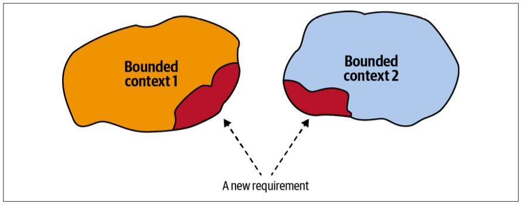
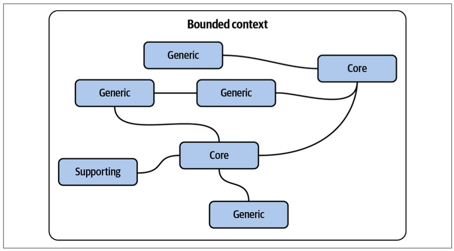
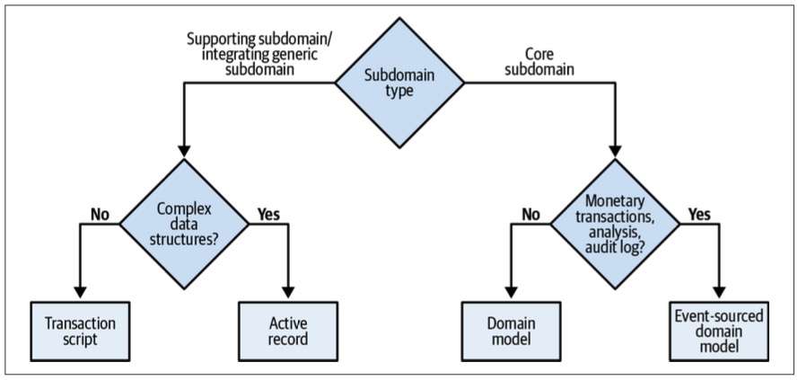
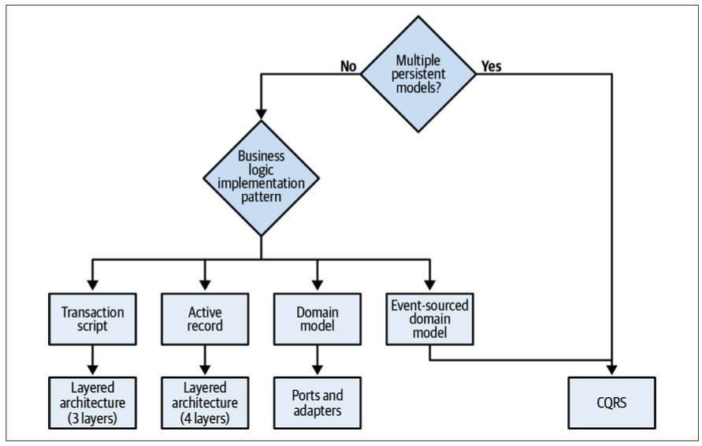
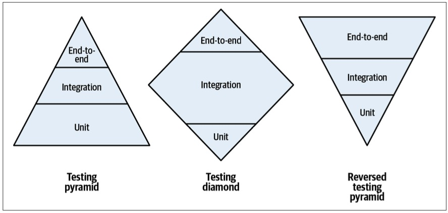
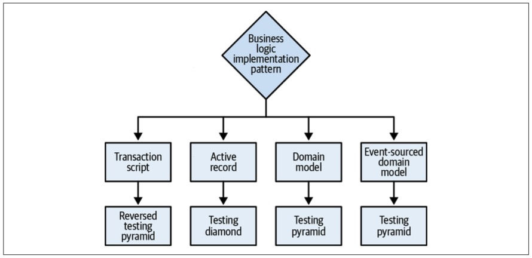
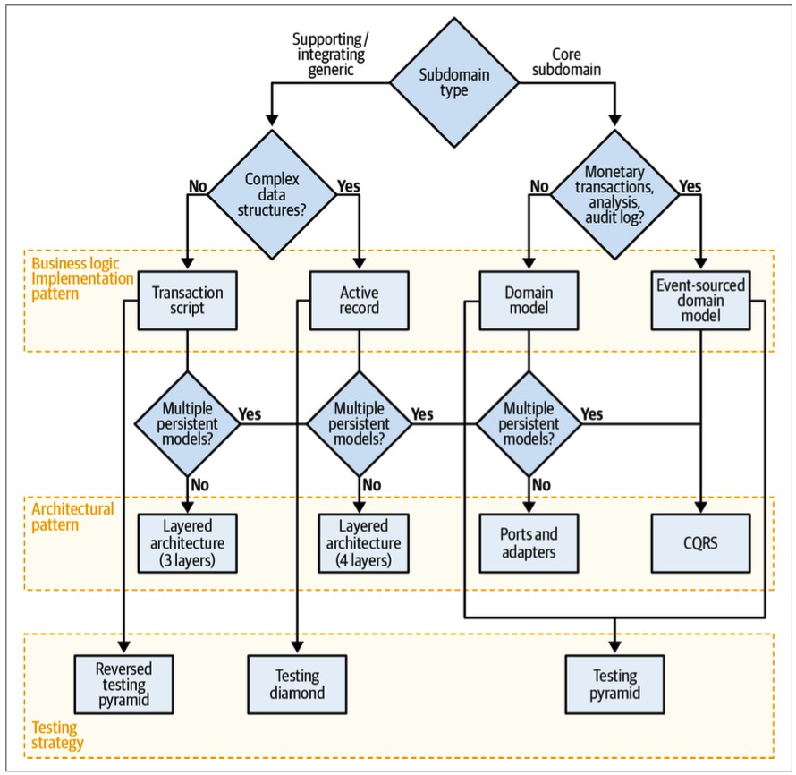

> Chapter 10. Design Heuristics
>
> 章节 9. 设计启发式

“It depends-那得看情况” is the correct answer to almost any question in software engineering, but not really practical.

> “视情况而定”是软件工程中几乎所有问题的正确答案，但并不实际。

In this chapter, we will explore what “it” depends on.

> 在本章中，我们将探讨“它”依赖于什么。

---

In Part I of the book, you learned domain-driven design tools for analyzing business domains and making strategic design decisions.

> 在本书的第1部分中，您学习了用于分析业务领域和制定战略设计决策的领域驱动设计工具。

In Part II, we explored tactical design patterns: the different ways to implement business logic, organize system architecture, and establish communication between a system’s components.

> 在第2部分中，我们探讨了战术设计模式：实现业务逻辑、组织系统架构和在系统组件之间建立通信的不同方法。

This chapter bridges-衔接 Parts I and II.

> 本章是第一部分和第二部分的衔接。

You will learn heuristics for applying analysis tools to drive various software design decisions: that is, (business) domain-driven (software) design.

> 您将学习应用分析工具来驱动各种软件设计决策的启发式方法：即(业务)领域驱动的(软件)设计。

---

But first, since this chapter is about design heuristics, let’s start by defining the term *heuristic*.

> 但首先，由于这一章是关于设计启发式的，让我们从定义术语“启发式”开始。

# Heuristic

> 启发式

A heuristic is not a hard rule that is guaranteed and mathematically-算术地,数学上地 proven to be correct in 100% of cases.

> 启发式并不是一个严格的规则，在数学上被证明在100%的情况下是正确的。

Rather, it’s a rule of thumb: not guaranteed to be perfect, yet sufficient-足够的,充足的 for one’s immediate-目前的 goals.

> 相反，这是一条经验法则：不能保证完美，但足以实现眼前的目标。

In other words, using heuristics is an effective problem-solving approach that ignores the noise inherent in many cues, focusing instead on the “swamping forces” reflected in the most important cues.

> 换句话说，使用启发式是一种有效的解决问题的方法，它忽略了许多线索中固有的噪音，而是专注于反映在最重要线索中的“淹没力”。

---

The heuristics presented in this chapter focus on the essential-基本的 properties of the different business domains and on the essence-本质,要素 of the problems addressed by the various design decisions.

> 本章中介绍的启发式方法侧重于不同业务领域的基本属性以及各种设计决策所解决的问题的本质。

# Bounded Contexts

> 限界上下文

As you’ll recall from Chapter 3, both wide and narrow boundaries could fit the definition of a valid bounded context encompassing-包含,包括 a consistent-一致的 ubiquitous language.

> 正如您在第3章中所回忆的那样，**宽边界和窄边界都可以适合包含一致的通用语言的有效有界上下文的定义。**

But still, what is the optimal size of a bounded context?

> 但是，有界上下文的最优大小是多少?

This question is especially important **in light of**-考虑到 the frequent equation-等式,方程 of bounded contexts with microservices.

> 考虑到有界上下文与微服务之间的频繁等式，这个问题尤为重要。

---

Should we always strive-努力,力争 for the smallest possible bounded contexts?

> 我们是否应该一直追求尽可能小的有界上下文?

As my friend Nick Tune says:

There are many useful and revealing heuristics for defining the boundaries of a service.

> 对于定义服务的边界，有许多有用的启发式方法。

Size is one of the least useful.

> 大小是最没用的因素之一。

---

Rather than making the model a function of the desired size—optimizing for small bounded contexts—it’s much more effective to do the opposite: treat the bounded context’s size as a function of the model it encompasses.

> **与其使模型成为所需大小的函数(针对小型有界上下文进行优化)，不如相反的方法更有效：将有界上下文的大小视为它所包含的模型的函数。**

---

Software changes affecting multiple bounded contexts are expensive and require lots of coordination, especially if the affected bounded contexts are implemented by different teams.

> 影响多个有界上下文的软件更改是昂贵的，并且需要大量的协调，特别是当受影响的有界上下文由不同的团队实现时。

Such changes that are not encapsulated in a single bounded context signal-表示,表明 ineffective design of the contexts’ boundaries. 

> 这种没有封装在单一有界上下文中的更改表明上下文边界的设计无效。

Unfortunately, refactoring bounded context boundaries is an expensive undertaking, and in many cases, the ineffective boundaries remain unattended and end up accumulating-积累,积攒 technical debt (see Figure 10-1).

> 不幸的是，重构有界的上下文边界是一项昂贵的工作，并且在许多情况下，无效的边界仍然无人关注，最终会积累技术债务(参见图10-1)。

*Figure 10-1. A change* *affecting* *multiple bounded contexts*

---

Changes that invalidate the bounded contexts’ boundaries typically occur when the business domain is not well known or the business requirements change frequently.

> 使有界上下文边界无效的更改通常发生在业务域不为人所知或业务需求频繁更改时。

As you learned in Chapter 1, both volatility-波动性 and uncertainty are the properties of core subdomains, especially at the early stages of implementation.

> 正如你在第1章学到的，波动性和不确定性都是核心子域的属性，尤其是在实现的早期阶段。

We can use it as a heuristic for designing bounded context boundaries.

> 我们可以用它作为设计有界上下文边界的启发式方法。

---

Broad bounded context boundaries, or those that encompass multiple subdomains, make it safer to be wrong about the boundaries or the models of the included subdomains.

> 广泛的有界上下文边界，或者那些包含多个子域的上下文边界，使得对包含子域的边界或模型的错误判断更加安全。

Refactoring logical boundaries is considerably less expensive than refactoring physical boundaries.

> 重构逻辑边界比重构物理边界要便宜得多。

Hence, when designing bounded contexts, start with wider boundaries.

> 因此，**在设计有界上下文时，从更宽的边界开始。**

If required, decompose the wide boundaries into smaller ones as you gain domain knowledge.

> 如果需要，随着您获得领域知识，将宽边界分解为较小的边界。

---

This heuristic applies mainly to bounded contexts encompassing core subdomains, as both generic and supporting subdomains are more formularized-使公式化 and much less volatile.

> 这种启发式方法主要适用于包含核心子域的有界上下文，因为通用子域和支持子域都更加公式化，而且波动性更小。

When creating a bounded context that contains a core subdomain, you can protect yourself against unforeseen changes by including other subdomains that the core subdomain interacts with most often.

> 在创建包含核心子域的有界上下文时，可以通过包含与核心子域交互最频繁的其他子域来保护自己免受不可预见的更改。

This can be other core subdomains, or even supporting and generic subdomains, as shown in Figure 10-2.

> 可以是其他核心子域，也可以是支持子域和通用子域，如图10-2所示。

*Figure 10-2. Wide bounded context boundaries*

# Business Logic Implementation Patterns

> 业务逻辑实现模式

In Chapters 5–7, where we discussed business logic in detail, you learned four different ways to model business logic: the transaction script, active record, domain model, and event-sourced domain model patterns.

> 在我们详细讨论业务逻辑的第5-7章中，您学习了四种不同的业务逻辑建模方法：事务脚本、活动记录、域模型和事件源域模型模式。

---

Both the transaction script and active record patterns are better suited for subdomains with simple business logic: supporting subdomains or integrating a third-party solution for a generic subdomain, for example.

> 事务脚本和活动记录模式都更适合具有简单业务逻辑的子域：例如，支持子域或为通用子域集成第三方解决方案。

The difference between the two patterns is the complexity of the data structures.

> 这两种模式的区别在于数据结构的复杂性。

The transaction script pattern can be used for simple data structures, while the active record pattern helps to encapsulate the mapping of complex data structures to the underlying database.

> 事务脚本模式可用于简单的数据结构，而活动记录模式有助于将复杂数据结构的映射封装到底层数据库。

---

The domain model and its variant-变种,变形, the event-sourced domain model, lend-给予,提供 themselves to subdomains that have complex business logic: core subdomains.

> 领域模型及其变体事件源域模型适用于具有复杂业务逻辑的子域：核心子域。

Core subdomains that deal with monetary-货币的 transactions, are obligated-必需的 by law to provide an audit log, or require deep analytics of the system’s behavior are better addressed by the event-sourced domain model.

> 处理货币交易的核心子域，法律规定必须提供审计日志，或者需要对系统行为进行深入分析，这些核心子域可以通过事件源域模型更好地解决。

---

With all of this in mind, an effective heuristic for choosing the appropriate business logic implementation pattern is to ask the following questions:

> 考虑到所有这些，选择合适的业务逻辑实现模式的有效启发式方法是问以下问题：

- Does the subdomain track money or other monetary transactions or have to provide a consistent audit log, or is deep analysis of its behavior required by the business?

  > 子域是否跟踪金钱或其他货币交易，或者必须提供一致的审计日志，或者业务是否需要对其行为进行深入分析?

  If so, use the event-sourced domain model.

  > 如果是，请使用事件源域模型。

  Otherwise...

  > 否则，不然

- Is the subdomain’s business logic complex?

  > 子域的业务逻辑复杂吗?

  If so, implement a domain model.

  > 如果是，实现一个领域模型。

  Otherwise...

- Does the subdomain include complex data structures?

  > 子域是否包含复杂的数据结构?

  If so, use the active record pattern.

  > 如果是，请使用活动记录模式。

  Otherwise...

- Implement a transaction script.

  > 实现一个事务脚本。

---

Since there is a strong relationship between a subdomain’s complexity and its type, we can visualize the heuristics using a domain-driven decision tree, as shown in Figure 10-3.

> 由于子领域的复杂性和类型之间有很强的关系，我们可以使用一个领域驱动的决策树来可视化启发式，如图10-3所示。

*Figure 10-3. Decision tree for business logic implementation pattern*

---

We can use another heuristic to define the difference between complex and simple business logic.

> 我们可以使用另一种启发式方法来定义复杂和简单业务逻辑之间的区别。

The line between these two types of business logic is not terribly-很,非常 sharp-鲜明的, but it’s useful.

> 这两种类型的业务逻辑之间的界限不是很明显，但它很有用。

In general, complex business logic includes complicated business rules, invariants-不变量, and algorithms.

> 一般来说，复杂的业务逻辑包括复杂的业务规则、不变量和算法。

A simple approach mainly **revolves around**-以…为中心 validating the inputs.

> 一种简单的方法主要围绕验证输入展开。

Another heuristic for evaluating complexity concerns the complexity of the ubiquitous language itself.

> 评估复杂性的另一个启发式方法与通用语言本身的复杂性有关。

Is it mainly describing CRUD operations, or is it describing more complicated business processes and rules?

> 它主要描述CRUD操作，还是描述更复杂的业务流程和规则？

---

Deciding on the business logic implementation pattern according to the complexity of the business logic and its data structures is a way to validate your assumptions about the subdomain type.

> 根据业务逻辑和数据结构的复杂性来决定业务逻辑实现模式是验证关于子域类型的假设的一种方法。

Suppose you consider it to be a core subdomain, but the best pattern is active record or transaction script.

> 假设您认为它是一个核心子域，但是最好的模式是活动记录或事务脚本。

Or suppose what you believe is a supporting subdomain requires a domain model or an event-sourced domain model; in this case, it’s an excellent opportunity to revisit your assumptions about the subdomain and business domain in general.

> 或者假设你认为支持子域需要一个域模型或事件源域模型；在这种情况下，这是一个很好的机会来重新审视您对子域和业务域的假设。

Remember, a core subdomain’s competitive advantage is not necessarily technical.

> 记住，核心子域的竞争优势不一定是技术上的。

# Architectural Patterns

> 架构模式

In Chapter 8, you learned about the three architectural patterns: layered architecture, ports & adapters, and CQRS.

> 在第8章中，你学习了三种架构模式：分层架构，端口和适配器，以及CQRS。

---

Knowing the intended business logic implementation pattern makes choosing an architectural pattern straightforward-简单的,易懂的:

> 了解预期的业务逻辑实现模式可以使选择架构模式变得简单：

- The event-sourced domain model requires CQRS.

  > 事件源域模型需要CQRS。

  Otherwise, the system will be extremely limited in its data querying options, fetching a single instance by its ID only.

  > 否则，系统的数据查询选项将受到极大限制，只能通过ID获取单个实例。

- The domain model requires the ports & adapters architecture.

  > 领域模型需要端口和适配器体系结构。

  Otherwise, the layered architecture makes it hard to make aggregates and value objects ignorant of persistence.

  > 否则，分层体系结构就很难使聚合和值对象忽略持久性。

- The Active record pattern is best accompanied by a layered architecture with the additional application (service) layer.

  > 活动记录模式最好与带有附加应用程序(服务)层的分层体系结构一起使用。

  This is for the logic controlling the active records.

  > 这是用于控制活动记录的逻辑。

- The transaction script pattern can be implemented with a minimal layered architecture, consisting of only three layers.

  > 事务脚本模式可以用最小的分层体系结构实现，该体系结构仅由三层组成。

---

The only exception-例外,除外 to the preceding heuristics is the CQRS pattern.

> 上述启发式的唯一例外是CQRS模式。

CQRS can be beneficial not only for the event-sourced domain model, but also for any other pattern if the subdomain requires representing its data in multiple persistent models.

> CQRS不仅对事件源域模型有用，而且对任何其他模式也有用，如果子域需要在多个持久模型中表示其数据。

---

Figure 10-4 shows a decision tree for choosing an architectural pattern based on these heuristics.

> 图10-4 显示了基于这些启发式方法选择架构模式的决策树。

*Figure 10-4. Architectural pattern decision tree*

# Testing Strategy

> 测试策略

The knowledge of both the business logic implementation pattern and the architectural pattern can be used as a heuristic for choosing a testing strategy for the codebase.

> 业务逻辑实现模式和体系结构模式的知识可以用作为代码库选择测试策略的启发式方法。

Take a look at the three testing strategies shown in Figure 10-5.

> 请看图10-5所示的三种测试策略。

*Figure 10-5. Testing strategies*

The difference between the testing strategies in the figure is their emphasis on the different types of tests: unit, integration, and end-to-end.

> 图中测试策略之间的区别在于它们强调不同类型的测试：单元测试、集成测试和端到端测试。

Let’s analyze each strategy and the context in which each pattern should be used.

> 让我们分析每种策略以及每种模式应该使用的上下文。

## Testing Pyramid-金字塔

> 测试金字塔

The classic-典型的 testing pyramid emphasizes unit tests, fewer integration tests, and even fewer end-to-end tests.

> 经典的测试金字塔强调单元测试，更少的集成测试，甚至更少的端到端测试。

Both variants-变体,变种 of the domain model patterns are best addressed with the testing pyramid.

> 领域模型模式的两种变体最好使用测试金字塔来处理。

Aggregates and value objects make perfect units for effectively testing the business logic.

> 聚合和值对象是有效测试业务逻辑的完美单元。

## Testing Diamond

> 测试钻石

The testing diamond focuses the most on integration tests.

> 测试菱形最关注集成测试。

When the active record pattern is used, the system’s business logic is, by definition, spread across both the service and business logic layers.

> 当使用活动记录模式时，根据定义，系统的业务逻辑分布在服务层和业务逻辑层之间。

Therefore, to focus on integrating the two layers, the testing pyramid is the more effective choice.

> 因此，要注重两层的整合，测试金字塔是更有效的选择。

## Reversed Testing Pyramid

> 反向测试金字塔

The reversed testing pyramid attributes the most attention to end-to-end tests: verifying the application’s workflow from beginning to end.

> 反向测试金字塔将大部分注意力集中在端到端测试上：从头到尾验证应用程序的工作流。

Such an approach best fits codebases implementing the transaction script pattern: the business logic is simple and the number of layers is minimal, making it more effective to verify the end-to-end flow of the system.

> 这种方法最适合实现事务脚本模式的代码库：业务逻辑简单，层数最少，从而更有效地验证系统的端到端流。

---

Figure 10-6 shows the testing strategy decision tree.

*Figure 10-6. Testing strategy decision tree*

# Tactical Design Decision Tree

> 战术设计决策树

The business logic patterns, architectural patterns, and testing strategy heuristics can be unified and summarized with a tactical design decision tree, as depicted in Figure 10-7.

> 业务逻辑模式、体系结构模式和测试策略启发式可以用战术设计决策树进行统一和总结，如图10-7所示。

*Figure 10-7. Tactical design decision tree*

---

As you can see, identifying subdomains types and following the decision tree gives you a solid-结实的,牢固的 starting point for making the essential design decisions.

> 正如您所看到的，识别子域类型并遵循决策树为您提供了制定基本设计决策的坚实起点。

That said, it’s important to reiterate-重申,反复说 that these are heuristics, not hard rules.

> 也就是说，需要重申的是，这些都是启发法，而不是硬性规则。

There is an exception-例外,除外 to every rule, let alone heuristics, that by definition are not intended to be correct in 100% of the cases.

> 每个规则都有例外，更不用说启发式了，根据定义，这些规则并不是100%正确的。

---

The decision tree is based on my preference to use the simple tools, and resort to the advanced patterns—domain model, event-sourced domain model, CQRS, and so on—only when absolutely necessary.

> 决策树是基于我对使用简单工具的偏好，并且只在绝对必要时才使用高级模式——域模型、事件源域模型、CQRS等等。

On the other hand, I’ve met teams that have a lot of experience implementing the event-sourced domain model and therefore use it for all their subdomains.

> 另一方面，我遇到过一些团队，他们在实现事件源领域模型方面有很多经验，因此他们将其用于所有子领域。

For them it’s simpler than using different patterns.

> 对他们来说，这比使用不同的模式要简单得多。

Can I recommend this approach to everyone? Of course not.

> 我可以向大家推荐这种方法吗？当然不是。

In the companies I have worked for or consulted, the heuristics-based approach was more efficient than using the same solution for every problem.

> 在我工作过或咨询过的公司中，基于启发式的方法比对每个问题使用相同的解决方案更有效。

---

At the end of the day, it depends on your specific context.

> 在一天结束的时候，这取决于你的具体情况。

Use the decision tree illustrated in Figure 10-7, and the design heuristics it is based on, as guiding principles, but not as a replacement for critical-批判的 thinking.

> 使用图10-7所示的决策树，以及它所基于的设计启发式，作为指导原则，但不能替代批判性思维。

If you find that alternative heuristics fit you better, feel free to alter the guiding principles or build your own decision tree altogether-完全地,总之.

> 如果您发现其他启发式方法更适合您，请随意更改指导原则或完全构建自己的决策树。

# Conclusion

> 总结

This chapter connected Parts I and II of the book to a heuristic-based decision framework.

> 本章将本书的第一部分和第二部分与基于启发式的决策框架联系起来。

You learned how to apply the knowledge of the business domain and its subdomains to drive technical decisions: choosing safe bounded context boundaries, modeling the application’s business logic, and determining the architectural pattern needed to orchestrate the interactions of each bounded context’s internal components.

> 您了解了如何应用业务域及其子域的知识来驱动技术决策：选择安全的有界上下文边界、对应用程序的业务逻辑进行建模，以及确定编排每个有界上下文内部组件的交互所需的体系结构模式。

Finally, we took a detour-绕行,迂回 into a different topic that is often a subject of passionate arguments—what kind of test is more important—and used the same framework to prioritize the different tests according to the business domain.

> 最后，我们绕了一个不同的话题，这个话题经常引起激烈的争论——哪种测试更重要——并使用相同的框架根据业务领域对不同的测试进行优先级排序。

---

Making design decisions is important, but even more so is to verify the decisions’ validity over time.

> 制定设计决策很重要，但更重要的是随着时间的推移验证决策的有效性。

In the next chapter, we will shift our discussion to the next phase of the software design lifecycle: the evolution of design decisions.

> 在下一章中，我们将讨论软件设计生命周期的下一个阶段：设计决策的演变。

