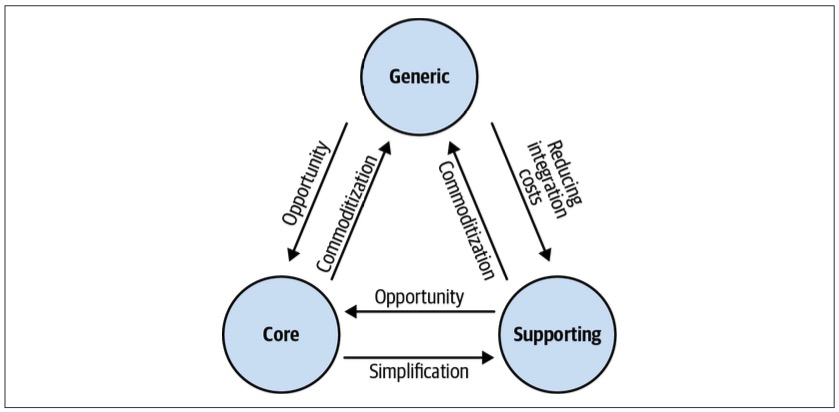
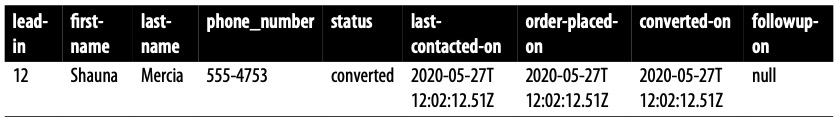
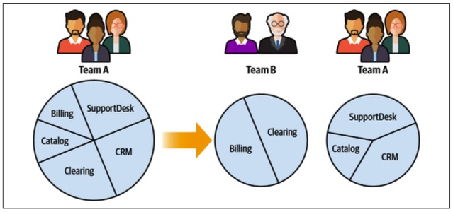
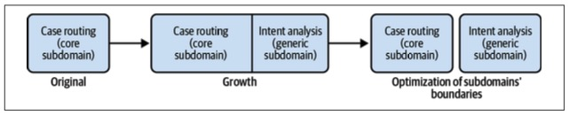

> Chapter 11. Evolving Design Decisions
>
> 章节 11. 逐步发展的设计决策

In the modern, fast-paced world we inhabit-居住于,栖居在, companies cannot afford to be lethargic-无精打采的.

> 在我们生活的这个快节奏的现代世界里，企业不能坐视不管。

To keep up with the competition, they have to continually change, evolve, and even reinvent-重新创造 themselves over time.

> 为了跟上竞争，他们必须不断地改变、发展，甚至随着时间的推移重塑自己。

We cannot ignore this fact when designing systems, especially if we intend to design software that’s well adapted to the requirements of its business domain.

> 在设计系统时，我们不能忽视这个事实，特别是当我们打算设计能够很好地适应其业务领域需求的软件时。

When changes are not managed properly, even the most sophisticated-更复杂先进 and thoughtful-考虑周到的 design will eventually become a nightmare-噩梦 to maintain and evolve.

> 如果更改管理不当，即使是最复杂和最周到的设计最终也会成为维护和发展的噩梦。

This chapter discusses how changes in a software project’s environment can affect design decisions and how to evolve the design accordingly-相应地,因此,所以.

> 本章讨论软件项目环境的变化如何影响设计决策，以及如何相应地发展设计。

We will examine the four most common vectors of change: business domain, organizational structure, domain knowledge, and growth.

> 我们将研究四个最常见的变化向量：业务领域、组织结构、领域知识和增长。

# Changes in Domains

In Chapter 2, you’ve learned the three types of business subdomains and how they are different from one another:

> 在第二章中，你已经学习了三种类型的业务子域，以及它们彼此之间的区别:

*Core*

Activities the company is performing differently from its competitors to gain a competitive advantage

*Supporting*

Things the company is doing differently from its competitors, but that do not provide a competitive edge

> 公司做的事情与竞争对手不同，但这并不能提供竞争优势

*Generic*

Things all companies do in the same way

---

In the previous chapters, you saw that the type of subdomain at play affects strategic and tactical design decisions:

- How to design the bounded contexts’ boundaries

  > 如何设计有界上下文的边界

- How to orchestrate integration between the contexts

  > 如何编排上下文之间的集成

- Which design patterns to use to accommodate-适应 the complexity of the business logic

  > 使用哪种设计模式来适应业务逻辑的复杂性

To design software that is driven by the business domain’s needs, it’s crucial to identify the business subdomains and their types. 

> 要设计由业务领域需求驱动的软件，确定业务子领域及其类型是至关重要的。

However, that’s not the whole story.

> 然而，这并不是故事的全部。

It’s equally important to be alert-警惕 to the evolution of the subdomains.

> 对子域的演变保持警惕同样重要。

As an organization grows and evolves, it’s not unusual-不寻常的,罕见的 for some of its subdomains to morph-改变,变化 from one type to another.

> 随着组织的成长和发展，它的一些子域从一种类型转变为另一种类型并不罕见。

Let’s look at some examples of such changes.

## Core to Generic

> 核心到通用

Imagine that an online retail company called BuyIT has been implementing its own order delivery solution.

> 假设一家名为 BuyIT 的在线零售公司一直在实现自己的订单交付解决方案。

It developed an innovative-革新的,新颖的 algorithm to optimize its couriers’-快递员 delivery routes and thus is able to charge lower delivery fees than its competitors.

> 它开发了一种创新的算法来优化其快递员的配送路线，因此能够收取比竞争对手更低的配送费用。

---

One day, another company—DeliverIT—disrupts the delivery industry.

> 有一天，另一家公司——快递公司——颠覆了快递行业。

It claims-声称,断言 it has solved the “traveling salesman” problem and provides path optimization as a service.

> 它声称已经解决了“旅行推销员”问题，并提供路径优化服务。

Not only is DeliverIT’s optimization more advanced, it is offered at a fraction-小部分 of the price that it costs BuyIT to perform the same task.

> 不仅因为 DeliverIT 的优化更先进，而且它的价格只是 BuyIT 执行相同任务的一小部分。

---

From BuyIT’s perspective, once DeliverIT’s solution became available as an off-the- shelf-现成的,常备的 product, its core subdomain turned into a generic subdomain.

> 从 BuyIT 的角度来看，一旦 DeliverIT 的解决方案成为现成的产品，它的核心子域就变成了通用子域。

As a result, the optimal solution became available to all of BuyIT’s competitors.

> 因此，BuyIT 的所有竞争对手都可以使用最佳解决方案。

Without massive-大量的,大规模的 investments in research and development, BuyIT can no longer gain a competitive advantage in the path optimization subdomain.

> 如果没有大量的研发投资，BuyIT 就无法在路径优化子领域获得竞争优势。

What was previously considered a competitive advantage for BuyIT has become a commodity-商品 available to all of its competitors.

> 以前被认为是 BuyIT 的竞争优势，现在已经成为所有竞争对手都可以获得的商品。

## Generic to Core

> 通用到核心

Since its inception-开端,创始, BuyIT has been using an off-the-shelf solution to manage its inventory-库存.

> 自成立以来，BuyIT 一直使用现成的解决方案来管理其库存。

However, its business intelligence-智能,情报 reports are continuously showing inadequate-不充分的,不足的 predictions-预测 of its customers’ demands.

> 然而，其商业智能报告不断显示出对客户需求的预测不足。

Consequently-因此,结果, BuyIT fails to replenish-补充 its stock of the most popular products and is wasting-浪费 warehouse real estate on the unpopular products.

> 因此，BuyIT 未能补充其最受欢迎的产品的库存，而将仓库的房地产浪费在不受欢迎的产品上。

After evaluating a few alternative inventory management solutions, BuyIT’s management team makes the strategic decision to invest in designing and building an in-house system.

> 在评估了一些可供选择的库存管理解决方案后，BuyIT 的管理团队做出了投资设计和构建内部系统的战略决策。

This in-house solution will consider the intricacies-错综复杂 of the products BuyIT sells and make better predictions of customers’ demands.

> 这种内部解决方案将考虑 BuyIT 销售的产品的复杂性，并更好地预测客户需求。

## Generic to Supporting

> 通用到支撑

Finally, for the same reason as a core subdomain, a generic subdomain can turn into a supporting one.

Going back to the example of BuyIT’s document management system, assume the company has decided that the complexity of integrating the open source solution doesn’t justify-证明合法 the benefits and has resorted back to the in-house system.

> 回到 BuyIT 文档管理系统的例子，假设公司已经决定集成开源解决方案的复杂性不足以证明其好处，并且已经回到内部系统。

As a result, the generic subdomain has turned into a supporting subdomain.

> 因此，通用子域变成了支持子域。

The changes in subdomains we just discussed are demonstrated in Figure 11-1.

> 我们刚才讨论的子域的变化如图11-1所示。

*Figure 11-1. Subdomain type change factors*

# Strategic Design Concerns

> 战略设计关注点

A change in a subdomain’s type directly affects its bounded context and, consequently, corresponding-相应的,相关的 strategic design decisions. 

> 子域类型的更改直接影响到它的有界上下文，从而影响到相应的策略设计决策。

As you learned in Chapter 4, different bounded context integration patterns accommodate-适应 the different subdomain types.

> 正如您在第4章中所了解的，不同的有界上下文集成模式适应不同的子域类型。

The core subdomains have to protect their models by using anticorruption layers and have to protect consumers from frequent changes in the implementation models by using published languages (OHS).

> 核心子域必须通过使用反腐败层来保护它们的模型，并且必须通过使用已发布的语言(OHS)来保护消费者免受实现模型频繁变化的影响。

---

Another integration pattern that is affected by such changes is the separate ways pattern.

> 受此类更改影响的另一个集成模式是分离方式模式。

As you saw earlier, teams can use this pattern for supporting and generic subdomains.

> 正如您前面看到的，团队可以使用此模式来支持和通用子域。

If the subdomain morphs-改变,变化 into a core subdomain, duplicating-复制 its functionality by multiple teams is no longer acceptable.

> 如果子域变成了核心子域，那么由多个团队复制其功能是不可接受的。

Hence, the teams have no choice but to integrate their implementations.

> 因此，团队别无选择，只能集成他们的实现。

The customer–supplier relationship will make the most sense-意义 in this case, since the core subdomain will only be implemented by one team.

> 在这种情况下，客户-供应商关系将是最有意义的，因为核心子域将只由一个团队实现。

---

From an implementation strategy standpoint-立场,观点, core and supporting subdomains differ in how they can be implemented. 

> 从实现策略的角度来看，核心子域和支持子域的实现方式不同。

Supporting subdomains can be outsourced or used as “training wheels” for new hires-被雇用的人.

> 支持子域可以外包或用作新员工的“训练轮”。

Core subdomains must be implemented in-house, as close as possible to the sources of domain knowledge.

> 核心子领域必须在内部实现，尽可能靠近领域知识的来源。

Therefore, when a supporting subdomain turns into a core subdomain, its implementation should be moved in-house.

> 因此，当支持子域变成核心子域时，应该将其实现移到内部。

The same logic works the other way around.

> 反过来也是一样的道理。

If a core subdomain turns into a supporting subdomain, it’s possible to outsource the implementation to let the in-house **R&D-研究与开发（research and development）** teams concentrate-聚集,集中 on the core subdomains.

> 如果一个核心子域变成了一个支持性的子域，可以将实现外包，让内部研发团队专注于核心子域。

# Tactical Design Concerns

> 战术设计关注点

The main indicator-标志,迹象 of a change in a subdomain’s type is the inability of the existing technical design to support current business needs.

> 子域类型变更的主要迹象是现有技术设计无法支持当前业务需求。

---

Let’s go back to the example of a supporting subdomain becoming a core subdomain.

Supporting subdomains are implemented with relatively-相当地,相对地 simple design patterns for modeling the business logic: namely, the transaction script or active record pattern.

> 支持子域是用相对简单的设计模式实现的，用于对业务逻辑建模：即事务脚本或活动记录模式。

As you saw in Chapter 5, these patterns are not a good fit for business logic involving complex rules and invariants.

> 正如您在第5章中看到的，这些模式并不适合涉及复杂规则和不变量的业务逻辑。

---

If complicated-复杂的,难处理的 rules and invariants are added to the business logic over time, the codebase will become increasingly complex as well.

> 如果随着时间的推移将复杂的规则和不变量添加到业务逻辑中，那么代码库也会变得越来越复杂。

It will be painful-困难的,痛苦的 to add the new functionality, as the design won’t support the new level of complexity.

> 添加新功能将是痛苦的，因为设计将不支持新的复杂性级别。

This “pain” is an important signal.

Use it as a call to reassess-再考虑,再评价 the business domain and design choices.

> 将其用作重新评估业务领域和设计选择的调用。

---

The need for change in the implementation strategy is nothing to fear-担心,忧虑.

> 无需担心需要改变实施战略。

It’s normal.

> 这是正常的。

We cannot foresee how a business will evolve down the road.

> 我们无法预见一项业务将如何发展。

We also cannot apply the most elaborate-复杂的,详尽的 design patterns for all types of subdomains; that would be wasteful and ineffective.

> 我们也不能将最精细的设计模式应用于所有类型的子域；那将是浪费和无效的。

We have to choose the most appropriate design and evolve it when needed.

> 我们必须选择最合适的设计，并在需要时对其进行改进。

---

If the decision for how to model the business logic is made consciously-有意识地,清楚地, and you are aware of all the possible design choices and the differences between them, migrating-迁移 from one design pattern to another is not that troublesome-麻烦.

> 如果有意识地决定如何对业务逻辑建模，并且您知道所有可能的设计选择以及它们之间的差异，那么从一种设计模式迁移到另一种设计模式并不那么麻烦。

The following subsections highlight a few examples.

> 下面的小节将重点介绍几个示例。

## Transaction Script to Active Record

> 事务脚本到活动记录

At their core, both the transaction script and active record patterns are based on the same principle: the business logic is implemented as a procedural-程序上的,过程上的 script.

> 在其核心，事务脚本和活动记录模式都基于相同的原则：业务逻辑作为过程脚本实现。

The difference between them is how the data structures are modeled: the active record pattern introduces-引入 the data structures to encapsulate the complexity of mapping them to the storage mechanism.

> 它们之间的区别在于数据结构的建模方式：活动记录模式引入了数据结构，以封装将它们映射到存储机制的复杂性。

---

**As a result**-因此, when working with data becomes challenging in a transaction script, refactor it into the active record pattern.

> 因此，当在事务脚本中处理数据变得具有挑战性时，请将其重构为活动记录模式。

Look for complicated data structures and encapsulate them in active record objects.

> 寻找复杂的数据结构并将它们封装在活动记录对象中。

Instead of accessing the database directly, use active records to abstract its model and structure.

> 而不是直接访问数据库，使用活动记录抽象其模型和结构。

## Active Record to Domain Model

> 活动记录到领域模型

If the business logic that manipulates active records becomes complex and you notice more and more cases of inconsistencies and duplications, refactor the implementation to the domain model pattern.

> 如果操作活动记录的业务逻辑变得复杂，并且您注意到越来越多的不一致和重复的情况，请将实现重构为域模型模式。

---

Start by identifying value objects.

> 从识别值对象开始。

What data structures can be modeled as immutable-不可改变的 objects?

> 哪些数据结构可以建模为不可变对象?

**Look for**-寻找 the related business logic, and make it a part of the value objects as well.

> 寻找相关的业务逻辑，并使其也成为值对象的一部分。

---

Next, analyze the data structures and look for transactional boundaries.

> 接下来，分析数据结构并查找事务边界。

To ensure that all state-modifying logic is explicit, make all of the active records’ setters private so that they can only be modified from inside the active record itself.

> 要确保所有状态修改逻辑都是显式的，请将所有活动记录的设置器设置为私有，以便只能从活动记录本身内部修改它们。

Obviously, expect the compilation to fail; however, the compilation errors will make it clear where the state-modifying logic resides-驻留,居留.

> 显然，编译会失败；然而，编译错误将使状态修改逻辑驻留的位置变得清晰。

Refactor it into the active record’s boundaries.

> 将其重构为活动记录的边界。

For example:

~~~java
public class Player {
  public Guid Id { get; set; }
  public int Points { get; set; } 
}

public class ApplyBonus {
  //...
  public void Execute(Guid playerId, byte percentage) {
    var player = _repository.Load(playerId); 
    player.Points *= 1 + percentage/100.0; 
    _repository.Save(player);
  } 
}
~~~

In the following code, you can see the first steps toward the transformation-变化,转换.

> 在下面的代码中，您可以看到进行转换的第一步。

The code won’t compile-编译 yet, but the errors will make it explicit where external components are controlling the object’s state:

> 代码还不能编译，但是错误会使外部组件控制对象状态的地方变得明确：

~~~java
public class Player {
  public Guid Id { get; private set; }
  public int Points { get; private set; } 
}

public class ApplyBonus {
	//...
  public void Execute(Guid playerId, byte percentage) {
    var player = _repository.Load(playerId); 
    player.Points *= 1 + percentage/100.0; 
    _repository.Save(player);
  } 
}
~~~

In the next iteration, we can move that logic inside the active record’s boundary:

> 在下一次迭代中，我们可以将该逻辑移动到活动记录的边界内：

~~~java
public class Player {
  public Guid Id { get; private set; } 
  public int Points { get; private set; }
  
  public void ApplyBonus(int percentage) {
    this.Points *= 1 + percentage/100.0; 
  }
}
~~~

When all the state-modifying business logic is moved inside the boundaries of the corresponding objects, examine what hierarchies-阶层,层级 are needed to ensure strongly consistent checking of business rules and invariants.

> 当所有状态修改业务逻辑都移动到相应对象的边界内时，检查需要哪些层次结构来确保对业务规则和不变量的强一致性检查。

Those are good candidates for aggregates.

> 这些都是聚合的好选择。

Keeping in mind the aggregate design principles we discussed in Chapter 6, look for the smallest transaction boundaries, that is, the smallest amount of data that you need to keep strongly consistent.

> 记住我们在第6章中讨论的聚合设计原则，寻找最小的事务边界，也就是说，您需要保持强一致性的最小数据量。

Decompose the hierarchies along those boundaries.

> 沿着这些边界分解层次结构。

Make sure the external aggregates are only referenced by their IDs.

> 确保外部聚合仅由其 IDs 引用。

---

Finally, for each aggregate, identify its root, or the entry point for its public interface.

> 最后，对于每个聚合，确定其根，或其公共接口的入口点。

Make the methods of all the other internal objects in the aggregate private and only callable from within the aggregate.

> 将聚合中所有其他内部对象的方法设置为私有，并且只能从聚合内部调用。

## Domain Model to Event-Sourced Domain Model

> 域模型转换为事件源领域模型

Once you have a domain model with properly designed aggregate boundaries, you can transition it to the event-sourced model. 

> 一旦您拥有了具有适当设计的聚合边界的域模型，您就可以将其转换为事件源模型。

Instead of modifying the aggregate’s data directly, model the domain events needed to represent the aggregate’s lifecycle.

> 不是直接修改聚合的数据，而是对表示聚合生命周期所需的领域事件进行建模。

---

The most challenging aspect of refactoring a domain model into an event-sourced domain model is the history of the existing aggregates: migrating the “timeless-永恒的,不受时间影响的” state into the event-based model.

> 将领域模型重构为事件源域模型的最具挑战性的方面是现有聚合的历史：将“永恒”状态迁移到基于事件的模型中。

Since the fine-grained data representing all the past state changes is not there, you have to either generate past events on a best-effort basis or model migration-迁移 events.

> 由于表示所有过去状态更改的细粒度数据不存在，因此您必须在尽力而为的基础上生成过去的事件，或者对迁移事件进行建模。

## Generating Past Transitions

> 生成过去的转换

This approach entails generating an approximate-近似的 stream of events for each aggregate so that the stream of events can be projected into the same state representation as in the original implementation.

> 这种方法需要为每个聚合生成一个近似的事件流，这样事件流就可以被投射到与原始实现相同的状态表示中。

Consider the example you saw in Chapter 7, as represented in Table 11-1.

*Table 11-1. A state-based representation of the aggregate’s data*

We can assume from the business logic perspective that the instance of the aggregate has been initialized; then the person has been contacted, an order has been placed, and finally, since the status was “converted,” the payment for the order has been confirmed.

> 我们可以从业务逻辑的角度假设聚合的实例已经初始化；然后联系此人，下订单，最后，由于状态已“转换”，订单的付款已得到确认。

The following set of events can represent all of these assumptions:

~~~json
{
    "lead-id": 12,
    "event-id": 0,
    "event-type": "lead-initialized",
    "first-name": "Shauna",
    "last-name": "Mercia",
    "phone-number": "555-4753"
},
{
    "lead-id": 12,
    "event-id": 1,
    "event-type": "contacted",
    "timestamp": "2020-05-27T12:02:12.51Z"
},
{
    "lead-id": 12,
    "event-id": 2,
    "event-type": "order-submitted",
    "payment-deadline": "2020-05-30T12:02:12.51Z",
    "timestamp": "2020-05-27T12:02:12.51Z"
},
{
    "lead-id": 12,
    "event-id": 3,
    "event-type": "payment-confirmed",
    "status": "converted",
    "timestamp": "2020-05-27T12:38:44.12Z"
}
~~~

When applied one by one, these events can be projected into the exact state representation as in the original system.

> 当一个接一个地应用时，这些事件可以像在原始系统中一样投射到精确的状态表示中。

The “recovered” events can be easily tested by projecting the state and comparing it to the original data.

> 通过预测状态并将其与原始数据进行比较，可以很容易地测试“恢复”的事件。

---

However, it’s important to keep in mind the disadvantage of this approach.

> 然而，重要的是要记住这种方法的缺点。

The goal of using event sourcing is to have a reliable, strongly consistent history of the aggregates’ domain events.

> 使用事件溯源的目标是获得聚合域事件的可靠的、高度一致的历史记录。

When this approach is used, it’s impossible to recover-恢复 the complete history of state transitions.

> 当使用这种方法时，不可能恢复状态转换的完整历史。

In the preceding example, we don’t know how many times the sales agent has contacted the person, and therefore, how many “contacted” events we have missed.

> 在前面的例子中，我们不知道销售代理联系了这个人多少次，因此也不知道我们错过了多少“联系”事件。

## Modeling Migration Events

> 建模迁移事件

The alternative approach is to acknowledge the lack of knowledge about past events and explicitly-直截了当地,明确地 model it as an event.

> 另一种方法是承认缺乏对过去事件的了解，并将其明确地建模为事件。

Instead of recovering the events that may have led to the current state, define a migration event and use it to initialize the event streams of existing aggregate instances:

> 不是恢复可能导致当前状态的事件，而是定义一个迁移事件并使用它来初始化现有聚合实例的事件流：

~~~json
{
    "lead-id": 12,
    "event-id": 0,
    "event-type": "migrated-from-legacy",
    "first-name": "Shauna",
    "last-name": "Mercia",
    "phone-number": "555-4753",
    "status": "converted",
    "last-contacted-on": "2020-05-27T12:02:12.51Z",
    "order-placed-on": "2020-05-27T12:02:12.51Z",
    "converted-on": "2020-05-27T12:38:44.12Z",
    "followup-on": null
}
~~~

The advantage of this approach is that it makes the lack of past data explicit.

> 这种方法的优点是，它使缺乏过去的数据明确。

At no stage can someone mistakenly assume that the event stream captures all of the domain events that happened during the aggregate instance’s lifecycle.

> 在任何阶段都不能错误地认为事件流捕获了聚合实例生命周期中发生的所有域事件。

The disadvantage is that the traces of the legacy-遗留问题 system will remain in the event store forever.

> 缺点是遗留系统的痕迹将永远保留在事件存储中。

For example, if you are using the CQRS pattern (and with the event-sourced domain model you most likely will), the projections-估算,预测 will always have to take into account the migration events.

> 例如，如果您正在使用CQRS模式(并且您很可能会使用事件源域模型)，那么预测将始终必须考虑迁移事件。

# Organizational Changes

> 组织的变化

Another type of change that can affect a system’s design is a change in the organization itself.

> 另一种能够影响系统设计的变更类型是组织本身的变更。

Chapter 4 looked at different patterns of integrating bounded contexts: partnership, shared kernel, conformist, anticorruption layer, open-host service, and separate-单独的,分离的 ways.

> 第4章研究了集成有界上下文的不同模式：伙伴关系、共享内核、一致性、反腐败层、开放主机服务和分离方式。

Changes in the organization’s structure can affect teams’ communication and collaboration levels and, as a result, the ways the bounded contexts should be integrated.

> 组织结构的变化可以影响团队的沟通和协作级别，因此，应该集成有限上下文的方式。

---

A trivial-平凡的,简单的 example of such change is growing development centers, as shown in Figure 11-2.

> 如图11-2所示，发展中心不断扩大就是一个简单的例子。

Since a bounded context can be implemented by only one team, adding new development teams can cause the existing wider bounded context boundaries to split into smaller ones so that each team can work on its own bounded context.

> 由于有界上下文只能由一个团队实现，添加新的开发团队可以将现有的更宽的有界上下文边界分割成更小的边界，以便每个团队可以在自己的有界上下文上工作。

*Figure 11-2. Splitting a wide bounded context to accommodate growing engineering teams*

Moreover, the organization’s development centers are often located in different geographical locations.

> 此外，组织的开发中心通常位于不同的地理位置。

When the work on the existing bounded contexts is shifted to another location, it may negatively impact the teams’ collaboration. 

> 当现有的有界上下文上的工作转移到另一个位置时，它可能会对团队的协作产生负面影响。

As a result, the bounded contexts’ integration patterns have to evolve accordingly, as described in the following scenarios.

> 因此，有界上下文的集成模式必须相应地发展，如下面的场景所述。

## Partnership to Customer–Supplier

> 伙伴关系到客户-供应商关系

The partnership pattern assumes there is strong communication and collaboration among teams.

> 伙伴关系模式假设团队之间有很强的沟通和协作。

As time goes by, that might cease-终止,结束 to be the case; for example, when work on one of the bounded contexts is moved to a distant-遥远的 development center.

> 随着时间的推移，这种情况可能不复存在；例如，当一个有界上下文的工作转移到远程开发中心时。

Such a change will negatively affect the teams’ communication, and it may make sense to move away from the partnership pattern toward a customer–supplier relationship.

> 这样的变化将对团队的沟通产生负面影响，从伙伴关系模式转向客户-供应商关系可能是有意义的。

## Customer–Supplier to Separate Ways

> 客户-供应商关系到独立方式

Unfortunately, it’s not uncommon for teams to have severe-极为恶劣的,严重的 communication problems.

> 不幸的是，团队出现严重的沟通问题并不罕见。

The issues might be caused by geographical distance or organizational politics-政治.

> 这些问题可能是由地理距离或组织政治引起的。

Such teams may experience more and more integration issues over time.

> 随着时间的推移，这样的团队可能会遇到越来越多的集成问题。

At some point, it may become more cost-effective to duplicate the functionality instead of continuously chasing-追逐,追赶 one another’s tails-尾巴.

> 在某种程度上，复制功能而不是不断地追逐彼此的尾巴可能会变得更具成本效益。

# Domain Knowledge

> 领域知识

As you’ll recall, the core tenet of domain-driven design is that domain knowledge is essential for designing a successful software system.

> 正如您所记得的，领域驱动设计的核心原则是领域知识对于设计成功的软件系统是必不可少的。

Acquiring-获得,得到 domain knowledge is one of the most challenging aspects of software engineering, especially for the core subdomains. 

> 获取领域知识是软件工程中最具挑战性的方面之一，特别是对于核心子领域。

A core subdomain’s logic is not only complicated, but also expected to change often.

> 核心子域的逻辑不仅复杂，而且可能经常变化。

Moreover, modeling is an ongoing process.

> 此外，建模是一个正在进行的过程。

Models have to improve-改进 as more knowledge of the business domain is acquired.

> 随着对业务领域的了解越来越多，模型必须得到改进。

---

Many times, the business domain’s complexity is implicit.

> 很多时候，业务领域的复杂性是隐式的。

Initially, everything seems simple and straightforward.

> 最初，一切似乎都简单明了。

The initial simplicity is often deceptive-欺骗性的,造成假象的 and it quickly morphs-改变,变化 into complexity.

> 最初的简单往往具有欺骗性，很快就会变得复杂。

As more functionality is added, more and more edge cases, invariants, and rules are discovered.

> 随着功能的增加，会发现越来越多的边缘情况、不变量和规则。

Such insights are often disruptive-破坏的,创新的, requiring rebuilding the model from the ground up, including the boundaries of the bounded contexts, aggregates, and other implementation details.

> 这样的见解通常是破坏性的，需要从头开始重建模型，包括有界上下文的边界、聚合和其他实现细节。

---

From a strategic design standpoint, it’s a useful heuristic-启发式的,探试的 to design the bounded contexts’ boundaries according to the level of domain knowledge.

> 从战略设计的角度来看，根据领域知识水平来设计有界上下文的边界是一种有用的启发式方法。

The cost of decomposing-分解 a system into bounded contexts that, over time, turn out to be incorrect-错误的 can be high.

> 将系统分解成有限的上下文的成本可能很高，随着时间的推移，这些上下文最终会被证明是不正确的。

Therefore, when the domain logic is unclear and changes often, it makes sense to design the bounded contexts with broader boundaries.

> 因此，当领域逻辑不清晰且经常变化时，设计具有更宽边界的有界上下文是有意义的。

Then, as domain knowledge is discovered over time and changes to the business logic stabilize-稳定,稳固, those broad bounded contexts can be decomposed into contexts with narrower boundaries, or *microservices*.

> 然后，随着时间的推移，随着领域知识的发现和业务逻辑变化的稳定，这些有广泛边界的上下文可以分解为具有更窄边界的上下文，或称为“微服务”。

We will discuss the interplay-相互影响,相互作用 between bounded contexts and microservices in more detail in Chapter 14.

> 我们将在第14章更详细地讨论边界上下文和微服务之间的相互作用。

---

When new domain knowledge is discovered, it should be leveraged to evolve the design and make it more resilient-有弹性的. 

> 当发现新的领域知识时，应该利用它来发展设计并使其更具弹性。

Unfortunately, changes in domain knowledge are not always positive-乐观的,积极的: domain knowledge can be lost.

> 不幸的是，领域知识的变化并不总是积极的：领域知识可能会丢失。

As time goes by, documentation often becomes stale-陈旧的, people who were working on the original design leave the company, and new functionality is added in an ad hoc manner until, at one point, the codebase gains the dubious-可疑的 status of a legacy-遗留的 system.

> 随着时间的推移，文档常常变得陈旧，从事原始设计的人离开了公司，新的功能以一种特殊的方式添加，直到某一点，代码库获得了遗留系统的可疑状态。

It’s vital to prevent such degradation-退化 of domain knowledge proactively-主动地,积极的.

> 主动防止领域知识的退化是至关重要的。

An effective tool for recovering domain knowledge is the EventStorming workshop, which is the topic of the next chapter.

> 一个恢复领域知识的有效工具是 EventStorming 研讨会，这是下一章的主题。

# Growth

> 成长

Growth is a sign of a healthy system.

> 增长是一个健康系统的标志。

When new functionality is continuously added, it’s a sign that the system is successful: it brings value to its users and is expanded to further address users’ needs and keep up with competing products.

> 当不断添加新功能时，这是系统成功的标志：它为用户带来了价值，并扩展以进一步满足用户的需求，并与竞争产品保持同步。

But growth has a dark side.

> 但增长也有黑暗的一面。

As a software project grows, its codebase can grow into a big ball of mud:

> 随着软件项目的发展，它的代码库可能会变成一个大泥球：

> A big ball of mud is a haphazardly-随意地,杂乱地 structured, sprawling, sloppy, duct-tape-and-baling-wire, spaghetti-code jungle-丛林.
>
> 一个大泥球是一个结构随意、杂乱无章、邋里邋遢、胶带和捆线、意大利面条代码丛林。
>
> These systems show unmistakable-确定无疑的,明显的 signs of unregulated-未受控制的,无管理的 growth, and repeated, expedient repair.
>
> 这些系统显示出明显的不受管制的增长和反复的权宜之计修复迹象。
>
> —Brian Foote and Joseph Yoder1

The unregulated growth that leads to big balls of mud results from extending a software system’s functionality without re-evaluating-重新评估 its design decisions.

> 在不重新评估软件系统的设计决策的情况下扩展软件系统的功能，导致了不受控制的增长。

Growth blows up the components’ boundaries, increasingly-越来越多地 extending their functionality.

> 增长扩展了组件的边界，扩展了它们的功能。

It’s crucial to examine the effects of growth on design decisions, especially since many domain-driven design tools are all about setting boundaries: business building blocks (subdomains), model (bounded contexts), immutability (value objects), or consistency (aggregates).

> 检查增长对设计决策的影响是至关重要的，特别是因为许多领域驱动的设计工具都是关于设置边界的：业务构建块(子领域)、模型(有界上下文)、不变性(值对象)或一致性(聚合)。

---

The guiding principle for dealing with growth-driven complexity is to identify and eliminate-剔除,根除 accidental complexity: the complexity caused by outdated-使过时,使陈旧 design decisions.

> 处理增长驱动的复杂性的指导原则是识别和消除偶然的复杂性：由过时的设计决策引起的复杂性。

The essential complexity, or inherent complexity of the business domain, should be managed using domain-driven design tools and practices.

> 应该使用领域驱动的设计工具和实践来管理业务领域的本质复杂性或固有复杂性。

---

When we discuss DDD in earlier chapters, we follow the process of first analyzing the business domain and its strategic components, designing the relevant models of the business domain, and then designing and implementing the models in code. 

> 当我们在前面的章节中讨论DDD时，我们遵循的过程是首先分析业务领域及其战略组件，设计业务领域的相关模型，然后在代码中设计和实现模型。

Let’s follow the same script for dealing with growth-driven complexity.

> 让我们按照相同的脚本处理增长驱动的复杂性。

## Subdomains

> 子域

As we discussed in Chapter 1, the subdomains’ boundaries can be challenging to identify, and as a result, instead of striving-努力,力争 for boundaries that are perfect, we must strive for boundaries that are useful.

> 正如我们在第一章中讨论的那样，子域的边界可能很难识别，因此，我们必须努力寻找有用的边界，而不是追求完美的边界。

That is, the subdomains should allow us to identify components of different business value and use the appropriate tools to design and implement the solution.

> 也就是说，子域应该允许我们识别具有不同业务价值的组件，并使用适当的工具来设计和实现解决方案。

---

As the business domain grows, the subdomains’ boundaries can become even more blurred-模糊, making it harder to identify cases of a subdomain spanning multiple, finer-grained subdomains.

> 随着业务域的增长，子域的边界可能变得更加模糊，从而使识别跨多个细粒度子域的子域变得更加困难。

Hence, it’s important to revisit the identified subdomains and follow the heuristic-探试的,启发式 of coherent use cases (sets of use cases working on the same set of data) to try to identify where to split a subdomain (see Figure 11-3).

> 因此，重访已识别的子域并遵循一致用例的启发式方法(在同一组数据上工作的用例集)来尝试识别在何处分割子域是很重要的(参见图11-3)。

*Figure 11-3. Optimizing subdomains’ boundaries to accommodate-适应 growth*

---

If you are able to identify finer-grained subdomains of different types, this is an important insight that will allow you to manage the business domain’s essential complexity.

> 如果您能够识别不同类型的细粒度子域，这将是一个重要的洞察力，它将允许您管理业务域的基本复杂性。

The more precise-精确的,准确的 the information about the subdomains and their types is, the more effective you will be at choosing technical solutions for each subdomain.

> 关于子域及其类型的信息越精确，您在为每个子域选择技术解决方案时就越有效。

---

Identifying inner subdomains that can be extracted-提取,提炼 and made explicit-明确的 is especially important for core subdomains.

> 对于核心子域来说，识别可以提取和显式的内部子域尤为重要。

We should always aim-致力于 to distill-提取 core subdomains as much as possible from all others so that we can invest our effort where it matters most from a business strategy perspective.

> 我们应该始终致力于从所有其他子域中尽可能多地提取核心子域，这样我们就可以从业务战略的角度将精力投入到最重要的地方。

## Bounded Contexts

> 边界上下文

In Chapter 3, you learned that the bounded context pattern allows us to use different models of the business domain.

> 在第3章中，您了解了有界上下文模式允许我们使用业务领域的不同模型。

Instead of building a “jack of all trades, master of none” model, we can build multiple models, each focused on solving a specific problem.

> 我们可以建立多个模型，每个模型都专注于解决一个特定的问题，而不是建立一个“万事通，样样精通”的模型。

---

As a project evolves and grows, it’s not uncommon for the bounded contexts to lose their focus and accumulate-积累,积攒 logic related to different problems.

> 随着项目的发展和增长，有界上下文失去焦点并积累与不同问题相关的逻辑的情况并不少见。

That’s accidental complexity.

> 这就是偶然的复杂性。

As with subdomains, it’s crucial to revisit the bounded contexts’ boundaries from time to time.

> 与子域一样，不时重新审视有界上下文的边界是至关重要的。

Always look for opportunities to simplify the models by extracting bounded contexts that are laser focused at solving specific problems.

> 总是通过提取专注于解决特定问题的有界上下文来寻找简化模型的机会。

---

Growth can also make existing implicit design issues explicit.

> 增长还可以使现有的隐性设计问题变得明确。

For example, you may notice that a number of bounded contexts become increasingly “chatty” over time, unable to complete any operation without calling another bounded context.

> 例如，您可能会注意到，随着时间的推移，许多有界上下文变得越来越“喋喋不休”，在不调用另一个有界上下文的情况下无法完成任何操作。

That can be a strong signal of an ineffective model and should be addressed by redesigning the bounded contexts’ boundaries to increase their autonomy-自主性.

> 这可能是一个无效模型的强烈信号，应该通过重新设计有界上下文的边界来解决，以增加它们的自主性。

## Aggregates

> 聚合

When we discussed the domain model pattern in Chapter 6, we used the following guiding principle for designing aggregates’ boundaries:

> 当我们在第6章讨论领域模型模式时，我们使用了以下指导原则来设计聚合的边界：

> The rule of thumb is to keep the aggregates as small as possible and include only objects that are required to be in a strongly consistent state by the business domain.
>
> 经验法则是使聚合尽可能小，并且只包括业务域要求处于强一致状态的对象。

As the system’s business requirements grow, it can be “convenient-方便的,便利的” to distribute the new functionalities among the existing aggregates, without revisiting the principle of keeping aggregates small.

> 随着系统业务需求的增长，可以“方便地”在现有的聚合中分配新功能，而无需重新考虑保持聚合较小的原则。

If an aggregate grows to include data that is not needed to be strongly consistent by all of its business logic, again, that’s accidental complexity that has to be eliminated.

> 如果聚合增长到包含所有业务逻辑都不需要强一致性的数据，那么同样，必须消除偶然的复杂性。

---

Extracting business functionality into a dedicated-专用的 aggregate not only simplifies the original aggregate, but potentially can simplify the bounded context it belongs to.

> 将业务功能提取到专用聚合中不仅可以简化原始聚合，还可以潜在地简化它所属的有界上下文。

Often, such refactoring uncovers-揭露,发现 an additional hidden model that, once made explicit, should be extracted into a different bounded context.

> 通常，这样的重构会发现一个额外的隐藏模型，一旦明确，就应该将其提取到不同的有界上下文中。

# Conclusion

> 总结

As Heraclitus famously said, the only constant in life is change.

> 正如赫拉克利特的名言所说，生活中唯一不变的是变化。

Businesses are no exception.

> 企业也不例外。

To stay competitive, companies constantly strive to evolve and reinvent-重新创造 themselves.

> 为了保持竞争力，公司不断努力发展和重塑自己。

Those changes should be treated as first-class elements of the design process.

> 这些变化应该被视为设计过程中的头等元素。

---

As the business domain evolves, changes to its subdomains must be identified and acted on in the system’s design.

> 随着业务域的发展，必须在系统的设计中识别并执行对其子域的更改。

Make sure your past design decisions are aligned with the current state of the business domain and its subdomains.

> 确保您过去的设计决策与业务域及其子域的当前状态保持一致。

When needed, evolve your design to better match the current business strategy and needs.

> 必要时，改进您的设计以更好地匹配当前的业务策略和需求。

---

It’s also important to recognize that changes in the organizational structure can affect communication and cooperation among teams and the ways their bounded contexts can be integrated.

> 同样重要的是要认识到，组织结构中的变化可以影响团队之间的沟通和合作，以及他们的有限上下文可以集成的方式。

Learning about the business domain is an ongoing process.

> 了解业务领域是一个持续的过程。

As more domain knowledge is discovered over time, it has to be leveraged to evolve strategic and tactical design decisions.

> 随着时间的推移，越来越多的领域知识被发现，必须利用它来发展战略和战术设计决策。

---

Finally, software growth is a desired type of change, but when it is not managed correctly, it may have disastrous-灾难性的 effects on the system design and architecture.

> 最后，软件增长是一种期望的变更类型，但是如果管理不当，它可能会对系统设计和体系结构产生灾难性的影响。

Therefore:

> 因此：

- When a subdomain’s functionality is expanded, try to identify more finer-grained subdomain boundaries that will enable you to make better design decisions.

  > 当扩展子域的功能时，尝试确定更细粒度的子域边界，这将使您能够做出更好的设计决策。

- Don’t allow a bounded context to become a “jack of all trades.” Make sure the models encompassed by bounded contexts are focused to solve specific problems.

  > 不要让有限的上下文成为“万事通”。确保有界上下文所包含的模型专注于解决特定问题。

- Make sure your aggregates’ boundaries are as small as possible. Use the heuristic-启发式的 of strongly consistent data to detect possibilities to extract business logic into new aggregates.

  > 确保聚合的边界尽可能小。使用强一致性数据的启发式方法来检测将业务逻辑提取到新聚合中的可能性。

My final words of wisdom on the topic are to continuously check the different boundaries for signs of growth-driven complexity. 

> 关于这个话题，我最后的智慧之言是不断检查不同的边界，寻找增长驱动的复杂性的迹象。

Act to eliminate accidental complexities, and use domain-driven design tools to manage the business domain’s essential complexity.

> 采取行动消除偶然的复杂性，并使用领域驱动的设计工具来管理业务领域的基本复杂性。

