> Chapter 12. Event Storming
>
> 章节 12. 事件风暴

In this chapter, we will take a break-停顿,暂停 from discussing software design patterns and techniques.

> 在本章中，我们将暂时停止讨论软件设计模式和技术。

Instead, we will focus on a low-tech modeling process called *EventStorming*.

> 相反，我们将专注于一个低技术含量的建模过程，称为 EventStorming。

This process brings together the core aspects of domain-driven design that we covered in the preceding chapters.

> 这个过程汇集了我们在前面章节中介绍的领域驱动设计的核心方面。

---

You will learn the EventStorming process, how to facilitate an EventStorming workshop, and how to leverage EventStorming to effectively share domain knowledge and build a ubiquitous language.

> 您将学习 EventStorming 过程，如何促进 EventStorming 研讨会，以及如何利用 EventStorming 有效地共享领域知识和构建一种统一语言。

# What Is EventStorming?

EventStorming is a low-tech activity for a group of people to brainstorm and rapidly-快速地,迅速地 model a business process.

> EventStorming 是一种低技术含量的活动，供一群人进行头脑风暴并快速建立业务流程模型。

In a sense, EventStorming is a tactical tool for sharing business domain knowledge.

> 从某种意义上说，EventStorming 是一种用于共享业务领域知识的战术工具。

---

An EventStorming session has a *scope*: the business process that the group is interested in exploring.

> EventStorming 会话有一个“范围”：团队有兴趣探索的业务流程。

The participants are exploring the process as a series of domain events, represented by **sticky notes**-便利贴, over a timeline.

> 参与者正在探索过程作为一系列领域事件，由便利贴表示，在一个时间轴上。

Step by step, the model is enhanced with additional concepts—actors, commands, external systems, and others—until all of its elements tell the story of how the business process works.

> 逐步地，使用其他概念(参与者、命令、外部系统等)增强模型，直到它的所有元素都说明了业务流程是如何工作的。

# Who Should Participate in EventStorming?

> 谁应该参加EventStorming?

> Just keep in mind that the goal of the workshop is to learn as much as possible in the shortest time possible.
>
> 请记住，研讨会的目标是在尽可能短的时间内学习尽可能多的知识。
>
> We invite key people to the workshop, and we don’t want to waste their valuable time.
>
> 我们邀请关键人物参加研讨会，我们不想浪费他们宝贵的时间。
>
> —Alberto Brandolini, creator of the *EventStorming* workshop

Ideally, a diverse-不同的,各式各样的 group of people should participate in the workshop.

> 理想情况下，应该有各种各样的人参加研讨会。

Indeed-实际上,的确, anyone related to the business domain in question can participate: engineers, domain experts, product owners, testers, UI/UX designers, support personnel, and so on.

> 实际上，任何与所讨论的业务领域相关的人都可以参与:工程师、领域专家、产品所有者、测试人员、UI/UX设计师、支持人员等等。

As more people with different backgrounds are involved, more knowledge will be discovered.

> 随着更多不同背景的人参与进来，会发现更多的知识。

---

Take care not to make the group too big, however.

> 不过，注意不要让群组太大。

Every participant should be able to contribute to the process, but this can be challenging for groups of more than 10 participants.

> 每个参与者都应该能够为这个过程做出贡献，但这对于超过10个参与者的小组来说可能是具有挑战性的。

# What Do You Need for EventStorming?

> EventStorming 需要什么?

EventStorming is considered a low-tech workshop because it is done using a pen and paper—a lot of paper, actually.

> EventStorming 被认为是一个低技术含量的研讨会，因为它是用笔和纸完成的——实际上是很多纸。

Let’s see what you need in order to facilitate an EventStorming session:

> 让我们看看你需要什么来促进一个EventStorming的会话：

- Modeling space

  > 建模的空间

  First, you need a large modeling space.

  A whole wall covered with butcher paper makes the best modeling space, as shown in Figure 12-1.

  > 整面墙铺满肉纸是最佳的造型空间，如图12-1所示。

  A large whiteboard can fit-满足 the purpose as well, but it has to be as big as possible—you will need all the modeling space you can get.

  > 一个大的白板也可以满足这个目的，但它必须尽可能地大——您将需要尽可能多的建模空间。

- *Sticky notes*

  Next, you need lots of sticky notes of different colors.

  The notes will be used to represent different concepts of the business domain, and every participant should be able to add them freely, so make sure you have enough colors and enough for everyone.

  > 便签将用于表示业务领域的不同概念，每个参与者都应该能够自由地添加它们，因此请确保您有足够的颜色和足够的颜色供每个人使用。

  The colors that are traditionally-传统上,习惯上 used for EventStorming are described in the next section.

  > 传统上用于 EventStorming 的颜色将在下一节中描述。

  It’s best to stick to these conventions-惯例, if possible, to be consistent with all of the currently available EventStorming books and trainings.

  > 最好坚持这些惯例，如果可能的话，与所有当前可用的EventStorming书籍和培训保持一致。

- *Markers*

  > 马克笔

  You’ll also need markers that you can use to write on the sticky notes.

  Again, supplies shouldn’t be a bottleneck-瓶颈,障碍物 for knowledge sharing—there should be enough markers for all participants.

  > 同样，供应不应该成为知识共享的瓶颈——应该为所有参与者提供足够的标记。

- *Snacks*

  > 零食,点心

  A typical EventStorming session lasts about two to four hours, so bring some healthy snacks for energy replenishment-补充,补给.

  > 一个典型的EventStorming会议持续大约2到4个小时，所以带上一些健康的零食来补充能量。

- *Room*

  Finally, you need a spacious-宽敞的 room.

  > 最后，你需要一个宽敞的房间。

  Ensure there isn’t a huge table in the middle that will prevent participants from moving freely and observing the modeling space.

  > 确保中间没有一个巨大的桌子，这会阻止参与者自由移动和观察建模空间。

  Also, chairs are a big no-no-禁忌 for EventStorming sessions.

  > 此外，椅子也是EventStorming会议的大忌。

  You want people to participate and share knowledge, not sit in a corner and **zone out**-走神.

  > 你想让人们参与并分享知识，而不是坐在角落里发呆。

  Therefore, if possible, take the chairs out of the room.

  > 因此，如果可能的话，把椅子搬出房间。

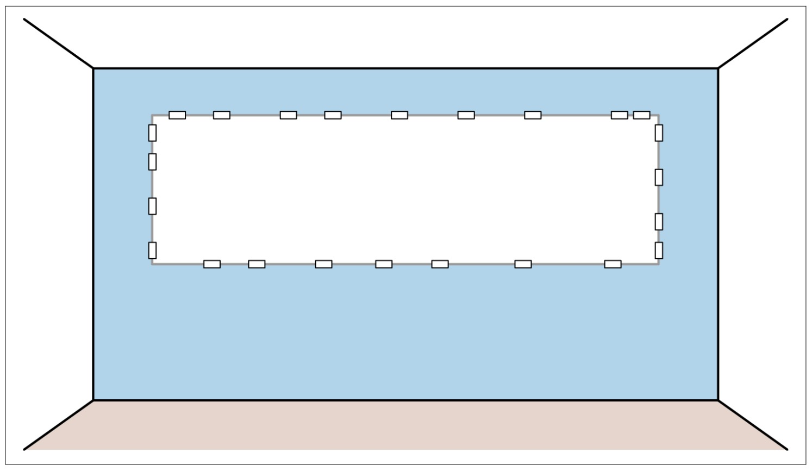

*Figure 12-1. Modeling space for EventStorming*

# The EventStorming Process

An EventStorming workshop is usually conducted in 10 steps.

> EventStorming 研讨会通常分为10个步骤。

During each step, the model is enriched-使充实,使丰富 with additional information and concepts.

> 在每一步中，模型都被附加的信息和概念所丰富。

## Step 1: Unstructured Exploration

> 步骤1：非结构化探索

EventStorming starts with a brainstorm of the domain events related to the business domain being explored.

> EventStorming从与正在探索的业务领域相关的领域事件的头脑风暴开始。

A *domain event* is something interesting that has happened in the business.

> 领域事件是指业务中发生的有趣的事情。

It’s important to formulate-制定,规划 domain events in the past tense (see Figure 12-2)—they are describing things that have already happened.

> 用过去时来描述领域事件是很重要的(见图12-2)——它们描述的是已经发生的事情。

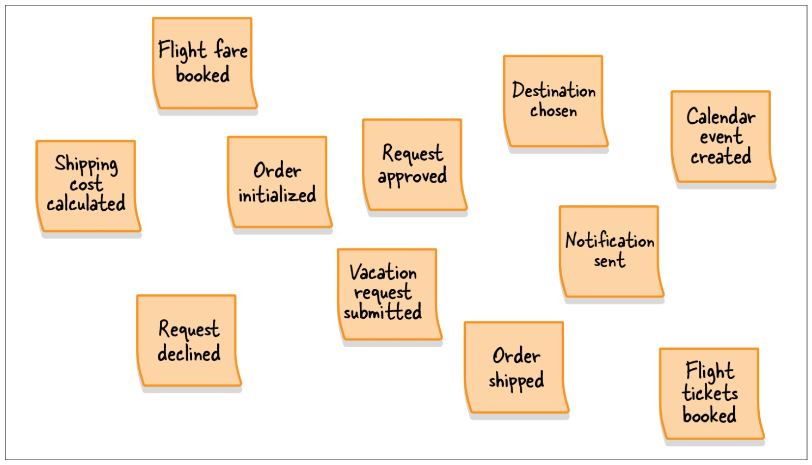

*Figure 12-2. Unstructured exploration*

During this step, all participants are grabbing-利用,抓住 a bunch of orange sticky notes, writing down whatever domain events come to mind, and sticking them to the modeling surface.

> 在这一步中，所有参与者都抓住一束橙色的便利贴，写下任何想到的领域事件，并将它们粘在建模表面上。

---

At this early stage, there is no need to worry about ordering events, or even about redundancy.

> 在这个早期阶段，不需要担心事件排序，甚至不需要担心冗余。

This step is all about brainstorming the possible things that can happen in the business domain.

> 这一步是关于在业务领域中可能发生的事情的头脑风暴。

---

The group should continue generating domain events until the rate of adding new ones slows significantly-显著地,相当数量地.

> 小组应该继续生成域事件，直到添加新事件的速度显著减慢。

## Step 2: Timelines

> 时间线

Next, the participants go over the generated domain events and organize them in the order in which they occur in the business domain.

> 接下来，参与者浏览生成的域事件，并按照它们在业务域中发生的顺序对它们进行组织。

---

The events should start with the “happy path scenario”: the flow that describes a successful business scenario.

> 事件应该从“愉快路径场景”开始：描述成功业务场景的流。

---

Once the “happy path” is done, alternative scenarios can be added—for example, paths where errors are encountered or different business decisions are taken.

> 一旦完成了“快乐路径”，就可以添加替代场景—例如，遇到错误或采取不同业务决策的路径。

The flow branching can be expressed as two flows coming from the preceding event or with arrows-箭头 drawn on the modeling surface, as shown in Figure 12-3.

> 流分支可以表示为来自前一个事件的两个流，或者在建模表面上用箭头表示，如图12-3所示。

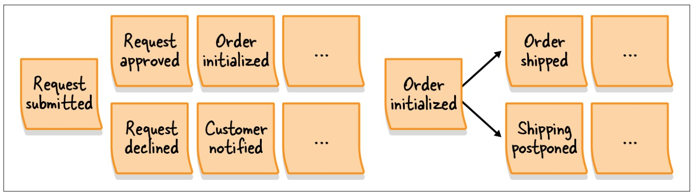

*Figure 12-3. Flows of events*

This step is also the time to fix incorrect events, remove duplicates, and of course, add missing events if necessary.

> 在此步骤中还可以修复不正确的事件、删除重复的事件，当然，还可以在必要时添加缺失的事件。

## Step 3: Pain Points

> 第三步：痛点

Once you have the events organized in a timeline, use this broad view to identify points in the process that require attention. 

> 一旦你把事件组织在一个时间轴上，使用这个广阔的视角来识别过程中需要注意的点。

These can be bottlenecks-瓶颈,障碍物, manual-手动的 steps that require automation, missing documentation, or missing domain knowledge.

> 这些问题可能是瓶颈、需要自动化的手动步骤、缺少文档或缺少领域知识。

---

It’s important to make these inefficiencies explicit so that it will be easy to return to them as the EventStorming session progresses, or to address them afterward-以后,后来.

> 重要的是要明确这些低效率，以便在EventStorming会话进行时很容易返回到它们，或者在之后解决它们。

The pain points are marked with rotated-旋转 (diamond) pink-粉红色的 sticky notes, as illustrated in Figure 12-4.

> 痛点用旋转的粉红色(菱形)便利贴标记，如图12-4所示。

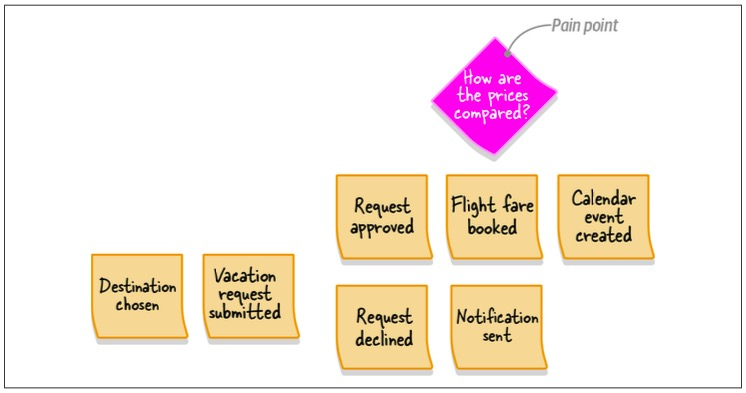

*Figure 12-4. A diamond-shaped pink sticky note, which points to an aspect of the process that requires attention: missing domain knowledge about how the airfare prices are com‐ pared during the booking process*

---

Of course, this step is not the only opportunity to track pain points.

> 当然，这一步并不是追踪痛点的唯一机会。

As a facilitator, be aware of the participants’ comments-评论,意见 throughout the process.

> 作为一个促进者，在整个过程中要注意参与者的评论。

When an issue or a concern is raised, document it as a pain point.

> 当出现问题或关注点时，将其作为痛点记录下来。

## Step 4: Pivotal-中枢的,关键的 Events

> 第四步：关键事件

Once you have a timeline of events augmented with pain points, look for significant business events indicating a change in context or phase.

> 一旦您有了一个包含痛点的事件时间轴，就可以寻找表明上下文或阶段发生变化的重要业务事件。

These are called *pivotal events* and are marked with a vertical-垂直的,直立的 bar dividing the events before and after the pivotal event.

> 这些事件被称为“关键事件”，并用竖线将关键事件前后的事件区分开来。

---

For example, “shopping cart initialized,” “order initialized,” “order shipped,” “order delivered,” and “order returned” represent significant changes in the process of making an order, as shown in Figure 12-5.

> 例如，“购物车初始化”、“订单初始化”、“订单已发送”、“订单已交付”和“订单已返回”代表了订单制作过程中的重大变化，如图12-5所示。

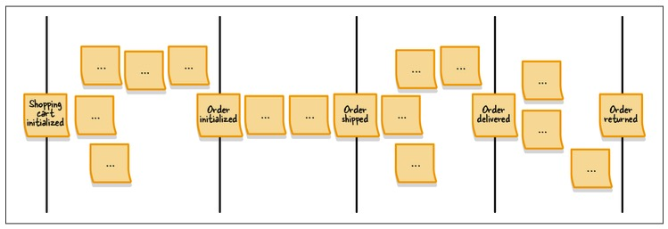

*Figure 12-5. Pivotal events denoting context changes in the* *flow* *of events*

---

Pivotal events are an indicator of potential bounded context boundaries.

> 关键事件是潜在有界上下文边界的指示器。

## Step 5: Commands

> 第五步：命令

Whereas a domain event describes something that has already happened, a *command* describes what triggered the event or flow of events.

> 领域事件描述的是已经发生的事情，而命令描述的是触发事件或事件流的内容。

Commands describe the system’s operations and, contrary-相反的,相对的 to domain events, are formulated-制定,规划 in the imperative-命令的.

> 命令描述系统的操作，与领域事件相反，命令是命令式的。

For example:

- Publish campaign

  > 发布活动

- Roll back transaction

  > 回滚事务

- Submit order

  > 提交订单

---

Commands are written on light blue sticky notes and placed on the modeling space before the events they can produce.

> 命令被写在浅蓝色的便签上，放在它们可以产生的事件之前的建模空间中。

If a particular command is executed by an actor in a specific role, the actor information is added to the command on a small yellow sticky note, as illustrated in Figure 12-6.

> 如果一个特定的命令是由特定角色的参与者执行的，参与者的信息会被添加到一个黄色的小便签上，如图12-6所示。

The actor represents a user persona-角色 within the business domain, such as customer, administrator, or editor.

> 参与者表示业务域中的用户角色，例如客户、管理员或编辑。

---

Naturally, not all commands will have an associated actor.

> 当然，并非所有命令都有关联的参与者。

Therefore, add the actor information only where it’s obvious.

> 因此，只在明显的地方添加参与者信息。

In the next step we will augment-增大,加强 the model with additional entities that can trigger commands.

> 在下一步中，我们将使用可以触发命令的其他实体来增强模型。

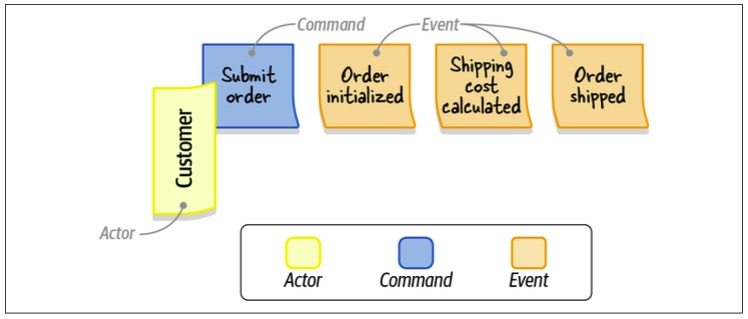

*Figure 12-6.* *The* *“Submit Order” command, executed by the customer (actor) and followed by the “Order initialized,” “Shipping cost calculated,” and “Order shipped” events*

## Step 6: Policies

> 第六步：政策

Almost always, some commands are added to the model but have no specific actor associated with them.

> 几乎总是，一些命令被添加到模型中，但没有与它们关联的特定参与者。

During this step, you look for automation policies that might execute those commands.

> 在此步骤中，您将查找可能执行这些命令的自动化策略。

---

An *automation policy* is a scenario in which an event triggers the execution of a command.

> 自动化策略是一种场景，其中事件触发命令的执行。

In other words, a command is automatically executed when a specific domain event occurs.

> 也就是说，当某个特定的域事件发生时，命令会自动执行。

---

On the modeling surface-表面, policies are represented as purple-紫色的,紫红色的 sticky notes connecting events to commands, as shown by the “Policy” sticky note in Figure 12-7.

> 在建模界面上，策略被表示为连接事件和命令的紫色便利贴，如图12-7 所示的“Policy”便利贴。

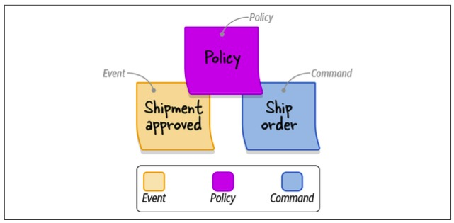

*Figure 12-7. An automation policy that triggers the “Ship Order” command when the “Shipment Approved” event is observed*

---

If the command in question should be triggered only if some decision criteria is met, you can specify the decision criteria explicitly on the policy sticky note.

> 如果只有在满足某些决策标准时才触发相关命令，则可以在策略便签上显式指定决策标准。

For example, if you need to trigger the escalate command after the “complaint received” event, but only if the complaint was received from a VIP customer, you can explicitly state the “only for VIP customers” condition on the policy sticky.

> 例如，如果您需要在“收到投诉”事件之后触发升级命令，但仅当投诉来自VIP客户时，您可以在策略粘性上显式地声明“仅针对VIP客户”条件。

---

If the events and commands are **far apart**-相距很远, you can draw an arrow-箭头 on the modeling surface to connect them.

> 如果事件和命令相距很远，可以在建模表面上画一个箭头来连接它们。

## Step 7: Read Models

> 第七步：阅读模型

A read model is the view of data within the domain that the actor uses to make a decision to execute a command.

> 读取模型是领域内的数据视图，参与者使用该视图来做出执行命令的决定。

This can be one of the system’s screens, a report, a notification, and so on.

> 它可以是系统的一个屏幕、一个报告、一个通知等等。

---

The read models are represented by green sticky notes (see the “Shopping cart” note in Figure 12-8) with a short description of the source of information needed to support the actor’s decision.

> 读取模型由绿色的便利贴表示(参见图12-8中的“购物车”注释)，上面有支持参与者决策所需的信息源的简短描述。

Since a command is executed after the actor has viewed the read model, on the modeling surface the read models are positioned-安置,使处于 before the commands.

> 由于命令是在参与者查看读取模型之后执行的，因此在建模界面上，读取模型位于命令之前。

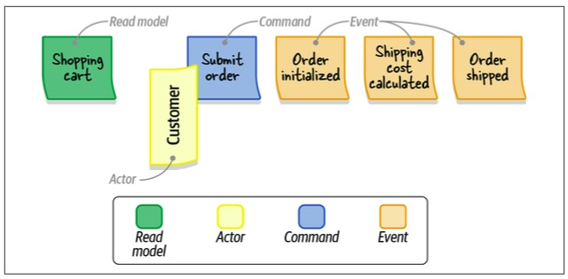

*Figure 12-8.* *The* *view of the “Shopping cart” (read model) needed for the customer (actor) to make their decision to submit the order (command)*

## Step 8: External Systems

> 第八步：外部系统

This step is about augmenting-增加,补充 the model with external systems.

> 这一步是关于用外部系统来扩充模型。

An *external system* is defined as any system that is not a part of the domain being explored.

> “外部系统”被定义为不属于所探索领域的任何系统。

It can execute commands (input) or can be notified about events (output).

> 它可以执行命令(输入)，也可以收到事件通知(输出)。

---

The external systems are represented by pink sticky notes.

> 外部系统由粉红色的便利贴表示。

In Figure 12-9, the CRM (external system) triggers execution of the “Ship Order” command.

When the shipment-运输,运送 is approved (event), it is communicated to the CRM (external system) through a policy.

> 当货物被批准(事件)时，它通过策略传达给CRM(外部系统)。

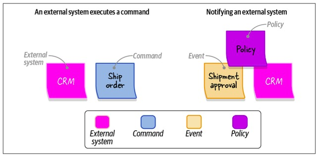

*Figure 12-9. External system triggering execution of a command* *(left)* *and approval of the event being communicated to the external system (right)*

---

By the end of this step, all commands should either be executed by actors, triggered by policies, or called by external systems.

> 在此步骤结束时，所有命令都应该由参与者执行、由策略触发或由外部系统调用。

## Step 9: Aggregates

> 第九步：聚合

Once all the events and commands are represented, the participants can start thinking about organizing related concepts in aggregates.

> 一旦所有的事件和命令都被表示出来，参与者就可以开始考虑将相关的概念组织成聚合。

An *aggregate* receives commands and produces events.

> *aggregate* 接收命令并产生事件。

---

Aggregates are represented as large yellow sticky notes, with commands on the left and events on the right, as depicted in Figure 12-10.

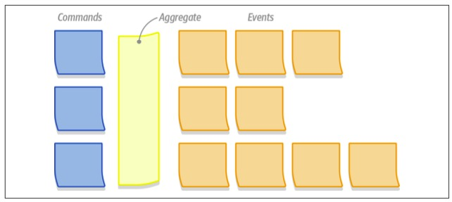

*Figure 12-10. Commands and domain events organized in an aggregate*

## Step 10: Bounded Contexts

> 第十步：限界上下文

The last step of an EventStorming session is to look for aggregates that are related to each other, either because they represent closely related functionality or because they’re coupled through policies.

> EventStorming 会话的最后一步是寻找彼此相关的聚合，或者因为它们表示密切相关的功能，或者因为它们通过策略耦合。

The groups of aggregates form natural candidates for bounded contexts’ boundaries, as shown in Figure 12-11.

> 聚合组形成了有界上下文边界的自然候选者，如图12-11所示。

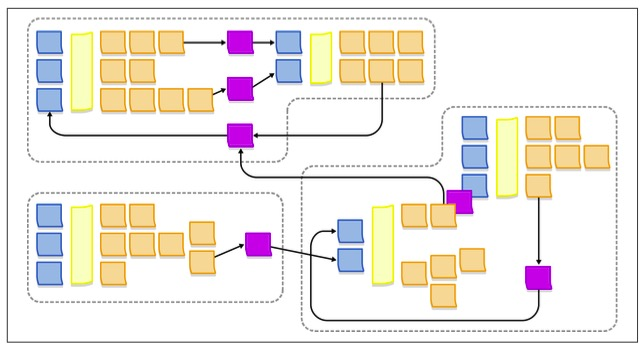

*Figure 12-11. A possible decomposition of the resultant system into bounded contexts*

# Variants

> 变体

Alberto Brandolini, the creator of the EventStorming workshop, defines the EventStorming process as *guidance*, *not hard rules*. 

> EventStorming 工作室的创建者 Alberto Brandolini 将 EventStorming 过程定义为“指导”，而不是“硬性规则”。

You are free to experiment with the process to find the “recipe-诀窍,配方” that works best for you.

> 你可以自由地尝试这个过程，找到最适合你的“配方”。

---

In my experience, when introducing EventStorming in an organization I prefer to start by exploring the big picture of the business domain by following steps 1 (chaotic exploration) through 4 (pivotal events).

> 根据我的经验，当在一个组织中引入 EventStorming 时，我更喜欢通过以下步骤1(混乱探索)到4(关键事件)来探索业务领域的大局。

The resultant model covers a wide range of the company’s business domain, builds a strong foundation for ubiquitous languages, and outlines possible boundaries for bounded contexts.

> 生成的模型涵盖了公司的广泛业务领域，为通用语言构建了坚实的基础，并概述了有界上下文的可能边界。

---

After gaining the big picture and identifying the different business processes, we continue to facilitate a dedicated-专门的,致力于 EventStorming session for each relevant business process—this time, following all the steps to model the complete process.

> 在了解了全局并确定了不同的业务流程之后，我们将继续为每个相关的业务流程提供一个专门的 EventStorming 会话——这一次，按照所有步骤对整个流程进行建模。

---

At the end of a full EventStorming session, you will have a model describing the business domain’s events, commands, aggregates, and even possible bounded contexts.

> 在完整的 EventStorming 会话结束时，您将拥有一个描述业务域的事件、命令、聚合甚至可能的有界上下文的模型。

However, all of these are just nice bonuses.

> 然而，所有这些都只是不错的奖金。

The real value of an EventStorming session is the process itself—the sharing of knowledge among different stakeholders, alignment of their mental-精神的,思想的 models of the business, discovery of conflicting models, and, last but not least, formulation-制定,构想 of the ubiquitous language.

> EventStorming 会议的真正价值在于过程本身——在不同的涉众之间共享知识，协调他们的业务心智模型，发现相互冲突的模型，最后但并非最不重要的是，制定通用语言。

---

The resultant model can be adopted as a basis for implementing an event-sourced domain model.

> 所得到的模型可以作为实现事件源领域模型的基础。

The decision of whether to go that route or not depends on your business domain.

> 是否走这条路取决于你的业务领域。

If you decide to implement the event-sourced domain model, you have the bounded context boundaries, the aggregates, and of course, the blueprint of the required domain events.

> 如果您决定实现事件源域模型，那么您将拥有有界的上下文边界、聚合，当然还有所需领域事件的蓝图。

# When to Use EventStorming

> 何时使用 EventStorming

The workshop can be facilitated for many reasons:

> 有许多原因可以促进研讨会：

- *Build a ubiquitous language*

  > 构建统一语言

  As the group cooperates-配合,协作 in building the model of the business process, they instinctively-本能地,凭直觉地 synchronize the terminology and start using the same language.

  > 当团队合作构建业务流程模型时，他们本能地同步术语并开始使用相同的语言。

- *Model the business process*

  > 业务流程建模

  An EventStorming session is an effective way to build a model of the business process.

  > EventStorming 会话是构建业务流程模型的有效方法。

  Since it is based on DDD-oriented building blocks, it is also an effective way to discover the boundaries of aggregates and bounded contexts.

  > 由于它基于面向 DDD 的构建块，因此它也是发现聚合和有界上下文边界的有效方法。

- *Explore new business requirements*

  > 探索新的业务需求

  You can use EventStorming to ensure that all the participants are on the same page regarding the new functionality and reveal edge cases not covered by the business requirements.

  > 您可以使用 EventStorming 来确保所有参与者都在同一页面上了解新功能，并揭示未被业务需求覆盖的边缘情况。

- *Recover domain knowledge*

  > 提取领域知识

  Over time, domain knowledge can get lost.

  > 随着时间的推移，领域知识可能会丢失。

  This is especially acute-严重的,危险的 in legacy-遗留的,遗产 systems that require modernization.

  > 这在需要现代化的遗留系统中尤其严重。

  EventStorming is an effective way to merge the knowledge held by each participant into a single coherent-有条理的,连贯的 picture.

  > EventStorming 是一种有效的方法，可以将每个参与者掌握的知识合并成一个连贯的画面。

- *Explore ways to improve an existing business process*

  > 探索改善现有业务流程的方法

  Having an end-to-end view of a business process provides the perspective needed to notice inefficiencies and opportunities to improve the process.

  > 拥有业务流程的端到端视图提供了注意效率低下和改进流程的机会所需的透视图。

- *Onboard new team members*

  > 新的团队成员加入

  Facilitating an EventStorming session together with new team members is a great way to expand their domain knowledge.

  > 与新团队成员一起促进 EventStorming 会议是扩展他们领域知识的好方法。

---

In addition to when to use EventStorming, it’s important to mention when not to use it.

> 除了什么时候应该使用EventStorming，还有一点很重要，那就是什么时候不应该使用它。

EventStorming will be less successful when the business process you’re exploring is simple or obvious, such as following-遵循 a series of sequential-连续的 steps without any interesting business logic or complexity.

> 当您正在探索的业务流程简单或明显时，例如遵循一系列连续的步骤，没有任何有趣的业务逻辑或复杂性，EventStorming将不太成功。

# Facilitation Tips

> 引导技巧

When facilitating an EventStorming session with a group of people who have never done EventStorming before, I prefer to start with a quick overview of the process.

> 当与一群以前从未做过 EventStorming 的人进行 EventStorming 会议时，我更喜欢从快速概述过程开始。

I explain what we are about to do, the business process we are about to explore, and the modeling elements we will use in the workshop.

> 我解释了我们将要做什么，我们将要探索的业务流程，以及我们将在研讨会中使用的建模元素。

As we go through the elements— domain events, commands, actors, and so on—I build a legend-图例, depicted in Figure 12-12, using the sticky notes we will use and labels to help the participants remember the color code.

> 当我们遍历这些元素——领域事件、命令、参与者等等——我构建了一个图例，如图12-12所示，使用我们将使用的便利贴和标签来帮助参与者记住颜色代码。

The legend should be visible to all participants during the workshop.

> 图例应该在研讨会期间对所有参与者可见。

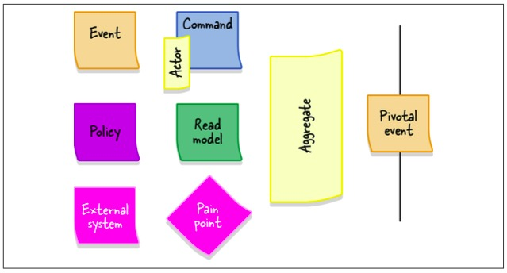

*Figure 12-12. Legend depicting the various elements of the EventStorming process writ‐ ten on the corresponding sticky notes*

## Watch the Dynamics

> 关注动态

As the workshop progresses, it’s important to track the energy of the group.

> 随着研讨会的进行，跟踪小组的精力是很重要的。

If the dynamics are slowing down, see whether you can reignite-重新燃烧 the process by asking questions or whether it’s time to advance to the next stage of the workshop.

> 如果动力变慢了，看看你是否可以通过问问题来重新点燃这个过程，或者是时候进入研讨会的下一个阶段了。

---

Remember that EventStorming is a group activity, so ensure that it is handled as such.

> 记住，EventStorming 是一个群组活动，所以要确保它是这样处理的。

Make sure everyone has a chance to participate in the modeling and the discussion.

> 确保每个人都有机会参与建模和讨论。

If you notice that some participants are **shying away**-退缩,畏缩 from the group, try to involve them in the process by asking questions about the current state of the model.

> 如果您注意到一些参与者回避小组，请尝试通过询问有关模型当前状态的问题来让他们参与过程。

---

EventStorming is an intense-激烈的,热情的 activity, and at some point, the group will need a break.

> EventStorming 是一项激烈的活动，在某些时候，团队需要休息一下。

Don’t resume-恢复 the session until all the participants are back in the room.

> 在所有参与者都回到房间后再继续会议。

Resume the process by going through the current state of the model to return the group to a collaborative modeling mood.

> 通过遍历模型的当前状态来恢复该过程，使小组回到协作建模的状态。

## Remote EventStorming

> 远程 EventStorming

EventStorming was invented-发明,创造 as a low-tech activity in which people interact and learn together in the same room.

> EventStorming 是一种低技术含量的活动，人们在同一个房间里互动和学习。

The creator of the workshop, Alberto Brandolini, has often objected-反对 to conducting EventStorming remotely because it’s impossible to achieve the same levels of participation, and hence, collaboration and knowledge sharing, when the group is not colocated-共同定位的.

> 研讨会的创建者 Alberto Brandolini 经常反对远程管理 EventStorming，因为当小组不在同一地点时，不可能达到相同的参与水平，因此不可能实现协作和知识共享。

---

However, with the onset of the COVID-19 pandemic in 2020, it became impossible to have in-person-亲自,当面 meetings and do EventStorming as it was meant to be done.

> 然而，随着2020年COVID-19大流行的爆发，不可能按原计划举行面对面会议和活动风暴。

A number of tools attempted to enable collaboration and facilitation of remote EventStorming sessions.

> 许多工具试图实现远程 EventStorming 会话的协作和便利。

At the time of this writing, the most notable-著名的 of them is miro.com.

> 在撰写本文时，其中最著名的是 miro.com。

Be more patient-有耐心的 when doing online EventStorming and take into account the less effective communication that results.

> 在进行在线 EventStorming 时要更有耐心，并考虑到由此导致的不那么有效的沟通。

---

In addition, my experience shows that remote EventStorming sessions are more effective with a smaller number of participants. 

> 此外，我的经验表明，远程 EventStorming 会议在参与者较少的情况下更有效。

While as many as 10 people can attend an in-person EventStorming session, I prefer to limit online sessions to five participants. 

> 面对面的 EventStorming 会议可以多达10人参加，而我更喜欢将在线会议限制在5人以内。

When you need more participants to contribute their knowledge, you can facilitate multiple sessions, and afterward compare and merge the resultant models.

> 当您需要更多的参与者贡献他们的知识时，您可以促进多个会议，然后比较和合并结果模型。

---

When the situation allows, return to in-person EventStorming.

> 当情况允许时，回到现场的 EventStorming。

# Conclusion

> 总结

EventStorming is a collaboration-based workshop for modeling business processes.

> EventStorming 是一个基于协作的业务流程建模研讨会。

**Apart from**-除了…之外 the resultant models, its primary benefit is knowledge sharing.

> 除了由此产生的模型之外，它的主要好处是知识共享。

By the end of the session, all the participants will synchronize their mental models of the business process and take the first steps toward using a ubiquitous language.

> 在会议结束时，所有参与者将同步他们对业务流程的心智模型，并朝着使用通用语言迈出第一步。

---

EventStorming is like riding-骑 a bicycle.

> EventStorming就像骑自行车。

It’s much easier to learn by doing it than to read about it in a book.

> 通过实践来学习比在书本上读要容易得多。

Nevertheless-然而,不过, the workshop is fun and easy to facilitate.

> 然而，这个工作坊很有趣，也很容易上手。

You don’t need to be an EventStorming black belt-皮带,带 to get started.

> 你不需要成为 EventStorming 黑带才能开始。

Just facilitate-促进,推动 the session, follow the steps, and learn during the process.

> 只要促进会话，遵循步骤，并在过程中学习。

