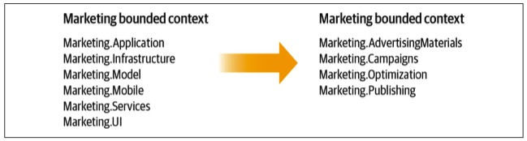
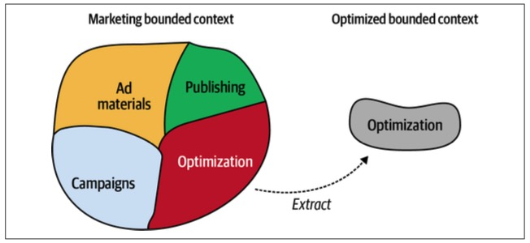
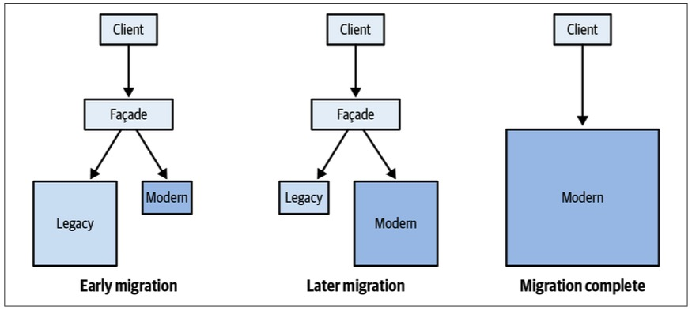
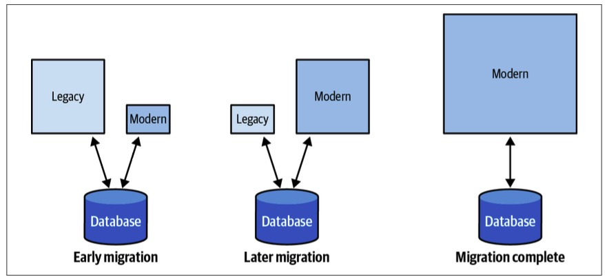

> Chapter 13. Domain-Driven Design in the Real World
>
> 现实世界中的领域驱动设计

We have covered domain-driven design tools for analyzing business domains, sharing knowledge, and making strategic and tactical design decisions.

> 我们已经介绍了用于分析业务领域、共享知识以及制定战略和战术设计决策的领域驱动设计工具。

Just imagine how fun it will be to apply this knowledge in practice.

> 想象一下，将这些知识应用到实践中会有多有趣。

Let’s consider a scenario in which you are working on a greenfield project.

> 让我们考虑这样一个场景：您正在从事一个未开发项目。

All of your coworkers have a strong grasp-掌握,抓牢,握紧 of domain-driven design, and right from the get-go all are doing their best to design effective models and, of course, are devotedly-忠实地,一心一意地 using the ubiquitous language.

> 您的所有同事都对领域驱动设计有很强的掌握，并且从一开始就都在尽最大努力设计有效的模型，当然，他们都在专心致志地使用通用语言。

As the project advances, the bounded contexts’ boundaries are explicit and effective in protecting the business domain models. 

> 随着项目的推进，有界上下文的边界在保护业务领域模型方面是显式的和有效的。

Finally, since all tactical design decisions are aligned with the business strategy, the codebase is always in great shape: it speaks the ubiquitous language and implements the design patterns that accommodate-考虑到,适应 the model’s complexity.

> 最后，由于所有战术设计决策都与业务策略保持一致，因此代码库总是处于良好状态：它使用通用语言并实现适应模型复杂性的设计模式。

Now wake up.

> 现在醒醒吧。

---

Your chances of experiencing the laboratory-实验室 conditions I just described are about as good as winning the lottery-彩票.

> 你经历我刚才描述的实验室条件的机会就像中彩票一样好。

Of course, it’s possible, but not likely.

> 当然，这是可能的，但不太可能。

Unfortunately, many people mistakenly believe that domain-driven design can only be applied in greenfield projects and in ideal conditions in which everybody on the team is a DDD black belt.

> 不幸的是，许多人错误地认为领域驱动的设计只能应用于未开发的项目，以及团队中每个人都是DDD黑带的理想条件。

Ironically-讽刺地, the projects that can benefit from DDD the most are the brownfield projects: those that already proved their business viability and need a shake-up-改组 to fight accumulated-积累,积攒 technical debt and design entropy.

> 具有讽刺意味的是，从 DDD 中获益最多的项目是棕地项目：那些已经证明其业务可行性并且需要改组以对抗累积的技术债务和设计熵的项目。

Coincidentally-巧合地,同时地, working on such brownfield, legacy, big-balls-of-mud codebases is where we spend most of our software engineering careers.

> 巧合的是，在这些未开发的、遗留的、大泥球的代码库上工作是我们大部分软件工程职业生涯的地方。

---

Another common misconception about DDD is that it’s an all-or-nothing proposition-主张,观点—either you apply every tool the methodology has to offer, or it’s not domain-driven design.

> 关于DDD的另一个常见误解是，它是一个要么全有要么全无的命题——要么应用该方法提供的所有工具，要么它不是领域驱动的设计。

That’s not true.

It might seem overwhelming-打败,击垮,令人不知所措的 to come to grips-理解 with all of these concepts, let alone implement them in practice.

> 要掌握所有这些概念似乎很难，更不用说在实践中实现它们了。

Luckily, you don’t have to apply all of the patterns and practices to gain value from domain-driven design.

> 幸运的是，您不必应用所有的模式和实践来从领域驱动的设计中获得价值。

This is especially true for brownfield projects, where it’s practically impossible to introduce all the patterns and practices in a reasonable-有道理的,合情理的 time frame.

> 对于棕地项目尤其如此，在合理的时间框架内引入所有的模式和实践实际上是不可能的。

---

In this chapter, you will learn strategies for applying domain-driven design tools and patterns in the real world, including on brownfield projects and in less-than-ideal-不太理想 environments.

> 在本章中，您将学习在现实世界中应用领域驱动设计工具和模式的策略，包括在棕地项目和不太理想的环境中。

# Strategic Analysis

> 战略分析

Following the order of our exploration-研究,探究 of domain-driven design patterns and practices, the best starting point for introducing DDD in an organization is to invest time in understanding the organization’s business strategy and the current state of its systems’ architecture.

> 按照我们探索领域驱动的设计模式和实践的顺序，在组织中引入DDD的最佳起点是投入时间来理解组织的业务策略及其系统体系结构的当前状态。

## Understand the Business Domain

> 了解业务领域

First, identify the company’s business domain:

> 首先，确定公司的业务领域：

- What is the organization’s business domain(s)?
- Who are its customers?
- What service, or value, does the organization provide to customers?
- What companies or products is the organization competing with?

Answering these questions will give you a bird’s-eye-鸟瞰的 view of the company’s high-level goals.

> 回答这些问题可以让你对公司的高层目标有一个大致的了解。

Next, “**zoom in**-放大” to the domain and look for the business building blocks the organization employs-雇用,利用 to achieve its high-level goals: the subdomains.

> 接下来，“放大”到域，寻找组织用来实现其高级目标的业务构建块：子域。

---

A good initial heuristic-启发式的 is the company’s org chart: its departments and other organizational units.

> 一个好的初步启发是公司的组织结构图：它的部门和其他组织单位。

Examine how these units cooperate to allow the company to compete in its business domain.

> 检查这些单位如何合作，以允许公司在其业务领域竞争。

Furthermore, look for the signs of specific types of subdomains.

> 此外，寻找特定类型的子域的标志。

### Core subdomains

> 核心子域

To identify the company’s core subdomains, look for what differentiates it from its competitors:

> 为了确定公司的核心子领域，寻找它与竞争对手的区别:

- Does the company have a “secret sauce” that its competitors lack?

  > 该公司是否拥有竞争对手所缺乏的“秘方”?

  For example, intellectual-智力的,思想的,思维的 property, such as patents-专利 and algorithms designed in-house?

  > 例如，知识产权，如专利和内部设计的算法?

- Keep in mind that the competitive advantage, and thus the core subdomains, are not necessarily technical.

  > 请记住，竞争优势以及核心子域并不一定是技术性的。

  Does the company possess-拥有,持有 a nontechnical competitive advantage?

  > 公司是否拥有非技术竞争优势?

  For example, the ability to hire top-level personnel, produce a unique artistic-艺术的 design, and so on?

  > 例如，聘请顶级人才的能力，产生独特的艺术设计，等等?

Another powerful yet unfortunate heuristic for core subdomains is identifying the worst-designed-最差的,最糟的 software components—those big balls of mud that all engineers hate but the business is unwilling-不愿意的,不情愿的 to rewrite from scratch because of the accompanying-陪伴,伴随 business risk.

> 对于核心子领域，另一个强大但不幸的启发方法是识别设计最差的软件组件——那些所有工程师都讨厌的大泥球，但由于伴随的业务风险，业务不愿意从头开始重写。

The key here is that the legacy system cannot be replaced with a ready-made system—it would be a generic subdomain—and any modification to it entails business risks.

> 这里的关键是遗留系统不能被现成的系统取代——它将是一个通用的子域——并且对它的任何修改都会带来业务风险。

### Generic subdomains

> 通用的子域

To identify generic subdomains, look for off-the-shelf-现成的 solutions, subscription services, or integration of open source software.

> 要识别通用子域，请查找现成的解决方案、订阅服务或开源软件的集成。

As you learned in Chapter 1, the same ready-made solutions should be available to the competing companies, and those companies leveraging the same solution should have no business impact on your company.

> 正如您在第1章中所学到的，相同的现成解决方案应该可供竞争公司使用，并且那些利用相同解决方案的公司应该对您的公司没有业务影响。

### Supporting subdomains

> 支撑子域

For supporting subdomains, look for the remaining software components that cannot be replaced with ready-made solutions yet do not directly provide a competitive advantage.

> 为了支持子域，寻找那些不能被现成的解决方案替代，但又不能直接提供竞争优势的剩余软件组件。

If the code is in rough-粗糙的,不平的 shape, it triggers less emotional-情绪的 response from software engineers since it changes infrequently.

> 如果代码的形状很粗糙，那么软件工程师的情绪反应就会少一些，因为它很少变化。

Thus, the effects of the suboptimal-次优的 software design are not as severe as for the core subdomains.

> 因此，次优软件设计的影响不像核心子域那样严重。

---

You don’t have to identify all of the core subdomains.

It won’t be practical or even possible to do so, even for a medium-sized company.

> 即使对一家中等规模的公司来说，这样做也不现实，甚至不可能。

Instead, identify the overall structure, but pay closer attention to the subdomains that are most relevant to the software systems you are working on.

> 相反，确定整体结构，但更密切地关注与您正在开发的软件系统最相关的子域。

## Explore the Current Design

> 探索当前设计

Once you are familiar with the problem domain, you can continue to investigate-调查,研究 the solution and its design decisions.

> 一旦熟悉了问题域，就可以继续研究解决方案及其设计决策。

First, start with the high-level components.

> 首先，从高级组件开始。

These are not necessarily bounded contexts in the DDD sense, but rather boundaries used to decompose the business domain into subsystems.

> 这些不一定是DDD意义上的有界上下文，而是用于将业务域分解为子系统的边界。

---

The characteristic property to look for is the components’ decoupled lifecycles.

> 要寻找的特征属性是组件的解耦生命周期。

Even if the subsystems are managed in the same source control repository (mono-repo) or if all the components reside in a single monolithic-整体的 codebase, check which can be evolved, tested, and deployed independently from the others.

> 即使子系统是在相同的源代码控制存储库中管理的，或者如果所有组件都驻留在一个单一的整体代码库中，也要检查哪些组件可以独立于其他组件进行开发、测试和部署。

### Evaluate the tactical design

> 评估战术设计

For each high-level component, check which business subdomains it contains and what technical design decisions were taken: what patterns are used to implement the business logic and define the component’s architecture?

> 对于每个高级组件，检查它包含哪些业务子域以及采取了哪些技术设计决策：使用哪些模式来实现业务逻辑和定义组件的体系结构?

---

Does the solution fit the complexity of the problem?

> 解决方案是否符合问题的复杂性?

Are there areas where more elaborate-精心制作,复杂的,详尽的 design patterns are needed?

> 是否有需要更精细的设计模式的领域？

Conversely, are there any subdomains where it’s possible to cut corners or use existing, off-the-shelf-现成的 solutions?

> 相反，是否存在可以抄近路或使用现有现成解决方案的子域?

Use this information to make smarter strategic and tactical decisions.

> 利用这些信息来做出更明智的战略和战术决策。

### Evaluate the strategic design

> 评估战略设计

Use the knowledge of the high-level components to chart the current design’s context map, as though these high-level components were bounded contexts.

> 使用高级组件的知识来绘制当前设计的上下文映射，就好像这些高级组件是有界上下文一样。

Identify and track the relationships between the components in terms of bounded context integration patterns.

> 根据有界上下文集成模式识别和跟踪组件之间的关系。

---

Finally, analyze the resultant-由此引起的,因而发生的 context map and evaluate the architecture from a domain-driven design perspective.

> 最后，分析生成的上下文映射，并从领域驱动设计的角度评估体系结构。

Are there suboptimal strategic design decisions?

> 是否存在次优的战略设计决策？

For example:

- Multiple teams working on the same high-level component

  > 多个团队在同一个高层组件上工作

- Duplicate implementations of core subdomains

  > 核心子域的重复实现

- Implementation of a core subdomain by an outsourced company

  > 由外包公司实现的核心子域

- Friction-分歧,摩擦 because of frequently failing integration

  > 由于经常集成失败而产生的摩擦

- Awkward-难对付的,笨拙的 models spreading from external services and legacy-遗留 systems

  > 从外部服务和遗留系统中传播的笨拙模型

---

These insights are a good starting point for planning the design modernization strategy.

> 这些见解是规划设计现代化策略的良好起点。

But first, given this more in-depth knowledge of both the problem (business domain) and the solution (current design) spaces, look for lost domain knowledge.

> 但是首先，考虑到问题(业务领域)和解决方案(当前设计)空间的更深入的知识，寻找丢失的领域知识。

As we discussed in Chapter 11, knowledge of the business domain can get lost for various reasons.

> 正如我们在第11章中所讨论的，业务领域的知识可能会因为各种原因而丢失。

The problem is widespread-普遍的,广泛的 and acute-尖锐的,严重的,危险的 in core subdomains, where the business logic is both complex and business critical.

> 这个问题在核心子领域中广泛而尖锐，其中的业务逻辑既复杂又对业务至关重要。

If you encounter such cases, facilitate EventStorming sessions to try to recover the knowledge.

> 如果您遇到这种情况，请促进 EventStorming 会话以尝试恢复知识。

Also, use the EventStorming session as the foundation for cultivating-培养,培育 a ubiquitous language.

> 同样，使用 EventStorming 会议作为培养通用语言的基础。

# Modernization Strategy

> 现代化战略

The “big rewrite” endeavors-努力,尽力, in which the engineers are trying to rewrite the system from scratch, this time designing and implementing the whole system correctly, are rarely successful.

> 在“大重写”的努力中，工程师们试图从头开始重写系统，这一次正确地设计和实现整个系统，很少成功。

Even more rarely does management support such architectural makeovers-翻新,改善.

> 管理层甚至很少支持这样的架构改造。

---

A safer approach to improving the design of existing systems is to think big but start small.

> 改进现有系统设计的一种更安全的方法是大局观，小处着手。

As Eric Evans says, not all of a large system will be well designed.

> 正如埃里克·埃文斯所说，并不是所有的大型系统都设计得很好。

That’s a fact we have to accept, and therefore we must strategically decide where to invest in terms of modernization efforts.

> 这是我们必须接受的事实，因此，我们必须从战略上决定在哪些方面投资现代化工作。

A prerequisite-先决条件,前提 for making this decision is to have boundaries dividing the system’s subdomains.

> 做出此决定的先决条件是对系统的子域进行边界划分。

The boundaries don’t have to be physical, making each subdomain a full-fledged-成熟的 bounded context.

> 边界不必是物理的，使每个子域成为一个成熟的有界上下文。

Instead, start by ensuring that at least the logical boundaries (namespace, modules, and packages, depending on the technology stack) are aligned with the subdomains’ boundaries, as shown in Figure 13-1.

> 相反，至少要确保逻辑边界(命名空间、模块和包，取决于技术栈)与子域的边界保持一致，如图13-1所示。

*Figure 13-1. Reorganizing the bounded context’s modules to* *reflect* *the business subdo‐mains’ boundaries rather than technical implementation patterns*

---

Adjusting the system’s modules is a relatively safe form of refactoring.

> 调整系统模块是一种相对安全的重构形式。

You are not modifying the business logic, just repositioning-重新定位 the types in a more well-organized structure.

> 您没有修改业务逻辑，只是在组织更良好的结构中重新定位类型。

That said, ensure that references by full type names, such as the dynamic loading of libraries, reflection, and so on, are not breaking.

> 也就是说，要确保完整类型名的引用(例如库的动态加载、反射等)不会中断。

---

In addition, keep track of the subdomains’ business logic implemented in different codebases; **stored procedures**-存储过程 in a database, serverless-无服务 functions, and so on.

> 此外，跟踪在不同代码库中实现的子域的业务逻辑；数据库中的存储过程、无服务器函数等等。

Make sure to introduce the new boundaries in those platforms as well.

> 确保在这些平台中引入新的边界。

For instance, if some of the logic is handled in the database’s stored procedures, either rename the procedures to reflect the module they belong to or introduce a dedicated database schema and relocate the stored procedures.

> 例如，如果某些逻辑是在数据库的存储过程中处理的，那么要么重命名过程以反映它们所属的模块，要么引入专用的数据库模式并重新定位存储过程。

## Strategic Modernization

> 战略现代化

As we discussed in Chapter 10, it can be risky to prematurely-过早地 decompose the system into the smallest bounded contexts possible.

> 正如我们在第10章中讨论的那样，过早地将系统分解为尽可能小的有界上下文是有风险的。

We will discuss bounded contexts and microservices in more detail in the next chapter.

> 我们将在下一章中更详细地讨论有界上下文和微服务。

For now, look for where the most value can be gained by turning the logical boundaries into physical boundaries.

> 现在，通过将逻辑边界转换为物理边界，寻找可以获得最大价值的地方。

The process of extracting-提取,提炼 a bounded context(s) by turning a logical boundary into a physical one is shown in Figure 13-2.

> 通过将逻辑边界转换为物理边界来提取有界上下文的过程如图13-2所示。

*Figure 13-2. Extracting a bounded context by turning a logical boundary into a physical boundary*

---

Questions to ask yourself:

- Are multiple teams working on the same codebase?

  > 是否有多个团队在同一个代码库上工作?

  If so, decouple the development lifecycles by defining bounded contexts for each team.

  > 如果是这样，通过为每个团队定义有界的上下文来解耦开发生命周期。

- Are conflicting-冲突,争执 models being used by the different components?

  > 不同的组件是否正在使用冲突的模型?

  If so, relocate the conflicting models into separate bounded contexts.

  > 如果是这样，将冲突的模型重新定位到单独的有界上下文中。

---

When the minimum required bounded contexts are in place, examine the relationships and integration patterns between them. 

> 当最小要求的有界上下文就位后，检查它们之间的关系和集成模式。

See how the teams working on different bounded contexts communicate and collaborate.

> 了解处理不同边界上下文的团队如何进行沟通和协作。

Especially when they are communicating through ad hoc or shared-kernel–like integration, do the teams have shared goals and adequate-足够的,适当的 collaboration levels?

> 特别是当他们通过特别的或类似共享内核的集成进行通信时，团队是否有共同的目标和适当的协作级别?

---

Pay attention to problems that the context integration patterns can address:

> 请注意上下文集成模式可以解决的问题:

***Customer–supplier relationships***

> 客户供应商关系

As we discussed in Chapter 11, organizational growth can invalidate-使无效,使作废 prior-先前的,事先的 communication and collaboration patterns.

> 正如我们在第11章中所讨论的，组织增长可以使先前的沟通和协作模式失效。

Look for components designed for a *partnership* relationship of multiple engineering teams, but where the partnership is no longer sustainable-可持续的,持续性的.

> 寻找为多个工程团队的“伙伴关系”而设计的组件，但这种伙伴关系不再可持续。

Refactor to the appropriate type of customer–supplier relationship (conformist, anticorruption layer, or open-host service).

> 重构为适当类型的客户-供应商关系(遵奉者、反腐败层或开放主机服务)。

***Anticorruption layer***

> 反腐层

Anticorruption layers can be useful for protecting bounded contexts from legacy systems, especially, when legacy systems are using inefficient models that tend to spread-扩散,蔓延 into downstream components.

> 反腐败层对于保护有界上下文不受遗留系统的影响非常有用，特别是当遗留系统使用的模型效率低下，往往会扩散到下游组件中时。

Another common use case for implementing an anticorruption layer is to protect a bounded context from frequent changes in the public interfaces of an upstream service it uses.

> 实现反腐败层的另一个常见用例是保护有界上下文不受其使用的上游服务的公共接口频繁更改的影响。

***Open-host service***

> 开放式主机服务

If changes in the implementation details of one component often ripple-涟漪,波动 through the system and affect its consumers, consider making it an open-host service: decouple its implementation model from the public API it exposes.

> 如果一个组件的实现细节的更改经常在整个系统中波动并影响其消费者，请考虑将其作为开放主机服务：将其实现模型与其公开的公共API解耦。

***Separate ways***

> 单独的方式

Especially in large organizations, you may encounter friction-分歧,摩擦 among engineering teams resulting from having to collaborate and co-evolve a shared functionality.

> 特别是在大型组织中，您可能会遇到工程团队之间的摩擦，这是因为必须协作并共同发展共享功能。

If the “apple of discord-意见分歧,不和” functionality is not business critical—that is, it’s not a core subdomain—the teams can go their *separate ways* and implement their own solutions, eliminating the source of friction.

> 如果“不和谐之源”的功能不是业务关键——也就是说，它不是核心子领域——团队可以各走各的路，实现他们自己的解决方案，消除摩擦的根源。

## Tactical Modernization

> 战术现代化

First and foremost-最前的,最重要的, from a tactical standpoint, look for the most “painful” mismatches in business value and implementation strategies, such as core subdomains implementing patterns that don’t match the complexity of the model—transaction script or active record.

> 首先，从战术的角度来看，寻找业务价值和实现策略中最“痛苦”的不匹配，例如实现模式的核心子域与模型事务脚本或活动记录的复杂性不匹配。

These system components that directly impact the success of the business have to change the most often, yet are painful to maintain and evolve due to poor design.

> 这些直接影响业务成功的系统组件必须经常更改，但由于糟糕的设计，维护和发展是痛苦的。

## Cultivate-培养,培育 a Ubiquitous Language

> 培养通用语言

A prerequisite to the successful modernization of a design is the domain knowledge and effective model of the business domain. 

> 成功实现设计现代化的先决条件是领域知识和业务领域的有效模型。

As I have mentioned several times throughout this book, domain-driven design’s ubiquitous language is essential for achieving-达到,取得,完成 knowledge and building an effective solution model.

> 正如我在本书中多次提到的，领域驱动设计的通用语言对于获取知识和构建有效的解决方案模型是必不可少的。

---

Don’t forget domain-driven design’s shortcut-捷径 for gathering domain knowledge: EventStorming.

> 不要忘记领域驱动设计收集领域知识的捷径：EventStorming。

Use EventStorming to build a ubiquitous language with the domain experts and explore the legacy codebase, especially if the codebase is an undocumented mess-混乱 that no one truly understands.

> 使用EventStorming与领域专家一起构建一种统一语言，并探索遗留代码库，特别是如果代码库是没有人真正理解的未记录的混乱。

Gather everyone related to its functionality and explore the business domain.

> 收集与其功能相关的所有人，并探索业务领域。

EventStorming is a fantastic-极好的 tool for recovering-恢复,康复 domain knowledge.

> EventStorming 是一个很好的恢复领域知识的工具。

---

Once you are equipped-使有能力,使有所准备,使能够胜任 with the domain knowledge and its model(s), decide which business logic implementation patterns best suit the business functionality in question.

> 一旦您掌握了领域知识及其模型，就要决定哪个业务逻辑实现模式最适合所讨论的业务功能。

As a starting point, use the design heuristics-启发式的 described in Chapter 10.

> 作为起点，使用第10章中描述的设计启发式。

The next decision you have to make concerns the modernization strategy: gradually-逐渐地,逐步地 replacing whole components of the system (the strangler pattern), or gradually refactoring the existing solution.

> 您必须做出的下一个决定与现代化策略有关：逐步替换系统的整个组件(扼杀者模式)，或者逐步重构现有的解决方案。

### Strangler-扼杀者 pattern

> 扼杀者模式

*Strangler* *fig*, shown in Figure 13-3, is a family of tropical-热带的 trees that share a peculiar-特别的,独特的 growth pattern: stranglers grow over other trees—host trees.

> 如图13-3所示，绞杀树是一种具有特殊生长模式的热带树木：绞杀树生长在其他树木之上。

A strangler begins its life as a seed in the upper branches of the host tree.

> 扼杀者在寄主树的上部枝干上以种子的形式开始它的生命。

As the strangler grows, it makes its way down until it roots-根 in the soil-泥土,土壤.

> 随着绞杀草的生长，它会慢慢往下钻，直到扎根土壤。

Eventually, the strangler grows foliage-枝叶,叶子 that overshadows-遮盖,遮蔽 the host tree, leading to the host tree’s death.

> 最终，扼杀者长出的叶子遮蔽了宿主树，导致宿主树死亡。

*Figure 13-3. A strangler* *fig* *growing on top of its host tree (source: https://unsplash.com/photos/y_l5tep9wxI)*

---

The strangler migration pattern is based on the same growth dynamic as the tree the pattern is named after.

> 扼杀者的迁徙模式是基于相同的生长动态的树的模式命名。

The idea is to create a new bounded context—the strangler— use it to implement new requirements, and gradually migrate the legacy context’s functionality into it.

> 其思想是创建一个新的有界上下文——扼杀者——使用它来实现新的需求，并逐渐将遗留上下文的功能迁移到其中。

At the same time, except for hotfixes-热修复,热补丁 and other emergencies-紧急事件,紧急需要, the evolution and development of the legacy bounded context stops.

> 与此同时，除了热修复和其他紧急情况外，遗留有界上下文的演变和发展将停止。

Eventually, all functionality is migrated to the new bounded context—the strangler— and following the analogy-类比,比拟, leading to the death of the host—the legacy codebase.

> 最终，所有的功能都迁移到新的有界上下文——扼杀者——并按照这个类比，导致宿主——遗留代码库的死亡。

---

Usually, the strangler pattern is used in tandem-协同地 with the façade pattern: a thin abstraction layer that acts as the public interface and is in charge of forwarding the requests to processing either by the legacy or the modernized bounded context.

> 通常，绞杀者模式与门面模式一起使用：门面模式是一个薄抽象层，充当公共接口，负责将请求转发给遗留或现代化的有界上下文进行处理。

When migration completes—that is, when the host dies—the façade is removed as it is no longer necessary (see Figure 13-4).

> 迁移完成后(即，当主机死亡时)，将删除farade，因为它不再需要(参见图13-4)。

*Figure 13-4.* *The* *façade layer forwarding the request based on the status of migrating the functionality from the legacy to the modernized system; once the migration is complete, both the façade and the legacy system are removed*

---

Contrary to the principle that each bounded context is a separate subsystem, and thus cannot share its database with other bounded contexts, the rule can be relaxed when implementing the strangler pattern.

> 与每个有界上下文都是一个单独的子系统，因此不能与其他有界上下文共享其数据库的原则相反，在实现strangler模式时可以放松该规则。

Both the modernized and the legacy contexts can use the same database for the sake of avoiding complex integration between the contexts, which in many cases can entail distributed transactions—both contexts have to work with the same data, as shown in Figure 13-5.

> 现代化上下文和遗留上下文都可以使用相同的数据库，以避免上下文之间复杂的集成，这在许多情况下可能需要分布式事务——两个上下文都必须使用相同的数据，如图13-5所示。

---

The condition for bending the one-database-per-bounded-context rule is that eventually, and better sooner than later, the legacy context will be retired-退休,淘汰, and the database will be used exclusively-单独地,专门地 by the new implementation.

> 改变每个有界上下文一个数据库规则的条件是，最终遗留上下文将被淘汰，数据库将由新的实现专门使用。

*Figure 13-5. Both the legacy and the modernized systems temporarily working with the same database*

---

An alternative to strangler-based migration is modernizing the legacy codebase in place, also called *refactoring*.

> 基于绞杀者的迁移的另一种选择是对遗留代码库进行现代化，也称为“重构”。

### Refactoring tactical design decisions

> 重构战术设计决策

In Chapter 11, you learned the various aspects of migrating tactical design decisions.

> 在第11章中，您学习了迁移战术设计决策的各个方面。

However, there are two nuances-细微差别 to be aware of when modernizing a legacy codebase.

> 然而，在对遗留代码库进行现代化时，有两个细微差别需要注意。

---

First, small incremental steps are safer than a big rewrite.

> 首先，小的增量步骤比大的重写更安全。

Therefore, don’t refactor a transaction script or active record straight to an event-sourced domain model.

> 因此，不要将事务脚本或活动记录直接重构为事件源域模型。

Instead, take the intermediate-居中的,中间的 step of designing state-based aggregates.

> 相反，应该采取中间步骤，设计基于状态的聚合。

Invest the effort in finding effective aggregate boundaries.

> 将精力投入到寻找有效的聚合边界上。

Ensure that all related business logic resides-居住,居留 within those boundaries. 

> 确保所有相关的业务逻辑都位于这些边界内。

Going from state-based to event-sourced aggregates will be orders of magnitude safer than discovering wrong transactional boundaries in an event-sourced aggregate.

> 从基于状态的聚合到事件源的聚合比在事件源聚合中发现错误的事务边界要安全得多。

---

Second, following the same reasoning of taking small incremental steps, refactoring to a domain model doesn’t have to be an atomic change.

> 其次，按照采取小增量步骤的相同推理，重构到域模型并不一定是原子性的更改。

Instead, you can gradually introduce the elements of the domain model pattern.

> 相反，您可以逐渐引入域模型模式的元素。

---

Start by looking for possible value objects.

> 首先查找可能的值对象。

Immutable-不可改变的 objects can significantly reduce the solution’s complexity, even if you are not using a full-blown-成熟的 domain model.

> 不可变对象可以显著降低解决方案的复杂性，即使您没有使用成熟的域模型。

---

As we discussed in Chapter 11, refactoring active records into aggregates doesn’t have to be done overnight-突然,一夜之间.

> 正如我们在第11章中讨论的那样，将活动记录重构为聚合并不需要在一夜之间完成。

It can be done in gradual-逐渐的 steps.

> 这可以循序渐进地进行。

Start by gathering the related business logic.

> 首先收集相关的业务逻辑。

Next, analyze the transactional boundaries.

> 接下来，分析事务边界。

Are there decisions that require strong consistency but operate on eventually consistent data?

> 是否存在需要强一致性但最终基于一致数据的决策?

Or conversely-相反地, does the solution enforce strong consistency where eventual consistency would suffice-足够,满足?

> 或者相反，在最终一致性足够的情况下，解决方案是否强制执行强一致性?

When analyzing the codebase, don’t forget that these decisions are driven by business, not technology, concerns.

> 在分析代码库时，不要忘记这些决策是由业务驱动的，而不是由技术驱动的。

Only after a thorough-彻底的,全面的 analysis of the transactional requirements should you design the aggregate’s boundaries.

> 只有在对事务需求进行彻底分析之后，才能设计聚合的边界。

---

Finally, when necessary as you’re refactoring legacy systems, protect the new codebase from old models using an anticorruption layer, and protect the consumers from changes in the legacy codebase by implementing an open-host service and exposing a published language.

> 最后，在重构遗留系统的必要时，使用反腐败层保护新代码库不受旧模型的影响，并通过实现开放主机服务和公开已发布语言来保护消费者不受遗留代码库更改的影响。

# Pragmatic-务实的 Domain-Driven Design

> 实用的领域驱动设计

As we discussed in this chapter’s introduction, applying domain-driven design is not an all-or-nothing endeavor-努力,尽力.

> 正如我们在本章的介绍中所讨论的，应用领域驱动的设计并不是一项全有或全无的努力。

You don’t have to apply every tool DDD has to offer.

> 您不必应用DDD提供的每个工具。

For example, for some reason, the tactical patterns might not work for you.

> 例如，由于某些原因，战术模式可能不适合您。

Maybe you prefer to use other design patterns because they work better in your specific domain, or just because you find other patterns more effective.

> 也许您更喜欢使用其他设计模式，因为它们在您的特定领域工作得更好，或者只是因为您发现其他模式更有效。

That’s totally fine!

> 这完全没问题!

---

As long as you analyze your business domain and its strategy, look for effective models to solve particular problems, and most importantly, make design decisions based on the business domain’s needs: that’s domain-driven design!

> 只要分析业务领域及其策略，寻找解决特定问题的有效模型，最重要的是，根据业务领域的需求做出设计决策：这就是领域驱动的设计!

---

It’s worth reiterating-重申,反复说 that domain-driven design is not about aggregates or value objects.

> 值得重申的是，领域驱动的设计与聚合或值对象无关。

Domain-driven design is about letting your business *domain drive* software *design* decisions.

> 领域驱动设计是关于让你的业务领域驱动软件设计决策。

# Selling Domain-Driven Design

> 销售领域驱动设计

When I present on this topic at technology conferences, there is one question that I’m asked almost every time: “That all sounds great, but how do I ‘sell’ domain-driven design to my team and management?”

> 当我在技术会议上介绍这个主题时，几乎每次都有人问我这样一个问题：“这听起来很棒，但我如何向我的团队和管理层‘推销’领域驱动设计?”

That’s an extremely important question.

> 这是一个非常重要的问题。

---

Selling is hard, and personally, I hate selling.

> 销售很难，我个人讨厌销售。

That said, if you think about it, designing software is selling.

> 也就是说，如果你仔细想想，设计软件就是销售。

We are selling our ideas to the team, to management, or to customers.

> 我们是在向团队、管理层或客户推销我们的想法。

However, a methodology that covers such a wide range of design decision aspects, and even reaches outside the engineering zone to involve other stakeholders, can be extremely hard to sell.

> 然而，一种涵盖了如此广泛的设计决策方面的方法，甚至延伸到工程领域之外，涉及到其他利益相关者，可能是非常难以推销的。

---

Management support is essential for making any considerable changes in an organization.

> 管理支持对于在组织中进行任何重大变更都是必不可少的。

However, unless the top-level managers are already familiar with domain-driven design or are willing to invest time to learn the business value of the methodology, it’s not top of mind for them, especially because of a seemingly-似乎,好像 large shift in the engineering process that DDD entails-使必要,需要.

> 然而，除非顶级管理人员已经熟悉领域驱动的设计，或者愿意投入时间来学习方法的业务价值，否则这对他们来说不是首要考虑的问题，特别是因为DDD所带来的工程过程中似乎有很大的变化。

Fortunately, however, it doesn’t mean you can’t use domain-driven design.

> 然而，幸运的是，这并不意味着您不能使用领域驱动的设计。

## Undercover-秘密的,秘密从事的 Domain-Driven Design

> 秘密领域驱动设计

Make domain-driven design a part of your professional-职业的,专业的 toolbox, not an organizational strategy.

> 让领域驱动设计成为您专业工具箱的一部分，而不是组织策略。

DDD’s patterns and practices are engineering techniques, and since software engineering is your job, use them!

> DDD 的模式和实践是工程技术，由于软件工程是您的工作，请使用它们!

---

Let’s see how to incorporate-合并,结合 DDD into your day-to-day job without making much ado-麻烦,困难 about it.

> 让我们看看如何将 DDD 整合到您的日常工作中，而不需要太多的麻烦。

### Ubiquitous language

The use of a ubiquitous language is the cornerstone-基石,支柱 practice of domain-driven design.

> 使用通用语言是领域驱动设计的基础实践。

It is essential for domain knowledge discovery-发现,探索, communication, and effective solution modeling.

> 它对领域知识发现、交流和有效的解决方案建模至关重要。

---

Luckily, this practice is so trivial-微不足道的 that it’s borderline-边界的,边缘的 **common sense**-常识.

> 幸运的是，这种做法是如此微不足道，它是边缘常识。

Listen carefully to the language the stakeholders use when they speak about the business domain.

> 仔细聆听涉众在谈论业务领域时使用的语言。

Gently-轻轻的,缓慢的 steer-引导,指导 the terminology away from technical jargon-术语 and toward its business meaning.

> 轻轻地将术语从技术术语转向其商业含义。

---

Look for inconsistent terms and ask for clarifications-澄清,阐明.

> 寻找不一致的术语并要求澄清。

For example, if there are multiple names for the same thing, look for the reason.

> 例如，如果同一事物有多个名称，请查找原因。

Are those different models intertwined-交织,纠缠,缠绕 in the same solution?

> 这些不同的模型是否交织在同一个解决方案中?

Look for contexts and make them explicit.

> 寻找上下文并使其明确。

If the meaning is the same, follow common sense and ask for one term to be used.

> 如果意思相同，遵循常识，要求使用一个术语。

---

Also, communicate with domain experts as much as possible.

> 同时，尽可能多地与领域专家交流。

These efforts shouldn’t necessarily require formal meetings.

> 这些努力不一定需要正式的会议。

Watercoolers and coffee breaks are great communication facilitators.

> 饮水机和咖啡休息时间是很好的沟通促进者。

Speak with the domain experts about the business domain.

> 与领域专家讨论业务领域。

Try using their language.

> 试着使用他们的语言。

Look for difficulties in understanding and ask for clarifications.

> 寻找理解上的困难并要求澄清。

Don’t worry—domain experts are usually happy to collaborate with engineers who are sincerely-由衷地,真诚地 interested in learning about the problem domain!

> 别担心——领域专家通常很乐意与真心想了解问题领域的工程师合作!

---

Most importantly, use the ubiquitous language in your code and all project-related communication.

> 最重要的是，在代码和所有与项目相关的通信中使用统一语言。

Be patient-能忍耐的,有耐心的.

> 保持耐心

Changing the terminology that has been used in an organization for a while will take time, but eventually, it will **catch on**-变得流行,理解,领会.

> 改变已经在组织中使用了一段时间的术语需要时间，但最终，它会流行起来。

### Bounded contexts

> 限界上下文

When exploring possible decomposition-分解,变质 options, resolve to the principles behind what the bounded context pattern is based on:

> 在探索可能的分解选项时，解决有界上下文模式所基于的原则：

- Why is it better to design problem-oriented models instead of a single model for all use cases?

  > 为什么设计面向问题的模型比为所有用例设计单个模型更好？

  Because “all-in-one” solutions are rarely effective for anything.

  > 因为“一体化”的解决方案很少对任何事情都有效。

- Why can’t a bounded context host conflicting models?

  > 为什么有界上下文不能容纳冲突的模型?

  Because of the increased cognitive-认识的,认知的 load-负载,重荷 and solution complexity.

  > 因为增加了认知负荷和解决方案的复杂性。

- Why is it a bad idea for multiple teams to work on the same codebase?

  > 为什么多个团队在同一个代码库上工作是一个坏主意?

  Because of friction-分歧,摩擦 and hindered-阻碍,妨碍 collaboration between the teams.

  > 因为团队之间的摩擦和阻碍合作。

Use the same reasoning for bounded context integration patterns: make sure you understand the problem each pattern is supposed to solve.

> 对有界上下文集成模式使用相同的推理：确保您理解每个模式应该解决的问题。

### Tactical design decisions

When discussing tactical design patterns, don’t appeal-申诉,呼吁,恳求 to authority-权威: “Let’s use an aggregate here because the DDD book says so!” 

> 在讨论战术设计模式时，不要诉诸权威：“让我们在这里使用聚合，因为DDD书上是这么说的!”

Instead, appeal to logic.

> 相反，要诉诸逻辑。

For example:

- Why are explicit transactional boundaries important?

  > 为什么显式事务边界很重要？

  To protect the consistency of the data.

  > 保护数据的一致性。

- Why can’t a database transaction modify more than one instance of an aggregate?

  > 为什么一个数据库事务不能修改多个聚合实例?

  To ensure that the consistency boundaries are correct.

  > 确保一致性边界正确。

- Why can’t an aggregate’s state be modified directly by an external component?

  > 为什么聚合的状态不能由外部组件直接修改?

  To ensure that all the related business logic is colocated and not duplicated.

  > 为了确保所有相关的业务逻辑都被集中放置并且不会被重复。

- Why can’t we offload-卸载的 some of the aggregate’s functionality to a stored procedure?

  > 为什么我们不能将聚合的一些功能卸载到存储过程中呢?

  To make sure that no logic is duplicated.

  > 以确保没有重复的逻辑。

  Duplicated logic, especially in logically and physically distant components of a system, tends to go out of sync and lead to data corruption.

  > 重复的逻辑，特别是在系统的逻辑和物理上相距遥远的组件中，往往会不同步并导致数据损坏。

- Why should we strive-努力,力争 for small aggregate boundaries?

  > 为什么我们要争取小的集合边界?

  Because wide transactional scope will both increase the complexity of the aggregate and negatively impact the performance.

  > 因为广泛的事务作用域既会增加聚合的复杂性，又会对性能产生负面影响。

- Why, instead of event sourcing, can’t we just write events to a logfile?

  > 为什么我们不能直接将事件写入日志文件而不是事件源？

  Because there are no long-term data consistency guarantees.

  > 因为没有长期的数据一致性保证。

Speaking of event sourcing, when the solution calls for an event-sourced domain model, implementation of this pattern might be hard to sell.

> 说到事件溯源，当解决方案需要事件源域模型时，这种模式的实现可能很难推销。

Let’s take a look at a Jedi mind trick-技巧 that can help with this.

> 让我们来看看绝地武士的思维技巧，它可以帮助你做到这一点。

### Event-sourced domain model

> 事件源领域模型

Despite its many advantages, event sourcing sounds too radical-激进的 for many people.

> 尽管有很多优点，但对许多人来说，事件溯源听起来太激进了。

As with everything we’ve discussed in this book, the solution is to let the business domain drive this decision.

> 正如我们在本书中讨论的所有内容一样，解决方案是让业务领域驱动这个决策。

---

Talk to domain experts.

> 与领域专家交谈。

Show them the state and event-based models.

> 向他们展示基于状态和事件的模型。

Explain the differences and the advantages offered by event sourcing, especially with regard to the dimension of time.

> 解释事件溯源的不同之处和优势，特别是在时间维度方面。

More often than not, they will be ecstatic-欣喜若狂,狂喜的,入迷的 with the level of insight it provides and will advocate-拥护,提倡 event sourcing themselves.

> 通常情况下，他们会为它提供的洞察力水平而欣喜若狂，并会自己提倡事件溯源。

---

And while interacting with the domain experts, don’t forget to work on the ubiquitous language!

> 在与领域专家互动时，不要忘记使用通用语言!

# Conclusion

> 总结

In this chapter, you learned various techniques for leveraging domain-driven design tools in real-life scenarios: when working on brownfield projects and legacy codebases, and not necessarily with a team of DDD experts.

> 在本章中，您学习了在现实场景中利用领域驱动设计工具的各种技术：当您在棕地项目和遗留代码库中工作时，并且不一定要与DDD 专家团队一起工作。

---

As in greenfield projects, always start by analyzing the business domain.

> 就像在新建项目中一样，总是从分析业务领域开始。

What are the company’s goals and its strategy for achieving them?

> 公司的目标和实现目标的策略是什么?

Use the organizational structure and existing software design decisions to identify the organization’s subdomains and their types. 

> 使用组织结构和现有的软件设计决策来确定组织的子域及其类型。

With this knowledge, plan the modernization strategy.

> 根据这些知识，规划现代化战略。

Look for pain points.

> 寻找痛点。

Look to gain the most business value.

> 寻求获得最大的商业价值。

Modernize legacy code either by refactoring or by replacing the relevant components.

> 通过重构或替换相关组件使遗留代码现代化。

Either way, do it gradually.

> 无论哪种方式，都要循序渐进。

Big rewrites entail-使承担,需要 more risk than business value!

> 大的重写带来的风险大于商业价值!

---

Finally, you can use domain-driven design tools even if DDD is not widely adopted in your organization.

> 最后，即使 DDD 在您的组织中没有被广泛采用，您也可以使用领域驱动的设计工具。

Use the right tools, and when discussing them with colleagues-同事,同僚, always use the logic and principles behind each pattern.

> 使用正确的工具，并且在与同事讨论时，始终使用每个模式背后的逻辑和原则。

---

This chapter concludes-推断出,总结 our discussion of domain-driven design on its own.

> 本章总结了我们对领域驱动设计的讨论。

In Part IV, you will learn about the interplay-相互影响,相互作用 of DDD with other methodologies and patterns.

> 在第 4 部分中，您将了解 DDD 与其他方法和模式的相互作用。

