> Chapter 14. Microservices
>
> 微服务

In the mid-2010s, microservices took the software engineering industry by storm.

> 在2010年代中期，微服务席卷了软件工程行业。

The intent-目的,意图 was to address modern systems’ need to change quickly, scale, and fit the distributed nature of cloud computing naturally.

> 其目的是解决现代系统快速变化、扩展和自然适应云计算的分布式特性的需求。

Many companies made the strategic decision to decompose their monolithic-整体的 codebases in favor of the flexibility provided by the microservices-based architecture.

> 许多公司做出战略决策，分解他们的单块代码库，以支持基于微服务的体系结构提供的灵活性。

Unfortunately, many such endeavors didn’t end well.

> 不幸的是，许多这样的努力都没有好结果。

Instead of flexible architectures, these companies ended up with distributed big balls of mud—designs that are much more fragile-易碎的,易损的, clumpy-多块的,成块的, and expensive than the monoliths the companies wanted to break apart.

> 这些公司最终得到的不是灵活的架构，而是分散的泥球设计，这些设计比公司想要打破的巨石更脆弱、更笨重、更昂贵。

---

Historically, microservices are often associated with DDD, especially with the bounded context pattern.

> 从历史上看，微服务通常与 DDD 相关联，特别是与有界上下文模式相关联。

Many people even use the terms *bounded context* and *microservices* interchangeably-可交换地.

> 许多人甚至将“有界上下文”和“微服务”这两个术语互换使用。

But are they really the same thing?

> 但它们真的是一回事吗?

This chapter explores the relationship between domain-driven design methodology and the microservices architectural pattern. 

> 本章探讨了领域驱动设计方法和微服务架构模式之间的关系。

You will learn the interplay between the patterns, and more importantly, how you can leverage DDD to design effective microservices-based systems.

> 您将了解模式之间的相互作用，更重要的是，了解如何利用 DDD 来设计有效的基于微服务的系统。

---

Let’s start with the basics and define what exactly are services and microservices.

> 让我们从基础知识开始，定义什么是服务和微服务。

# What Is a Service?

According to OASIS, a service is a mechanism that enables access to one or more capabilities, where the access is provided using a prescribed-规定 interface.

> 根据 OASIS，服务是一种允许访问一个或多个功能的机制，其中的访问是使用规定的接口提供的。

The *prescribed interface* is any mechanism for getting data in or out of a service.

> “指定接口”是指从服务中获取数据的任何机制。

It can be synchronous, such as a request/response model, or asynchronous, such as a model that is producing and consuming events.

> 它可以是同步的，比如请求/响应模型，也可以是异步的，比如生成和消费事件的模型。

This is the service public interface, as shown in Figure 14-1, which provides a means for communicating and integrating with other system components.

> 这就是服务公共接口，如图14-1所示，它提供了一种与系统其他组件通信和集成的方式。

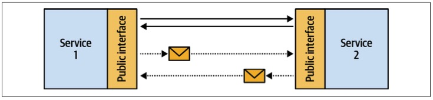

*Figure 14-1. Communication between services*

---

Randy Shoup likens a service’s interface to a front door.

> Randy Shoup 将服务的接口比作前门。

All data going into or out of the service has to pass through the front door.

> 所有进出服务的数据都必须通过前门。

Furthermore, a service’s public interface defines the service itself: the functionality exposed by the service.

> 此外，服务的公共接口定义了服务本身：服务公开的功能。

A well-expressed interface is enough to describe the functionality implemented by a service.

> 一个表达良好的接口就足以描述服务实现的功能。

For example, the public interface illustrated in Figure 14-2 explicitly describes the functionality of the service.

> 例如，图14-2 所示的公共接口明确地描述了服务的功能。

*Figure 14-2. A service’s public interface*

This takes us to the definition of microservice.

> 这就引出了微服务的定义。

# What Is a Microservice?

The definition of a microservice is surprisingly simple.

> 微服务的定义非常简单。

Since a service is defined by its public interface, a microservice is a service with a micro-public interface: a micro-front door.

> 由于服务是由其公共接口定义的，因此微服务是具有微公共接口的服务：微前门。

---

Having a micro-public interface makes it easier to understand both the function of a single service and its integration with other system components.

> 使用微公共接口可以更容易地理解单个服务的功能及其与其他系统组件的集成。

Reducing a service’s functionality also limits its reasons for change and makes the service more autonomous-自治的 for development, management, and scale.

> 减少服务的功能还限制了其更改的原因，并使服务在开发、管理和扩展方面更加自治。

---

In addition, it explains the practice of microservices not exposing their databases.

> 此外，它还解释了微服务不公开其数据库的做法。

Exposing a database, making it a part of the service’s front door, would make its public interface huge.

> 公开数据库，使其成为服务前门的一部分，将使其公共接口变得巨大。

For example, how many different SQL queries can you execute on a relational database?

> 例如，在关系数据库上可以执行多少种不同的SQL查询？

Since SQL is quite a flexible language, the likely estimate would be infinity-无限,无穷.

> 由于SQL是一种相当灵活的语言，因此可能的估计是无限的。

Hence, microservices encapsulate their databases.

> 因此，微服务封装了它们的数据库。

The data can only be accessed through a much more compact-紧凑的, integration-oriented public interface.

> 数据只能通过更紧凑、面向集成的公共接口访问。

## Method as a Service: Perfect Microservices?

> 方法即服务：完美的微服务?

Saying that a microservice is a micro-public interface is deceptively-看似 simple.

> 说微服务是一个微公共接口看起来很简单。

It may sound as though limiting service interfaces to a single method would result in perfect microservices.

> 这听起来好像将服务接口限制为单一方法将导致完美的微服务。

Let’s see what will happen if we apply this naïve decomposition in practice.

> 让我们看看在实践中应用 naïve 分解会发生什么。

---

Consider the backlog management service in Figure 14-3.

> 考虑图14-3 中的积压管理服务。

Its public interface consists of eight public methods, and we want to apply the “one method per service” rule.

> 它的公共接口由八个公共方法组成，我们希望应用“每个服务一个方法”规则。

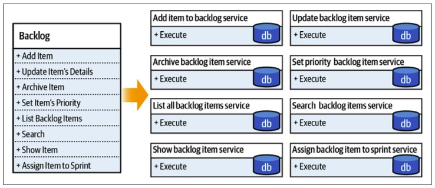

*Figure 14-3. Naïve decomposition*

---

Since these are well-behaved microservices, each encapsulates its database.

> 由于这些都是性能良好的微服务，因此每个微服务都封装了自己的数据库。

No one service is allowed to access another service’s database directly; only through its public interface.

> 不允许任何服务直接访问另一个服务的数据库；只能通过它的公共接口。

But currently, there is no public interface for that.

> 但是目前，还没有公共接口。

The services have to work together and synchronize the changes each service is applying.

> 服务必须协同工作，并同步每个服务应用的更改。

As a result, we need to expand the services’ interfaces to account for these integration-related concerns.

> 因此，我们需要扩展服务的接口来考虑这些与集成相关的问题。

Furthermore, when visualized, the integrations and data flow between the resultant services resemble a typical-典型的 distributed big ball of mud, as shown in Figure 14-4.

> 此外，当可视化时，结果服务之间的集成和数据流就像一个典型的分布式大泥球，如图14-4所示。

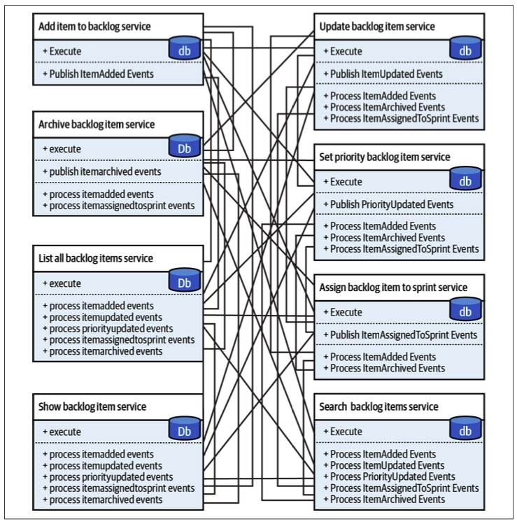

*Figure 14-4. Integration complexity*

Paraphrasing Randy Shoup’s metaphor-比喻, by decomposing the system to such fine-grained services, we definitely minimized the services’ front doors.

> 借用Randy Shoup的比喻，通过将系统分解为这样细粒度的服务，我们确实最小化了服务的前门。

However, to implement the overarching-首要的,总体 system’s functionality, we had to add enormous “staff only” entrances-入口 to each service.

> 然而，为了实现总体系统的功能，我们不得不为每个服务添加大量的“仅限员工”入口。

 Let’s see what we can learn from this example.

> 让我们看看我们能从这个例子中学到什么。

## Design Goal

> 设计目标

Following the simplistic decomposition heuristic-启发式的 of having each service expose only a single method proved to be suboptimal for many reasons.

> 由于许多原因，让每个服务只公开一个方法的简单分解启发式被证明是次优的。

First, it’s simply not possible.

> 首先，这根本不可能。

Since the services have to work together, we were forced-被迫的 to expand-扩展 their public interfaces with integration-related public methods.

> 由于服务必须一起工作，我们被迫使用与集成相关的公共方法来扩展它们的公共接口。

Second, we won the battle but lost the war.

> 第二，我们赢得了战役，但输掉了战争。

Each service ended up being much simpler than the original design, however the resultant system became orders of magnitude more complex.

> 每个服务最终都比最初的设计简单得多，然而最终的系统却变得复杂了几个数量级。

---

The goal of the microservices architecture is to produce a flexible system.

> 微服务架构的目标是生成一个灵活的系统。

Concentrating-使集中,聚集 the design efforts on a single component, but ignoring its interactions with the rest of the system, goes against-违背 the very definition of a system:

> 将设计精力集中在单个组件上，而忽略其与系统其余部分的交互，这违背了系统的定义：

- A set of connected things or devices that operate-运转,工作 together

  > 一组相互连接的东西或设备，它们一起工作

- A set of computer equipment and programs used together for a particular purpose

  > 为特定目的而一起使用的一套计算机设备和程序

Hence, a system cannot be built out of independent components.

> 因此，系统不能由独立的组件构建而成。

In a proper microservices-based system, however decoupled, the services still have to be integrated and communicate with each other.

> 在一个适当的基于微服务的系统中，无论如何解耦，服务仍然必须集成并相互通信。

Let’s take a look at the interplay between the complexity of individual microservices and the complexity of the overarching-总体,首要的 system.

> 让我们看一下单个微服务的复杂性与总体系统的复杂性之间的相互作用。

## System Complexity

Forty years ago, there was no cloud computing, there were no global-scale-全球规模 requirements, and there was no need to deploy a system every 11.7 seconds.

> 40年前，没有云计算，没有全球规模的需求，也没有必要每11.7秒部署一个系统。

But engineers still had to tame-控制 systems’ complexity.

> 但工程师们仍然需要控制系统的复杂性。

Even though the tools in those days were different, the challenges—and more importantly, the solution—are relevant nowadays-如今,现在 and can be applied to the design of microservices-based systems.

> 尽管当时的工具不同，但挑战——更重要的是，解决方案——与现在相关，并且可以应用于基于微服务的系统的设计。

In his book, *Composite/Structured Design*, Glenford J. Myers discusses how to structure procedural-程序上的 code to reduce its complexity. 

> 在他的书 *Composite/Structured Design*, Glenford J. Myers 讨论了如何构建过程代码以降低其复杂性。

On the first page of the book, he writes:

> 在书的第一页，他写道:

There is much more to the subject of complexity than simply attempting to minimize the local-局部的 complexity of each part of a program.

> 复杂性的主题远不止简单地试图最小化程序每个部分的局部复杂性。

A much more important type of complexity is global complexity: the complexity of the overall structure of a program or system (i.e., the degree of association or interdependence among the major pieces of a program).

> 更重要的复杂性类型是全局复杂性：程序或系统的整体结构的复杂性(即，程序主要部分之间的关联或相互依赖的程度)。

---

In our context, *local complexity* is the complexity of each individual microservice, whereas *global complexity* is the complexity of the whole system.

> 在我们的上下文中，“局部复杂性”是指每个微服务的复杂性，而“全局复杂性”是指整个系统的复杂性。

Local complexity depends on the implementation of a service; global complexity is defined by the interactions and dependencies between the services.

> 局部复杂性取决于服务的实现；全局复杂性由服务之间的交互和依赖关系定义。

Which of the complexities is more important to optimize when designing a microservices-based system?

> 在设计基于微服务的系统时，哪一种复杂性更需要优化？

Let’s analyze both extremes.

> 让我们来分析两个极端。

---

It’s surprisingly easy to reduce global complexity to a minimum.

> 将全局复杂性降低到最低是非常容易的。

All we have to do is eliminate-剔除,消除,把…排除在外 any interactions between the system’s components—that is, implement all functionality in one monolithic service.

> 我们所要做的就是消除系统组件之间的任何交互——也就是说，在一个单片服务中实现所有功能。

As we’ve seen earlier, this strategy may work in certain scenarios.

> 正如我们前面看到的，这种策略可能在某些情况下有效。

In others, it may lead to the dreaded big ball of mud: probably the highest possible level of local complexity.

> 在其他情况下，它可能会导致可怕的大泥球：可能是最高级别的局部复杂性。

---

On the other hand, we know what happens when we optimize only the local complexity but neglect-忽略,忽视 the system’s global complexity—the even more dreaded distributed big ball of mud.

> 另一方面，我们知道当我们仅仅优化局部的复杂性，却忽视了系统的全局复杂性时会发生什么——那就是产生更加令人畏惧的分布式大泥球（Distributed Big Ball of Mud）。

This relationship is shown in Figure 14-5.

> 关系如图14-5所示。

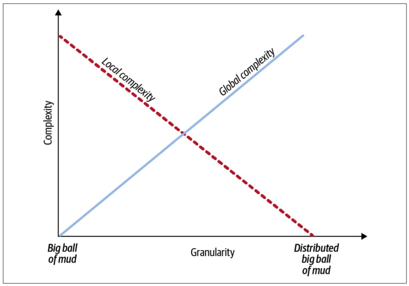

*Figure 14-5. Service granularity and system complexities*

To design a proper microservices-based system, we have to optimize both global and local complexities.

> 为了设计一个合适的基于微服务的系统，我们必须优化全局和局部的复杂性。

Setting the design goal of optimizing either one individually is a local optima-最适条件,最佳状态.

> 设置单独优化其中任何一个的设计目标都是局部最优。

The global optima balances both complexities.

> 全局最优平衡了这两种复杂性。

Let’s see how the notion-概念 of micro-public interfaces **lends itself to**-适合于 balancing global and local complexities.

> 让我们看看微公共接口的概念是如何平衡全局和局部复杂性的。

## Microservices as Deep Services

> 微服务即深度服务

A module in a software system, or any system, for that matter, is defined by its function and logic.

> 软件系统或任何系统中的模块都是由其功能和逻辑定义的。

A *function* is what the module is supposed to do—its business functionality.

> 功能是模块应该做的事情——它的业务功能。

The *logic* is the module’s business logic—how the module implements its business functionality.

> “逻辑”是模块的业务逻辑——模块如何实现其业务功能。

----

In his book, *The* *Philosophy of* *Software* *Design,* John Ousterhout discusses the notion of modularity and proposes a simple yet powerful visual heuristic for evaluating a module’s design: depth.

> John Ousterhout 在他的书《软件设计的哲学》中讨论了模块化的概念，并提出了一种简单而强大的视觉启发式方法来评估模块的设计：深度。

---

Ousterhout proposes to visualize a module as a rectangle-矩形, as shown in Figure 14-6.

> Ousterhout 建议将模块可视化为一个矩形，如图14-6所示。

The rectangle’s top edge represents the module’s function, or the complexity of its public interface.

> 矩形的上边缘表示模块的功能，或者其公共接口的复杂性。

A wider rectangle represents broader functionality, while a narrower one has a more restricted-限制,约束 function and thus a simpler public interface.

> 较宽的矩形表示更广泛的功能，而较窄的矩形具有更受限制的功能，因此具有更简单的公共接口。

The area of the rectangle represents the module’s logic, or the implementation of its functionality.

> 矩形的面积表示模块的逻辑，或其功能的实现。

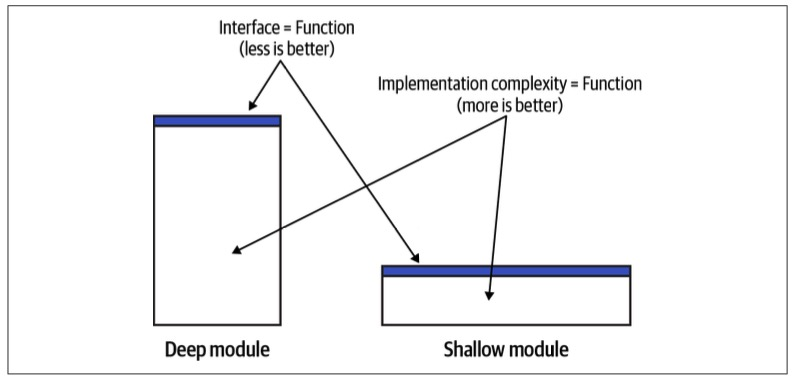

*Figure 14-6. Deep modules*

According to this model, effective modules are deep: a simple public interface encapsulates complex logic.

> 根据这个模型，有效的模块是深度的：一个简单的公共接口封装了复杂的逻辑。

Ineffective modules are shallow-浅的,不深的: a shallow module’s public interface encapsulates much less complexity than a deep module. 

> 无效的模块是浅的：浅的模块的公共接口封装的复杂性要比深的模块少得多。

Consider the method in the following listing:

> 考虑下面清单中的方法：

~~~java
int AddTwoNumbers(int a, int b) {
  return a + b; 
}
~~~

This is the extreme case of a shallow module: the public interface (the method’s signature) and its logic (the methods) are exactly the same.

> 这是浅模块的极端情况：公共接口(方法的签名)和它的逻辑(方法)完全相同。

Having such a module introduces extraneous-无关的,外来的 “moving parts,” and thus, instead of encapsulating complexity, it adds accidental complexity to the overarching system.

> 拥有这样的模块会引入无关的“活动部件”，因此，它不是封装复杂性，而是给总体系统增加了意外的复杂性。

## Microservices as Deep Modules

> 作为深度模块的微服务

Apart from different terminology, the notion of deep modules differs from the micro‐services pattern in that the modules can denote both logical and physical boundaries, while microservices are strictly-严格地 physical.

> 除了不同的术语外，深度模块的概念与微服务模式的不同之处在于，模块可以表示逻辑和物理边界，而微服务则是严格的物理边界。

Otherwise, both concepts and their underlying design principles are the same.

> 否则，这两个概念及其基本设计原则是相同的。

---

The services implementing a single business method, shown in Figure 14-3, are shallow-浅的 modules.

> 实现单一业务方法的服务，如图14-3所示，是浅模块。

Because we had to introduce integration-related public methods, the resultant-因而发生的 interfaces are “wider” than they should have been.

> 因为我们必须引入与集成相关的公共方法，所以生成的接口比它们应该的“更宽”。

---

From a system complexity standpoint-角度,观点, a deep module reduces the system’s global-全局的 complexity, while a shallow module increases it by introducing a component that doesn’t encapsulate its local complexity.

> 从系统复杂性的角度来看，深层模块降低了系统的全局复杂性，而浅层模块通过引入一个不封装其局部复杂性的组件来增加系统的全局复杂性。

---

Shallow services are also the reason why so many microservices-oriented-朝向,面对 projects fail.

> 浅服务也是许多面向微服务的项目失败的原因。

The mistaken definitions of a microservice as a service having no more than *X* lines of code, or as a service that should be easier to rewrite than to modify, concentrate-使集中,聚集 on the individual service while missing the most important aspect of the architecture: the system.

> 将微服务错误地定义为不超过X行代码的服务，或者将其定义为重写比修改更容易的服务，这些错误的定义集中在单个服务上，而忽略了架构中最重要的方面：系统。

---

The threshold upon which a system can be decomposed into microservices is defined by the use cases of the system that the microservices are a part of.

> 系统可以分解为微服务的阈值由微服务所在系统的用例定义。

If we decompose a monolith into services, the cost of introducing a change goes down.

> 如果我们将一个整体分解为多个服务，那么引入变更的成本就会降低。

It is minimized when the system is decomposed into microservices.

> 当系统被分解为微服务时，它被最小化。

However, if you keep decomposing past the microservices threshold, the deep services will become more and more shallow. 

> 然而，如果你继续分解超过微服务阈值，深层服务将变得越来越浅薄。

Their interfaces will grow back up.

> 它们的界面将重新成长起来。

This time, due to integration needs, the cost of introducing a change will go up as well, and the overall system’s architecture will turn into the dreaded distributed big ball of mud.

> 这一次，由于集成需要，引入变更的成本也将上升，并且整个系统的体系结构将变成可怕的分布式大泥球。

This is depicted in Figure 14-7.

> 如图14-7所示。

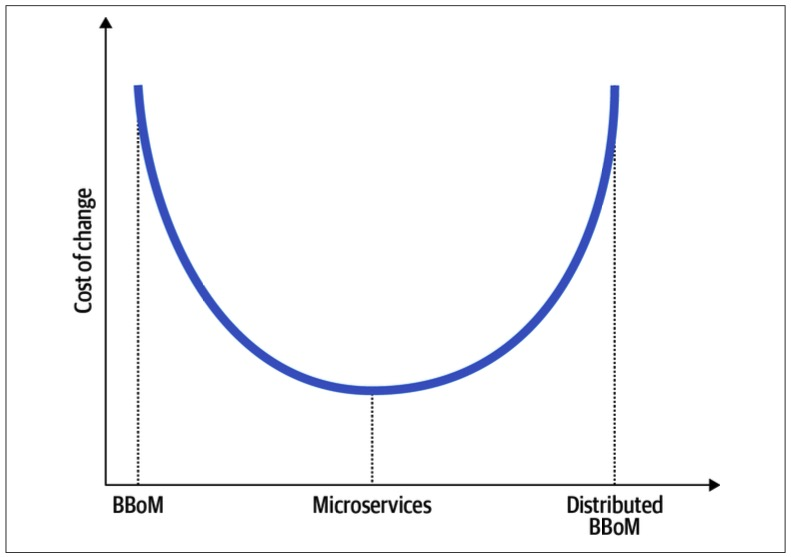

*Figure 14-7. Granularity-粒度 and cost of change*

Now that we’ve learned what microservices are, let’s take a look at how domain-driven design can help us find the boundaries of deep services.

> 现在我们已经了解了微服务是什么，让我们看看领域驱动设计如何帮助我们找到深度服务的边界。

# Domain-Driven Design and Microservices’ Boundaries

> 领域驱动设计和微服务边界

As microservices, many of the domain-driven design patterns discussed in the previous chapters are about boundaries: the bounded context is the boundary of a model, a subdomain bounds a business capability, while aggregate and value objects are transactional boundaries.

> 作为微服务，前面章节中讨论的许多领域驱动设计模式都是关于边界的：有界上下文是模型的边界，子领域是业务能力的边界，而聚合对象和值对象是事务边界。

Let’s see which of these boundaries **lends itself**-适合,适宜 to the notion of microservices.

> 让我们看看这些边界中哪一个适合微服务的概念。

## Bounded Contexts

The microservices and bounded context patterns have a lot in common, so much so that the patterns are often used interchangeably-可交换地.

> 微服务和有界上下文模式有很多共同之处，以至于这些模式经常可以互换使用。

Let’s see whether that’s really the case: do bounded contexts’ boundaries correlate-相互关联 with the boundaries of effective microservices?

> 让我们看看情况是否真的如此：有界上下文的边界是否与有效微服务的边界相关?

---

Both microservices and bounded contexts are physical boundaries.

> 微服务和有界上下文都是物理边界。

Microservices, as bounded contexts, are owned by a single team.

> 微服务作为有界上下文，由单个团队拥有。

As in bounded contexts, conflicting-争执,争论 models cannot be implemented in a microservice, resulting in complex interfaces. 

> 在有界上下文中，冲突的模型不能在微服务中实现，从而导致复杂的接口。

Microservices are indeed-实际上,的确 bounded contexts.

> 微服务实际上是有界上下文。

But does this relationship work the other way around?

> 但是这种关系反过来也会起作用吗?

Can we say that bounded contexts are microservices?

> 我们能说有界上下文就是微服务吗?

---

As you learned in Chapter 3, bounded contexts protect the consistency of ubiquitous languages and models.

> 正如您在第3章中所学到的，有界上下文保护了通用语言和模型的一致性。

No conflicting models can be implemented in the same bounded context.

> 在相同的有界上下文中不能实现冲突的模型。

Say you are working on an advertising management system.

> 假设你正在做一个广告管理系统。

In the system’s business domain, the business entity Lead is represented by different models in the Promotions-促销,推销 and Sales contexts.

> 在系统的业务域中，业务实体 Lead 由促销和销售上下文中的不同模型表示。

Hence, Promotions and Sales are bounded contexts, each defining one and only one model of the Campaign entity, which is valid in its boundary, as shown in Figure 14-8.

> 因此，促销和销售是有界上下文，每个上下文定义一个且只有一个 Campaign 实体的模型，该模型在其边界内有效，如图14-8所示。

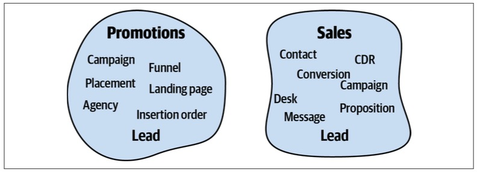

*Figure 14-8. Bounded contexts*

For simplicity’s sake, let’s assume there are no other conflicting models in the system besides-除…以外 Lead.

> 为简单起见，我们假设系统中除了 Lead 之外没有其他冲突模型。

This makes the resultant bounded contexts naturally wide—each bounded context can contain multiple subdomains.

> 这使得生成的有界上下文自然地很广 —— 每个有界上下文可以包含多个子域。

The subdomains can be moved from one bounded context to another one.

> 子域可以从一个有界上下文移动到另一个有界上下文。

**As long as**-只要 the subdomains do not imply conflicting models, all the alternative decompositions in Figure 14-9 are perfectly valid bounded contexts.

> 只要子域不意味着冲突的模型，图14-9中的所有可选分解都是完全有效的有界上下文。

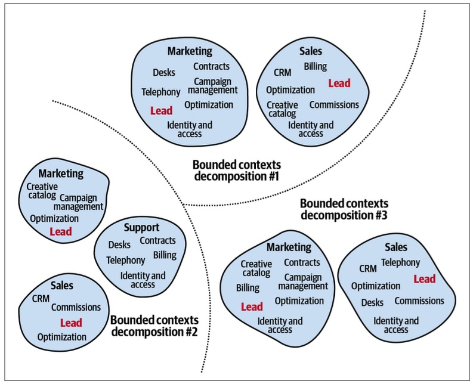

*Figure 14-9. Alternative decompositions to bounded contexts*

The different decompositions to bounded contexts attribute different requirements, such as different teams’ sizes and structures, lifecycle dependencies, and so on.

> 对有界上下文的不同分解赋予了不同的需求属性，例如不同的团队规模和结构、生命周期依赖，等等。

But can we say that all the valid bounded contexts in this example are necessarily microservices?

> 但是我们能说这个例子中所有有效的有界上下文都是微服务吗?

No. 

Especially considering the relatively wide functionalities of the two bounded contexts in decomposition 1.

> 特别是考虑到分解1中两个有界上下文的相对广泛的功能。

---

Therefore, the relationship between microservices and bounded contexts is not symmetric-对称的.

> 因此，微服务和有界上下文之间的关系不是对称的。

Although microservices are bounded contexts, not every bounded context is a microservice.

> 虽然微服务是有界上下文，但并不是每个有界上下文都是微服务。

Bounded contexts, on the other hand, denote the boundaries of the largest valid monolith.

> 另一方面，有界上下文表示最大有效单体的边界。

Such a monolith should not be confused-混淆 with a big ball of mud; it’s a viable-可行的 design option that protects the consistency of its ubiquitous language, or its model of the business domain.

> 这样一块单体不应与一个大泥球混淆；这是一种可行的设计选择，可以保护其通用语言或业务领域模型的一致性。

As we will discuss in Chapter 15, such broad boundaries are more effective than microservices in certain cases.

> 正如我们将在第15章讨论的那样，在某些情况下，这种广泛的边界比微服务更有效。

---

Figure 14-10 visually-直观的 demonstrates the relationship between bounded contexts and microservices.

> 图14-10 直观地展示了有界上下文和微服务之间的关系。

The area between the bounded contexts and microservices is safe.

> 边界上下文和微服务之间的区域是安全的。

These are valid design options.

> 这些都是有效的设计选项。

However, if the system is not decomposed into proper bounded contexts or is decomposed past the microservices threshold, it will result in a big ball of mud or a distributed big ball of mud, respectively-分别地.

> 但是，如果没有将系统分解为适当的有界上下文，或者分解超过了微服务阈值，则将分别导致大泥球或分布式大泥球。

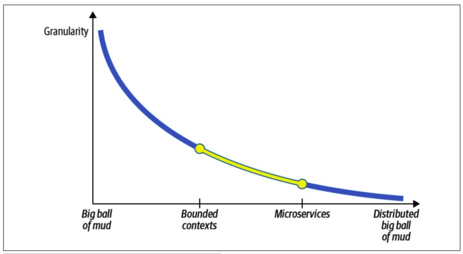

*Figure 14-10. Granularity-粒度 and modularity*

Next, let’s examine the other extreme-极端: whether aggregates can help find the microservices’ boundaries.

> 接下来，让我们看看另一个极端：聚合是否可以帮助找到微服务的边界。

## Aggregates

> 聚合

While bounded contexts impose-强加于 limits on the widest valid boundaries, the aggregate pattern does the opposite.

> 虽然有界上下文对最宽的有效边界施加了限制，但聚合模式的作用正好相反。

The aggregate’s boundary is the narrowest boundary possible.

> 聚合的边界是可能的最窄的边界。

Decomposing an aggregate into multiple physical services, or bounded contexts, is not only suboptimal but, as you will learn in Appendix A, leads to undesired consequences, to say the least.

> 将聚合分解为多个物理服务或有界上下文不仅是次优的，而且正如您将在附录A中了解到的那样，至少会导致不期望的结果。

---

As bounded contexts, aggregates’ boundaries are also often considered to drive the boundaries of microservices.

> 作为有界上下文，聚合的边界也经常被认为驱动微服务的边界。

An aggregate is an indivisible business functionality unit that encapsulates the complexities of its internal business rules, invariants, and logic.

> 聚合是一个不可分割的业务功能单元，它封装了其内部业务规则、不变量和逻辑的复杂性。

That said, as you learned earlier in this chapter, microservices are not about individual services.

> 也就是说，正如你在本章前面学到的，微服务不是关于单个服务的。

An individual service has to be considered in the context of its interactions with other components of the system:

> 必须在与系统其他组件交互的上下文中考虑单个服务：

---

Does the aggregate in question communicate with other aggregates in its subdomain?

> 有问题的聚合是否与其子域中的其他聚合通信？

- Does it share value objects with other aggregates?

  > 它是否与其他聚合共享值对象?

- How likely will the aggregate’s business logic changes affect other components of the subdomain and vice versa?

  > 聚合的业务逻辑更改有多大可能影响子域的其他组件，反之亦然?

The stronger the aggregate’s relationship is with the other business entities of its subdomain, the shallower-浅薄 it will be as an individual service.

> 聚合与其子域的其他业务实体的关系越强，它作为单个服务的作用就越浅薄。

There will be cases in which having an aggregate as a service will produce a modular design.

> 在某些情况下，将聚合作为服务将产生模块化设计。

However, much more often such fine-grained services will increase the overarching system’s global complexity.

> 然而，这种细粒度的服务往往会增加总体系统的全局复杂性。

## Subdomains

> 子域

A more balanced heuristic for designing microservices is to align the services with the boundaries of business subdomains.

> 设计微服务的一个更平衡的启发式方法是使服务与业务子域的边界保持一致。

As you learned in Chapter 1, subdomains are correlated with fine-grained business capabilities.

> 正如您在第1章中所了解的，子域与细粒度业务功能相关联。

These are the business building blocks required for the company to compete in its business domain(s).

> 这些是公司在其业务领域竞争所需的业务构建块。

From a business domain perspective, subdomains describe the capabilities—what the business does—without explaining how the capabilities are implemented.

> 从业务域的角度来看，子域描述了功能(业务做什么)，但没有解释功能是如何实现的。

From a technical standpoint, subdomains represent sets of coherent use cases: using the same model of the business domain, working on the same or closely related data, and having a strong functional relationship.

> 从技术角度来看，子域表示一致用例的集合：使用业务域的相同模型，处理相同或密切相关的数据，并具有强大的功能关系。

A change in the business requirements of one of the use cases is likely to affect the other use cases, as shown in Figure 14-11.

> 其中一个用例的业务需求变更可能会影响到其他用例，如图14-11所示。

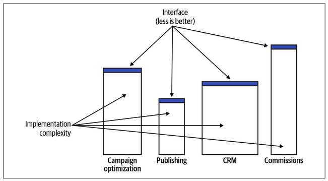

*Figure 14-11. Subdomains*

The subdomains’ granularity-粒度 and the focus on the functionality—the “what” rather than the “how”—makes subdomains naturally deep modules.

> 子域的粒度和对功能的关注——“做什么”而不是“怎么做”——使子域自然地成为深度模块。

A subdomain’s description—the function—encapsulates the more complex implementation details—the logic.

> 子域的描述(函数)封装了更复杂的实现细节(逻辑)。

The coherent nature of the use cases contained in a subdomain also ensures the resultant module’s depth.

> 子域中包含的用例的一致性也保证了结果模块的深度。

Splitting them apart in many cases would result in a more complex public interface and thus shallower modules.

> 在许多情况下，将它们分开会导致更复杂的公共接口和更浅的模块。

All of these things make sub‐domains a safe boundary for designing microservices.

> 所有这些使得子域成为设计微服务的安全边界。

---

Aligning microservices with subdomains is a safe heuristic that produces optimal solutions for the majority of microservices.

> 将微服务与子域对齐是一种安全的启发式方法，可以为大多数微服务产生最佳解决方案。

That said, there will be cases where other boundaries will be more efficient; for example, staying in the wider, linguistic-语言的,语言学的 boundaries of the bounded context or, due to nonfunctional requirements, resorting to an aggregate as a microservice.

> 也就是说，在某些情况下，其他边界会更有效；例如，保持在有界上下文的更广泛的语言边界中，或者由于非功能性需求，将聚合作为微服务。

The solution depends not only on the business domain but also on the organization’s structure, business strategy, and nonfunctional requirements.

> 解决方案不仅依赖于业务领域，还依赖于组织的结构、业务策略和非功能需求。

As we discussed in Chapter 11, it’s crucial to continuously adapt the software architecture and design to changes in the environment.

> 正如我们在第11章中所讨论的，不断调整软件架构和设计以适应环境的变化是至关重要的。

# Compressing Microservices’ Public Interfaces

> 压缩微服务的公共接口

In addition to finding service boundaries, domain-driven design can help make services deeper.

> 除了找到服务边界之外，领域驱动的设计还可以帮助使服务更深入。

This section demonstrates how the open-host service and anticorruption layer patterns can simplify the microservices’ public interfaces.

> 本节将演示开放主机服务和反腐败层模式如何简化微服务的公共接口。

## Open-Host Service

> 开放式主机服务

The open-host service decouples the bounded context’s model of the business domain from the model used for integration with other components of the system, as shown in Figure 14-12.

> open-host 服务将业务域的有界上下文模型与用于与系统其他组件集成的模型解耦，如图14-12所示。

---

Introducing the integration-oriented model, the published language, reduces the system’s global complexity.

> 引入面向集成的模型，即发布的语言，降低了系统的全局复杂性。

First, it allows us to evolve the service’s implementation without impacting its consumers: the new implementation model can be translated to the existing published language.

> 首先，它允许我们在不影响其消费者的情况下发展服务的实现：新的实现模型可以转变为现有的已发布语言。

Second, the published language exposes a more restrained model.

> 其次，公开的语言暴露了一种更为克制的模式。

It is designed around integration needs.

> 它是围绕集成需求设计的。

It encapsulates the complexity of the implementation that is not relevant to the service’s consumers.

> 它封装了与服务使用者无关的实现的复杂性。

For example, it can expose less data and in a more convenient model for consumers.

> 例如，它可以为消费者提供更少的数据和更方便的模型。

---

Having a simpler public interface (function) over the same implementation (logic) makes the service “deeper” and contributes to a more effective microservice design.

> 在相同的实现(逻辑)上使用更简单的公共接口(功能)可以使服务“更深入”，并有助于更有效的微服务设计。

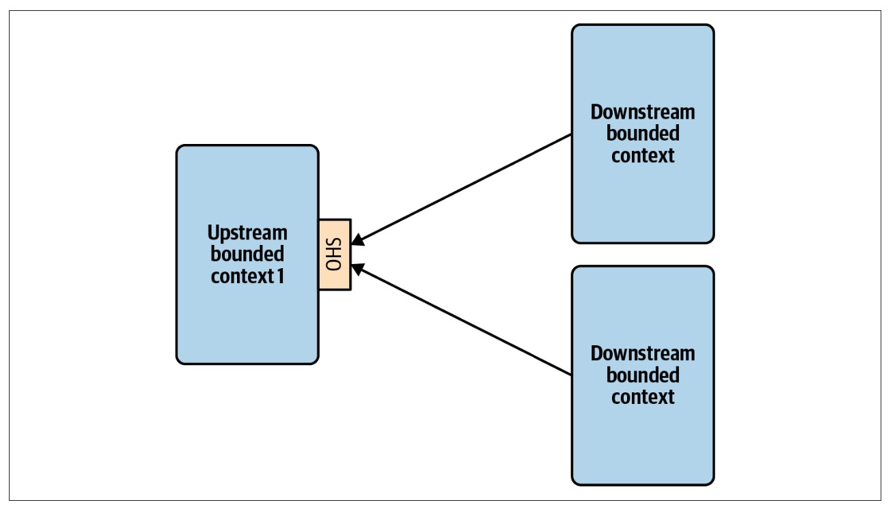

*Figure 14-12. Integrating services through a published language*

## Anticorruption Layer

> 反腐败层

The anticorruption layer (ACL) pattern works the other way around.

> 反腐败层(ACL)模式的工作方式正好相反。

It reduces the complexity of integrating the service with other bounded contexts.

> 它降低了将服务与其他有界上下文集成的复杂性。

Traditionally, the anticorruption layer belongs to the bounded context it protects.

> 传统上，反腐败层属于它所保护的有界上下文。

However, as we discussed in Chapter 9, this notion can be taken a step further and implemented as a standalone service.

> 然而，正如我们在第9章中讨论的那样，这个概念可以更进一步，作为一个独立的服务来实现。

---

The ACL service in Figure 14-13 reduces both the local complexity of the consuming bounded context and the system’s global complexity.

> 图14-13 中的ACL服务既降低了消费边界上下文的局部复杂度，又降低了系统的全局复杂度。

The consuming bounded context’s business complexity is separated from the integration complexity.

> 消费有界上下文的业务复杂性与集成复杂性是分离的。

The latter is offloaded to the ACL service.

> 后者被卸载到ACL服务。

Because the consuming bounded context is working with a more convenient, integration-oriented model, its public interface is compressed-压缩—it doesn’t reflect the integration complexity exposed by the producing service.

> 因为消费的有界上下文使用的是更方便的面向集成的模型，所以它的公共接口被压缩了——它不反映生产服务暴露的集成复杂性。

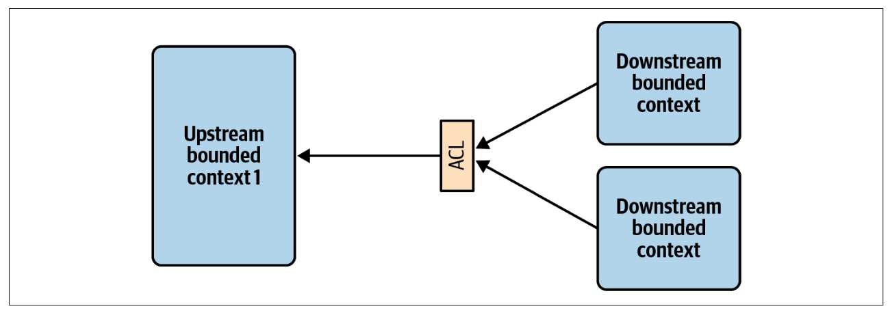

*Figure 14-13. Anticorruption layer as a stand-alone service*

# Conclusion

> 总结

Historically, the microservice-based architectural style is deeply interconnected-互相联系 with domain-driven design, so much so that the terms *microservice* and *bounded context* are often used interchangeably.

> 从历史上看，基于微服务的架构风格与领域驱动的设计紧密相连，以至于术语“微服务”和“有界上下文”经常互换使用。

In this chapter, we analyzed the connection between the two and saw that they are not the same thing.

> 在本章中，我们分析了两者之间的联系，发现它们不是一回事。

---

All microservices are bounded contexts, but not all bounded contexts are necessarily microservices.

> 所有微服务都是有界上下文，但并非所有有界上下文都是微服务。

In its essence-本质,精华, a microservice defines the smallest valid boundary of a service, while a bounded context protects the consistency of the encompassed-包含,包括 model and represents the widest valid boundaries.

> 从本质上讲，微服务定义了服务的最小有效边界，而有界上下文保护了所包含模型的一致性，并代表了最宽的有效边界。

Defining boundaries to be wider than their bounded contexts will result in a big ball of mud, while boundaries that are smaller than microservices will lead to a distributed big ball of mud.

> 将边界定义为比有界上下文更宽的将导致一个大泥球，而比微服务小的边界将导致一个分布式的大泥球。

---

Nevertheless-然而,不过, the connection between microservices and domain-driven design is tight-紧密的.

> 然而，微服务和领域驱动设计之间的联系是紧密的。

We saw how domain-driven design tools can be used to design effective microservice boundaries.

> 我们看到了如何使用领域驱动的设计工具来设计有效的微服务边界。

---

In Chapter 15, we will continue discussing high-level system architecture but from a different perspective: asynchronous integration through event-driven architecture.

> 在第15章中，我们将从不同的角度继续讨论高级系统架构：通过事件驱动架构进行异步集成。

You will learn how to leverage the different kinds of event messages to further optimize microservices’ boundaries.

> 您将学习如何利用不同类型的事件消息来进一步优化微服务的边界。

