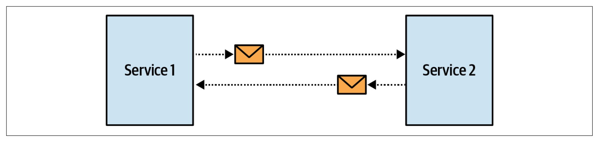
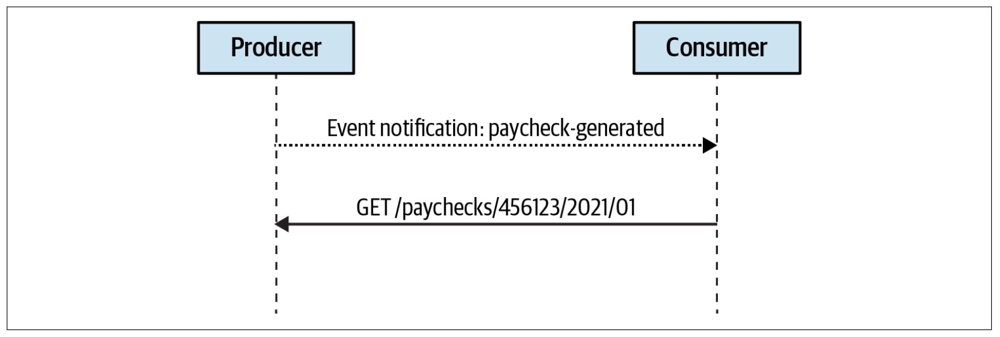
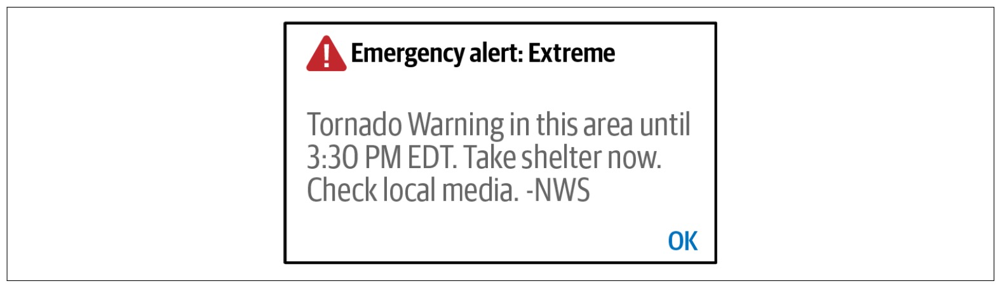
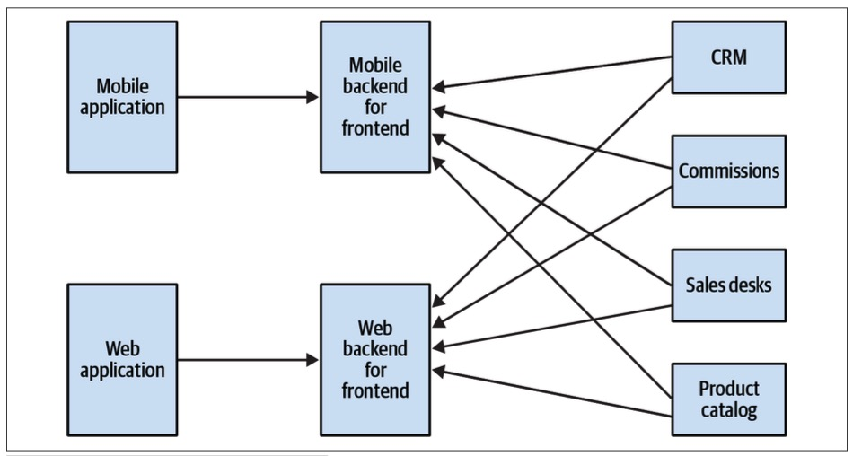
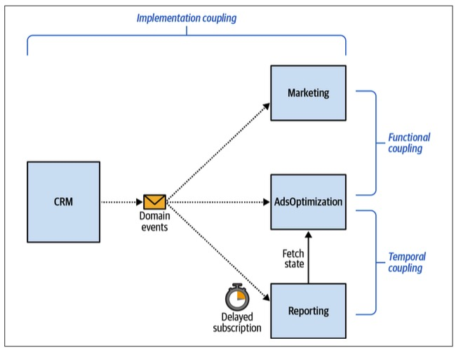
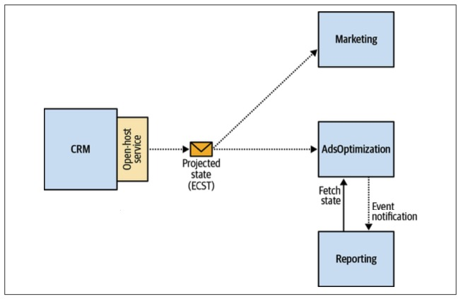

> Chapter 15. Event-Driven Architecture
>
> 事件驱动架构

As microservices, event-driven architecture (EDA) is ubiquitous in modern distributed systems.

> 作为微服务，事件驱动架构(EDA)在现代分布式系统中无处不在。

Many advise-通知,建议 using event-driven communication as the default integration mechanism when designing loosely-宽松地 coupled, scalable, fault-tolerant-容错性 distributed systems.

> 许多人建议在设计松耦合、可伸缩、容错的分布式系统时，使用事件驱动的通信作为默认集成机制。

---

Event-driven architecture is often linked to domain-driven design.

> 事件驱动的体系结构通常与领域驱动的设计相关联。

After all, EDA is based on events, and events are prominent-重要的,著名的 in DDD—we have domain events, and when needed, we even use events as the system’s source of truth.

> 毕竟，EDA是基于事件的，而事件在DDD中很重要——我们有领域事件，在需要的时候，我们甚至使用事件作为系统的事实来源。

It may be tempting-引诱,诱惑 to leverage DDD’s events as the basis for using event-driven architecture.

> 利用DDD的事件作为使用事件驱动体系结构的基础可能很诱人。

But is this a good idea?

> 但这是个好主意吗?

---

Events are not a kind of secret sauce that you can just pour over a legacy system and turn it into a loosely coupled distributed system.

> 事件并不是一种你可以把遗留系统变成松散耦合的分布式系统的秘方。

Quite the opposite: careless application of EDA can turn a modular monolith into a distributed big ball of mud.

> 恰恰相反：EDA的粗心应用可能会把模块化的整体变成一个分散的大泥球。

---

In this chapter, we will explore the interplay between EDA and DDD.

> 在本章中，我们将探讨EDA和DDD之间的相互作用。

You will learn the essential building blocks of event-driven architecture, common causes-原因 for failed EDA projects, and how you can leverage DDD’s tools to design effective, asynchronously integrated systems.

> 您将了解事件驱动体系结构的基本构建块、导致EDA项目失败的常见原因，以及如何利用DDD的工具来设计有效的异步集成系统。

# Event-Driven Architecture

> 事件驱动架构

Stated-陈述,说明 simply, *event-driven architecture* is an architectural style in which a system’s components communicate with one another asynchronously by exchanging event messages (see Figure 15-1).

> 简单地说，事件驱动的体系结构是一种体系结构风格，其中系统的组件通过交换事件消息进行异步通信(参见图15-1)。

Instead of calling the services’ endpoints synchronously, the components publish events to notify other system elements of changes in the system’s domain.

> 组件不是同步调用服务的端点，而是发布事件，将系统域中的更改通知其他系统元素。

The components can subscribe to events raised in the system and react accordingly.

> 组件可以订阅系统中引发的事件并做出相应的反应。

A typical example of an event-driven execution flow is the saga pattern that was described in Chapter 9.

> 事件驱动的执行流的一个典型例子是第9章中描述的传奇模式。

*Figure 15-1. Asynchronous communication*

It’s important to highlight the difference between event-driven architecture and event sourcing.

> 强调事件驱动架构和事件溯源之间的区别是很重要的。

As we discussed in Chapter 7, event sourcing is a method for capturing changes in state as a series of events.

> 正如我们在第7章中所讨论的，事件溯源是一种将状态变化捕获为一系列事件的方法。

---

Although both event-driven architecture and event sourcing are based on events, the two patterns are conceptually different. 

> 尽管事件驱动的体系结构和事件溯源都基于事件，但这两种模式在概念上是不同的。

EDA refers to the communication between services, while event sourcing happens inside a service.

> EDA指的是服务之间的通信，而事件溯源发生在服务内部。

The events designed for event sourcing represent state transitions (of aggregates in an event-sourced domain model) implemented in the service.

> 为事件源设计的事件表示服务中实现的状态转换(事件源域模型中的聚合)。

They are aimed at capturing the intricacies-错综复杂 of the business domain and are not intended to integrate the service with other system components.

> 它们旨在捕获业务领域的复杂性，而不打算将服务与其他系统组件集成。

---

As you will see later in this chapter, there are three types of events, and some are more suited for integration than others.

> 正如您将在本章后面看到的，有三种类型的事件，其中一些比其他的更适合集成。

# Events

In an EDA system, the exchange of events is the key communication mechanism for integrating the components and making them a system.

> 在EDA系统中，事件交换是集成组件并使其成为系统的关键通信机制。

Let’s take a look at events in more detail and see how they differ from messages.

> 让我们更详细地了解事件，看看它们与消息有何不同。

## Events, Commands, and Messages

So far, the definition of an event is similar to the definition of the message pattern.

> 到目前为止，事件的定义与消息模式的定义相似。

However, the two are different.

> 然而，这两者是不同的。

An event is a message, but a message is not necessarily an event.

> 事件是一条消息，但消息不一定是事件。

There are two types of messages:

> 有两种类型的消息：

- *Event*

  A message describing a change that has already happened

  > 描述已经发生的更改的消息

- *Command*

  A message describing an operation that has to be carried out

  > 描述必须执行的操作的消息

An event is something that has already happened, whereas a command is an instruction to do something.

> 事件是已经发生的事情，而命令是做某事的指令。

Both events and commands can be communicated asynchronously as messages.

> 事件和命令都可以作为消息进行异步通信。

However, a command can be rejected: the command’s target can refuse to execute the command, for example, if the command is invalid or if it contradicts the system’s business rules.

> 但是，命令可以被拒绝：命令的目标可以拒绝执行命令，例如，如果命令无效或与系统的业务规则相矛盾。

A recipient of an event, on the other hand, cannot cancel the event.

> 另一方面，事件的接收者不能取消该事件。

The event describes something that has already happened.

> 事件描述的是已经发生的事情。

The only thing that can be done to overturn-推翻,撤销 an event is to issue a compensating-补偿 action—a command, as it’s carried out in the saga pattern.

> 要推翻一个事件，唯一可以做的就是发出一个补偿动作——命令，就像在saga模式中执行的那样。

---

Since an event describes something that has already happened, an event’s name should be formulated-确切表达,制定,规划 in the past tense: for example, DeliveryScheduled, ShipmentCompleted, or DeliveryConfirmed.

> 由于事件描述的是已经发生的事情，因此事件的名称应该用过去时态表示：例如，DeliveryScheduled、ShipmentCompleted或DeliveryConfirmed。

## Structure

An event is a data record that can be serialized and transmitted using the messaging platform of choice.

> 事件是可以使用所选择的消息传递平台序列化和传输的数据记录。

A typical event schema includes the event’s metadata and its payload—the information communicated by the event:

> 一个典型的事件模式包括事件的元数据和它的有效负载——由事件传递的信息：

~~~json
{
    "type": "delivery-confirmed",
    "event-id": "14101928-4d79-4da6-9486-dbc4837bc612",
    "correlation-id": "08011958-6066-4815-8dbe-dee6d9e5ebac",
    "delivery-id": "05011927-a328-4860-a106-737b2929db4e",
    "timestamp": 1615718833,
    "payload": {
        "confirmed-by": "17bc9223-bdd6-4382-954d-f1410fd286bd",
        "delivery-time": 1615701406
    }
}
~~~

An event’s payload not only describes the information conveyed by the event, but also defines the event’s type.

> 事件的有效负载不仅描述了事件所传递的信息，而且还定义了事件的类型。

Let’s discuss the three types of events in detail and how they differ from one another.

> 让我们详细讨论这三种类型的事件以及它们之间的区别。

## Types of Events

Events can be categorized into one of three types：event notification, event-carried state transfer, or domain events.

> 事件可以分为以下三种类型之一：事件通知、事件携带状态转移或域事件。

### Event notification

An event notification is a message regarding a change in the business domain that other components will react to.

> 事件通知是关于其他组件将对业务域中的更改作出反应的消息。

Examples include PaycheckGenerated and CampaignPublished, among others.

> 例子包括PaycheckGenerated和CampaignPublished等。

---

The event notification should not be verbose-冗长的,啰嗦的: the goal is to notify the interested parties about the event, but the notification shouldn’t carry all the information needed for the subscribers to react to the event.

> 事件通知不应冗长：目标是通知有关事件的各方，但通知不应包含订阅者对事件作出反应所需的所有信息。

For example:

~~~json
{
    "type": "paycheck-generated",
    "event-id": "537ec7c2-d1a1-2005-8654-96aee1116b72",
    "delivery-id": "05011927-a328-4860-a106-737b2929db4e",
    "timestamp": 1615726445,
    "payload": {
        "employee-id": "456123",
        "link": "/paychecks/456123/2021/01"
    }
}
~~~

In the preceding-先前的,前面的 code, the event notifies the external components of a paycheck that was generated.

> 在前面的代码中，事件通知外部组件已生成的薪水支票。

It doesn’t carry all the information related to the paycheck-薪水.

> 它没有包含与薪水有关的所有信息。

Instead, the receiver can use the link to fetch more detailed information.

> 相反，接收者可以使用该链接获取更详细的信息。

This notification flow is depicted-描述,描绘 in Figure 15-2.

> 该通知流程如图15-2所示。

*Figure 15-2. Event* *notification flow*

In a sense, integration through event notification messages is similar to the Wireless-无线的 Emergency-紧急情况 Alert (WEA) system in the United States and EU-Alert in Europe (see Figure 15-3).

> 从某种意义上说，通过事件通知消息进行集成类似于美国的无线紧急警报(WEA)系统和欧洲的EU-Alert系统(如图15-3所示)。

The systems use cell-手机 towers to broadcast short messages, notifying citizens about public health concerns, safety threats, and other emergencies.

> 该系统使用手机信号塔广播短消息，通知市民有关公共卫生问题、安全威胁和其他紧急情况。

The systems are limited to sending messages with a maximum length of 360 characters.

> 该系统限制发送的消息的最大长度为360个字符。

This short message is enough to notify you about the emergency, but you have to proactively-主动地,积极 use other information sources to get more details.

> 这条短消息足以通知您有关紧急情况，但您必须主动使用其他信息源以获得更多详细信息。

*Figure 15-3. Emergency alert system*

Succinct-简洁的,简明的 event notifications can be preferable in multiple scenarios.

> 在多个场景中，简洁的事件通知可能更可取。

Let’s take a closer look at two: security and concurrency.

> 让我们仔细看看其中两个：安全性和并发性。

---

**Security.**

> 安全

Enforcing the recipient to explicitly query for the detailed information prevents sharing sensitive-敏感的 information over the messaging infrastructure and requires additional authorization of the subscribers to access the data.

> 强制接收方显式查询详细信息会阻止在消息传递基础结构上共享敏感信息，并且需要订阅者的额外授权才能访问数据。

**Concurrency.** 

> 并发性

Due to the asynchronous nature of event-driven integration, the information can already be rendered-使成为,使处于某种状态 stale-陈旧 when it reaches the subscribers.

> 由于事件驱动集成的异步特性，当信息到达订阅者时，它可能已经过时了。

If the information’s nature is sensitive to race-竞争 conditions, querying it explicitly allows getting the up-to-date state.

> 如果信息的性质对竞争条件敏感，则显式查询它允许获得最新状态。

---

Furthermore, in the case of concurrent consumers, where only one subscriber should process an event, the querying process can be integrated with pessimistic-悲观的 locking.

> 此外，在并发消费者的情况下，只有一个订阅者应该处理一个事件，查询过程可以与悲观锁定集成。

This ensures the producer’s side that no other consumer will be able to process the message.

> 这确保了生产者一方没有其他消费者能够处理消息。

### Event-carried state transfer

> 事件携带状态转移

Event-carried state transfer (ECST) messages notify subscribers about changes in the producer’s internal state.

> 事件携带状态传输(ECST)消息通知订阅者生产者内部状态的变化。

Contrary to event notification messages, ECST messages include all the data reflecting the change in the state.

> 与事件通知消息相反，ECST消息包含反映状态更改的所有数据。

---

ECST messages can come in two forms.

> ECST消息可以有两种形式。

The first is a complete snapshot of the modified entity’s state:

> 第一个是被修改实体状态的完整快照：

~~~json
{
    "type": "customer-updated",
    "event-id": "6b7ce6c6-8587-4e4f-924a-cec028000ce6",
    "customer-id": "01b18d56-b79a-4873-ac99-3d9f767dbe61",
    "timestamp": 1615728520,
    "payload": {
        "first-name": "Carolyn",
        "last-name": "Hayes",
        "phone": "555-1022",
        "status": "follow-up-set",
        "follow-up-date": "2021/05/08",
        "birthday": "1982/04/05",
        "version": 7
    }
}
~~~

The ECST message in the preceding example includes a complete snapshot of a customer’s updated state.

> 前面示例中的ECST消息包含客户更新状态的完整快照。

When operating large data structures, it may be reasonable to include in the ECST message only the fields that were actually modified:

> 当操作大型数据结构时，在ECST消息中只包含实际修改过的字段可能是合理的：

~~~json
{
    "type": "customer-updated",
    "event-id": "6b7ce6c6-8587-4e4f-924a-cec028000ce6",
    "customer-id": "01b18d56-b79a-4873-ac99-3d9f767dbe61",
    "timestamp": 1615728520,
    "payload": {
        "status": "follow-up-set",
        "follow-up-date": "2021/05/10",
        "version": 8
    }
}
~~~

Whether ECST messages include complete snapshots or only the updated fields, a stream of such events allows consumers to hold a local cache of the entities’ states and work with it.

> 无论ECST消息包括完整的快照还是仅包含更新的字段，此类事件的流都允许消费者持有实体状态的本地缓存并使用它。

Conceptually, using event-carried state transfer messages is an asynchronous data replication mechanism.

> 从概念上讲，使用事件携带状态传输消息是一种异步数据复制机制。

This approach makes the system more fault tolerant, meaning that the consumers can continue functioning even if the producer is not available.

> 这种方法使系统更具容错性，这意味着即使生产者不可用，消费者也可以继续工作。

It is also a way to improve the performance of components that have to process data from multiple sources.

> 它也是提高必须处理来自多个数据源的数据的组件的性能的一种方法。

Instead of querying the data sources each time the data is needed, all the data can be cached locally, as shown in Figure 15-4.

> 如图15-4所示，所有的数据都可以在本地缓存，而不是每次需要查询数据源。

*Figure 15-4. Backend for frontend*

### Domain event

The third type of event message is the domain event that we described in Chapter 6.

> 第三种类型的事件消息是我们在第6章中描述的域事件。

In a way, domain events are somewhere between event notification and ECST messages: they both describe a significant event in the business domain, and they contain all the data describing the event.

> 在某种程度上，域事件介于事件通知和ECST消息之间：它们都描述业务域中的重要事件，并且它们包含描述该事件的所有数据。

Despite the similarities, these types of messages are conceptually different.

> 尽管有相似之处，但这些类型的消息在概念上是不同的。

### Domain events versus event notification

Both domain events and event notifications describe changes in the producer’s business domain.

> 领域事件和事件通知都描述了生产者业务域中的更改。

That said, there are two conceptual differences.

> 也就是说，有两个概念上的区别。

---

First, domain events include all the information describing the event.

> 首先，领域事件包括描述事件的所有信息。

The consumer does not need to take any further action to get the complete picture.

> 消费者不需要采取任何进一步的行动来获得完整的画面。

---

Second, the modeling intent-目的,意图 is different.

> 其次，建模意图不同。

Event notifications are designed with the intent to alleviate-减轻,缓和 integration with other components.

> 事件通知的设计目的是为了减少与其他组件的集成。

Domain events, on the other hand, are intended to model and describe the business domain.

> 另一方面，领域事件旨在对业务领域进行建模和描述。

Domain events can be useful even if no external consumer is interested in them.

> 即使没有外部消费者对域事件感兴趣，域事件也是有用的。

That’s especially true in event-sourced systems, where domain events are used to model all possible state transitions.

> 在事件源系统中尤其如此，其中域事件用于为所有可能的状态转换建模。

Having external consumers interested in all the available domain events would result in suboptimal design.

> 让外部消费者对所有可用的域事件感兴趣将导致次优设计。

We will discuss this in greater detail later in this chapter.

> 我们将在本章后面更详细地讨论这一点。

### Domain events versus event-carried state transfer

The data contained in domain events is conceptually different from the schema of a typical ECST message.

> 域事件中包含的数据在概念上不同于典型ECST消息的模式。

---

An ECST message provides sufficient-足够的,充足的 information to hold a local cache of the producer’s data.

> ECST消息提供了足够的信息来保存生产者数据的本地缓存。

No single domain event is supposed to expose such a rich model.

> 没有任何单一的领域事件可以公开如此丰富的模型。

Even the data included in a specific domain event is not sufficient for caching the aggregate’s state, as other domain events that the consumer is not subscribed to may affect the same fields.

> 甚至特定领域事件中包含的数据也不足以缓存聚合的状态，因为消费者未订阅的其他域事件可能会影响相同的字段。

---

Furthermore, as in the case of notification events, the modeling intent-目的,意图 is different for the two types of messages.

> 此外，与通知事件的情况一样，这两种类型的消息的建模意图是不同的。

The data included in domain events is not intended to describe the aggregate’s state.

> 域事件中包含的数据不是用来描述聚合状态的。

Instead, it describes a business event that happened during its lifecycle.

> 相反，它描述了在其生命周期中发生的业务事件。

---

### Event types: Example

Here is an example that demonstrates the differences between the three types of events.

> 下面的示例演示了这三种类型的事件之间的区别。

Consider the following three ways to represent the event of marriage-结婚,紧密结合,配对:

> 考虑以下三种表达结婚事件的方式：

~~~json
eventNotification = {
    "type": "marriage-recorded",
    "person-id": "01b9a761",
    "payload": {
        "person-id": "126a7b61",
        "details": "/01b9a761/marriage-data"
    }
};
ecst = {
    "type": "personal-details-changed",
    "person-id": "01b9a761",
    "payload": {
        "new-last-name": "Williams"
    }
};
domainEvent = {
    "type": "married",
    "person-id": "01b9a761",
    "payload": {
        "person-id": "126a7b61",
        "assumed-partner-last-name": true
    }
};
~~~

marriage-recorded is an event notification message.

> 婚姻记录是一种事件通知信息。

It contains no information except the fact that the person with the specified ID got married.

> 除了指定ID的人结婚的事实之外，它没有包含任何信息。

It contains minimal information about the event, and the consumers interested in more details will have to follow the link in the details field.

> 它包含关于事件的最少信息，对更多细节感兴趣的消费者必须点击 details 字段中的链接。

---

personal-details-changed is an event-carried state transfer message.

> Personal-details-changed是一个带有事件的状态转移消息。

It describes the changes in the person’s personal details, namely that their last name has been changed.

> 它描述了一个人的个人信息的变化，即他们的姓已经改变了。

The message doesn’t explain the reason why it has changed.

> 这条消息并没有解释它改变的原因。

Did the person get married or divorced?

> 这个人结婚了还是离婚了?

---

Finally, married is a domain event.

It is modeled as close as possible to the nature of the event in the business domain.

> 它的建模尽可能接近业务域中事件的性质。

It includes the person’s ID and a flag indicating whether the person assumed their partner’s name.

> 它包括这个人的身份证和一个标志，表明这个人是否用了他的伴侣的名字。

# Designing Event-Driven Integration

As we discussed in Chapter 3, software design is predominantly-绝大多数,主要地 about boundaries.

> 正如我们在第3章中讨论的，软件设计主要是关于边界的。

Boundaries define what belongs inside, what remains outside, and most importantly, what goes across the boundaries—essentially-本质上,根本上, how the components are integrated with one another.

> 边界定义了什么属于内部，什么留在外部，最重要的是，什么可以跨越边界——本质上，组件是如何相互集成的。

The events in an EDA-based system are first-class design elements, affecting both how the components are integrated and the components’ boundaries themselves.

> 基于EDA的系统中的事件是一级设计元素，它既影响组件的集成方式，也影响组件的边界本身。

Choosing the correct type of event message is what makes (decouples) or breaks (couples) a distributed system.

> 选择正确类型的事件消息是使分布式系统(解耦)或中断(耦合)的关键。

---

In this section, you will learn heuristics for applying different event types.

> 在本节中，您将学习应用不同事件类型的启发式方法。

But first, let’s see how to use events to design a strongly coupled, distributed big ball of mud.

> 但首先，让我们看看如何使用事件来设计一个强耦合的、分布式的大泥球。

## Distributed Big Ball of Mud

Consider the system shown in Figure 15-5.

> 考虑如图15-5所示的系统。

The CRM bounded context is implemented as an event-sourced domain model.

> CRM有界上下文作为事件源域模型实现。

When the CRM system had to be integrated with the Marketing bounded context, the teams decided to leverage the event-sourced data model’s flexibility and let the consumer—in this case, Marketing—subscribe to the CRM’s domain events and use them to project-计划,规划 the model that fits their needs.

> 当CRM系统必须与Marketing有界上下文集成时，团队决定利用事件源数据模型的灵活性，并让消费者(在本例中是Marketing)订阅CRM的域事件，并使用它们来规划适合其需求的模型。

---

When the AdsOptimization bounded context was introduced, it also had to process the information produced by the CRM bounded context.

> 当引入AdsOptimization边界上下文时，它还必须处理由CRM边界上下文产生的信息。

Again, the teams decided to let AdsOptimization subscribe to all domain events produced in the CRM and project the model that fits AdsOptimization’s needs.

> 再一次，团队决定让AdsOptimization订阅CRM中产生的所有域事件，并规划适合AdsOptimization需求的模型。

*Figure 15-5. Strongly coupled distributed system*

Interestingly, both the Marketing and AdsOptimization bounded contexts had to present the customers’ information in the same format, and hence ended up projecting the same model out of the CRM’s domain events: a flattened-变平 snapshot of each customer’s state.

> 有趣的是，Marketing和AdsOptimization的边界上下文都必须以相同的格式呈现客户信息，因此最终从CRM的域事件中投射出相同的模型：每个客户状态的平面化快照。

---

The Reporting bounded context subscribed only to a subset of domain events published by the CRM and used as event notification messages to fetch the calculations performed in the AdsOptimization context.

> Reporting边界上下文仅订阅由CRM发布的域事件子集，并用作事件通知消息来获取在AdsOptimization上下文中执行的计算。

However, since both AdsOptimization bounded contexts use the same events to trigger their calculations, to ensure that the Reporting model is updated the AdsOptimization context introduced a delay.

> 但是，由于两个AdsOptimization边界上下文使用相同的事件来触发它们的计算，因此为了确保Reporting模型得到更新，Reporting上下文引入了延迟。

It processed messages five minutes after receiving them.

> 它会在收到信息后5分钟内进行处理。

---

This design is terrible-糟糕的.

> 这个设计糟透了。

Let’s analyze the types of coupling in this system.

> 让我们分析一下这个系统中的耦合类型。

## Temporal Coupling

The AdsOptimization and Reporting bounded contexts are temporally coupled: they depend on a strict order of execution.

> AdsOptimization和Reporting边界上下文是临时耦合的：它们依赖于严格的执行顺序。

The AdsOptimization component has to finish its processing before the Reporting module is triggered.

> AdsOptimization组件必须在触发Reporting模块之前完成其处理。

If the order is reversed, inconsistent data will be produced in the Reporting system.

> 如果顺序相反，报表系统中将产生不一致的数据。

---

To enforce-实施,执行,迫使 the required execution order, the engineers introduced the processing delay in the Reporting system.

> 为了执行所需的执行命令，工程师在Reporting系统中引入了处理延迟。

This delay of five minutes lets the AdsOptimization component finish the required calculations.

> 这5分钟的延迟让AdsOptimization组件完成所需的计算。

Obviously, this doesn’t prevent incorrect order of execution:

> 显然，这并不能防止错误的执行顺序：

- AdsOptimization may be overloaded and unable to finish the processing in five minutes.

  > AdsOptimization可能会过载，无法在五分钟内完成处理。

- A network issue may delay the delivery of incoming messages to the AdsOptimization service.

  > 网络问题可能会延迟传入消息传递到AdsOptimization服务。

- The AdsOptimization component can experience an outage-断电,中断 and stop processing incoming messages.

  > AdsOptimization组件可能出现停机并停止处理传入消息。

## Functional Coupling

The Marketing and AdsOptimization bounded contexts both subscribed to the CRM’s domain events and ended up implementing the same projection of the customers’ data.

> Marketing和AdsOptimization边界上下文都订阅了CRM的域事件，并最终实现了对客户数据的相同投影。

In other words, the business logic that transforms incoming domain events into a state-based representation was duplicated in both bounded contexts, and it had the same reasons for change: they had to present the customers’ data in the same format. 

> 换句话说，将传入域事件转换为基于状态的表示的业务逻辑在两个有界上下文中都是重复的，并且有相同的更改原因：它们必须以相同的格式表示客户的数据。

Therefore, if the projection was changed in one of the components, the change had to be replicated in the second bounded context.

> 因此，如果在其中一个组件中更改了投影，则必须在第二个有界上下文中复制该更改。

---

That’s an example of functional coupling: multiple components implementing the same business functionality, and if it changes, both components have to change simultaneously.

> 这是功能耦合的一个例子：多个组件实现相同的业务功能，如果发生更改，两个组件必须同时更改。

## Implementation Coupling

This type of coupling is more subtle-微妙的.

> 这种类型的耦合更加微妙。

The Marketing and AdsOptimization bounded contexts are subscribed to all the domain events generated by the CRM’s event- sourced model.

> Marketing和AdsOptimization边界上下文订阅由CRM的事件源模型生成的所有域事件。

Consequently-因此,结果, a change in the CRM’s implementation, such as adding a new domain event or changing the schema of an existing one, has to be reflected in both subscribing bounded contexts!

> 因此，CRM实现中的更改，例如添加新的域事件或更改现有事件的模式，必须在两个订阅的有界上下文中反映出来!

Failing-如果不能 to do so can lead to inconsistent data.

> 如果不这样做，可能会导致数据不一致。

For example, if an event’s schema changes, the subscribers’ projection logic will fail.

> 例如，如果事件的模式更改，订阅者的投影逻辑将失败。

On the other hand, if a new domain event is added to the CRM’s model, it can potentially affect the projected models, and thus, ignoring it will lead to projecting an inconsistent state.

> 另一方面，如果一个新的领域事件被添加到CRM的模型中，它可能会潜在地影响预测的模型，因此，忽略它将导致预测不一致的状态。

## Refactoring the Event-Driven Integration

> 重构事件驱动集成

As you can see, blindly-盲目地,轻率地 pouring-倾注 events on a system makes it neither decoupled nor resilient-有弹性的.

> 正如您所看到的，盲目地将事件倾注到系统中会使系统既不解耦也不具有弹性。

You may assume that this is an unrealistic-不切实际的 example, but unfortunately, this example is based on a true story.

> 你可能认为这是一个不现实的例子，但不幸的是，这个例子是基于一个真实的故事。

Let’s see how the events can be adjusted to improve the design dramatically-剧烈地,明显地.

> 让我们看看如何调整事件以显著改进设计。

---

Exposing all the domain events constituting the CRM’s data model couples the subscribers to the producer’s implementation details.

> 公开构成CRM数据模型的所有域事件，将订阅者与生产者的实现细节耦合起来。

The implementation coupling can be addressed by exposing either a much more restrained set of events or a different type of events.

> 实现耦合可以通过公开一组更受约束的事件或不同类型的事件来解决。

---

The Marketing and AdsOptimization subscribers are functionally coupled to each other by implementing the same business functionality.

> 通过实现相同的业务功能，Marketing和AdsOptimization订阅者在功能上相互耦合。

---

Both implementation and functional coupling can be tackled-应付,解决 by encapsulating the projection logic in the producer: the CRM bounded contexts.

> 实现和功能耦合都可以通过将投影逻辑封装在生产者(CRM有界上下文)中来解决。

Instead of exposing its implementation details, the CRM can follow the consumer-driven contract pattern: project the model needed by the consumers and make it a part of the bounded context’s published language—an integration-specific model, decoupled from the internal implementation model.

> CRM可以遵循消费者驱动的契约模式，而不是公开其实现细节：规划消费者所需的模型，并使其成为有界上下文发布语言的一部分——与内部实现模型解耦的特定于集成的模型。

As a result, the consumers get all the data they need and are not aware of the CRM’s implementation model.

> 因此，消费者获得了他们需要的所有数据，却不知道CRM的实现模型。

---

To tackle the temporal coupling between the AdsOptimization and Reporting bounded contexts, the AdsOptimization component can publish an event notification message, triggering the Reporting component to fetch the data it needs.

> 为了处理AdsOptimization和Reporting有界上下文之间的临时耦合，AdsOptimization组件可以发布事件通知消息，触发Reporting组件获取所需的数据。

This refactored system is shown in Figure 15-6.

> 重构后的系统如图15-6所示。

*Figure 15-6. Refactored system*

## Event-Driven Design Heuristics

> 事件驱动设计启发式

Matching types of events to the tasks at hand makes the resultant design orders of magnitude less coupled, more flexible, and fault tolerant.

> 将事件类型与手头的任务相匹配，可以降低设计的耦合程度、提高灵活性和容错性。

Let’s formulate-确切表达,认真阐述 the design heuristics behind the applied changes.

> 让我们来阐述应用更改背后的设计启发式。

### Assume the worst

> 做最坏的打算

As Andrew Grove put it, only the paranoid-偏执狂 survive-生存,幸免.

> 正如安德鲁·格罗夫所说，只有偏执狂才能生存。

Use this as a guiding principle when designing event-driven systems:

> 在设计事件驱动系统时，将此作为指导原则：

- The network is going to be slow.

  > 网络会很慢。

- Servers will fail at the most inconvenient-不便的,打扰的 moment.

  > 服务器会在最不方便的时候出现故障。

- Events will arrive out of order.

  > 事件将会紊乱。

- Events will be duplicated.

  > 事件将被重复。

Most importantly, these events will occur most frequently on weekends and public holidays.

> 最重要的是，这些活动将最频繁地发生在周末和公众假期。

---

The word *driven* in event-driven architecture means your whole system depends on successful delivery of the messages.

> 事件驱动架构中的“驱动”一词意味着整个系统依赖于消息的成功传递。

Hence, avoid the “things will be okay” mindset like the plague-瘟疫.

> 因此，避免“一切都会好起来”的心态，就像瘟疫一样。

Ensure that the events are always delivered consistently, no matter what:

> 确保事件始终如一地交付，无论发生什么：

- Use the outbox pattern to publish messages reliably.

  > 使用发件箱模式可靠地发布消息。

- When publishing messages, ensure that the subscribers will be able to deduplicate-删除重复数据 the messages and identify and reorder out-of-order messages.

  > 在发布消息时，请确保订阅者能够删除重复的消息，并识别和重新排序无序的消息。

- Leverage the saga and process manager patterns when orchestrating-精心安排 cross-bounded context processes that require issuing compensating actions.

  > 在编排需要发出补偿操作的跨界上下文流程时，利用 saga 和流程管理器模式。

### Use public and private events

> 使用公共和私人事件

Be wary-谨慎的 of exposing implementation details when publishing domain events, especially in event-sourced aggregates.

> 在发布域事件时要小心暴露实现细节，尤其是在事件源聚合中。

Treat events as an inherent-内在的,固有的 part of the bounded context’s public interface.

> 将事件视为有界上下文的公共接口的固有部分。

Therefore, when implementing the open-host service pattern, ensure that the events are reflected in the bounded context’s published language.

> 因此，在实现开放主机服务模式时，请确保事件反映在有界上下文的已发布语言中。

Patterns for transforming event-based models are discussed in Chapter 9.

> 第9章讨论了转换基于事件的模型的模式。

---

When designing bounded contexts’ public interfaces, leverage the different types of events.

> 在设计有界上下文的公共接口时，要利用不同类型的事件。

Event-carried state transfer messages compress-压缩,浓缩 the implementation model into a more compact-紧凑的,紧密的 model that communicates only the information the consumers need.

> 事件携带的状态传输消息将实现模型压缩为一个更紧凑的模型，该模型只传递消费者需要的信息。

---

Event notification messages can be used to further minimize the public interface.

> 事件通知消息可用于进一步最小化公共接口。

---

Finally, sparingly-节俭地,保守地,一点点 use domain events for communication with external bounded contexts.

> 最后，谨慎地使用域事件与外部有界上下文进行通信。

Consider designing a set of dedicated-专用的 public domain events.

> 考虑设计一组专用的公共领域事件。

### Evaluate consistency requirements

> 评估一致性需求

When designing event-driven communication, evaluate the bounded contexts’ consistency requirements as an additional heuristic for choosing the event type:

> 在设计事件驱动的通信时，评估有界上下文的一致性要求，作为选择事件类型的附加启发式：

- If the components can **settle for**-接受 eventually consistent data, use the event-carried state transfer message.

  > 如果组件能够满足于最终一致的数据，则使用事件携带的状态传输消息。

- If the consumer needs to read the last write in the producer’s state, issue an event notification message, with a subsequent query to fetch the producer’s up-to-date state.

  > 如果消费者需要读取生产者状态下的最后一次写入，则发出事件通知消息，并使用随后的查询来获取生产者的最新状态。

# Conclusion

This chapter presented event-driven architecture as an inherent aspect of designing a bounded context’s public interface.

> 本章将事件驱动架构作为设计有界上下文的公共接口的一个固有方面。

You learned the three types of events that can be used for cross-bounded context communication:

> 您学习了可用于跨界上下文通信的三种类型的事件：

*Event* *notification*

> 事件通知

A notification that something important has happened, but requiring the consumer to query the producer for additional information explicitly.

> 通知发生了重要的事情，但要求消费者显式地向生产者查询其他信息。

---

*Event-carried state transfer*

> 事件携带的状态传输

A message-based data replication-复制 mechanism.

> 基于消息的数据复制机制。

Each event contains a snapshot of a state that can be used to maintain a local cache of the producer’s data.

> 每个事件都包含一个状态快照，可用于维护生产者数据的本地缓存。

---

*Domain event*

> 领域事件

A message describing an event in the producer’s business domain.

> 描述生产者业务域中事件的消息。

---

Using inappropriate types of events will derail-阻挠,破坏 an EDA-based system, inadvertently-无意地,不经意地 turning it into a big ball of mud.

> 使用不适当类型的事件会使基于EDA的系统脱轨，不经意间将其变成一个大泥球。

To choose the correct type of events for integration, evaluate the bounded contexts’ consistency requirements and be wary of exposing implementation details.

> 要为集成选择正确的事件类型，请评估有界上下文的一致性需求，并小心暴露实现细节。

Design an explicit-明确的 set of public and private events.

> 设计一组明确的公共和私人事件。

Finally, ensure that the system delivers the messages, even in the face of technical issues and outages.

> 最后，即使面对技术问题和中断，也要确保系统能够传递消息。

