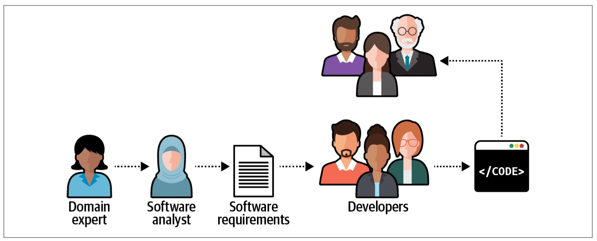
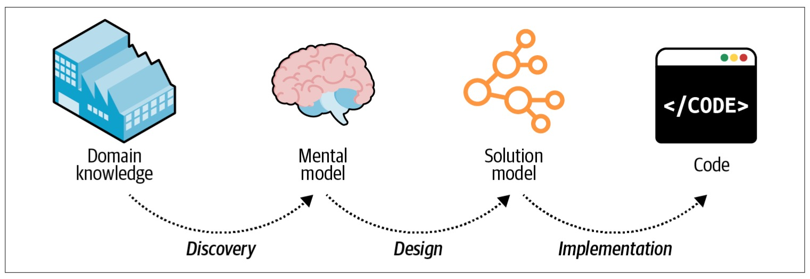

> Chapter 2. Discovering Domain Knowledge
>
> 章节 2. 发现领域知识
>
> *It’s developers’ (mis)understanding, not domain experts’ knowledge, that gets released in production.*
>
> > 在产品中发布的是开发人员的(错误)理解，而不是领域专家的知识
>
> — Alberto Brandolini

In the previous chapter, we started exploring business domains.

You learned how to identify a company’s business domains, or areas of activity, and analyze its strategy to compete-竞争,对抗 in them; that is, its business subdomains’ boundaries and types.

> 你学会了如何识别公司的业务领域或活动领域，并分析其竞争策略；也就是说，它的业务子域的边界和类型。

---

This chapter continues the topic of business domain analysis but in a different dimension: depth.

> 本章继续业务领域分析的主题，但在不同的维度：深度。

It focuses on what happens inside a subdomain: its business function and logic.

> 它关注子域内部发生的事情：它的业务功能和逻辑。

You will learn the domain-driven design tool for effective communication and knowledge sharing: the ubiquitous language.

> 您将学习用于有效沟通和知识共享的领域驱动设计工具：统一语言。

Here we will use it to learn the intricacies of business domains.

> 在这里，我们将使用它来学习业务领域的复杂性。

Later in the book we will use it to model and implement their business logic in software.

> 在本书的后面，我们将使用它在软件中建模和实现它们的业务逻辑。

# Business Problems

> 业务问题

The software systems we are building are solutions to business problems.

> 我们正在构建的软件系统是业务问题的解决方案。

In this context, the word *problem* doesn’t resemble a mathematical problem or a riddle-谜语 that you can solve and be done with.

> 在这种情况下，单词“问题”不像一个数学问题或谜语，你可以解决和完成。

In the context of business domains, “problem” has a broader meaning.

> 在业务领域的上下文中，“问题”具有更广泛的含义。

A business problem can be challenges associated with optimizing workflows and processes, minimizing manual labor, managing resources, supporting decisions, managing data, and so on.

> 业务问题可能是与优化工作流和流程、最小化手工劳动、管理资源、支持决策、管理数据等相关的挑战。

---

Business problems appear both at the business domain and subdomain levels.

> 业务问题出现在业务域和子域级别。

A company’s goal is to provide a solution for its customers’ problems.

> 公司的目标是为客户的问题提供解决方案。

Going back to the FedEx example in Chapter 1, that company’s customers need to ship packages in limited time frames, so it optimizes the shipping process.

> 回到第一章中的联邦快递的例子，该公司的客户需要在有限的时间内运送包裹，因此它优化了运输过程。

---

Subdomains are finer-grained problem domains whose goal is to provide solutions for specific business capabilities-能力,功能.

> 子域是细粒度的问题域，其目标是为特定的业务功能提供解决方案。

A knowledge management subdomain optimizes the process of storing and retrieving-检索 information.

> 知识管理子领域优化了存储和检索信息的过程。

A clearing subdomain optimizes the process of executing financial transactions.

> 清算子域优化了执行金融交易的过程。

An accounting subdomain keeps track of the company’s funds.

> 会计子域跟踪公司的资金。

# Knowledge Discovery

> 知识发现

To design an effective software solution, we have to grasp-理解,领会 at least the basic knowledge of the business domain.

> 为了设计一个有效的软件解决方案，我们必须至少掌握业务领域的基本知识。

As we discussed in Chapter 1, this knowledge belongs to domain experts: it’s their job to specialize-专门研究 in and comprehend-理解,领悟 all the intricacies of the business domain.

> 正如我们在第1章中讨论的那样，这些知识属于领域专家：他们的工作是专门研究和理解业务领域的所有复杂性。

By no means should we, nor can we, become domain experts.

> 我们绝不应该也不能成为领域专家。

That said, it’s crucial for us to understand domain experts and to use the same business terminology-术语 they use.

> 也就是说，了解领域专家并使用他们使用的相同业务术语对我们来说至关重要。

---

To be effective, the software has to mimic-模仿,模拟 the domain experts’ way of thinking about the problem—their mental models.

> 为了提高效率，软件必须模仿领域专家思考问题的方式——他们的心智模型。

Without an understanding of the business problem and the reasoning behind-背后 the requirements, our solutions will be limited to “translating” business requirements into source code.

> 如果不了解业务问题和需求背后的原因，我们的解决方案将仅限于将业务需求“转换”为源代码。

What if the requirements miss a crucial edge-边缘 case?

> 如果需求错过了一个关键的边缘情况怎么办?

Or fail to describe a business concept, limiting our ability to implement a model that will support future requirements?

> 或者无法描述业务概念，从而限制了我们实现支持未来需求的模型的能力?

---

As Alberto Brandolini says, software development is a learning process; working code is a side effect.

> 正如Alberto Brandolini所说，软件开发是一个学习的过程；工作代码是一个副作用。

A software project’s success depends on the effectiveness of knowledge sharing between domain experts and software engineers.

> 软件项目的成功取决于领域专家和软件工程师之间知识共享的有效性。

We have to understand the problem in order to solve it.

> 为了解决问题，我们必须了解问题。

---

Effective knowledge sharing between domain experts and software engineers requires effective communication.

> 领域专家和软件工程师之间有效的知识共享需要有效的沟通。

Let’s take a look at the common impediments-妨碍,障碍 to effective communication in software projects.

> 让我们来看看在软件项目中有效沟通的常见障碍。

# Communication

> 沟通

It’s safe to say that almost all software projects require the collaboration of stakeholders in different roles: domain experts, product owners, engineers, UI and UX designers, project managers, testers, analysts, and others.

> 可以肯定地说，几乎所有的软件项目都需要不同角色的涉众的协作：领域专家、产品所有者、工程师、UI和UX设计师、项目经理、测试人员、分析师等等。

As in any collaborative effort, the outcome depends on how well all those parties can work together.

> 在任何合作努力中，结果取决于所有各方合作的程度。

For example, do all stakeholders agree on what problem is being solved?

> 例如，是否所有利益相关者都同意要解决什么问题?

What about the solution they are building—do they hold any conflicting-争执 assumptions about its functional and nonfunctional requirements?

> 那么他们正在构建的解决方案呢——他们是否对其功能性需求和非功能性需求持有任何相互冲突的假设?

Agreement and alignment on all project-related matters are essential to a project’s success.

> 在所有与项目相关的事项上达成一致和一致是项目成功的关键。

---

Research into why software projects fail has shown that effective communication is essential for knowledge sharing and project success.

Yet, despite its importance, effective communication is rarely observed-观察 in software projects.

> 然而，尽管它很重要，但在软件项目中很少观察到有效的沟通。

Often, businesspeople and engineers have no direct interaction with one another.

Instead, domain knowledge is pushed down from domain experts to engineers.

> 相反，领域知识是从领域专家推给工程师的。

It is delivered through people playing the role of mediators-中介, or “translators,” systems/business analysts, product owners, and project managers.

> 它是通过扮演中介或“翻译”角色的人员、系统/业务分析师、产品所有者和项目经理来交付的。

Such common knowledge sharing flow is illustrated in Figure 2-1.

> 这种公共知识共享流程如图2-1所示。

*Figure 2-1. Knowledge sharing* *flow* *in a* *software* *project*

> 图2-1 软件项目中的知识共享流程

During the traditional software development lifecycle, the domain knowledge is “translated” into an engineer-friendly form known as an *analysis model*, which is a description of the system’s requirements rather than an understanding of the business domain behind it.

> 在传统的软件开发生命周期中，领域知识被“翻译”成一种工程师友好的形式，称为“分析模型”，它是对系统需求的描述，而不是对其背后的业务领域的理解。

While the intentions-意图,目的 may be good, such mediation-调解 is hazardous-危险的,有害的 to knowledge sharing.

> 虽然意图可能是好的，但这种调解对知识共享是有害的。

In any translation, information is lost; in this case, domain knowledge that is essential for solving business problems gets lost on its way to the software engineers.

> 在任何翻译中，信息都会丢失；在这种情况下，对于解决业务问题至关重要的领域知识在传递给软件工程师的过程中丢失了。

This is not the only such translation on a typical software project.

> 这并不是典型软件项目中唯一的翻译。

The analysis model is translated into the software design model (a software design document, which is translated into an implementation model or the source code itself).

> 分析模型被转换为软件设计模型(软件设计文档，被转换为实现模型或源代码本身)。

As often happens, documents go out of date quickly.

> 正如经常发生的那样，文件很快就会过时。

The source code is used to communicate business domain knowledge to software engineers who will maintain the project later.

> 源代码用于将业务领域的知识传达给稍后将维护项目的软件工程师。

Figure 2-2 illustrates the different translations needed for domain knowledge to be implemented in code.

> 图2-2 说明了在代码中实现领域知识所需的不同转换。

*Figure 2-2. Model transformations*

> 图2-2 模型转换

Such a software development process resembles the children’s game Telephone: the message, or domain knowledge, often becomes distorted.

> 这样的软件开发过程类似于儿童的电话游戏：信息或领域知识经常变得扭曲。

The information leads to software engineers implementing the wrong solution, or the right solution but to the wrong problems. 

> 这些信息会导致软件工程师实现错误的解决方案，或者正确的解决方案却产生了错误的问题。

In either case, the outcome is the same: a failed software project.

> 无论哪种情况，结果都是一样的：一个失败的软件项目。

---

Domain-driven design proposes-提议,建议 a better way to get the knowledge from domain experts to software engineers: by using a ubiquitous language.

> 领域驱动设计提出了一种从领域专家向软件工程师获取知识的更好方法：使用统一语言。

# What Is a Ubiquitous Language?

> 什么是统一语言?

Using a ubiquitous language is the cornerstone-基石,基础 practice of domain-driven design.

> 使用统一语言是领域驱动设计的基础实践。

The idea is simple and straightforward: if parties need to communicate efficiently, instead of relying on translations, they have to speak the same language.

> 这个想法简单而直接：如果各方需要有效沟通，而不是依赖翻译，他们必须说同一种语言。

---

Although this notion is borderline-边界的,边缘 common sense, as Voltaire said, “common sense is not so common.”

> 虽然这是一种边缘性的常识，但正如伏尔泰所说，“常识并不那么普遍。”

The traditional software development lifecycle implies the following translations:

> 传统的软件开发生命周期意味着以下转换：

- Domain knowledge into an analysis model

  > 将领域知识转化为分析模型

- Analysis model into requirements

  > 将模型分析为需求

- Requirements into system design

  > 将需求纳入系统设计

- System design into source code

  > 系统设计成源代码

Instead of continuously translating domain knowledge, domain-driven design calls for cultivating-培育 a single language for describing the business domain: the ubiquitous language.

> 领域驱动的设计不需要不断地翻译领域知识，而是需要培养一种描述业务领域的单一语言：通用语言。

---

All project-related stakeholders—software engineers, product owners, domain experts, UI/UX designers—should use the ubiquitous language when describing the business domain.

> 所有与项目相关的利益相关者——软件工程师、产品所有者、领域专家、UI/UX设计师——在描述业务领域时都应该使用通用语言。

Most importantly, domain experts must be comfortable-自在的,自如的 using the ubiquitous language when reasoning about the business domain; this language will represent both the business domain and the domain experts’ mental models.

> 最重要的是，领域专家在对业务领域进行推理时必须能够自如地使用通用语言；这种语言将表示业务领域和领域专家的心智模型。

---

Only through the continuous-连续不断的,持续的 use of the ubiquitous language and its terms can a shared understanding among all of the project’s stakeholders be cultivated.

> 只有通过持续使用统一的语言及其术语，才能在项目的所有涉众之间培养共同的理解。

# Language of the Business

> 业务语言

It’s crucial to emphasize that the ubiquitous language is the language of the business.

> 必须强调的是，统一语言是业务语言。

As such, it should consist of business domain–related terms only.

> 因此，它应该只包含与业务领域相关的术语。

No technical jargon-行话,术语!

> 没有专业术语!

Teaching business domain experts about singletons and abstract factories is not your goal.

> 向业务领域的专家讲授单例和抽象工厂并不是你的目标。

The ubiquitous language aims to frame the domain experts’ understanding and mental models of the business domain in terms that are easy to understand.

> 通用语言旨在用易于理解的术语构建领域专家对业务领域的理解和心理模型。

## Scenarios

> 场景

Let’s say we are working on an advertising campaign management system.

> 假设我们正在开发一个广告活动管理系统。

Consider the following statements:

> 考虑以下陈述：

- An advertising campaign can display different creative materials.

  > 广告活动可以展示不同的创意材料。

- A campaign can be published only if at least one of its placements is active.

  > 广告活动只有在至少一个广告位置处于活动状态时才能发布。

- Sales commissions-佣金 are accounted for after transactions are approved.

  > 销售佣金在交易批准后入账。

All of these statements are formulated-制定,规划 in the language of the business.

> 所有这些陈述都是用业务语言表述的。

That is, they reflect the domain experts’ view of the business domain.

> 也就是说，它们反映了领域专家对业务领域的看法。

---

On the other hand, the following statements are strictly严格地 technical and thus do not fit the notion of the ubiquitous language:

> 另一方面，以下陈述是严格技术性的，因此不符合统一语言的概念:

- The advertisement iframe-内嵌框架 displays an HTML file.

  > 广告内嵌框架显示一个 HTML 文件。

- A campaign can be published only if it has at least one associated record in the active-placements table.

  > 只有在活动放置表中至少有一条相关记录时，才能发布广告系列。

- Sales commissions-佣金 are based on correlated records from the transactions and approved-sales tables.

  > 销售佣金是基于交易和批准销售表的相关记录。

These latter statements are purely-完全地,仅仅 technical and will be unclear to domain experts.

> 后一种说法纯粹是技术性的，对于领域专家来说是不清楚的。

Suppose-假设,假定 engineers are only familiar with this technical, solution-oriented view of the business domain.

> 假设工程师只熟悉业务领域的这种技术性的、面向解决方案的视图。

In that case, they won’t be able to completely understand the business logic or why it operates the way it does, which will limit their ability to model and implement an effective solution.

> 在这种情况下，他们将无法完全理解业务逻辑或业务为何以这种方式运行，这将限制他们建模和实现有效解决方案的能力。

## Consistency

> 一致性

The ubiquitous language must be precise-精确的,准确的 and consistent.

> 统一语言必须是精确和一致的。

It should eliminate-剔除,排除 the need for assumptions and should make the business domain’s logic explicit-明确的,直截了当的.

> 它应该消除对假设的需要，并且应该使业务域明确的逻辑。

---

Since ambiguity-模棱两可,不明确 hinders-阻碍,妨碍 communication, each term of the ubiquitous language should have one and only one meaning.

> 由于歧义阻碍了交流，统一语言的每个术语都应该有且只有一个意思。

Let’s look at a few examples of unclear terminology and how it can be improved.

> 让我们看几个不清楚术语的例子，以及如何改进它。

### Ambiguous terms

> 模棱两可的术语

Let’s say that in some business domain, the term *policy* has multiple meanings: it can mean a regulatory-管理的,控制的 rule or an insurance contract.

> 假设在某些业务领域中，术语“政策”有多种含义：它可以表示监管规则或保险合同。

The exact meaning can be worked out in human-to-human interaction, depending on the context.

> 确切的含义可以在人与人之间的互动中得出，这取决于上下文。

Software, however, doesn’t cope-对付,处理 well with ambiguity, and it can be cumbersome-繁琐的,复杂的 and challenging to model the “policy” entity in code.

> 然而，软件不能很好地处理歧义，并且在代码中对“策略”实体建模可能很麻烦且具有挑战性。

---

Ubiquitous language demands a single meaning for each term, so “policy” should be modeled explicitly using the two terms *regulatory-监管的 rule* and *insurance contract*.

> 通用语言要求每个术语都有单一的含义，因此“政策”应该使用两个术语“监管规则”和“保险合同”来明确建模。

### Synonymous terms

> 同义的术语

Two terms cannot be used interchangeably-可交换地 in a ubiquitous language.

> 在统一语言中，两个术语不能互换使用。

For example, many systems use the term *user*.

> 例如，许多系统使用术语“用户”。

However, a careful examination of the domain experts’ lingo-行话,术语 may reveal that *user* and other terms are used interchangeably: for example, *user*, *visitor*, *administrator*, *account*, etc.

> 然而，仔细检查领域专家的行话可能会发现*用户*和其他术语可以互换使用：例如，*用户*，*访问者*，*管理员*，*帐户*等。

---

Synonymous terms can seem harmless-无害的 at first.

> 同义词一开始似乎是无害的。

However, in most cases, they denote-表示 different concepts.

> 然而，在大多数情况下，它们表示不同的概念。

In this example, both *visitor* and *account* technically refer to the system’s users; however, in most systems, unregistered and registered users represent different roles and have different behaviors.

> 在这个例子中，*visitor*和*account*技术上都是指系统的用户；但是，在大多数系统中，未注册用户和注册用户代表不同的角色，具有不同的行为。

For example, the “visitors” data is used mainly for analysis purposes, whereas “accounts” actually uses the system and its functionality.

> 例如，“访客”数据主要用于分析目的，而“帐户”实际上使用的是系统及其功能。

---

It is preferable to use each term explicitly in its specific context.

> 最好在特定的上下文中明确地使用每个术语。

Understanding the differences between the terms in use allows for building simpler and clearer models and implementations of the business domain’s entities.

> 了解使用中的术语之间的差异，可以构建更简单、更清晰的模型和业务领域实体的实现。

# Model of the Business Domain

> 业务领域的模型

Now let’s look at the ubiquitous language from a different perspective: modeling.

> 现在让我们从另一个角度来看看这种通用语言：建模。

## What Is a Model?

*A model is a* *simplified* *representation of a thing or phenomenon-现象 that intentionally emphasizes certain aspects while ignoring others. Abstraction with a* *specific* *use in mind.*

​							—Rebecca Wirfs-Brock

A model is not a copy of the real world but a human construct that helps us make sense of real-world systems.

> 模型不是对现实世界的复制，而是帮助我们理解现实世界系统的人类构造。

---

A canonical-典范的 example of a model is a map.

> 模型的一个典型例子是地图。

Any map is a model, including navigation maps, terrain-地形,地势 maps, world maps, subway-地铁 maps, and others, as shown in Figure 2-3.

> 任何地图都是一个模型，包括导航地图、地形图、世界地图、地铁地图等，如图2-3所示。

*Figure 2-3.* *Different* *types of maps displaying* *different* *models of the earth: roads, time zones, nautical navigation, terrain, aeronautical navigation, and subway routes.*

> 图2-3 不同类型的地图显示不同的地球模型：道路，时区，航海导航，地形，航空导航和地铁路线

None of these maps represents all the details of our planet.

> 这些地图都不能代表我们星球的所有细节。

Instead, each map contains just enough data to support its particular purpose: the problem it is supposed to solve.

> 相反，每张地图包含的数据只够支持它的特定目的：它应该解决的问题。

## Effective Modeling

> 有效的建模

All models have a purpose, and an effective model contains only the details needed to fulfill its purpose.

> 所有的模型都有一个目的，一个有效的模型只包含实现其目的所需的细节。

For example, you won’t see subway stops on a world map.

> 例如，你不会在世界地图上看到地铁站。

On the other hand, you cannot use a subway map to estimate distances.

> 另一方面，你不能用地铁地图来估计距离。

Each map contains just the information it is supposed to provide.

> 每张地图只包含它应该提供的信息。

---

This point is worth reiterating-重申,反复说: a useful model is not a copy of the real world.

> 这一点值得重申：一个有用的模型不是对现实世界的复制。

Instead, a model is intended to solve a problem, and it should provide just enough information for that purpose.

> 相反，模型是用来解决问题的，它应该为此目的提供足够的信息。

Or, as statistician George Box put it, “All models are wrong, but some are useful.”

> 或者，正如统计学家乔治·博克斯(George Box)所说，“所有模型都是错误的，但有些模型是有用的。”

---

In its essence-本质, a model is an abstraction.

> 从本质上讲，模型是一种抽象。

The notion of abstraction allows us to handle complexity by omitting unnecessary details and leaving only what’s needed for solving the problem at hand.

> 抽象的概念允许我们通过省略不必要的细节，只留下解决手头问题所需的东西来处理复杂性。

On the other hand, an ineffective abstraction removes necessary information or produces noise by leaving what’s not required. 

> 另一方面，无效的抽象会删除必要的信息，或者留下不必要的信息，从而产生噪音。

As noted by Edsger W. Dijkstra in his paper “The Humble Programmer,” the purpose of abstracting is not to be vague-模糊的 but to create a new semantic-语义的 level in which one can be *absolutely precise*.

> 正如Edsger W. Dijkstra在他的论文《The Humble Programmer》中所指出的那样，抽象的目的不是为了模糊，而是为了创造一个新的语义层次，在这个层次上，人们可以做到“绝对精确”。

## Modeling the Business Domain

> 业务领域建模

When cultivating-培养,建立 a ubiquitous language, we are effectively building a model of the business domain.

> 在培养一种统一语言时，我们正在有效地构建业务领域的模型。

The model is supposed-应当的 to capture the domain experts’ mental models—their thought processes about how the business works to implement its function.

> 该模型应该捕获领域专家的心智模型——他们对业务如何工作以实现其功能的思考过程。

The model has to reflect the involved business entities and their behavior, **cause and effect relationships**-因果关系, and invariants-不变量.

> 模型必须反映所涉及的业务实体及其行为、因果关系和不变量

---

The ubiquitous language we use is not supposed to cover every possible detail of the domain.

> 我们使用的通用语言不应该涵盖领域的每个可能的细节。

That would be equivalent-等同的,等效的 to making every stakeholder a domain expert.

> 这就相当于让每个涉众都成为领域专家。

Instead, the model is supposed to include just enough aspects of the business domain to make it possible to implement the required system; that is, to address the specific problem the software is intended to solve.

> 相反，模型应该包含刚好足够的业务领域方面，以使实现所需的系统成为可能；也就是说，处理软件想要解决的特定问题。

In the following chapters, you will see how the ubiquitous language can drive low-level design and implementation decisions.

> 在接下来的章节中，您将看到通用语言如何驱动低级设计和实现决策。

---

Effective communication between engineering teams and domain experts is vital.

> 工程团队和领域专家之间的有效沟通至关重要。

The importance of this communication grows with the complexity of the business domain.

> 这种沟通的重要性随着业务领域的复杂性而增长。

The more complex the business domain is, the harder it is to model and implement its business logic in code.

> 业务领域越复杂，在代码中建模和实现其业务逻辑就越困难。

Even a slight-轻微的 misunderstanding of a complicated-复杂的,难处理的 business domain, or its underlying principles, will inadvertently-无意地,不经意地 lead to an implementation prone-容易,易发 to severe-严重的 bugs.

> 即使是对复杂业务领域或其基本原则的轻微误解，也会无意中导致容易出现严重错误的实现。

The only reliable way to verify a business domain’s understanding is to converse-谈话,交谈 with domain experts and do it in the language they understand: the language of the business.

> 验证业务领域理解的唯一可靠方法是与领域专家交谈，并使用他们理解的语言：业务语言。

## Continuous Effort

> 持续的努力

Formulation-制定,构想 of a ubiquitous language requires interaction with its natural holders, the domain experts.

> 通用语言的形成需要与它的自然持有者，即领域专家进行交互。

Only interactions with actual domain experts can uncover inaccuracies-错误,不精确, wrong assumptions, or an overall flawed-缺点,缺陷 understanding of the business domain.

> 只有与实际的领域专家进行交互才能发现不准确、错误的假设或对业务领域的全面错误理解。

---

All stakeholders should consistently use the ubiquitous language in all project-related communications to spread knowledge about and foster-促进,培养 a shared understanding of the business domain.

> 所有涉众应该在所有与项目相关的沟通中始终如一地使用通用语言，以传播有关业务领域的知识，并促进对业务领域的共同理解。

The language should be continuously reinforced-加强,加固 throughout the project: requirements, tests, documentation, and even the source code itself should use this language.

> 这种语言应该在整个项目中不断得到加强：需求、测试、文档，甚至源代码本身都应该使用这种语言。

---

Most importantly, cultivation of a ubiquitous language is an ongoing process.

> 最重要的是，培养一门通用语言是一个持续的过程。

It should be constantly-经常地,不断地 validated and evolved.

> 它应该不断得到验证和发展。

Everyday use of the language will, over time, reveal deeper insights into the business domain.

> 随着时间的推移，对该语言的日常使用将揭示对业务领域的更深入的见解。

When such breakthroughs-突破,重大进展 happen, the ubiquitous language must evolve to keep pace with the newly acquired domain knowledge.

> 当这种突破发生时，无处不在的语言必须发展以跟上新获得的领域知识。

## Tools

There are tools and technologies that can alleviate-减轻,缓和 the processes of capturing and managing a ubiquitous language.

> 有一些工具和技术可以减轻捕获和管理通用语言的过程。

---

For example, a wiki can be used as a *glossary* to capture and document the ubiquitous language.

> 例如，wiki 可以用作“术语表”来捕获和记录通用语言。

Such a glossary alleviates-减轻,缓和 the onboarding process of new team members, as it serves as a go-to place for information about the business domain’s terminology.

> 这样的术语表减轻了新团队成员的入职过程，因为它可以作为有关业务领域术语的信息的首选位置。

---

It’s important to make glossary maintenance a shared effort.

> 让术语表维护成为一项共同的工作是很重要的。

When a ubiquitous language is changed, all team members should be encouraged to **go ahead**-继续 and update the glossary.

> 当通用语言发生变化时，应该鼓励所有团队成员继续更新术语表。

That’s contrary-相反的,相对的 to a centralized approach, in which only team leaders or architects are in charge of maintaining the glossary.

> 这与集中式方法相反，在集中式方法中，只有团队领导或架构师负责维护术语表。

---

Despite-尽管,即使 the obvious advantages of maintaining a glossary of project-related terminology, it has an inherent limitation.

> 尽管维护与项目相关的术语表具有明显的优势，但它有一个固有的限制。

Glossaries work best for “nouns-名词”: names of entities, processes, roles, and so on.

> 词汇表最适合“名词”：实体、流程、角色等的名称。

Although nouns are important, capturing the behavior is crucial.

> 虽然名词很重要，但捕捉行为是至关重要的。

The behavior is not a mere-仅仅,只不过 list of verbs associated with nouns, but the actual business logic, with its rules, assumptions, and invariants.

> 行为不仅仅是与名词相关联的动词列表，而是实际的业务逻辑，以及它的规则、假设和不变量。

Such concepts are much harder to document in a glossary.

> 这样的概念很难在术语表中进行记录。

Hence, glossaries are best used in tandem-纵列的,协同地 with other tools that are better suited to capture the behavior; for example, use cases or *Gherkin tests*.

> 因此，词汇表最好与其他更适合捕获行为的工具一起使用；例如，用例或小黄瓜测试。

---

Automated tests written in the Gherkin language are not only great tools for capturing the ubiquitous language but also act as an additional tool for bridging the gap between domain experts and software engineers.

> 用 Gherkin 语言编写的自动化测试不仅是捕获统一语言的好工具，而且还可以作为弥合领域专家和软件工程师之间差距的额外工具。

Domain experts can read the tests and verify the system’s expected behavior.

> 领域专家可以阅读测试并验证系统的预期行为。

For example, see the following test written in the Gherkin language:

> 例如，请看下面用小黄瓜语言编写的测试:

> **Scenario:** Notify the agent about a new support case
>  **Given** Vincent Jules submits a new support case saying:
>  **"""
> ** I need help configuring AWS Infinidash
>  **"""
>  When** the ticket is assigned to Mr. Wolf
>  **Then** the agent receives a notification about the new ticket

Managing a Gherkin-based test suite can be challenging at times, especially at the early stages of a project.

> 管理基于 Gherkin 的测试套件有时是具有挑战性的，特别是在项目的早期阶段。

However, it is definitely worth it for complex business domains.

> 然而，对于复杂的业务领域来说，这绝对是值得的。

---

Finally, there are even static code analysis tools that can verify the usage of a ubiquitous language’s terms.

> 最后，甚至还有静态代码分析工具可以验证通用语言术语的使用情况。

A notable-值得注意的 example for such a tool is NDepend.

> 一个值得注意的例子是 NDepend。

---

While these tools are useful, they are secondary-次要的 to the actual use of a ubiquitous language in day-to-day interactions.

> 虽然这些工具很有用，但在日常交互中，与通用语言的实际使用相比，它们是次要的。

Use the tools to support the management of the ubiquitous language, but don’t expect the documentation to replace the actual usage.

> 使用这些工具来支持通用语言的管理，但不要期望文档取代实际用法。

As the Agile Manifesto says, “Individuals and interactions over processes and tools.”

> 正如敏捷宣言所说，“个人和交互重于过程和工具。”

## Challenges

In theory, cultivating a ubiquitous language sounds like a simple, straightforward process.

> 从理论上讲，培养一种通用语言听起来是一个简单直接的过程。

In practice, it isn’t.

> 但实际上并非如此。

The only reliable way to gather domain knowledge is to converse-谈话,交谈 with domain experts.

> 收集领域知识的唯一可靠方法是与领域专家交谈。

Quite often, the most important knowledge is tacit-隐形.

> 很多时候，最重要的知识是隐性的。

It’s not documented or codified-编纂 but resides only in the minds of domain experts.

> 它没有被记录或编纂，而只存在于领域专家的头脑中。

The only way to access it is to ask questions.

> 访问它的唯一方法就是提问。

---

As you gain experience in this practice, you will notice that frequently, this process involves not merely-仅仅,只是 discovering knowledge that is already there, but rather cocreating the model in tandem-纵列的,协同地 with domain experts.

> 当您在实践中获得经验时，您会注意到，这个过程经常不仅仅涉及发现已经存在的知识，而且还涉及与领域专家一起共同创建模型。

There may be ambiguities-歧义 and even white spots in domain experts’ own understanding of the business domain; for example, defining only the “happy path” scenarios but not considering edge cases that challenge the accepted assumptions.

> 在领域专家自己对业务领域的理解中可能存在歧义甚至白点；例如，只定义“快乐路径”场景，而不考虑挑战公认假设的边缘情况。

Furthermore, you may encounter business domain concepts that lack explicit-显式 definitions.

> 此外，您可能会遇到缺乏显式定义的业务领域概念。

Asking questions about the nature of the business domain often makes such implicit-隐式 conflicts-冲突,争论 and white spots explicit.

> 询问有关业务领域性质的问题通常会使这种隐性冲突和白点变得明显。

This is especially common for core subdomains.

> 这对于核心子域尤其常见。

In such a case, the learning process is mutual-相互的,共同的—you are helping the domain experts better understand their field.

> 在这种情况下，学习过程是相互的——你在帮助领域专家更好地理解他们的领域。

---

When introducing domain-driven design practices to a **brownfield project**-进行中项目, you will notice that there is already a formed language for describing the business domain, and that the stakeholders use it.

> 当向进行中项目引入领域驱动的设计实践时，您会注意到已经有一种用于描述业务领域的形成的语言，并且涉众也在使用它。

However, since DDD principles do not drive that language, it won’t necessarily-必然,必要地 reflect the business domain effectively.

> 然而，由于DDD原则不驱动该语言，因此它不一定能有效地反映业务领域。

For example, it may use technical terms, such as database table names.

> 例如，它可能使用技术术语，如数据库表名。

Changing a language that is already being used in an organization is not easy.

> 更改组织中已经使用的语言并不容易。

The essential tool in such a situation-情况,形势 is patience-耐心,耐性.

> 在这种情况下，最重要的工具是耐心。

You need to make sure the correct language is used where it’s easy to control it: in the documentation and source code.

> 您需要确保在易于控制的地方使用正确的语言：在文档和源代码中。

---

Finally, the question about the ubiquitous language that I am asked often at conferences is what language should we use if the company is not in an English-speaking country.

> 最后，我经常在会议上被问到的关于通用语言的问题是，如果公司不在英语国家，我们应该使用哪种语言。

My advice is to at least use English nouns for naming the business domain’s entities.

> 我的建议是至少使用英语名词来命名业务领域的实体。

This will alleviate-减轻,缓和 using the same terminology in code.

> 这将减少在代码中使用相同的术语。

# Conclusion

> 总结

Effective communication and knowledge sharing are crucial for a successful software project.

> 有效的沟通和知识共享对于一个成功的软件项目是至关重要的。

Software engineers have to understand the business domain in order to design and build a software solution.

> 为了设计和构建软件解决方案，软件工程师必须了解业务领域。

---

Domain-driven design’s ubiquitous language is an effective tool for bridging-弥合 the knowledge gap between domain experts and software engineers.

> 领域驱动设计的统一语言是弥合领域专家和软件工程师之间知识鸿沟的有效工具。

It fosters-促进,培养 communication and knowledge sharing by cultivating a shared language that can be used by all the stakeholders throughout the project: in conversations, documentation, tests, diagrams, source code, and so on.

> 它通过培养一种可以在整个项目中被所有涉众使用的共享语言来促进交流和知识共享：在对话、文档、测试、图表、源代码等等中。

---

To ensure effective communication, the ubiquitous language has to eliminate ambiguities and implicit assumptions.

> 为了保证有效的沟通，泛在语言必须消除歧义和隐含的假设。

All of a language’s terms have to be consistent—no ambiguous terms and no synonymous terms.

> 一种语言的所有术语都必须是一致的——没有模棱两可的术语，也没有同义的术语。

---

Cultivating a ubiquitous language is a continuous process.

> 培养一门通用语言是一个持续的过程。

As the project evolves, more domain knowledge will be discovered.

> 随着项目的发展，将会发现更多的领域知识。

It’s important for such insights to be reflected in the ubiquitous language.

> 将这些洞见反映在通用语言中是很重要的。

---

Tools such as wiki-based glossaries and Gherkin tests can greatly alleviate the process of documenting and maintaining a ubiquitous language.

> 诸如基于 wiki 的词汇表和Gherkin测试之类的工具可以极大地减轻记录和维护通用语言的过程。

However, the main prerequisite-先决条件,前提 for an effective ubiquitous language is usage: the language has to be used consistently in all project-related communications.

> 然而，有效的通用语言的主要先决条件是使用：该语言必须在所有与项目相关的通信中一致使用。

