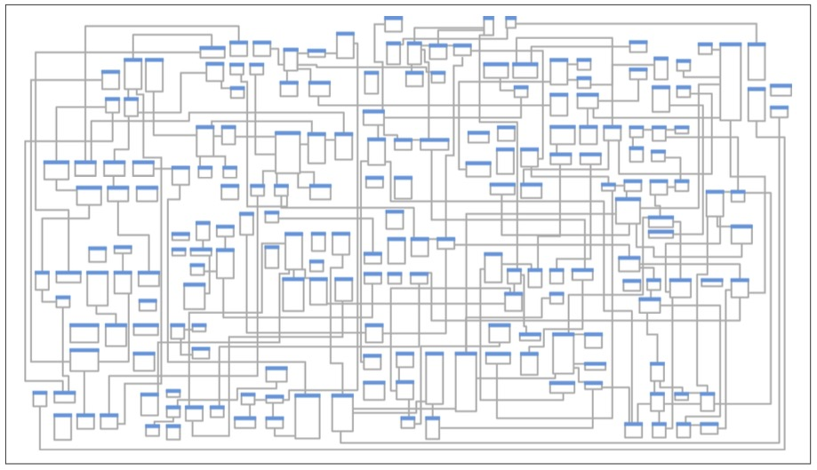
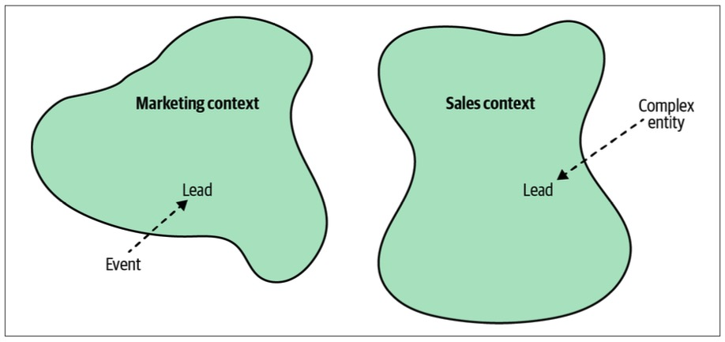
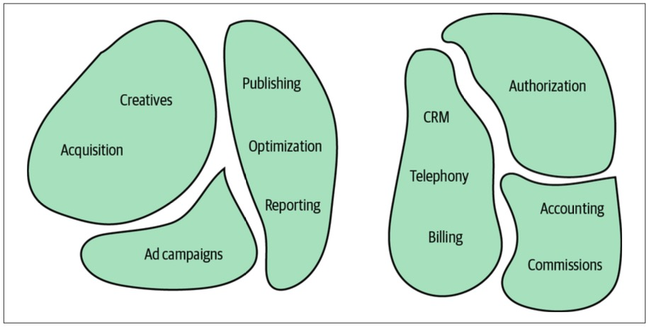
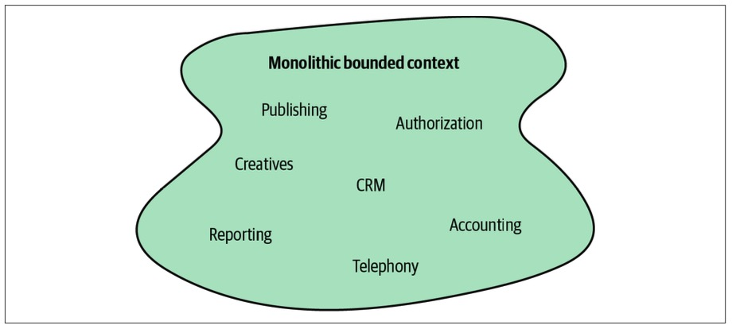
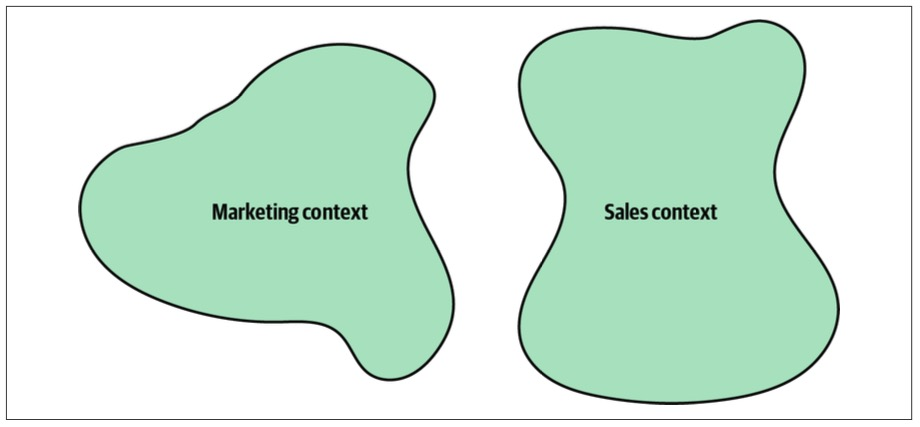
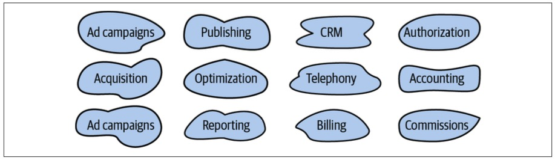
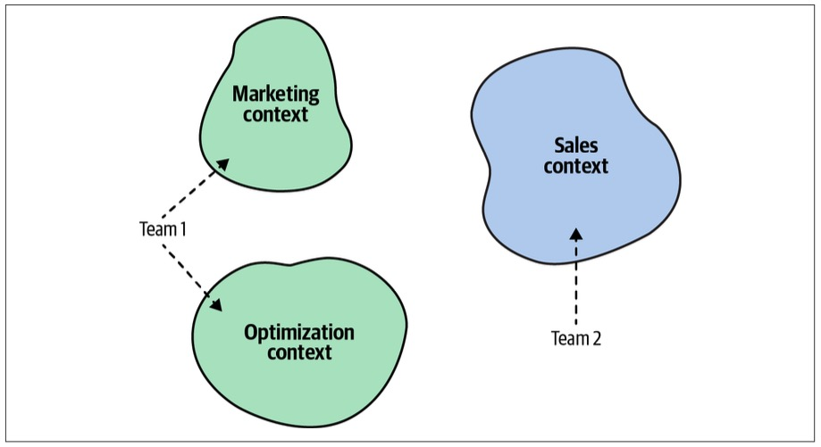

> Chapter 3. Managing Domain Complexity
>
> 章节 3. 管理领域复杂性

As you saw in the previous chapter, to ensure a project’s success it’s crucial that you develop a ubiquitous language that can be used for communication by all stakeholders, from software engineers to domain experts.

> 正如您在前一章所看到的，为了确保项目的成功，开发一种通用的语言是至关重要的，它可以用于所有利益相关者(从软件工程师到领域专家)的交流。

The language should reflect the domain experts’ mental models of the business domain’s inner workings and underlying principles.

> 语言应该反映领域专家对业务领域内部工作和基本原则的心理模型。

---

Since our goal is to use ubiquitous language to drive software design decisions, the language must be clear and consistent.

> 因为我们的目标是使用通用语言来驱动软件设计决策，所以语言必须是清晰和一致的。

It should be free of ambiguity, implicit assumptions, and extraneous-无关的,外来的 details.

> 它应该没有歧义、隐含的假设和无关的细节。

However, on an organizational scale, the domain experts’ mental models can be inconsistent themselves.

> 然而，在组织尺度上，领域专家的心智模型本身可能是不一致的。

Different domain experts can use different models of the same business domain.

> 不同的领域专家可以使用相同业务领域的不同模型。

Let’s take a look at an example.

> 让我们来看一个例子。

# Inconsistent Models

> 不一致的模型

Let’s go back to the example of a telemarketing company from Chapter 2.

> 让我们回到第二章的电话营销公司的例子。

The company’s marketing department generates leads through online advertisements.

> 该公司的营销部门通过在线广告产生潜在客户。

Its sales department is in charge of soliciting-推销 prospective-有希望的,潜在的 customers to buy its products or services, a chain that is shown in Figure 3-1.

> 其销售部门负责招揽潜在客户购买其产品或服务，其链条如图 3-1 所示。

*Figure 3-1. Example business domain: telemarketing company*

> 图3-1 示例业务领域：电话营销公司

An examination-调查,审查 of the domain experts’ language reveals a peculiar-独特的,奇怪的 observation.

> 对领域专家语言的研究揭示了一个奇特的观察结果。

The term *lead* has different meanings in the marketing and sales departments:

> “lead”一词在市场营销和销售部门有不同的含义：

---

*Marketing department*

For the marketing people, a lead represents a notification that somebody is interested in one of the products.

> 对于营销人员来说，一个线索代表了一个通知，即有人对某个产品感兴趣。

The event of receiving the prospective customer’s contact details is considered a lead.

> 收到潜在客户的联系方式的事件被认为是一个线索。

*Sales department*

In the context of the sales department, a lead is a much more complex entity.

> 在销售部门的上下文中，潜在客户是一个复杂得多的实体。

It represents the entire lifecycle of the sales process.

> 它代表了销售过程的整个生命周期。

It’s not a mere-仅仅,只不过 event, but a long-running process.

> 这不仅仅是一个事件，而是一个长期运行的过程。

---

How do we formulate-制定,规划 a ubiquitous language in the case of this telemarketing company?

> 在这个电话营销公司的案例中，我们如何制定一种通用的语言?

On the one hand, we know the ubiquitous language has to be consistent—each term should have one meaning.

> 一方面，我们知道统一语言必须是一致的——每个术语应该有一个意思。

On the other hand, we know the ubiquitous language has to reflect the domain experts’ mental models.

> 另一方面，我们知道通用语言必须反映领域专家的心智模型。

In this case, the mental model of the “lead” is inconsistent among the domain experts in the sales and marketing departments.

> 在这种情况下，销售和市场部门的领域专家对“领导”的心理模型是不一致的。

---

This ambiguity doesn’t present that much of a challenge in person-to-person communications.

> 这种模糊性在人与人之间的交流中并不构成太大的挑战。

Indeed-确实,的确,实际上,真正地, communication can be more challenging among people from different departments, but it’s easy enough for humans to infer-推断,推论 the exact meaning from the interaction’s context.

> 的确，来自不同部门的人之间的沟通可能更具挑战性，但人们很容易从互动的上下文中推断出确切的含义。

---

However, it is more difficult to represent such a divergent-发散的,不同的,分歧的 model of the business domain in software.

> 然而，在软件中表示这种业务领域的发散模型更加困难。

Source code doesn’t cope well with ambiguity.

> 源代码不能很好地处理歧义。

If we were to bring the sales department’s complicated model into marketing, it would introduce complexity where it’s not needed— far more detail and behavior than marketing people need for optimizing advertising campaigns.

> 如果我们把销售部门的复杂模型引入市场营销，它会在不必要的地方引入复杂性——比市场营销人员优化广告活动所需的细节和行为多得多。

But if we were to try to simplify the sales model according to the marketing world view, it wouldn’t fit the sales subdomain’s needs, because it’s too simplistic for managing and optimizing the sales process.

> 但是，如果我们试图根据市场营销的世界观来简化销售模型，它将不适合销售子域的需求，因为它对于管理和优化销售过程来说过于简单了。

We’d have an overengineered-过度设计的 solution in the first case and an under-engineered-设计不足的 one in the second.

> 在第一种情况下，我们会有一个过度设计的解决方案，而在第二种情况下，我们会有一个设计不足的解决方案。

---

How do we solve this catch-22?

> 我们如何解决这个第22条军规？

The traditional solution to this problem is to design a single model that can be used for all kinds of problems.

> 这个问题的传统解决方案是设计一个可以用于各种问题的单一模型。

Such models result in enormous-巨大的,极大的 entity relationship diagrams (ERDs) spanning whole office walls.

> 这样的模型产生了巨大的实体关系图(ERDs)，横跨整个办公室的墙壁。

Is Figure 3-2 an effective model?

> 图3-2 是一个有效的模型吗?

*Figure 3-2. Enterprise-wide entity relationship diagram*

> 图3-2 企业范围的实体关系图

---

As the saying goes, “jack of all trades, master of none.”

> 俗话说：“样样通，样样不精。”

Such models are supposed to be suitable for everything but eventually are effective for nothing.

> 这种模式被认为适用于所有情况，但最终却毫无效果。

No matter what you do, you are always facing complexity: the complexity of filtering out extraneous-外来的,没有关联的 details, the complexity of finding what you do need, and most importantly, the complexity of keeping the data in a consistent state.

> 无论您做什么，您总是面临复杂性：过滤掉无关细节的复杂性，找到所需内容的复杂性，以及最重要的是保持数据处于一致状态的复杂性。

---

Another solution would be to prefix the problematic term with a definition of the context: “marketing lead” and “sales lead.”

> 另一个解决方案是在有问题的术语前面加上上下文的定义：“营销主管”和“销售主管”。

That would allow the implementation of the two models in code.

> 这将允许在代码中实现这两个模型。

However, this approach has two main disadvantages-劣势,缺点.

> 然而，这种方法有两个主要缺点。

First, it induces-引起,导致 cognitive-认识的,认知的 load.

> 首先，它引起认知负荷。

When should each model be used?

> 什么时候应该使用每个模型?

The closer the implementations of the conflicting models are, the easier it is to make a mistake.

> 冲突模型的实现越接近，就越容易犯错误。

Second, the implementation of the model won’t be aligned with the ubiquitous language.

> 其次，模型的实现不会与通用语言保持一致。

No one would use the prefixes-前缀 in conversations.

> 没有人会在谈话中使用前缀。

People don’t need this extra information; they can rely on the conversation’s context.

> 人们不需要这些额外的信息；他们可以依赖于对话的语境。

---

Let’s turn to the domain-driven design pattern for tackling-应付,解决 such scenarios: the bounded context pattern.

> 让我们转向处理此类场景的领域驱动设计模式：有界上下文模式。

# What Is a Bounded Context?

> 什么是限界上下文？

The solution in domain-driven design is trivial-平凡的,琐碎的,不重要的: divide the ubiquitous language into multiple smaller languages, then assign each one to the explicit-显式的 context in which it can be applied: its *bounded context*.

> 领域驱动设计的解决方案很简单：将统一语言划分为多个较小的语言，然后将每个语言分配到可以应用它的显式上下文中：它的“有界上下文中”。

---

In the preceding example, we can identify two bounded contexts: marketing and sales.

> 在前面的示例中，我们可以确定两个有界上下文：市场营销和销售。

The term *lead* exists in both bounded contexts, as shown in Figure 3-3.

> 术语“lead”在两种有界上下文中都存在，如图3-3所示。

As long as it bears-具有,带有 a single meaning in each bounded context, each fine-grained ubiquitous language is consistent and follows the domain experts’ mental models.

> 只要它在每个有限的上下文中具有单一的含义，每个细粒度的通用语言都是一致的，并遵循领域专家的心智模型。

*Figure 3-3. Tackling inconsistencies in the ubiquitous language by splitting it into bounded contexts*

> 图3-3 通过将通用语言分解为有界的上下文来解决不一致的问题

---

In a sense, terminology conflicts and implicit contexts are an inherent part of any decent-sized-尺寸适中的,大小合适的 business.

> 从某种意义上说，术语冲突和隐含上下文是任何正常规模的业务的固有部分。

With the bounded context pattern, the contexts are modeled as an explicit and integral-必需的,必要的 part of the business domain.

> 使用限界上下文模式，将上下文建模为业务域的显式和不可分割的一部分。

## Model Boundaries

> 模型的边界

As we discussed in the previous chapter, a model is not a copy of the real world but a construct that helps us **make sense of**-理解,弄懂 a complex system.

> 正如我们在前一章中所讨论的，模型不是现实世界的副本，而是帮助我们理解复杂系统的结构。

The problem it is supposed to solve is an inherent part of a model—its purpose.

> 它应该解决的问题是模型的固有部分——它的目的。

A model cannot exist without a boundary; it will expand-扩展 to become a copy of the real world.

> 一个模型不能没有边界而存在；它将扩展成为真实世界的复制品。

That makes defining a model’s boundary—its bounded contexts—an intrinsic-内在的,固有的 part of the modeling process.

> 这使得定义模型的边界——它的有界上下文——成为建模过程的固有部分。

---

Let’s go back to the example of maps as models.

> 让我们回到地图作为模型的例子。

We saw that each map has its specific context—aerial, nautical, terrain, subway, and so on.

> 我们看到每张地图都有其特定的环境——航空、航海、地形、地铁等等。

A map is useful and consistent only within the scope of its specific purpose.

> 地图只有在其特定用途的范围内才有用和一致。

---

Just as a subway map is useless for nautical-航海的,海上的 navigation, a ubiquitous language in one bounded context can be completely irrelevant-不相关的,不相干的 to the scope of another bounded context.

> 就像地铁地图对航海导航毫无用处一样，在一个有界上下文中无处不在的语言可能与另一个有界上下文中的范围完全无关。

Bounded contexts define the applicability of a ubiquitous language and of the model it represents.

> 限界上下文定义了统一语言及其所代表的模型的适用性。

They allow defining distinct models according to different problem domains.

> 它们允许根据不同的问题域定义不同的模型。

In other words, bounded contexts are the consistency boundaries of ubiquitous languages.

> 换句话说，有界上下文是泛在语言的一致性边界。

A language’s terminology, principles, and business rules are only consistent inside its bounded context.

> 语言的术语、原则和业务规则只在其限定的上下文中是一致的。

## Ubiquitous Language Refined

> 统一语言的精炼

Bounded contexts allow us to complete the definition of a ubiquitous language.

> 限界上下文允许我们完成统一语言的定义。

A ubiquitous language is *not* “ubiquitous” in the sense that it should be used and applied “ubiquitously” throughout the organization.

> 通用语言不是“通用”，因为它应该在整个组织中“无处不在”地使用和应用。

A ubiquitous language is *not* universal.

> 统一语言不是通用的。

---

Instead, a ubiquitous language is ubiquitous only in the boundaries of its bounded context.

> 相反，统一语言仅在其限定上下文的边界内是统一的。

The language is focused on describing only the model that is encompassed-包含,包括 by the bounded context.

> 该语言专注于只描述被限界上下文所包含的模型。

As a model cannot exist without a problem it is supposed-应当的 to address, a ubiquitous language cannot be defined or used without an explicit context of its applicability-适用性,适应性.

> 由于模型不可能没有它应该解决的问题而存在，因此，如果没有其适用性的显式上下文，则无法定义或使用通用语言。

## Scope of a Bounded Context

> 有界上下文的作用域

The example at the beginning of the chapter demonstrated an inherent boundary of the business domain.

> 本章开头的示例演示了业务领域的固有边界。

Different domain experts held conflicting mental models of the same business entity.

> 不同领域的专家对同一业务实体持有相互冲突的心智模型。

To model the business domain, we had to divide the model and define a strict applicability context for each fine-grained model—its bounded context.

> 为了对业务领域建模，我们必须划分模型并为每个细粒度模型定义严格的适用性上下文——它的有界上下文。

---

The consistency of the ubiquitous language only helps to identify the widest boundary of that language.

> 统一语言的一致性只有助于确定该语言的最宽边界。

It cannot be any larger, because then there will be inconsistent models and terminology.

> 它不能再大了，因为那样就会有不一致的模型和术语。

However, we can still further decompose the models into even smaller bounded contexts, as shown in Figure 3-4.

> 然而，我们仍然可以进一步将模型分解为更小的有界上下文，如图3-4所示。

*Figure 3-4. Smaller bounded contexts*

> 图3-4 较小的限界上下文

Defining the scope of a ubiquitous language—its bounded context—is a strategic design decision.

> 定义一种统一语言的范围(即它的有限上下文)是一种战略性设计决策。

Boundaries can be wide, following the business domain’s inherent contexts, or narrow-狭窄的,狭小的, further dividing the business domain into smaller problem domains.

> 边界可以很宽，遵循业务域的固有上下文，也可以很窄，进一步将业务域划分为更小的问题域。

---

A bounded context’s size, by itself, is not a deciding factor.

> 有界上下文的大小本身并不是决定因素。

Models shouldn’t necessarily be big or small.

> 模型不一定是大的或小的。

Models need to be useful.

> 模型必须有用。

The wider the boundary of the ubiquitous language is, the harder it is to keep it consistent.

> 统一语言的边界越宽，保持其一致性就越困难。

It may be beneficial to divide-划分 a large ubiquitous language into smaller, more manageable problem domains, but striving-力争,追求 for small bounded contexts can backfire-适得其反 too.

> 将大型通用语言划分为更小、更易于管理的问题域可能是有益的，但追求较小的限界上下文也可能适得其反。

The smaller they are, the more integration overhead the design induces-引起,导致.

> 它们越小，设计带来的集成开销就越大。

---

Hence, the decision for how big your bounded contexts should depend on the specific problem domain.

> 因此，限定上下文的大小应取决于具体的问题域。

Sometimes, using a wide boundary will be clearer, while at other times, decomposing it further will make more sense.

> 有时，使用宽的边界会更清晰，而在其他时候，进一步分解它会更有意义。

---

The reasons for extracting-提取 finer-grained bounded contexts out of a larger one include constituting-组成,构成 new software engineering teams or addressing some of the system’s nonfunctional requirements; for example, when you need to separate the development lifecycles of some of the components originally residing in a single bounded context.

> 从更大的有界上下文中提取更细粒度的有界上下文的原因包括组建新的软件工程团队或解决一些系统的非功能需求；例如，当您需要分离最初驻留在单个有界上下文中的某些组件的开发生命周期时。

Another common reason for extracting-提取 one functionality is the ability to scale it independently from the rest of the bounded context’s functionalities.

> 提取一个功能的另一个常见原因是能够独立于有界上下文的其他功能进行扩展。

---

Therefore, keep your models useful and align the bounded contexts’ sizes with your business needs and organizational constraints.

> 因此，保持您的模型有用，并使限界上下文的大小与您的业务需求和组织约束保持一致。

One thing to beware of is splitting a coherent-连贯的 functionality into multiple bounded contexts.

> 需要注意的一件事是将连贯的功能拆分为多个有界的上下文。

Such division-分配,划分 will hinder-阻碍,妨碍 the ability to evolve each context independently.

> 这样的划分将阻碍独立发展每个上下文的能力。

Instead, the same business requirements and changes will simultaneously affect the bounded contexts and require simultaneous deployment of the changes.

> 相反，相同的业务需求和更改将同时影响有界上下文，并要求同时部署更改。

To avoid such ineffective decomposition, use the rule of thumb we discussed in Chapter 1 to find subdomains: identify sets of coherent use cases that operate on the same data and avoid decomposing them into multiple bounded contexts.

> 为了避免这种无效的分解，使用我们在第1章中讨论的经验法则来找到子域：识别操作相同数据的一致用例集，并避免将它们分解为多个有界的上下文。

---

We’ll discuss the topic of continuously optimizing the bounded contexts’ boundaries further in Chapters 8 and 10.

> 我们将在第8章和第10章进一步讨论持续优化有界上下文边界的主题。

# Bounded Contexts Versus Subdomains

> 有界上下文与子域对比

In Chapter 2, we saw that a business domain consists of multiple subdomains.

> 在第2章中，我们看到业务域由多个子域组成。

So far in this chapter, we explored the notion of decomposing a business domain into a set of fine-grained problem domains or bounded contexts.

> 到目前为止，在本章中，我们探讨了将业务域分解为一组细粒度问题域或有界上下文的概念。

At first, the two methods of decomposing business domains might seem redundant-多余的,冗余.

> 首先，分解业务域的两种方法似乎是多余的。

However, that’s not the case.

> 然而，事实并非如此。

Let’s examine why we need both boundaries.

> 让我们来看看为什么我们需要这两个边界。

## Subdomains

To comprehend-理解,领悟 a company’s business strategy, we have to analyze its business domain.

> 要了解一家公司的商业战略，我们必须分析它的业务领域。

According to domain-driven design methodology, the analysis phase involves identifying the different subdomains (core, supporting, and generic).

> 根据领域驱动的设计方法，分析阶段涉及识别不同的子领域(核心、支持和通用)。

That’s how the organization works and plans its competitive strategy.

> 这就是组织运作和规划竞争战略的方式。

---

As you learned in Chapter 1, a subdomain resembles a set of interrelated use cases.

> 正如您在第1章中学到的，子域类似于一组相互关联的用例。

The use cases are defined by the business domain and the system’s requirements.

> 用例由业务领域和系统需求定义。

As software engineers, we do not define the requirements; that’s the responsibility of the business.

> 作为软件工程师，我们不定义需求；这是业务的责任。

Instead, we are analyzing the business domain to identify the subdomains.

> 相反，我们将分析业务域以识别子域。

## Bounded Contexts

> 有界上下文

Bounded contexts, on the other hand, are designed.

> 另一方面，有界上下文是设计好的。

Choosing models’ boundaries is a strategic design decision.

> 选择模型的边界是一个战略性的设计决策。

We decide how to divide the business domain into smaller, manageable problem domains.

> 我们决定如何将业务域划分为更小的、可管理的问题域。

## The Interplay-相互影响,相互作用 Between Subdomains and Bounded Contexts

> 子域和有界上下文之间的相互作用

Theoretically, though-虽然,尽管 impractically-不切实际的, a single model could span the entire business domain.

> 理论上，尽管不切实际，单个模型可以跨越整个业务领域。

This strategy could work for a small system, as shown in Figure 3-5.

> 该策略适用于小型系统，如图3-5 所示。

*Figure 3-5. Monolithic-整体的 bounded context*

> 图3-5 整体有界上下文

When conflicting models arise, we can follow the domain experts’ mental models and decompose the systems into bounded contexts, as shown in Figure 3-6.

> 当模型出现冲突时，我们可以遵循领域专家的心智模型，将系统分解为有界的上下文，如图3-6所示。

*Figure 3-6. Bounded contexts driven by the consistency of the ubiquitous language*

> 图3-6 由统一语言的一致性驱动的有界上下文

If the models are still large and hard to maintain, we can decompose them into even smaller bounded contexts; for example, by having a bounded context for each subdomain, as shown in Figure 3-7.

> 如果模型仍然很大，难以维护，我们可以将它们分解成更小的有界上下文；例如，每个子域都有一个有界的上下文，如图3-7 所示。

*Figure 3-7. Bounded contexts aligned with subdomains’ boundaries*

> 图3-7 与子域边界对齐的有界上下文

Either way, this is a design decision.

> 不管怎样，这都是一个设计决策。

We design those boundaries as a part of the solution.

> 我们将这些边界设计为解决方案的一部分。

---

Having a one-to-one relationship between bounded contexts and subdomains can be perfectly-完全地 reasonable-合理的 in some scenarios.

> 在某些情况下，在有界上下文和子域之间建立一对一的关系是完全合理的。

In others, however, different decomposition strategies can be more suitable.

> 然而，在其他情况下，不同的分解策略可能更合适。

---

It’s crucial to remember that subdomains are discovered and bounded contexts are designed.

> 重要的是要记住，子域是发现的，有界上下文是设计的。

The subdomains are defined by the business strategy.

> 子域由业务策略定义。

However, we can design the software solution and its bounded contexts to address the specific project’s context and constraints.

> 然而，我们可以设计软件解决方案及其有限的上下文来处理特定项目的上下文和约束。

---

Finally, as you learned in Chapter 1, a model is intended to solve a specific problem.

> 最后，正如您在第1章中学到的，模型是用来解决特定问题的。

In some cases, it can be beneficial to use multiple models of the same concept simultaneously to solve different problems.

> 在某些情况下，同时使用相同概念的多个模型来解决不同的问题可能是有益的。

As different types of maps provide different types of information about our planet, it may be reasonable to use different models of the same subdomain to solve different problems.

> 由于不同类型的地图提供了关于我们星球的不同类型的信息，因此使用同一子域的不同模型来解决不同的问题可能是合理的。

Limiting the design to one-to-one relationships between bounded contexts would inhibit-抑制,约束 this flexibility-灵活性 and force us to use a single model of a subdomain in its bounded context.

> 将设计限制为有界上下文之间的一对一关系将抑制这种灵活性，并迫使我们在其有界上下文中使用子域的单个模型。

# Boundaries

> 边界,界限

As Ruth Malan says, architectural design is inherently about boundaries:

> 正如Ruth Malan所说，架构设计本质上是关于边界的:

Architectural design is system design.

> 架构设计就是系统设计。

System design is contextual design—it is inherently about boundaries (what’s in, what’s out, what spans, what moves between), and about trade-offs.

> 系统设计是一种情境设计——它本质上是关于边界(什么在里面，什么在外面，什么跨越，什么在中间移动)和权衡的。

It reshapes what is outside, just as it shapes what is inside.

> 它重塑外在，就像它塑造内在一样。

The bounded context pattern is the domain-driven design tool for defining physical and ownership boundaries.

> 限界上下文模式是用于定义物理和所有权边界的领域驱动设计工具。

## Physical Boundaries

Bounded contexts serve not only as model boundaries but also as physical boundaries of the systems implementing them.

> 有界上下文不仅可以作为模型边界，还可以作为实现它们的系统的物理边界。

Each bounded context should be implemented as an individual service/project, meaning it is implemented, evolved, and versioned independently of other bounded contexts.

> 每个有界上下文都应该作为单独的服务/项目来实现，这意味着它的实现、发展和版本控制都独立于其他有界上下文。

---

Clear physical boundaries between bounded contexts allow us to implement each bounded context with the technology stack that best fits its needs.

> 有界上下文之间明确的物理边界允许我们使用最适合其需求的技术堆栈来实现每个有界上下文。

---

As we discussed earlier, a bounded context can contain multiple subdomains.

> 如前所述，限界上下文可以包含多个子域。

In such a case, the bounded context is a physical boundary, while each of its subdomains is a logical boundary.

> 在这种情况下，限界上下文是一个物理边界，而它的每个子域是一个逻辑边界。

Logical boundaries bear-具有,带有 different names in different programming languages: namespaces, modules, or packages.

> 逻辑边界在不同的编程语言中具有不同的名称：名称空间、模块或包。

## Ownership Boundaries

> 所有者边界

Studies show that good fences do indeed make good neighbors.

> 研究表明，好篱笆确实能造就好邻居。

In software projects, we can leverage model boundaries—bounded contexts—for the peaceful coexistence-共存,和平共处 of teams.

> 在软件项目中，我们可以利用模型边界——有界的上下文——来实现团队之间的和平共处。

The division of work between teams is another strategic decision that can be made using the bounded context pattern.

> 团队之间的工作分工是可以使用限界上下文模式做出的另一个战略决策。

---

A bounded context should be implemented, evolved, and maintained by one team only.

> 有界上下文应该只由一个团队来实现、发展和维护。

No two teams can work on the same bounded context.

> 没有两个团队可以在相同的有界上下文上工作。

This segregation-隔离,分隔 eliminates-排除,消除 implicit assumptions that teams might make about one another’s models.

> 这种隔离消除了团队可能对彼此的模型做出的隐含假设。

Instead, they have to define communication protocols for integrating their models and systems explicitly.

> 相反，他们必须定义通信协议，以便显式地集成他们的模型和系统。

---

It’s important to note that the relationship between teams and bounded contexts is one-directional: a bounded context should be owned by only one team.

> 需要注意的是，团队和有界上下文之间的关系是单向的：有界上下文应该只属于一个团队。

However, a single team can own multiple bounded contexts, as Figure 3-8 illustrates.

> 然而，一个团队可以拥有多个边界上下文，如图3-8所示。

*Figure 3-8. Team 1 working on the Marketing and Optimization bounded contexts, while Team 2 works on the Sales bounded context*

> 图3-8 团队1负责营销和优化边界上下文，而团队2负责销售边界上下文

# Bounded Contexts in Real Life

> 现实生活中的限界上下文

In one of my domain driven-design classes, a participant once noted: “You said that DDD is about aligning software design with business domains. But where are the bounded contexts in real life? There are no bounded contexts in business domains.”

> 在我的一个领域驱动设计课程中，一位参与者曾经指出:“您说DDD是关于将软件设计与业务领域结合起来。但是在现实生活中，有界限上下文在哪里呢？在业务领域中没有边界上下文。”

---

Indeed, bounded contexts are not as evident-清楚的,显然的 as business domains and subdomains, but they are there, as domain experts’ mental models are.

> 确实，有界上下文不像业务域和子域那样明显，但它们确实存在，就像领域专家的心智模型一样。

You just have to be conscious-意识到的,关注的 about how domain experts think about the different business entities and processes.

> 您只需要了解领域专家如何看待不同的业务实体和流程。

---

I want to close this chapter by discussing examples demonstrating that not only are bounded contexts there when we are modeling business domains in software, but the notion of using different models in different contexts is widespread-普遍的,广泛的 in life in general.

> 我想通过讨论一些例子来结束本章，这些例子表明，当我们在软件中建模业务领域时，不仅存在有界的上下文，而且在不同的上下文中使用不同模型的概念在一般生活中也很普遍。

## Semantic-语义的 Domains

> 语义域

It can be said that domain-driven design’s bounded contexts are based on the lexicographical notion of semantic domains.

> 可以说，领域驱动设计的有界上下文是基于语义域的词典学概念。

A *semantic domain* is defined as an area of meaning and the words used to talk about it.

> 一个“语义域”被定义为一个意义区域和用来谈论它的词语。

For example, the words *monitor*, *port*, and *processor* have different meanings in the software and hardware engineering semantic domains.

> 例如，单词“监视器”、“端口”和“处理器”在软件和硬件工程语义域中具有不同的含义。

---

A rather peculiar-奇怪的,不寻常的 example of different semantic domains is the meaning of the word *tomato-西红柿*.

> 不同语义域的一个相当奇特的例子是单词“西红柿”的意思。

---

According to the botanic-植物的,植物学的 definition, a fruit-果实 is the plant’s way of spreading its seeds-种子.

> 根据植物学的定义，果实是植物传播种子的方式。

A fruit should grow from the plant’s flower, and bear at least one seed.

> 果实应该从植物的花朵上长出来，并且至少有一颗种子。

A vegetable-蔬菜,植物, on the other hand, is a general term encompassing all other edible-食物 parts of a plant: roots, stems, and leaves.

> 另一方面，蔬菜是一个笼统的术语，包括植物的所有其他可食用的食物部分：根、茎和叶。

Based on this definition, the *tomato is a fruit*.

> 根据这个定义，西红柿是一种水果。

---

That definition, however, is of little use in the context of the culinary-烹饪的,食物的 arts.

> 然而，这个定义在烹饪艺术的语境中几乎没有用处。

In this context, fruits and vegetables are defined based on their flavor-滋味,味道 profiles.

> 在这种情况下，水果和蔬菜是根据它们的味道来定义的。

A fruit has a soft texture, is either sweet or sour-酸的, and can be enjoyed in its raw-生的 form, whereas a vegetable has a tougher texture, tastes blander, and often requires cooking.

> 水果质地柔软，或甜或酸，可以生吃，而蔬菜质地较硬，味道较淡，通常需要烹饪。

According to this definition, *the tomato is a vegetable*.

> 根据这个定义，西红柿是一种蔬菜。

---

Hence, in the *bounded context of botany-植物学*, the tomato is a fruit, while in the *bounded context of the culinary arts,* it’s a vegetable.

> 因此，在植物学的有限语境中，番茄是一种水果，而在烹饪艺术的有限语境中，它是一种蔬菜。

But that’s not all.

> 但这还不是全部。

---

In 1883 the United States established a 10% tax on imported vegetables, but not fruits.

> 1883年，美国对进口蔬菜征收10%的税，但水果没有。

The botanic definition of the tomato as a fruit allowed the importation of tomatoes to the United States without paying the import tax.

> 植物学将番茄定义为一种水果，允许番茄进口到美国而无需支付进口税。

To close the loophole-漏洞,空子, in 1893 the United States Supreme Court-法院 made the decision to classify the tomato as a vegetable. 

> 为了堵住这个漏洞，1893年，美国最高法院决定将西红柿归类为蔬菜。

Therefore, in the *bounded context of taxation*, the tomato is a vegetable.

> 因此，在“税收的有限上下文中”，西红柿是一种蔬菜。

---

Furthermore, as my friend Romeu Moura says, *in the bounded context of theatrical-戏剧的 performances-表演*, the tomato is a feedback mechanism.

> 此外，正如我的朋友 Romeu Moura 所说，“在戏剧表演的有限背景下”，番茄是一种反馈机制。

## Science

> 科学

As historian Yuval Noah Harari puts it, “Scientists generally agree that no theory is 100 percent correct. Thus, the real test of knowledge is not the truth, but utility.”

> 正如历史学家尤瓦尔·诺亚·赫拉利所说，“科学家们普遍认为，没有任何理论是百分之百正确的。因此，对知识的真正考验不是真理，而是效用。”

In other words, no scientific theory is correct in all cases.

> 换句话说，没有任何科学理论在所有情况下都是正确的。

Different theories are useful in different contexts.

> 不同的理论在不同的背景下有用。

---

This notion-概念,想法 can be demonstrated by the different models of gravity introduced by Sir Isaac Newton and Albert Einstein.

> 这个概念可以通过艾萨克·牛顿爵士和阿尔伯特·爱因斯坦提出的不同的引力模型来证明。

According to Newton’s laws of motion, space and time are absolute.

> 根据牛顿的运动定律，空间和时间是绝对的。

They are the stage on which the motion-运动 of objects happens.

> 它们是物体运动发生的舞台。

In Einstein’s theory of relativity, space and time are no longer absolute but different for different observers.

> 在爱因斯坦的相对论中，空间和时间不再是绝对的，对于不同的观察者来说是不同的。

---

Even though the two models can be seen as contradictory-相互矛盾的,对立的, both are useful in their suitable (bounded) contexts.

> 尽管这两个模型可以被看作是矛盾的，但在它们合适的(有限的)上下文中，它们都是有用的。

## Buying a Refrigerator-冰箱

> 买冰箱

Finally, let’s see a more earthbound-只在地面的 example of real-life bounded contexts.

> 最后，让我们看一个现实生活中有界上下文的更实际的例子。

What do you see in Figure 3-9?

> 在图3-9 中看到了什么?

*Figure 3-9. A piece of cardboard*

> 图3-9 一张硬纸板

Is it just a piece of cardboard?

> 它只是一张硬纸板吗?

No, it’s a model.

It’s a model of the Siemens KG86NAI31L refrigerator.

> 这是西门子 KG86NAI31L 冰箱的一个型号。

If you look it up, you may say the piece of cardboard doesn’t look anything like that fridge-冰箱.

> 如果你查一下，你可能会说这张硬纸板看起来一点也不像那个冰箱。

It has no doors, and even its color is different.

> 它没有门，甚至它的颜色都不一样。

---

Although that’s true, it’s not relevant.

> 虽然这是事实，但这无关紧要。

As we’ve discussed, a model is not supposed to copy a real-world entity.

> 正如我们所讨论的，模型不应该复制现实世界的实体。

Instead, it should have a purpose—a problem it is supposed to solve.

> 相反，它应该有一个目的——一个它应该解决的问题。

Hence, the correct question to ask about the cardboard is, what problem does this model solve?

> 因此，关于纸板的正确问题是，这个模型解决了什么问题?

---

In our apartment-公寓, we do not have a standard entry into the kitchen-厨房.

> 在我们的公寓里，我们没有标准的厨房入口。

The cardboard was cut precisely to the size of the fridge’s width and depth.

> 纸板被精确地切割成冰箱的宽度和深度。

The problem it solves is checking whether the refrigerator can fit through the kitchen door (see Figure 3-10).

> 解决的问题是检查冰箱是否能穿过厨房门(如图3-10所示)。

*Figure 3-10.* *The* *cardboard model in the kitchen doorway*

> 图3-10 厨房门口的纸板模型

Despite the cardboard not looking anything like the fridge, it proved extremely useful when we had to decide whether to buy this model or opt for a smaller one.

> 尽管硬纸板看起来一点也不像冰箱，但当我们决定是买这款还是选择小一点的时候，它被证明是非常有用的。

Again, all models are wrong, but some are useful.

> 同样，所有的模型都是错误的，但有些是有用的。

Building a 3D model of the fridge would definitely be a fun project.

> 建立一个冰箱的3D模型肯定是一个有趣的项目。

But would it solve the problem any more efficiently than the cardboard?

> 但它能比硬纸板更有效地解决问题吗？

No.

If the cardboard fits, the 3D model would fit as well, and **vice versa**-反之亦然.

> 如果纸板合适，3D模型也会合适，反之亦然。

In software engineering terms, building a 3D model of the fridge would be gross overengineering.

> 用软件工程的术语来说，建立一个冰箱的3D模型将会是一个过于庞大的工程。

---

But what about the refrigerator’s height?

> 但是冰箱的高度呢?

What if the base fits, but it’s too tall to fit in the doorway?

> 如果底座很合适，但太高，放不进门口怎么办?

Would that justify-证明合法 gluing-黏接 together a 3D model of the fridge?

> 这能证明把冰箱的3D模型粘在一起是合理的吗?

No.

The problem can be solved much more quickly and easily by using a simple tape-卷尺 measure to check the doorway’s height.

> 用一个简单的卷尺来测量门口的高度，这个问题可以更快更容易地解决。

What is a tape measure in this case?

> 在这种情况下，卷尺是什么?

Another simple model.

> 另一个简单的模型。

---

So, we ended up with two models of the same fridge.

> 所以，我们最后买了两种模型对于同一款冰箱。

Using two models, each optimized for its specific task, reflects the DDD approach to modeling business domains.

> 使用两个模型(每个模型都针对其特定任务进行了优化)反映了对业务域建模的DDD方法。

Each model has its strict-严格的,精确的 bounded context: the cardboard verifying that the refrigerator’s base can make it through the kitchen’s entry, and the tape measure verifying that it’s not too tall.

> 每个模型都有其严格的限定环境：纸板确保冰箱底座能够通过厨房入口，卷尺确保冰箱不会太高。

*A model should omit-省略,忽略 the extraneous information irrelevant to the task at hand.*

> 模型应该省略与手头任务无关的多余信息

Also, there’s no need to design a complex-复杂的 jack-of-all-trades model if multiple, much simpler models can effectively solve each problem individually.

> 此外，如果多个更简单的模型可以有效地单独解决每个问题，那么就没有必要设计一个复杂的万能模型。

---

A few days after I published this story on Twitter, I received a reply saying that instead of fiddling with cardboard, I could have just used a mobile phone with a LiDAR scanner and an augmented reality (AR) application.

> 在我把这篇文章发表在Twitter上几天后，我收到了一条回复，说我本可以使用带有激光雷达扫描仪和增强现实(AR)应用程序的手机，而不是摆弄纸板。

Let’s analyze this suggestion from the domain-driven design perspective.

> 让我们从领域驱动设计的角度来分析这个建议。

---

The author of the comment says this is a problem that others have already solved, and the solution is readily available.

> 评论的作者说，这是一个别人已经解决的问题，而且解决方案是现成的。

Needless to say, both the scanning technology and the AR application are complex.

> 不用说，扫描技术和AR应用都很复杂。

In DDD lingo, that makes the problem of checking whether the refrigerator will fit through the doorway a generic subdomain.

> 在 DDD 术语中，这使得检查冰箱是否能穿过门口的问题成为一个通用子域。

# Conclusion

> 总结

Whenever we stumble-偶然发现 upon an inherent conflict in the domain experts’ mental models, we have to decompose the ubiquitous language into multiple bounded contexts.

> 每当我们在领域专家的心智模型中偶然发现固有的冲突时，我们必须将无处不在的语言分解成多个有界的上下文。

A ubiquitous language should be consistent within the scope of its bounded context.

> 统一语言应该在其限定的上下文范围内保持一致。

However, across bounded contexts, the same terms can have different meanings.

> 然而，在有界的上下文中，相同的术语可能具有不同的含义。

---

While subdomains are discovered, bounded contexts are designed.

> **子域是发现，边界上下文是设计。**

The division-划分,分配 of the domain into bounded contexts is a strategic design decision.

> 将领域划分为有界的上下文是一种战略设计决策。

---

A bounded context and its ubiquitous language can be implemented and maintained by one team.

> 有界上下文及其通用语言可以由一个团队实现和维护。

No two teams can share the work on the same bounded context.

> 没有两个团队可以在相同的限定上下文中共享工作。

However, one team can work on multiple bounded contexts.

> 然而，一个团队可以处理多个有界上下文。

---

Bounded contexts decompose a system into physical components—services, subsystems, and so on.

> 有界上下文将系统分解为物理组件——服务、子系统等等。

Each bounded context’s lifecycle is decoupled-解偶,去耦合 from the rest.

> 每个有界上下文的生命周期与其他上下文解耦。

Each bounded context can evolve independently from the rest of the system.

> 每个有界的上下文都可以独立于系统的其余部分进行演化。

However, the bounded contexts have to work together to form a system.

> 然而，这些有界的上下文必须协同工作才能形成一个系统。

Some of the changes will inadvertently-无意地,不经意地 affect another bounded context.

> 其中一些更改将无意中影响另一个有界上下文。

In the next chapter, we’ll talk about the different patterns for integrating bounded contexts that can be used to protect them from cascading-级联 changes.

> 在下一章中，我们将讨论用于集成有界上下文的不同模式，这些模式可用于保护它们免受级联更改的影响。

