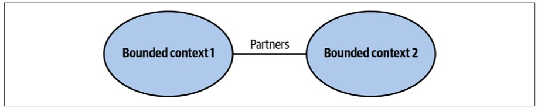
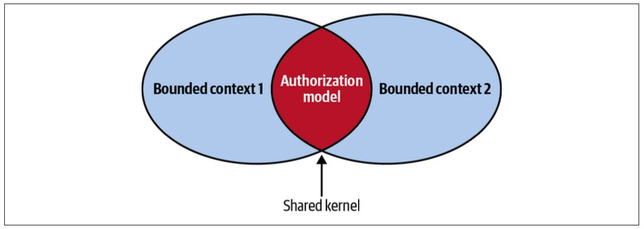
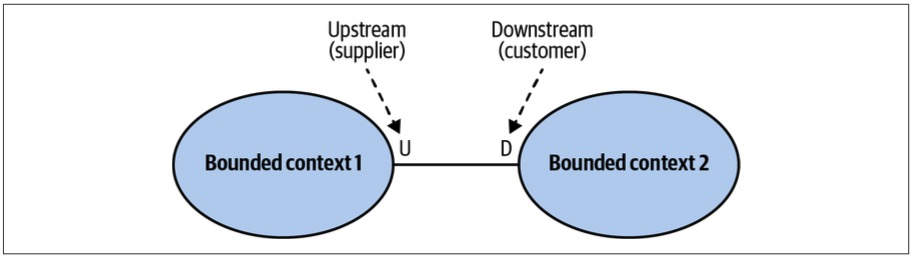
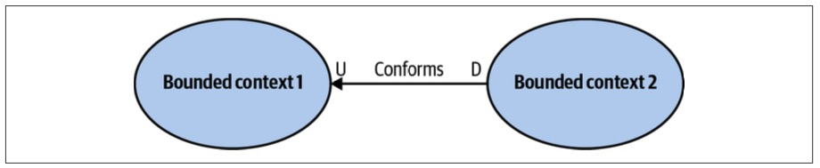
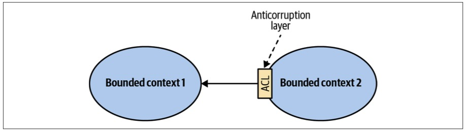
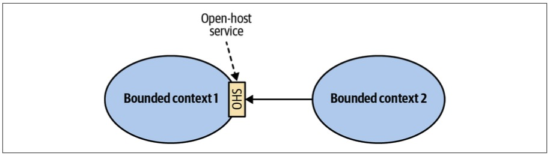
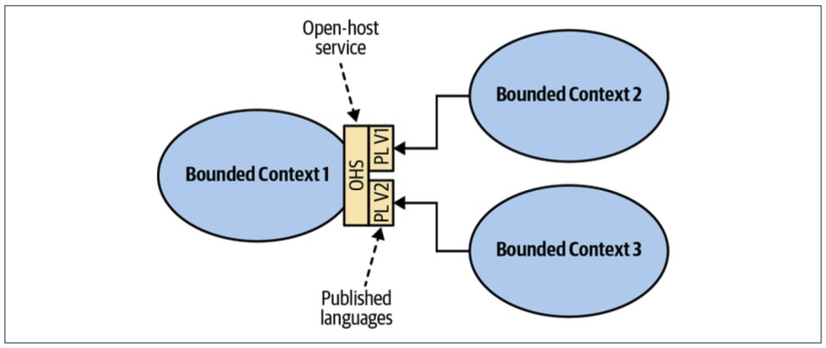
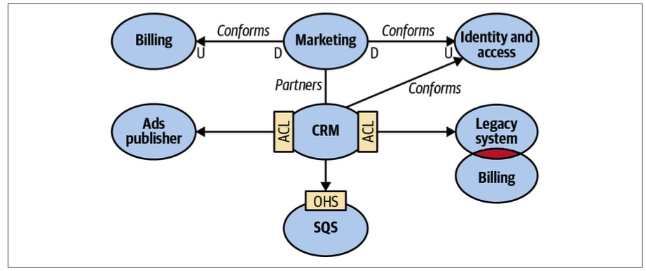
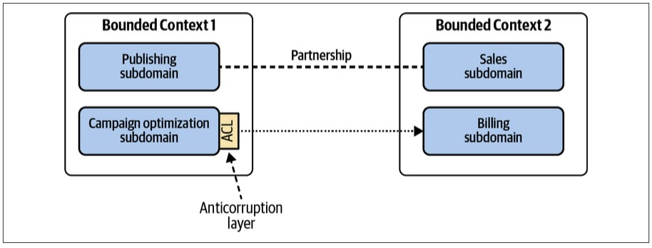

> Chapter 4. Integrating Bounded Contexts
>
> 章节 4. 限界上下文集成

Not only does the bounded context pattern protect the consistency of a ubiquitous language, it also enables modeling.

> 有界上下文模式不仅保护了统一语言的一致性，还支持建模。

You cannot build a model without specifying its purpose—its boundary.

> 如果不指定模型的目的(即边界)，就无法构建模型。

The boundary divides the responsibility of languages.

> 这条界线划分了语言的职责。

A language in one bounded context can model the business domain to solve a particular problem.

> 一个限界上下文中的语言可以为业务领域建模以解决特定问题。

Another bounded context can represent the same business entities but model them to solve a different problem.

> 另一个限界上下文可以表示相同的业务实体，但对它们进行建模以解决不同的问题。

---

Moreover-此外,而且, models in different bounded contexts can be evolved and implemented independently.

> 此外，不同有界环境下的模型可以独立地演化和实现。

That said, bounded contexts themselves are not independent.

> 也就是说，限界上下文本身并不是独立的。

Just as a system cannot be built out of independent components—the components have to interact with one another to achieve the system’s overarching-首要的,总体的 goals—so, too, do the implementations in bounded contexts.

> 正如系统不能由独立的组件构建而成——组件必须相互交互才能实现系统的总体目标——在限界的上下文中实现也是如此。

Although they can evolve independently, they have to integrate with one another.

> 虽然它们可以独立进化，但它们必须相互融合。

As a result, there will always be touchpoints between bounded contexts.

> 因此，在限界上下文之间总是存在接触点。

These are called *contracts*.

> **这些被称为“契约”。**

---

The need for contracts results from differences in bounded contexts’ models and languages.

> 契约的需求源于有界上下文的模型和语言的差异。

Since each contract affects more than one party, they need to be defined and coordinated.

> 由于每个合同影响不止一方，因此需要对它们进行定义和协调。

Also, by definition, two bounded contexts are using different ubiquitous languages.

> 此外，根据定义，两个限界上下文使用不同的统一语言。

Which language will be used for integration purposes?

> 为了集成的目的，将使用哪种语言?

These integration concerns should be evaluated and addressed by the solution’s design.

> 这些集成问题应该由解决方案的设计来评估和处理。

----

In this chapter, you will learn about domain-driven design patterns for defining relationships and integrations between bounded contexts.

> 在本章中，你将学习领域驱动的设计模式，用于定义有界上下文之间的关系和集成。

These patterns are driven by the nature of collaboration between teams working on bounded contexts.

> 这些模式是由处理有界上下文的团队之间协作的本质所驱动的。

We will divide the patterns into three groups, each representing a type of team collaboration: cooperation, customer–supplier, and separate ways.

> 我们将把模式分成三组，每组代表一种团队协作类型：合作、客户-供应商和独立的方式。

# Cooperation

> 合作,协作

Cooperation patterns relate to bounded contexts implemented by teams with well-established communication.

> 合作模式与具有良好沟通的团队实现的有限上下文相关。

---

In the simplest case, these are bounded contexts implemented by a single team.

> 在最简单的情况下，这些是由单个团队实现的有界上下文。

This also applies to teams with dependent goals, where one team’s success depends on the success of the other, and vice versa. 

> 这也适用于具有相互依赖目标的团队，其中一个团队的成功取决于另一个团队的成功，反之亦然。

Again, the main criterion-标准,准则 here is the quality of the teams’ communication and collaboration.

> 同样，这里的主要标准是团队沟通和协作的质量。

---

Let’s look at two DDD patterns suitable for cooperating teams: the partnership and shared kernel-内核 patterns.

> 让我们看看适合合作团队的两种DDD模式：伙伴关系模式和共享内核模式。

## Partnership

> 伙伴关系

In the partnership model, the integration between bounded contexts is coordinated in an ad hoc manner.

> 在伙伴关系模型中，限界上下文之间的集成以一种特别的方式进行协调。

One team can notify a second team about a change in the API, and the second team will cooperate and adapt—no drama-戏剧 or conflicts (see Figure 4-1).

> 一个团队可以将API中的更改通知另一个团队，而另一个团队将进行合作和适应——没有戏剧性或冲突(参见图4-1)。

*Figure 4-1.* *The* *partnership model*

> 图4-1 伙伴关系模式

The coordination of integration here is two-way.

> 这里的集成协调是双向的。

No one team dictates-规定 the language that is used for defining the contracts.

> 没有一个团队规定用于定义契约的语言。

The teams can work out the differences and choose the most appropriate solution.

> 团队可以找出差异并选择最合适的解决方案。

Also, both sides cooperate in solving any integration issues that might come up.

> 此外，双方合作解决可能出现的任何整合问题。

Neither team is interested in blocking the other one.

> 双方都没有兴趣去阻挡对方。

---

Well-established collaboration practices, high levels of commitment-承诺, and frequent synchronizations between teams are required for successful integration in this manner.

> 以这种方式成功集成需要完善的协作实践、高水平的承诺和团队之间频繁的同步。

From a technical perspective, continuous integration of the changes applied by both teams is needed to further minimize the integration feedback loop.

> 从技术角度来看，两个团队应用的变更的持续集成需要进一步最小化集成反馈循环。

---

This pattern might not be a good fit for geographically-在地理上,地理学上 distributed-分布式的,分散式的 teams since it may present synchronization and communication challenges.

> 这种模式可能不适合地理上分布的团队，因为它可能带来同步和通信方面的挑战。

## Shared Kernel

> 共享内核

Despite bounded contexts being model boundaries, there still can be cases when the same model of a subdomain, or a part of it, will be implemented in multiple bounded contexts.

> 尽管限界上下文是模型边界，但仍然存在子域的相同模型或其一部分将在多个有界上下文中实现的情况。

It’s crucial to stress that the shared model is designed according to the needs of all of the bounded contexts.

> 必须强调的是，共享模型是根据所有有界上下文的需求设计的。

Moreover-此外,而且, the shared model has to be consistent across all of the bounded contexts that are using it.

> 此外，共享模型必须在使用它的所有有界上下文中保持一致。

---

As an example, consider an enterprise system that uses a tailor-made-特制的,量身定做 model for managing users’ permissions.

> 例如，考虑一个使用定制模型来管理用户权限的企业系统。

Each user can have their permissions granted directly or inherited-继承 from one of the organizational units they **belong to**-所属,归属.

> 每个用户的权限可以直接授予，也可以从其所属的组织单位继承。

Moreover, each bounded context can modify the authorization model, and the changes each bounded context applies have to affect all the other bounded contexts using the model (see Figure 4-2).

> 此外，每个有界上下文都可以修改授权模型，并且每个有界上下文应用的更改必须影响使用该模型的所有其他有界上下文(参见图4-2)。

*Figure 4-2. Shared kernel*

> 图4-2 共享内核

### Shared scope

> 共享范围

The overlapping-重叠 model couples-耦合 the lifecycles of the participating bounded contexts.

> 重叠模型耦合了参与的有界上下文的生命周期。

A change made to the shared model has an immediate effect on all the bounded contexts.

> 对共享模型所做的更改会立即对所有有界上下文产生影响。

Hence, to minimize the cascading-级联 effects of changes, the overlapping model should be limited, exposing-暴露 only that part of the model that has to be implemented by both bounded contexts.

> 因此，为了最小化变更的级联效应，应该限制重叠模型，只暴露必须由两个有界上下文实现的模型的那一部分。

Ideally, the shared kernel will consist only of integration contracts and data structures that are intended to be passed across the bounded contexts’ boundaries.

> 理想情况下，共享内核将仅由集成契约和数据结构组成，这些契约和数据结构旨在跨有界上下文的边界传递。

### Implementation

The shared kernel is implemented so that any modification to its source code is immediately reflected in all the bounded contexts using it.

> 共享内核的实现使得对其源代码的任何修改都会立即反映在使用它的所有有界上下文中。

---

If the organization uses the mono-repository approach, these can be the same source files referenced by multiple bounded contexts.

> 如果组织使用单存储库方法，这些可以是由多个有界上下文引用的相同源文件。

If using a shared repository is not possible, the shared kernel can be extracted into a dedicated-专用的,致力于 project and referenced in the bounded contexts as a linked library.

> 如果无法使用共享存储库，则可以将共享内核提取到专用项目中，并在有界上下文中作为链接库引用。

Either way, each change to the shared kernel must trigger integration tests for all the affected bounded contexts.

> 无论哪种方式，对共享内核的每次更改都必须触发针对所有受影响的边界上下文的集成测试。

---

The continuous integration of changes is required because the shared kernel belongs to multiple bounded contexts.

> 由于共享内核属于多个限界上下文，因此需要对更改进行持续集成。

Not propagating-传播,宣传 shared kernel changes to all related bounded contexts leads to inconsistencies in a model: bounded contexts may rely on stale-陈旧的 implementations of the shared kernel, leading to data corruption and/or runtime issues.

> 没有将共享内核更改传播到所有相关的有界上下文会导致模型中的不一致：有界上下文可能依赖于共享内核的过时实现，从而导致数据损坏和/或运行时问题。

### When to use shared kernel

> 何时使用共享内核

The overarching-首要的,总体的 applicability criterion-标准,准则 for the shared kernel pattern is the cost of duplication-复制 versus the cost of coordination. 

> 共享内核模式的主要适用性标准是复制成本与协调成本的比较。

Since the pattern introduces a strong dependency between the participating bounded contexts, it should be applied only when the cost of duplication is higher than the cost of coordination—in other words, only when integrating changes applied to the shared model by both bounded contexts will require more effort than coordinating the changes in the shared codebase.

> 由于该模式在参与的有界上下文之间引入了强烈的依赖性，因此只有**当复制成本高于协调成本时才应该应用它**——换句话说，只有当两个有界上下文集成应用于共享模型的更改比协调共享代码库中的更改需要更多的努力时才应该应用它。

---

The difference between the integration and duplication costs depends on the volatility-波动性 of the model.

> 集成和复制成本之间的差异取决于模型的波动性。

The more frequently it changes, the higher the integration costs will be.

> 它的变化越频繁，集成成本就越高。

Therefore, the shared kernel will naturally be applied for the subdomains that change the most: the core subdomains.

> 因此，共享内核自然会应用于变化最大的子域：核心子域。

---

In a sense, the shared kernel pattern contradicts-相抵触,相矛盾 the principles of bounded contexts introduced in the previous chapter.

> 在某种意义上，共享内核模式与前一章中介绍的有界上下文原则相矛盾。

If the participating bounded contexts are not implemented by the same team, introducing a shared kernel contradicts the principle that a single team should own a bounded context.

> 如果参与的有界上下文不是由同一个团队实现的，那么引入共享内核就违背了单个团队应该拥有有界上下文的原则。

The overlapping model—the shared kernel—is, **in effect**-实际上,事实上, being developed by multiple teams.

> 重叠模型——共享内核——实际上是由多个团队开发的。

---

That’s the reason why the use of a shared kernel has to be justified-是…的正当理由.

> 这就是为什么必须证明使用共享内核是合理的。

It’s a pragmatic-实际的 exception-例外,除外 that should be considered carefully.

> 这是一个实用的例外，应该仔细考虑。

A common use case for implementing a shared kernel is when communication or collaboration issues prevent implementing the partnership pattern—for example, because of geographical constraints or organizational politics.

> 实现共享内核的一个常见用例是当通信或协作问题妨碍实现伙伴关系模式时—例如，由于地理限制或组织政治。

Implementing a closely-紧密地 related functionality without proper coordination will result in integration issues, desynchronized models, and arguments about which model is better designed.

> 在没有适当协调的情况下实现紧密相关的功能将导致集成问题、模型不同步以及关于哪个模型设计得更好的争论。

Minimizing the shared kernel’s scope controls the scope of cascading-级联 changes, and triggering integration tests for each change is a way to enforce-强制 early detection of integration issues.

> 最小化共享内核的作用域可以控制级联更改的作用域，并且为每个更改触发集成测试是一种强制早期检测集成问题的方法。

---

Another common use case for applying the shared kernel pattern, albeit-虽然,尽管 a temporary one, is the gradual modernization-现代化 of a legacy-遗产 system.

> 应用共享内核模式的另一个常见用例(尽管是暂时的)是遗留系统的逐步现代化。

In such a scenario, the shared codebase can be a pragmatic-实际的 intermediate-中间的 solution for gradually-逐渐地,逐步地 decomposing the system into bounded contexts.

> 在这种情况下，共享代码库可以作为一种实用的中间解决方案，用于逐步将系统分解为有界上下文。

---

Finally, a shared kernel can be a good fit for integrating bounded contexts owned and implemented by the same team.

> 最后，共享内核非常适合集成由同一团队拥有和实现的有界上下文。

In such a case, an ad hoc integration of the bounded contexts—a partnership—can “**wash out**-冲掉,耗尽” the contexts’ boundaries over time.

> 在这种情况下，有界上下文的特别集成(伙伴关系)可能会随着时间的推移“冲掉”上下文的边界。

A shared kernel can be used for explicitly defining the bounded contexts’ integration contracts.

> 共享内核可用于显式定义有界上下文的集成契约。

# Customer–Supplier

> 客户供应商

The second group of collaboration patterns we’ll examine-调查 is the customer–supplier patterns.

> 我们将研究的第二组协作模式是客户-供应商模式。

As shown in Figure 4-3, one of the bounded contexts—the supplier—provides a service for its customers.

> 如图4-3 所示，其中一个有界上下文(供应商)为其客户提供服务。

The service provider is “upstream-上游” and the customer or consumer is “downstream-下游.”

> 服务提供者是“上游”，客户或消费者是“下游”。

*Figure 4-3. Customer–supplier relationship*

> 图4-3 客户-供应商关系

Unlike in the cooperation case, both teams (upstream and downstream) can succeed independently.

> 与合作情况不同，两个团队(上游和下游)都可以独立成功。

Consequently-因此,结果, in most cases we have an imbalance of power: either the upstream or the downstream team can dictate-规定 the integration contract.

> 因此，在大多数情况下，我们有权力的不平衡：上游或下游团队可以决定集成合同。

---

This section will discuss three patterns addressing such power differences: the conformist-循规蹈矩的人, anticorruption-反腐败,反贪污 layer, and open-host service patterns.

> 本节将讨论解决这种权力差异的三种模式：一致性、反腐败层和开放主机服务模式。

## Conformist

> 循规蹈矩的人

In some cases, the balance of power favors-有利于 the upstream team, which has no real motivation to support its clients’ needs. 

> 在某些情况下，权力的平衡有利于上游团队，他们没有真正的动机去支持客户的需求。

Instead, it just provides the integration contract, defined according to its own model—take it or leave it.

> 相反，它只提供根据自己的模型定义的集成契约——要么接受，要么放弃。

Such power imbalances can be caused by integration with service providers that are external to the organization or simply by organizational politics.

> 这种权力不平衡可能是由与组织外部的服务提供者的集成引起的，或者仅仅是由组织政治引起的。

---

If the downstream team can accept the upstream team’s model, the bounded contexts’ relationship is called *conformist*.

> 如果下游团队可以接受上游团队的模型，那么这种有界上下文的关系就被称为“从众”。

The downstream conforms-遵守,符合 to the upstream bounded context’s model, as shown in Figure 4-4.

> 下游符合上游有界上下文的模型，如图4-4所示。

*Figure 4-4. Conformist relationship*

> 图4-4 从众关系

The downstream team’s decision to **give up**-放弃 some of its autonomy-自主权 can be justified in multiple ways.

> 下游团队放弃部分自主权的决定可以通过多种方式证明是合理的。

For example, the contract exposed by the upstream team may be an industry-standard, well-established model, or it may just be good enough for the downstream team’s needs.

> 例如，上游团队公开的合同可能是一个行业标准的、完善的模型，或者它可能刚好满足下游团队的需求。

---

The next pattern addresses the case in which a consumer is not willing-愿意的,乐意的 to accept the supplier’s model.

> 下一个模式处理消费者不愿意接受供应商模型的情况。

## Anticorruption-反腐败,反贪污 Layer

> 防腐层

As in the conformist pattern, the balance of power in this relationship is still skewed-倾斜的 toward the upstream service.

> 与从众模式一样，这种关系中的权力平衡仍然向上游服务倾斜。

However, in this case, the downstream bounded context is not willing to conform.

> 然而，在这种情况下，下游限界上下文不愿意遵循。

Instead, it can translate the upstream bounded context’s model into a model tailored to its own needs via an anticorruption layer, as shown in Figure 4-5.

> 相反，它可以通过一个防腐层将上游有界上下文的模型转换为适合其自身需求的模型，如图4-5所示。

*Figure 4-5. Integration through an anticorruption layer*

> 图4-5 整合通过一个防腐层

The anticorruption layer pattern addresses scenarios in which it is not desirable or worth the effort to conform to the supplier’s model, such as the following:

> 防腐层模式解决了不希望或不值得遵循供应商模型的情况，例如:

---

*When the downstream bounded context contains a core subdomain*

> 当下游有界上下文包含核心子域时

A core subdomain’s model requires extra attention, and adhering to the supplier’s model might impede-妨碍,阻碍 the modeling of the problem domain.

> 核心子领域的模型需要额外的关注，并且遵循供应商的模型可能会阻碍问题领域的建模。

---

*When the upstream model is* *inefficient* *or inconvenient-不便的 for the consumer’s needs*

> 当上游模式效率或不方便满足消费者需求时

If a bounded context conforms to a mess-混乱, it risks becoming a mess itself.

> 如果限界上下文符合混乱，那么它本身就有可能成为混乱。

That is often the case when integrating with legacy systems.

> 在与遗留系统集成时，这种情况经常出现。

---

*When the supplier’s contract changes* *often*

> 当供应商的合同经常变更时

The consumer wants to protect its model from frequent changes.

> 消费者希望保护自己的模型不受频繁更改的影响。

With an anticorruption layer, the changes in the supplier’s model only affect the translation mechanism.

> 有了反腐败层，供应商模型的变化只会影响转换机制。

---

From a modeling perspective, the translation of the supplier’s model isolates the downstream consumer from foreign concepts that are not relevant to its bounded context.

> 从建模的角度来看，供应商模型的转换将下游消费者与与其有界上下文不相关的外部概念隔离开来。

Hence, it simplifies-简化 the consumer’s ubiquitous language and model.

> 因此，它简化了消费者的统一语言和模型。

---

In Chapter 9, we will explore the different ways to implement an anticorruption layer.

> 在第9章中，我们将探讨实现反腐败层的不同方法。

## Open-Host Service

> 开放式主机服务

This pattern addresses cases in which the power is skewed-倾斜的 toward the consumers.

> 这种模式解决了权力向消费者倾斜的情况。

The supplier is interested in protecting its consumers and providing the best service possible.

> 供应商关心的是保护消费者并尽可能提供最好的服务。

---

To protect the consumers from changes in its implementation model, the upstream supplier decouples the implementation model from the public interface.

> 为了保护消费者不受其实现模型更改的影响，上游供应商将实现模型与公共接口解耦。

This decoupling allows the supplier to evolve its implementation and public models at different rates, as shown in Figure 4-6.

> 这种解耦允许供应商以不同的速率发展其实现和公共模型，如图4-6所示。

*Figure 4-6. Integration through an open-host service*

> 图4-6 通过开放主机服务进行集成

The supplier’s public interface is not intended to conform to its ubiquitous language.

> 供应商的公共接口并不打算遵循其通用语言。

Instead, it is intended to expose a protocol convenient-方便的,便利的 for the consumers, expressed in an integration-oriented language.

> 相反，它的目的是公开一个方便消费者的协议，用面向集成的语言表达。

As such, the public protocol is called the *published language*.

> 因此，公共协议被称为“发布语言”。

---

In a sense, the open-host service pattern is a reversal-反转 of the anticorruption layer pattern: instead of the consumer, the supplier implements the translation of its internal model.

> 从某种意义上说，开放主机服务模式是反腐败层模式的反转：供应商代替消费者实现其内部模型的转换。

---

Decoupling the bounded context’s implementation and integration models gives the upstream bounded context the freedom to evolve its implementation without affecting the downstream contexts.

> 将有界上下文的实现和集成模型解耦，使上游有界上下文能够在不影响下游上下文的情况下自由地发展其实现。

Of course, that’s only possible if the modified implementation model can be translated into the published language the consumers are already using.

> 当然，只有当修改后的实现模型可以翻译成消费者已经使用的已发布语言时，这才有可能。

---

Furthermore-此外,而且, the integration model’s decoupling allows the upstream bounded context to simultaneously expose multiple versions of the published language, allowing the consumer to migrate to the new version gradually-逐渐地,逐步地 (see Figure 4-7).

> 此外-此外，而且，集成模型的解耦允许上游有界上下文同时公开已发布语言的多个版本，允许使用者逐渐迁移到新版本(参见图4-7)。

*Figure 4-7. Open-host service exposing multiple versions of the published language*

> 图4-7 开放主机服务，公开已发布语言的多个版本

# Separate Ways

> 独立方式

The last collaboration option is not to collaborate at all.

> 最后一个协作选项是根本不协作。

This pattern can arise for different reasons, in cases where the teams are unwilling or unable to collaborate.

> 在团队不愿意或不能合作的情况下，这种模式可能会由于不同的原因而出现。

We’ll look at a few of them here.

> 我们来看看其中的几个。

## Communication Issues

> 沟通问题

A common reason for avoiding collaboration is communication difficulties driven by the organization’s size or internal politics. 

> 避免合作的一个常见原因是组织规模或内部政治导致的沟通困难。

When teams have a hard time collaborating and agreeing, it may be more cost-effective to go their separate ways and duplicate functionality in multiple bounded contexts.

> 当团队在协作和达成一致时遇到困难时，采用各自的方式并在多个有限的上下文中复制功能可能更具成本效益。

## Generic Subdomains

> 通用子域

The nature of the duplicated subdomain can also be a reason for teams to go their separate ways.

> 重复子域的性质也可能是团队采取各自方式的原因。

When the subdomain in question is generic, and if the generic solution is easy to integrate, it may be more cost-effective to integrate it locally in each bounded context.

> 当所讨论的子域是通用的，并且如果通用的解决方案易于集成，那么在每个有界上下文中进行局部集成可能更具成本效益。

An example is a logging framework; it would make little sense for one of the bounded contexts to expose it as a service.

> 日志框架就是一个例子；对于一个有界上下文来说，将其作为服务公开是没有什么意义的。

The added complexity of integrating such a solution would outweigh the benefit of not duplicating the functionality in multiple contexts.

> 集成这样一个解决方案所增加的复杂性将超过在多个上下文中不重复功能的好处。

Duplicating the functionality would be less expensive than collaborating.

> 复制功能的成本要低于协作。

## Model Differences

> 模型的差异

Differences in the bounded contexts’ models can also be a reason to go with a separate ways collaboration.

> 边界上下文模型的差异也可能是采用独立方式协作的一个原因。

The models may be so different that a conformist relationship is impossible, and implementing an anticorruption layer would be more expensive than duplicating the functionality.

> 这些模型可能如此不同，以至于不可能建立从众关系，并且实现一个反腐败层将比复制功能更昂贵。

In such a case, it is again more cost-effective for the teams to go their separate ways.

> 在这种情况下，团队各走各的路会更加划算。

---

The separate ways pattern should be avoided when integrating core subdomains.

> 在集成核心子域时应避免使用分离方式模式。

Duplicating the implementation of such subdomains would defy-违抗,不服从 the company’s strategy to implement them in the most effective and optimized way.

> 重复这些子域的实施将违背公司以最有效和优化的方式实施它们的战略。

# Context Map

> 上下文映射

After analyzing the integration patterns between a system’s bounded contexts, we can plot-画出,标出 them on a context map, as shown in Figure 4-8.

> 在分析了系统的有界上下文之间的集成模式之后，我们可以将它们绘制在上下文映射上，如图4-8所示。

*Figure 4-8. Context map*

> 图4-8 上下文映射

The context map is a visual representation of the system’s bounded contexts and the integrations between them.

> 上下文映射是系统的有界上下文和它们之间的集成的可视化表示。

This visual notation gives valuable strategic insight on multiple levels:

> 这种可视化符号在多个层面上提供了有价值的战略见解：

---

*High-level design*

A context map provides an overview of the system’s components and the models they implement.

> 上下文映射提供了系统组件及其实现的模型的概述。

---

*Communication patterns*

A context map depicts the communication patterns among teams—for example, which teams are collaborating and which prefer “less intimate-亲密的” integration patterns, such as the anticorruption layer and separate ways patterns.

> 上下文图描述了团队之间的通信模式——例如，哪些团队正在协作，哪些更喜欢“不那么亲密”的集成模式，例如反腐败层和分离方式模式。

---

*Organizational issues*

A context map can give insight into organizational issues.

> 上下文图可以提供对组织问题的洞察。

For example, what does it mean if a certain upstream team’s downstream consumers all resort to implementing an anticorruption layer, or if all implementations of the separate ways pattern are concentrated around the same team?

> 例如，如果某个上游团队的下游消费者都求助于实现一个防腐层，或者如果所有的分离方式模式的实现都集中在同一个团队，这意味着什么?

## Maintenance

> 维护,维持

Ideally, a context map should be introduced into a project right from the get-go-开始,开端, and be updated to reflect additions of new bounded contexts and modifications to the existing one.

> 理想情况下，应该从一开始就将上下文映射引入到项目中，并对其进行更新，以反映新的有界上下文的添加和对现有上下文的修改。

---

Since the context map potentially contains information originating from the work of multiple teams, it’s best to define the maintenance of the context map as a shared effort: each team is responsible for updating its own integrations with other bounded contexts.

> 由于上下文映射可能包含来自多个团队工作的信息，因此最好将上下文映射的维护定义为共享工作：每个团队负责更新自己与其他有界上下文的集成。

---

A context map can be managed and maintained as code, using a tool like Context Mapper.

> 可以使用 context Mapper 之类的工具将上下文映射作为代码进行管理和维护。

## Limitations

> 限制,制约

It’s important to note that charting a context map can be a challenging task.

> 需要注意的是，绘制上下文图可能是一项具有挑战性的任务。

When a system’s bounded contexts encompass-包含,包括 multiple subdomains, there can be multiple integration patterns at play.

> 当系统的有界上下文包含多个子域时，可能会有多个集成模式在起作用。

For example, in Figure 4-9, you can see two bounded contexts with two integration patterns: partnership and anticorruption layer.

> 例如，在图4-9中，您可以看到具有两种集成模式的两个有界上下文：伙伴关系层和反腐败层。

*Figure 4-9. Complicated context map*

> 图4-9 复杂的上下文映射

Moreover-此外,而且, even if bounded contexts are limited to a single subdomain, there still can be multiple integration patterns at play—for example, if the subdomains’ modules require different integration strategies.

> 此外，即使有界上下文仅限于单个子域，仍然可以有多个集成模式在起作用——例如，如果子域的模块需要不同的集成策略。

# Conclusion

> 总结

Bounded contexts are not independent.

> 限界上下文不是独立的。

They have to interact with one another.

> 它们必须相互作用。

The following patterns define different ways bounded contexts can be integrated:

> 以下模式定义了集成有界上下文的不同方式：

---

*Partnership*

Bounded contexts are integrated in an ad hoc manner.

> 有界上下文以一种特别的方式集成。

---

*Shared kernel*

Two or more bounded contexts are integrated by sharing a limited overlapping model that belongs to all participating bounded contexts.

> 通过共享属于所有参与的有界上下文的有限重叠模型来集成两个或多个有界上下文。

---

*Conformist*

The consumer conforms to the service provider’s model.

> 使用者符合服务提供者的模型。

---

*Anticorruption layer*

The consumer translates the service provider’s model into a model that fits the consumer’s needs.

> 使用者将服务提供者的模型转换为适合使用者需求的模型。

---

*Open-host service*

The service provider implements a published language—a model optimized for its consumers’ needs.

> 服务提供者实现一种已发布的语言——一种针对其消费者需求进行优化的模型。

---

*Separate ways*

It’s less expensive to duplicate particular functionality than to collaborate and integrate it.

> 复制特定的功能比协作和集成要便宜得多。

---

The integrations among the bounded contexts can be plotted-绘制 on a context map.

> 限界上下文之间的集成可以绘制在上下文映射上。

This tool gives insight into the system’s high-level design, communication patterns, and organizational issues.

> 该工具提供了对系统高层设计、通信模式和组织问题的深入了解。

---

Now that you have learned about the domain-driven design tools and techniques for analyzing and modeling business domains, we will shift our perspective from strategy to tactics.

> 既然您已经了解了用于分析和建模业务领域的领域驱动设计工具和技术，我们将把我们的视角从战略转移到战术。

In Part II, you’ll learn different ways to implement domain logic, organize high-level architecture, and coordinate communication between a system’s components.

> 在第2部分中，您将学习实现领域逻辑、组织高级体系结构和协调系统组件之间通信的不同方法。

