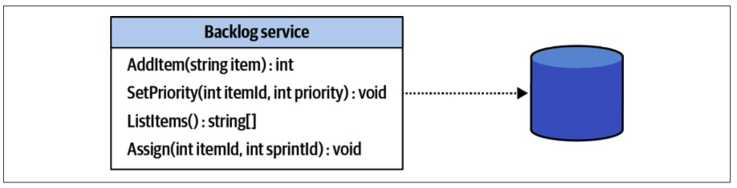
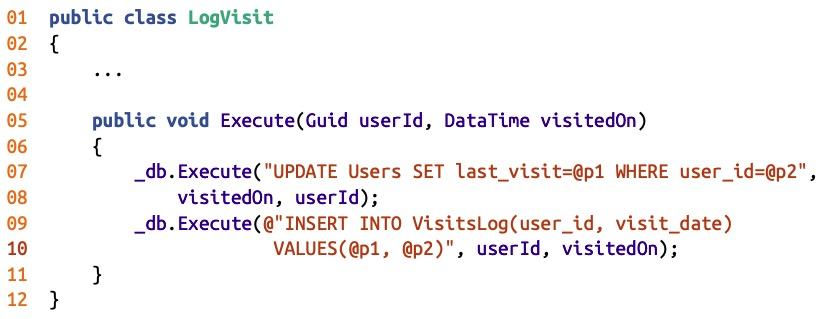
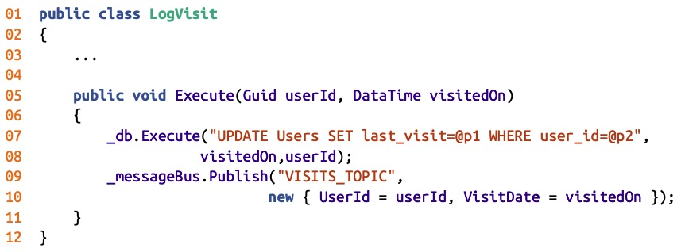
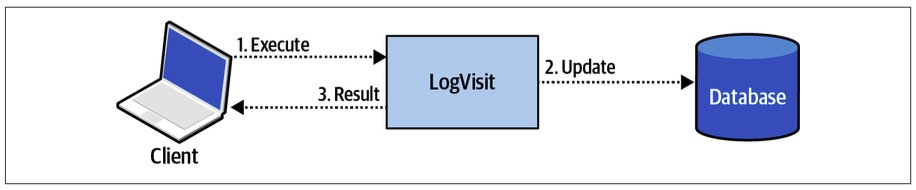
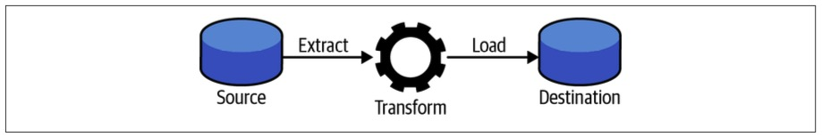
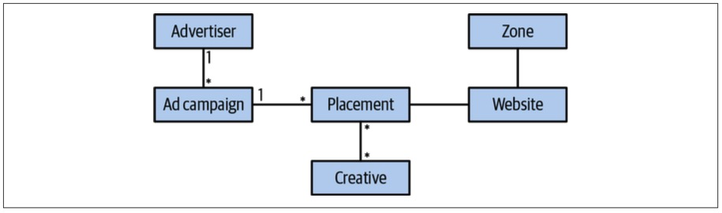

> Chapter 5. Implementing Simple Business Logic
>
> 章节 5. 实现简单业务逻辑

Business logic is the most important part of software.

> 业务逻辑是软件中最重要的部分。

It’s the reason the software is being implemented in the first place.

> 这是软件被实现的首要原因。

A system’s user interface can be sexy-性感的 and its database can be blazing fast and scalable.

> 一个系统的用户界面可以很漂亮，它的数据库可以非常快，并且可以扩展。

But if the software is not useful for the business, it’s nothing but an expensive technology demo.

> 但如果软件对业务没有用处，它就只是一个昂贵的技术演示。

---

As we saw in Chapter 2, not all business subdomains are created equal.

> 正如我们在第2章中看到的，并非所有业务子域都是平等创建的。

Different subdomains have different levels of strategic importance and complexity.

> 不同的子领域具有不同的战略重要性和复杂性。

This chapter begins our exploration of the different ways to model and implement business logic code.

> 本章开始探讨建模和实现业务逻辑代码的不同方法。

We will start with two patterns suited-合适的 for rather-颇,相当 simple business logic: transaction script and active record.

> 我们将从适合于相当简单的业务逻辑的两种模式开始：事务脚本和活动记录。

# Transaction Script

> 事务脚本

> Organizes business logic by procedures where each procedure handles a single request from the presentation.
>
> 通过过程组织业务逻辑，每个过程处理来自表示的单个请求。
>
> ​												—Martin Fowler

A system’s public interface can be seen as a collection of business transactions that consumers can execute, as shown in Figure 5-1.

> 系统的公共接口可以看作是消费者可以执行的业务事务的集合，如图5-1 所示。

These transactions can retrieve information managed by the system, modify it, or both.

> 这些事务可以检索、修改系统管理的信息，或者两者兼而有之。

The pattern organizes the system’s business logic based on procedures, where each procedure implements an operation that is executed by the system’s consumer via its public interface.

> 该模式基于过程组织系统的业务逻辑，其中每个过程实现由系统使用者通过其公共接口执行的操作。

In effect, the system’s public operations are used as encapsulation boundaries.

> 实际上，系统的公共操作被用作封装边界。

*Figure 5-1. Transaction script interface*

> 图5-1 事物脚本接口

## Implementation

> 实现

Each procedure-过程,步骤 is implemented as a simple, straightforward procedural-程序上的 script.

> 每个过程都被实现为一个简单、直接的程序上的脚本。

It can use a thin abstraction layer for integrating with storage mechanisms, but it is also free to access the databases directly.

> 它可以使用微抽象层与存储机制集成，但也可以自由地直接访问数据库。

---

The only requirement procedures have to fulfill is transactional behavior.

> 过程必须满足的唯一需求是事务行为。

*Each operation should either succeed or fail but can never result in an invalid state*.

> 每个操作应该成功或失败，但永远不会导致无效状态。

Even if execution of a transaction script fails at the most inconvenient-不便的,打扰的 moment, the system should remain consistent—either by rolling back any changes it has made up until the failure or by executing compensating-补偿 actions.

> 即使事务脚本的执行在最不方便的时刻失败，系统也应该保持一致——要么回滚它在失败之前所做的任何更改，要么执行补偿操作。

The transactional behavior is reflected in the pattern’s name: transaction script.

> 事务行为反映在模式的名称中：事务脚本。

---

Here is an example of a transaction script that converts batches of JSON files into XML files:

> 下面是一个将批量 JSON 文件转换为 XML 文件的事务脚本示例：

~~~java
DB.StartTransaction();

var job = DB.LoadNextJob();
var json = LoadFile(job.Source);
var xml = ConvertJsonToXml(json); WriteFile(job.Destination, xml.ToString(); DB.MarkJobAsCompleted(job);

DB.Commit()
~~~

## It’s Not That Easy!

> 没那么容易!

When I introduce the transaction script pattern in my domain-driven design classes, my students often raise their eyebrows-眉毛, and some even ask, “Is it worth our time?

> 当我在我的领域驱动设计课上介绍事务脚本模式时，我的学生经常扬起眉毛，有些人甚至问，“这值得我们花时间吗?”

Aren’t we here for the more advanced patterns and techniques?”

> 我们来这里不是为了更高级的模式和技术吗?”

---

The thing is, the transaction script pattern is a *foundation* for the more advanced business logic implementation patterns you will learn in the forthcoming-即将发生的 chapters.

> 问题是，事务脚本模式是您将在接下来的章节中学习的更高级的业务逻辑实现模式的“基础”。

Furthermore, despite-尽管,即使 its apparent-表面上的 simplicity, it is the easiest pattern to get wrong.

> 此外，尽管它看起来很简单，但它是最容易出错的模式。

A considerable-相当大的,相当重要的 number of production issues I have helped to debug-调试 and fix, in one way or another, often **boiled down**-概括,归纳 to a misimplementation of the transactional behavior of the system’s business logic.

> 我以这样或那样的方式帮助调试和修复了相当多的生产问题，这些问题通常归结为系统业务逻辑的事务行为的错误实现。

---

Let’s take a look at three common, real-life examples of data corruption that results from failing to correctly implement a transaction script.

> 让我们看一下由于未能正确实现事务脚本而导致数据损坏的三个常见的现实示例。

### Lack of transactional behavior

> 缺乏事物行为

A trivial-不重要的,平凡的 example of failing to implement transactional behavior is to issue multiple updates without an overarching transaction. 

> 无法实现事务行为的一个简单示例是在没有全局事务的情况下发出多个更新。

Consider the following method that updates a record in the Users table and inserts a record into the VisitsLog table:

> 考虑下面的方法，更新 Users 表中的一条记录，并将一条记录插入 VisitsLog 表：

If any issue occurs after the record in the Users table was updated (line 7) but before appending the log record on line 9 succeeds, the system will end up in an inconsistent state.

> 如果在更新Users表中的记录之后(第7行)出现任何问题，但在第9行成功追加日志记录之前，系统将以不一致状态结束。

The Users table will be updated but no corresponding record will be written to the VisitsLog table.

> Users 表将被更新，但没有相应的记录将被写入VisitsLog表。

The issue can be due to anything from a network outage-中断,断电 to a database timeout or deadlock, or even a crash-奔溃 of the server executing the process.

> 这个问题可能是由于网络中断、数据库超时或死锁，甚至是执行进程的服务器崩溃造成的。

---

This can be fixed by introducing a proper transaction encompassing-包括,包含 both data changes:

> 这可以通过引入包含数据更改的适当事务来解决：

~~~java
public class LogVisit {
...
  public void Execute(Guid userId, DataTime visitedOn) {
  	try{
			_db.StartTransaction();
			_db.Execute(@"UPDATE Users SET last_visit=@p1 WHERE user_id=@p2", visitedOn, userId);
      _db.Execute(@"INSERT INTO VisitsLog(user_id, visit_date) VALUES(@p1, @p2)", userId, visitedOn);
			_db.Commit(); 
    } catch {
      _db.Rollback();
      throw; 
    }
	} 
}
~~~

The fix is easy to implement due to relational databases’ native-原生 support of transactions spanning multiple records.

> 由于关系数据库本身支持跨多个记录的事务，因此修复很容易实现。

Things get more complicated-复杂的 when you have to issue multiple updates in a database that doesn’t support multirecord transactions, or when you are working with multiple storage mechanisms that are impossible to unite-团结,统一 in a distributed transaction.

> 当您必须在不支持多记录事务的数据库中发布多个更新时，或者当您使用不可能在分布式事务中统一的多个存储机制时，事情会变得更加复杂。

Let’s see an example of **the latter**-后者,后一种 case.

> 让我们看一个后一种情况的例子。

### Distributed transactions

> 分布式事务

In modern-近代的,现代的 distributed systems, it’s a common practice to make changes to the data in a database and then notify other components of the system about the changes by publishing messages into a message bus.

> 在现代分布式系统中，一种常见的做法是对数据库中的数据进行更改，然后通过将消息发布到消息总线来通知系统的其他组件。

Consider that in the previous example, instead of logging a visit in a table, we have to publish it to a message bus:

> 考虑到在前面的例子中，我们必须将其发布到消息总线上，而不是在表中记录访问:

As in the previous example, any failure occurring after line 7 but before line 9 succeeds will corrupt the system’s state.

> 与前面的示例一样，在第7行之后、第9行成功之前发生的任何故障都将破坏系统状态。

The Users table will be updated but the other components won’t be notified as publishing to the message bus has failed.

> Users 表将被更新，但不会通知其他组件，因为向消息总线的发布失败了。

---

Unfortunately, fixing the issue is not as easy as in the previous example.

> 不幸的是，修复这个问题并不像前面的示例那么容易。

Distributed transactions spanning multiple storage mechanisms are complex, hard to scale, error prone-倾向于,易发, and therefore are usually avoided.

> 跨越多种存储机制的分布式事务非常复杂，难以扩展，容易出错，因此通常要避免使用。

In Chapter 8, you will learn how to use the CQRS architectural pattern to populate-充满,填充 multiple storage mechanisms.

> 在第8章中，您将学习如何使用CQRS架构模式来填充多个存储机制。

In addition, Chapter 9 will introduce the outbox-发件箱 pattern, which enables reliable publishing of messages after committing changes to another database.

> 此外，第9章将介绍发件箱模式，它支持在将更改提交到另一个数据库后可靠地发布消息。

---

Let’s see a more intricate-错综复杂的 example of improper implementation of transactional behavior.

> 让我们看一个更复杂的事务行为不正确实现的例子。

### Implicit distributed transactions

> 隐式分布式事务

Consider the following deceptively-看似 simple method:

> 考虑以下看似简单的方法：

~~~java
public class LogVisit {
  ...
  public void Execute(Guid userId) {
    _db.Execute("UPDATE Users SET visits=visits+1 WHERE user_id=@p1", userId);
  } 
}
~~~

Instead of tracking the last visit date as in the previous examples, this method maintains a counter of visits for each user.

> 与前面示例中跟踪最后访问日期不同，该方法为每个用户维护访问计数器。

Calling the method increases the corresponding counter’s-计数器 value by 1.

> 调用该方法将相应计数器的值增加1。

All the method does is update one value, in one table, residing-属于,驻留 in one database. 

> 该方法所做的只是更新驻留在一个数据库中的一个表中的一个值。

Yet this is still a distributed transaction that can potentially lead to inconsistent state.

> 然而，这仍然是一个分布式事务，可能会导致不一致的状态。

---

This example constitutes a distributed transaction because it communicates information to the databases and the external-外部的 process that called the method, as demonstrated in Figure 5-2.

> 这个例子构成了一个分布式事务，因为它将信息传递给数据库和调用该方法的外部进程，如图5-2所示。

*Figure 5-2.* *The* *LogVisit* *operation updating the data and notifying the caller of the operation’s success or failure*

> 图5-2 LogVisit 操作更新数据并通知调用者操作的成功或失败

---

Although the execute method is of type void, that is, it doesn’t return any data, it still communicates whether the operation has succeeded or failed: if it failed, the caller will get an exception.

> 尽管 execute 方法的类型是 void，也就是说，它不返回任何数据，但它仍然会通信操作是否成功或失败：如果失败，调用者将得到一个异常。

What if the method succeeds, but the communication of the result to the caller fails?

> 如果方法成功了，但是结果与调用者的通信失败了怎么办?

For example:

- If LogVisit is part of a REST service and there is a network outage-中断,断电; or

  > 如果 LogVisit 是 REST 服务的一部分，并且出现了网络中断;或

- If both LogVisit and the caller are running in the same process, but the process fails before the caller gets to track successful execution of the LogVisit action?

  > 如果 LogVisit 和调用者都在同一个进程中运行，但是在调用者跟踪 LogVisit 动作的成功执行之前，进程失败了，会发生什么情况?

In both cases, the consumer will assume failure and try calling LogVisit again.

> 在这两种情况下，使用者都将假定失败并再次尝试调用 LogVisit。

Executing the LogVisit logic again will result in an incorrect increase of the counter’s value.

> 再次执行 LogVisit 逻辑将导致计数器值的不正确增加。

Overall, it will be increased by 2 instead of 1.

> 总的来说，它将增加2而不是1。

As in the previous two examples, the code fails to implement the transaction script pattern correctly, and inadvertently-无意地,不经意地 leads to corrupting the system’s state.

> 与前两个示例一样，代码无法正确实现事务脚本模式，并且无意中导致破坏系统状态。

---

As in the previous example, there is no simple fix for this issue.

> 与前面的示例一样，这个问题没有简单的修复方法。

It all depends on the business domain and its needs.

> 这完全取决于业务领域及其需求。

In this specific example, one way to ensure transactional behavior is to make the operation *idempotent-幂等的*: that is, leading to the same result even if the operation repeated multiple times.

> 在这个特定的示例中，确保事务行为的一种方法是使操作“幂等”：也就是说，即使操作重复多次也会导致相同的结果。

---

For example, we can ask the consumer to pass the value of the counter.

> 例如，我们可以要求消费者传递计数器的值。

To supply the counter’s value, the caller will have to read the current value first, increase it locally, and then provide the updated value as a parameter.

> 要提供计数器的值，调用者必须首先读取当前值，在本地增加它，然后将更新后的值作为参数提供。

Even if the operation will be executed multiple times, it won’t change the end result:

> 即使该操作将被执行多次，它也不会改变最终结果：

~~~java
public class LogVisit {
  ...
  public void Execute(Guid userId, long visits) {
    _db.Execute("UPDATE Users SET visits = @p1 WHERE user_id=@p2", visits, userId);
  } 
}
~~~

Another way to address such an issue is to use optimistic concurrency-并发性 control: prior to calling the LogVisit operation, the caller has read the counter’s current value and passed it to LogVisit as a parameter.

> 解决此类问题的另一种方法是使用乐观并发控制：在调用 LogVisit 操作之前，调用者已经读取了计数器的当前值，并将其作为参数传递给 LogVisit。

LogVisit will update the counter’s value only if it equals the one initially read by the caller:

> 只有当计数器的值等于调用者最初读取的值时，LogVisit 才会更新计数器的值：

~~~java
public class LogVisit {
	...
  public void Execute(Guid userId, long expectedVisits) {
    _db.Execute(@"UPDATE Users SET visits=visits+1 WHERE user_id=@p1 and visits = @p2", userId, visits);
  } 
}
~~~

Subsequent executions of LogVisit with the same input parameters won’t change the data, as the WHERE...visits = @prm2 condition won’t be fulfilled-履行,满足.

> 随后使用相同的输入参数执行 LogVisit 不会改变数据，就像 WHERE…visits = @prm2 条件不满足。

## When to Use Transaction Script

> 何时使用事务脚本

The transaction script pattern is well adapted to the most straightforward-直截了当地 problem domains in which the business logic resembles simple procedural operations.

> 事务脚本模式非常适合最直接的问题域，其中的业务逻辑类似于简单的过程操作。

For example, in extract-transform-load (ETL) operations, each operation extracts data from a source, applies transformation logic to convert it into another form, and loads the result into the destination store.

> 例如，在提取-转换-加载(ETL)操作中，每个操作从源提取数据，应用转换逻辑将其转换为另一种形式，并将结果加载到目标存储中。

This process is shown in Figure 5-3.

> 该流程如图5-3 所示。

*Figure 5-3. Extract-transform-load data* *flow*

> 图5-3 提取-转换-加载数据流

The transaction script pattern naturally fits supporting subdomains where, by definition, the business logic is simple.

> 事务脚本模式自然适合支持子域，根据定义，这些子域的业务逻辑很简单。

It can also be used as an adapter-适配器 for integration with external systems—for example, generic subdomains, or as a part of an anticorruption layer (more on that in Chapter 9).

> 它还可以用作与外部系统集成的适配器——例如，通用子域，或者作为反腐败层的一部分(在第9章中有更多介绍)。

---

The main advantage of the transaction script pattern is its simplicity.

> 事务脚本模式的主要优点是简单。

It introduces minimal abstractions and minimizes the overhead both in runtime performance and in understanding the business logic.

> 它引入了最少的抽象，并将运行时性能和理解业务逻辑方面的开销降至最低。

That said, this simplicity is also the pattern’s disadvantage.

> 也就是说，这种简单性也是该模式的缺点。

The more complex the business logic gets, the more it’s prone-倾向于,易发 to duplicate-复制,复印 business logic across transactions, and consequently-因此,结果, to result in inconsistent behavior—when the duplicated code goes out of sync.

> 业务逻辑越复杂，跨事务复制业务逻辑的可能性就越大，从而导致不一致的行为——当复制的代码不同步时。

As a result, transaction script should never be used for core subdomains, as this pattern won’t cope-对付,处理 with the high complexity of a core subdomain’s business logic.

> 因此，事务脚本永远不应该用于核心子域，因为这种模式无法处理核心子域业务逻辑的高度复杂性。

---

This simplicity earned-赚得,赢得 the transaction script a dubious-靠不住的,有疑虑的 reputation-名誉,名声.

> 这种简单性为事务脚本赢得了可疑的声誉。

Sometimes the pattern is even treated as an antipattern-反模式.

> 有时，该模式甚至被视为反模式。

After all, if complex business logic is implemented as a transaction script, **sooner rather than later**-尽早,不久之后 it’s going to turn into an unmaintainable, big ball of mud.

> 毕竟，如果将复杂的业务逻辑实现为事务脚本，那么它迟早会变成一个不可维护的大泥球。

It should be noted, however, that despite-尽管 the simplicity, the transaction script pattern is ubiquitous-无所不在的 in software development.

> 然而，应该注意的是，尽管简单，事务脚本模式在软件开发中无处不在。

All the business logic implementation patterns that we will discuss in this and the following chapters, in one way or another, are based on the transaction script pattern.

> 我们将在本章和后续章节中讨论的所有业务逻辑实现模式都以某种方式基于事务脚本模式。

# Active Record

> *An object that wraps-包装 a row in a database table or view, encapsulates the database access, and adds domain logic on that data.*
>
> 封装数据库表或视图中的一行，封装数据库访问，并在该数据上添加领域逻辑的对象
>
> —Martin Fowler

Like the transaction script pattern, active record supports cases where the business logic is simple.

> 与事务脚本模式一样，活动记录支持业务逻辑简单的情况。

Here, however-然而,可是, the business logic may operate on more complex data structures.

> 但是，这里的业务逻辑可以在更复杂的数据结构上操作。

For example, instead of flat-水平的 records, we can have more complicated object trees and hierarchies, as shown in Figure 5-4.

> 例如，我们可以有更复杂的对象树和层次结构，而不是平面记录，如图5-4所示。

*Figure 5-4. A more complicated data model with one-to-many and many-to-many relationships*

> 图5-4 具有一对多和多对多关系的更复杂的数据模型

Operating on such data structures via a simple transaction script would result in lots of repetitive code.

> 通过一个简单的事务脚本操作这样的数据结构会导致大量重复的代码。

The mapping of the data to an in-memory representation would be duplicated **all over**-到处都是.

> 数据到内存中表示的映射将在各处重复。

## Implementation

> 实现

Consequently, this pattern uses dedicated-专门的 objects, known as active records, to represent complicated data structures.

> 因此，此模式使用专用对象(称为活动记录)来表示复杂的数据结构。

Apart from the data structure, these objects also implement data access methods for creating, reading, updating, and deleting records—the so-called CRUD operations.

> 除了数据结构之外，这些对象还实现了用于创建、读取、更新和删除记录的数据访问方法——即所谓的CRUD操作。

As a result, the active record objects are coupled to an object-relational mapping (ORM) or some other data access framework. 

> 因此，活动记录对象被耦合到对象关系映射(ORM)或其他一些数据访问框架。

The pattern’s name is derived-源于,衍生 from the fact that each data structure is “active”; that is, it implements data access logic.

> 模式的名字来源于这样一个事实：每个数据结构都是“活动的”；也就是说，它实现了数据访问逻辑。

---

As in the previous pattern, the system’s business logic is organized in a transaction script.

> 与前面的模式一样，系统的业务逻辑组织在事务脚本中。

The difference between the two patterns is that in this case, instead of accessing the database directly, the transaction script manipulates active record objects.

> 这两种模式的区别在于，在这种情况下，事务脚本操作活动记录对象，而不是直接访问数据库。

When it completes, the operation has to either complete or fail as an atomic-原子的 transaction:

> 当它完成时，操作必须作为原子事务完成或失败：

~~~java
public class CreateUser {
  ...
  public void Execute(userDetails) {
    try{
      _db.StartTransaction();
      var user = new User();
      user.Name = userDetails.Name;
      user.Email = userDetails.Email; 
      user.Save();
      _db.Commit(); 
    } catch {
      _db.Rollback();
      throw; 
    }
  } 
}
~~~

The pattern’s goal is to encapsulate the complexity of mapping the in-memory object to the database’s schema.

> 该模式的目标是将内存中对象映射到数据库模式的复杂性封装起来。

In addition to being responsible for persistence, the active record objects can contain business logic; for example, validating new values assigned to the fields, or even implementing business-related procedures that manipulate an object’s data.

> 除了负责持久化之外，活动记录对象还可以包含业务逻辑；例如，验证分配给字段的新值，甚至实现操作对象数据的业务相关过程。

That said, the distinctive-独特的,与众不同的 feature of an active record object is the separation of data structures and behavior (business logic). 

> 也就是说，活动记录对象的独特特性是数据结构和行为(业务逻辑)的分离。

Usually, an active record’s fields have public getters and setters that allow external procedures to modify its state.

> 通常，活动记录的字段具有公共 getter 和 setter，它们允许外部过程修改其状态。

## When to Use Active Record

> 何时使用活动记录

Because an active record is essentially a transaction script that optimizes access to databases, this pattern can only support relatively simple business logic, such as CRUD operations, which, at most, validate the user’s input.

> 由于活动记录本质上是一个优化数据库访问的事务脚本，因此此模式只能支持相对简单的业务逻辑，例如最多验证用户输入的CRUD操作。

---

Accordingly-相应地, as in the case of the transaction script pattern, the active record pattern **lends itself to**-适合于 supporting subdomains, integration of external solutions for generic subdomains, or model transformation tasks.

> 相应地，与事务脚本模式的情况一样，活动记录模式适合于支持子域、集成通用子域的外部解决方案或模型转换任务。

The difference between the patterns is that active record addresses the complexity of mapping complicated data structures to a database’s schema-模式.

> 这两种模式的区别在于，活动记录解决了将复杂的数据结构映射到数据库模式的复杂性。

---

The active record pattern is also known as an *anemic-贫血的 domain model antipattern*; in other words, an improperly designed domain model.

> 活动记录模式也被称为“贫血域模型反模式”；换句话说，就是设计不当的领域模型。

I prefer to restrain-约束,抑制 from the negative-负面的 connotation-内涵意义 of the words *anemic* and *antipattern*.

> 我更愿意避免“贫血”和“反模式”这两个词的负面含义。

This pattern is a tool.

Like any tool, it can solve problems, but it can potentially introduce more harm-伤害,损害 than good when applied in the wrong context. 

> 像任何工具一样，它可以解决问题，但如果应用在错误的上下文中，它可能会带来更多的坏处。

There is nothing wrong with using active records when the business logic is simple.

>当业务逻辑很简单时，使用活动记录并没有什么问题。

Furthermore-此外,而且, using a more elaborate-复杂的 pattern when implementing simple business logic will also result in harm by introducing accidental complexity.

> 此外，在实现简单业务逻辑时使用更精细的模式也会因引入意外的复杂性而造成危害。

In the next chapter, you will learn what a domain model is and how it differs from an active record pattern.

> 在下一章中，您将了解什么是领域模型以及它与活动记录模式的区别。

---

It’s important to stress that in this context, *active record* refers to the design pattern, not the Active Record framework.

> 需要强调的是，在这个上下文中，“活动记录”指的是设计模式，而不是活动记录框架。

The pattern name was coined in *Patterns of Enterprise Application Architecture* by Martin Fowler.

> 模式名称是Martin Fowler在《企业应用架构模式》中提出的。

The framework came later as one way to implement the pattern.

> 框架是后来作为实现模式的一种方式出现的。

In our context, we are talking about the design pattern and the concepts behind it, not a specific implementation.

> 在我们的上下文中，我们讨论的是设计模式及其背后的概念，而不是具体的实现。

# Be Pragmatic-务实的

> 是务实的

Although business data is important and the code we design and build should protect its integrity-完整,完全, there are cases in which a pragmatic approach is more desirable.

> 尽管业务数据很重要，我们设计和构建的代码应该保护其完整性，但在某些情况下，更需要实用的方法。

---

Especially at high levels of scale, there are cases when data consistency guarantees can be relaxed-放松的,轻松的.

> 特别是在高规模的情况下，有些情况下可以放松数据一致性保证。

Check whether corrupting-损坏 the state of one record out of 1 million is really a showstopper for the business and whether it can negatively affect the performance and profitability-盈利能力 of the business.

> 检查100万条记录中损坏一条记录的状态是否真的会对业务造成影响，以及它是否会对业务的性能和盈利能力产生负面影响。

For example, let’s assume you are building a system that ingests-吸收,接待 billions of events per day from IoT devices.

> 例如，假设您正在构建一个每天从物联网设备摄取数十亿个事件的系统。

Is it a big deal if 0.001% of the events will be duplicated or lost?

> 如果0.001%的事件重复或丢失，这有什么大不了的?

---

As always, there are no universal-普遍的,全体的 laws-规律.

> 一如既往，没有普遍的规律。

It all depends on the business domain you are working in.

> 这完全取决于您所从事的业务领域。

It’s OK to “cut corners” where possible; just make sure you evaluate the risks and business implications-影响.

> 在可能的地方“偷工减料”是可以的；只是要确保你评估了风险和业务影响。

# Conclusion

> 总结

In this chapter, we covered two patterns for implementing business logic:

> 在本章中，我们介绍了实现业务逻辑的两种模式:

*Transaction script*

This pattern organizes the system’s operations as simple, straightforward procedural scripts.

> 这种模式将系统的操作组织为简单、直接的过程脚本。

The procedures ensure that each operation is transactional—either it succeeds or it fails.

> 这些过程确保每个操作都是事务性的——要么成功，要么失败。

The transaction script pattern **lends itself to**-适用于 supporting subdomains, with business logic resembling simple, ETL-like operations.

> 事务脚本模式**适合**-适用于支持子域，其业务逻辑类似于简单的、类似于etl的操作。

---

*Active record*

When the business logic is simple but operates on complicated data structures, you can implement those data structures as active records.

> 当业务逻辑很简单但操作复杂的数据结构时，可以将这些数据结构实现为活动记录。

An active record object is a data structure that provides simple CRUD data access methods.

> 活动记录对象是提供简单CRUD数据访问方法的数据结构。

---

The two patterns discussed in this chapter are oriented toward cases of rather-颇,相当 simple business logic.

> 本章讨论的两种模式都是针对相当简单的业务逻辑的。

In the next chapter, we will turn to more complex business logic and discuss how to tackle the complexity using the domain model pattern.

> 在下一章中，我们将转向更复杂的业务逻辑，并讨论如何使用域模型模式来处理复杂性。

