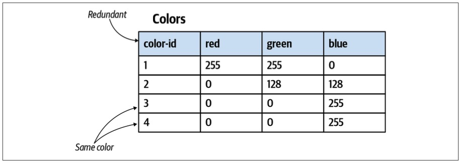
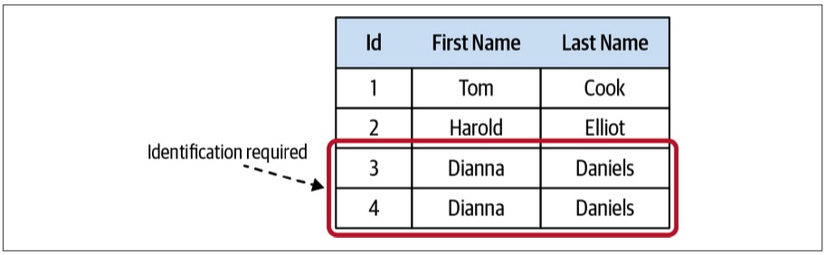
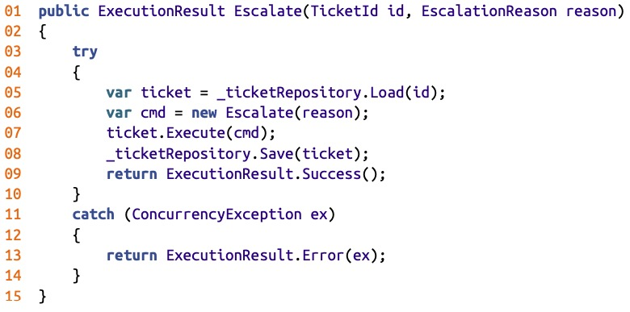
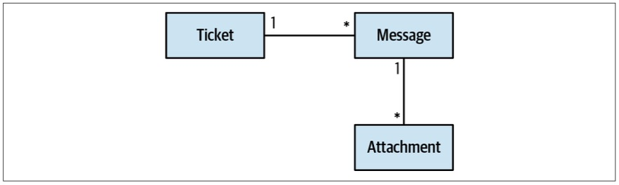
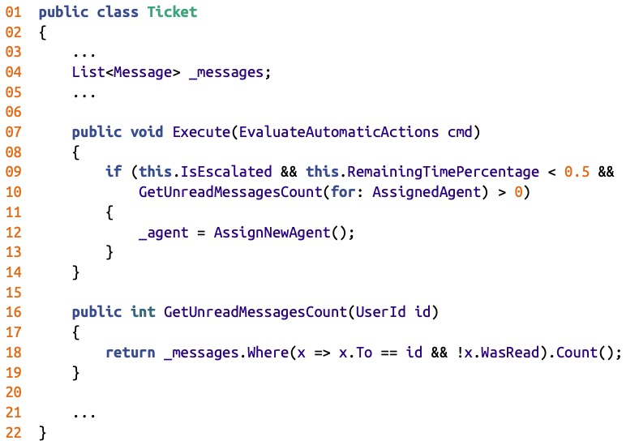
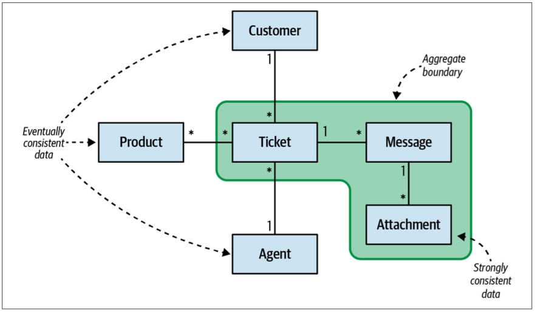
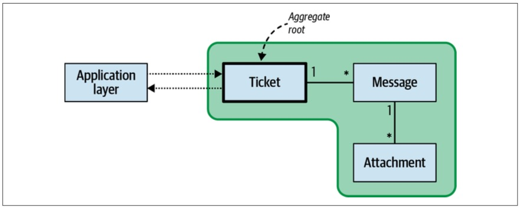
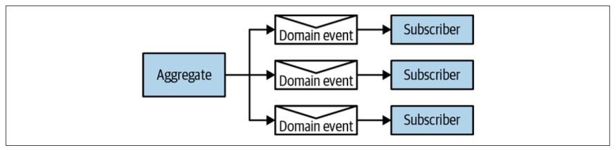
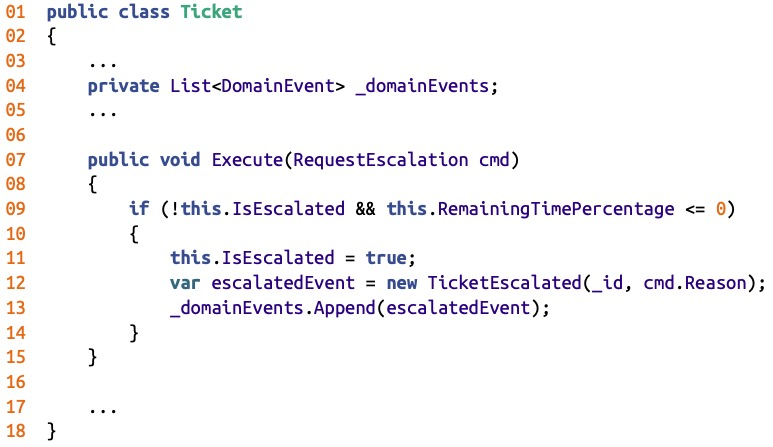
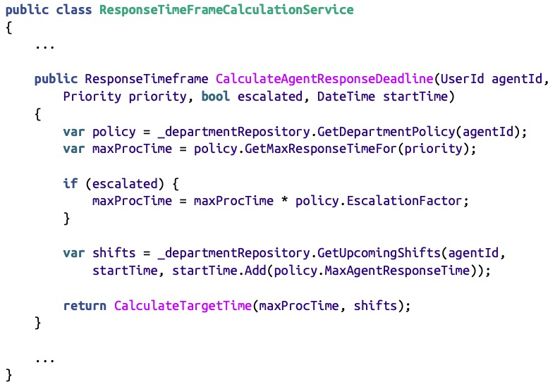

> Chapter 6. Tackling Complex Business Logic
>
> 章节 6. 处理复杂业务逻辑

The previous chapter discussed two patterns addressing cases of relatively simple business logic: transaction script and active record.

> 前一章讨论了处理相对简单的业务逻辑的两种模式：事务脚本和活动记录。

This chapter continues the topic of implementing business logic and introduces a pattern oriented for complicated business logic: the domain model pattern.

> 本章继续讨论实现业务逻辑的主题，并介绍面向复杂业务逻辑的模式：领域模型模式。

# History

As with both the transaction script and active record patterns, the domain model pattern was introduced initially in Martin Fowler’s book *Patterns of Enterprise Application Architecture*.

> 与事务脚本和活动记录模式一样，领域模型模式最初是在 Martin Fowler 的《企业应用程序体系结构模式》一书中引入的。

Fowler concluded his discussion of the pattern by saying, “Eric Evans is currently writing a book on building Domain Models.”

> Fowler这样总结了他对模式的讨论：“Eric Evans目前正在写一本关于构建领域模型的书。”

The referenced book is Evans’s seminal work, *Domain-Driven Design: Tackling Complexity in the Heart of* *Software.*

> 参考书籍是 Evans 的开创性著作《领域驱动设计:解决软件核心的复杂性》

---

In his book, Evans presents a set of patterns aimed at tightly-紧紧地,牢固地 relating the code to the underlying model of the business domain: aggregate, value objects, repositories, and others.

> 在他的书中，Evans提出了一组模式，旨在将代码与业务领域的底层模型紧密地联系起来(紧紧地，牢固地)：聚合、值对象、存储库等。

These patterns closely follow where Fowler left off in his book and resemble an effective set of tools for implementing the domain model pattern.

> 这些模式紧跟 Fowler 在他的书中留下的内容，类似于实现领域模型模式的有效工具集。

---

The patterns that Evans introduced are often referred to as *tactical domain-driven design*.

> Evans 介绍的模式通常被称为“战术领域驱动设计”。

To eliminate the confusion-困惑,混淆 of thinking that implementing domain-driven design necessarily entails-使必要,需要 the use of these patterns to implement business logic, I prefer to stick with Fowler’s original terminology.

> 为了消除对实现领域驱动设计必须使用这些模式来实现业务逻辑的想法的混淆，我更倾向于坚持使用 Fowler 的原始术语。

The pattern is “domain model,” and the aggregates and value objects are its building blocks.

> 模式是“领域模型”，聚合和值对象是它的构建块。

# Domain Model

> 领域模型

The domain model pattern is intended to cope-对付,处理 with cases of complex business logic.

> 领域模型模式旨在处理复杂业务逻辑的情况。

Here, instead of CRUD interfaces, we deal with complicated state transitions-转换,转变, business rules, and invariants: rules that have to be protected at all times.

> 这里，我们处理的不是CRUD接口，而是复杂的状态转换、业务规则和不变量：必须始终保护的规则。

---

Let’s assume we are implementing a help desk system.

> 假设我们正在实现一个帮助台系统。

Consider the following excerpt-摘录,节选 from the requirements that describes the logic controlling the lifecycles of support tickets:

> 考虑下面的需求摘录，它描述了控制支持票据生命周期的逻辑：

- Customers open support tickets describing issues they are facing.

  > 客户打开支持单描述他们所面临的问题。

- Both the customer and the support agent append messages, and all the correspondence-信件 is tracked by the support ticket.

  > 客户和支持代理都附加消息，所有通信都由支持票跟踪。

- Each ticket has a priority: low, medium, high, or urgent.

  > 每张票都有一个优先级：低、中、高或紧急。

- An agent should offer a solution within a set time limit (SLA) that is based on the ticket’s priority.

  > 代理应在基于票务优先级的设定时间限制(SLA)内提供解决方案。

- If the agent doesn’t reply within the SLA, the customer can escalate the ticket to the agent’s manager.

  > 如果代理没有在 SLA 范围内回复，客户可以将该 ticket 升级到代理的经理。

- Escalation reduces the agent’s response time limit by 33%.

  > 升级将代理的响应时间限制减少33%。

- If the agent didn’t open an escalated ticket within 50% of the response time limit, it is automatically reassigned to a different agent.

  > 如果代理在响应时间限制的50%内没有打开升级票证，则会自动将其重新分配给不同的代理。

- Tickets are automatically closed if the customer doesn’t reply to the agent’s questions within seven days.

  > 如果客户在7天内没有回复代理的问题，则票将自动关闭。

- Escalated tickets cannot be closed automatically or by the agent, only by the customer or the agent’s manager.

  > 升级门票不能自动关闭或由代理商关闭，只能由客户或代理商的经理关闭。

- A customer can reopen a closed ticket only if it was closed in the past seven days.

  > 只有在过去7天内关闭的票据，客户才能重新打开。

These requirements form an entangled-使纠缠,卷入 net of dependencies among the different rules, all affecting the support ticket’s lifecycle management logic.

> 这些需求在不同规则之间形成了一个纠缠的依赖关系网，所有这些都影响到支持票据的生命周期管理逻辑。

This is not a CRUD data entry screen, as we discussed in the previous chapter.

> 这不是我们在前一章中讨论过的 CRUD 数据输入屏幕。

Attempting to implement this logic using active record objects will make it easy to duplicate-复制 the logic and corrupt-损坏,破坏 the system’s state by misimplementing some of the business rules.

> 尝试使用活动记录对象实现此逻辑将很容易复制该逻辑，并由于错误实现某些业务规则而破坏系统状态。

## Implementation

A domain model is an object model of the domain that incorporates-包含,结合 both behavior and data.

> 领域模型是包含行为和数据的领域的对象模型。

DDD’s tactical patterns—aggregates, value objects, domain events, and domain services—are the building blocks of such an object model.

> DDD的战术模式——聚合、值对象、领域事件和领域服务——是这种对象模型的构建块。

---

All of these patterns share a common theme: they put the business logic first.

> 所有这些模式都有一个共同的主题：它们将业务逻辑放在首位。

Let’s see how the domain model addresses different design concerns.

> 让我们看看领域模型如何处理不同的设计关注点。

### Complexity

The domain’s business logic is already inherently complex, so the objects used for modeling it should not introduce any additional accidental complexities.

> 领域的业务逻辑本来就很复杂，因此用于对其建模的对象不应该引入任何额外的意外复杂性。

The model should be devoid-缺乏,完全没有 of any infrastructural or technological concerns, such as implementing calls to databases or other external components of the system.

> 该模型应该不涉及任何基础结构或技术问题，例如实现对数据库或系统的其他外部组件的调用。

This restriction requires the model’s objects to be *plain-普通的 old objects*, objects implementing business logic without relying on or directly incorporating any infrastructural components or frameworks.

> 这种限制要求模型的对象是“普通的旧对象”，即实现业务逻辑的对象，而不依赖或直接合并任何基础设施组件或框架。

### Ubiquitous language

The emphasis on business logic instead of technical concerns makes it easier for the domain model’s objects to follow the terminology of the bounded context’s ubiquitous language.

> 强调业务逻辑而不是技术问题，使得领域模型的对象更容易遵循限界上下文的统一语言的术语。

In other words, this pattern allows the code to “speak” the ubiquitous language and to follow the domain experts’ mental models.

> 换句话说，这种模式允许代码“说”统一语言，并遵循领域专家的心智模型。

## Building Blocks

Let’s look at the central domain model building blocks, or tactical patterns, offered by DDD: value objects, aggregates, and domain services.

> 让我们看一下 DDD 提供的核心领域模型构建块或策略模式：值对象、聚合和领域服务。

### Value object

A value object is an object that can be identified by the composition-构成,组成 of its values.

> 值对象是可以通过其值的组合来标识的对象。

For example, consider a color object:

> 例如，考虑一个颜色对象:

~~~java
class Color {
  int _red; 
  int _green;
  int _blue; 
}
~~~

The composition of the values of the three fields red, green, and blue defines a color.

> 红色、绿色和蓝色三个字段值的组合定义了一种颜色。

Changing the value of one of the fields will result in a new color.

> 更改其中一个字段的值将产生新的颜色。

No two colors can have the same values.

> 没有两种颜色可以有相同的值。

Also, two instances of the same color must have the same values.

> 同样，相同颜色的两个实例必须具有相同的值。

Therefore, no explicit identification field is needed to identify colors.

> 因此，不需要显式的标识字段来标识颜色。

---

The ColorId field shown in Figure 6-1 is not only redundant, but actually creates an opening for bugs.

> 如图 6-1 所示的 ColorId 字段不仅是多余的，而且实际上为 bug 创造了一个机会。

You could create two rows with the same values of red, green, and blue, but comparing the values of ColorId would not reflect that this is the same color.

> 您可以创建具有相同的红色、绿色和蓝色值的两行，但是比较 ColorId 的值不会反映这是相同的颜色。

*Figure 6-1. Redundant* *ColorId* *field,* *making it possible to have two rows with the same values*

> 图6-1 冗余的 ColorId 字段，可以有两行相同的值

#### **Ubiquitous language.** 

Relying exclusively on the language’s standard library’s primitive data types—such as strings, integers, or dictionaries—to represent concepts of the business domain is known as the primitive obsession-痴迷,困扰 code smell.

> 完全依赖语言的标准库的基本数据类型(如字符串、整数或字典)来表示业务领域的概念，这被称为基本痴迷代码气味。

For example, consider the following class:

~~~java
class Person {
  private int _id;
  private string _firstName; 
  private string _lastName; 
  private string _landlinePhone; 
  private string _mobilePhone; 
  private string _email;
  private int _heightMetric; 
  private string _countryCode;
  public Person(...) {...}
}

static void Main(string[] args) {
  var dave = new Person( id: 30217,
            firstName: "Dave",
            lastName: "Ancelovici",
            landlinePhone: "023745001",
            mobilePhone: "0873712503",
            email: "dave@learning-ddd.com",
            heightMetric: 180,
            countryCode: "BG");
}
~~~

In the preceding implementation of the Person class, most of the values are of type String and they are assigned based on convention-约定.

> 在前面的 Person 类实现中，大多数值都是 String 类型的，它们是根据约定分配的。

For example, the input to the landlinePhone should be a valid landline-固定 phone number, and the countryCode should be a valid, two-letter, uppercased country code.

> 例如，landlinePhone 的输入应该是一个有效的固定电话号码，而countryCode应该是一个有效的两个字母大写的国家代码。

Of course, the system cannot trust the user to always supply correct values, and as a result, the class has to validate all input fields.

> 当然，系统不能相信用户总是提供正确的值，因此，类必须验证所有输入字段。

---

This approach presents multiple design risks.

> 这种方法存在多种设计风险。

First, the validation logic tends to be duplicated.

> 首先，验证逻辑往往是重复的。

Second, it’s hard to enforce calling the validation logic before the values are used.

> 其次，很难在使用值之前强制调用验证逻辑。

It will become even more challenging in the future, when the codebase will be evolved by other engineers.

> 在未来，当代码库将由其他工程师改进时，这将变得更具挑战性。

---

Compare the following alternative design of the same object, this time leveraging value objects:

> 比较相同对象的以下替代设计，这次是利用值对象：

~~~java
class Person {
  private PersonId _id; 
  private Name _name; 
  private PhoneNumber _landline; 
  private PhoneNumber _mobile; 
  private EmailAddress _email; 
  private Height _height; 
  private CountryCode _country;
  public Person(...) { ... } 
}

static void Main(string[] args) {
  var dave = new Person(
    id: new PersonId(30217),
    name: new Name("Dave", "Ancelovici"), 
    landline: PhoneNumber.Parse("023745001"),
    mobile: PhoneNumber.Parse("023745001"),
		email: Email.Parse("dave@learning-ddd.com"),
		height: Height.FromMetric(180),
    country:  CountryCode.Parse("BG"));
}
~~~

First, notice the increased clarity.

> 首先，注意清晰度的提高。

Take, for example, the country variable.

> 以 country 变量为例。

There is no need to elaborately-精巧地,苦心经营地 call it “countryCode” to communicate the intent of it holding a country code and not, for example, a full country name.

> 没有必要详细地将其称为“countryCode”来传达它持有国家代码而不是(例如)完整的国家名称的意图。

The value object makes the intent clear, even with shorter variable-变量 names.

> 即使使用较短的变量名，value 对象也能使意图清晰。

---

Second, there is no need to validate the values before the assignment, as the validation logic resides-居住,居留 in the value objects themselves.

> 其次，在赋值之前不需要验证值，因为验证逻辑驻留在值对象本身中。

However, a value object’s behavior is not limited to mere-仅仅,只不过 validation.

> 然而，值对象的行为并不仅仅局限于验证。

Value objects shine-光芒 brightest-最亮的 when they centralize the business logic that manipulates the values.

> 当值对象集中了操作值的业务逻辑时，它们的光芒最为耀眼。

The cohesive logic is implemented in one place and is easy to test.

> 内聚逻辑在一个地方实现，并且易于测试。

Most importantly, value objects express the business domain’s concepts: they make the code speak the ubiquitous language.

> 最重要的是，值对象表达了业务领域的概念：它们使代码使用统一语言。

---

Let’s see how representing the concepts of height, phone numbers, and colors as value objects makes the resultant-由此引起的,因而发生的 type system rich and intuitive-使用简便的 to use.

> 让我们看看如何将高度、电话号码和颜色的概念表示为值对象，从而使生成的类型系统丰富且易于使用。

---

Compared to an integer-based value, the Height value object both makes the intent-目的,意图 clear and decouples the measurement from a specific measurement-测量 unit.

> 与基于整数的值相比，Height 值对象既使意图清晰，又将测量与特定的测量单元解耦。

For example, the Height value object can be initialized using both metric-公制的 and imperial-英制的 units, making it easy to convert from one unit to another, generating string representation, and comparing values of different units:

> 例如，Height 值对象可以使用公制和英制单位进行初始化，从而可以轻松地从一个单位转换为另一个单位，生成字符串表示，并比较不同单位的值：

~~~java
var heightMetric = Height.Metric(180);
var heightImperial = Height.Imperial(5, 3);
var string1 = heightMetric.ToString(); // "180cm"
var string2 = heightImperial.ToString(); // "5 feet 3 inches" 
var string3 = heightMetric.ToImperial().ToString(); // "5 feet 11 inches"
var firstIsHigher = heightMetric > heightImperial; // true
~~~

---

The PhoneNumber value object can encapsulate the logic of parsing a string value, validating it, and extracting different attributes of the phone number; for example, the country it belongs to and the phone number’s type—landline-固定电话 or mobile:

> PhoneNumber值对象可以封装解析字符串值、验证字符串值以及提取电话号码的不同属性的逻辑;例如，它所属的国家和电话号码的类型是座机还是移动电话;

~~~java
var phone = PhoneNumber.Parse("+359877123503");
var country = phone.Country; // "BG"
var phoneType = phone.PhoneType; // "MOBILE" 
var isValid = PhoneNumber.IsValid("+972120266680"); // false
~~~

---

The following example demonstrates the power of a value object when it encapsulates all of the business logic that manipulates the data and produces new instances of the value object:

> 下面的例子演示了值对象的强大功能，它封装了所有操作数据的业务逻辑，并产生了值对象的新实例：

~~~java
var red = Color.FromRGB(255, 0, 0); 
var green = Color.Green;
var yellow = red.MixWith(green);
var yellowString = yellow.ToString(); // "#FFFF00"
~~~

---

As you can see in the preceding examples, value objects eliminate the need for conventions—for example, the need to keep in mind that this string is an email and the other string is a phone number—and instead makes using the object model less error prone and more intuitive-易懂的,使用简便的.

> 正如您在前面的示例中看到的那样，值对象消除了对约定的需要(例如，不需要记住这个字符串是电子邮件，而另一个字符串是电话号码)，并且使使用对象模型更不容易出错，更直观。

#### Implementation.

Since a change to any of the fields of a value object results in a different value, value objects are implemented as immutable-永恒的,不可改变的 objects.

> 由于对值对象的任何字段的更改都会导致不同的值，因此值对象被实现为不可变对象。

A change to one of the value object’s fields conceptually creates a different value—a different instance of a value object. 

> 从概念上讲，对值对象字段之一的更改会创建一个不同的值——一个值对象的不同实例。

Therefore, when an executed action results in a new value, as in the following case, which uses the MixWith method, it doesn’t modify the original instance but instantiates and returns a new one:

> 因此，当执行的动作产生一个新值时，就像下面的例子一样，使用 MixWith 方法，它不会修改原始实例，而是实例化并返回一个新实例：

~~~java
public class Color {
    public readonly byte Red;
    public readonly byte Green;
    public readonly byte Blue;

    public Color(byte r, byte g, byte b) {
        this.Red = r;
        this.Green = g;
        this.Blue = b;
    }

    public Color MixWith(Color other) {
        return new Color(
          r:(byte) Math.Min(this.Red + other.Red, 255),
          g:(byte) Math.Min(this.Green + other.Green, 255), 
          b:(byte) Math.Min(this.Blue + other.Blue, 255)
        );
    }
  ...
}
~~~

Since the equality of value objects is based on their values rather than on an id field or reference, it’s important to override and properly implement the equality checks.

> 由于值对象的相等性是基于它们的值，而不是基于id字段或引用，因此重写并正确实现相等性检查非常重要。

For example, in C#:

~~~java
public class Color {
  //...
  public override bool Equals(object obj) {
    var other = obj as Color;
    return other != null &&
                this.Red == other.Red && this.Green == other.Green && this.Blue == other.Blue;
  }
 
  public static bool operator ==(Color lhs, Color rhs)
  {
    if (Object.ReferenceEquals(lhs, null)) {
      return Object.ReferenceEquals(rhs, null);
    }
    return lhs.Equals(rhs);
  }

  public static bool operator !=(Color lhs, Color rhs)
  {
    return !(lhs == rhs);
  }

  public override int GetHashCode() {
    return ToString().GetHashCode();
  }

  //...
}
~~~

Although using a core library’s Strings to represent domain-specific values contradicts-相抵触,相矛盾 the notion of value objects, in .NET, Java, and other languages the string type is implemented exactly as a value object.

> 尽管使用核心库的字符串来表示特定于领域的值与值对象的概念相矛盾，但在 .net、Java 和其他语言中，字符串类型被精确地实现为值对象。

Strings are immutable-永恒的,不可改变的, as all operations result in a new instance.

> 字符串是不可变的，因为所有操作都会产生一个新实例。

Moreover-此外,而且, the string type encapsulates a rich behavior that creates new instances by manipulating the values of one or more strings: trim, concatenate-连接 multiple strings, replace characters, substring, and other methods.

> 此外，String 类型封装了丰富的行为，通过操作一个或多个字符串的值来创建新实例：trim、连接多个字符串、替换字符、子字符串和其他方法。

#### When to use value objects. 

The simple answer is, whenever-无论何时 you can.

> 简单的回答是，只要你能。

Not only do value objects make the code more expressive-富于表现力的 and encapsulate business logic that tends to spread-扩散,分散 apart, but the pattern makes the code safer.

>值对象不仅使代码更具表现力并封装了分散的业务逻辑，而且模式使代码更安全。

Since value objects are immutable, the value objects’ behavior is free of **side effects**-副作用 and is thread safe.

> 由于值对象是不可变的，因此值对象的行为没有副作用，并且是线程安全的。

---

From a business domain perspective, a useful rule of thumb is to use value objects for the domain’s elements that describe properties of other objects.

> 从业务域的角度来看，一个有用的经验法则是对描述其他对象属性的域元素使用值对象。

This namely applies to properties of entities, which are discussed in the next section.

> 这也适用于实体的属性，这将在下一节中讨论。

The examples you saw earlier used value objects to describe a person, including their ID, name, phone numbers, email, and so on.

> 前面看到的示例使用值对象来描述一个人，包括他们的ID、姓名、电话号码、电子邮件等等。

Other examples of using value objects include various statuses, passwords, and more business domain–specific concepts that can be identified by their values and thus do not require an explicit identification field.

> 使用值对象的其他示例包括各种状态、密码和更多特定于业务领域的概念，这些概念可以通过它们的值进行标识，因此不需要显式标识字段。

An especially important opportunity to introduce a value object is when modeling money and other monetary values.

> 引入值对象的一个特别重要的机会是建模货币和其他货币价值。

Relying on primitive-原始的,基础的 types to represent money not only limits your ability to encapsulate all money-related business logic in one place, but also often leads to dangerous-危险的,有威胁的 bugs, such as rounding errors and other precision-related issues.

> 依赖于原始类型来表示货币不仅限制了将所有与货币相关的业务逻辑封装在一个地方的能力，而且还经常导致危险的错误，例如舍入错误和其他与精度相关的问题。

### Entities

> 实体

An *entity* is the opposite-完全相反的,截然不同的 of a value object.

> 实体是值对象的对立面。

It requires an explicit identification field to distinguish between the different instances of the entity.

> 它需要一个显式的标识字段来区分实体的不同实例。

A trivial-平凡的,简单的 example of an entity is a person.

> 实体的一个简单例子是人。

Consider the following class:

~~~java
class Person {
  public Name Name { get; set; }
  public Person(Name name) {
    this.Name = name; 
  }
}
~~~

The class contains only one field: name (a value object).

> 类只包含一个字段：name(一个值对象)。

This design, however, is suboptimal-次最优的 because different people can be namesakes-同名的人 and can have exactly the same names.

> 然而，这种设计是次优的，因为不同的人可能同名，也可能有完全相同的名字。

That, of course, doesn’t make them the same person.

> 当然，这并不意味着他们是同一个人。

Hence, an identification field is needed to properly identify people:

> 因此，需要一个识别字段来正确识别人员:

~~~java
class Person {
  public readonly PersonId Id; 
  public Name Name { get; set; }
  public Person(PersonId id, Name name) {
    this.Id = id;
    this.Name = name; 
  }
}
~~~

In the preceding code, we introduced the identification field Id of type PersonId.

> 在前面的代码中，我们引入了 PersonId 类型的标识字段 Id。

PersonId is a value object, and it can use any underlying data types that fit the business domain’s needs.

> PersonId 是一个值对象，它可以使用符合业务领域需求的任何底层数据类型。

For example, the Id can be a GUID, a number, a string, or a domain-specific value such as a Social Security number.

> 例如，Id 可以是 GUID、数字、字符串或特定于域的值，例如社会安全号码。

---

The central requirement for the identification field is that it should be unique for each instance of the entity: for each person, in our case (Figure 6-2).

> 标识字段的核心要求是它对于实体的每个实例都是唯一的：在我们的例子中是对于每个人(图6-2)。

Furthermore, except for very rare exceptions, the value of an entity’s identification field should remain immutable throughout the entity’s lifecycle.

> 此外，除了非常罕见的例外情况，实体标识字段的值应该在实体的整个生命周期中保持不变。

This brings us to the second conceptual difference between value objects and entities.

> **这就引出了值对象和实体之间的第二个概念区别。**

*Figure 6-2. Introducing an explicit* *identification field,* *allowing* *differentiating* *instances of the object even if the values of all other* *fields* *are identical-完全相同的,同一的*

> 图6-2 引入显式的标识字段，允许区分对象的实例，即使所有其他字段的值相同

---

Contrary-相反的,相对的 to value objects, entities are not immutable and are expected to change.

> 与值对象相反，实体不是不可变的，而是可以改变的。

Another difference between entities and value objects is that value objects describe an entity’s properties.

> **实体和值对象之间的另一个区别是值对象描述实体的属性。**

Earlier in the chapter, you saw an example of the entity Person and it had two value objects describing each instance: PersonId and Name.

> 在本章的前面，你看到了一个实体 Person 的例子，它有两个值对象来描述每个实例：PersonId和Name。

---

Entities are an essential building block of any business domain.

> 实体是任何业务领域的基本构建块。

That said, you may have noticed that earlier in the chapter I didn’t include “entity” in the list of the domain model’s building blocks.

> 也就是说，您可能已经注意到，在本章的前面，我没有在领域模型的构建块列表中包括“实体”。

That’s not a mistake.

The reason “entity” was omitted-省去,忽略 is because we don’t implement entities independently, but only in the context of the aggregate pattern.

> 省略“entity”的原因是因为我们没有独立地实现实体，而只是在聚合模式的上下文中实现实体。

### Aggregates

> 聚合

An aggregate is an *entity*: it requires an explicit identification field and its state is expected to change during an instance’s lifecycle. 

> 聚合是一个“实体”：它需要一个显式的标识字段，并且在实例的生命周期中，它的状态预计会发生变化。

However, it is much more than just an entity.

> 然而，它不仅仅是一个实体。

The goal of the pattern is to protect the consistency of its data.

> 模式的目标是保护其数据的一致性。

Since an aggregate’s data is mutable-可变的,易变的, there are implications-可能的影响 and challenges that the pattern has to address to keep its state consistent at all times.

> 由于聚合的数据是可变的，因此模式必须解决一些影响和挑战，以便始终保持其状态的一致性。

---

#### Consistency enforcement.

> 一致性维护

Since an aggregate’s state can be mutated-变化,改变, it creates an opening for multiple ways in which its data can become corrupted.

> 由于聚合的状态可以改变，因此它为其数据损坏的多种方式打开了方便之门。

To enforce consistency of the data, the aggregate pattern draws a clear boundary between the aggregate and its outer scope: the aggregate is a consistency enforcement boundary.

> 为了加强数据的一致性，聚合模式在聚合和它的外部作用域之间划出一个清晰的边界：**聚合就是一个一致性强制边界。**

The aggregate’s logic has to validate all incoming modifications and ensure that the changes do not contradict-相抵触,相矛盾 its business rules.

> 聚合的逻辑必须验证所有传入的修改，并确保这些更改与它的业务规则不冲突。

---

From an implementation perspective, the consistency is enforced by allowing only the aggregate’s business logic to modify its state.

> 从实现的角度来看，一致性是通过只允许聚合的业务逻辑修改其状态来实现的。

All processes or objects external to the aggregate are only allowed to read the aggregate’s state.

> 聚合外部的所有进程或对象只允许读取聚合的状态。

Its state can only be mutated by executing corresponding methods of the aggregate’s public interface.

> 它的状态只能通过执行聚合的公共接口的相应方法来改变。

---

The state-modifying methods exposed as an aggregate’s public interface are often referred to as *commands*, as in “a command to do something.”

> 作为聚合的公共接口公开的状态修改方法通常被称为*命令*，就像在“执行某事的命令”中一样。

A command can be implemented in two ways.

> 命令可以通过两种方式实现。

First, it can be implemented as a plain-普通的 public method of the aggregate object:

> 首先，它可以作为聚合对象的普通公共方法实现：

~~~java
public class Ticket {
  //...
  public void AddMessage(UserId from, string body) {
    var message = new Message(from, body);
    _messages.Append(message);
  }
  //... 
}
~~~

Alternatively-要不,或者, a command can be represented as a parameter object that encapsulates all the input required for executing the command:

> 或者，命令可以表示为一个参数对象，它封装了执行命令所需的所有输入:

~~~java
public class Ticket {
  //...
  public void Execute(AddMessage cmd) {
    var message = new Message(cmd.from, cmd.body);     
    _messages.Append(message);
  }
  //... 
}
~~~

How commands are expressed in an aggregate’s code is a matter-事情,问题 of preference-偏爱,偏好.

> 命令如何在聚合代码中表示是一个偏好问题。

I prefer the more explicit way of defining command structures and passing them polymorphically-以多态方式 to the relevant Execute method.

> 我更喜欢定义命令结构的更明确的方式，并以多态方式将它们传递给相关的执行方法。

---

An aggregate’s public interface is responsible for validating the input and enforcing all of the relevant business rules and invariants.

> 聚合的公共接口负责验证输入并执行所有相关的业务规则和不变量。

This strict-严格的 boundary also ensures that all business logic related to the aggregate is implemented in one place: the aggregate itself.

> 这种严格的边界还确保与聚合相关的所有业务逻辑都在一个地方实现：聚合本身。

---

This makes the application layer that orchestrates-精心安排 operations on aggregates rather-相当,颇 simple: all it has to do is load the aggregate’s current state, execute the required action, persist-持续,坚持 the modified state, and return the operation’s result to the caller:

> 这使得在聚合上编排操作的应用层相当简单：它所要做的就是加载聚合的当前状态，执行所需的操作，持久保存修改后的状态，并将操作结果返回给调用者：

Pay attention to the concurrency check in the preceding code (line 11).

> 注意前面代码中的并发性检查(第11行)。

It’s vital to protect the consistency of an aggregate’s state.

> 保护聚合状态的一致性是至关重要的。

If multiple processes are concurrently updating the same aggregate, we have to prevent the latter transaction from blindly-盲目地,轻率地 overwriting the changes committed by the first one.

> 如果多个进程并发地更新同一个聚合，我们必须防止后一个事务盲目地覆盖第一个事务所提交的更改。

In such a case, the second process has to be notified that the state on which it had based its decisions is out of date, and it has to retry the operation.

> 在这种情况下，必须通知第二个进程，它所基于的决策状态已经过期，并且必须重试操作。

---

Hence, the database used for storing aggregates has to support concurrency management.

> 因此，用于存储聚合的数据库必须支持并发管理。

In its simplest form, an aggregate should hold a version field that will be incremented after each update:

> 在最简单的形式中，聚合应该包含一个 version 字段，该字段将在每次更新后递增：

~~~java
class Ticket {
  TicketId _id;
  int _version;
  ... 
}
~~~

When committing a change to the database, we have to ensure that the version that is being overwritten matches the one that was originally read.

> 在向数据库提交更改时，我们必须确保被覆盖的版本与最初读取的版本匹配。

For example, in SQL:

~~~sql
01 UPDATE tickets
02 SET ticket_status = @new_status,
03 agg_version = agg_version + 1
04 WHERE ticket_id=@id and agg_version=@expected_version;
~~~

This SQL statement applies changes made to the aggregate instance’s state (line 2), and increases its version counter (line 3) but only if the current version equals the one that was read prior to applying changes to the aggregate’s state (line 4).

> 该 SQL 语句应用对聚合实例状态所做的更改(第2行)，并增加其版本计数器(第3行)，但前提是当前版本等于在对聚合状态应用更改之前读取的版本(第4行)。

---

Of course, concurrency management can be implemented elsewhere-在别处,去别处 besides-除…以外 a relational database.

> 当然，除了关系数据库之外，并发管理还可以在其他地方实现。

Furthermore, document databases lend themselves more toward working with aggregates.

> 此外，文档数据库更适合处理聚合。

That said, it’s crucial to ensure that the database used for storing an aggregate’s data supports concurrency-并发 management.

> 也就是说，确保用于存储聚合数据的数据库支持并发管理是至关重要的。

#### Transaction boundary. 

> 事务界定

Since an aggregate’s state can only be modified by its own business logic, the aggregate also acts as a transactional boundary.

> 由于聚合的状态只能由其自身的业务逻辑修改，因此聚合还充当事务边界。

All changes to the aggregate’s state should be committed transactionally as one atomic-原子的 operation.

>对聚合状态的所有更改都应该作为一个原子操作以事务方式提交。

If an aggregate’s state is modified, either all the changes are committed or none of them is.

> 如果修改了聚合的状态，则要么提交所有更改，要么不提交更改。

---

Furthermore, no system operation can assume a multi-aggregate transaction.

> 此外，没有任何系统操作可以假设一个多聚合事务。

A change to an aggregate’s state can only be committed individually, one aggregate per database transaction.

> 对聚合状态的更改只能单独提交，每个数据库事务只能提交一个聚合。

---

The one aggregate instance per transaction forces us to carefully design an aggregate’s boundaries, ensuring that the design addresses the business domain’s invariants and rules.

> 每个事务一个聚合实例迫使我们仔细设计聚合的边界，确保设计处理业务域的不变量和规则。

The need to commit changes in multiple aggregates signals a wrong transaction boundary, and hence, wrong aggregate boundaries.

> 在多个聚合中提交更改的需要表示错误的事务边界，因此是错误的聚合边界。

---

This seems to impose-强制推行,强制实行 a modeling limitation.

> 这似乎对建模造成了限制。

What if we need to modify multiple objects in the same transaction?

> 如果我们需要在同一个事务中修改多个对象，该怎么办？

Let’s see how the pattern addresses such situations.

> 让我们看看模式是如何处理这种情况的。

#### Hierarchy of entities. 

> 实体的层次结构。

As we discussed earlier in the chapter, we don’t use entities as an independent pattern, only as part of an aggregate.

> 正如我们在本章前面讨论的，我们不把实体作为一个独立的模式来使用，而只是作为聚合的一部分。

Let’s see the fundamental difference between entities and aggregates, and why entities are a building block of an aggregate rather than of the overarching domain model.

> 让我们来看看实体和聚合之间的根本区别，以及为什么实体是聚合的构建块，而不是总体领域模型的构建块。

---

There are business scenarios in which multiple objects should share a transactional boundary; for example, when both can be modified simultaneously or the business rules of one object depend on the state of another object.

> 在某些业务场景中，多个对象应该共享一个事务边界；例如，两者可以同时修改，或者一个对象的业务规则依赖于另一个对象的状态。

---

DDD prescribes-规定,命令 that a system’s design should be driven by its business domain.

> DDD 规定系统的设计应该由其业务领域驱动。

Aggregates are no exception.

> 聚合也不例外。

To support changes to multiple objects that have to be applied in one atomic transaction, the aggregate pattern resembles a hierarchy of entities, all sharing transactional consistency, as shown in Figure 6-3.

> 为了支持对必须在一个原子事务中应用的多个对象的更改，聚合模式类似于实体的层次结构，所有实体共享事务一致性，如图6-3所示。

*Figure 6-3. Aggregate as a hierarchy of entities*

> 图6-3 作为实体的层次聚合

The hierarchy contains both entities and value objects, and all of them belong to the same aggregate if they are bound-绑定 by the domain’s business logic.

> 层次结构包含实体和值对象，如果它们被领域的业务逻辑绑定，则它们都属于相同的聚合。

---

That’s why the pattern is named “aggregate”: it aggregates business entities and value objects that belong to the same transaction boundary.

> 这就是为什么该模式被命名为“聚合”：它聚合属于同一事务边界的业务实体和值对象。

---

The following code sample demonstrates a business rule that spans multiple entities belonging to the aggregate’s boundary—“If an agent didn’t open an escalated ticket within 50% of the response time limit, it is automatically reassigned to a different agent”:

> 下面的代码示例演示了一个跨越属于聚合边界的多个实体的业务规则——“如果一个代理没有在响应时间限制的50%内打开一个升级票证，它将被自动重新分配给另一个代理”：

The method checks the ticket’s values to see whether it is escalated and whether the remaining processing time is less than the defined threshold of 50% (line 9).

> 该方法检查票据的值，以查看它是否升级，以及剩余处理时间是否小于定义的阈值50%(第9行)。

Furthermore, it checks for messages that were not yet read by the current agent (line 10).

> 此外，它还检查当前代理尚未读取的消息(第10行)。

If all conditions are met, the ticket is requested to be reassigned to a different agent.

> 如果满足所有条件，则要求将机票重新分配给不同的代理。

---

The aggregate ensures that all the conditions are checked against strongly consistent data, and it won’t change after the checks are completed by ensuring that all changes to the aggregate’s data are performed as one atomic transaction.

> 聚合确保根据强一致性数据检查所有条件，并且在检查完成后不会更改，因为它确保对聚合数据的所有更改都作为一个原子事务执行。

#### Referencing other aggregates. 

> 引用其他聚合。

Since all objects contained by an aggregate share the same transactional boundary, performance-性能 and scalability-可伸缩性 issues may arise if an aggregate grows too large.

> 由于聚合中包含的所有对象共享相同的事务边界，因此如果聚合增长得太大，可能会出现性能和可伸缩性问题。

---

The consistency of the data can be a convenient-方便的 guiding principle for designing an aggregate’s boundaries.

> 数据的一致性可以作为设计聚合边界的一个方便的指导原则。

Only the information that is required by the aggregate’s business logic to be strongly consistent should be a part of the aggregate.

> 只有聚合的业务逻辑要求高度一致的信息才应该成为聚合的一部分。

All information that can be eventually consistent should reside-居住,居留 outside-在…的外面 of the aggregate’s boundary; for example, as a part of another aggregate, as shown in Figure 6-4.

> 所有能够最终一致的信息都应该驻留在聚合的边界之外;例如，作为另一个聚合体的一部分，如图6-4所示。

*Figure 6-4. Aggregate as consistency boundary*

> 图6-4 聚合作为一致性边界

The rule of thumb is to keep the aggregates as small as possible and include only objects that are required to be in a strongly consistent state by the aggregate’s business logic:

> 经验法则是使聚合尽可能小，并且只包含聚合的业务逻辑要求处于强一致状态的对象：

~~~java
public class Ticket {
  private UserId _customer; 
  private List<ProductId> _products; 
  private UserId _assignedAgent; 
  private List<Message> _messages;
  //... 
}
~~~

In the preceding-前面的 example, the Ticket aggregate references a collection of messages, which belong to the aggregate’s boundary. 

> 在前面的示例中，Ticket 聚合引用了属于聚合边界的消息集合。

On the other hand, the customer, the collection of products that are relevant to the ticket, and the assigned agent do not belong to the aggregate and therefore are referenced by its ID.

> 另一方面，客户、与票证相关的产品集合和指定的代理不属于聚合，因此由其 ID 引用。

---

The reasoning behind referencing external aggregates by ID is to reify-使具体化 that these objects do not belong to the aggregate’s boundary, and to ensure that each aggregate has its own transactional boundary.

> 通过 ID 引用外部聚合背后的原因是为了验证这些对象不属于聚合的边界，并确保每个聚合都有自己的事务边界。

---

To decide whether an entity belongs to an aggregate or not, examine whether the aggregate contains business logic that can lead to an invalid system state if it will work on eventually consistent data.

> 要决定一个实体是否属于聚合，请检查聚合是否包含业务逻辑，如果聚合将处理最终一致的数据，则该业务逻辑可能导致无效的系统状态。

Let’s go back to the previous example of reassigning the ticket if the current agent didn’t read the new messages within 50% of the response time limit.

> 让我们回到前面的例子，如果当前代理没有在响应时间限制的50%内读取新消息，则重新分配票证。

What if the information about read/unread messages would be eventually consistent?

> 如果关于已读/未读消息的信息最终是一致的呢?

In other words, it would be reasonable to receive reading acknowledgment after a certain delay.

> 换句话说，在一定延迟后接收阅读确认是合理的。

In that case, it’s safe to expect a considerable-相当大的,相当重要的 number of tickets to be unnecessarily reassigned.

> 在这种情况下，可以放心地预计会有相当数量的票被不必要地重新分配。

That, of course, would corrupt-损坏,破坏 the system’s state.

> 当然，这将破坏系统的状态。

Therefore, the data in the messages belongs to the aggregate’s boundary.

> 因此，消息中的数据属于聚合的边界。

#### The aggregate root. 

> 聚合根

We saw earlier that an aggregate’s state can only be modified by executing one of its commands.

> 我们在前面看到，聚合的状态只能通过执行它的一个命令来修改。

Since an aggregate represents a hierarchy of entities, only one of them should be designated-制定 as the aggregate’s public interface—the aggregate root, as shown in Figure 6-5.

> **由于一个聚合代表了一个实体层次结构，因此只有一个实体应该被指定为聚合的公共接口——聚合根接口，如图6-5所示。**

*Figure 6-5. Aggregate root*

> 图6-5 聚合根

Consider the following excerpt-摘录,节选 of the Ticket aggregate:

~~~java
public class Ticket {
  //...
  List<Message> _messages;  
  //...
  public void Execute(AcknowledgeMessage cmd) {
    var message = _messages.Where(x => x.Id == cmd.id).First();
    message.WasRead = true; 
  }
  ...
}
~~~

In this example, the aggregate exposes a command that allows marking a specific message as read.

> 在本例中，聚合公开了一个命令，该命令允许将特定消息标记为已读。

Although the operation modifies an instance of the Message entity, it is accessible only through its aggregate root: Ticket.

> 尽管该操作修改了Message实体的实例，但只能通过其聚合根:Ticket访问它。

---

In addition to the aggregate root’s public interface, there is another mechanism through which the outer world can communicate with aggregates: domain events.

> **除了聚合根的公共接口之外，外部世界还可以通过另一种机制与聚合通信：领域事件。**

#### Domain events. 

> 领域事件

A domain event is a message describing a significant event that has occurred in the business domain.

> 领域事件是描述业务域中发生的重要事件的消息。

For example：

- Ticket assigned
- Ticket escalated
- Message received

Since domain events describe something that has already happened, their names should be formulated-制定,规划 in the past tense-时态.

> 因为领域事件描述的是已经发生的事情，所以它们的名字应该用过去时来表示。

---

The goal of a domain event is to describe what has happened in the business domain and provide all the necessary data related to the event.

> 领域事件的目标是描述业务域中发生的事情，并提供与事件相关的所有必要数据。

For example, the following domain event communicates that the specific ticket was escalated, at what time, and for what reason:

> 例如，下面的域事件传达了特定的票据升级，在什么时间，以及出于什么原因：

~~~json
{
  "ticket-id": "c9d286ff-3bca-4f57-94d4-4d4e490867d1", 
  "event-id": 146,
  "event-type": "ticket-escalated", 
  "escalation-reason": "missed-sla", 
  "escalation-time": 1628970815
}
~~~

As with almost everything in software engineering, naming is important.

> 与软件工程中的几乎所有事情一样，命名非常重要。

Make sure the names of the domain events succinctly-简洁地,简便地 reflect exactly what has happened in the business domain.

> 确保领域事件的名称简洁地准确反映业务域中发生的事情。

---

Domain events are part of an aggregate’s public interface.

> 域事件是聚合公共接口的一部分。

An aggregate publishes its domain events.

> 聚合发布其领域事件。

Other processes, aggregates, or even external systems can subscribe to and execute their own logic in response to the domain events, as shown in Figure 6-6.

> 其他进程、聚合甚至外部系统都可以订阅并执行自己的逻辑来响应域事件，如图6-6所示。

*Figure 6-6. Domain events publishing* *flow*

> 图6-6 领域事件发布流

---

In the following excerpt-摘录,节选 from the Ticket aggregate, a new domain event is instantiated (line 12) and appended to the collection of the ticket’s domain events (line 13):

> 在下面的Ticket聚合摘录中，实例化了一个新的域事件(第12行)并将其附加到 Ticket 的域事件集合中(第13行)：

In Chapter 9, we will discuss how domain events can be reliably published to interested subscribers.

> 在第9章中，我们将讨论如何将领域事件可靠地发布给感兴趣的订阅者。

#### Ubiquitous language. 

Last but not least, aggregates should reflect the ubiquitous language.

> 最后但并非最不重要的是，聚合应该反映统一语言。

The terminology that is used for the aggregate’s name, its data members, its actions, and its domain events all should be formulated-制定,规划 in the bounded context’s ubiquitous language.

> 用于聚合名称、它的数据成员、它的操作和它的域事件的术语都应该用有界上下文的通用语言来表述。

As Eric Evans put it, the code must be based on the same language the developers use when they speak with one another and with domain experts.

> 正如Eric Evans所说的那样，代码必须基于开发人员彼此之间以及与领域专家交流时使用的相同语言。

This is especially important for implementing complex business logic.

> 这对于实现复杂的业务逻辑尤其重要。

---

Now let’s take a look at the third and final building block of a domain model.

> 现在让我们看一下领域模型的第三个也是最后一个构建块。

### Domain services

**Sooner or later**-迟早, you may encounter business logic that either doesn’t belong to any aggregate or value object, or that seems to be relevant to multiple aggregates.

> **迟早，您可能会遇到不属于任何聚合或值对象的业务逻辑，或者似乎与多个聚合相关的业务逻辑。**

In such cases, domain-driven design proposes to implement the logic as a *domain service*.

> **在这种情况下，领域驱动设计建议将逻辑实现为“领域服务”。**

---

A *domain service* is a stateless object that implements the business logic.

> 领域服务是实现业务逻辑的无状态对象。

In the vast majority of cases, such logic orchestrates-精心安排 calls to various components of the system to perform some calculation or analysis.

> 在绝大多数情况下，这样的逻辑编排了对系统各个组件的调用，以执行一些计算或分析。

---

Let’s go back to the example of the ticket aggregate.

> 让我们回到票券聚合的示例。

Recall that the assigned agent has a limited time frame in which to propose-提议,建议 a solution to the customer.

> 回想一下，指定的代理在有限的时间框架内向客户提出解决方案。

The time frame depends not only on the ticket’s data (its priority and escalation status), but also on the agent’s department policy regarding-关于,至于 the SLAs for each priority and the agent’s work schedule (shifts)—we can’t expect the agent to respond during off-hours.

> 时间框架不仅取决于票证的数据(其优先级和升级状态)，还取决于代理的部门策略，该策略与每个优先级的SLA和代理的工作时间表(班次)有关——我们不能指望代理在非工作时间做出响应。

---

The response time frame calculation logic requires information from multiple sources: the ticket, the assigned agent’s department, and the work schedule.

> 响应时间框架计算逻辑需要来自多个来源的信息：票证、分配的代理部门和工作计划。

That makes it an ideal candidate to be implemented as a domain service:

> 这使得它成为作为领域服务实现的理想候选对象：

Domain services make it easy to coordinate the work of multiple aggregates.

> 域服务可以很容易地协调多个聚合的工作。

However, it is important to always keep in mind the aggregate pattern’s limitation of modifying only one instance of an aggregate in one database transaction.

> 但是，一定要记住聚合模式的限制，即在一个数据库事务中只能修改聚合的一个实例。

Domain services are not a loophole-漏洞,空子 around this limitation.

> 领域服务不是绕过这一限制的漏洞。

The rule of one instance per transaction still holds true.

> 每个事务一个实例的规则仍然成立。

Instead, domain services lend themselves to implementing calculation logic that requires *reading* the data of multiple aggregates.

> 相反，领域服务可以实现需要“读取”多个聚合数据的计算逻辑。

---

It is also important to point out that domain services have nothing to do with microservices, service-oriented architecture, or almost any other use of the word *service* in software engineering.

> **同样重要的是要指出，领域服务与微服务、面向服务的体系结构或软件工程中几乎任何其他“服务”一词的用法无关。**

It is just a stateless-无状态 object used to host-宿主 business logic.

> 它只是一个用于承载业务逻辑的无状态对象。

## Managing Complexity

As noted in this chapter’s introduction, the aggregate and value object patterns were introduced as a means for tackling complexity in the implementation of business logic.

> 正如在本章的介绍中提到的，聚合和值对象模式是作为处理业务逻辑实现中的复杂性的一种手段而引入的。

Let’s see the reasoning behind this.

> 让我们看看这背后的原因。

---

In his book *The* *Choice*, business management guru-专家,权威 Eliyahu M.

> 在《选择》一书中，企业管理大师Eliyahu M。

Goldratt outlines a succinct-言简意赅的,简练的  yet powerful definition of system complexity.

> Goldratt 概述了一个简洁而有力的系统复杂性定义。

According to Goldratt, when discussing the complexity of a system we are interested in evaluating-评价,评估 the difficulty of controlling and predicting the system’s behavior.

> 根据 Goldratt 的说法，当讨论系统的复杂性时，我们感兴趣的是评估控制和预测系统行为的难度。

These two aspects are reflected by the system’s degrees of freedom.

> 这两个方面反映在系统的自由度上。

---

A system’s degrees of freedom are the data points needed to describe its state.

> 系统的自由度是描述其状态所需的数据点。

Consider the following two classes:

~~~java
public class ClassA {
  public int A { get; set; } 
  public int B { get; set; } 
  public int C { get; set; } 
  public int D { get; set; } 
  public int E { get; set; }
}

public class ClassB {
  private int _a, _d;
  public int A {
    get => _a; set {
      _a = value;
      B = value / 2; C = value / 3;
    } 
  }
  public int B { get; private set; } 
  public int C { get; private set; }
  public int D {
    get => _d; set {
      _d = value;
      E = value * 2 
    }
  }
  public int E { get; private set; } 
}
~~~

At first glance-一瞥,看一眼, it seems that ClassB is much more complex than ClassA.

> 乍一看，B类似乎比A类复杂得多。

It has the same number of variables, but on top of that, it implements additional calculations.

> 它有相同数量的变量，但在此之上，它实现了额外的计算。

Is it more complex than ClassA?

> 它比 A 类更复杂吗?

---

Let’s analyze both classes from the degrees-of-freedom perspective.

> 让我们从自由度的角度来分析这两类。

How many data elements do you need to describe the state of ClassA?

> 您需要多少数据元素来描述 ClassA 的状态?

The answer is five: its five variables.

> 答案是五个：五个变量。

Hence, ClassA has five degrees of freedom.

> 因此，类 A 有5个自由度。

---

How many data elements do you need to describe the state of ClassB?

> 描述类B的状态需要多少个数据元素?

If you look at the assignment logic for properties A and D, you will notice that the values of B, C, and E are functions of the values of A and D.

> 如果您查看属性 A 和 D 的赋值逻辑，您将注意到B、C和E的值是A和D的值的函数。

If you know what A and D are, then you can deduce-推断,演绎 the values of the rest of the variables.

> 如果你知道A和D是什么，那么你就可以推断出其他变量的值。

Therefore, ClassB has only two degrees of freedom.

> 因此，类 B 只有两个自由度。

You need only two values to describe its state.

> 您只需要两个值来描述它的状态。

---

Going back to the original question, which class is more difficult **in terms of**-就...而言 controlling and predicting its behavior?

> 回到最初的问题，哪个类更难控制和预测其行为?

The answer is the one with more degrees of freedom, or ClassA.

> 答案是有更多自由度的那个，也就是a类。

The invariants introduced in ClassB reduce-降低,减少 its complexity.

> 类B中引入的不变量降低了它的复杂性。

That’s what both aggregate and value object patterns do: encapsulate invariants and thus reduce complexity.

> **这就是聚合和值对象模式所做的：封装不变量，从而降低复杂性。**

---

All the business logic related to the state of a value object is located in its boundaries.

> 与值对象的状态相关的所有业务逻辑都位于其边界中。

The same is true for aggregates.

An aggregate can only be modified by its own methods.

Its business logic encapsulates and protects business invariants, thus reducing the degrees of freedom.

> 它的业务逻辑封装并保护业务不变量，从而降低了自由度。

---

Since the domain model pattern is applied only for subdomains with complex business logic, it’s safe to assume that these are core subdomains—the heart of the software.

> 由于领域模型模式仅应用于具有复杂业务逻辑的子域，因此可以安全地假设这些子域是核心子域—软件的核心。

# Conclusion

The domain model pattern is aimed-针对,指向 at cases of complex business logic.

> 领域模型模式针对复杂业务逻辑的情况。

It consists of three main building blocks:

> 它由三个主要组成部分组成：

---

*Value objects*

Concepts of the business domain that can be identified exclusively-唯一地 by their values and thus do not require an explicit-显式的 ID field. 

> 业务领域的概念可以通过它们的值来唯一标识，因此不需要显式的ID字段。

Since a change in one of the fields semantically creates a new value, value objects are immutable-永恒的,不可改变的.

> 由于其中一个字段的更改在语义上创建了一个新值，因此值对象是不可变的。

Value objects model not only data, but behavior as well: methods manipulating the values and thus initializing new value objects.

> 值对象不仅为数据建模，还为行为建模：操作值并因此初始化新值对象的方法。

---

*Aggregates*

A hierarchy of entities sharing a transactional boundary.

> 共享事务边界的实体层次结构。

All of the data included in an aggregate’s boundary has to be strongly consistent to implement its business logic.

> 聚合边界中包含的所有数据必须是强一致的，以实现其业务逻辑。

The state of the aggregate, and its internal objects, can only be modified through its public interface, by executing the aggregate’s commands.

> 聚合及其内部对象的状态只能通过其公共接口，通过执行聚合的命令来修改。

The data fields are read-only for external components for the sake-利益,好处 of ensuring that all the business logic related to the aggregate resides-居住,居留 in its boundaries.

> 外部组件的数据字段是只读的，这是为了确保与聚合相关的所有业务逻辑都位于其边界内。

The aggregate acts as a transactional boundary.

> 聚合充当事务边界。

All of its data, including all of its internal objects, has to be committed to the database as one atomic transaction.

> 它的所有数据，包括它的所有内部对象，都必须作为一个原子事务提交给数据库。

An aggregate can communicate with external entities by publishing domain events—messages describing important business events in the aggregate’s lifecycle.

> 聚合可以通过发布域事件(描述聚合生命周期中重要业务事件的消息)与外部实体通信。

Other components can subscribe to the events and use them to trigger the execution of business logic.

> 其他组件可以订阅事件并使用它们来触发业务逻辑的执行。

---

*Domain services*

A stateless object that hosts business logic that naturally doesn’t belong to any of the domain model’s aggregates or value objects.

> 承载业务逻辑的无状态对象，该业务逻辑自然不属于任何领域模型的聚合或值对象。

---

The domain model’s building blocks tackle the complexity of the business logic by encapsulating it in the boundaries of value objects and aggregates.

> 领域模型的构建块通过将业务逻辑封装在值对象和聚合的边界中来处理业务逻辑的复杂性。

The inability to modify the objects’ state externally ensures that all the relevant business logic is implemented in the boundaries of aggregates and value objects and won’t be duplicated-复制 in the application layer.

> 无法从外部修改对象的状态确保了所有相关的业务逻辑都是在聚合和值对象的边界中实现的，不会在应用层中复制。

---

In the next chapter, you will learn the advanced-先进的,高级的 way to implement the domain model pattern, this time making the dimension-维度 of time an inherent part of the model.

> 在下一章中，您将学习实现领域模型模式的高级方法，这次将使时间维度成为模型的固有部分。

