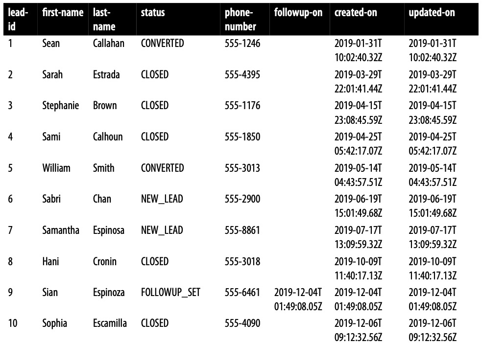
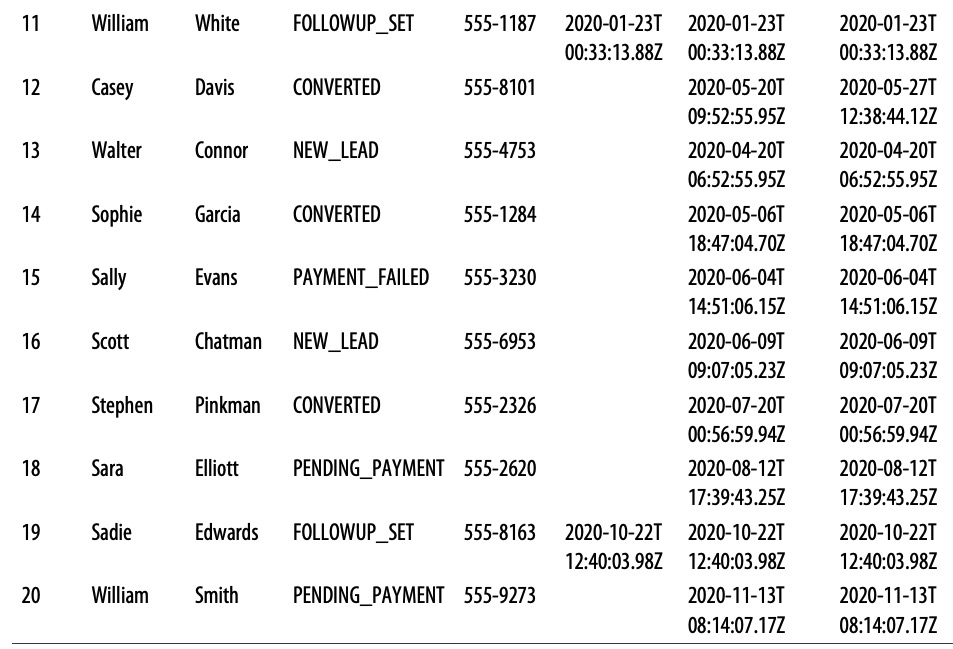
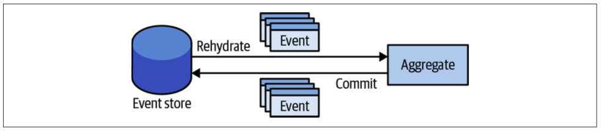
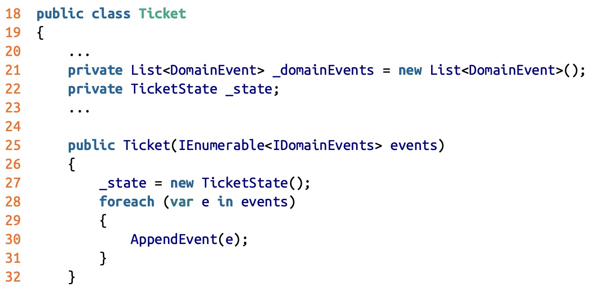
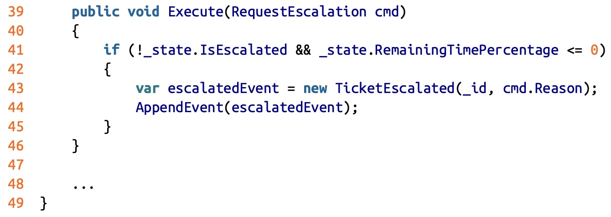
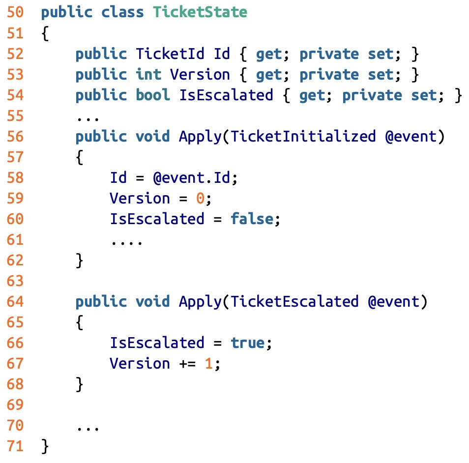
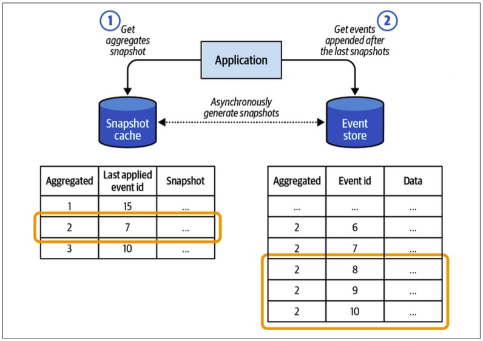
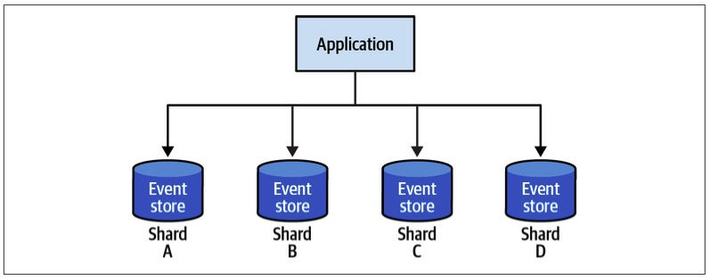

> Chapter 7. Modeling the Dimension of Time
>
> 章节 7. 时间维度建模

In the previous chapter, you learned about the domain model pattern: its building blocks, purpose, and application context.

> 在前一章中，您了解了域模型模式：它的构建块、目的和应用程序上下文。

The event-sourced domain model pattern is based on the same premise-前提,假设 as the domain model pattern.

> 事件源领域模型模式基于与领域模型模式相同的前提。

Again, the business logic is complex and belongs to a core subdomain.

> 同样，业务逻辑很复杂，属于一个核心子域。

Moreover, it uses the same tactical patterns as the domain model: value objects, aggregates, and domain events.

> 此外，它使用与领模型相同的策略模式：值对象、聚合和域事件。

---

The difference between these implementation patterns **lies in**-在于,取决于 the way the aggregates’ state is persisted.

> 这些实现模式之间的区别在于聚合状态的持久化方式。

The event-sourced domain model uses the event sourcing pattern to manage the aggregates’ states: instead of persisting an aggregate’s state, the model generates domain events describing each change and uses them as the source of truth for the aggregate’s data.

> 事件源领域模型使用事件源模式来管理聚合的状态：模型不是持久化聚合的状态，而是生成描述每个更改的域事件，并将它们用作聚合数据的真实来源。

---

This chapter starts by introducing the notion of event sourcing.

> 本章首先介绍事件溯源的概念。

Then it covers how event sourcing can be combined with the domain model pattern, making it an event-sourced domain model.

> 然后介绍如何将事件源与领域模型模式结合起来，使其成为事件源领域模型。

# Event Sourcing

> Show me your *flowchart* and conceal-隐藏 your tables, and I shall continue to be mystified-困惑的. Show me your tables, and I won’t usually need your flowchart; it’ll be obvious.
>
> 把你的流程图给我看，把你的表格藏起来，我还会继续迷惑不解。给我看你的表格，我通常不需要你的流程图；这是显而易见的。
>
> —Fred Brooks
>
> --佛瑞德·布鲁克斯

Let’s use Fred Brooks’s reasoning to define the event sourcing pattern and understand how it differs from traditional modeling and persisting of data.

> 让我们使用 Fred Brooks 的推理来定义事件溯源模式，并理解它与传统的数据建模和持久化有何不同。

Examine Table 7-1 and analyze what you can learn from this data about the system it belongs to.

> 检查 表7-1，并分析您可以从这些数据中了解它所属的系统。

*Table 7-1. State-based model*

> 表7-1 基于状态模型

It’s evident-清楚的,显然的 that the table is used to manage potential customers, or leads, in a telemarketing system.

> 很明显，在电话营销系统中，该表是用来管理潜在客户或潜在客户的。

For each lead, you can see their ID, their first and last names, when the record was created and updated, their phone number, and the lead’s current status.

> 对于每个潜在客户，您可以看到他们的ID、他们的姓和名、创建和更新记录的时间、他们的电话号码以及潜在客户的当前状态。

---

By examining the various statuses, we can also assume the processing cycle each potential customer goes through:

> 通过检查各种状态，我们还可以假设每个潜在客户所经历的处理周期：

- The sales flow starts with the potential customer in the NEW_LEAD status.

  > 销售流程从处于 NEW_LEAD 状态的潜在客户开始。

- A sales call can end with the person not being interested in the offer-报价 (the lead is CLOSED), scheduling a follow-up call (FOLLOWUP_SET), or accepting the offer (PENDING_PAYMENT).

  > 一个销售电话可能以某人对报价不感兴趣(lead is CLOSED)、安排后续电话(FOLLOWUP_SET)或接受报价(PENDING_PAYMENT)结束。

- If the payment is successful, the lead is CONVERTED into a customer. Conversely-相反地,反过来说, the payment can fail—PAYMENT_FAILED.

  > 如果付款成功，则该潜在客户将被 CONVERTED 为客户。相反，支付可能失败- PAYMENT_FAILED。

That’s quite a lot of information that we can gather just by analyzing a table’s schema-模式,架构 and the data stored in it.

> 通过分析表的模式和存储在其中的数据，我们可以收集到相当多的信息。

We can even assume what ubiquitous language was used when modeling the data.

> 我们甚至可以假设在对数据建模时使用了什么通用语言。

But what information is missing from that table?

> 但是这个表格中缺少什么信息呢?

---

The table’s data documents the leads’ current states, but it misses the story of how each lead got to their current state.

> 该表的数据记录了线索的当前状态，但它忽略了每个线索如何达到当前状态的故事。

We can’t analyze what was happening during the lifecycles of leads.

> 我们无法分析在潜在客户的生命周期中发生了什么。

We don’t know how many calls were made before a lead became CONVERTED.

> 我们不知道在一条线索被转化之前打了多少电话。

Was a purchase made **right away**-立刻, or was there a lengthy sales journey?

> 是立即购买，还是有一个漫长的销售过程?

Based on the historical data, is it worth trying to contact a person after multiple follow-ups, or is it more efficient to close the lead and move to a more promising-承诺,保证 prospect-可能性,希望?

> 根据历史数据，在多次跟进之后，是否值得尝试联系一个人，或者关闭线索并转向更有希望的潜在客户更有效?

None of that information is there.

> 这些信息都没有。

All we know are the leads’ current states.

> 我们只知道线索的当前状态。

---

These questions reflect business concerns essential for optimizing the sales process.

> 这些问题反映了企业对优化销售过程的关注。

From a business standpoint, it’s crucial to analyze the data and optimize the process based on the experience.

> 从业务角度来看，分析数据并基于体验优化流程至关重要。

One of the ways to fill in the missing information is to use event sourcing.

> 填补缺失信息的方法之一是使用事件溯源。

---

The event sourcing pattern introduces the dimension of time into the data model.

> 事件溯源模式在数据模型中引入了时间维度。

Instead of the schema reflecting the aggregates’ current state, an event sourcing–based system persists events documenting every change in an aggregate’s lifecycle.

> 与模式反映聚合的当前状态不同，基于事件源的系统将事件持久化，记录聚合生命周期中的每个更改。

---

Consider the CONVERTED customer on line 12 in Table 7-1.

> 考虑 表7-1 中第12行中的 CONVERTED 客户。

The following listing demonstrates how the person’s data would be represented in an event-sourced system:

> 下面的清单演示了如何在事件源系统中表示人员的数据：

~~~json
{
    "lead-id": 12,
    "event-id": 0,
    "event-type": "lead-initialized",
    "first-name": "Casey",
    "last-name": "David",
    "phone-number": "555-2951",
    "timestamp": "2020-05-20T09:52:55.95Z"
},
{
    "lead-id": 12,
    "event-id": 1,
    "event-type": "contacted",
    "timestamp": "2020-05-20T12:32:08.24Z"
},
{
    "lead-id": 12,
    "event-id": 2,
    "event-type": "followup-set",
    "followup-on": "2020-05-27T12:00:00.00Z",
    "timestamp": "2020-05-20T12:32:08.24Z"
},
{
    "lead-id": 12,
    "event-id": 3,
    "event-type": "contact-details-updated",
    "first-name": "Casey",
    "last-name": "Davis",
    "phone-number": "555-8101",
    "timestamp": "2020-05-20T12:32:08.24Z"
},
{
    "lead-id": 12,
    "event-id": 4,
    "event-type": "contacted",
    "timestamp": "2020-05-27T12:02:12.51Z"
},
{
    "lead-id": 12,
    "event-id": 5,
    "event-type": "order-submitted",
    "payment-deadline": "2020-05-30T12:02:12.51Z",
    "timestamp": "2020-05-27T12:02:12.51Z"
},
{
    "lead-id": 12,
    "event-id": 6,
    "event-type": "payment-confirmed",
    "status": "converted",
    "timestamp": "2020-05-27T12:38:44.12Z"
}
~~~

The events in the listing tell the customer’s story.

> 清单中的事件讲述了客户的故事。

The lead was created in the system (event 0) and was contacted by a sales agent about two hours later (event 1).

> 这个潜在客户是在系统中创建的(事件0)，大约两小时后，一个销售代理联系了他(事件1)。

During the call, it was agreed that the sales agent would call back a week later (event 2), but to a different phone number (event 3).

> 在通话过程中，双方同意销售代理将在一周后回电话(事件2)，但打到不同的电话号码(事件3)。

The sales agent also fixed a typo-错别字 in the last name (event 3).

> 销售代理还修复了姓氏中的一个错别字(事件3)。

The lead was contacted on the agreed date and time (event 4) and submitted an order (event 5).

> 在约定的日期和时间(事件4)联系了主管并提交了订单(事件5)。

The order was to be paid in three days (event 5), but the payment was received about half an hour later (event 6), and the lead was converted into a new customer.

> 订单本应在三天内付款(事件5)，但付款大约在半小时后收到(事件6)，lead转化为新客户。

---

As we saw earlier, the customer’s state can easily be projected out from these domain events.

> 正如我们前面看到的，客户的状态可以很容易地从这些领域事件中投射出来。

All we have to do is apply simple transformation logic sequentially-从而,循序地 to each event:

> 我们所要做的就是依次对每个事件应用简单的转换逻辑:

~~~java
public class LeadSearchModelProjection {
  public long LeadId { get; private set; }
  public HashSet<string> FirstNames { get; private set; }
  public HashSet<string> LastNames { get; private set; }
  public HashSet<PhoneNumber> PhoneNumbers { get; private set; } 
  public int Version { get; private set; }
  
  public void Apply(LeadInitialized @event) {
    LeadId = @event.LeadId;
    FirstNames = new HashSet<string>(); 
    LastNames = new HashSet<string>(); 
    PhoneNumbers = new HashSet<PhoneNumber>(); 
    FirstNames.Add(@event.FirstName); 
    LastNames.Add(@event.LastName); 
    PhoneNumbers.Add(@event.PhoneNumber); Version = 0;
  }
  
  public void Apply(ContactDetailsChanged @event) {  
    FirstNames.Add(@event.FirstName);  
    LastNames.Add(@event.LastName); 
    PhoneNumbers.Add(@event.PhoneNumber);
    Version += 1;
  }
  
  public void Apply(Contacted @event) {
    Version += 1;
  }
  
  public void Apply(FollowupSet @event) {
    Version += 1;  
  }
  

  public void Apply(OrderSubmitted @event) {
    Version += 1;
  }
  

  public void Apply(PaymentConfirmed @event) {
    Version += 1;
  }
  
}
~~~

Iterating an aggregate’s events and feeding them sequentially into the appropriate overrides of the Apply method will produce precisely-精确地,准确地 the state representation modeled in the table in Table 7-1.

> 迭代聚合的事件并依次将它们提供给Apply方法的适当覆盖，将精确地产生表7-1中表中建模的状态表示。

---

Pay attention to the Version field that is incremented after applying each event.

> 请注意在应用每个事件后增加的 Version 字段。

Its value represents the total number of modifications made to the business entity.

> 它的值表示对业务实体所做修改的总数。

Moreover, suppose we apply a subset of events.

> 此外，假设我们应用一个事件子集。

In that case, we can “travel through time”: we can project the entity’s state at any point of its lifecycle by applying only the relevant events.

> 在这种情况下，我们可以“穿越时间”：我们可以通过仅应用相关事件来预测实体在其生命周期的任何点的状态。

For example, if we need the entity’s state in version 5, we can apply only the first five events.

> 例如，如果我们在版本5中需要实体的状态，我们只能应用前五个事件。

---

Finally, we are not limited to projecting only a single state representation of the events!

> 最后，我们不局限于仅投射事件的单一状态表示!

Consider the following scenarios.

>考虑以下场景。

## Search

You have to implement a search.

> 你必须实现一个搜索。

However, since a lead’s contact information can be updated—first name, last name, and phone number—sales agents may not be aware of the changes applied by other agents and may want to locate leads using their contact information, including historical values.

> 你必须实现一个搜索。但是，由于潜在客户的联系信息可以更新——名字、姓氏和电话号码——销售代理可能不知道其他代理应用的更改，并且可能希望使用他们的联系信息(包括历史值)来定位潜在客户。

We can easily project-投射 the historical information:

> 我们可以很容易地投射历史信息:

~~~java
public class LeadSearchModelProjection {
  public long LeadId { get; private set; }
  public HashSet<string> FirstNames { get; private set; }
  public HashSet<string> LastNames { get; private set; }
  public HashSet<PhoneNumber> PhoneNumbers { get; private set; } 
  public int Version { get; private set; }
  
  public void Apply(LeadInitialized@event) {
    LeadId = @event.LeadId ;
    FirstNames = new HashSet<string>();
    LastNames = new HashSet<string>();
    PhoneNumbers = new HashSet<PhoneNumber>();
    FirstNames.Add( @event.FirstName);
    LastNames.Add( @event.LastName);
    PhoneNumbers.Add( @event.PhoneNumber);
    Version = 0;
  }

  public void Apply(ContactDetailsChanged@event) {
      FirstNames.Add( @event.FirstName);
      LastNames.Add( @event.LastName);
      PhoneNumbers.Add( @event.PhoneNumber);
      Version += 1;
  }

  public void Apply(Contacted@event) {
      Version += 1;
  }

  public void Apply(FollowupSet@event) {
      Version += 1;
  }

  public void Apply(OrderSubmitted@event) {
      Version += 1;
  }

  public void Apply(PaymentConfirmed@event) {
      Version += 1;
  }
}
~~~

The projection logic uses the LeadInitialized and ContactDetailsChanged events to populate the respective-分别的,各自的 sets of the lead’s personal details.

> 投影逻辑使用 LeadInitialized 和 ContactDetailsChanged 事件填充客户的个人详细信息的各自集合。

Other events are ignored since they do not affect the specific model’s state.

> 其他事件被忽略，因为它们不影响特定模型的状态。

---

Applying this projection logic to Casey Davis’s events from the earlier example will result in the following state:

> 将这个投影逻辑应用到 Casey Davis 的事件中，会产生以下状态：

~~~txt
LeadId: 12
FirstNames: ['Casey']
LastNames: ['David', 'Davis']
PhoneNumbers: ['555-2951', '555-8101']
Version: 6
~~~

## Analysis

> 分析

Your business intelligence-智力 department asks you to provide a more analysis-friendly representation of the leads data.

> 您的商业智能部门要求您提供更易于分析的潜在客户数据表示。

For their current research, they want to get the number of follow-up calls scheduled for different leads.

> 对于他们目前的研究，他们希望得到为不同的潜在客户跟进的后续电话数量。

Later they will filter the converted and closed leads data and use the model to optimize the sales process.

> 然后，他们将过滤转换和关闭的潜在客户数据，并使用该模型来优化销售流程。

Let’s project-预计,推算 the data they are asking for：

> 让我们预测一下他们要求的数据：

~~~java
public class AnalysisModelProjection {
  public long LeadId { get; private set; } 
  public int Followups { get; private set; } 
  public LeadStatus Status { get; private set; } 
  public int Version { get; private set; }
  
  public void Apply(LeadInitialized@event) {
    LeadId = @event.LeadId ;
    Followups = 0;
    Status = LeadStatus.NEW_LEAD;
    Version = 0;
  }

  public void Apply(Contacted@event) {
      Version += 1;
  }

  public void Apply(FollowupSet@event) {
      Status = LeadStatus.FOLLOWUP_SET;
      Followups += 1;
      Version += 1;
  }

  public void Apply(ContactDetailsChanged@event) {
      Version += 1;
  }

  public void Apply(OrderSubmitted@event) {
      Status = LeadStatus.PENDING_PAYMENT;
      Version += 1;
  }

  public void Apply(PaymentConfirmed@event) {
      Status = LeadStatus.CONVERTED;
      Version += 1;
  }
}
~~~

The preceding logic maintains a counter-计数器 of the number of times follow-up events appeared in the lead’s events.

> 前面的逻辑维护一个计数器，该计数器表示后续事件在lead的事件中出现的次数。

If we were to apply this projection to the example of the aggregate’s events, it would generate the following state:

> 如果我们将这个投影应用到聚合事件的例子中，它将产生以下状态：

~~~txt
LeadId: 12
Followups: 1
Status: Converted
Version: 6
~~~

The logic implemented in the preceding examples projects the search-optimized and analysis-optimized models in-memory. 

> 前面示例中实现的逻辑将搜索优化模型和分析优化模型投影到内存中。

However, to actually implement the required functionality, we have to persist the projected models in a database.

> 然而，为了实际实现所需的功能，我们必须在数据库中持久化预测模型。

In Chapter 8, you will learn about a pattern that allows us to do that: command-query responsibility segregation (CQRS).

> 在第8章中，你将学习一个允许我们这样做的模式：**命令-查询责任分离(CQRS)。**

## Source of Truth

> 真相之源

For the event sourcing pattern to work, all changes to an object’s state should be represented and persisted as events.

> 要使事件源模式起作用，对对象状态的所有更改都应该表示为事件并将其持久化。

These events become the system’s source of truth (hence the name of the pattern).

> 这些事件成为系统的真相来源(模式因此而得名)。

This process is shown in Figure 7-1.

> 该流程如图7-1所示。

*Figure 7-1. Event-sourced aggregate*

> 图7-1 Event-sourced 聚合

The database that stores the system’s events is the only strongly consistent storage: the system’s source of truth.

> 存储系统事件的数据库是唯一的强一致性存储：系统的事实来源。

The accepted name for the database that is used for persisting events is *event store*.

> 用于持久化事件的数据库的可接受名称是 *event store*。

## Event Store

> 事件存储

The event store should not allow modifying or deleting the events since it’s append-only storage.

> 事件存储不应该允许修改或删除事件，因为它是仅追加存储。

To support implementation of the event sourcing pattern, at a minimum the event store has to support the following functionality: fetch all events belonging to a specific business entity and append the events.

> 为了支持事件源模式的实现，事件存储至少必须支持以下功能：获取属于特定业务实体的所有事件并附加事件。

For example:

~~~java
interface IEventStore {
  IEnumerable<Event> Fetch(Guid instanceId);
  
  void Append(Guid instanceId, Event[] newEvents, int expectedVersion); 
}
~~~

The expectedVersion argument in the Append method is needed to implement optimistic-乐观的 concurrency management: when you append new events, you also specify the version of the entity on which you are basing your decisions.

> decisionsappend 方法中的 expectedVersion 参数需要实现乐观并发管理：当您添加新事件时，还需要指定您的决策所基于的实体的版本。

If it’s *stale-陈旧的*, that is, new events were added after the expected version, the event store should raise a concurrency exception.

> 如果它是“过时的”，也就是说，在预期的版本之后添加了新事件，事件存储应该引发并发异常。

---

In most systems, additional endpoints are needed for implementing the CQRS pattern, as we will discuss in the next chapter.

> 在大多数系统中，实现 CQRS 模式需要额外的端点，我们将在下一章中讨论。

> In essence-本质, the event sourcing pattern is nothing new.
>
> 实际上，事件溯源模式并不是什么新事物。
>
> The financial industry uses events to represent changes in a ledger-分类账.
>
> 金融行业使用事件来表示分类帐中的变化。
>
> A ledger is an append-only log that documents transactions.
>
> 分类账是一种记录交易的附加日志。
>
> A current state (e.g., account balance) can always be deduced-推断,演绎 by “projecting-投影” the ledger’s records.
>
> 当前状态(例如，账户余额)总是可以通过“投影”分类帐的记录推断出来。

# Event-Sourced Domain Model

> 事件源领域模型

The original domain model maintains a state representation of its aggregates and emits-发行,发表 select domain events.

> 原始领域模型维护其聚合的状态表示，并发出选定的域事件。

The event-sourced domain model uses domain events exclusively-专门地 for modeling the aggregates’ lifecycles.

> 事件源领域模型专门使用领域事件对聚合的生命周期进行建模。

All changes to an aggregate’s state have to be expressed as domain events.

> 对聚合状态的所有更改都必须表示为域事件。

---

Each operation on an event-sourced aggregate follows this script:

> 事件源聚合上的每个操作都遵循这个脚本：

- Load the aggregate’s domain events.

  > 加载聚合的领域事件。

- Reconstitute a state representation—project the events into a state representation that can be used to make business decisions.

  > 重构状态表示—将事件投影到可用于制定业务决策的状态表示中。

- Execute the aggregate’s command to execute the business logic, and consequently-因此,结果, produce new domain events.

  > 执行聚合的命令来执行业务逻辑，从而产生新的域事件。

- Commit the new domain events to the event store.

  > 将新的领域事件提交到事件存储区。

Going back to the example of the Ticket aggregate from Chapter 6, let’s see how it would be implemented as an event-sourced aggregate.

> 回到第6章的 Ticket 聚合示例，让我们看看如何将其实现为事件源聚合。

---

The application service follows the script described earlier: it loads the relevant ticket’s events, rehydrates the aggregate instance, calls the relevant command, and persists changes back to the database:

> 应用服务遵循前面描述的脚本：它加载相关票据的事件，重新激活聚合实例，调用相关命令，并将更改持久化回数据库：

~~~java
01 public class TicketAPI 02 {
03 	private ITicketsRepository _ticketsRepository;
04 	...
05	
06 	public void RequestEscalation(TicketId id, EscalationReason reason) 
07 {
08 	var events = _ticketsRepository.LoadEvents(id);
09 	var ticket = new Ticket(events);
10 	var originalVersion = ticket.Version;
11 	var cmd = new RequestEscalation(reason);
12 	         ticket.Execute(cmd);
13 	         _ticketsRepository.CommitChanges(ticket, originalVersion);
14 	}
15	
16 	... 
17 }
~~~

The Ticket aggregate’s rehydration logic in the constructor (lines 27 through 31) instantiates an instance of the state projector class, TicketState, and sequentially calls its AppendEvent method for each of the ticket’s events:

> 构造函数中的 Ticket aggregate 的重新激活逻辑(第27行到31行)实例化了状态投影仪类TicketState的实例，并依次为每个Ticket的事件调用它的AppendEvent方法:

The AppendEvent passes the incoming events to the TicketState projection logic, thus generating the in-memory representation of the ticket’s current state:

> AppendEvent 将传入的事件传递给 TicketState 投影逻辑，从而在内存中生成票据当前状态的表示：

~~~java
33 private void AppendEvent(IDomainEvent @event) 
34 {
35    _domainEvents.Append(@event);
36 		// Dynamically call the correct overload of the "Apply" method.
37 		((dynamic)state).Apply((dynamic)@event);
38 }
~~~

Contrary to the implementation we saw in the previous chapter, the event-sourced aggregate’s RequestEscalation method doesn’t explicitly set the IsEscalated flag to true.

> 与我们在前一章看到的实现相反，事件源聚合的 RequestEscalation 方法没有显式地将 IsEscalated 标志设置为true。

Instead, it instantiates the appropriate event and passes it to the AppendEvent method (lines 43 and 44):

> 相反，它实例化适当的事件并将其传递给 AppendEvent 方法(第43行和44行)：

All events added to the aggregate’s events collection are passed to the state projection logic in the TicketState class, where the relevant fields’ values are mutated-变化,改变 according to the events’ data:

> 添加到聚合的事件集合中的所有事件都传递给 TicketState 类中的状态投影逻辑，其中相关字段的值根据事件的数据发生变化：

Now let’s look at some of the advantages of leveraging event sourcing when implementing complex business logic.

> 现在让我们看看在实现复杂业务逻辑时利用事件溯源的一些优势。

> Why “Event-Sourced Domain Model”?
>
> 为什么是“事件源领域模型”?
>
> I feel obliged to explain why I use the term *event-sourced domain model* rather than just *event sourcing*.
>
> 我觉得有必要解释一下为什么我使用术语“事件源域模型”而不仅仅是“事件源”。
>
> Using events to represent state transitions-转变,过渡—the event sourcing pattern—is possible with or without the domain model’s building blocks.
>
> 无论是否使用领域模型的构建块，都可以使用事件来表示状态转换(事件源模式)。
>
> Therefore, I prefer the longer term to explicitly state that we are using event sourcing to represent changes in the lifecycles of the domain model’s aggregates.
>
> 因此，我更倾向于长期明确地说明我们正在使用事件溯源来表示领域模型聚合的生命周期中的变化。

## Advantages

> 优势

Compared to the more traditional model, in which the aggregates’ current states are persisted in a database, the event-sourced domain model requires more effort to model the aggregates.

> 与更传统的模型(聚合的当前状态持久化在数据库中)相比，事件源领域模型需要更多的工作来建模聚合。

However, this approach brings significant advantages that make the pattern worth considering in many scenarios:

> 然而，这种方法带来了显著的优势，使得该模式值得在许多场景中考虑：

---

*Time traveling*

> 时间旅行

Just as the domain events can be used to reconstitute an aggregate’s current state, they can also be used to restore all past states of the aggregate.

> 正如领域事件可用于重建聚合的当前状态一样，它们也可用于恢复聚合的所有过去状态。

In other words, you can always reconstitute all the past states of an aggregate.

> 换句话说，您总是可以重构聚合体的所有过去状态。

This is often done when analyzing the system’s behavior, inspecting-检查,审视 the system’s decisions, and optimizing the business logic.

> 这通常在分析系统行为、检查系统决策和优化业务逻辑时完成。

Another common use case for reconstituting past states is retroactive-追溯的 debugging-调试: you can revert the aggregate to the exact state it was in when a bug was observed.

> 重建过去状态的另一个常见用例是追溯调试：您可以将聚合恢复到观察到错误时的确切状态。

---

*Deep insight*

> 深入理解

In Part I of this book, we saw that optimizing core subdomains is strategically important for the business.

> 在本书的第一部分中，我们看到了优化核心子域对业务的战略重要性。

Event sourcing provides deep insight into the system’s state and behavior.

> 事件溯源提供了对系统状态和行为的深入了解。

As you learned earlier in this chapter, event sourcing provides the flexible model that allows for transforming the events into different state representations—you can always add new projections-预测,投影 that will leverage the existing events’ data to provide additional insights.

> 正如您在本章前面学到的，事件溯源提供了一个灵活的模型，允许将事件转换为不同的状态表示——您可以随时添加新的预测，这些预测将利用现有事件的数据来提供额外的见解。

---

*Audit log*

> 审核日志

The persisted domain events represent a strongly consistent audit log of everything that has happened to the aggregates’ states. 

> 持久域事件表示聚合状态发生的所有事情的高度一致的审计日志。

Laws oblige-迫使,责成 some business domains to implement such audit logs, and event sourcing provides this **out of the box**-开箱即用.

> 法律要求某些业务领域实现这样的审计日志，事件溯源提供了这种开箱即用的功能。

This model is especially convenient-方便的,便利的 for systems managing money or monetary transactions.

> 这个模型对于管理货币或货币交易的系统特别方便。

It allows us to easily trace the system’s decisions and the flow of funds between accounts.

> 它使我们能够轻松地跟踪系统的决策和账户之间的资金流动。

----

*Advanced optimistic concurrency management*

> 高级乐观并发管理

The classic-典型的 optimistic-乐观的 concurrency model raises an exception when the read data becomes stale-陈旧—overwritten by another process—while it is being written.

> 经典的乐观并发模型会在读取数据过时(被另一个进程覆盖)时引发异常。

When using event sourcing, we can gain deeper insight into exactly-究竟,到底 what has happened between reading the existing events and writing the new ones.

> 当使用事件溯源时，我们可以更深入地了解在读取现有事件和编写新事件之间究竟发生了什么。

You can query the exact events that were concurrently appended to the event store and make a business domain–driven decision as to whether the new events collide-冲突,抵触 with the attempted operation or the additional events are irrelevant-不相关的,不相干的 and it’s safe to proceed.

> 您可以查询并发追加到事件存储的确切事件，并做出业务域驱动的决策，以确定新事件是否与尝试的操作发生冲突，或者其他事件是否无关，是否可以安全继续。

## Disadvantages

> 劣势

So far it may seem that the event-sourced domain model is the ultimate pattern for implementing business logic and thus should be used as often as possible.

> 到目前为止，事件源域模型似乎是实现业务逻辑的最终模式，因此应该尽可能多地使用。

Of course, that would contradict-相抵触,相矛盾 the principle of letting the business domain’s needs drive the design decisions.

> 当然，这将与让业务领域的需求驱动设计决策的原则相矛盾。

So, let’s discuss some of the challenges presented by the pattern:

> 那么，让我们来讨论一下这种模式带来的一些挑战：

---

*Learning curve-曲线,弧线*

> 学习曲线

The obvious disadvantage of the pattern is its sharp difference from the traditional techniques of managing data.

> 这种模式的明显缺点是它与传统的数据管理技术有很大的不同。

Successful implementation of the pattern demands training of the team and time to get used to the new way of thinking.

> 这种模式的成功实施需要对团队进行培训，并需要时间来适应新的思维方式。

Unless the team already has experience implementing event-sourced systems, the learning curve-曲线,弧线 has to be **taken into account**-被考虑在内.

> 除非团队已经有实现事件源系统的经验，否则必须考虑学习曲线。

---

*Evolving-进化,演化 the model*

> 改进模型

Evolving an event-sourced model can be challenging.

> 发展事件源模型可能具有挑战性。

The strict-严格的 definition of event sourcing says that events are immutable.

> 事件溯源的严格定义表明事件是不可变的。

But what if you need to adjust the event’s schema?

> 但是，如果需要调整事件的模式该怎么办呢?

The process is not as simple as changing a table’s schema.

> 这个过程并不像更改表的模式那么简单。

In fact, a whole book was written on this subject alone: *Versioning in an Event Sourced System* by Greg Young.

> 事实上，关于这个主题已经写了整整一本书：Greg Young的《事件源系统中的版本控制》。

---

*Architectural complexity*

> 架构的复杂性

Implementation of event sources introduces numerous architectural “moving parts,” making the overall design more complicated.

> 事件源的实现引入了许多体系结构的“活动部件”，使得整体设计更加复杂。

This topic will be covered in more detail in the next chapter, when we discuss the CQRS architecture.

> 当我们在下一章讨论 CQRS 体系结构时，将更详细地讨论这个主题。

---

All of these challenges are even more acute-严重的,危险的 if the task at hand doesn’t justify the use of the pattern and instead can be addressed by a simpler design.

> 如果手头的任务不适合使用该模式，而可以通过更简单的设计来解决，那么所有这些挑战就会更加严重。

In Chapter 10, you will learn simple rules of thumb that can help you decide which business logic implementation pattern to use.

> 在第10章中，您将学习简单的经验规则，这些规则可以帮助您决定使用哪种业务逻辑实现模式。

# Frequently Asked Questions

> 常见问题

When engineers are introduced to the event sourcing pattern, they often ask several common questions, so I find it obligatory-有义务的,强制性的 to address them in this chapter.

> 当工程师们被介绍到事件溯源模式时，他们经常会问一些常见的问题，所以我觉得有必要在本章中解决这些问题。

## Performance

Reconstituting an aggregate’s state from events will negatively affect the system’s performance.

> 从事件中重新构建聚合状态将对系统性能产生负面影响。

It will degrade as events are added.

> 它将随着事件的添加而降级。

How can this even work?

> 这怎么可能呢?

---

Projecting events into a state representation indeed-确实,的确 requires compute power, and that need will grow as more events are added to an aggregate’s list.

> 将事件投射到状态表示中确实需要计算能力，并且随着更多事件被添加到聚合列表中，这种需求将会增长。

---

It’s important to benchmark-基准 a projection’s impact on performance: the effect of working with hundreds or thousands of events. 

> 对投影对性能的影响进行基准测试是很重要的：处理数百或数千个事件的效果。

The results should be compared with the expected lifespan of an aggregate—the number of events expected to be recorded during an average lifespan-寿命.

> 应该将结果与聚合的预期寿命(在平均寿命期间预计记录的事件数量)进行比较。

---

In most systems, the performance hit will be noticeable only after 10,000+ events per aggregate.

> 在大多数系统中，只有在每个聚合事件超过10,000个之后，性能才会受到明显影响。

That said, in the vast majority of systems, an aggregate’s average lifespan won’t go over 100 events.

> 也就是说，在绝大多数系统中，聚合的平均寿命不会超过100个事件。

---

In the rare cases when projecting states does become a performance issue, another pattern can be implemented: snapshot.

> 在投射状态确实成为性能问题的极少数情况下，可以实现另一种模式：快照。

This pattern, shown in Figure 7-2, implements the following steps:

> 如图7-2 所示，该模式实现了以下步骤:

- A process continuously iterates new events in the event store, generates corresponding projections, and stores them in a cache.

  > 流程不断迭代事件存储中的新事件，生成相应的投影，并将它们存储在缓存中。

- An in-memory projection is needed to execute an action on the aggregate. In this case:

  > 在聚合上执行操作需要内存中的投影。在这种情况下:

  - The process fetches the current state projection from the cache.

    > 进程从缓存中获取当前状态投影。

  - The process fetches the events that came after the snapshot version from the event store.

    > 流程从事件存储区获取快照版本之后的事件。

  - The additional events are applied in-memory to the snapshot.

    > 附加事件在内存中应用于快照。

*Figure 7-2. Snapshotting an aggregate’s events*

> 图7-2 快照聚合的事件

It’s worth reiterating that the snapshot pattern is an optimization that has to be justified.

> 值得重申的是，快照模式是一种优化，必须加以证明。

If the aggregates in your system won’t persist 10,000+ events, implementing the snapshot pattern is just an accidental-意外的,偶然的 complexity.

> 如果系统中的聚合不会保存10,000多个事件，那么实现快照模式只是偶然的复杂性。

But before you go ahead and implement the snapshot pattern, I recommend that you take a step back and double-check the aggregate’s boundaries.

> 但是在继续实现快照模式之前，我建议您后退一步，仔细检查聚合的边界。

---

*This* *model generates enormous amounts of data. Can it scale?*

> 这个模型产生了大量的数据。它能规模化吗?

The event-sourced model is easy to scale.

> 事件源模型易于扩展。

Since all aggregate-related operations are done in the context of a single aggregate, the event store can be sharded by aggregate IDs: all events belonging to an instance of an aggregate should reside in a single shard (see Figure 7-3).

> 由于所有与聚合相关的操作都是在单个聚合的上下文中完成的，事件存储可以通过聚合id进行分片：属于聚合实例的所有事件都应该驻留在单个分片中(见图7-3)。

*Figure 7-3. Sharding the event store*

> 图7 对事件存储进行分片

## Deleting Data

> 删除数据

The event store is an append-only database, but what if I do need to delete data physically; for example, to comply-遵从,服从 with GDPR?

> 事件存储是一个仅追加的数据库，但如果我确实需要物理地删除数据该怎么办？例如，遵守GDPR？

This need can be addressed with the forgettable payload pattern: all sensitive-敏感的 information is included in the events in encrypted form.

> 这种需求可以通过可遗忘的有效负载模式来解决：所有敏感信息都以加密的形式包含在事件中。

The encryption key is stored in an external key–value store: the key storage, where the key is a specific aggregate’s ID and the value is the encryption key.

> 加密密钥存储在外部键-值存储中：密钥存储，其中密钥是特定聚合的ID，值是加密密钥。

When the sensitive data has to be deleted, the encryption key is deleted from the key storage.

> 当需要删除敏感数据时，加密密钥将从密钥存储中删除。

As a result, the sensitive information contained in the events is no longer accessible.

> 因此，无法再访问事件中包含的敏感信息。

## Why Can’t I Just...?

> 为什么我不能…?

Why can’t I just write logs to a text file and use it as an audit log?

> 为什么我不能直接将日志写入文本文件并将其用作审计日志?

Writing data both to an operational database and to a logfile is an error-prone operation.

> 将数据写入操作数据库和日志文件是一种容易出错的操作。

In its essence-本质, it’s a transaction against two storage mechanisms: the database and the file. If the first one fails, the second one has to be rolled back.

> 从本质上讲，它是针对两种存储机制的事务：数据库和文件。如果第一个失败，第二个必须回滚。

For example, if a database transaction fails, no one cares to delete the prior log messages.

> 例如，如果数据库事务失败，没有人关心删除先前的日志消息。

Hence, such logs are not consistent, but rather, eventually inconsistent.

> 因此，这样的日志是不一致的，而是最终不一致的。

---

Why can’t I keep working with a state-based model, but in the same database transaction, append logs to a logs table?

> 为什么我不能继续使用基于状态的模型，但在同一个数据库事务中，将日志附加到日志表中？

From an infrastructural perspective, this approach does provide consistent synchronization between the state and the log records.

> 从基础结构的角度来看，这种方法确实提供了状态和日志记录之间的一致同步。

However, it is still error prone-倾向于.

> 然而，它仍然容易出错。

What if the engineer who will be working on the codebase in the future forgets to append an appropriate log record?

> 如果将来处理代码库的工程师忘记添加适当的日志记录该怎么办?

Furthermore, when the state-based representation is used as the source of truth, the additional log table’s schema usually degrades into chaos quickly.

> 此外，当使用基于状态的表示作为真实源时，附加日志表的模式通常会迅速退化为混乱。

There is no way to enforce that all required information is written and that it is written in the correct format.

> 没有办法强制要求以正确的格式编写所有必需的信息。

---

Why can’t I just keep working with a state-based model but add a database trigger that will take a snapshot of the record and copy it into a dedicated-专门的 “history” table?

> 为什么我不能继续使用基于状态的模型，而是添加一个数据库触发器，将记录的快照并将其复制到专用的“历史”表中?

This approach overcomes-克服,解决 the previous one’s drawback-缺点: no explicit manual calls are needed to append records to the log table. 

> 这种方法克服了前一种方法的缺点：不需要显式的手动调用来将记录附加到日志表中。

That said, the resultant history only includes the dry facts: what fields were changed.

> 也就是说，由此产生的历史只包括干巴巴的事实：哪些领域被改变了。

It misses the business contexts: why the fields were changed.

> 它忽略了业务上下文：字段被更改的原因。

The lack of “why” drastically-极其,非常 limits the ability to project additional models.

> 缺乏“为什么”极大地限制了规划其他模型的能力。

# Conclusion

> 总结

This chapter explained the event sourcing pattern and its application for modeling the dimension of time in the domain model’s aggregates.

> 本章解释了事件溯源模式及其在领域模型聚合中对时间维度建模的应用。

---

In an event-sourced domain model, all changes to an aggregate’s state are expressed as a series of domain events. 

> 在事件源域模型中，对聚合状态的所有更改都表示为一系列域事件。

That’s in contrast to the more traditional approaches in which a state change just updates a record in the databases.

> 这与更传统的方法形成了对比，在传统方法中，状态更改只是更新数据库中的记录。

The resultant-结果 domain events can be used to project the aggregate’s current state.

> 由此产生的领域事件可用于投影聚合的当前状态。

Moreover, the event-based model gives us the flexibility to project the events into multiple representation models, each optimized for a specific task.

> 此外，基于事件的模型使我们能够灵活地将事件投射到多个表示模型中，每个模型都针对特定的任务进行了优化。

---

This pattern fits cases in which it’s crucial to have deep insight into the system’s data, whether for analysis and optimization or because an audit log is required by law.

> 这种模式适用于深入了解系统数据至关重要的情况，无论是为了分析和优化，还是因为法律要求审计日志。

---

This chapter completes our exploration of the different ways to model and implement business logic.

> 本章完成了对业务逻辑建模和实现的不同方法的探索。

In the next chapter, we will shift our attention to patterns belonging to a higher scope: architectural patterns.

> 在下一章中，我们将把注意力转移到属于更高范围的模式：架构模式。

