> Chapter 8. Achitectural Patterns
>
> 章节 8. 架构模式

The tactical patterns discussed up to this point in the book defined the different ways to model and implement business logic.

> 到目前为止，本书中讨论的战术模式定义了建模和实现业务逻辑的不同方法。

In this chapter, we will explore tactical design decisions in a broader context: the different ways to orchestrate-精心安排 the interactions and dependencies between a system’s components.

> 在本章中，我们将在更广泛的背景下探讨战术设计决策：编排系统组件之间的交互和依赖关系的不同方法。

# Business Logic Versus Architectural Patterns

> 业务逻辑与体系结构模式

Business logic is the most important part of software; however, it is not the only part of a software system.

> 业务逻辑是软件最重要的部分；然而，它并不是软件系统的唯一部分。

To implement functional and nonfunctional requirements, the codebase has to fulfill more responsibilities.

> 为了实现功能性和非功能性需求，代码库必须履行更多的职责。

It has to interact with users to gather input and provide output, and it has to use different storage mechanisms to persist state and integrate with external systems and information providers.

> 它必须与用户交互以收集输入并提供输出，它必须使用不同的存储机制来持久化状态并与外部系统和信息提供者集成。

---

The variety of concerns that a codebase has to take care of makes it easy for its business logic to become diffused-扩散,弥漫 among the different components: that is, for some of the logic to be implemented in the user interface or database, or be duplicated-复制 in different components.

> 代码库必须处理的各种关注点使得它的业务逻辑很容易在不同的组件之间扩散：也就是说，一些逻辑要在用户界面或数据库中实现，或者在不同的组件中复制。

Lacking strict organization in implementation concerns makes the codebase hard to change.

> 在实现关注点中缺乏严格的组织使得代码库难以更改。

When the business logic has to change, it may not be evident-清楚的,显然的 what parts of the codebase have to be affected by the change.

> 当业务逻辑必须更改时，代码库的哪些部分必须受到更改的影响可能并不明显。

The change may have unexpected effects on seemingly unrelated parts of the system.

> 更改可能会对系统中看似无关的部分产生意想不到的影响。

Conversely, it may be easy to miss code that has to be modified.

> 相反，很容易忽略需要修改的代码。

All of these issues dramatically-剧烈地,明显地 increase the cost of maintaining the codebase.

> 所有这些问题都极大地增加了维护代码库的成本。

---

Architectural patterns introduce organizational principles for the different aspects of a codebase and present clear boundaries between them: how the business logic is wired-连接 to the system’s input, output, and other infrastructural components.

> 体系结构模式为代码库的不同方面引入了组织原则，并在它们之间给出了清晰的界限:业务逻辑如何连接到系统的输入、输出和其他基础设施组件。

This affects how these components interact with each other: what knowledge they share and how the components reference-引用 each other.

> 这影响了这些组件之间的交互方式：它们共享什么知识以及组件如何相互引用。

---

Choosing the appropriate way to organize the codebase, or the correct architectural pattern, is crucial to support implementation of the business logic in the short term and alleviate-减轻,缓和 maintenance in the long term.

> 选择合适的方式来组织代码库，或者选择正确的体系结构模式，对于短期内支持业务逻辑的实现和减轻长期的维护是至关重要的。

Let’s explore three predominant-明显的,主要的,卓越的 application architecture patterns and their use cases: layered architecture, ports & adapters, and CQRS.

> 让我们探索三种主要的应用程序体系结构模式及其用例：分层体系结构、端口和适配器，以及CQRS。

# Layered Architecture

> 分层体系结构

Layered architecture is one of the most common architectural patterns.

> 分层架构是最常见的架构模式之一。

It organizes the codebase into horizontal-水平的 layers, with each layer addressing one of the following technical concerns: interaction with the consumers, implementing business logic, and persisting the data.

> 它将代码库组织成水平层，每一层处理以下技术问题之一：与消费者的交互、实现业务逻辑以及数据的持久化。

You can see this represented in Figure 8-1.

> 如图8-1 所示。

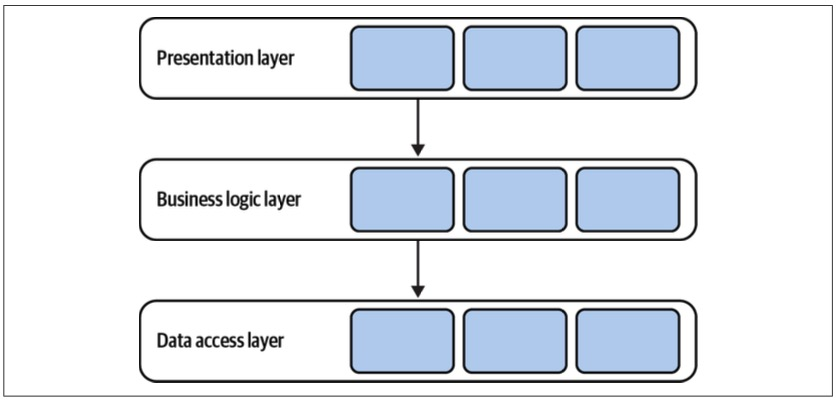

*Figure 8-1. Layered architecture*

> 图8-1 分层体系结构

In its classic-经典,典型的 form, the layered architecture consists of three layers: the presentation layer (PL), the business logic layer (BLL), and the data access layer (DAL).

> 在其经典形式中，分层体系结构由三层组成：表示层(PL)、业务逻辑层(BLL)和数据访问层(DAL)。

## Presentation Layer

> 表示层

The presentation layer, shown in Figure 8-2, implements the program’s user interface for interactions with its consumers.

> 表示层，如图8-2所示，实现了程序与消费者交互的用户界面。

In the pattern’s original form, this layer denotes-表示,意指 a graphical-图形化 interface, such as a web interface or a desktop application.

> 在模式的原始形式中，这一层表示图形界面，例如 web 界面或桌面应用程序。

---

In modern systems, however, the presentation layer has a broader scope: that is, all means for triggering the program’s behavior, both synchronous and asynchronous.

> 然而，在现代系统中，表示层具有更广泛的范围：即触发程序行为的所有手段，包括同步的和异步的。

For example:

- Graphical user interface (GUI)
- Command-line interface (CLI)
- API for programmatic integration with other systems
- Subscription to events in a message broker
- Message topics for publishing outgoing events

All of these are the means for the system to receive requests from the external environment and communicate the output. 

> 所有这些都是系统接收来自外部环境的请求并通信输出的手段。

Strictly speaking, the presentation layer is the program’s public interface.

> 严格地说，表示层是程序的公共接口。

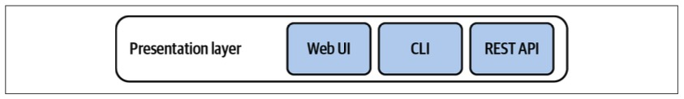

*Figure 8-2. Presentation layer*

> 图8-2 表示层

## Business Logic Layer

> 业务逻辑层

As the name suggests, this layer is responsible for implementing and encapsulating the program’s business logic.

> 顾名思义，这一层负责实现和封装程序的业务逻辑。

This is the place where business decisions are implemented.

> 这是实现业务决策的地方。

**As Eric Evans says, this layer is the heart of software.**

---

This layer is where the business logic patterns described in Chapters 5–7 are implemented—for example, active records or a domain model (see Figure 8-3).

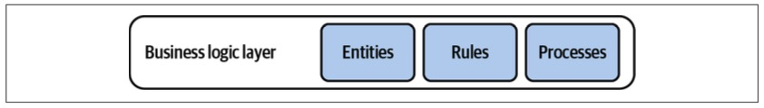

*Figure 8-3. Business logic layer*

## Data Access Layer

The data access layer provides access to persistence mechanisms.

> 数据访问层提供对持久性机制的访问。

In the pattern’s original form, this referred to the system’s database.

However, as in the case of the presentation layer, the layer’s responsibility is broader for modern systems.

> 然而，与表示层的情况一样，对于现代系统，该层的职责更加广泛。

---

First, ever-曾经,从来 since the NoSQL revolution-革命,变革 broke out, it is common for a system to work with multiple databases.

> 首先，自从 NoSQL 革命爆发以来，一个系统使用多个数据库是很常见的。

For example, a document store can act as the operational database, a search index for dynamic queries, and an in-memory database for performance-optimized operations.

> 例如，文档存储可以作为操作数据库、动态查询的搜索索引和用于性能优化操作的内存数据库。

---

Second, traditional databases are not the only medium-媒介,介质 for storing information.

> 其次，传统数据库不是存储信息的唯一媒介。

For example, cloud-based object storage can be used to store the system’s files, or a message bus can be used to orchestrate-精心安排 communication between the program’s different functions.

> 例如，可以使用基于云的对象存储来存储系统的文件，或者可以使用消息总线来协调程序的不同功能之间的通信。

---

Finally, this layer also includes integration with the various external information providers needed to implement the program’s functionality: APIs provided by external systems, or cloud vendors’ managed services, such as language translation, stock-股票 market data, and audio-音频 transcription-转录 (see Figure 8-4).

> 最后，这一层还包括与实现程序功能所需的各种外部信息提供者的集成：由外部系统提供的api，或云供应商的托管服务，如语言翻译、股票市场数据和音频转录(参见图8-4)。

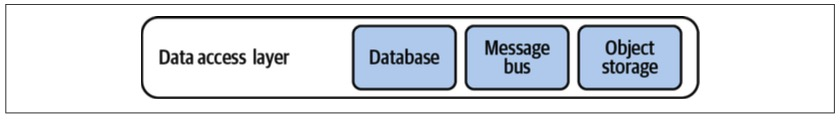

*Figure 8-4. Data access layer*

## Communication Between Layers

The layers are integrated in a top-down communication model: each layer can hold a dependency only on the layer directly beneath-在…下方 it, as shown in Figure 8-5.

> 这些层集成在一个自顶向下的通信模型中：每一层只能对它直接下面的层保持依赖，如图8-5所示。

This enforces decoupling of implementation concerns and reduces the knowledge shared between the layers.

> 这加强了实现关注点的解耦，并减少了各层之间共享的知识。

In Figure 8-5, the presentation layer references only the business logic layer.

It has no knowledge of the design decisions made in the data access layer.

> 它不知道在数据访问层中所做的设计决策。

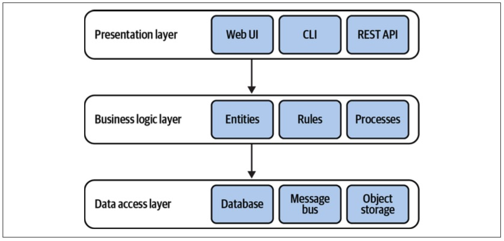

*Figure 8-5. Layered architecture*

## Variation

> 变化

It’s common to see the layered architecture pattern extended with an additional layer: the service layer.

> 通常可以看到分层体系结构模式扩展了一个附加层：服务层。

### Service layer

> Defines an application’s boundary with a layer of services that establishes a set of available operations and coordinates the application’s response in each operation.
>
> 用服务层定义应用程序的边界，服务层建立一组可用操作，并协调应用程序在每个操作中的响应。
>
>  —  Patterns of Enterprise Application Architecture

The service layer acts as an intermediary-中间人,媒介 between the program’s presentation and business logic layers.

> 服务层充当程序表示层和业务逻辑层之间的中介。

Consider the following code:

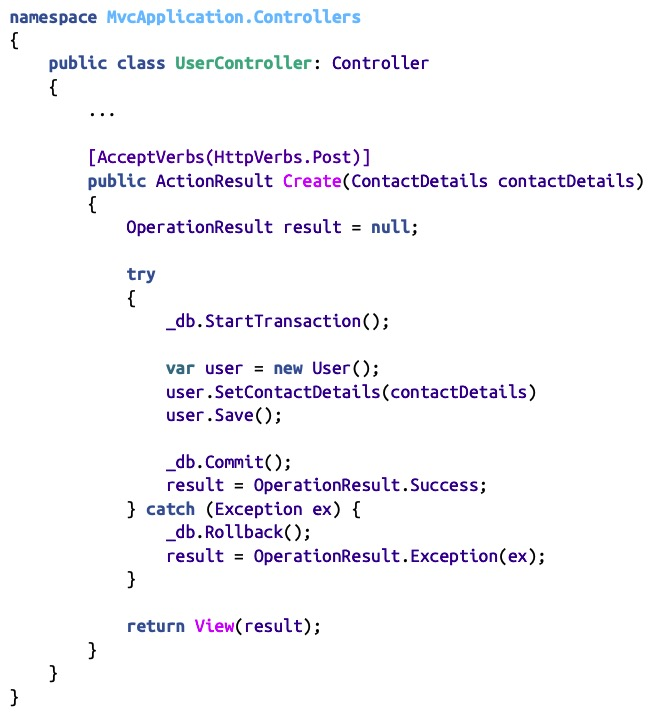

The MVC controller in this example belongs to the presentation layer.

> 本例中的MVC控制器属于表示层。

It exposes an endpoint that creates a new user.

The endpoint uses the User active record object to create a new instance and save it.

Moreover, it orchestrates a database transaction to ensure that a proper response is generated **in case of**-如果发生某种情况 an error.

> 此外，它还编排数据库事务，以确保在发生错误时生成正确的响应。

---

To further decouple the presentation layer from the underlying business logic, such orchestration logic can be moved into a service layer, as shown in Figure 8-6.

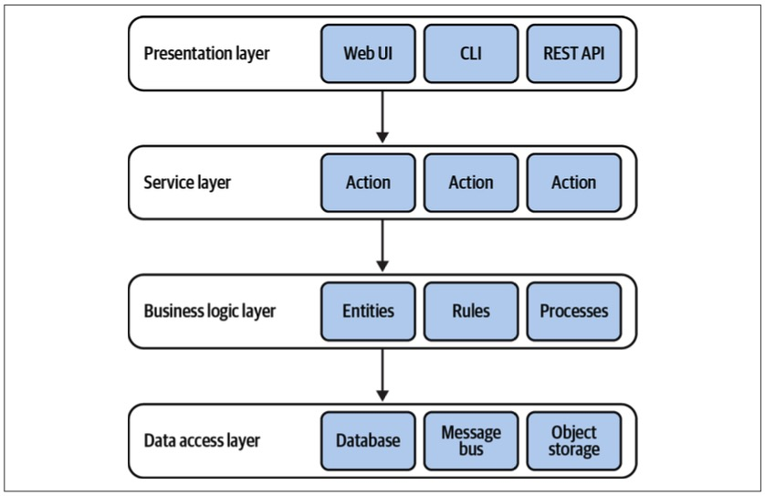

*Figure 8-6. Service layer*

It’s important to note that in the context of the architectural pattern, the service layer is a logical boundary.

> 需要注意的是，在体系结构模式的上下文中，服务层是一个逻辑边界。

It is not a physical service.

> 它不是一种实体服务。

---

The service layer acts as a façade for the business logic layer: it exposes an interface that corresponds with the public interface’s methods, encapsulating the required orchestration of the underlying layers.

> 服务层充当业务逻辑层的中介：它公开一个与公共接口方法相对应的接口，封装底层所需的编排。

For example:

~~~java
interface CampaignManagementService {
      OperationResult CreateCampaign(CampaignDetails details);
      OperationResult Publish(CampaignId id, PublishingSchedule schedule);
      OperationResult Deactivate(CampaignId id);
      OperationResult AddDisplayLocation(CampaignId id, DisplayLocation newLocation);
      ...
}
~~~

All of the preceding methods correspond to the system’s public interface.

> 上述所有方法都对应于系统的公共接口。

However, they lack presentation-related implementation details.

> 然而，它们缺少与表示相关的实现细节。

The presentation layer’s responsibility becomes limited to providing the required input to the service layer and communicating its responses back to the caller.

> 表示层的职责仅限于向服务层提供所需的输入，并将其响应通信回调用方。

---

Let’s refactor the preceding example and extract-提取,提炼 the orchestration logic into a service layer:

> 让我们重构前面的示例，并将编排逻辑提取到服务层中：

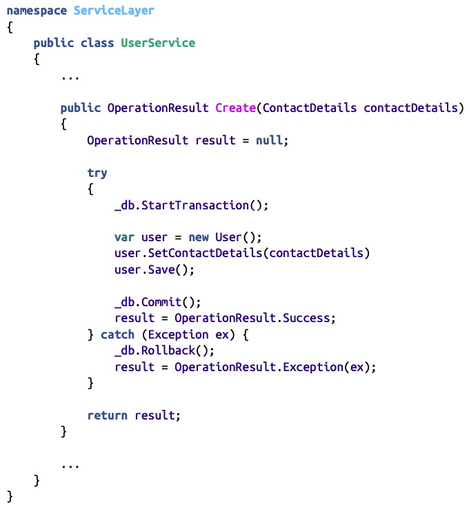

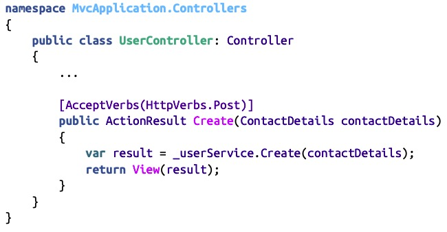

Having an explicit service level has a number of advantages:

> 拥有一个明确的服务级别有很多好处:

- We can reuse the same service layer to serve multiple public interfaces; for example, a graphical user interface and an API. No duplication of the orchestration logic is required.

- It improves modularity by gathering all related methods in one place.

  > 它通过在一个地方收集所有相关的方法来改进模块化。

- It further decouples the presentation and business logic layers.

  > 它进一步解耦了表示层和业务逻辑层。

- It makes it easier to test the business functionality.

  > 它使测试业务功能变得更加容易。

That said, a service layer is not always necessary.

> 也就是说，服务层并不总是必需的。

For example, when the business logic is implemented as a transaction script, it essentially-本质上,根本上 is a service layer, as it already exposes a set of methods that form the system’s public interface.

> 例如，当业务逻辑作为事务脚本实现时，它本质上是一个服务层，因为它已经公开了一组方法，这些方法构成了系统的公共接口。

In such a case, the service layer’s API would just repeat the transaction scripts’ public interfaces, without abstracting or encapsulating any complexity.

> 在这种情况下，服务层的API将只是重复事务脚本的公共接口，而不抽象或封装任何复杂性。

Hence, either a service layer or a business logic layer will suffice-足够,足以,满足.

> 因此，服务层或业务逻辑层就足够了。

---

On the other hand, the service layer is required if the business logic pattern requires external orchestration, as in the case of the active record pattern.

> 另一方面，如果业务逻辑模式需要外部编排，例如活动记录模式，则需要服务层。

In this case, the service layer implements the transaction script pattern, while the active records it operates on are located in the business logic layer.

> 在这种情况下，服务层实现事务脚本模式，而其操作的活动记录位于业务逻辑层。

### Terminology

> 术语

Elsewhere, you may encounter other terms used for the layered architecture:

> 在其他地方，您可能会遇到用于分层体系结构的其他术语:

- Presentation layer = user interface layer
- Service layer = application layer
- Business logic layer = domain layer = model layer
- Data access layer = infrastructure layer

To eliminate confusion, I present the pattern using the original terminology.

> 为了消除混淆，我使用原始术语呈现该模式。

That said, I prefer “user interface layer” and “infrastructure layer” as these terms better reflect the responsibilities of modern systems and an application layer to avoid confusion with the physical boundaries of services.

> 也就是说，我更喜欢“用户界面层”和“基础设施层”，因为这些术语更好地反映了现代系统和应用层的职责，以避免与服务的物理边界混淆。

### When to Use Layered Architecture

> 何时使用分层架构

The dependency between the business logic and the data access layers makes this architectural pattern a good fit for a system with its business logic implemented using the transaction script or active record pattern.

> 业务逻辑和数据访问层之间的依赖关系使得该体系结构模式非常适合使用事务脚本或活动记录模式实现其业务逻辑的系统。

---

However, the pattern makes it challenging to implement a domain model.

> 然而，该模式使实现域模型变得具有挑战性。

In a domain model, the business entities (aggregates and value objects) should have no dependency and no knowledge of the underlying infrastructure.

> 在领域模型中，业务实体(聚合和值对象)应该没有依赖关系，也不了解底层基础结构。

The layered architecture’s top-down dependency requires jumping through some hoops to fulfill this requirement.

> 分层体系结构的自顶向下依赖需要通过一些限制来满足这一需求。

It is still possible to implement a domain model in a layered architecture, but the pattern we will discuss next fits much better.

> 在分层体系结构中实现领域模型仍然是可能的，但是我们接下来将讨论的模式更适合。

## Optional: Layers Versus Tiers

The layers architecture is often confused with the N-Tier architecture, and vice versa.

> 层体系结构经常与N层体系结构混淆，反之亦然。

Despite-尽管 the similarities between the two patterns, layers and tiers are conceptually different: a layer is a logical boundary, whereas a tier is a physical boundary.

> **尽管这两种模式有相似之处，但层和层在概念上是不同的：layer 是逻辑边界，而 tier 是物理边界。**

All layers in the layered architecture are bound by the same lifecycle: they are implemented, evolved, and deployed as one single unit.

> **分层体系结构中的所有层都受相同生命周期的约束：它们作为单个单元实现、发展和部署。**

On the other hand, a tier is an independently deployable service, server, or system.

For example, consider the N-Tier system in Figure 8-7.

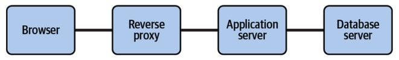

*Figure 8-7. N-Tier system*

The system depicts-描述,描绘 the integration between physical services involved in a web-based system.

> 该系统描述了基于 web 的系统中涉及的物理服务之间的集成。

The consumer uses a browser, which can run on a desktop computer or a mobile device.

> 消费者使用浏览器，浏览器可以在台式电脑或移动设备上运行。

The browser interacts with a reverse proxy that forwards the requests to the actual web application.

> 浏览器与反向代理交互，反向代理将请求转发给实际的web应用程序。

The web application runs on a web server and communicates with a database server.

> web 应用程序运行在 web 服务器上，并与数据库服务器通信。

All of these components may run on the same physical server, such as containers, or be distributed among multiple servers. 

> 所有这些组件都可以运行在相同的物理服务器(如容器)上，或者分布在多个服务器之间。

However, since each component can be deployed and managed independent of the rest, these are tiers and not layers.

> 但是，由于每个组件都可以独立于其他组件进行部署和管理，因此这些组件是层而不是层。

---

Layers, on the other hand, are logical boundaries inside the web application.

> 另一方面，层是 web 应用程序内部的逻辑边界。

# Ports & Adapters

> 端口和适配器

The ports & adapters architecture addresses the shortcomings-缺点,毛病 of the layered architecture and is a better fit for implementation of more complex business logic.

> 端口和适配器体系结构解决了分层体系结构的缺点，更适合实现更复杂的业务逻辑。

Interestingly, both patterns are quite similar.

Let’s “refactor” the layered architecture into ports & adapters.

> 让我们将分层架构“重构”为端口和适配器。

## Terminology

> 术语

Essentially, both the presentation layer and data access layer represent integration with external components: databases, external services, and user interface frameworks.

> 本质上，表示层和数据访问层都表示与外部组件的集成：数据库、外部服务和用户界面框架。

These technical implementation details do not reflect the system’s business logic; so, let’s unify-联合,统一 all such infrastructural concerns into a single “infrastructure layer,” as shown in Figure 8-8.

> 这些技术实现细节并不能反映系统的业务逻辑；因此，让我们将所有这些基础设施问题统一到一个单一的“基础设施层”中，如图8-8所示。

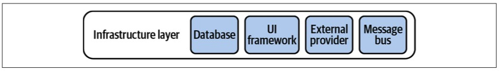

*Figure 8-8. Presentation and data access layers combined into an infrastructure layer*

## Dependency Inversion-反转,倒置 Principle

> 依赖反转原则

The dependency inversion principle (DIP) states that high-level modules, which implement the business logic, should not depend on low-level modules.

> 依赖倒置原则(DIP)指出，实现业务逻辑的高级模块不应该依赖于低级模块。

However, that’s precisely what happens in the traditional layered architecture.

> 然而，这正是在传统的分层架构中发生的事情。

The business logic layer depends on the infrastructure layer.

> 业务逻辑层依赖于基础设施层。

To conform-遵守,符合 with the DIP, let’s reverse the relationship, as shown in Figure 8-9.

> 为了与DIP一致，我们将关系颠倒一下，如图8-9所示。

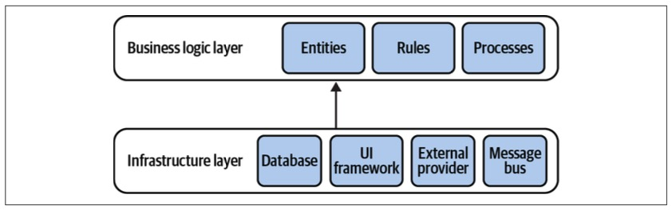

*Figure 8-9. Reversed dependencies*

Instead of being sandwiched-插入,夹入 between the technological concerns, now the business logic layer takes the central role.

> 现在，业务逻辑层不再夹在技术关注点之间，而是扮演了中心角色。

It doesn’t depend on any of the system’s infrastructural components.

> 它不依赖于系统的任何基础设施组件。

---

Finally, let’s add an application layer as a façade for the system’s public interface.

> 最后，让我们为系统的公共接口添加一个应用程序层。

As the service layer in the layered architecture, it describes all the operations exposed by the system and orchestrates the system’s business logic for executing them.

> 作为分层体系结构中的服务层，它描述系统公开的所有操作，并为执行这些操作编排系统的业务逻辑。

The resultant architecture is depicted in Figure 8-10.

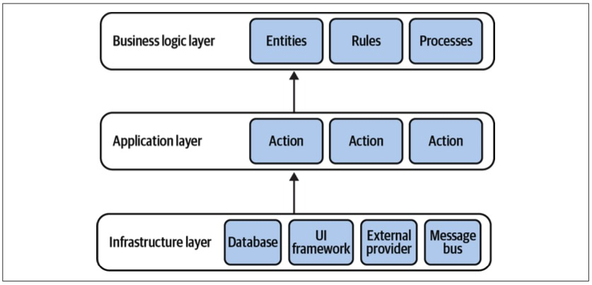

*Figure 8-10. Traditional layers of the ports & adapters architecture*

The architecture depicted in Figure 8-10 is the ports & adapters architectural pattern.

> 图8-10 中描述的体系结构是端口和适配器体系结构模式。

The business logic doesn’t depend on any of the underlying layers, as required for implementing the domain model and event-sourced domain model patterns.

> 业务逻辑不依赖于实现领域模型和事件源域模型模式所需的任何底层。

---

Why is this pattern called ports & adapters?

To answer this question, let’s see how the infrastructural components are integrated with the business logic.

> 要回答这个问题，让我们看看基础设施组件是如何与业务逻辑集成的。

## Integration of Infrastructural Components

> 基础设施组件集成

The core goal of the ports & adapters architecture is to decouple the system’s business logic from its infrastructural components.

> 端口和适配器体系结构的核心目标是将系统的业务逻辑与其基础设施组件解耦。

---

Instead of referencing and calling the infrastructural components directly, the business logic layer defines “ports” that have to be implemented by the infrastructure layer.

> 业务逻辑层没有直接引用和调用基础设施组件，而是定义了必须由基础设施层实现的“端口”。

The infrastructure layer implements “adapters”: concrete-确实的,具体的 implementations of the ports’ interfaces for working with different technologies (see Figure 8-11).

> 基础设施层实现了“适配器”：用于使用不同技术的端口接口的具体实现(参见图8-11)。

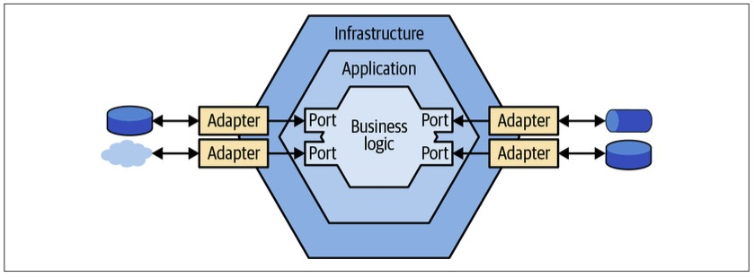

*Figure 8-11. Ports & adapters architecture*

The abstract ports are resolved into concrete adapters in the infrastructure layer, either through dependency injection-注入 or by bootstrapping.

> 抽象端口通过依赖注入或自引导在基础设施层被解析为具体的适配器。

---

For example, here is a possible port definition and a concrete adapter for a message bus:

> 例如，下面是一个可能的端口定义和一个消息总线的具体适配器:

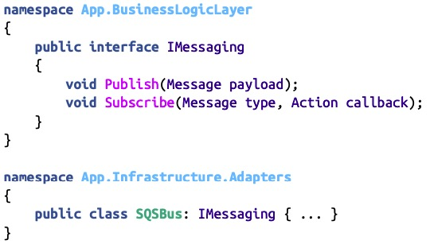

## Variants

> 变化

The ports & adapters architecture is also known as hexagonal-六边的,六角形的 architecture, onion-洋葱,洋葱头 architecture, and clean architecture.

> 端口和适配器体系结构也被称为六边形体系结构、洋葱体系结构和干净体系结构。

All of these patterns are based on the same design principles, have the same components, and have the same relationships between them, but as in the case of the layered architecture, the terminology may differ:

> 所有这些模式都基于相同的设计原则，具有相同的组件，并且它们之间具有相同的关系，但是在分层体系结构的情况下，术语可能有所不同：

- Application layer = service layer = use case layer
- Business logic layer = domain layer = core layer

Despite that, these patterns can be mistakenly treated as conceptually different.

> 尽管如此，这些模式可能会被错误地视为概念上的不同。

That’s just another example of the importance of a ubiquitous language.

> 这只是通用语言重要性的另一个例子。

## When to Use Ports & Adapters

The decoupling of the business logic from all technological concerns makes the ports & adapters architecture a perfect fit for business logic implemented with the domain model pattern.

> 业务逻辑与所有技术关注点的解耦使得端口和适配器体系结构非常适合用领域模型模式实现的业务逻辑。

# Command-Query Responsibility Segregation

> 命令-查询职责隔离

The command-query responsibility segregation (CQRS) pattern is based on the same organizational principles for business logic and infrastructural concerns as ports & adapters.

> 命令-查询职责分离(CQRS)模式基于与端口和适配器相同的业务逻辑和基础设施关注点的组织原则。

It differs, however, in the way the system’s data is managed.

> 然而，不同之处在于系统数据的管理方式。

This pattern enables representation-表示 of the system’s data in multiple persistent models.

> 此模式支持在多个持久模型中表示系统数据。

---

Let’s see why we might need such a solution and how to implement it.

> 让我们看看为什么我们可能需要这样的解决方案以及如何实现它。

## Polyglot Modeling

> 通晓多种语言的建模

In many cases, it may be difficult, if not impossible, to use a single model of the system’s business domain to address all of the system’s needs.

> 在许多情况下，使用系统业务域的单个模型来满足系统的所有需求可能是困难的(如果不是不可能的话)。

For example, as discussed in Chapter 7, online transaction processing (OLTP) and online analytical processing (OLAP) may require different representations of the system’s data.

> 例如，正如第7章所讨论的，在线事务处理(OLTP)和在线分析处理(OLAP)可能需要系统数据的不同表示。

---

Another reason for working with multiple models may have to do with the notion of polyglot persistence.

> 使用多个模型的另一个原因可能与多语言持久性的概念有关。

There is no perfect-完美的 database.

> 没有完美的数据库。

Or, as Greg Young says, all databases are flawed-缺点,瑕疵, each in its own way: we often have to balance the needs for scale, consistency, or supported querying models.

> 或者，正如 Greg Young 所说，所有的数据库都是有缺陷的，每一个都有自己的缺陷：我们经常必须平衡对规模、一致性或支持查询模型的需求。

An alternative to finding a perfect database is the polyglot persistence model: using multiple databases to implement different data-related requirements.

> 寻找完美数据库的另一种选择是多语言持久性模型：使用多个数据库来实现不同的数据相关需求。

For example, a single system might use a document store as its operational database, a column store for analytics/reporting, and a search engine for implementing robust-强健的,强壮的 search capabilities.

> 例如，单个系统可能使用文档存储作为其操作数据库，使用列存储用于分析/报告，使用搜索引擎实现强大的搜索功能。

---

Finally, the CQRS pattern is closely related to event sourcing.

> 最后，CQRS 模式与事件溯源密切相关。

Originally, CQRS was defined to address the limited querying possibilities of an event-sourced model: it is only possible to query events of one aggregate instance at a time.

> 最初，定义 CQRS 是为了解决事件源模型的有限查询可能性：一次只能查询一个聚合实例的事件。

The CQRS pattern provides the possibility of materializing-具体化 projected-投影 models into physical databases that can be used for flexible querying options.

> CQRS 模式提供了将投影模型具体化到可用于灵活查询选项的物理数据库中的可能性。

---

That said, this chapter “decouples” CQRS from event sourcing.

> 也就是说，本章将 CQRS 与事件源“解耦”。

I intend-打算,想要 to show that CQRS is useful even if the business logic is implemented using any of the other business logic implementation patterns.

> 我打算说明，即使使用任何其他业务逻辑实现模式实现业务逻辑，CQRS也是有用的。

---

Let’s see how CQRS allows the use of multiple storage mechanisms for representing different models of the system’s data.

> 让我们看看 CQRS 如何允许使用多种存储机制来表示系统数据的不同模型。

## Implementation

As the name suggests, the pattern segregates-使隔离,分开,分离 the responsibilities of the system’s models.

> 顾名思义，模式隔离了系统模型的职责。

There are two types of models: the command execution model and the read models.

> 有两种类型的模型：命令执行模型和读取模型。

### Command execution model

> 命令执行模型

CQRS devotes-献身,致力,用于 a single model to executing operations that modify the system’s state (system commands).

> CQRS将单个模型用于执行修改系统状态的操作(系统命令)。

This model is used to implement the business logic, validate rules, and enforce-实施,执行,迫使 invariants.

> 该模型用于实现业务逻辑、验证规则和执行不变量。

---

The command execution model is also the only model representing strongly consistent data—the system’s source of truth.

> 命令执行模型也是唯一表示强一致性数据(系统的真实来源)的模型。

It should be possible to read the strongly consistent state of a business entity and have optimistic-乐观的,乐观主义的 concurrency support when updating it.

> 应该能够读取业务实体的强一致状态，并在更新业务实体时提供乐观并发支持。

### Read models (projections)

> 读取模型(投影)

The system can define as many models as needed to present data to users or supply information to other systems.

> 系统可以根据需要定义任意数量的模型，以便向用户呈现数据或向其他系统提供信息。

---

A read model is a precached projection.

> 读模型是预传投影。

It can reside in a durable-持久的,耐用的 database, flat file, or in-memory cache.

> 它可以驻留在持久数据库、平面文件或内存缓存中。

Proper implementation of CQRS allows for wiping-消除,抹去 out all data of a projection and regenerating it from scratch.

> CQRS的正确实现允许清除投影的所有数据并从头重新生成它。

This also enables extending the system with additional projections in the future—models that couldn’t have been foreseen originally.

> 这也使得在未来模型中使用额外的预测来扩展系统成为可能，这些模型最初是无法预见的。

---

Finally, read models are read-only.

None of the system’s operations can directly modify the read models’ data.

> 系统的任何操作都不能直接修改读取模型的数据。

## Projecting Read Models

> 投射读取模型

For the read models to work, the system has to project changes from the command execution model to all its read models.

> 为了使读取模型工作，系统必须将命令执行模型的更改投影到它的所有读取模型。

This concept is illustrated in Figure 8-12.

> 该概念如图8-12所示。

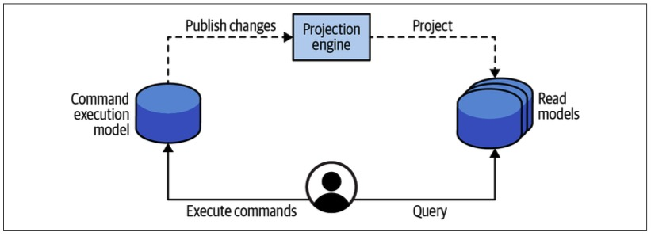

*Figure 8-12. CQRS architecture*

The projection of read models is similar to the notion-概念,想法 of a materialized-实现,具体化 view in relational databases: whenever source tables are updated, the changes have to be reflected in the precached views.

> 读取模型的投影类似于关系数据库中物化视图的概念：无论何时源表更新，更改都必须反映在预传视图中。

---

Next, let’s see two ways to generate projections: synchronously and asynchronously.

> 接下来，让我们看看两种生成投影的方法：同步和异步。

### Synchronous projections

> 同步投影

Synchronous projections fetch changes to the OLTP data through the catch-up-追赶 subscription model:

> 同步投影通过赶超订阅模型获取 OLTP 数据的更改：

- The projection engine queries the OLTP database for added or updated records after the last processed checkpoint.

  > 投影引擎查询 OLTP 数据库，查找在最后处理的检查点之后添加或更新的记录。

- The projection engine uses the updated data to regenerate/update the system’s read models.

  > 投影引擎使用更新的数据来重新生成/更新系统的读取模型。

- The projection engine stores the checkpoint of the last processed record.

  > 投影引擎存储最后处理的记录的检查点。

  This value will be used during the next iteration for getting records added or modified after the last processed record.

  > 该值将在下一次迭代中用于获取在最后处理的记录之后添加或修改的记录。

This process is illustrated in Figure 8-13 and shown as a sequence diagram in Figure 8-14.

> 该流程如图8-13所示，顺序图如图8-14所示。

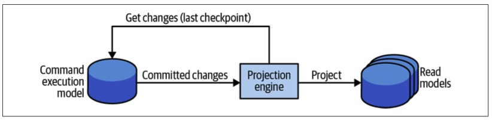

*Figure 8-13. Synchronous projection model*

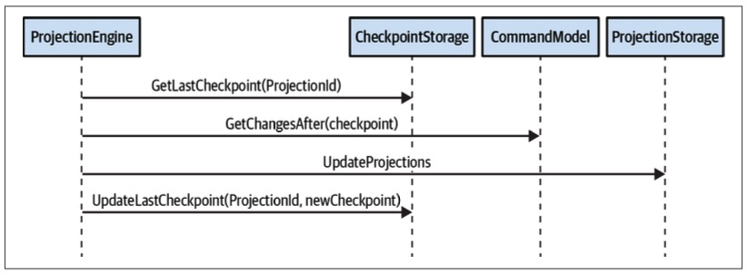

*Figure 8-14. Synchronous projection of read models through catch-up subscription*

For the catch-up subscription to work, the command execution model has to checkpoint all the appended or updated database records.

> 为了使赶上订阅工作，命令执行模型必须检查点所有追加或更新的数据库记录。

The storage mechanism should also support the querying of records based on the checkpoint.

> 存储机制还应该支持基于检查点的记录查询。

---

The checkpoint can be implemented using the databases’ features.

> 检查点可以使用数据库的特性来实现。

For example, SQL Server’s “rowversion” column can be used to generate unique, incrementing numbers upon inserting or updating a row, as illustrated in Figure 8-15.

> 例如，SQL Server 的 “rowversion” 列可以用来在插入或更新一行时生成唯一的、递增的数字，如图8-15所示。

In databases that lack such functionality, a custom solution can be implemented that increments a running counter and appends it to each modified record.

> 在缺乏这种功能的数据库中，可以实现自定义解决方案，使正在运行的计数器递增，并将其附加到每个修改的记录。

It’s important to ensure that the checkpoint-based query returns consistent results.

> 确保基于检查点的查询返回一致的结果非常重要。

If the last returned record has a checkpoint value of 10, on the next execution no new requests should have values lower than 10. 

> 如果最后返回的记录的检查点值为10，那么在下一次执行时，任何新请求的值都不应低于10。

Otherwise-否者, these records will be skipped by the projection engine, which will result in inconsistent models.

> 否则，这些记录将被投影引擎跳过，这将导致不一致的模型。

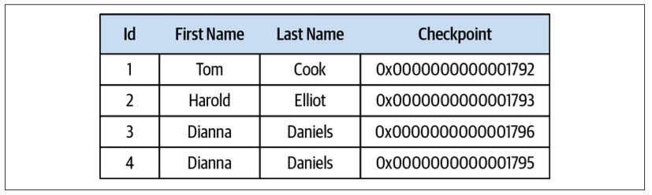

*Figure 8-15. Auto-generated checkpoint column in a relational database*

The synchronous projection method makes it trivial-容易解决的,平凡的 to add new projections and regenerate existing ones from scratch.

> 同步投影方法使得从头添加新投影和重新生成现有投影变得非常简单。

In the latter case, all you have to do is reset the checkpoint to 0; the projection engine will scan the records and rebuild the projections from the ground up.

> 在后一种情况下，你所要做的就是将检查点重置为0；投影引擎将扫描记录并从头开始重建投影。

### Asynchronous projections

In the asynchronous projection scenario, the command execution model publishes all committed changes to a message bus.

> 在异步投影场景中，命令执行模型将所有提交的更改发布到消息总线。

The system’s projection engines can subscribe to the published messages and use them to update the read models, as shown in Figure 8-16.

> 系统的投影引擎可以订阅已发布的消息，并使用它们来更新读模型，如图8-16所示。

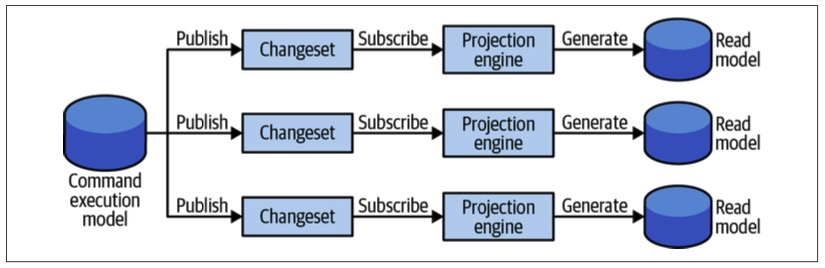

*Figure 8-16. Asynchronous projection of read models*

## Challenges

Despite the apparent-显而易见的,表面上的 scaling and performance advantages of the asynchronous projection method, it is more prone to the challenges of distributed computing.

> 尽管异步投影方法具有明显的可伸缩性和性能优势，但它更容易受到分布式计算的挑战。

If the messages are processed **out of order**-乱序 or duplicated-重复, inconsistent data will be projected into the read models.

> 如果消息被乱序处理或重复处理，不一致的数据将被投射到读取模型中。

---

This method also makes it more challenging to add new projections or regenerate existing ones.

> 这种方法也使得添加新投影或重新生成现有投影更具挑战性。

---

For these reasons, it’s advisable-明智的,可取的 to always implement synchronous projection and, optionally, an additional asynchronous projection on top of it.

> 由于这些原因，建议始终实现同步投影，并在此基础上附加一个异步投影(可选)。

## Model Segregation

> 模型隔离

In the CQRS architecture, the responsibilities of the system’s models are segregated according to their type.

> 在 CQRS 体系结构中，系统模型的职责根据它们的类型进行分离。

A command can only operate on the strongly consistent command execution model.

> 命令只能在强一致的命令执行模型上运行。

A query cannot directly modify any of the system’s persisted state—neither the read models nor the command execution model.

> 查询不能直接修改系统的任何持久化状态——无论是读取模型还是命令执行模型。

---

A common misconception about CQRS-based systems is that a command can only modify data, and data can be fetched for display only through a read model.

> 关于基于 CQRS 的系统的一个常见误解是，命令只能修改数据，而数据只能通过读取模型来获取并显示。

In other words, the command executing the methods should never return any data.

> 换句话说，执行这些方法的命令不应该返回任何数据。

This is wrong.

> 这是错误的。

This approach produces accidental complexities and leads to a bad user experience.

> 这种方法会产生意外的复杂性，并导致糟糕的用户体验。

---

A command should always let the caller know whether it has succeeded or failed.

> 命令应该总是让调用者知道它是成功还是失败。

If it has failed, why did it fail?

> 如果失败了，为什么会失败呢?

Was there a validation or technical issue?

> 是否存在验证或技术问题?

The caller has to know how to fix the command.

> 调用者必须知道如何修复命令。

*Therefore,* *a command can—and in many cases should—return data;* for example, if the system’s user interface has to reflect the modifications resulting from the command.

> 因此，一个命令可以——而且在很多情况下应该——返回数据；例如，如果系统的用户界面必须反映由命令引起的修改。

Not only does this make it easier for consumers to work with the system since they immediately receive feedback for their actions, but the returned values can be used further in the consumers’ workflows, eliminating the need for unnecessary data round trips.

> 这不仅使使用者更容易使用系统，因为他们立即收到对其操作的反馈，而且返回的值可以在使用者的工作流中进一步使用，从而消除了不必要的数据往返的需要。

---

The only limitation here is that the returned data should originate from the strongly consistent model—the command execution model—as we cannot expect the projections, which will eventually be consistent, to be refreshed immediately-立即,马上.

> 这里唯一的限制是返回的数据应该来自强一致模型(命令执行模型)，因为我们不能期望投影(最终是一致的)立即刷新。

## When to Use CQRS

The CQRS pattern can be useful for applications that need to work with the same data in multiple models, potentially stored in different kinds of databases.

> 对于需要处理多个模型(可能存储在不同类型的数据库中)中的相同数据的应用程序，CQRS模式非常有用。

From an operational perspective, the pattern supports domain-driven design’s core value of working with the most effective models for the task at hand, and continuously improving the model of the business domain.

> 从操作的角度来看，该模式支持领域驱动设计的核心价值，即为手头的任务使用最有效的模型，并不断改进业务领域的模型。

From an infrastructural perspective, CQRS allows for leveraging the strength-优势 of the different kinds of databases; for example, using a relational database to store the command execution model, a search index for full text search, and prerendered flat files for fast data retrieval, with all the storage mechanisms reliably synchronized.

> 从基础设施的角度来看，CQRS 允许利用不同类型数据库的优势；例如，使用关系数据库存储命令执行模型，使用搜索索引存储全文搜索，使用预呈现平面文件存储快速数据检索，所有存储机制都可靠地同步。

---

Moreover, CQRS naturally lends itself to event-sourced domain models.

> 此外，CQRS 自然地适用于事件源领域模型。

The event-sourcing model makes it impossible to query records based on the aggregates’ states, but CQRS enables this by projecting the states into queryable databases.

> 事件源模型使得无法根据聚合的状态查询记录，但是 CQRS 通过将状态投射到可查询的数据库中来实现这一点。

# Scope

The patterns we’ve discussed—layered architecture, ports & adapters architecture, and CQRS—should not be treated as systemwide organizational principles.

> 我们讨论的模式——分层体系结构、端口和适配器体系结构以及 CQRS——不应被视为系统范围的组织原则。

These are not necessarily high-level architecture patterns for a whole bounded context either.

> 这些也不一定是整个有界上下文的高级体系结构模式。

---

Consider a bounded context encompassing-包含,包括 multiple subdomains, as shown in Figure 8-17.

> 考虑一个包含多个子域的有界上下文，如图8-17所示。

The subdomains can be of different types: core, supporting, or generic.

> 子域可以是不同的类型：核心、支持或通用。

Even subdomains of the same type may require different business logic and architectural patterns (that’s the topic of Chapter 10). 

> 即使是同一类型的子域也可能需要不同的业务逻辑和体系结构模式(这是第10章的主题)。

Enforcing-实施,执行,强制 a single, bounded, context‐wide architecture will inadvertently-无意地,不经意地 lead to accidental complexity.

> 强制执行一个单一的、有界的、上下文范围的体系结构会无意中导致意外的复杂性。

*Figure 8-17. Bounded contexts spanning multiple subdomains*

Our goal is to drive design decisions according to the actual needs and business strategy.

> 我们的目标是根据实际需求和业务策略来驱动设计决策。

In addition to the layers that partition-分区 the system horizontally, we can introduce additional vertical-垂直的 partitioning.

> 除了对系统进行水平分区的层之外，我们还可以引入额外的垂直分区。

It’s crucial to define logical boundaries for modules encapsulating distinct business subdomains and use the appropriate tools for each, as demonstrated in Figure 8-18.

> 为封装不同业务子域的模块定义逻辑边界并为每个模块使用适当的工具是至关重要的，如图8-18 所示。

---

Appropriate-合适的,相称的 vertical boundaries make a monolithic-整体的,完全统一的 bounded context a modular one and help to prevent it from becoming a big ball of mud.

> 适当的垂直边界可以使单一的有界环境成为模块化的环境，并有助于防止它变成一个大泥球。

As we will discuss in Chapter 11, these logical boundaries can be refactored later into physical boundaries of finer-grained bounded contexts.

> 正如我们将在第11章中讨论的那样，这些逻辑边界可以在稍后重构为细粒度有界上下文的物理边界。

*Figure 8-18. Architectural slices*

# Conclusion

The layered architecture decomposes the codebase based on its technological concerns.

> 分层架构根据其技术关注点对代码库进行分解。

Since this pattern couples business logic with data access implementation, it’s a good fit for active record–based systems.

>由于此模式将业务逻辑与数据访问实现结合在一起，因此非常适合基于活动记录的系统。

---

The ports & adapters architecture inverts-反转,倒置 the relationships: it puts the business logic at the center and decouples it from all infrastructural dependencies.

>端口和适配器体系结构颠倒了这种关系：它将业务逻辑置于中心，并将其与所有基础设施依赖关系解耦。

This pattern is a good fit for business logic implemented with the domain model pattern.

> 此模式非常适合用域模型模式实现的业务逻辑。

---

The CQRS pattern represents the same data in multiple models.

> CQRS 模式表示多个模型中的相同数据。

Although this pattern is obligatory-有义务的,强制性的 for systems based on the event-sourced domain model, it can also be used in any systems that need a way of working with multiple persistent models.

> 尽管此模式对于基于事件源域模型的系统是强制性的，但它也可以用于任何需要使用多个持久模型的系统。

---

The patterns we will discuss in the next chapter address architectural concerns from a different perspective: how to implement reliable interaction between different components of a system.

> 我们将在下一章中讨论的模式将从不同的角度解决架构问题：如何在系统的不同组件之间实现可靠的交互。

