> Chapter 9. Communication Patterns
>
> 章节 9. 沟通模式

Chapters 5–8 presented tactical design patterns that define the different ways to implement a system’s components: how to model the business logic and how to organize the internals of a bounded context architecturally.

> 第5-8章介绍了战术设计模式，这些模式定义了实现系统组件的不同方式：如何对业务逻辑建模，以及如何从架构上组织有界上下文的内部。

In this chapter, we will step beyond the boundaries of a single component and discuss the patterns for organizing the flow of communication across a system’s elements.

> 在本章中，我们将超越单个组件的边界，讨论跨系统元素组织通信流的模式。

---

The patterns you will learn about in this chapter facilitate cross-bounded context communication, address the limitations imposed-强制推行,强加于 by aggregate design principles, and orchestrate business processes spanning multiple system components.

> 您将在本章中学习的模式将促进跨界上下文通信，解决聚合设计原则所施加的限制，并编排跨多个系统组件的业务流程。

# Model Translation

> 模式转化

A bounded context is the boundary of a model—a ubiquitous language.

> 有界上下文是模型的边界——一种统一语言。

As you learned in Chapter 3, there are different patterns for designing communication across different bounded contexts. 

> 正如您在第3章中所了解的，在不同的有界上下文中设计通信有不同的模式。

Suppose-假设,假定 the teams implementing two bounded contexts are communicating effectively and willing-愿意 to collaborate.

> 假设实现两个边界上下文的团队正在有效地沟通并愿意协作。

In this case, the bounded contexts can be integrated in a partnership: the protocols can be coordinated-协调,配合 in an ad hoc manner, and any integration issues can be effectively addressed through communication between the teams.

> 在这种情况下，边界上下文可以集成到合作关系中：协议可以以特别的方式进行协调，并且可以通过团队之间的通信有效地解决任何集成问题。

Another cooperation-driven integration method is *shared kernel*: the teams extract-提取,提炼 and co-evolve-共同进化 a limited portion of a model; for example, extracting-提取,提炼 the bounded contexts’ integration contracts-合同,契约 into a co-owned repository.

> 另一种协作驱动的集成方法是“共享内核”：团队提取并共同进化模型的有限部分；例如，将有界上下文的集成契约提取到共同拥有的存储库中。

---

In a customer–supplier relationship, the balance of power tips toward-向,趋向 either the upstream (supplier) or the downstream (consumer) bounded context.

> 在客户-供应商关系中，权力的平衡倾向于上游(供应商)或下游(消费者)有限的上下文。

Suppose-假定,假设 the downstream bounded context cannot conform to the upstream bounded context’s model.

> 假设下游有界上下文不能符合上游有界上下文的模型。

In this case, a more elaborate-复杂的,详尽的,精心制作 technical solution is required that can facilitate communication by translating the bounded contexts’ models.

> 在这种情况下，需要一个更精细的技术解决方案，通过翻译有界上下文的模型来促进通信。

---

This translation can be handled by one, or sometimes both, sides: the downstream bounded context can adapt the upstream bounded context’s model to its needs using an anticorruption-反腐败,反贪污 layer (ACL), while the upstream bounded context can act as an open-host service (OHS) and protect its consumers from changes to its implementation model by using an integration-specific published language.

> 这种转换可以由一方处理，有时也可以由双方处理：下游有界上下文可以使用反腐败层(ACL)使上游有界上下文的模型适应其需求，而上游有界上下文可以充当开放主机服务(OHS)，并通过使用特定于集成的已发布语言保护其消费者免受其实现模型的更改。

Since the translation logic is similar for both the anticorruption layer and the open-host service, this chapter covers the implementation options without differentiating between the patterns and mentions-提到,谈到 the differences only in exceptional-不寻常的,罕见的 cases.

> 由于反腐败层和开放主机服务的转换逻辑是相似的，所以本章只讨论实现选项，不区分模式，只在特殊情况下提到差异。

---

The model’s translation logic can be either stateless-无状态 or stateful-有状态的.

> 模型的转换逻辑可以是无状态的，也可以是有状态的。

*Stateless translation* happens on the fly, as incoming (OHS) or outgoing (ACL) requests are issued, while *stateful translation* involves a more complicated translation logic that requires a database.

> *无状态转换*发生在动态中，如传入(OHS)或传出(ACL)请求发出，而*有状态转换*涉及更复杂的翻译逻辑，需要数据库。

Let’s see design patterns for implementing both types of model translation.

> 让我们看看实现这两种类型的模型转换的设计模式。

## Stateless Model Translation

> 无状态模型转换

For stateless model translation, the bounded context that owns the translation (OHS for upstream, ACL for downstream) implements the proxy design pattern to interject the incoming and outgoing requests and map the source model to the bounded context’s target model.

> 对于无状态模型转换，拥有转换的有界上下文(OHS为上游，ACL为下游)实现代理设计模式，以插入传入和传出请求，并将源模型映射到有界上下文的目标模型。

This is depicted-描述,描绘 in Figure 9-1.

*Figure 9-1. Model translation by a proxy*

Implementation of the proxy depends on whether the bounded contexts are communicating synchronously or asynchronously.

> 代理的实现取决于有界上下文是同步通信还是异步通信。

### Synchronous

> 同步

The typical way to translate models used in synchronous communication is to embed the transformation logic in the bounded context’s codebase, as shown in Figure 9-2.

> 转换同步通信中使用的模型的典型方法是将转换逻辑嵌入到有界上下文的代码库中，如图9-2所示。

In an open-host service, translation to the public language takes place when processing incoming requests, and in an anticorruption layer, it occurs when calling the upstream bounded context.

> 在开放主机服务中，到公共语言的翻译发生在处理传入请求时，而在反腐败层中，它发生在调用上游有界上下文时。

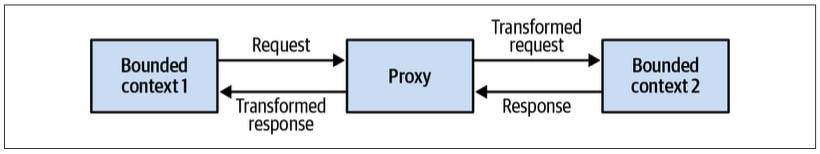

*Figure 9-2. Synchronous communication*

In some cases, it can be more cost-effective-划算的,成本效益好的 and convenient-方便的,便利的 to offload-卸载的,卸货 the translation logic to an external component such as an API gateway pattern.

> 在某些情况下，将转换逻辑卸载到外部组件(如API网关模式)可能更经济、更方便。

The API gateway component can be an open source software-based solution such as Kong or KrakenD, or it can be a cloud vendor’s managed service such as AWS API Gateway, Google Apigee, or Azure API Management.

> API网关组件可以是基于开源软件的解决方案，如Kong或KrakenD，也可以是云供应商的托管服务，如AWS API gateway、Google Apigee或Azure API Management。

---

For bounded contexts implementing the open-host pattern, the API gateway is responsible for converting the internal model into the integration-optimized published language.

> 对于实现开放主机模式的有界上下文，API网关负责将内部模型转换为集成优化的发布语言。

Moreover, having an explicit-明确的,显式的 API gateway can alleviate-减轻,缓和 the process of managing and serving multiple versions of the bounded context’s API, as depicted in Figure 9-3.

> 此外，有一个显式的API网关可以减轻管理和服务多个版本的有界上下文API的过程，如图9-3所示。

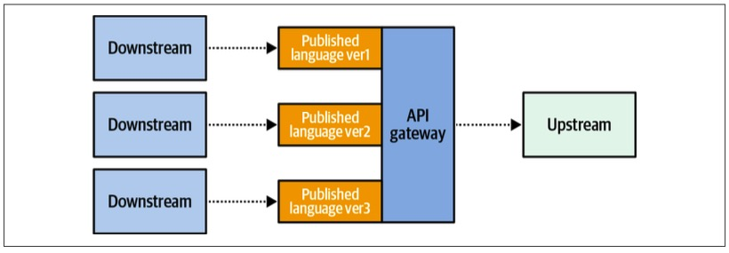

*Figure 9-3. Exposing* *different* *versions of the published language*

Anticorruption layers implemented using an API gateway can be consumed by multiple downstream bounded contexts.

> 使用API网关实现的反腐败层可以被多个下游有界上下文使用。

In such cases, the anticorruption layer acts as an integration-specific bounded context, as shown in Figure 9-4.

> 在这种情况下，反腐败层充当集成特定的有界上下文，如图9-4所示。

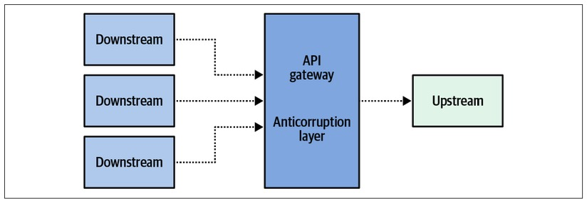

*Figure 9-4. Shared anticorruption layer*

Such bounded contexts, which are mainly in charge of transforming models for more convenient consumption-消费,引用 by other components, are often referred to as *interchange-交换,互换 contexts*.

> 这样的有界上下文主要负责转换模型以便其他组件更方便地使用，通常被称为“交换上下文”。

### Asynchronous

To translate models used in asynchronous communication you can implement a *message proxy*: an intermediary-中间的,媒介 component subscribing to messages coming from the source bounded context.

> 要转换异步通信中使用的模型，您可以实现一个*消息代理*：一个订阅来自源边界上下文的消息的中间组件。

The proxy will apply the required model transformations and forward-转发 the resultant messages to the target subscriber (see Figure 9-5).

> 代理将应用所需的模型转换，并将结果消息转发给目标订阅者(参见图9-5)。

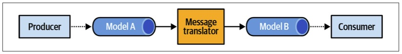

*Figure 9-5. Translating models in asynchronous communication*

In addition to translating the messages’ model, the intercepting-拦截,阻截 component can also reduce the noise-干扰 on the target bounded context by filtering out irrelevant messages.

> 除了翻译消息模型之外，拦截组件还可以通过过滤掉不相关的消息来减少目标有界上下文中的噪声。

---

Asynchronous model translation is essential when implementing an open host service.

> 在实现开放主机服务时，异步模型转换是必不可少的。

It’s a common mistake to design and expose a published language for the model’s objects and allow domain events to be published as they are, thereby-因此,从而 exposing the bounded context’s implementation model.

> 为模型的对象设计和公开已发布的语言，并允许按原样发布域事件，从而公开有界上下文的实现模型，这是一个常见的错误。

Asynchronous translation can be used to intercept the domain events and convert them into a published language, thus providing better encapsulation of the bounded context’s implementation details (see Figure 9-6).

> 异步转换可用于拦截领域事件并将其转换为已发布的语言，从而更好地封装有界上下文的实现细节(参见图9-6)。

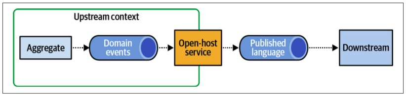

*Figure 9-6. Domain events in a published language*

Moreover, translating messages to the published language enables differentiating between private events that are intended for the bounded context’s internal needs and public events that are designed for integration with other bounded contexts.

> 此外，将消息转换为发布的语言可以区分用于满足有界上下文内部需求的私有事件和用于与其他有界上下文集成的公共事件。

We’ll revisit and expand on the topic of private/public events in Chapter 15, where we discuss the relationship between domain-driven design and event-driven architecture.

> 我们将在第15章重新讨论和扩展私有/公共事件的主题，讨论领域驱动设计和事件驱动架构之间的关系。

## Stateful Model Translation

> 有状态模型转换

For more significant model transformations—for example, when the translation mechanism has to aggregate the source data or unify-联合,统一 data from multiple sources into a single model—a stateful translation may be required.

> 对于更重要的模型转换—例如，当转换机制必须聚合源数据或将来自多个源的数据统一到单个模型中时—可能需要有状态转换。

Let’s discuss each of these use cases in detail.

> 让我们详细讨论每一个用例。

### Aggregating incoming data

> 聚合输入数据

Let’s say a bounded context is interested in aggregating incoming requests and processing them in batches for performance optimization.

> 假设一个有界上下文对聚合传入请求并批量处理它们以实现性能优化感兴趣。

In this case, aggregation may be required both for synchronous and asynchronous requests (see Figure 9-7).

> 在这种情况下，同步和异步请求可能都需要聚合(参见图9-7)。

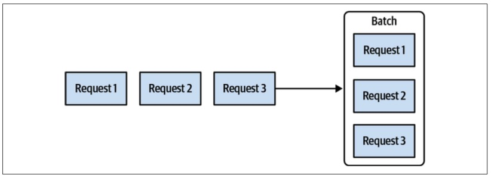

*Figure 9-7. Batching requests*

Another common use case for aggregation of source data is combining multiple fine-grained messages into a single message containing the unified-一致的,统一的 data, as depicted in Figure 9-8.

> 源数据聚合的另一个常见用例是将多个细粒度消息合并为包含统一数据的单个消息，如图9-8所示。

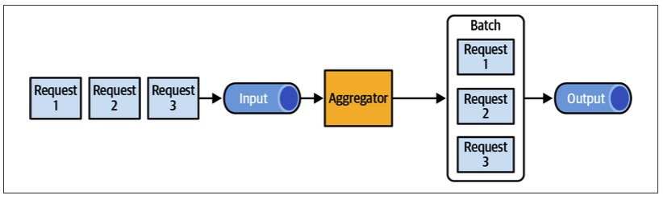

*Figure 9-8. Unifying incoming events*

Model transformation that aggregates incoming data cannot be implemented using an API gateway, and thus requires more elaborate-精细的,复杂的,精心制作的, stateful processing.

> 聚合传入数据的模型转换不能使用API网关实现，因此需要更精细的、有状态的处理。

To track the incoming data and process it accordingly-相应地, the translation logic requires its own persistent storage (see Figure 9-9).

> 为了跟踪传入的数据并对其进行相应的处理，转换逻辑需要自己的持久存储(参见图9-9)。

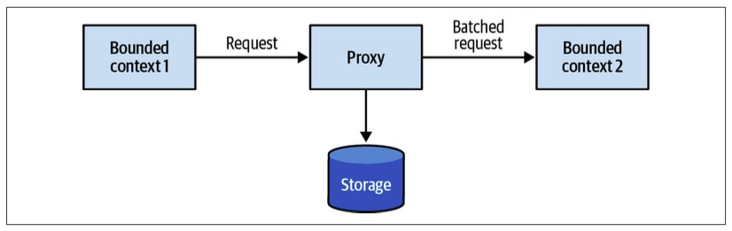

*Figure 9-9. Stateful model transformation*

In some use cases, you can avoid implementing a custom solution for a stateful translation by using off-the-shelf products; for example, a stream-process platform (Kafka, AWS Kinesis, etc.), or a batching solution (Apache NiFi, AWS Glue, Spark, etc.).

> 为了跟踪传入的数据并对其进行相应的处理，转换逻辑需要自己的持久存储(参见图9-9)。

### Unifying multiple sources

> 统一多个资源

A bounded context may need to process data aggregates from multiple sources, including other bounded contexts.

> 有界上下文可能需要处理来自多个源(包括其他有界上下文)的数据聚合。

A typical example for this is the backend-for-frontend pattern, in which the user interface has to combine data originating from multiple services.

> 典型的例子是后端换前端模式，在这种模式中，用户界面必须组合来自多个服务的数据。

---

Another example is a bounded context that must process data from multiple other contexts and implement complex business logic to process all the data.

> 另一个例子是有界上下文，它必须处理来自多个其他上下文的数据，并实现复杂的业务逻辑来处理所有数据。

In this case, it can be beneficial to decouple the integration and business logic complexities by fronting the bounded context with an anticorruption layer that aggregates data from all other bounded contexts, as shown in Figure 9-10.

> 在这种情况下，将集成和业务逻辑的复杂性解耦可能是有益的，方法是在有界上下文前面设置一个聚合来自所有其他有界上下文的数据的反腐败层，如图9-10所示。

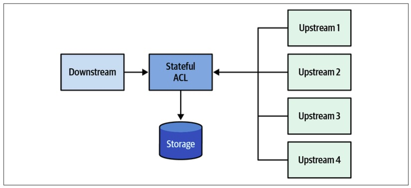

*Figure 9-10. Simplifying the integration model using the anticorruption layer pattern*

# Integrating Aggregates

> 集成聚合

In Chapter 6, we discussed that one of the ways aggregates communicate with the rest of the system is by publishing domain events.

> 在第6章中，我们讨论了聚合与系统其余部分通信的一种方式是发布域事件。

External components can subscribe to these domain events and execute their logic.

> 外部组件可以订阅这些域事件并执行它们的逻辑。

But how are domain events published to a message bus?

> 但是如何将域事件发布到消息总线呢?

---

Before we get to the solution, let’s examine a few common mistakes in the event publishing process and the consequences of each approach.

> 在讨论解决方案之前，让我们检查一下事件发布过程中的一些常见错误以及每种方法的后果。

Consider the following code:

> 考虑下面的代码：

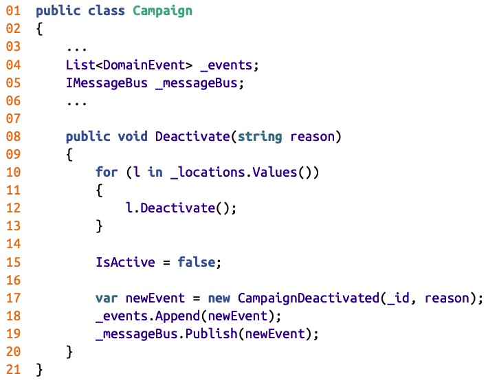

On line 17, a new event is instantiated.

> 在第17行，实例化了一个新事件。

On the following two lines, it is appended to the aggregate’s internal list of domain events (line 18), and the event is published to the message bus (line 19).

This implementation of publishing domain events is simple but wrong.

Publishing the domain event right-直接地 from the aggregate is bad for two reasons.

> 从聚合中直接发布域事件是不好的，原因有两个。

First, the event will be dispatched before the aggregate’s new state is committed to the database.

> 首先，事件将在聚合的新状态提交给数据库之前被调度。

A subscriber may receive the notification that the campaign was deactivated-无效的, but it would contradict-相抵触,相矛盾 the campaign’s state. 

> 订阅者可能会收到活动已停用的通知，但这将与活动的状态相矛盾。

Second, what if the database transaction fails to commit because of a race-竞争 condition, subsequent aggregate logic rendering-使成为 the operation invalid, or simply a technical issue in the database?

> 其次，如果数据库事务由于竞争条件、随后的聚合逻辑导致操作无效或仅仅是数据库中的技术问题而未能提交，该怎么办?

Even though the database transaction is rolled back, the event is already published and pushed to subscribers, and there is no way to retract-收回,取消,撤销 it.

> 即使回滚了数据库事务，事件也已经发布并推送给订阅者，并且无法收回它。

---

Let’s try something else：

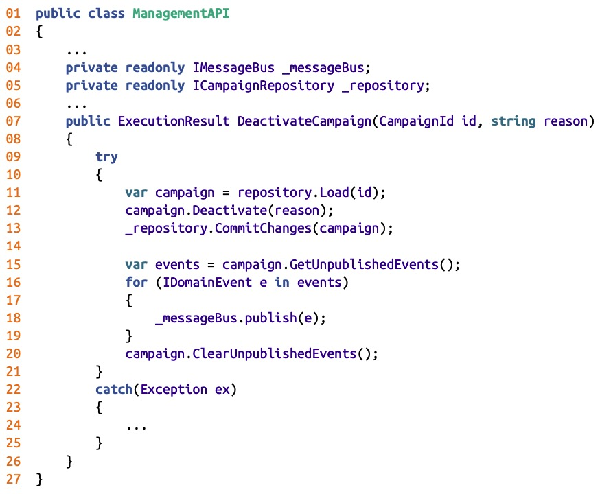

In the preceding listing, the responsibility of publishing new domain events is shifted to the application layer.

> 在前面的清单中，发布新领域事件的责任转移到了应用程序层。

On lines 11 through 13, the relevant instance of the Campaign aggregate is loaded, its Deactivate command is executed, and only after the updated state is successfully committed to the database, on lines 15 through 20, are the new domain events published to the message bus.

> 在第11行到第13行，加载Campaign聚合的相关实例，执行其Deactivate命令，只有在更新状态成功提交到数据库之后，在第15行到第20行，才将新的域事件发布到消息总线。

Can we trust this code? No.

> 我们能相信这个代码吗？不。

---

In this case, the process running the logic for some reason fails to publish the domain events.

> 在这种情况下，运行逻辑的进程由于某种原因无法发布域事件。

Perhaps the message bus is down.

> 也许消息总线坏了。

Or the server running the code fails right after committing the database transaction, but before publishing the events the system will still end in an inconsistent state, which means that the database transaction is committed, but the domain events will never be published.

> 或者运行代码的服务器在提交数据库事务之后立即失败，但在发布事件之前，系统仍然会以不一致的状态结束，这意味着数据库事务被提交，但域事件永远不会被发布。

---

These edge-边缘,临界点 cases can be addressed using the outbox pattern.

> 可以使用发件箱模式来处理这些边缘情况。

## Outbox

> 发件箱

The outbox pattern (Figure 9-11) ensures reliable publishing of domain events using the following algorithm:

> 发件箱模式(图9-11)使用以下算法确保可靠地发布域事件：

- Both the updated aggregate’s state and the new domain events are committed in the same atomic transaction.

  > 更新后的聚合状态和新的域事件都在同一个原子事务中提交。

- A message relay fetches newly committed domain events from the database.

  > 消息中继从数据库中获取新提交的域事件。

- The relay publishes the domain events to the message bus.

  > 中继将域事件发布到消息总线。

- Upon successful publishing, the relay either marks the events as published in the database or deletes them completely.

  > 发布成功后，中继要么将事件标记为已发布到数据库中，要么将其完全删除。

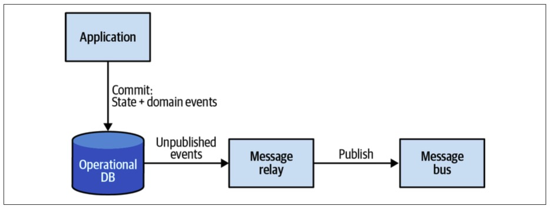

*Figure 9-11. Outbox pattern*

> 图 9-11 发件箱模式

When using a relational database, it’s convenient-方便的,便利的 to leverage the database’s ability to commit to two tables atomically and use a dedicated table for storing the messages, as shown in Figure 9-12.

> 在使用关系数据库时，可以方便地利用数据库自动提交到两个表的能力，并使用专用表存储消息，如图9-12所示。

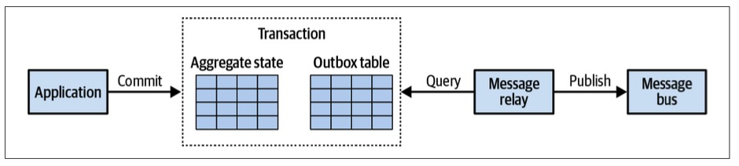

*Figure 9-12. Outbox table*

> 图 9-12 发件箱表

---

When using a NoSQL database that doesn’t support multidocument-多文档 transactions, the outgoing domain events have to be embedded in the aggregate’s record.

> 当使用不支持多文档事务的NoSQL数据库时，传出域事件必须嵌入到聚合的记录中。

For example:

~~~json
{
    "campaign-id": "364b33c3-2171-446d-b652-8e5a7b2be1af",
    "state": {
        "name": "Autumn 2017",
        "publishing-state": "DEACTIVATED",
        "ad-locations": [
...
        ]
...
    },
    "outbox": [
        {
            "campaign-id": "364b33c3-2171-446d-b652-8e5a7b2be1af",
            "type": "campaign-deactivated",
            "reason": "Goals met",
            "published": false
        }
    ]
}
~~~

In this sample, you can see the JSON document’s additional property, outbox, containing a list of domain events that have to be published.

### Fetching unpublished events

> 获取未发布事件

The publishing relay can fetch the new domain events in either a pull-based or push-based manner:

> 发布中继可以通过基于拉或基于推的方式获取新的域事件：

*Pull: polling publisher*

> *拉:轮询发布者*

The relay can continuously query the database for unpublished events.

> 中继可以连续地查询数据库中未发布的事件。

Proper indexes have to be in place to minimize the load on the database induced-引起,导致 by the constant-持续不断的,经常发生的 polling.

> 必须设置适当的索引，以最大限度地减少由不断轮询引起的数据库负载。

*Push: transaction log tailing-跟踪*

> *Push：事务日志跟踪*

Here we can leverage the database’s feature set to proactively call the publishing relay when new events are appended.

> 在这里，我们可以利用数据库的特性集，在添加新事件时主动调用发布中继。

For example, some relational databases enable getting notifications about updated/inserted records by tailing the database’s transaction log.

> 例如，一些关系数据库通过跟踪数据库的事务日志来获取关于更新/插入记录的通知。

Some NoSQL databases expose committed changes as streams of events (e.g., AWS DynamoDB Streams).

> 一些NoSQL数据库将提交的更改公开为事件流(例如，AWS DynamoDB streams)。

---

It’s important to note that the outbox pattern guarantees delivery of the messages at least once: if the relay fails right after publishing a message but before marking it as published in the database, the same message will be published again in the next iteration.

> 重要的是要注意，发件箱模式保证消息至少传递一次：如果在发布消息之后，但在将其标记为在数据库中发布之前中继失败，则将在下一次迭代中再次发布相同的消息。

---

Next, we’ll take a look at how we can leverage the reliable publishing of domain events to overcome some of the limitations imposed-强制推行,强制实行,把...强加于 by aggregate design principles.

> 接下来，我们将了解如何利用领域事件的可靠发布来克服聚合设计原则所施加的一些限制。

## Saga

One of the core aggregate design principles is to limit each transaction to a single instance of an aggregate.

> **核心聚合设计原则之一是将每个事务限制为聚合的单个实例。**

This ensures that an aggregate’s boundaries are carefully considered and encapsulate a coherent set of business functionality. 

> 这可确保仔细考虑聚合的边界，并封装一组一致的业务功能。

But there are cases when you have to implement a business process that spans multiple aggregates.

> 但是在某些情况下，您必须实现跨越多个聚合的业务流程。

---

Consider the following example: when an advertising campaign is activated, it should automatically submit the campaign’s advertising materials to its publisher.

> 考虑下面的例子：当一个广告活动被激活时，它应该自动向其发布者提交该活动的广告材料。

Upon receiving the confirmation from the publisher, the campaign’s publishing state should change to Published.

> 收到发布者的确认后，活动的发布状态将变为已发布。

In the case of rejection by the publisher, the campaign should be marked as Rejected.

> 在被发布者拒绝的情况下，该活动应标记为已拒绝。

---

This flow spans two business entities: advertising campaign and publisher.

> 这种流动跨越两个商业实体：广告活动和出版商。

Colocating the entities in the same aggregate boundary would definitely be overkill-过犹不及,过分行为, as these are clearly different business entities that have different responsibilities and may belong to different bounded contexts.

> 将实体放置在同一聚合边界中肯定是多余的，因为它们显然是不同的业务实体，具有不同的职责，并且可能属于不同的有界上下文。

Instead, this flow can be implemented as a saga.

> 相反，这个流可以作为一个 Saga 来实现。

---

A saga is a long-running business process.

> 传奇是一个长时间运行的业务流程。

It’s long running not necessarily in terms of time, as sagas can run from seconds to years, but rather in terms of transactions: a business process that spans multiple transactions.

> 它的长时间运行并不一定是在时间上，因为 Saga 可以从几秒到几年不等，而是在事务方面：一个跨越多个事务的业务流程。

The transactions can be handled not only by aggregates but by any component emitting-发出,散发 domain events and responding to commands.

> 事务不仅可以由聚合处理，还可以由发出域事件并响应命令的任何组件处理。

The saga listens to the events emitted by the relevant components and issues subsequent commands to the other components. 

> saga 监听相关组件发出的事件，并向其他组件发出后续命令。

If one of the execution steps fails, the saga is **in charge of**-负责 issuing relevant compensating-补偿,赔偿 actions to ensure the system state remains consistent.

> 如果其中一个执行步骤失败，则 Saga 负责发出相关的补偿操作，以确保系统状态保持一致。

---

Let’s see how the advertising campaign publishing flow from the preceding example can be implemented as a saga, as shown in Figure 9-13.

> 让我们看看如何将前面示例中的广告活动发布流程实现为 Saga，如图9-13所示。

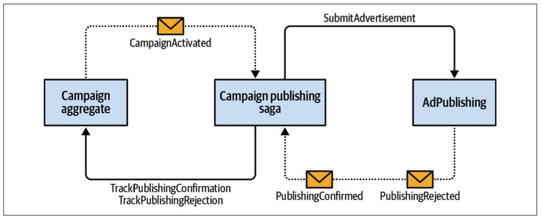

*Figure 9-13. Saga*

---

To implement the publishing process, the saga has to listen to the Campaign Activated event from the Campaign aggregate and the PublishingConfirmed and Pub lishingRejected events from the AdPublishing bounded context.

> 为了实现发布过程，saga必须监听来自Campaign聚合的Campaign Activated事件，以及来自AdPublishing绑定上下文的PublishingConfirmed和publishingrejected事件。

The saga has to execute the SubmitAdvertisement command on AdPublishing, and the TrackPublishingConfirmation and TrackPublishingRejection commands on the Campaign aggregate.

> saga必须在AdPublishing上执行submitadvertising命令，在Campaign聚合上执行TrackPublishingConfirmation和TrackPublishingRejection命令。

In this example, the TrackPublishingRejection command acts as a compensation-补偿 action that will ensure that the advertising campaign is not listed as active.

> 在本例中，TrackPublishingRejection命令充当补偿操作，它将确保广告活动未被列为活动。

Here is the code：

~~~java
public class CampaignPublishingSaga {
  private readonly ICampaignRepository _repository;
  private readonly IPublishingServiceClient _publishingService; 
  //...  
  public void Process(CampaignActivated @event) {
    var campaign = _repository.Load(@event.CampaignId);
    var advertisingMaterials = campaign.GenerateAdvertisingMaterials();
    _publishingService.SubmitAdvertisement(@event.CampaignId,advertisingMaterials);
  }
  
  public void Process(PublishingConfirmed @event) {
    var campaign = _repository.Load(@event.CampaignId); 
    campaign.TrackPublishingConfirmation(@event.ConfirmationId); 
    _repository.CommitChanges(campaign);
  }
  
  public void Process(PublishingRejected @event) {
    var campaign = _repository.Load(@event.CampaignId);
    campaign.TrackPublishingRejection(@event.RejectionReason);
    _repository.CommitChanges(campaign);     
  }
}
~~~

The preceding example relies on the messaging infrastructure to deliver the relevant events, and it reacts-反应 to the events by executing the relevant commands.

> 前面的示例依赖于消息传递基础设施来交付相关事件，并通过执行相关命令对事件作出反应。

This is an example of a relatively simple saga: it has no state.

> 这是一个相对简单的 Saga 的例子：它没有状态。

You will encounter sagas that do require state management; for example, to track the executed operations so that relevant compensating actions can be issued **in case of**-假如,如果 a failure.

> 你会遇到需要国家管理的传奇故事；例如，跟踪已执行的操作，以便在发生故障时发出相关的补偿操作。

In such a situation, the saga can be implemented as an event-sourced aggregate, persisting the complete-完整的 history of received events and issued commands.

> 在这种情况下，可以将传奇实现为事件源聚合，持久保存接收到的事件和发出的命令的完整历史。

However, the command execution logic should be moved out of the saga itself and executed asynchronously, similar to the way domain events are dispatched in the outbox pattern:

> 然而，命令执行逻辑应该移出 Saga 本身并异步执行，类似于在发件箱模式中分配域事件的方式:

~~~java
public class CampaignPublishingSaga {
  private readonly ICampaignRepository _repository; 
  private readonly IList<IDomainEvent> _events;
	//...

  public void Process(CampaignActivated activated) {
    var campaign = _repository.Load(activated.CampaignId);
    var advertisingMaterials = campaign.GenerateAdvertisingMaterials(); 
    
    var commandIssuedEvent = new CommandIssuedEvent(target: Target.PublishingService, command: new SubmitAdvertisementCommand(activated.CampaignId, advertisingMaterials));
    _events.Append(activated);
    _events.Append(commandIssuedEvent);  
  }

  public void Process(PublishingConfirmed confirmed) {
    var commandIssuedEvent = new CommandIssuedEvent(target: Target.CampaignAggregate,command: new TrackConfirmation(confirmed.CampaignId, confirmed.ConfirmationId));

    _events.Append(commandIssuedEvent);
    _events.Append(confirmed);
  }
  
  public void Process(PublishingRejected rejected) {
    var commandIssuedEvent = new CommandIssuedEvent( target: Target.CampaignAggregate, command: new 
                                                    TrackRejection(rejected.CampaignId, 
                                                                   rejected.RejectionReason));
    _events.Append(rejected);        
    _events.Append(commandIssuedEvent);    
  }
}
~~~

In this example, the outbox relay will have to execute the commands on relevant end‐points for each instance of CommandIssuedEvent.

> 在本例中，发件箱中继将不得不为 CommandIssuedEvent 的每个实例在相关端点上执行命令。

As in the case of publishing domain events, separating the transition of the saga’s state from the execution of commands ensures that the commands will be executed reliably, even if the process fails at any stage.

> 与发布领域事件的情况一样，将 Saga 状态的转换与命令的执行分开，可以确保命令能够可靠地执行，即使流程在任何阶段都失败。

### Consistency

Although the saga pattern orchestrates-精心安排 a multicomponent transaction, the states of the involved components are eventually consistent.

> 尽管 Saga 模式编排了一个多组件事务，但所涉及的组件的状态最终是一致的。

And although the saga will eventually execute the relevant commands, no two transactions can be considered atomic.

> 尽管saga最终将执行相关命令，但是没有两个事务可以被认为是原子的。

This correlates with another aggregate design principle:

> 这与另一个聚合设计原则相关：

*Only the data within an aggregate’s boundaries can be considered strongly consistent. Everything outside is eventually consistent.*

> *只有聚合边界内的数据可以被认为是强一致的。外部的一切是最终一致的。*

---

Use this as a guiding principle to make sure you are not abusing-虐待,滥用 sagas to compensate for improper-不正确的,错误的 aggregate boundaries. 

> 将此作为指导原则，以确保您不会滥用 Saga 来补偿不适当的聚合边界。

Business operations that have to belong to the same aggregate require strongly consistent data.

> 必须属于同一聚合的业务操作需要高度一致的数据。

---

The saga pattern is often confused with another pattern: process manager.

> 传奇模式经常与另一种模式混淆：流程管理器。

Although the implementation is similar, these are different patterns.

> 尽管实现是相似的，但它们是不同的模式。

In the next section, we’ll discuss the purpose of the process manager pattern and how it differs from the saga pattern.

> 在下一节中，我们将讨论流程管理器模式的目的以及它与传奇模式的不同之处。

## Process Manager

> 流程管理

The saga pattern manages simple, linear flow.

> saga 模式管理简单的线性流。

Strictly speaking, a saga matches events to the corresponding commands.

> 严格地说，一个 Saga 将事件与相应的命令相匹配。

In the examples we used to demonstrate saga implementations, we actually implemented simple matching of events to commands:

> 在我们用来演示 saga 实现的例子中，我们实际上实现了简单的事件与命令的匹配：

- CampaignActivated event to PublishingService.	SubmitAdvertisement command
- PublishingConfirmed event to Campaign.	TrackConfirmation command
- PublishingRejected event to Campaign.	TrackRejection command

---

The process manager pattern, shown in Figure 9-14, is intended to implement a business-logic-based process.

> 如图9-14所示，流程管理器模式旨在实现基于业务逻辑的流程。

It is defined as a central processing unit that maintains the state of the sequence and determines the next processing steps.

> 它被定义为一个中央处理单元，用于维护序列的状态并确定接下来的处理步骤。

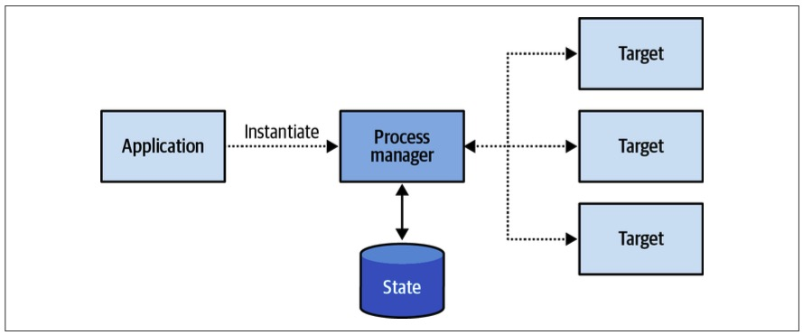

*Figure 9-14. Process manager*

As a simple rule of thumb, if a saga contains if-else statements to choose the correct course of action, it is probably a process manager.

> 作为一个简单的经验法则，如果一个传奇包含 if-else 语句来选择正确的操作过程，那么它可能是一个流程管理器。

---

Another difference between a process manager and a saga is that a saga is instantiated implicitly-含蓄地,暗中地 when a particular event is observed, as in CampaignActivated in the preceding examples.

> 流程管理器和 saga 之间的另一个区别是，当观察到特定事件时，saga 是隐式实例化的，如前面示例中的CampaignActivated。

A process manager, on the other hand, cannot be bound to a single source event.

> 另一方面，流程管理器不能绑定到单个源事件。

Instead, it’s a coherent-连贯的 business process consisting of multiple steps.

> 相反，它是由多个步骤组成的连贯业务流程。

Hence, a process manager has to be instantiated explicitly.

> 因此，必须显式地实例化流程管理器。

Consider the following example:

---

Booking a business trip-旅行,旅游 starts with the routing algorithm choosing the most cost-effective flight-航班,班机 route and asking the employee to approve it.

> 预订商务旅行首先是路由算法选择最具成本效益的航班路线并请求员工批准。

In case the employee prefers a different route, their direct manager needs to approve it.

> 如果员工喜欢不同的路线，他们的直接经理需要批准。

After the flight-航班,班机 is booked-预订,预约, one of the preapproved hotels has to be booked for the appropriate dates.

> 预订航班后，必须在适当的日期预订一家预先批准的酒店。

If no hotels are available, the flight tickets have to be canceled.

> 如果没有旅馆，机票就得取消。

---

In this example, there is no central entity to trigger the trip booking process.

> 在本例中，没有触发旅行预订流程的中心实体。

The trip booking is the process and it has to be implemented as a process manager (see Figure 9-15).

> 旅行预订是流程，它必须作为流程管理器来实现(参见图9-15)。

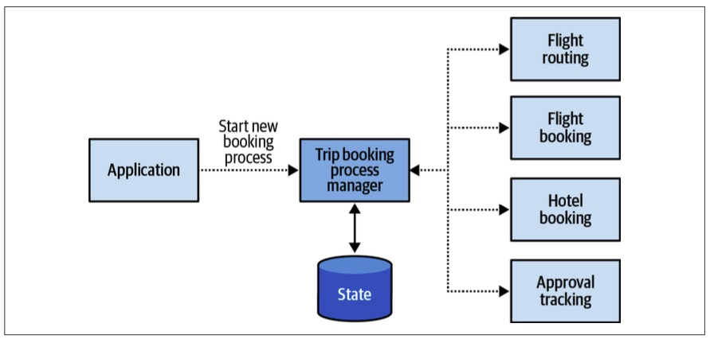

*Figure 9-15. Trip booking process manager*

---

From an implementation perspective, process managers are often implemented as aggregates, either state based or event sourced.

> 从实现的角度来看，流程管理器通常被实现为聚合，或者是基于状态的，或者是事件源的。

For example:

~~~java
public class BookingProcessManager {
  private readonly IList<IDomainEvent> _events; 
  private BookingId _id;
  private Destination _destination;
  private TripDefinition _parameters;
  private EmployeeId _traveler;
  private Route _route;
  private IList<Route> _rejectedRoutes; 
  private IRoutingService _routing;
  
	//...
  
  public void Initialize(Destination destination, TripDefinition parameters, EmployeeId traveler){
    _destination = destination;
    _parameters = parameters;
    _traveler = traveler;
    _route = _routing.Calculate(destination, parameters);

    var routeGenerated = new RouteGeneratedEvent( BookingId: _id, Route: _route);
	  var commandIssuedEvent = new CommandIssuedEvent( command: new RequestEmployeeApproval(_traveler, _route));       
    _events.Append(routeGenerated);
    _events.Append(commandIssuedEvent);
  }
  

  public void Process(RouteConfirmed confirmed) {
    var commandIssuedEvent = new CommandIssuedEvent( command: new BookFlights(_route, _parameters));
    _events.Append(confirmed);
    _events.Append(commandIssuedEvent);
  }
  
  public void Process(RouteRejected rejected) {
    var commandIssuedEvent = new CommandIssuedEvent( command: new RequestRerouting(_traveler, _route));
    _events.Append(rejected);
    _events.Append(commandIssuedEvent);
  }
  
  public void Process(ReroutingConfirmed confirmed) {
    _rejectedRoutes.Append(route);
    _route = _routing.CalculateAltRoute(destination,parameters, rejectedRoutes); 
    var routeGenerated = new RouteGeneratedEvent(BookingId: _id, Route: _route);
    var commandIssuedEvent = new CommandIssuedEvent(command: new RequestEmployeeApproval(_traveler, _route));
    _events.Append(confirmed);
    _events.Append(routeGenerated);
    _events.Append(commandIssuedEvent);
  }

  public void Process(FlightBooked booked) {
    var commandIssuedEvent = new CommandIssuedEvent( command: new BookHotel(_destination, _parameters));
    _events.Append(booked);
    _events.Append(commandIssuedEvent);

  }
  
  //... 

}
~~~

In this example, the process manager has its explicit ID and persistent state, describing the trip that has to be booked.

> 在本例中，流程管理器具有其显式ID和持久状态，用于描述必须预订的旅行。

As in the earlier example of a saga pattern, the process manager subscribes to events that control the workflow (RouteConfirmed, RouteRejected, ReroutingConfirmed, etc.), and it instantiates events of type Command Issued Event that will be processed by an outbox relay to execute the actual commands.

> 与前面的传奇模式示例一样，流程管理器订阅控制工作流的事件(routecconfirmed、routerejded、ReroutingConfirmed等)，并实例化Command Issued Event类型的事件，这些事件将由发件箱中继处理，以执行实际的命令。

# Conclusion

> 总结

In this chapter, you learned the different patterns for integrating a system’s components.

> 在本章中，您学习了集成系统组件的不同模式。

The chapter began by exploring patterns for model translations that can be used to implement anticorruption-反腐败,反贪污 layers or open-host services.

> 本章首先探讨了可用于实现反腐败层或开放主机服务的模型转换模式。

We saw that translations can be handled on the fly or can follow a more complex logic, requiring state tracking.

> 我们看到，翻译可以动态处理，也可以遵循更复杂的逻辑，需要状态跟踪。

---

The outbox pattern is a reliable way to publish aggregates’ domain events.

> 发件箱模式是发布聚合域事件的可靠方式。

It ensures that domain events are always going to be published, even in the face of different process failures.

> 它确保域事件总是会被发布，即使面对不同的流程故障也是如此。

---

The saga pattern can be used to implement simple cross-component business processes.

> saga 模式可用于实现简单的跨组件业务流程。

More complex business processes can be implemented using the process manager pattern.

> 可以使用流程管理器模式实现更复杂的业务流程。

Both patterns rely on asynchronous reactions to domain events and the issuing of commands.

> 这两种模式都依赖于对域事件的异步反应和命令的发出。

