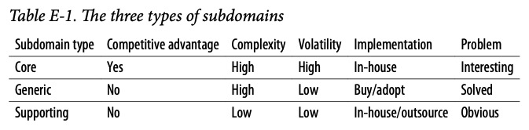
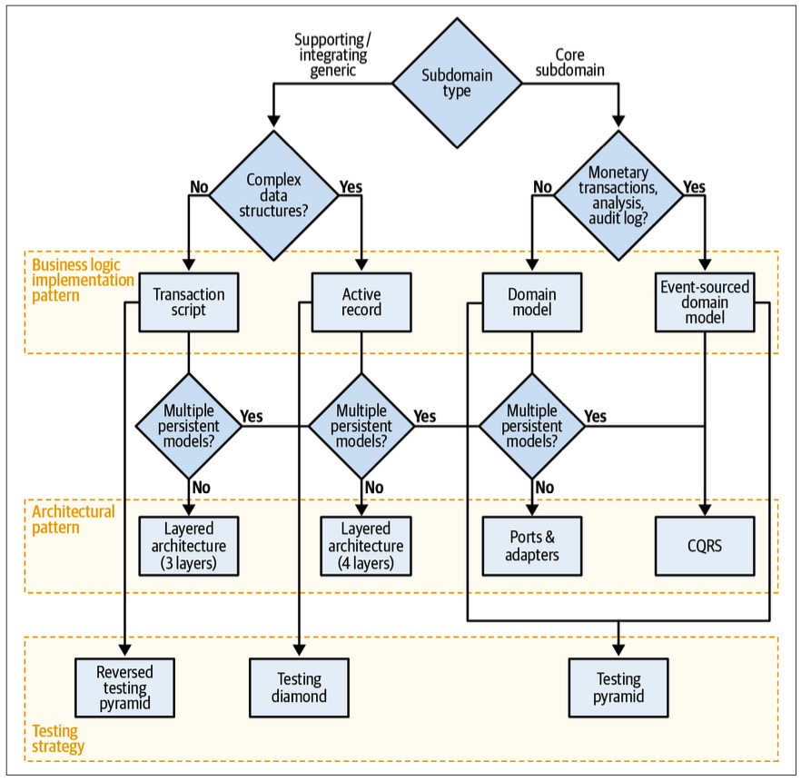

> Closing Words
>
> 结语

To complete our exploration of domain-driven design I want to get back to the quote-引用 we started with：

> 为了完成我们对领域驱动设计的探索，我想回到我们开始的引用：

There is no sense in talking about the solution before we agree on the problem, and no sense talking about the implementation steps before we agree on the solution.

> 在我们就问题达成一致之前谈论解决方案是没有意义的，在我们就解决方案达成一致之前谈论实施步骤也是没有意义的。

​																			—Efrat Goldratt-Ashlag

This quote neatly-整齐地,整洁地 summarizes our DDD journey.

> 这句话简洁地总结了我们的DDD之旅。

# Problem

To provide a software solution, we first have to understand the problem: what is the *business domain* that we are working in, what are the business goals, and what is the strategy for achieving them.

> 要提供软件解决方案，我们首先必须理解问题：我们正在工作的**业务领域**是什么，业务目标是什么，以及实现它们的策略是什么。

---

We used the *ubiquitous language* to gain a deep understanding of the business domain and its logic that we have to implement in software.

> 我们使用**统一语言**来深入理解业务领域及其必须在软件中实现的逻辑。

---

You learned to manage the complexity of the business problem by breaking it apart-分开,拆开 into *bounded contexts*.

> 您学会了通过将业务问题分解为“有界的上下文”来管理业务问题的复杂性。

Each bounded context implements a single model of the business domain, aimed at solving a specific problem.

> 每个有界上下文实现业务域的单个模型，旨在解决特定的问题。

---

We discussed how to identify and categorize the building blocks of business domains: *core*, *supporting*, and *generic subdomains*. 

> 我们讨论了如何识别和分类业务域的构建块：**核心**、**支持**和**通用子域**。

Table E-1 compares these three types of subdomains.

> 表E-1 对这三种子域进行了比较。

# Solution

You learned to leverage this knowledge to design solutions optimized for each type of subdomain.

> 您学习了如何利用这些知识来设计针对每种类型的子域进行优化的解决方案。

We discussed four business logic implementation patterns—*transaction script*, *active record*, *domain model*, and *event sourced domain model—*and the scenarios in which each pattern shines.

> 我们讨论了四种业务逻辑实现模式——*事务脚本*、*活动记录*、*域模型*和*事件源域模型*——以及每种模式发挥作用的场景。

You also saw three architectural patterns that provide the required scaffolding-脚手架 for the implementation of business logic: *layered architecture*, *ports & adapters*, and *CQRS*.

> 您还看到了提供实现业务逻辑所需的支架(脚手架)的三种体系结构模式：分层体系结构*、端口和适配器*和*CQRS*。

Figure E-1 summarizes the heuristics-启发式的 for tactical decision-making using these patterns.

> 图E-1总结了使用这些模式进行战术决策的启发式方法。

*Figure E-1. Decision tree summarizing heuristics for tactical decision-making*

